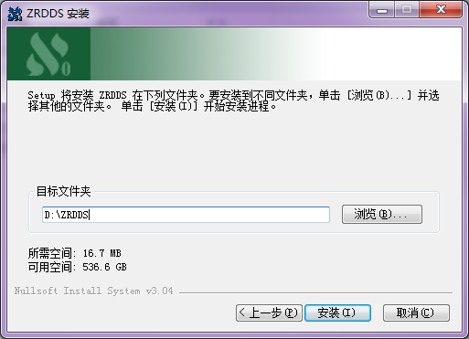
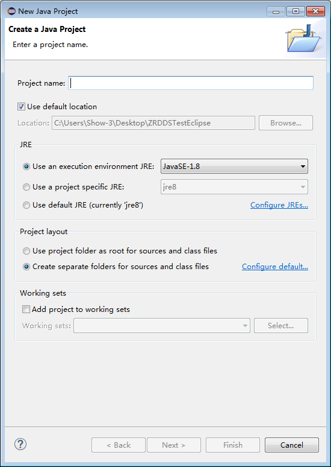
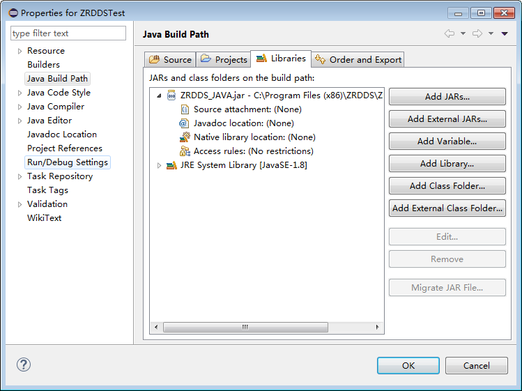
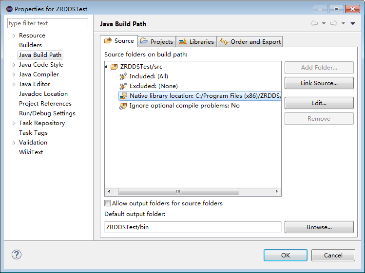
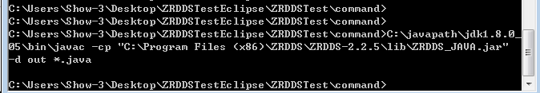
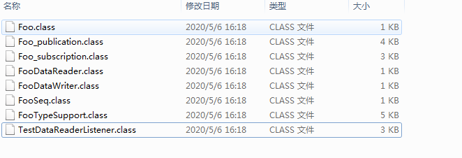
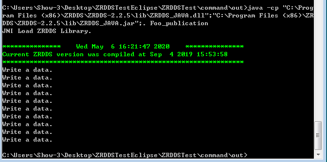

# ZRDDS安装配置手册-Java

## 1. 安装环境要求

### 1.1. 硬件环境

CPU：奔腾 4 及以上级别 x86 兼容处理器；华睿 2 号等嵌入式处理器

内存：256M

磁盘空间：开发机 500M，运行机取决于应用大小

网络：10M 及以上支持 TCP/IP 协议以太网、RapidIO

### 1.2. 软件环境

表 1 臻融数据分发服务 DDS 系统软件软件环境要求

| 操作系统 | 系统最低版本 | 依赖环境 |
| --- | --- | --- |
| Windows | Windows XP | java-jdk1.8以上 |

## 2. 安装与配置

### 2.1. 安装

第一步：双击安装包，启动安装程序，若杀毒软件或防火墙弹出警告，请允许安装程序

运行或将安装程序添加到白名单。点击“下一步”。

> 
>
> **图示信息：**
> - ZRDDS installation wizard welcome screen with instructions and navigation buttons.
> - Window title: 'ZRDDS 安装'
> - Logo text: '臻融科技'
> - Main heading: '欢迎使用 ZRDDS 安装向导'
> - Instruction: '在开始安装之前，建议先关闭其他所有应用程序。这将允许“安装程序”更新指定的系统文件，而不需要重新启动你的计算机。'
> - Action button: '[下一步 (N)] 继续'
> - Cancel button: '取消 (C)'

第二步：选择安装路径后，并点击“安装”。

> 
>
> **图示信息：**
> - ZRDDS installation wizard window showing target directory selection and space requirements.
> - Window title: 'ZRDDS 安装'
> - Target folder field: 'D:\ZRDDS'
> - Required space: '16.7 MB'
> - Available space: '536.6 GB'
> - Installer system: 'Nullsoft Install System v3.04'
> - Buttons: '[上一步 (B)]', '[安装 (I)]', '[取消 (C)]', and '[浏览 (B)...]'

第三步：等待安装完成。

> 
>
> **图示信息：**
> - ZRDDS installation window showing extraction progress of multiple Visual Studio project filter files using Nullsoft Install System v3.04.
> - Window title: 'ZRDDS 安装'
> - Status message: '正在安装，请等候。'
> - Progress bar labeled: '抽取: LifespanQos_Subscription_x64Win64VS2015.vcxproj.filters'
> - List of extracted files with 100% completion, including versions for VS2008, VS2010, VS2013, VS2015 (x64 and x86)
> - Installer engine: 'Nullsoft Install System v3.04'
> - Navigation buttons: '`< 上一步 (B) >`', '`< 下一步 (N) >`', '取消 (C)'

第四步：若安装过程中出现如下图所示的提示框，代表在本次安装之前，机器中已经安

装过 ZRDDS，此次安装会替换关于 ZRDDS 的环境变量。点击”确定”。

> 
>
> **图示信息：**
> - A ZRDDS installation dialog box showing a completion message after environment variable update.
> - Window title: 'ZRDDS 安装'
> - Message text: '系统环境变量已更新，旧版本文件仍为您保留原路径'
> - Button label: '确定'

第五步：安装程序会在系统中设置环境变量，为了使环境变量起效，需要重新启动计算

机，用户在使用 ZRDDS 之前重启即可。

> 
>
> **图示信息：**
> - A Windows-style dialog box titled 'ZRDDS 安装' displaying a reboot instruction and a confirmation button.
> - Window title: 'ZRDDS 安装'
> - Main message: '请重启计算机，使环境变量生效'
> - Button label: '确定'

第六步：安装完后，点击“完成”。

> 
>
> **图示信息：**
> - ZRDDS installation wizard final screen indicating successful installation, with options to open manuals and a 'Finish' button.
> - Title bar: 'ZRDDS 安装'
> - Main message: '正在完成 ZRDDS 安装向导'
> - Status line: 'ZRDDS 已安装在你的系统。单击 [完成(F)] 关闭此向导。'
> - Checked checkbox: '打开编程手册'
> - Checked checkbox: '打开安装配置手册'
> - Bottom buttons: '`< 上一步(B) >`', '完成(F)', '取消(C)'

至此，臻融数据分发服务 DDS 系统软件已经成功安装到计算机上。

### 2.2. ZRDDS 授权文件获取步骤

- 双击运行安装目录`/bin/LicenceInfoUtil.exe` 获取授权信息；

- 运行成功将会有提示，将同一目录的 zrddsregInfo.txt 或二维码 zrddsregInfo.bmp 发

送给臻融软件科技有限公司；

- 接收臻融软件科技有限公司生成的授权文件 zrddslicence.lic；

- 将授权文件放在 ZRDDS 安装目录或者 ZRDDS 运行程序同一目录即可完成 ZRDDS 应

用授权；

- 授权文件仅能够在获取授权信息的那台机器上面使用。

### 2.3. 创建数据类型支持文件

由于 DDS 中允许用户使用自定义的数据类型进行数据发布和订阅，因此需要用户在使

用 DDS 编写应用程序前定义所使用的数据类型。数据类型通过 IDL 文件定义，IDL 文件具体

格式见 ZRDDS 用户手册第 3 章。IDL 文件编写完成后，需要使用到安装目录中 bin 目录下的

zrddsgen.exe 进行编译，生成支持文件。zrddsgen.exe 通过命令行运行，需要使用 Windows

中的命令提示符进入到其目录下运行，通常情况下的运行参数如下：

zrddsgen.exe –i [inputFile] –d [outputDir] –l java

其中[inputFile]替换为用户的 IDL 文件，[outputDir]替换为支持文件输出的目录。更多参

数的信息见 ZRDDS 用户手册第 3 章。

假定用户定义的数据类型名称为 Foo，使用 zrddsgen.exe 生成的支持文件总共有五个，

分别为：Foo.java、FooDataRreader.java、FooSeq.java、FooDataWriter.java、FooTypeSupport.java。

使用 zrddsgen.exe 生成的支持文件可以使用在所有 ZRDDS 支持的操作系统上。

### 2.4. 配置工程

在 Windows 平台上，臻融数据分发服务 DDS 支持多种 IDE，此处以 eclipse 为例

#### 2.4.1. 创建工程

- 单击 File。

- 单击 New。

- 选择 Java Project，填写项目名，创建一个工程。

> 
>
> **图示信息：**
> - Eclipse 'Create a Java Project' dialog with project name field empty, default location set, JRE selection showing 'JavaSE-1.8', and project layout option 'Create separate folders for sources and class files' selected.
> - Project name field is empty
> - Location: C:\Users\Show-3\Desktop\ZRDDSTestEclipse
> - JRE selected: 'Use an execution environment JRE: JavaSE-1.8'
> - Project layout: 'Create separate folders for sources and class files' is selected
> - Working sets section: 'Add project to working sets' checkbox is unchecked

- 将 zrddsgen.exe 生成的文件添加到工程 （ Foo.java 、 FooDataRreader.java 、

FooDataWriter.java、FooSeq、FooTypeSupport.java）。

#### 2.4.2. 配置链接库

##### 2.4.2.1. 链接 ZRDDS_JAVA.jar

- 右键工程->properties->Java Bulid Path->Libraries 选择 Add External JARS…，选择安装

目录下的 ZRDDS_JAVA.jar 文件。

> 
>
> **图示信息：**
> - Eclipse IDE 'Properties for ZRDDSTest' dialog showing the 'Java Build Path' > 'Libraries' tab with two entries: ZRDDS_JAVA.jar and JRE System Library [JavaSE-1.8].
> - Left navigation pane highlights 'Run/Debug Settings' under 'Resource'
> - Main panel tab selected: 'Libraries'
> - JAR entry: 'ZRDDS_JAVA.jar - C:\Program Files (x86)\ZRDDS\Z'
> - JAR metadata: 'Source attachment: (None)', 'Javadoc location: (None)', 'Native library location: (None)', 'Access rules: (No restrictions)'
> - Second entry: 'JRE System Library [JavaSE-1.8]'
> - Right-side action buttons: 'Add JARs...', 'Add External JARs...', 'Add Variable...', 'Add Library...', 'Add Class Folder...', 'Add External Class Folder...', 'Edit...', 'Remove', 'Migrate JAR File...'

##### 2.4.2.2. 链接动态库 ZRDDS_JAVA.dll

- 右键工程->properties->Java Bulid Path->Source，展开工程目录，双击 Native library

location，External Folder…，选择安装目录下的 lib 目录。

> 
>
> **图示信息：**
> - Eclipse IDE Properties dialog for project 'ZRDDSTest', showing the Java Build Path configuration tab.
> - Project name in title: 'Properties for ZRDDSTest'
> - Selected left-side category: 'Java Build Path'
> - Source folder listed: 'ZRDDSTest/src' with 'Included: (All)' and 'Excluded: (None)'
> - Native library location: 'C:/Program Files (x86)/ZRDDS'
> - Default output folder: 'ZRDDSTest/bin'
> - Button labels visible: 'Add Folder...', 'Link Source...', 'Edit...', 'Remove', 'Browse...', 'OK', 'Cancel'

#### 2.4.3. 运行

直接添加 main 函数或者使用编译器–e 命令生成的 Foo_publication.java 或者

Foo_subscriber.java 编译运行即可。

### 2.5. 命令行编译运行

使用 zrddsgen.exe 生成文件（Foo.java、FooDataRreader.java、FooDataWriter.java、FooSeq、

FooTypeSupport.java，Foo_publication.java）。

- 使用 java 编译，将编译输出至文件夹 out 下：

javac –cp 安装目录`/lib/ZRDDS_JAVA.jar` –d out *.java

> 
>
> **图示信息：**
> - Command-line terminal output showing execution of a Java command with explicit javac compilation and classpath specification.
> - Working directory: C:\Users\Show-3\Desktop\ZRDDSTestEclipse\ZRDDSTest\command
> - javac command: javac -cp "C:\Program Files (x86)\ZRDDS\ZRDDS-2.2.5\lib\ZRDDS_JAVA.jar" -d out *.java
> - Java runtime path referenced: javapath\jdk1.8.0_05\bin\javac
> - Compilation output directory: -d out
> - Source files compiled: *.java

输出

> 
>
> **图示信息：**
> - File explorer view listing Java .class files with columns for name, modification date, type, and size.
> - File names: Foo.class, Foo_publication.class, Foo_subscription.class, FooDataReader.class, FooDataWriter.class, FooSeq.class, FooTypeSupport.class, TestDataReaderListener.class
> - All files have modification date '2020`/5/6` 16:18'
> - All files are of type 'CLASS 文件' (CLASS file)
> - File sizes: Foo.class (1 KB), Foo_publication.class (4 KB), Foo_subscription.class (3 KB), FooDataReader.class (1 KB), FooDataWriter.class (1 KB), FooSeq.class (1 KB), FooTypeSupport.class (5 KB), TestDataReaderListener.class (3 KB)

- 进入 out 文件夹下使用 java 运行：

java –cp [ZRDDS_JAVA.jar];[ZRDDS_JAVA.dll];. Foo_publication

Foo_publication.java 中带有 main 函数

> 
>
> **图示信息：**
> - Console output showing execution of a Java program that loads the ZRDDS library and repeatedly prints 'Write a data.'
> - Command line: java -cp "C:\Program Files (x86)\ZRDDS\ZRDDS-2.2.5\lib\ZRDDS_JAVA.dll";"C:\Program Files (x86)\ZRDDS\ZRDDS-2.2.5\lib\ZRDDS_JAVA.jar"; Foo_publication
> - JNI Load ZRDDS Library.
> - Current ZRDDS version was compiled at Sep 4 2019 15:53:58
> - Timestamp: Wed May 6 16:21:47 2020
> - Repeated output: 'Write a data.' (9 times)
