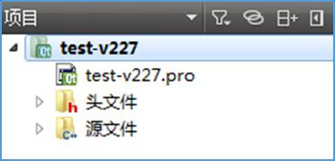
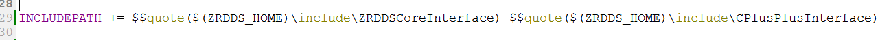
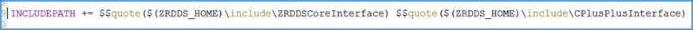
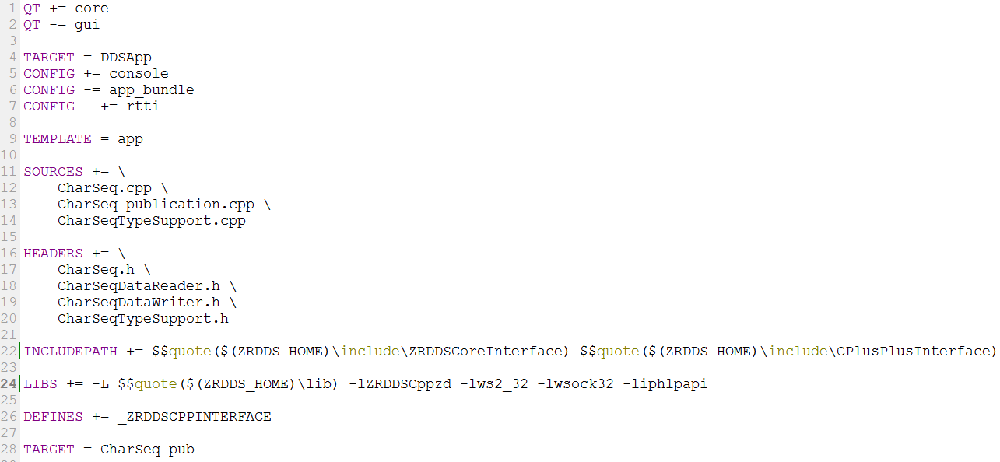

# ZRDDS安装配置手册-QtCreator

## 1. 环境简述

在 Windows 中，ZRDDS 可在 QT 环境下使用。具体环境如下：

 mingw 版本为 4.8.2。

 qt 安装版本为 4.8.3（qt-win-opensource-4.8.3-mingw.exe）。

 Qt Creator 安装版本为 3.4.0（qt-creator-opensource-windows-x86-3.4.0.exe）。

## 2. 项目配置

要使用 ZRDDS 中间件需要包含头文件所在目录，库文件所在目录，库文件名，使用 C++

库需要添加预编译符。以上配置可在 Qt Creator 创建的项目中的.pro 文件中手动设置，具体

设置方式如下：

```text
 头文件目录：在.pro 文件（图 1）中键入 INCLUDEPATH += dir1 dir2，dir1，dir2 为头
文件目录，用 C++语言为$$quote($(ZRDDS_HOME)\include\ZRDDSCoreInterface)和
$$quote($(ZRDDS_HOME)\include\CPlusPlusInterface) ； 用 C 语言为 $$quote
```

(`$(ZRDDS_HOME)\include\ZRDDSCoreInterface)` 和 $$quote

(`$(ZRDDS_HOME)\include\CInterface)`。其中`$(ZRDDS_HOME)`为 ZRDDS 安装目录，用

`$$quote()`包住每条路径（图 2、图 3），以避免路径中包含空格所引起的编译错误。

> 
>
> **图示信息：**
> - Qt Creator project explorer view showing a project named 'test-v227' with its .pro file and two folders: '头文件' (header files) and '源文件' (source files).
> - Project name: test-v227
> - Project file: test-v227.pro
> - Folder label: 头文件 (with 'h' icon)
> - Folder label: 源文件 (with 'c++' icon)
> - Top-level item labeled '项目'

图 1 项目的 pro 文件

> 

```text
INCLUDEPATH += $$quote($(ZRDDS_HOME)\include\ZRDDSCoreInterface) $$quote($(ZRDDS_HOME)\include\CPlusPlusInterface)
```

图 2 C++头文件目录

> 

```text
INCLUDEPATH += $$quote($(ZRDDS_HOME)\include\ZRDDSCoreInterface) $$quote($(ZRDDS_HOME)\include\CPlusPlusInterface)
```

图 3 C 头文件目录

```text
 库文件及其所在目录：在.pro 文件中键入 LIBS += -L dir –llib。dir 为库文件所在目录，
跟在-L 之后，为$$quote($(ZRDDS_HOME)\lib)。lib 为库文件名，不带后缀，跟在-l
```

之后，分为 ZRDDS 库（见表 1）以及 Windows 相关库（ws2_32，wsock32，iphlpapi）。

表 1 Window 下 qt 环境库文件选择

| 语言 | 编译所需库文件 | 说明 | 预编译符 |
| --- | --- | --- | --- |
| C++ | ZRDDSCppzd.lib | Debug版本静态库 | _ZRDDSCPPINTERFACE |
|  | ZRDDSCppz.lib | Release版本静态库 | _ZRDDSCPPINTERFACE |
| C | ZRDDSCzd.lib | Debug版本静态库 |  |
|  | ZRDDSCz.lib | Release版本静态库 |  |

 预编译符：在.pro 文件中键入 DEFINES += _ZRDDSCPPINTERFACE。使用 ZRDDS 的 C++

库时需要添加这个预编译符。

> 
>
> **解析代码：**

```text
DEFINES += _ZRDDSCPPINTERFACE
```

图 4 预编译符

 编译设置：若出现 not permitted with -fno-rtti 问题，在.pro 文件中键入 CONFIG += rtti。

> 

```text
8 CONFIG  += rtti
```

图 5 编译设置 rtti

至此，Windows 下 qt 环境 ZRDDS 项目配置完成，以 C++为例，图 6 为具体配置示例。

> 

```text
1 QT += core
2 QT -= gui
3 
4 TARGET = DDSApp
5 CONFIG += console
6 CONFIG -= app_bundle
7 CONFIG    += rtti
8 
9 TEMPLATE = app
10 
11 SOURCES += \
12     CharSeq.cpp \
13     CharSeq_publication.cpp \
14     CharSeqTypeSupport.cpp
15 
16 HEADERS += \
17     CharSeq.h \
18     CharSeqDataReader.h \
19     CharSeqDataWriter.h \
20     CharSeqTypeSupport.h
21 
22 INCLUDEPATH += $$quote($(ZRDDS_HOME)\include\ZRDDSCoreInterface) $$quote($(ZRDDS_HOME)\include\CPlusPlusInterface)
23 
24 LIBS += -L $$quote($(ZRDDS_HOME)\lib) -lZRDDSCppzd -lws2_32 -lwsock32 -liphlpapi
25 
26 DEFINES += _ZRDDSCPPINTERFACE
27 
28 TARGET = CharSeq_pub
```

图 6 pro 配置
