# ZRDDS用户手册

臻融数据分发服务 DDS 系统软件

（版本号：V2.0）

用户手册

> 
>
> **图示信息：**
>
> - A blue square seal stamp with white Chinese characters arranged in a 2x2 grid, featuring a distressed/ink-blotted border.

单位名称：南京臻融科技有限公司

公司地址：南京市江宁区将军大道南佑路 7 号

公司电话：025-52106986

网址：www.zrtechnology.com

邮编：211106

目录

PART 1 背景介绍............................................................................................................................... 1

第 1 章概述 ................................................................................................................................. 1

1.1 分布式系统 ............................................................................................................. 1

1.2 中间件 ..................................................................................................................... 2

1.3 发布/订阅模型 ....................................................................................................... 3

1.4 DDS 介绍 ................................................................................................................. 3

1.5 ZRDDS 概述 ............................................................................................................. 4

第 2 章以数据为中心的发布/订阅通信模型 ............................................................................ 6

2.1 DCPS 介绍 ............................................................................................................... 6

2.2 数据类型 ................................................................................................................. 6

2.3 域/域参与者 ........................................................................................................... 7

2.4 主题......................................................................................................................... 8

2.5 发布者/订阅者 ....................................................................................................... 8

2.6 服务质量（QoS） .................................................................................................. 9

2.7 键、实例、样本 ..................................................................................................... 9

PART 2 基本概念............................................................................................................................. 12

第 3 章快速开始 ....................................................................................................................... 12

3.1 编写 IDL 文件........................................................................................................ 12

3.2 编译 IDL 文件........................................................................................................ 12

3.3 运行示例代码 ....................................................................................................... 15

第 4 章数据类型 ....................................................................................................................... 16

4.1 数据类型介绍 ....................................................................................................... 17

4.2 DDS 编译器 ........................................................................................................... 21

第 5 章实体 ............................................................................................................................... 25

5.1 实体的相关操作 ................................................................................................... 25

5.2 QoS 策略 ............................................................................................................... 31

5.3 Listener .................................................................................................................. 34

5.4 Status..................................................................................................................... 38

5.5 Condition 与 WaitSets ........................................................................................... 39

第 6 章域/域参与者 ................................................................................................................. 43

6.1 Domain 和 DomainParticipant 的基本概念 ......................................................... 43

6.2 DomainParticipantFactory ..................................................................................... 46

6.3 DomainParticipant ................................................................................................ 49

第 7 章主题 ............................................................................................................................... 60

7.1 TopicDescription .................................................................................................... 60

7.2 Topic ...................................................................................................................... 61

7.3 ContentFilteredTopic ............................................................................................. 66

7.4 TypeSupport .......................................................................................................... 72

第 8 章发布数据 ....................................................................................................................... 73

8.1 概述：数据发布过程 ........................................................................................... 73

8.2 Publisher ............................................................................................................... 74

8.3 DataWriter ............................................................................................................. 80

第 9 章订阅数据 ....................................................................................................................... 90

9.1 概述：数据订阅过程 ........................................................................................... 90

9.2 Subscriber.............................................................................................................. 92

9.3 DataReader ............................................................................................................ 98

第 10 章 QoS 策略 ..................................................................................................................... 119

```text
10.1 AsynchronousPublisherQosPolicy (DDS Extension) ............................................. 120
10.2 BatchQosPolicy(DDS Extension) .......................................................................... 121
10.3 DataWriterMessageModeQosPolicy(DDS Extension).......................................... 124
```

10.4 DeadlineQosPolicy............................................................................................... 125

10.5 DestinationOrderQosPolicy ................................................................................. 126

10.6 DiscoveryConfigQosPolicy(DDS Extension) ......................................................... 128

10.7 DurabilityQosPolicy ............................................................................................. 128

10.8 EntityFactoryQosPolicy ........................................................................................ 130

10.9 GroupDataQosPolicy ........................................................................................... 130

10.10 HistoryQosPolicy ................................................................................................. 131

10.11 LifespanQosPolicy................................................................................................ 133

10.12 LivelinessQosPolicy.............................................................................................. 134

10.13 LogQosPolicy ....................................................................................................... 136

10.14 MsgStatisticsInfoQosPolicy.................................................................................. 137

10.15 OwnershipQosPolicy ........................................................................................... 138

10.16 OwnershipStrengthQosPolicy .............................................................................. 140

10.17 PartitionQosPolicy ............................................................................................... 141

10.18 PresentationQosPolicy ........................................................................................ 143

```text
10.19 DataWriterProtocolQosPolicy(DDS Extension) .................................................... 146
10.20 PublishModeQosPolicy (DDS Extension) ............................................................. 147
```

10.21 RapidIOConfigQosPolicy ...................................................................................... 148

10.22 RapidIOControllerQosPolicy ................................................................................ 149

10.23 ReaderDataLifecycleQosPolicy ............................................................................ 149

10.24 ReceiverThreadConfigQosPolicy (DDS Extension) ............................................... 151

10.25 ReliabilityQosPolicy ............................................................................................. 152

10.26 ResourceLimitsQosPolicy .................................................................................... 154

10.27 ThreadCoreAffinityQosPolicy (DDS Extension) .................................................... 155

10.28 TimeBasedFilterQosPolicy ................................................................................... 156

10.29 TopicDataQosPolicy ............................................................................................. 157

10.30 TransportConfigQosPolicy ................................................................................... 158

10.31 UserDataQosPolicy .............................................................................................. 161

10.32 WriterDataLifecycleQosPolicy ............................................................................. 161

10.33 DataWriterResourceLimitsQosPolicy (DDS Extension) ........................................ 163

10.34 DurabilityServiceQosPolicy .................................................................................. 164

10.35 LatencyBudgetQosPolicy ..................................................................................... 164

10.36 TransportPriorityQosPolicy.................................................................................. 165

10.37 PropertyQosPolicy(DDS Extension) ..................................................................... 165

PART 3 应用实例........................................................................................................................... 169

第 11 章创建应用程序 ............................................................................................................. 169

11.1 运行环境要求 ..................................................................................................... 169

11.2 软件安装指南 ..................................................................................................... 169

11.3 生成自定义数据类型文件 ................................................................................. 172

11.4 在 Windows 平台上配置 ZRDDS 应用 ............................................................... 173

11.5 在 Linux 平台配置 ZRDDS 应用 .......................................................................... 178

11.6 创建 ZRDDS 应用程序 ........................................................................................ 179

PART 4 深入理解........................................................................................................................... 187

第 12 章可靠通信模型 ............................................................................................................. 187

12.1 通信模型 ............................................................................................................. 187

12.2 可靠通信模型的报文机制 ................................................................................. 188

12.3 QoS 策略对通信模型的影响 ............................................................................. 191

第 13 章 TCP 并发传输 .............................................................................................................. 198

13.1 掩码值说明 ......................................................................................................... 198

13.2 配置说明 ............................................................................................................. 199

13.3 配置示例 ............................................................................................................. 203

第 14 章 UDP 大包零拷贝 ......................................................................................................... 213

14.1 大包零拷贝配置 ................................................................................................. 213

14.2 UDP 报文时延 ..................................................................................................... 215

14.3 on_data_arrived 回调 ......................................................................................... 217

PART 5 C 语言接口 ......................................................................................................................... 220

第 15 章 C 接口 .......................................................................................................................... 220

15.1 C 接口的简介...................................................................................................... 220

15.2 C 接口使用方式 .................................................................................................. 226

15.3 C 接口使用的注意事项 ...................................................................................... 231

PART 6 多种接口风格及开发流程 ................................................................................................ 232

第 16 章标准协议接口 ............................................................................................................. 232

16.1 标准协议接口的使用 ......................................................................................... 232

16.2 标准协议接口代码示例 ..................................................................................... 234

第 17 章扩展接口 ..................................................................................................................... 236

17.1 扩展接口的使用 ................................................................................................. 237

17.2 标准协议接口代码示例 ..................................................................................... 239

17.3 扩展内容一览 ..................................................................................................... 240

第 18 章简化接口 ..................................................................................................................... 243

18.1 简化接口的使用 ................................................................................................. 243

18.2 简化接口代码示例 ............................................................................................. 247

第 19 章简化接口 SUSTAIN ...................................................................................................... 248

19.1 简化接口 SUSTAIN 的使用 ................................................................................. 248

PART 7 XML 使用 ........................................................................................................................... 249

第 20 章 XML 配置实体 QoS ..................................................................................................... 249

20.1 XML 配置说明 .................................................................................................... 249

20.2 编写 QoS 配置文件 ............................................................................................ 249

20.3 管理 ZRDDS 内部 QoS 仓库 ............................................................................... 252

20.4 QoS 设置相关接口 ............................................................................................. 253

20.5 XML 示例 ............................................................................................................ 254

PART 8 RapidIO 使用 ...................................................................................................................... 257

第 21 章 RapidIO 处理规程 ....................................................................................................... 257

21.1 所支持的运行环境 ............................................................................................. 257

21.2 RapidIO 通信配置模块 ....................................................................................... 257

21.3 零拷贝内置数据类型 ......................................................................................... 260

21.4 任务核亲和性配置模块 ..................................................................................... 260

21.5 数据封装内容配置模块 ..................................................................................... 261

21.6 数据拷贝配置模块 ............................................................................................. 261

第 22 章华睿 2 号+SylixOS 系统上 RapidIO 使用 .................................................................... 263

22.1 运行代理程序 ..................................................................................................... 263

22.2 DDS 应用配置 ..................................................................................................... 264

PART 9 参数配置 ........................................................................................................................ 264

第 23 章可配置性 ..................................................................................................................... 264

23.1 配置说明 ............................................................................................................. 264

23.2 可配置参数 ......................................................................................................... 264

PART 10 Docker 使用 .................................................................................................................. 276

第 24 章 Docker 容器部署 ZRDDS 应用 .................................................................................... 276

24.1 适用范围 ............................................................................................................. 276

24.2 Licence 授权方式 ................................................................................................ 277

24.3 使用步骤 ............................................................................................................. 277

24.4 常见问题 ............................................................................................................. 278

PART 11 ZRDDS 日志使用 ......................................................................................................... 279

第 25 章日志说明 ..................................................................................................................... 279

25.1 日志级别 ............................................................................................................. 279

25.2 日志输出模式 ..................................................................................................... 279

25.3 日志风格 ............................................................................................................. 280

25.4 日志 API .............................................................................................................. 281

第 26 章交互式调试日志 ......................................................................................................... 286

26.1 调试文件书写规范 ............................................................................................. 286

26.2 参数介绍 ............................................................................................................. 286

26.3 调试文件示例 ..................................................................................................... 288

第 27 章分布式日志 ................................................................................................................. 289

27.1 配置方式 ............................................................................................................. 289

27.2 日志信息 ............................................................................................................. 289

27.3 日志类型 IDL 文件 .............................................................................................. 290

PART1 背景介绍

## 第1章概述

臻融数据分发中间件软件（下文中简述为：ZRDDS）是分布式实时的网络中间件。ZRDDS 简化

了应用程序的开发、调度、维护，并且能在多种传输网络环境中对即时数据进行快速、可预测的分

发。

用户可以通过 ZRDDS 实现下列功能：

- 实现一对多和多对多通信方式，应用程序在 DDS 标准下发布/订阅数据；

- 自定义应用程序操作，满足各种实时性、可靠性、服务质量的目标；

- 应用透明，容错，鲁棒性强；

- 使用不同传输方式。

本章将主要介绍分布式系统、中间件、发布/订阅模型的基本概念和常用交流模型，并描述 ZRDDS

的功能如何满足实时系统的需要。

本章主要包括以下内容：

- 分布式系统

- 中间件

- 发布/订阅模型

- DDS 介绍

### 1.1. 分布式系统

分布式系统（Distributed System）是建立在网络之上的软件系统。分布式系统具有高度的内聚

性和透明性。内聚性是指每一个节点高度自治，有本地的数据库管理系统。透明性是指每一个节点

对用户的应用透明，无论是本地还是远程。

分布式系统中的子模块中没有明显的集中点。各个子模块根据自身需要与若干个其它子模块进

行交互。如果一个应用系统中的资源具有显著的分布性，则分布式架构是更好的，甚至是不得不采

取的选择。与集中式相比，分布式具有一些显而易见的优点，例如系统的可扩展性更高，不存在明

显的系统瓶颈以及单一故障点，具有良好的生存能力。

尺有所短寸有所长，与集中式架构相比，分布式架构下的应用系统需要在子系统间的交互方面

付出更高的代价。当整个应用系统需要针对某一类（分布在系统内各个子系统中的）信息达成全局

一致时，分布式架构所付出的交互代价会随着子系统数量的上升而呈指数级上升。因此在实际应用

中，往往采用集中式与分布式混合的架构，例如现在的 web 技术，采用多个内容完全相同的 web

服务器，分别为不同区域的 web 浏览器提供内容。从单个 web 服务器来看，采用的是集中式架构；

而多个 web 服务器之间则采用分布式架构，如图1-1 所示。

> 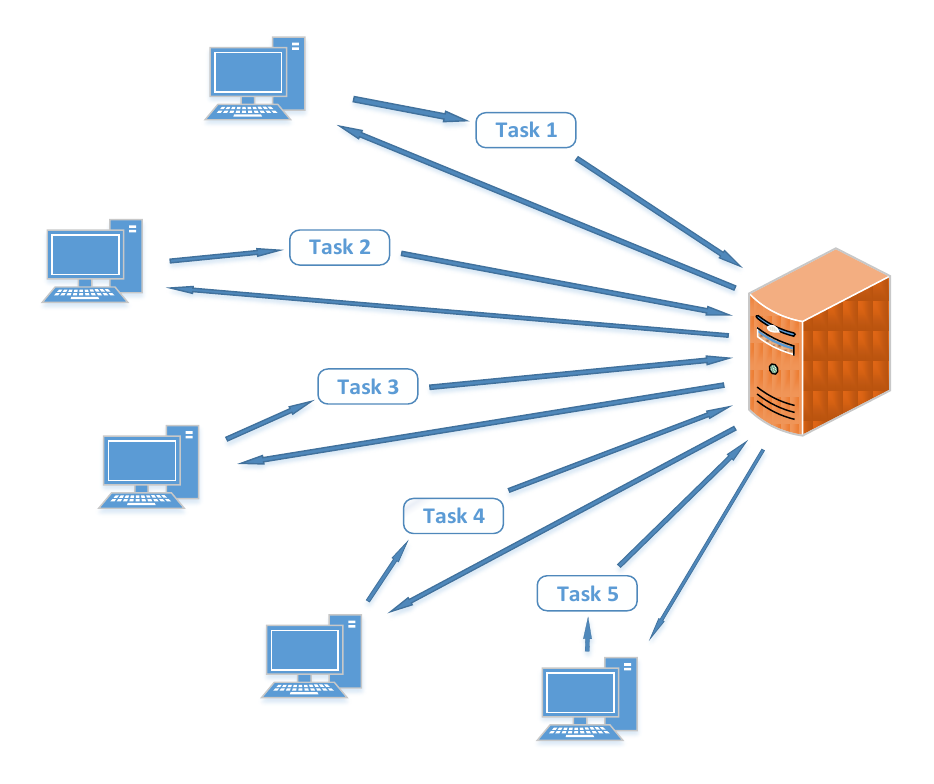
> **图 1-1web 架构和分布式系统**
> **图示信息：** A diagram showing five client computers sending tasks (Task 1 to Task 5) to a central server, with bidirectional arrows indicating communication between clients and the server for each task.
图 1-1web 架构和分布式系统

### 1.2. 中间件

中间件（Middleware）是指操作系统和应用系统之间提供通用性服务的一组软件，相当于操作

系统与应用系统之间的信使。与传统的软件开发库（同样位于操作系统和应用系统之间）相比，中

间件更多地体现了系统架构对于应用系统的组织作用。网络中间件将应用程序从计算机体系结构，

操作系统，网络协议栈中分离，如图1-2 所示。网络中间件能使应用程序不考虑底层网络协议（比

如 TCP，UDP/IP），直接进行数据的发送和接收，从而简化分布式系统的开发。

> 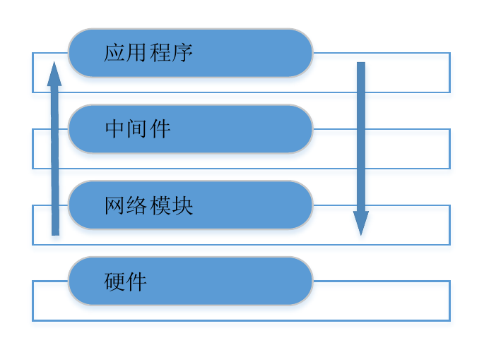
> **图 1-2 网络中间件**
> **图示信息：** A layered architecture diagram showing four horizontal components with vertical arrows indicating bidirectional communication between '应用程序' and '中间件', and a unidirectional downward arrow from '应用程序' to '硬件'.
图 1-2 网络中间件

### 1.3. 发布/订阅模型

发布/订阅模型：ZRDDS 基于发布/订阅通信模型。发布/订阅模型提供了简单直观的方法来分发

数据。它将 ZRDDS 分解为创建和发布数据的 Publisher，以及订阅和使用数据的 Subscriber。Publisher

负责发布数据，Subscriber 负责订阅数据，而数据发布、订阅的细节则由中间件完成。

虽然发布/订阅模型比较简单，但它可以处理复杂模式的信息流。发布/订阅模型越简化，分布

应用程序越模块化。此外，中间件能够自动处理所有网络事件，包括：连接、错误、网络中的变化、

满足应用程序在特定情况下的需要。

### 1.4. DDS 介绍

DDS（数据分发服务）是 OMG 组织面向分布式系统集成领域提出的国际规范。该规范突出了以

数据为中心、模块间松耦合等技术特征，非常适合于开放性和动态性较强的分布式应用系统，也因

此成为了美国海军提出的 OACE（开放体系架构计算环境）的基础支撑技术，用于将各种类型的军

事装备互联为一个整体。像 TCP/IP 等其它曾经的军事技术一样，随着在军事领域的成功应用，DDS

正在被迅速应用于越来越多的领域，例如智慧城市、能源控制、智能家居、物联网以及互联网。

当需要通过网络将各种硬件设备互联在一起，并通过运行在不同设备上的软件对这些设备进行

操纵来完成应用逻辑时，您将会面临如下一系列需要解决的技术问题，而 ZRDDS 有助于解决这些问

题。

- 异构性

需要将多种不同类型的硬件设备采用多种不同类型的网络手段进行互联，这些设备上运行

各种类型的操作系统，需要采用不同的程序语言编写软件，在分布式系统集成中，这些体现在

软硬件类型上的多样性称为异构性。

在大部分应用场景下，异构性是一个不得不面对的问题——设计者需要根据应用特征、预

算等因素采用不同类型的软硬件、网络协议、编程语言各司其职完成与之相适应的任务。但是

异构性对承担系统设计和实现工作的技术人员提出了挑战。为了保证软件在各种软硬件环境中

的顺利运行，要求技术人员熟练掌握所有环境中的开发方法，此外应用系统也会变得复杂而难

以维护。

ZRDDS 针对异构性问题提出了较为全面的解决方案，基于 DDS 规范中的数据发布-订阅接口，

所有环境中的应用可以统一采用数据驱动模式实现自身应用逻辑以及彼此之间的互联。在此过

程中，由于 ZRDDS 面向多种硬件平台、操作系统、通信协议提供了支持，应用系统在集成过程

中感受不到各种环境的差异性，甚至感受不到网络的存在。

- 可靠性

系统作为一个整体可以持续稳定工作的能力。可靠性是大部分系统设计追求的目标，但难

度较高，尤其在大型的分布式应用系统中，软硬件故障、网络故障都有可能造成系统整体的故

障。系统的异构性以及设计人员的经验欠缺也加剧了故障产生的可能性。

高度可靠的分布式系统的设计与实现涉及到包括分布式系统架构、系统容错、任务调度等

一系列技术的综合性运用，在此过程中，技术人员往往顾此失彼。ZRDDS 针对系统的可靠性，

提供了一系列支撑手段，ZRDDS 遵从 DDS 的规范提供了完全分布式的应用框架（P2P 模式），这

意味着任何组成部分的故障都可以得到及时隔离。ZRDDS 提供的数据驱动设计模式则可以帮助

设计者很方便地实现任意组成部分的容错加固，真正使系统在部分故障的情况下仍能保持稳定

的工作状态。

- 保持高性能的持续扩展能力

分布式系统的性能和规模历来被认为是一对难以调和的矛盾。大部分的分布式系统在规模

扩大的情况下，随着软硬件的增加，都会出现性能下降，尤其在技术人员经验不足的情况下，

可能出现系统性能急剧下降的情况。

ZRDDS 针对各种可能的应用环境对自身的处理处理机制进行了全面优化，可以帮助技术人

员在扩展应用系统规模的情况下使整个系统保持较高的性能。在已经完成的性能测试中，采用

ZRDDS 集成的包含大量设备的应用系统中，系统响应速度可以始终保持在微秒级别。

- 系统重构和敏捷集成能力

任何应用系统都会面对应用需求的增加和改变。在分布式系统中，应用需求的改变往往通

过系统重构完成——新的模块加入、原有模块改变或者删除、模块间交互关系发生变化。随着

组件化技术的推广，分布式应用系统通过在不同的设备上加载不同的软件完成指定的系统任务，

并通过引入新的软件组件扩展功能。在引入新的组件的同时若能尽量降低对原有软件组件的修

改、可使系统迅速应对新的需求，形成敏捷集成的能力。

ZRDDS 提供以数据为中心的分布式系统设计模式。该模式下，所有的应用逻辑实现为通过

数据进行彼此关联的分布式系统应用组件。这些应用组件可以部署在系统内的任何一个硬件设

备上，ZRDDS 可以自动在应用组件之间建立关联。新的应用组件可以动态加入到系统内，在对

数据具有相同理解的基础上，不需要对其它任何软件组件进行修改即可实现新功能的增加。

### 1.5. ZRDDS 概述

```text
ZRDDS 遵循 OMG Data Distribution Service (DDS)
Version1.2(http://www.omg.org/spec/DDS/1.2) 以及 The Real-time Publish-Subscribe Wire
ProtocolDDS Interoperability Wire ProtocolSpecification (RTPS)
Version2.1(http://www.omg.org/spec/DDSI/2.1)协议。实现以数据为中心，实现空间、时间上解
```

耦合的中间件，实现 DDS 中提出的全局数据空间的概念，按照逻辑上的主题来组织系统中的所

有数据，应用程序向全局数据空间发布需要分享的主题数据，向系统订阅自己感兴趣的主题数

据，实现 DDS 协议中规定的 QoS 来定制通信的行为。中间件向下屏蔽不同硬件平台、操作系统

以及通信协议，向上提供规范的统一 DDS 应用程序开发接口。

## 第2章以数据为中心的发布/订阅通信模型

本章主要介绍 ZRDDS 面向用户的接口——以数据为中心的发布/订阅通信模型（DCPS，

Data-Centric Publish-Subscribe），以及 DCPS 模型的具体细节，包括：数据类型、域（Domain）、主题

（Topic）、发布者（Publisher）、订阅者（Subscriber）、服务质量（QoS）等。

本章主要包括以下内容：

- DCPS 介绍

- 数据类型

- 域/域参与者

- 主题

- 发布者/订阅者

- 服务质量

- 键、实例、样本

### 2.1. DCPS 介绍

以数据为中心的发布/订阅通信模型（DCPS，Data-Centric Publish-Subscribe）是 OMG DDS 标准

中的一部分。DCPS 是 DDS 标准定义的一个可以在多种不同编程语言环境下有效工作的通信模型。

目前，ZRDDS 提供了 C 语言、C++版本、Java 版本的 API。

通信模型是网络中间件实现通信功能的重要组成部分。网络通信一般采用三种主要类型的通信

模型：Point-to-Point（点对点），Client-Server（客户端-服务器），Publish-Subscribe（发布-订阅）。发

布/订阅通信模型（Publish/Subscribe）是大部分不同类型的应用都会采用的通信模型。DCPS 模型通

过发布/订阅通信模型的机制，满足应用程序的实时性、数据关键性等需求。关于发布/订阅通信模

型的具体内容见 1.3 节。

以数据为中心是 DCPS 的一个基本设计概念。在以数据为中心的通信模型中，进行通信的双方

关注的是数据本身而不是其他因素，比如通信的接口。一个以数据为中心的系统由数据的发布者和

订阅者组成。发布者和订阅者建立通信的基础是双方都已经事先确定了数据类型（数据的结构）。

### 2.2. 数据类型

在以数据为中心的发布/订阅通信中，不同平台、不同编程语言的应用程序之间实现互相通信的

基础是：拥有一套通用的数据类型定义来描述数据。事实上，不同类型的的编程语言之间会使用几

种相同的基本数据类型，例如 int、float、bool、char 等。因此，不同平台、不同编程语言的应用程

序之间可以通过共享基本数据类型的定义来实现互相通信。

此外，如果只能通过几种基本数据类型实现通信的话，互通数据的内容结构局限性太大，因此，

除了共享基本数据类型定义外，还可以通过共享基本数据类型的简单数据结构来实现数据互通。例

如共享 struct 结构及其嵌套结构，用 C/C++语言描述如下：

例 2-1：struct 结构及其嵌套结构。

struct Foo

```text
{
long x1;
shortx2;
};
```

struct ShapeType

```text
{
Foo y1;
float y2;
};
```

由于操作系统、编程语言不同，同一内容的数据定义的表现格式也可能会不同（例如 C++语言

中的bool，在java里为boolean）。因此还需要定义一个通用的数据结构的表现形式来实现不同平台、

不同编程语言的应用程序之间的互通。在 DCPS 模型中，用户可以通过定义 IDL 文件的形式来描述数

据结构。IDL 文件的描述与平台无关，独立于操作系统、编程语言之外。在定义 IDL 文件后，通过

DDS 编译器可以将 IDL 文件描述的数据结构转换为平台相关的数据类型描述文件，详细内容见第3

章。

### 2.3. 域/域参与者

在一个局域网中，可能会有许多应用程序同时在一起工作。通过主题来标识通信数据，可以保

证通信数据流的走向正确无误。但仅仅依靠主题的机制来保证数据流向是不安全的，例如：在研究

阶段的应用程序不适合与已经正常工作的应用程序进行数据交互；非通信数据信息，如内置的发现

信息，不存在主题隔离；由于开发人员组成较为复杂，不能保证主题的唯一性等情况。面对这些情

况，可以通过开设更多物理网络的方式来解决，但这种方式将导致额外的成本开销。因此，将一个

或一组应用程序与局域网中的其它应用程序彻底隔离是必要的，在 DCPS 模型中，这种概念称之为

域（Domain）。

域是一个抽象概念，它表示从逻辑上划分一个物理网络。只有处于同一个域中的应用程序才能

进行数据交互，分属不同域中的应用程序在逻辑上看就和分别归属于两个物理网络的应用程序一样。

当一个应用程序需要与其他应用程序进行通信时，首先需要加入希望通信的应用程序所属的域

中。域参与者（DomainParticipant）是 DCPS 模型向应用程序提供的加入域的接口。域与域之间通过

一个域 ID（DomainId）互相区分，应用程序通过指定域 ID 创建一个 DomainParticipant 加入对应域

中。DomainParticipant 管理主题（Topic）、发布者（Publisher）、订阅者（Subscriber），因此一个

DomainParticipant 下的这些实体也分别归属于 DomainParticipant 所属的域中。此外，应用程序可以

通过创建多个 DomainParticipant 的方式，加入多个域中，但每个 DomainParticipant 管理的实体仅仅

归属于 DomainParticipant 所属的域。关于域的概念，详见第5 章。

### 2.4. 主题

在拥有一套通用的数据结构定义、描述的基础上，DDS 可以实现不同平台、不同编程语言间的

数据交互。然而，当两个应用程序之间使用两种及以上数据类型进行通信时，应用程序并不能区分

订阅到的数据类型究竟是哪一种。此外，有多个应用程序同时进行数据通信时，一个应用程序并不

希望订阅到冗余的消息（发布给其他应用程序的数据信息）。因此有必要通过一种约定的形式标识

通信的数据，在 DCPS 模型中，这个标识被称为主题（Topic）。一个主题只能关联一种数据类型，但

是多个主题可以关联同一个数据类型。

DataWriter 是 DCPS 模型中应用程序进行发布数据的实体，DataReader 是 DCPS 模型中应用程序

进行订阅数据的实体。主题是 DataWriter 和 DataReader 相匹配的关键。一个 DataWriter/DataReader

必须且仅能关联一个主题，只有拥有相同主题的 DataWriter 和 DataReader 之间才能互相匹配通信。

关于 DataWriter/DataReader 更多细节见 2.5 节。

如例 2-2 所示，这是一个统计商店不同类型商品销售状况的系统。应用程序使用数据类

型”TradeRecord”进行数据交互，”TradeRecord”类型记录商品的单价和销售数量。在数据交互中，为

了区分不同类型商品的数据，可以通过创建不同主题（关联”TradeRecord”）的方式进行通信。通过

创建不同的主题进行通信，商品的数据信息不会被其他类型商品的数据终端订阅，从而实现分类统

计。关于主题的更多细节见第6 章。

例 2-2：主题的一个实际用例。

struct TradeRecord

```text
{
float price;
unsigned long count;
};
```

Topic：“fish”

Topic：“meat”

Topic：“vegetable”

### 2.5. 发布者/订阅者

在 DCPS 模型中，应用程序必须使用一系列的 API 创建实体（对象）才能与其他应用程序建立订

阅发布通信。本节主要介绍应用程序使用发布/订阅模型的接口：Publisher/DataWriter，

Subscriber/DataReader。用户可以通过创建一系列实体的方式调用 DCPS 模型的接口，详见第4 章。

发布端通过创建Publisher和DataWriter实体发布数据，订阅端通过创建Subscriber和DataReader

实体订阅数据。DataWriter、DataReader 是数据发布/订阅的实际参与者，他们之间依靠主题相互匹

配并建立连接：每个 DataWriter 和 DataReader 必须且仅能关联一个主题，拥有相同主题的 DataWriter

和 DataReader 之间才能匹配通信，关于主题的详细内容见第6 章。

应用程序通过 DataWriter 发布数据。一个 DataWrier 只能关联一个主题，所以一个 DataWriter

只能发布一种数据类型的数据。一个应用程序可以拥有多个 DataWriter 来发布不同类型的数据。注

意，应用程序可以拥有多个发布相同数据类型的 DataWriter，甚至这些 DataWriter 可以关联相同的

主题。Publisher 是 DataWriter 的管理者，可以创建 DataWriter 或删除其创建的 DataWriter。一个

DataWriter 只能附属于一个 Publisher。对于 Publisher/DataWriter 的详细内容见第7 章。

应用程序通过 DataReader 订阅数据。与 DataWriter 原理相同，一个 DataReader 只能关联一个

主题，所以一个 DataReader 只能订阅一种数据类型的数据。一个应用程序可以拥有多个 DataReader

以订阅不同类型的数据。注意，应用程序可以拥有多个订阅相同数据类型的 DataReader，甚至这些

DataReader 可以关联相同的主题。Subscriber 是 DataReader 的管理者，可以创建 DataReader 或删除

其创建的 DataReader。一个 Subscriber 可以拥有多个 DataReader。一个 DataReader 只能附属于一个

Subscriber。对于 Subscriber/DataReader 的详细内容见第8 章。

### 2.6. 服务质量（QoS）

QoS 允许应用开发者配置通信如何产生，限制中间件使用的资源，发现系统中不相容的内容和

设置错误处理方法。

整个 QoS 机制由许多不同的 QoS 策略组成，这些 QoS 策略分别作用于不同的实体上，如 Topic、

DataWriter、DataReader 等。在发布端，作用于 DataWriter 的 QoS 策略可以配置 DataWriter 发布数

据的行为。在订阅端，作用于 DataReader 的 QoS 策略可以配置 DataReader 订阅数据的行为。

用户可以通过 QoS 策略来配置不同的通信行为。例如 ReliabilityQosPolicy 是控制通信可靠性的

QoS 策略。当设置 ReliabilityQosPolicy 的”kind“成员为”DDS_RELIABLE_RELIABILITY_QOS”时，ZRDDS 在

通信时会采用握手、重传等一系列的机制来保证数据通信的可靠性，保证发布的数据全部到达订阅

端。当设置 ReliabilityQosPolicy 的”kind“成员为”DDS_BEST_EFFORT_RELIABILITY_QOS”时，ZRDDS 在通

信时则会更加注重通信的效率，但不保证通信可靠性，关于 QoS 的详细内容见第 9 章。

### 2.7. 键、实例、样本

一个主题关联一个特定的数据类型，数据类型的数据域可以取任意值。一个主题下数据类型的

一组取值称为该主题的一个样本（sample）。

键是区分同一个主题下的不同实例的标识。键可以看成是主题之上对数据的进一步的划分。对

于一个数据类型，可以选择它的一个或多个数据成员作为键（key）。

数据类型的键域（选择的一个或多个数据成员的数据域）是可以任意取值的，一个主题下的数

据类型的键域的一组取值称为该主题的一个实例（instance）。

当一个主题下的数据类型存在键时，该键域的一个特定取值称为该主题下的一个特定的实例，

并且与非键域的取值组成该主题下的一个样本。注意：不是所有的数据类型都必须定义键，因此不

是所有的主题都有键，如果一个数据类型未定义键，那么关联它的主题下有且仅有一个实例。

假设自定义一个数据类型 MyDataType，其中 x 为键，如例2-3 所示。则一个主题下，键、实例、

样本的关系如图2-1 所示。值得注意的是，键可以由多个成员变量组成。如果在例2-3 中的数据成

员 y 后面也加上”//@key”，那么 MyDataType 对象的键将由数据成员 x 和 y 共同组成。

例 2-3：定义一个数据类型 MyDataType。

struct MyDataType

```text
{
long x;//@key
long y;
long z;
};
```

> 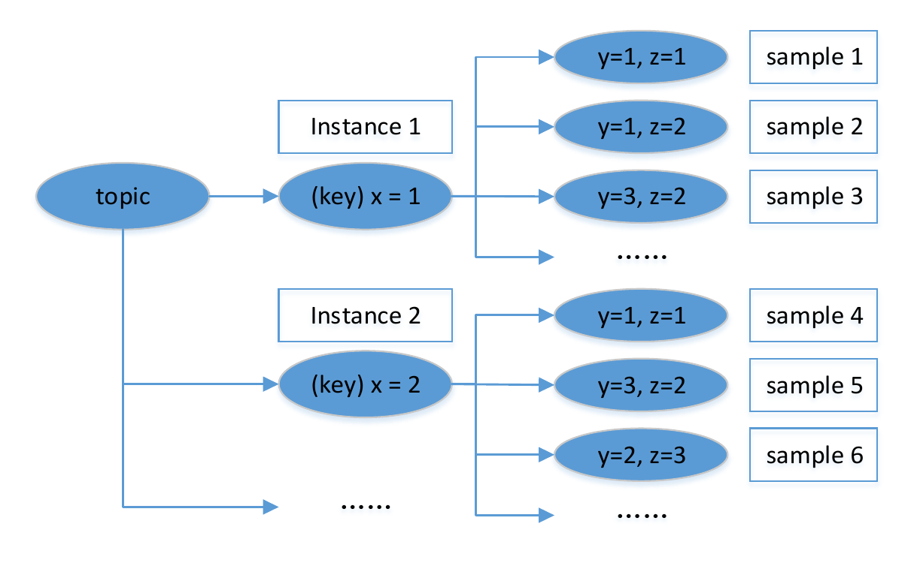
> **图 2-1 键值、实例、样本的关系**
> **图示信息：** A flow diagram illustrating a data-centric publish/subscribe model with topic, key-based instances, and samples.
图 2-1 键值、实例、样本的关系

应用程序在订阅一个主题的数据时，可以收到不同实例的样本。与之对应，应用可以发布主题

中任意数量实例下的样本。此外，很多 QoS（服务质量）策略的作用域为实例，关于 QoS 的详细内

容参考第9 章。

对于 2.4 节中的例子，通过创建不同的主题，可以实现不同类型商品数据信息的定向分发。然

而，该商场的商品种类数量是非常多的，给每一种商品创建一个主题，意味着需要创建大量的 Topic，

对应的也需要创建大量的 DataWriter 和 DataReader。事实上，商场的商品种类数量也不是恒定的，

可能会随着时间变化增加或减少。因此，对应每种商品创建一个主题的方式理论上可行，但并不符

合实际。

针对上述情况，使用带有键值的数据类型就可以很方便的解决。首先修改 TradeRecord 的结构，

添加一个数据成员“trade_kind”代表商品种类，并且将它作为数据类型的键，注意，在数据成员后面

添加”//@key”标识即可将该从数据成员定义成键。所有类型商品的数据信息统一使用主题“Trade”表

示，如例2-4 所示。

```text
当键值 trade_kind = “fish”时，相当于向主题 Trade 注册了一个实例（Instance 1），“price = 10.2,
count = 77”是主题 Trade 下数据成员的一组取值，即一个样本（sample a），而“price = 8.2, count = 10”
是另外一组取值，即另外一个样本（sampleb）。当键值 trade_kind = “meet”时，相当于向主题 Trade
```

又注册了一个新的实例（Instance 2），除非将 Instance 1 销毁，否则主题下的两个实例将同时存在。

关于实例的注册、注销、销毁等操作在 7.3.9 节有更多详细介绍。

应用程序只需要一个 DataWriter 就可以发布所有类型的商品数据信息，只需要改变键值即可。

对应的，应用程序也只需要一个 DataReader 就可以收到“Trade”主题下的所有样本，也就是说会收到

该主题下的所有实例，事实上，在 DDS 协议中允许 DataReader 只订阅特定实例的数据。

例 2-4：带有键值的 TradeRecord 结构。

struct TradeRecord

```text
{
string trade_kind; //@key
float price;
unsigned int count;
};
```

Topic：”Trade“

```text
Instance 1 = （Topic：“Trade”）+（Key：“fish”）
sample a：price = 10.2, count = 77
sample b：price = 8.2, count = 10
Instance 2 = （Topic：“Trade”）+（Key：“meet”）
sample a：price = 15.3, count = 135
sample b：price = 10.3, count = 23
```

总的来说，在 DCPS 模型中，一个实际的数据信息称为样本。样本由一个主题、一个实例以及

实际的数据值组成。

PART 2 基本概念

## 第3章快速开始

本章节将使用 ZRDDS 完成简单的一对一发布/订阅通信，完成 ZRDDS 版本的 Hello World 程序，前提

为已经安装好 ZRDDS（包括设置 ZRDDS_HOME 环境变量）。

### 3.1. 编写 IDL 文件

新建文本文档 HelloWorld，修改文件后缀为 idl，使用编辑器打开 HelloWorld.idl，查看 idl 支持类型

在章节第四章数据类型。

> 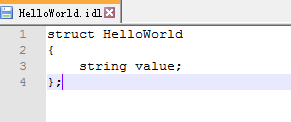

图 3-1

### 3.2. 编译 IDL 文件

1) 打开 ZRDDS 安装目录，打开目录 bin，找到 zrddsgen.exe 可执行文件，打开命令行，输入

zrddsgen.exe -h 查看帮助信息。

> 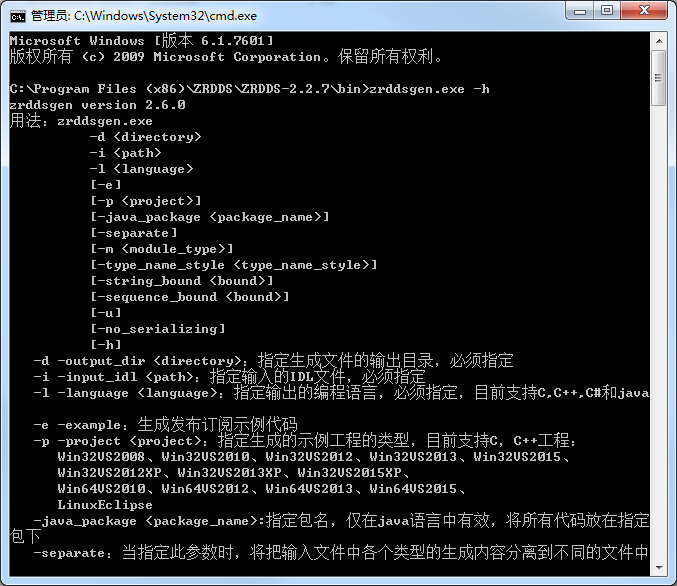
>
> **图示信息：**
>
> - Command-line help output of zrddsgen.exe showing usage, options, and Chinese explanations for each flag.

图 3-2

2) 输入 zrddsgen.exe -i C:\Users\Administrator\Desktop\example\HelloWorld\HelloWorld.idl -d

C:\Users\Administrator\Desktop\example\HelloWorld -l c++ -p Win32VS2013

-i 表示输入文件

-d 表示输出目录

-l 表示生成目标语言（c++`/c/java`）

-p 表示生成目标编译器工程

> 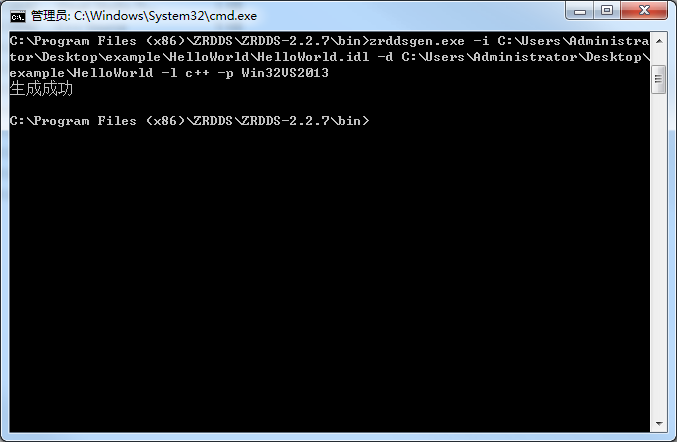
>
> **图示信息：**
>
> - Command prompt window showing execution of zrddsgen.exe with IDL file input and C++ output generation, followed by success message.

图 3-3

编译后生成工程和对应文件

> 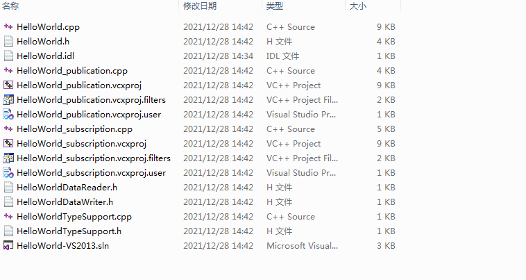
>
> **图示信息：**
>
> - File Explorer window showing a list of C++ and Visual Studio project files related to 'HelloWorld' and 'HelloWorld_subscription', all modified on 2021/12/28 14:42.

图 3-4

### 3.3. 运行示例代码

使用 VS2013 打开 HelloWorld-VS2013.sln 后如下

> 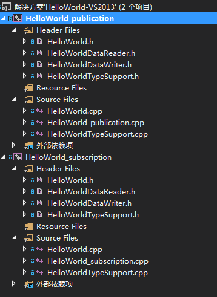
>
> **图示信息：**
>
> - Visual Studio Solution Explorer showing a C++ solution named 'HelloWorld_publication' with two projects: 'HelloWorld_publication' and 'HelloWorld_subscription', each containing identical header and source files plus an '外部依赖项' node.

图 3-5

其中

a) HelloWorld.h 和 HelloWorld.cpp 为类型相关的函数声明和实现

b) HelloWorldDataWriter.h、HelloWorldDataReader.h 为类型相关数据读者和数据写者的声明，用户

可以使用 HelloWorldDataWriter 和 HelloWorldDataReader 进行 HelloWorld 的数据收发

c) HelloWorldTypeSupport.h 和 HelloWorldTypeSupport.cpp 时 TypeSupport 相关接口的声明和实现。

d) HelloWorld_publication.cpp 为数据发送端，里面包含 main 函数示例代码

e) HelloWorld_subscription.cpp 为数据接收端，里面包含 main 函数示例代码

f) 默认代码中未对数据进行赋值，需要填入发送的数据内容，修改如下代码

> 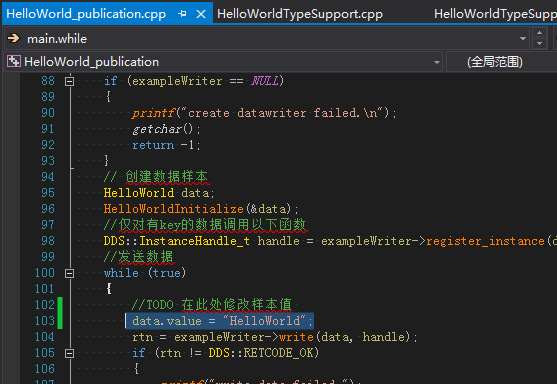

图 3-6

g) 编译发布端和订阅段，即可收发数据

> 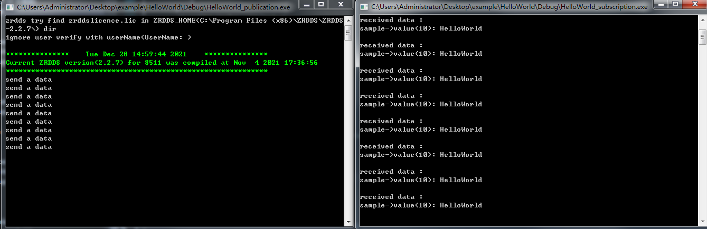
>
> **图示信息：**
>
> - Two side-by-side Windows Command Prompt windows showing runtime output of ZRDDS executables: left window runs 'HelloWorld_publication.exe', right window runs 'HelloWorld_subscription.exe'.

图 3-7

## 第4章数据类型

数据在内存中的存储方式可能根据语言、编译方式、操作系统等等因素呈现多种变化。中间件

能够将一个特定环境（例如 C/C++）的数据发布到另一个环境（例如 Java），其中涉及数据的存储方

式变换，称为序列化和反序列化。

大部分信息产品用两种方法实现上述问题：

- “什么都不做”：数据的组成仅仅是不透明的比特流。

- “什么都要做”：各个平台上都有数据的描述文件，包括数据类型、域名等。

“什么都不做”方法对于应用层来说没有太大负担，但要求中间件进行编码、校准、填充工作；

“什么都要做”方法则会出现大量冗余信息（如数据类型的描述等等）。ZRDDS 综合考量了上述两种

方法。同一主题下进行通信的数据样本共享同一种数据类型。在通信双方已知数据类型的基础上，

可以将数据样本按照一定规则转换成一个数据块进行数据交互，订阅端在收到数据块后也能根据对

应规则将数据块重新转换为该平台上对应的数据样本。

用户发布、订阅数据时，可以按照以下步骤使用数据样本：

- 编写 IDL 文件，定义数据类型；

- 通过 DDS 编译器将 IDL 文件转换为特定语言（如 C++）的数据类型文件；

- 创建应用程序，使用转换后的数据类型文件。

本章主要包括以下内容：

- 自定义数据类型

- 通过 IDL 文件获取相关文件

### 4.1. 数据类型介绍

ZRDDS 使用 IDL 语言来描述数据类型，IDL 即接口定义语言，用来描述软件组件接口的一种规范

语言，它定义接口、数据类型，屏蔽通信双方对接口、数据类型的具体实现细节，为跨平台开发提

供基础。由于 ZRDDS 为以数据为中心的通信中间件，定义系统中使用的数据类型时使用 IDL 语法中

数据类型定义的子集。支持的类型如表4-1 所示：

表 4-1ZRDDS 支持的数据类型

| 类型 | 说明 |
| --- | --- |
| octet | 1字节无符号整型 |
| char | 1字节整型 |
| boolean | true/false |
| short | 2字节整型 |
| unsigned short | 2字节无符号整型 |
| long | 4字节整型 |
| unsigned long | 4字节无符号整型 |
| float | 4字节单精度浮点型 |
| long long | 8字节长整型 |
| unsigned long long | 8字节无符号长整型 |
| double | 8字节双精度浮点型 |
| enum | 4字节枚举类型 |
| string | 字符串类型 |
| struct | 复杂结构体类型，支持继承 |
| union | 复杂联合类型 |
| 数组 | 以上类型的定长数组类型，使用[]来表示 |
| sequence | 以上类型（除数组、string）的变长数组类型 |

例 4-1：自定义数据类型 Foo 如下。

struct Value

```text
{
float x;
short y;
};
```

struct Foo

```text
{
Value z;
long w;
};
```

4.1.1 sequence

由于数组只提供固定大小的规模，当数组有效内容不一定时，使用数组类型会浪费带宽。ZRDDS

提供 sequence 类型来避免这一问题，sequence 在用法上类似于数组，用户可以通过索引值来访问

sequence 中的元素，索引值也是从 0 开始的。但和数组不同的是，sequence 可以没有大小的限制。

事实上，sequence 有两种“大小”，maximum 和 length。maximum 指的是当前 sequence 能够容纳的

最大元素数量，称为 sequence 的上界，length 指的是当前 sequence 实际容纳的元素数量。sequence

在使用时应注意先判断 length 的长度，避免发生越界。注意当 length=0 时，seq[0]是越界的。

注意：当前不支持 sequence 嵌套、以及数组类型的 sequence。

编译器相关选项包括：

- -enable_unbounded，表示允许无上界的 sequence，无上界的 sequence 允许无限多元素；

- -sequence_bound，当未设置-enable_unbounded 时，默认的上界。

例 4-2：变量 y 是有界的，而变量 z 使用默认大小的界

struct Foo

```text
{
long x;
sequence<short, 4> y;
sequence<char> z;
};
```

例 4-3：sequence 和其他自定义的 struct 组合使用.

//@nest

struct A

```text
{
long x;
double y;
};
```

struct B

```text
{
sequence<A> z;
};
```

sequence 中的空间可以动态调整，而数组的空间需要静态分配。这意味着使用 sequence 方法

定义的数据更加灵活，并且不会占用额外的空间。sequence 的相关操作如表4-2 所示：

表 4-2Sequence 方法列表

| 操作方法 | 说明 |
| --- | --- |
| const T& operator[](unsigned int index) const | []操作符，根据索引值取值 |
| T& operator[](unsigned int index) |  |
| unsigned int length() cosnt | 获取当前sequence的长度 |
| bool length(unsigned int new_len) | 设置当前sequence的大小 |
| bool append(const T& val) | 在sequence中添加val |
| unsigned int maximum() | 返回sequence的最大长度 |
| bool maximum(unsigned int new_max) | 设置sequence的最大长度为new_max |
| bool set_at(unsigned int I,const T& val) | 设置sequence中下标为i的值为val |
| bool ensure_length(unsigned int length,<br>unsigned int max) | 判断 sequence 是否有足够的 length 和<br>max 长度，没有则设置长度为 length 或<br>max |
| bool from_array(const T array[],unsigned int<br>length) | 使用长度为 length 的数组 array 为<br>sequence赋值 |
| bool to_array(T array[],unsigned int length) | 使用 sequence 为长度为 length 的数组<br>array赋值 |
| bool clear() | 清空sequence中的内容 |
| bool unloan() | 归还空间 |
| T* get_contiguous_buffer() | 获得sequence连续空间的首地址 |
| T** get_discontiguous_buffer() | 获得Sequence非连续内存空间的地址 |
| const T& get_at(unsigned int i) | 获得sequence中下标为i的值 |
| bool has_ownership() | 判断sequence是否拥有存储空间 |
| bool copy_no_alloc() | 不分配空间的拷贝 |
| int compare(const struct TSeq& src_seq) | 比较两个sequence的大小 |
| bool loan_contiguous(T* buffer,unsigned int | 为sequence租借连续的空间 |

new_length,unsigned int new_max)

bool loan_discontiguous(T** buffer,unsigned 为 sequence 租借非连续的空间

int new_length,unsigned int new_max)

例 4-4：sequence 的一些使用方法：

```text
DDS_CharSeq seq;
int lengthNum = seq.length();//lengthNum =0,
int maxiNum = seq.maximum();//maxiNum = 0;
bool sign = seq.ensure_length(10, 20);
if (!sign)
{
//error
}
lengthNum = seq.length();//lengthNum =10,
maxiNum = seq.maximum();//maxiNum = 20;
sign = seq.from_array("hello world", 11);
if (!sign)
{
//error
}
lengthNum = seq.length();//lengthNum =11;
sign = seq.append('!');
if (!sign)
{
//error
}
lengthNum = seq.length();//lengthNum =12;
char ch = seq[11];//ch = '!'
sign = seq.clear();
if (!sign)
{
//error
}
lengthNum = seq.length();//lengthNum = 0;
maxiNum = seq.maximum();//maxiNum = 0;
```

内置数据类型 string 定义了一组由 char 类型组成字符序列。string 的用法与 C++中的 string 用法

大致相同，编译器相关选项包括，设置的最大长度不包含结束的 null 字符：

- -enableUnbounded，表示允许 string 的长度可能为无限长；

- -stringBound，当未设置-enableUnbounded 时，默认的最大长度。

4.1.2 struct 嵌套与继承

例 4-4：IDL 支持将先前使用 struct 定义的类型作为另一个 struct 成员的类型。

struct A

```text
{
long value;
};
```

struct B

```text
{
A a;
};
```

struct C : B

```text
{
A a1;
};
```

4.1.3 数组

例 4-5：IDL 支持定义数组。

struct myDataType

```text
{
long valueArr[100];
sequence<long> seqLongArr[10];
};
```

数组元素可以是任何已经定义的类型。

### 4.2. DDS 编译器

用户可以在 IDL（Interface Description Language）文件中自定义数据类型。IDL 文件独立于编程

语言之外，因此同一份 IDL 文件可以通过 ZRDDS 编译器转换为 C/C++，Java 等数据文件（注意：由 C

语言不支持继承，因此和 C 语言相关的 IDL 文件中不因）。

表 4-3 是在 IDL 文件上自定义数类型 Foo 后，通过 DDS 编译器可以获取的 C++文件，具体的使

用方法请参见第11 章。

表 4-3 通过编译器获取的 C++文件

|  | 文件种类 |  |  | 文件 |  |
| --- | --- | --- | --- | --- | --- |
| 数据类型 |  |  | Foo.h,Foo.cpp |  |  |
|  | 数据写者、数据读者 |  |  | FooDataWriter.h, FooDataReader.h |  |
| TypeSupport |  |  | FooTypeSupport.h, FooTypeSupport.cpp |  |  |
| 数据类型 |  |  | Foo.h, Foo.c |  |  |
|  | 数据写者、数据读者 |  |  | FooDataWriter.h, FooDataReader.h |  |
| TypeSupport |  |  | FooTypeSupport.h, FooTypeSupport.c |  |  |

表 4-4 是在 IDL 文件上自定义数类型 Foo 后，通过 DDS 编译器可以获取的 C 语言文件，具体的

使用方法请参见第11 章。

表 4-4 通过编译器获取的 C 语言文件

> 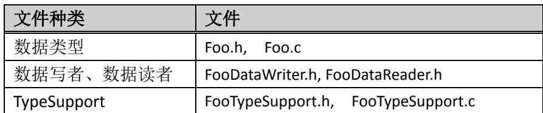
>
> **图示信息：**
>
> - A two-column table listing file types and corresponding files.

表4-5 是在 IDL 文件上自定义数类型 Foo 后，通过 DDS 编译器可以获取的 java 文件，具体的使

用方法请参见第11 章。

表 4-5 通过编译器获取的 Java 文件

|  | 文件种类 |  |  | 文件 |  |
| --- | --- | --- | --- | --- | --- |
| 数据类型 |  |  | Foo.java,FooSequence.java(idl 文件中一个<br>struct A, 对应生成两个 A.java 和<br>Asequence.java文件) |  |  |
|  | 数据写者、数据读者 |  |  | FooDataWriter.java, FooDataReader.java |  |
| TypeSupport |  |  | FooTypeSupport.java |  |  |

在使用 zrddsgen（ZRDDS 编译器）之前，需要编写相应的 IDL 文件来描述所需要的数据类型。

4.2.1 @key 标注

键是区分同一个主题下的不同实例的标识。键可以看成是主题之上对数据的进一步的划分。在

自定义数据类型时，可以选择自定义类型的一个或者多个数据成员作为键。一个数据类型的键通过

```text
在编写 IDL 文件时在数据成员后添加特殊注释的方式“//@key”实现，关于键的详细信息请参考 2.7
节，注意：//@key 标记后面不能再跟其他注释内容。
```

4.2.2 @Nested 标注

Nested 标注作用在数据类型上，表明该类型仅仅作为中间类型，不作为最后主题关联的数据类

型，在类型声明第一行的前面添加@Nested 实现。注意：@Nested 标记后面不能再跟其他注释内容。

4.2.3 @bitwidth 标注（DDS Extension）

@bitwidth 标注为 ZRDDS 新增位域特性时扩展标注。C 语言允许在一个结构体中以位为单位来

指定其成员所占内存长度，这种以位为单位的成员称为位域。利用位域能够用较少的位数存储数据，

提高数据有效利用率，适用于资源（内存、网络）受限的平台上，为了支持这种数据类型，DDS 编

译器在 IDL 中添加了位域类型。

如需使用该特性，可在 idl 文件中进行标注，如：

struct Foo

```text
{
long x; //@bitwidth(5)
};
其中“@bitwidth(5)”等同于 C 语言中的“int x : 5”。
```

在使用位域特性时，需要遵循以下使用限制：

- 位域功能只能在用户指定输出的编程语言为 C 或 C++时使用。

- 位域功能只支持 char、octet、long、unsigned long 类型的数据使用，当其它数据类型使用

位域功能时，将编译失败并打印“InvalidMemberTypeError”。

- 位域数据需要定义在所有其他数据类型之前（因为 idl 中声明的顺序与生成的 C++/C 语言中

的成员顺序一致，从位域的使用目的来看，希望用户把位域声明在前面）。

- 位域类型的长度不能超过原始数据的最大长度，char 和 octet 不能大于 8，unsigned long 和

long 不能超过 32，否则将编译失败并打印“InvalidBitWidthError”。

- 位域类型不支持数组和 sequence 类型，否则编译失败并打印 Unsupported bitWidth type 。

- 位域不能声明为 key，否则报错“InvalidKeyMemberTypeError”。

4.2.4 @spare 标注（DDS Extension）

@spare 标注为 ZRDDS 新增稀疏数据类型特性时扩展标注。稀疏数据类型是 DDS 主题数据动态

类型规范中的概念，当发布订阅的数据包含多个数据类型时，可以将数据标记为“可选”类型，当

数据连续发送并且这些”可选”的数据内容没有改变，发布端不会将这些数据真的发布出去，当订

阅段收到数据后，根据之前的数据内容填写这些未发送的数据。

如需使用该特性，可在 idl 文件中进行标注，如：

@Extensibility(MUTABLE_EXTENSIBILITY)

struct Foo

```text
{
char x; //@spare
};
```

其中“@spare”代表将目标成员标记为稀疏类型。

在使用稀疏数据类型特性时，需要遵循以下使用限制：

- 稀疏数据功能只能在用户指定输出的编程语言为 C++时使用。

- 稀疏数据类型只有在 Extensibility 为 MUTABLE_EXTENSIBILITY 才能生效。

4.2.5 编译器选项

ZRDDS 提供的编译器“zrddsgen”支持的选项及其含义参见表4-6（注意：C 语言下生成的源文

件后缀为.c；C++语言生成的源文件后缀为.cpp）。

表 4-6 zrddsgen 的选项

| 选项 | 说明 |
| --- | --- |
| -d 或–output_dir<br>`<directory>` | 指定生成文件的输出目录，必须指定 |
| -I 或–input_idl | 指定输入的IDL文件，必须指定 |
| -l 或–language<br>`<language>` | 指定输出的编程语言，必须指定。目前支持C，C++，C#和java |
| -e 或–example | 生成发布订阅示例代码 |
| -p 或–project | 指定生成的示例工程的类型，目前支持C，C++工程：Win32VS2008、<br>Win32VS2010、Win32VS2012、Win32VS2013、Win32VS2015、<br>Win32VS2012XP、Win32VS2013XP、Win32VS2015XP、Win64VS2010、<br>Win64VS2012、Win64VS2013、Win64VS2015、LinuxEclipse |
| -java_package<br>`<package_name>` | 指定包名，仅在java语言中有效，将所有代码放在指定包下 |
| -separate | 当指定此参数时，将把输入文件中各个类型的生成内容分离到不同<br>的文件中 |
| -m 或-module_type<br>`<module_type>` | 指定module的处理方式，可选项包括“prefix”和“namespace”，分别<br>表示module作为类型前缀和module作为命名空间（若支持），默<br>认使用namespace，即作为命名空间 |
| -type_name_style<br>`<type_name_style>` | 指定类型名风格，可选项包括”dds_standard”和“zr_style”，分别表示<br>内置类型名使用DDS标准风格或者臻融定义风格，默认使用zr_style |
| -string_bound<br>`<bound>` | 指定默认的string的bound |
| -sequence_bound<br>`<bound>` | 指定默认的sequence的bound |
| -u 或<br>-enable_unbounded | 启用sequence和string的unbounded |
| -no_serializing | 生成无序列化支持函数 |
| -h | 打印帮助信息 |

## 第5章实体

在 ZRDDS 中，许多类继承于一个抽象基类——Entity。将 Entity 类以及它的子类统称为实体。每

个实体拥有一系列 QoS 策略，当一个实体的特定状态发生变化时，将会通知与之相关联的 Listener。

本章主要介绍实体的常见操作和设计模式，包括：DomainParticipant、Topic、Publisher、DataWriter、

Subscriber、DataReader，主要包含以下内容：

- 实体的常见操作

- QoS 策略

- Listener

- Status

- Condition 和 WaitSet

### 5.1. 实体的相关操作

5.1.1 创建和删除实体

在 ZRDDS 中，经常使用工厂模式（factory design pattern）来创建、删除实体。工厂模式是指：

用一个工厂对象（factory）创建、删除一个实体，而不是直接声明创建、删除实体。除了

DomainParticipantFactory 以外，其他所有工厂对象本身也是实体，如表5-1 所示。

表 5-1DDS 的实体和工厂

| 工厂 | 实体 |
| --- | --- |
| DomainParticipantFactory | DomainParticipant |
| DomainParticipnt | Topic |
|  | Publisher |
|  | Subscriber |
| Publisher | DataWriter |
| Subscriber | DataReader |

所有的工厂对象包含以下方法和属性：

- 创建、删除子实体的函数，例如：

```text
Publisher::creater_datawriter();
DomainParticipant::delete_topic();
```

- 获取、设置缺省的 QoS 策略的函数，例如：

```text
Subscriber:: get_default_datareader_qos();
Publisher:: set_default_datawriter_qos();
```

- EntityFactoryQosPolicy 来判断新创建的子实体是否应该自动使能。

工厂对象往往是一个实体，在其子实体没有被全部删除时，不能被创建它的工厂对象删除。例

如，Publisher 作为工厂对象创建、删除 DataWriter，当 Publisher 所创建的 DataWriter 未全部删除时，

该 Publisher 不可以被创建它的工厂 DomainParticipant 删除。

每一个由 create_`<Entity>`() 函数创建的实体最终都要被 delete_`<Entity>`() 函数 ， 或者

```text
delete_contained_entities()函数删除。例如，通过 create_datawriter()函数创建的 datawriter 必须被
delete_datawriter()或 delete_contained_entities()函数删除。
```

5.1.2 使能实体

使能函数 enable()可以将一个实体从未使能（disabled）状态变更为使能（enabled）状态。每一

个实体对象在创建时，可以是使能的，也可以是未使能的。一个实体在创建时是否自动使能，由创

建实体的工厂对象的 QoS 策略（EntityFactoryQosPolicy）决定。

在默认情况下，所有实体将会在创建时被自动使能，即一个实体对象在创建后就处于可操作状

态。在一些特殊情况下，用户可能希望去创建一个未使能的实体。比如：当用户创建一个新的

DataReader 时，如果是默认情况下，这个 DataReader 将会立即开始订阅新的数据，但在某些情况下

当时并没有准备好处理订阅到的数据。在上述情况下，用户应该配置 Subscirber 的 QoS 策略使新创

建的 DataReader 处于未使能状态。在其他部分初始化完毕并准备好处理订阅到的数据后，用户调用

enable()函数使能 DataReader，从而开始订阅数据。

例 5-1：修改工厂对象的 QoS 策略，使新创建的 DataReader 处于未使能状态。

```text
SubscriberQos subscriber_qos;
subscriber->get_qos(subscriber_qos);
subscribe _qos. entity_factory. autoenable_created_entities = false;
subscriber->set_qos(subscriber_qos);
DataReader* reader = subscriber->creater_datareader(
```

topic,

DATAREADER_QOS_DEFAULT,

listener,

```text
mask);
/**在使能前的其他操作(初始化，订阅数据前的准备……)**/
reader->enable();
enable()函数的使用规则：
```

- 如果工厂对象是未使能的，那么它创建的子实体也是未使能的，即使它的 QoS 策略已经设

置成自动使能创建的子实体。

- 如果工厂对象是使能的，那么它的子实体在创建时是否使能取决于工厂对象的 QoS 策略

（EntityFactoryQosPolicy）。

- 对子实体进行 enable()操作时，如果它相应的工厂是未使能的，那么操作将失败并返

回”DDS_RETCODE_PRECONDITION_NOT_MET”。

```text
- 在对工厂对象进行 enable()操作时，如果工厂对象的 QoS 策略（EntityFactoryQosPolicy）
的”autoenable_created_entities”设置为”true”，那么，将会对它的所有子实体进行 enable()操作；
如果是 false，则只对工厂对象自身进行 enable()操作。
- 对已经处于使能状态的实体进行 enable()操作没有意义，将返回”DDS_RETCODE_OK”。
- 不存在与 enable()函数相对应的“disable()”函数。实体处于未使能状态只能因为它在创建
```

时未使能，没有一个将实体从使能状态转换为未使能状态的方法。

- 实体的 Listener 只有在实体已经使能的情况下才可能被调用。

- 实体的存在只有在使能后才能被其他实体感知。

- Topic 永远处于使能状态的。

枚举类型 ReturnCode_t 用于表示本规范中操作的错误码。编码以及含义参见下表5-2：

表 5-2 ReturnCode_t 表示的错误码

| 编码 | 含义 |
| --- | --- |
| DDS_RETCODE_OK | 操作成功 |
| DDS_RETCODE_ERROR | 错误，但错误原因未知 |
| DDS_RETCODE_BAD_PARAMETER | 参数错误 |
| DDS_RETCODE_UNSUPPORTED | 当前不支持该方法 |
| DDS_RETCODE_ALREADY_DELETED | 实体已经被删除 |
| DDS_RETCODE_OUT_OF_RESOURCES | 资源不足 |
| DDS_RETCODE_NOT_ENABLED | 实体未使能，不允许使用该方法 |
| DDS_RETCODE_IMMUTABLE_POLICY | 应用尝试修改不可变QoS策略 |
| DDS_RETCODE_INCONSISTENT | 用户指定的QoS策略不兼容 |
| DDS_RETCODE_PRECONDITION_NOT_MET | 调用当前函数的前置条件不满足 |
| DDS_RETCODE_TIMEOUT | 函数超时 |
| DDS_RETCODE_ILLEGAL_OPERATION | 非法的调用 |
| DDS_RETCODE_NO_DATA | 没有数据 |
| DDS_RETCODE_NOT_ALLOWED_BY_SEC | 操作因安全原因被拒绝 |

未使能的实体可以调用下列方法：

```text
- get_qos()/set_qos()：一些 QoS 策略在与其相关联的实体使能后，不可改变。假如这些实体
在创建时是未使能的，那么可以用 get_qos()/set_qos()方法改变这些值。当实体使能后，调用这
```

些方法只能修改 QoS 策略中的可改变的部分（一些 QoS 策略在实体使能后也能被修改）。

- get_listener()/set_listener() ：实体的 Listener 一直可以被改变。

- create_`<Entity>`() / delete_`<Entity>`()：实体对象作为工厂对象时，即使未使能，也能够创建

和删除它的子实体。注意：一个未使能的实体作为工厂对象时，创建的子实体永远是未使能的，

无论它的 QoS 策略如何。

- lookup_`<Entity>`()：实体对象作为工厂对象时，可以查询它已创建的子实体（这些实体未被

它删除）。

其他方法不允许由未使能的实体调用。如果未使能的实体调用这些方法，方法将无效并返

回”DDS_RETCODE_NOT_ENABLED”。

5.1.3 获取实体的句柄

InstanceHandle_t（实例句柄）是实体在整个域（Domain）中的身份标识，DDS 协议保证了其全

局唯一性，关于键的详细信息请参考 2.7 节。用户程序可以根据 InstanceHandle_t 来实现判断实体是

否由另一个实体创建等操作。获取实体的 InstanceHandle_t 的方法如下：

InstanceHandle_t get_instance_handle();

5.1.4 设置及获取 QoS 策略

每一个实体都包含了一系列的 QoS 策略。用户通过 QoS 策略配置实体的属性。可以通过两种方

法生成 QoS 策略：

```text
- get_qos()操作：获取当前实体的 Qos 策略。
- set_qos()操作：设置当前实体的 QoS 策略。
```

每种 QoS 策略都有缺省值，若用户希望使用自定义的值，可通过以下方法实现：

- 在实体创建前（自定义的值可以用于多个实体）。

- 在实体创建时（自定义的值只能用于当前实体）。

- 在实体创建后（原来设置的 QosPolicy 值已经不是所期望的了）。

无论在什么时候改变 QoS 策略，必须遵守以下规则：

- 一些 QoS 策略之间必须保持一致性。例如：HistoryQosPolicy 的”depth”属性必须受限于

ResourceLimitsQosPolicy ， 如果出现不一致 ， 那么调用 set_qos() 会无效并返

回”DDS_RETCODE_INCONSISTENT”。

- 一些 QoS 策略只能在实体创建时或使能之前被设置、修改。如果用户尝试用 set_qos()修改

一个在实体使能后不可被修改的 QosPolicy （ 实体已使能 ）， 则方法会无效并返

回”DDS_RETCODE_IMMUTABLE_POLICY”。

5.1.4.1 QoS 策略的缺省值

ZRDDS 提供了一系列的常数表示缺省的 QosPolicy 值。

- DOMAINPARTICIPANT_FACTORY_QOS_DEFAULT

- DOMAINPARTICIPANT_QOS_DEFAULT

- PUBLISHER_QOS_DEFAULT

- SUBSCRIBER_QOS_DEFAULT

```text
 DATAWRITER_QOS_DEFAULT  DATAREADER_QOS_DEFAULT  TOPIC_QOS_DEFAULT  DATAWRITER_QOS_USE_TOPIC_QOS  DATAREADER_QOS_USE_TOPIC_QOS 这些缺省值往往用于 set_qos()方法中。
```

例 5-2：用缺省的 DataWriterQos 设置一个 DataWriter：

datawriter->set_qos(DATAWRITER_QOS_DEFAULT);

例 5-3：缺省的 QoS 常数不能用于初始化一个 QoS，该示例是错误示范：

DataWriterQos datawriterqos = DATAWRITER_QOS_DEFAULT;

5.1.4.2 在创建实体前修改 QoS 策略的缺省值

每一个工厂在创建子实体时，可以通过调用 set_defalut_`<Entity>`_qos()方法，设置子实体一系列

QoS 策略的缺省值。例如：DomainParticipantFactory 可以设置 DomainParticipant 的缺省 QoS 策略；

DomainParticipant 可以设置 Topic, Publisher, Subscriber 的缺省 QoS 策略。

调用工厂对象的 set_defalut_`<Entity>`_qos()方法，只能应用于在此之后创建的子实体的 QosPolicy

值，而不能改变已经创建的子实体。

通过修改 QoS 策略的缺省值，可以在工厂对象创建子实体时用自定义的值设置的 QoS 策略。例

如：如果用户希望一个 Publisher 在创建 DataWriter 时将它们的 ReliabilityQosPolicy 的“kind”成员设置

为”DDS_RELIABLE_RELIABILITY_QOS"，但是不希望在每一次创建 DataWriter 时都进行这种设置，这

种情况下，用户可以调用 Publisher 的 set_defalut_datawriter_qos()方法，将缺省的 ReliabilityQosPolicy

的“kind”成员设置为”DDS_RELIABLE_RELIABILITY_QOS"，并且在创建新的 DataWriter 时，使用缺省的

QoS 策略。

例 5-4：修改 DataWriter 缺省的 QosPolicy，并用新的 QosPolicy 创建 DataWriter。

```text
// 获得当前缺省的QosPolicy 值 DataWriterQos default_datawriter_qos; Publisher->get_default_datawriter_qos(default_datawriter_qos); // 改变该值 default_datawriter_qos.reliability.kind = DDS_RELIABLE_RELIABILITY_QOS; // 设置新的缺省的QosPolicy 值 Publisher->set_default_datawriter_qos(default_datawriter_qos); // 创建多个新的datawriter 用默认QoS 配置 datawriter1 = publisher->create_datawriter( topic, DATAWRITER_QOS_DEFAULT,
```

NULL,

```text
DDS_STATUS_MASK_NONE);
datawriter2 = publisher->create_datawriter(
```

topic,

DATAWRITER_QOS_DEFAULT,

NULL,

```text
DDS_STATUS_MASK_NONE);
注意：DDS 不能保证在多线程中同时进行 set_default_<Entity>_qos()、set_qos()等操作来创建新
```

实体的安全性。

5.1.4.3 在创建实体时设置 QoS 策略

如果希望改变一个特定的实体的 QoS 策略，可以通过在创建这个实体时传入期望的 QoS 策略来

实现，如例5-5 所示。

例 5-5：在创建 DataWriter 时设置其 QoS 策略。

```text
// 获得当前缺省的QosPolicy 值 DataWriterQos datawriter_qos; Publisher->get_default_datawriter_qos(datawriter_qos); // 修改该值 datawriter_qos.reliability.kind = DDS_RELIABLE_RELIABILITY_QOS; // 创建<sup>一</sup>个新的datawriter datawriter = publisher->create_datawriter( topic, datawriter_qos, NULL, DDS_STATUS_MASK_NONE);
```

5.1.4.4 在创建实体后设置 QoS 策略

一些 QoS 策略可以在实体创建后被修改。可以用 set_qos()操作修改已经创建了的实体的 QoS 策

略，如例5-6 所示。

例 5-6：修改一个已经创建的 DataWriter 的 DeadlineQosPolicy：

```text
// 获得当前QosPolicy 值
DataWriterQos datawriter_qos;
datawriter->get_qos(datawriter_qos);
// 修改QosPolicy 值
datawriter_qos->deadline.period.sec = 6;
datawriter_qos->deadline.period.nanosec = 0;
// 重新设置
datawriter->set_qos(datawriter_qos);
```

注意：在示例中并没有检查 set_qos()/set_default_`<Entity>`_qos()的返回值，如果设置的 QosPolicy

值本身是不合乎 QoS 策略规范 （ 不满足一致性等 ）， 那么上述方法

（set_qos()/set_default_`<Entity>`_qos()）将失败并返回”DDS_RETCODE_IMMUTABLE_POLICY"。

5.1.5 设置及获取 Listener

每一个实体都有一个相关联的 Listener。Listener 可以根据用户的需要，监听实体的状态变化，

并向用户提供响应状态变化的函数接口。

```text
- get_listener() 操作返回当前的 Listener 指针。
- set_listener() 操作将使实体关联一个 Listener。这个 Listener 只会在关联的实体状态发生变
```

化时被调用。一个实体只能关联一个 Listener，如果一个实体已经关联了一个 Listener，那么调

```text
用 set_listener()关联的新的 Listener 会替代旧的 Listener。
DomainParticipant、Topic、Publisher、Subscriber、DataWriter、DataReader 都提供 get_listener()、
set_listener()操作。
```

### 5.2. QoS 策略

ZRDDS 的行为通过 QoS 控制。每一种实体对象（DomainParticipant, Topic, Publisher, Subscriber,

DataWriter, DataReader）都有各自的 QoS。本节详细描述了用户用于控制各类实体时的 QoS（在下文

中*QosPolicy 和 DDS_*QosPolicy 是等价的，*代表具体的 Qos）。

表5-3 中列举了目前所支持的 QoS 策略和它们的简要介绍。

表 5-3QoS 策略

| QoS策略 | 描述 | 参考 |
| --- | --- | --- |
| AsynchronousPublisher | 该QoSQoS控制是否使用异步发送。 | 见10.1节 |
| Batch | 该QoS控制如何将数据打包发送。 | 见10.2节 |
| DataWriterMessageMo<br>de | 该QoS允许用户控制报文的信息，以减少报文的内容 | 见10.3节 |
| Deadline | 该QoS指定了一个Topic下的每个实例数据发布的最小<br>周期。 | 见9.4节 |
| DestinationOrder | 该QoS控制DataReader接收的来自不同DataWriter的<br>数据样本之间的顺序。 | 见9.5节 |
| DiscoveryConfig | 该QoS用于声明和判断DomainParticipant的存活性。 | 见9.6节 |
| Durability | 该QoS控制DataReader获取DataWriter发送的“历史<br>数据”的与否以及数据来源。 | 见10.7节 |
| EntityFactory | 该QoS控制实体是否自动使能其所创建的子实体。 | 见10.8节 |
| GroupData | 该QoS允许应用向Publisher和Subscriber附加额外的<br>信息。 | 见10.9节 |
| History | 该QoS配置了ZRDDS在本地存储的历史样本的数量。 | 见10.10节 |
| Lifespan | 该QoS控制DataWriter避免发送过期数据给应用。 | 见10.11节 |
| Liveliness | 该QoS指定ZRDDS服务如何判断一个DataWriter是否<br>存活。 | 见10.12节 |
| Log | 该QoS用来设置日志 | 见9.13节 |
| MsgStatisticsInfo | 该QoS允许用户配置报文统计信息的发布信息。 | 见 10.14<br>节 |
| Ownership | 该QoS控制ZRDDS服务是否允许多个DataWriter同时<br>更新同一数据实例下的数据对象。 | 见10.15节 |
| OwnershipStrength | 该QoS是Ownership的扩展，当且仅当ownership.kind<br>= DDS_EXCLUSIVE_OWNERSHIP_QOS 时 ，<br>ownership_strength. value的取值有意义。 | 见 10.16<br>节 |
| Partition | 该 QoS 决定 Publisher 和 Subscriber 创建的 DataWriter<br>和DataReader所属的“逻辑分区”，从而控制之间的数<br>据通信。 | 见10.17节 |
| Presentation | 该QoS允许用户指定不同的描述范围 | 见 10.18<br>节 |
| DataWriterProtocol | 该QoS提供了控制协议中用户可控制部分的方法。 | 见 10.19<br>节 |
| PublishMode | 该QoS决定DataWriter的发送模式是同步还是异步。 | 见 10.20<br>节 |
| RapidIOConfig | 该QoS允许用户对RAPIDIO进行配置 | 见9.21节 |
| RapidIOController | 该QoS允许用户指定RAPIDIO的控制器 | 见9.22节 |
| ReaderDataLifeCycle | 该QoS控制DataReader如何处理它所管理的数据实例<br>的样本的生命周期。 | 见 10.23<br>节 |
| ReceiverThreadConfig | 该QoS用于配置DomainParticipant的线程数量。 | 见 10.24<br>节 |
| Reliability | 该QoS决定ZRDDS的数据传输的可靠性。 | 见 10.25<br>节 |
| ResourceLimits | 该QoS决定了ZRDDS所能使用的系统内存。 | 见 10.26<br>节 |
| ThreadCoreAffinity | 该QoS用于配置DDS线程与CPU的依赖性。 | 见 10.27<br>节 |
| TimeBasedFilter | 该QoS指明一个DataReader在每个最小周期中希望收<br>到最多一包数据。 | 见 10.28<br>节 |
| TopicData | 该QoS允许应用向创建的Topic创建附加信息。 | 见 10.29<br>节 |
| TransportConfig | 该QoS用于配置发送DomainParticipant消息的目的地<br>址，可以用于发现不同域的DomainParticipant。 | 见 10.30<br>节 |
| UserData | 该 QoS 允许用户向创建的 Entity 对象<br>（DomainParticipant、DataWriter、DataReader）附加<br>额外信息。 | 见 10.31<br>节 |
| WriterDataLifecycle | 该QoS控制了DataWriter如何处理它管理实例的生命<br>周期。 | 见 10.32<br>节 |
| DataWriterResourceLim<br>its | 该QoS定义了多种设置可以配置DataWriter 如何为内<br>部资源分配和使用物理内存。 | 见 10.33<br>节 |

QoS 策略的相容性：

QoS 策略之间会互相影响，当用户设置一个 QoS 策略时，这个 QoS 策略的取值可能会与其他

QoS 策略的取值不相容。使用一组不相容的 QoS 策略时，set_qos()方法将会失效并返

回”DDS_RETCODE_INCONSISTENT”。

QoS 策略的可变性：

有的 QoS 策略的值在其关联的实体使能后（一般情况下，实体在创建时就会被自动使能）是不

可改变的，而有的 QoS 策略的值可以在任意时间改变。如果用户试图调用 set_qos()方法更改一个不

可改变 QoS 策略 （ 在该 QoS 策略所关联的实体已使能 ）， 将操作失败并返

回”DDS_RETCODE_IMMUTABLE_POLICY”。

QoS 策略的兼容性：

一些 QoS 策略同时应用于发布端（Publisher, DataWriter）和订阅端时（Subscriber, DataReader）

时，需要考虑它们取值的兼容性。要使发布端和订阅端相匹配，需要保证发布端和订阅端的行

为互相兼容。

对于一些 QoS 策略来说，发送端的 QosPolicy 值要满足接收端的 QosPolicy 值，可以让发送端的

值“等于”或者“小于”接收端的值。例如：DeadlineQosPolicy 在发送端的”period”值必须小于或者

等于接收端的”period”值，从而保证发送一个数据的周期小于等于接收一个数据的周期。

对于另外一些 QoS 策略来说，发送端的 QosPolicy 值要满足接收端的 QosPolicy 值，必须让发送

端的值 “ 等于 ” 接收端的值 。 例如 ： DataWriter 的 OwnershipQosPolicy 设置

为 ”DDS_SHARED_OWNERSHIP_QOS” ， DataReader 的 OwnershipQosPolicy 设置

为”DDS_EXCLUSIVE_OWNERSHIP_QOS”，那么二者的 OwnershipQosPolicy 是不相容的。

当然，也存在不需要考虑发布端、订阅端取值兼容性的 QoS 策略，以及只会作用于发布端或订

阅端一边的 QoS 策略。

是否同时作用于发布端和订阅端两边，以及是否需要考虑取值的兼容性，这些都会在每个 QoS

策略的详细介绍章节中说明（详见第10章）。这里将上述的考虑定义为：”requested vs. offered”，RxO。

```text
当 RxO 时 = YES，QoS 策略同时作用于发布端和订阅端两边，并且它们的取值要相互兼容；
当 RxO = NO 时，QoS 策略同时作用于发布端和订阅端两边，但它们的取值不考虑兼容性；
```

当 RxO = NULL 时，QoS 策略只作用于发布端或订阅端的一边。

ZRDDS 将在发布端和订阅端匹配时比较它们 QoS 策略的兼容性。如果它们是兼容的，那么匹配

成功并且允许它们之间进行数据交互；反之，连接失败，并且它们之间不会有数据交互。

### 5.3. Listener

Listener以异步方式监视实体的状态变化，例如：ZRDDS发现一个与DataWriter匹配的DataReader、

一个新数据到达 DataReader。通过注册的 Listener，用户可以实时获取这些信息。实体 Listener 中的

方法与实体关联的状态一一对应。

5.3.1 Listener 的类型

Listener 类是所有实体的 Listener 的抽象基类。所有实体类（DomainParticipant、Topic、Publisher、

Subscriber、DataWriter、DataReader）都关联一个特定的 Listener，这些 Listener 会针对其状态（不

同类型的实体不同），提供不同方法。在关联的实体的状态发生变化时，这些方法将会由 ZRDDS 内

部的线程调用，回调通知用户。

在使用 Listener 时，用户需要继承实体的 Listener，并实现相关的回调接口函数。

表5-4 是监听实体变化的 Listener 提供的回调函数接口：

表 5-4Listener 的回调函数

> 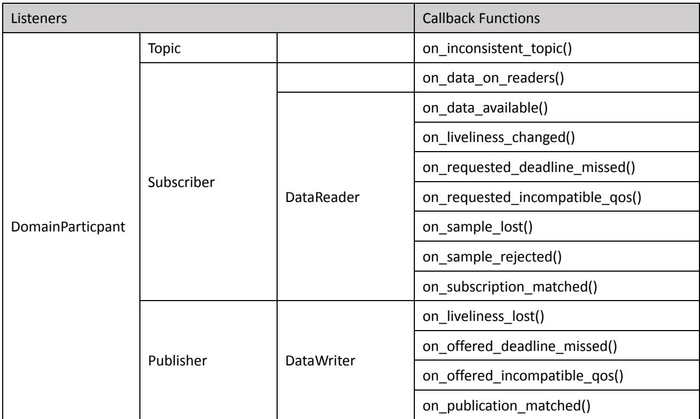
>
> **图示信息：**
>
> - A table mapping listeners (DomainParticipant, Subscriber, Publisher) to their associated callback functions via Topic and DataReader/DataWriter.

5.3.2 Listener 的创建、删除

和实体的创建与删除机制不同，没有创建和删除 Listener 的工厂，用户可以使用任意方式创建

和删除 Listener（比如“new”，“delete”），但是删除 Listener 之前，需要先删除与 Listener 相关联的

实体或者将实体的 Listener 设为 NULL 或者将实体的 Listener 的 ”mask” 值设

为”DDS_STATUS_MASK_NONE”。

例 5-7：DataReaderListener 的创建和删除。

```text
class HelloWorldListener : public DataReaderListener { virtual void on_data_available(DataReader* reader); } void HelloWorldListener :: on_data_available(DataReader* reader) { printf(“received data\n”); } // 创建Listener HelloWorldListener *reader_listener = new HelloWorldListener(); // 删除Listener delete reader_listener;
```

5.3.3 Listener 的注册

Listener 是 ZRDDS 向用户提供的回调接口。用户在继承并实现一个 Listener 后，需要向 ZRDDS

注册该 Listener，从而获取特定信息。

例 5-8：用户可以在创建实体时注册 listener。

datareader = subscriber->create_datareader(

topic,

DATAREADER_QOS_DEFAULT,

listener,

DDS_STATUS_MASK_ALL);

例 5-9：用户也可以在实体创建后注册 Listener。

datareader = subscriber->create_datareader(

topic,

DATAREADER_QOS_DEFAULT,

NULL,

```text
DDS_STATUS_MASK_NONE);
datareader->set_listener(listener, DDS_STATUS_MASK_ALL);
```

5.3.4 Listener 的掩码

用户可以通过掩码（mask）机制选择 Listener 监听的状态类型及范围。”mask”是一段二进制码，

每一位都代表一个不同的状态。在创建 DataReader 并注册 Listener 的同时配置”mask”，可以动态配

置 Listener 监听一种或几种指定的状态：

例 5-10：在创建 DataReader 时注册 Listener 并配置 mask

```text
// 使Listener 能够监听DATA_AVAILABLE 和SAMPLE_LOST 这两个状态位 （注：//当这两个状态发生变化时将分别触发回调函数on_data_available()和// on_sample_lost() 。 ）StatusKindMask mask = DDS_DATA_AVAILABLE_STATUS | DDS_SAMPLE_LOST_STATUS;datareader = subscriber->create_datareader(topic,DATAREADER_QOS_DEFAULT,listener,mask);
```

例 5-11：在创建 DataReader 后再注册 Listener 并配置 mask。

```text
StatusKindMask mask = DDS_DATA_AVAILABLE_STATUS | DDS_SAMPLE_LOST_STATUS;
datareader->set_listener(listener, mask);
```

5.3.5 Listener 的继承机制

由图5-1 可以看到各类 Listeners 之间的关系：不同层次的 Listeners 之间是继承关系，这意味着

子 Listeners 可以使用父 Listeners 的任意方法。你可以在任何一层次安装 Listener，最上层为

DomainParticipantListener，只有它才能在 DomainParticipant 中安装；中间层是 Subscriber 和 Publisher；

最下层是 DataWriter，DataReader，Topic。

> 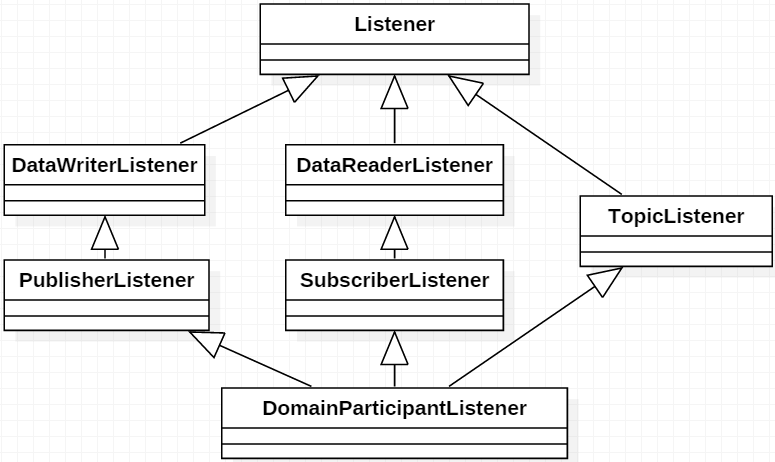
>
> **图示信息：**
>
> - UML class inheritance diagram showing Listener as the base class and its derived classes with hierarchical relationships.

图 5-1Listener 类的继承

如果一个实体没有安装 Listener 或者安装了 Listener 但 mask 值并不允许一个特定的状态变化的

触发，这种情况下，当特定的状态变化发生时，这个状态会沿着该实体的工厂对象方向传播，直到

有一个 Listener 能对该状态做出响应。图5-1 是 Listener 类的继承关系。

5.3.6 Listener 的使用限制

本节主要介绍 Listener 回调函数的使用限制。注意，这些限制不适用于内建 Topic 的 Listener 回

调函数。Listener 的使用限制如下所述。

DataWriter 和 DataReader 的 Listener 回调函数不能进行如下操作：

- 创建实体

- 删除实体

- 使能实体

- 设置实体的 QoS 策略

Publisher 和 DataWriter 的 Listener 回调函数不能调用如下方法：

- 其他 Publisher 的方法

- 其他 Publisher 创建的 DataWriter 的方法

- Subscriber 的方法

- DataReader 的方法

Subscriber 和 DataReader 的 Listener 回调函数不能调用如下方法：

- 其他 Subscriber 的方法

- 其他 Subscriber 创建的 DataReader 的方法

- Publisher 的方法

- DataWriter 的方法

### 5.4. Status

本节主要介绍实体的状态——Status。Status 代表一个实体的状态或相关的事件，例如 DataReader

收到一包新的数据。各个实体所具有的 Status 如表5-5 所示。

可通过以下方法获取实例的状态：

```text
- 使用 get_status_changes()自从上一次获取 Status 以后 Status 的改变。
- 使用 get_*_status()获取当前指定的 Status。
```

- 使用 Listener，当 Status 变化时异步地通知用户。

- 使用 StatusConditions 和 WaitSets，同步等待 Status 变化。

如果应用希望被异步地通知状态变化，可以创建并在实体上安装一个 Listener。然后当状态改变

时 ZRDDS 内部线程会调用 listener 的方法（详见 4.3 节）。

如果应用希望等待状态的变化，创建关注状态的 StatusCondition，然后将 StatusCondition 关联

到一个 WaitSet，再调用 WaitSet 的 wait()操作。wait()会阻塞直到关联的 Condition 中的状态改变，（详

见 4.5 节）。

每个实体关联一系列的代表该实体“通信状态”的状态对象。这些状态（见表5-5 被 DDS 实时

监控。状态结构体中包含的数值可以提供更多关于该状态的信息。

状态的数值变化会激活相应的 StatusCondition 对象并触发调用相应的 Listener 函数，异步的通

知应用状态的变化。例如 Topic 的 INCONSISTENT_TOPIC STATUS 状态的改变会触发 TopicListener 的

on_inconsistent_topic()回调函数。

状态分为两种类型：

- 简单通信状态：除了表明状态是否改变的标识还包含保存当前状态的对应结构体。

- 读通信状态：读通信状态更像一个事件，除了是否发生以外没有其他声明。只有两个状态

是读通信状态：DATA_AVAILABLE 和 DATA_ON_READERS。

表 5-5 实体的 Status

| 实体 | 状态 | 引用 |
| --- | --- | --- |
| Topic | ON_INCONSISTENT_TOPIC Status | 见7.2.6节 |
| DataWriter | LIVELINESS_LOST_STATUS Status | 见7.3.5.1节 |
|  | OFFERED_DEADLINE_MISSEDStatus | 见7.3.5.2节 |
|  | OFFERED_INCOMPATIBLE_QOSStatus | 见7.3.5.3节 |
|  | PUBLICATION_MATCHEDStatus | 见7.3.5.4节 |
| Subscriber | DATA_ON_READERSStatus | 见9.2.6节 |
| DataReader | DATA_AVAILABLEStatus | 见8.3.5.1节 |
|  | LIVELINESS_CHANGEDStatus | 见8.3.5.2节 |
|  | REQUESTED_DEADLINE_MISSEDStatus | 见8.3.5.3节 |
|  | REQUESTED_INCOMPATIBLE_QOSStatus | 见8.3.5.4节 |
|  | SAMPLE_LOSTStatus | 见8.3.5.5节 |
|  | SAMPLE_REJECTED Status | 见8.3.5.6节 |
|  | SUBSCRIPTION_MATCHEDStatus | 见8.3.5.7节 |

### 5.5. Condition 与 WaitSets

Condition 和 WaitSet 为应用提供了另一种 ZRDDS 通信状态变化的机制。Listener 用于提供一个

异步的回调函数，Condition 和 WaitSet 提供同步等待的机制。换言之，Listener 是通知模式，Condition

和 WaitSet 是等待模式。

一个 WaitSet 允许应用等待一个或多个附加的 Condition 值变为真（或一直等待直到超时）。应

用可以创建一个 WaitSet，附加一个或多个 Condition，然后调用 WaitSet 的 wait()方法。wait()方法会

一直阻塞，直到 WaitSet 关联的一个或多个 Condition 变为真（当前只能等到一个 Condition 变为真）。

Condition 的触发状态可以是”true”或”false”。可以通过 Condition 的方法 get_trigger_value()取出

当前值。Condition 类是所有关联到 WaitSet 的 Condition 的基类，主要有以下几种派生类型：

- ReadCondition 由应用通过 DataReader 创建，但是由 ZRDDS 触发。 ReadCondition 提供一

种通过指定希望的 SampleStateMask、ViewStateMask、以及 InstanceStateMask 来指定希望等待

的数据样本的方法。

- 与 ReadCondition 类似，QueryCondition 由应用通过 DataReader 创建，但是由 ZRDDS 触发。

- GuardCondition 由应用创建，每个 GuardCondition 具有单一的用户可修改的布尔值触发状

态。应用可以通过调用 set_trigger_value()方法手动的触发 GuardCondition。ZRDDS 不会触发或

清理这类 Condition，完全由应用控制。

- StatusCondition 由 ZRDDS 为每个实体自动创建。当一个实体的使能的状态发生改变时

ZRDDS 会触发 StatusCondition。

一个 WaitSet 可以关联多个实体，它可以等待不同 participant 下的 Condition。一个 WaitSet 只

能在一个应用线程中使用。

5.5.1 WaitSet 的创建和删除

没有用于创建和删除WaitSet的工厂，在C++中使用new和delete来创建删除，在C中使用ZRDDS

提供的接口创建、删除对象。

5.5.2 WaitSet 的相关操作

WaitSet 的 wait()操作允许应用线程等待任何关联的 Condition 触发。

```text
用户可以指定 WaitSet 最大等待时间（timeout）后返回。如果调用 wait()时关联的 Condition 之
一的触发状态已经是”true”，wait 会立即返回。如果没有 Condition 的触发状态是”true”，wait 会阻
塞调用的线程。wait()会在一个或多个关联的 Condition 的触发状态变为”true”或者达到用户指定的超
```

时时间后返回。

```text
- 如果 wait()没有超时，它会返回一个的触发状态为”true”的 Condition 列表。
- 如果 wait()超时，它会返回”DDS_RETCODE_TIMEOUT”和空的 Condition 列表。
不能有多个应用线程同时调用同一个 WaitSet 的 wait()。若一个 WaitSet 的 wait()被调用时已经
```

有一个线程被这个 WaitSet 阻塞，则返回”DDS_RETCODE_PRECONDITION_NOT_MET”。

如果从一个当前正在等待的 WaitSet 分离一个 Condition，wait()可能会返回”DDS_RETCODE_OK”

和空的 Conditions 列表。

5.5.3 WaitSet 的阻塞

```text
wait()的执行结果由 WaitSet 的状态决定，WaitSet 的状态由是否有至少一个 Condition 的触发状
态是”true”决定。
- 如果 WaitSet 状态是 BLOCKED 时调用 wait()方法，将会阻塞调用线程。
- 如果 WaitSet 状态是 UNBLOCKED 时调用 wait()方法，wait()将会立即返回。
如图5-2 所示，当 WaitSet 从 BLOCKED 转变为 UNBLOCKED 时，会唤醒调用 wait()的线程。唤醒
```

一个 WaitSet 时没有隐含的“事件队列”。如果关联到一个 WaitSet 的多个 Condition 的触发状态变

为”true”，ZRDDS 只会解锁一次 WaitSet。

> 
>
> **图示信息：**
>
> - A completely black or uniformly dark blurred rectangle with no discernible features, text, UI elements, or structure.

图 5-2WaitSet Blocking Behavior

5.5.4 如何处理触发的 Condition

wait()操作返回时提供了 WaitSet 关联的 Condition 对象中的触发状态为”true”的列表。应用可以

根据返回的列表做如下操作：

- StatusCondition

- 首先调用 get_status_changes()方法，查看哪个状态改变了。

- 若状态涉及简单通讯状态，调用相关实体的 get_`<communication_status>`()方法。

```text
- 若状态涉及 DATA_ON_READERS，调用相关 Subscriber 的 get_datareaders()方法。
- 若状态涉及 DATA_AVAILABLE，调用相关 DataReader 的 read()或 take()方法。
```

- ReadCondition 或 QueryCondition

```text
可以使用 ReadCondition 作为参数调用 DataReader 的 read_w_condition() 或
take_w_condition()方法。这只是个建议，不是必须使用“w_condition”操作，“w_condition”
```

操作只是一个使用 ReadCondition 或 ueryCondition 状态位读取数据的方便方法。

- GuardCondition

检查哪个 GuardCondition 发生了变化，然后进行相应的操作。GuardCondition 完全由应

用控制。

5.5.5 ReadConditions

ReadCondition 由应用通过 DataReader 创建但是由 ZRDDS 触发。ReadCondition 提供了指定希望

等待的数据样本的方法，通过指定希望的 SampleStateMask、ViewStateMask 和 InstanceStateMask。

当收到适当的数据样本时 ZRDDS 会触发 ReadCondition。

```text
ReadConditions 可以由 DataReader 的 create_readcondition()操作创建，如例5-12 所示。
例 5-12：使用 DataReader 的 create_readcondition()创建 ReadCondition。
ReadCondition* my_read_condition = reader->create_readcondition(
```

DDS_NOT_READ_SAMPLE_STATE,

DDS_ANY_VIEW_STATE,

```text
DDS_ANY_INSTANCE_STATE);
例 5-13：使用 DataReader 的 delete_readcondition()删除 ReadCondition。
ReturnCode_t delete_readcondition (ReadCondition *condition);
```

不同于 StatusCondition，ReadCondition 的触发状态表明至少有一个与 ReadCondition 设置的状态

匹配的数据样本。

5.5.6 GuardConditions

GuardCondition 由应用创建。GuardCondition 为应用提供了一种手动唤醒 WaitSet 的方法，像所

有的 Condition 一样，它有一个单一的布尔值的触发状态。应用可以通过调用 set_trigger_value()操作

来手动的触发 GuardCondition。

ZRDDS 本身不会触发或清除这种 Condition，因为它完全由应用控制。

例 5-14：没有相应的工厂对象来创建 GuardCondition，因此在 C++中可以使用 new 方法直接创建

GuardCondition。

```text
> 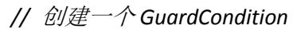
>
> 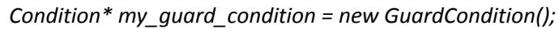
>
// 删除一个GuardCondition
delete my_guard_condition;
创建时的触发状态为”false”。
GuardCondition 只有 get_trigger_value() 和 set_trigger_value() 两个操作 。 当应用调用
set_trigger_value(true)时，ZRDDS 会唤醒所有关联了该 GuardCondition 的 WaitSet。
```

5.5.7 StatusConditions

StatusCondition 由 ZRDDS 自动为每个实体创建一个。当实体使能的状态改变时，ZRDDS 会触发

StatusCondition。默认情况下，当 ZRDDS 创建一个 StatusCondition 时所有的状态位都是打开的，意

味着会检查所有的状态决定何时触发 StatusCondition。如果只希望 ZRDDS 检查特定的状态，使用

set_enabled_statuses()设置希望的状态位。

StatusCondition 的触发状态由实体的通信状态决定，通过设置的状态位对状态进行过滤。不像

其他类型的 Condition，StatusCondition 由 ZRDDS 创建。使用实体的 get_statuscondition()操作获取一

个实体的 StatusCondition，如例5-15 所示。

例 5-15：获取一个实例的 StatusCondition。

> 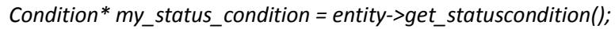
>

5.5.8 同时使用 Listeners 和 WaitSets

应用中可以同时使用 Listener 和 WaitSet。可以使用 WaitSets 和 Conditions 获取数据，并使用

Listener 异步的提醒错误的通信状态。

建议为每个特定的通讯状态选择其中一种或另一种机制（而不是两种混用）。两种方法可以同

时使用，WaitSet 同步等待先被唤醒，然后再通过 Listener 通知。

## 第6章域/域参与者

本章讨论了如何使用域，目标是帮助用户熟悉 ZRDDS 中将要用到的对象，主要包含以下内容：

- 域和 DomainParticipant 的基础概念

- DomainParticipantFactory

- DomainParticipant

- DomainParticipant 的 QoS 策略

### 6.1. Domain 和 DomainParticipant 的基本概念

DomainParticipant 是创建、删除、管理其它 ZRDDS 实体的核心。域（Domain）是应用程序的逻

辑网络：只有处于相同域中的应用程序才能通过 ZRDDS 相互交流。Domain 通过一个全局唯一的整

型变量标识自己的身份，这个全局唯一的变量称为 domainID（DomainId 的取值范围为 0-232）。每

个 DomainParticipant 包含的 domainID 表明其所处的域。应用程序通过创建一个包含 domainID 的

DomainParticipant 来加入相应的域。

如图6-1 所示，应用程序可以处于多个域中，例如应用程序 A 处于域 1 和域 2 中。在同一个域

中的应用程序可以相互交流，例如 A 和 B、A 和 C 可以相互交流。在不同域中的应用程序不能相互

交流，例如 B 和 C 不能相互交流。

> 
>
> **图示信息：**
> - A completely black image with a faint, thin elliptical outline near the center; no text, icons, buttons, or discernible content is visible.

> 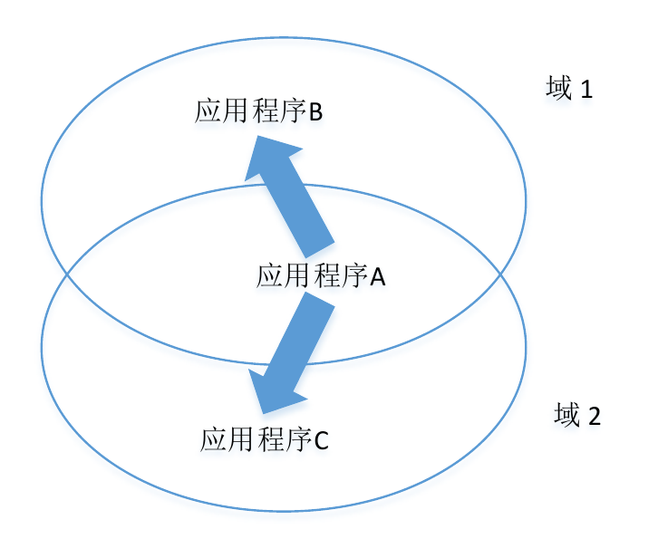
> **图 6-1 应用程序和域的关系**
> **图示信息：** Venn diagram showing two overlapping domains (域 1 and 域 2) with three applications: 应用程序A in the intersection, 应用程序B in 域 1 only, and 应用程序C in 域 2 only; bidirectional arrows connect 应用程序A to both 应用程序B and 应用程序C.
图 6-1 应用程序和域的关系

在图6-1 中，一个应用程序通过创建多个包含不同 domainID 的 DomainParticipant 来加入多个域

中。同一个域中的 DomainParticipant 组成一个逻辑网络，它们独立于其它域中的 DomainParticipant，

即使它们处于同一个物理上的网络中。处于不同域中的 DomainParticipant 永远不会和其它域中的

DomainParticipant 交互信息，因此，所有包含同一个 domainID 的 DomainParticipant 组成一个虚拟的

网络。

一个应用程序想要加入到一个特定的域中，需要创建一个包含该域的 domainID 的

DomainParticipant 。 如

> 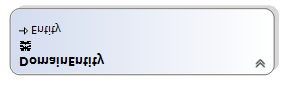

> 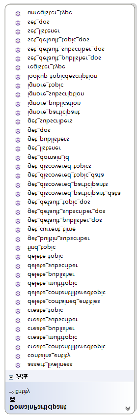
>
> **图示信息：**
> - A hierarchical tree view of ZRDDS entities in a GUI, with expandable nodes and a selected 'DomainParticipant' item at the bottom.
> - Root node labeled 'Entity'
> - Expanded nodes include: 'pubSubType', 'get_doc', 'get_listener', 'get_default_qos', 'get_default_publisher_qos', 'get_default_subscriber_qos', 'get_default_topic_qos', 'register_type', 'lookup_topicdescription', 'ignore_topic', 'ignore_subscription', 'ignore_publication', 'ignore_participant', 'get_discovery', 'get_domain_id', 'get_discovered_topics', 'get_discovered_topic_data', 'get_discovered_participant_data', 'get_default_topic_qos', 'get_default_subscription_qos', 'get_default_publication_qos', 'get_current_time', 'get_runtime_enumerator', 'find_topic', 'delete_topic', 'delete_enumerator', 'delete_publisher', 'delete_subscriber', 'delete_multitopic', 'delete_compositeentitytopic', 'delete_contained_entities', 'create_topic', 'create_publisher', 'create_subscriber', 'create_multitopic', 'create_compositeentitytopic', 'contain_entity', 'assert_liveliness'
> - Bottom item 'DomainParticipant' is highlighted/selected and shows a downward arrow indicating expandability
> - Each node has a small circular icon (purple for root, gray for others) and a plus/minus indicator for expansion state

图 6-2

中，DomainParticipant 是其它 ZRDDS 实体的容器，这些实体与该 DomainParticipant 处于同一个域中。

DomainParticipant 就是一个生产 Publisher、Subscriber、Topic 的工厂，创建的子实体都处于工厂对象

所处的域中（同理，Publisher作为工厂对象，创建的DataWriter与Publisher处于同一个域中；Subscriber

作为工厂对象，创建的 DataReader 与 Subscirber 处于同一个域中）。

和所有 ZRDDS 实体一样，DomainParticipant 有 QoS 策略和 Listener。

> 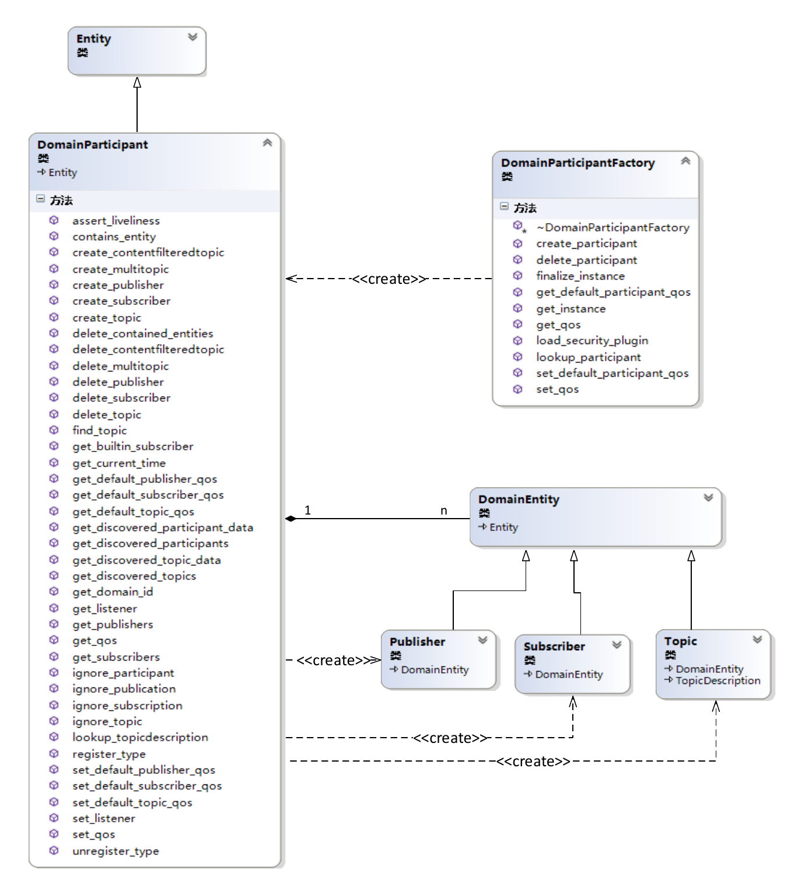
> **图 6-2 域模块图**
> **图示信息：** UML class diagram showing relationships among DDS domain-related classes: Entity, DomainParticipant, DomainParticipantFactory, DomainEntity, Publisher, Subscriber, and Topic.
图 6-2 域模块图

### 6.2. DomainParticipantFactory

DomainParticipantFactory 的主要功能是创建、删除 DomainParticipant。DomainParticipantFactory

是单例类，应用程序只有一个 DomainParticipantFactory，但可以有多个 DomainParticipant。

例 6-1：实例化一个 DomainParticipantFactory。

DomainParticipantFactory& factory = DomainParticipantFactory::get_instance();

或使用 TheParticipantFactory;

DomainParticipantFactory 没有相关联的 Listener，但是有相关联的 QoS 策略。用户可以通过调用

DomainParticipantFactory 的 get_qos()和 set_qos()操作修改它的 QoS 策略。DomainParticipantFactory

存储了缺省的 QoS 策略，这个策略用于创建 DomainParticipant。此外，这个缺省的 QoS 策略也可以

被修改。

用户可以通过 DomainParticipantFactory 执行表 6-1 中的所有方法。其中最重要的方法是

create_participant()。

表 6-1DomainParticipantFactory 函数

| 函数 | 说明 |
| --- | --- |
| create_participant() | 创建DomainParticipant |
| delete_participant() | 删除DomainParticipant |
| get_default_participant_qos() | 获取缺省的DomainParticipantQoS |
| set_default_participant_qos() | 设置缺省的DomainParticipantQoS |
| lookup_participant() | 搜索含特定 domainID 的<br>DomainParticipant |
| get_instance() | 获取单例对象的指针 |
| finalize_instance() | 销毁域参与者工厂单例 |
| get_qos() | DomainParticipantFactory QoS策略的获取 |
| set_qos() | DomainParticipantFactory QoS策略的设置 |

6.2.1 DomainParticipantFactory 的 QoS 策略

DomainParticipantFactory 的 QoS 策略结构如下：

struct DomainParticipantFactoryQos

```text
{
DDS_EntityFactoryQosPolicy entity_factory;
DDS_LogQosPolicy dds_log;
DDS_ULong min_dma_copy_size;
DDS_RapidIOConfigQosPolicy rapidio_config;
};
```

EntityFactoryQosPolicy 主要控制是否在 DomainParticipantFactory 创建子实体

（DomainParticipant）时自动使能子实体（参见 10.8 节）。

LogQosPolicy 用于控制 ZRDDS 日志系统，包括输出的级别，以及分布式日志的管理（参见 10.13

节）。

min_dma_copy_size，用于控制 ZRDDS 内部在序列化以及反序列化时内容拷贝的方式。

RapidIOConfigQosPolicy 主要用于控制 RapidIO 传输方式，（参见 10.21 节）。

6.2.2 获取及设置缺省的 DomainParticipantQoS

DomainParticipantFactory 调用 create_participant() 方法创建 DomainParticipant 时 ， 可以

用”DOMAINPARTICIPANT_QOS_DEFAULT”作为 QoS 参数，表明将使用缺省的 DomainParticipantQos 作

为新创建的 DomainParticipant 的 QoS 策略。

例 6-2：获取 DomainParticipantFactory 缺省的 DomainParticipantQos。

ReturnCode_tget_default_participant_qos(DomainParticipantQos &qoslist);

该方法获取的缺省 DomainParticipantQos 是最 “ 新 ” 的 ， 即最近一次调用

```text
set_default_participant_qos() 方法后设置的值 。 如果 DomainParticipantFactory 没有调用过
set_default_participant_qos()方法，则获取的 DomainParticipantQos 是 ZRDDS 提供的默认值。
```

例 6-3：设置缺省的 DomainParticipantQos。

```text
ReturnCode_t set_default_participant_qos(DomainParticipantQos &qoslist);
当 DomainParticipantFactory 调用 create_participant() 方法时 ， 如果 QoS 参数
为 ”DOMAINPARTICIPANT_QOS_DEFAULT” ， 那么通过 set_default_participant_qos() 方法设置的
```

DomainParticipantQos 将会被作为创建的 DomainParticipant 的初始 QoS 策略。

```text
注意 ： 多个线程同时调用 set_default_participant_qos() 、 get_default_participant_qos() 、
create_participant()方法（QoS 参数为”DOMAINPARTICIPANT_QOS_DEFAULT”）是不安全的。
```

6.2.3 释放 DomainParticipantFactory

```text
get_instance()方法可以获取 DomainParticipantFactory 单例的指针。
finalize_instance()方法可以释放 DomainParticipantFactory 所占据的资源。大多数操作系统中，这
```

些资源在程序结束时会被自动释放。然而，一些内存检测工具会把这些资源视为不安全的。这个方

法可以清理所有 DomainParticipantFactory 占据的可能被视为不安全的资源。

在调用 finalize_instance() 方法前 ， 需保证所有由该 DomainParticipantFactory 创建的

DomainParticipant 已经被删除 。 而要保证成功删除 DomainParticipant ， 需要保证所有由

DomainParticipant 创建的子实体被删除。所以说，调用 finalize_instance()方法前，所有该

DomainParticipantFactory 附属的子实体必须已经被全部删除。

6.2.4 搜索 DomainParticipant

DomainParticipantFactory 提供根据 domain ID 检索 DomainParticipant 的方法，如例6-4 所示。

例 6-4：通过 domainID 检索 DomainParticipant。

> 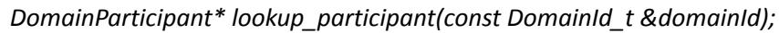
>

### 6.3. DomainParticipant

DomainParticipant 是 DDS 实体的容器，附属于同一个 DomainParticipant 的子实体处于同一个域

中。每个 DomainParticipant 拥有一系列的内部线程和内部数据结构来维护附属于它的子实体和处于

同一个域的其它 DomainParticipant 的信息。DomainParticipant 主要功能是创建和删除 Publisher、

Subscriber、Topic。

当用户拥有一个 DomainParticipant 后，可以使用表6-2 的所有方法：

表 6-2DomainParticipant 的函数

|  | 函数 | 描述 |
| --- | --- | --- |
|  | enable() | 使能DomainParticipant |
|  | get_listener() | 获取DomainParticipant的Listener |
|  | set_listener() | 设置DomainParticipant的Listener |
|  | get_qos() | 获取DomainParticipant的QoS |
|  | set_qos() | 设置DomainParticipant的QoS |
|  | get_instance_handle() | 获取实例的句柄 |
|  | get_status_changes() | 获取自从上次获取状态后状态的改变 |
|  | get_statuscondition() | 获取与 DomainParticipant 相关的<br>StatusCondition |
|  | delete_contained_entities() | 删除DP下的所有子实体 |
|  | contains_entity() | 检查指定 Entity 是否属于该<br>DomainParticipant |
|  | create_topic() | 创建Topic |
|  | delete_topic() | 删除Topic |
|  | get_default_topic_qos() | 获取缺省的TopicQos |
|  | set_default_topic_qos() | 设置缺省的TopicQos |
|  | find_topic() | 查找同一域下的Topic |
|  | lookup_topicdescription() | 根据Topic名字查找TopicDescription |
|  | create_contentfilteredtopic() | 创建一个基于内容过滤的主题 |
|  | delete_contentfilteredtopic() | 删除一个基于内容过滤的主题 |
|  | create_publisher() | 创建Publisher |
|  | delete_publisher() | 删除Publisher |
|  | get_default_publisher_qos() | 获取缺省的PublisherQos |
|  | set_default_publisher_qos() | 设置缺省的PublisherQos |
|  | get_publisher() | 获取属于该DP的Publisher列表 |
| Subscr<br>iber<br>工厂 | create_subscriber() | 创建Subscriber |
|  | delete_subscriber() | 删除Subscriber |
|  | get_default_subscriber_qos() | 获取缺省的SubscriberQos |
|  | set_default_subscriber_qos() | 设置缺省的SubscriberQos |
|  | get_subscriber() | 获取属于该DP的Subscriber列表 |
| 内置实<br>体管理 | get_builtin_subscriber() | 获取ZRDDS内建的Subscriber |
| 通信管<br>理 | ignore_participant() | 忽略发现的某个DomainParticipant |
|  | ignore_publication() | 忽略指定DataWriter的所有通信 |
|  | ignore_subscription() | 忽略指定DataReader的所有通信 |
| 域信息<br>查询 | get_domian_id() | 获取DomainParticipant所属域 |
|  | get_discovered_participant_data() | 获取发现的DomainParticipant数据信息 |
|  | get_discovered_participants() | 获取发现的DomainParticipant列表 |
|  | get_discovered_topic_data() | 获取发现的Topic数据信息 |
|  | get_discovered_topics() | 获取发现的Topic列表 |
| 存活性<br>管理 | assert_liveliness() | 声明自身的存活性 |

#### 6.3.1. 创建 DomainParticipant

一般，用户只需要为一个 domainID 创建一个 DomainParticipant（用户可以为同一个 domainID

创建多个 DomainParticipant，但没有必要这样做）。

```text
调用 DomainParticipantFactory 的 create_participant()方法创建 DomainParticipant：
DomainParticipant* create_participant(
```

const int&domainId,

const DomainParticipantQos &qos,

DomainParticipantListener *a_listener,

const StatusKindMask &mask)

- domainId：domainId 唯一标识 DomainParticipant 所处的域。DomainParticipant 只会和具有

相同 domainId 的其它 DomainParticipant 交流（即，同一个域中的 DomainParticipant 才能互相

交流）。

- qos：本参数指定 DomainParticipant 的 QoS 策略。如果要使用默认的 QoS，则可以使用内

置值”DOMAINPARTICIPANT_QOS_DEFAULT”作为参数，如果要使用自定义的 QoS，则可以自行构

造一个 DomainParticipantQos，关于 DomainParticipant 的 QoS 设置请参考 5.3.4 节。

注意 ： 在多线程环境下使用 ”DOMAINPARTICIPANT_QOS_DEFAULT” 作为参数创建

DomainParticipant 是不安全的，因为另一个线程可能也在同时调用 DomainParticipantFactory

的 set_default_participant_qos()函数。

- Listener：Listener 是一系列回调接口。当 DomainParticipant 有特定事件（状态变化）发生

时，ZRDDS 使用 Listener 通知应用程序，关于 DomainParticipant 的 Listener 设置请参考 5.3.5 节。

如果用户不需要安装 Listener，则可以将该参数设置为 NULL。如果一个事件没有被它的子实体

响应，那么 DomainParticipant 的 Listener 将会响应该事件。Listener 的继承机制请参考 4.3.6 节。

- mask：该参数为位掩码，用于选择性地开启 listener 的回调接口。mask 每一位的取值对应

Listener 是否相应一件特定的事件。如果用户希望 Listener 响应所有事件，可以将设置参数

为”DDS_STATUS_MASK_ALL”；如果用户希望 Listener 不响应任何事件，可以将参数设置

为”DDS_STATUS_MASK_NONE”。

当用户创建一个 DomainParticipant 后，下一步应该是注册即将使用的数据类型，示例如例6-5

所示。其次，用户需要为接下来的数据发布/订阅创建一个 Topic，通过将发布端和订阅端关联到同

一个 Topic 上来实现实体间的数据通信。最后，用户需要创建一个 Publisher 和一个 Subscriber，并且

用 Publisher 和 Subscriber 创建 DataWriter 和 DataReader。

例 6-5：使用 DomainParticipant 注册数据类型。

FooTypeSupport::get_instance().register_type(domainparticipant, “type_name”);

注意：在多线程情况下，如果一个线程在创建一个 DomainParticipant 的同时，另一个线程正在

搜索或者删除同一个 DomainParticipant 是不安全的，在实际应用过程中要考虑多线程使用的安全性。

例 6-6：创建一个 DomainParticipant（用缺省的 QoS 策略）。

```text
DomainId_t domain_id = 20;
DomainParticipant* participant = factory->create_participant(
```

domain_id,

DOMAINPARTICIPANT_QOS_DEFAULT,

NULL,

```text
DDS_STATUS_MASK_NONE);
if(participant == NULL){/* error */}
```

6.3.2 删除 DomainParticipant

如果应用程序不再希望在一个域中交换信息，那么这个域的 DomainParticipant 可以被删除。

DomainParticipant 只有在附属于它的子实体全部被删除后才能被删除 ， 否则将返

回”DDS_RETCODE_PRECONDITION_NOT_MET”。

要删除一个 DomainParticipant：

- 用户必须保证所有子实体（由该 DomainParticipant 创建的 Publisher，Subscriber，Topic）全

部被删除。用户使用 DomainParticipant 的 delete_`<Entity>`()方法可以随时删除这些子实体，或者

可以调用 delete_contained_entities()方法一次性全部删除创建的子实体，如例6-7 所示。

例 6-7：使用 delete_`<Entity>`()方法删除 DomainParticipant 的子实体。

```text
// 删除指定的Publisher
ReturnCode_t delete_publisher(Publisher *a_pub);
// 删除指定Subscribers
ReturnCode_t delete_subscriber(Subscriber *a_sub);
// 删除指定Topic
ReturnCode_t delete_topic(Topic *a_topic);
- 删除 DomainParticipant 需要调用 DomainParticipantFactory 的 delete_participant()方法，如例
```

6-8 所示。

例 6-8：删除 DomainParticipant。

ReturnCode_t delete_participant(DomainParticipant *a_dp);

在 DomainParticipant 被删除后，所有它的内部线程和原来占据的资源都会被清除。用户应该在

DomainParticipant 被删除后，再删除关联于它的 Listener。

6.3.3 删除所有子实体

DomainParticipant 的 delete_contained_entities()方法可以删除所有由它创建的 Publisher、

Subscriber 和 Topic 及 Publisher 创建的 DataWriter、Subscriber 创建的 DataReader，如例6-9 所示。

```text
例 6-9：使用 delete_contained_entities()方法删除 DomainParticipant 的子实体。
// 删除DomainParticipant 的全部子实体。
ReturnCode_t delete_contained_entities();
在删除每个附属的子实体之前，DomainParticipant 的 delete_contained_entities()方法首先会递归
调用每个子实体的 delete_contained_entities() 方法 。 因此 ， DomainParticipant 在成功调用
delete_contained_entities()方法后，将会删除所有附属于其的子实体以及递归附属的子实体（比如
```

DataWriter，DataReader……），如果删除过程中有一个实体删除失败，将会导致整个操作的失败，

同时已经删除成功的实体不会被恢复。

6.3.4 设置 DomainParticipant 的 QoS 策略

DomainParticipantQos 结构如下：

struct DomainParticipantQos

```text
{
DDS_UserDataQosPolicy user_data;
DDS_EntityFactoryQosPolicy entity_factory;
DDS_ReceiverThreadConfigQosPolicy receiver_thread_config;
DDS_TransportConfigQosPolicy domain_destination_addresses;
DDS_TransportConfigQosPolicy domain_receive_addresses;
DDS_TransportConfigQosPolicy pdp_send_addresses;
DDS_TransportConfigQosPolicy pdp_destination_addresses;
DDS_TransportConfigQosPolicy pdp_receive_addresses;
DDS_TransportConfigQosPolicy metatraffic_receive_addresses;
DDS_TransportConfigQosPolicy usertraffic_receive_addresses;
DDS_ThreadCoreAffinityQosPolicy thread_core_affinity;
DDS_DiscoveryConfigQosPolicy discovery_config;
DDS_DDSMsgStatisticsInfoQosPolicy message_staticstics_info_config;
DDS_Boolean rtps_message_little_endian;
DDS_RapidIOControllerQosPolicy rapidio_controller;
};
```

TransportConfigQosPolicy 类型的几个变量的作用，具体说明见表 6-3。

表 6-3 DomainParticipant 的 QoS 策略

> 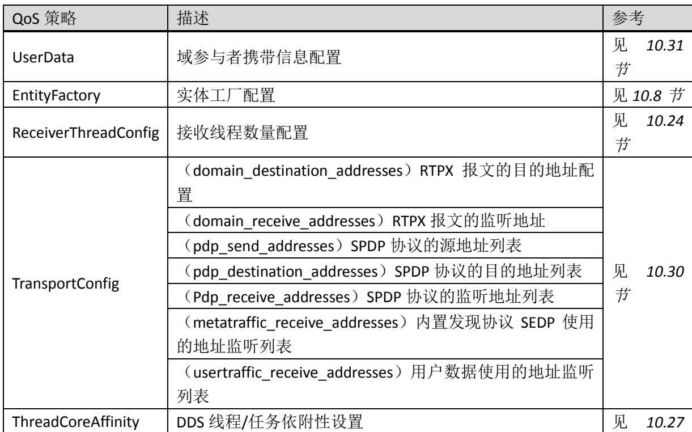
>
> **图示信息：**
>
> - A table listing QoS policies with their descriptions and cross-references to sections in the manual.

|  |  | 节 |
| --- | --- | --- |
| DiscoveryConfig | SPDP发现配置 | 见10.6节 |
| MsgStatisInfo | 配置报文统计信息 | 见 10.14<br>节 |
| RapidIOController | RapidIO控制器配置 | 见 10.22<br>节 |

在DomainParticipantQos中有一个特殊的成员“rtps_message_little_endian”，此成员用于决定DDS

```text
发送的报文的端序。”rtps_message_little_endian”设置为”true”时，报文端序为小端，否则为大端。
默认值为”true”。
```

DomainParticipantQos 内容的具体说明见第10 章。

6.3.4.1 在创建 DomainParticipant 时配置 QoS 策略

在例 6-6 中，可以看到示例使用内置变量”DEFAULT_DOMAINPARTICIPANT_QOS”作为创建

DomainParticipant 时的 QoS 参数，表示使用缺省的 QoS 策略做为新创建的 DomainParticipant 的 QoS

策略。用户可以通过调用 DomainParticipantFactory 的 set_default_participant_qos()方法来修改。当用

户使用上述的方法成功修改缺省的 DomainParticipantQos 策略之后，DomainParticipantFactory 再次使

用”DOMAINPARTICIPANT_QOS_DEFAULT”作为QoS参数创建的DomainParticipant将使用新的缺省QoS

值 DomainParticipantQos。

如例6-10 所示，没有使用内置变量”DOMAINPARTICIPANT_QOS_DEFAULT”作为 QoS 参数，而是

使用自定义的 QoS 策略创建 Domainparticipant。首先，该示例使用 DomainParticipantFactory 的

get_default_participant_qos()方法初始化自定义的 participant_qos（DomainParticipantQos 对象），然

后修改 participant_qos 的值，最后用 participant_qos 作为 QoS 参数创建 DomainParticipant。

例 6-10：用修改后的 QoS 策略创建 DomainParticipant。

```text
DomainId_t domain_id = 20;
// 用缺省的DomainParticipantQos 初始化participant_qos
DomainParticipantQos participant_qos;
factory->get_default_participant_qos(participant_qos);
// 修改QoS 策略
participant_qos. entity_factory. autoenable_created_entities = false;
// 用修改后的participant_qos 作为QoS 参数
DomainParticipant* participant = factory->create_participant(
```

domain_id,

participant_qos,

NULL,

```text
DDS_STATUS_MASK_NONE);
if(participant == NULL){ /*…error */}
```

6.3.4.2 在创建 DomainParticipant 后修改 QoS 策略

```text
可以通过 get_qos()和 set_qos()方法，修改 DomainParticipant 的 QoS 策略，示例如下所示，首先
通过调用 get_qos()方法，获取当前的 QoS 策略，并使之初始化 participant_qos（DomainParticipantQos
对象）。接着该用例修改 participant_qos 后，调用 set_qos()方法，修改了 DomainParticipant 的 QoS
```

策略。

注意：一些 QoS 策略在 DomainParticipant 使能后不可修改。

例 6-11：修改 DomianParticipant 的 QoS 策略。

// 获取当前的QoS 策略

DomainParticipantQos participant_qos；

```text
if(participant->get_qos(participant_qos) != DDS_RETCODE_OK){ /* error */ }
// 修改QoS 策略
participant_qos.entity_factory. autoenable_created_entities = false;
// 设置新的QoS 策略
if(participant->set_qos(participant_qos) != DDS_RETCODE_OK){ /* error */ }
```

6.3.4.3 获取及设置子实体的缺省 QoS 策略

在 DomainParticipant 创建子实体 (Publisher 、 Subscriber 、 Topic) 之前 ， 可能会先调用

set_default_`<Entity>`_qos()方法来设置创建子实体时缺省的 QoS 策略。这个缺省的 QoS 策略将会在创

建子实体，并且 QoS 参数为`<Entity>`_QOS_DEFAULT 时，作为创建的子实体的 QoS 策略。

以 Publisher 为例：

ReturnCode_t set_default_publisher_qos(const PublisherQos &qoslist);

以下方法将获取缺省的 QoS 策略：

> 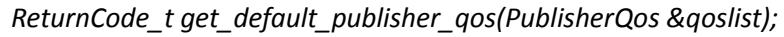
>

对于 DomainParticipant 创建的其他子实体（Subscriber、Topic），同样有类似的方法可以调用，

```text
模板 ： get_default_<Entity>_qos() 。 该方法会获取 DomainParticipant 最后一次调用
set_default_<Entity>_qos()后设置的缺省 QoS 策略。如果没有调用过该方法，那么将会返回缺省 QoS
```

策略的默认值。

注意：在设置缺省的 QoS 策略的同时（比如多线程操作），查询或者再设置相同 QoS 策略，或

者使用`<Entity>`_QOS _DEFAULT 内置变量创建子实体，是不安全的。

6.3.5 设置 DomainParticipant 的 Listener

应用程序可以给 DomainParticipant 设置相应的 DomainParticipantListener，也可以不设置，取决

于应用程序的需求。DomainParticipantListener 本质上是一系列回调方法的集合，ZRDDS 会在 Topic、

Publisher、Subscriber、DataWriter、或者 DataReader 的 Status 变化时调用相应的回调方法来通知应

用程序。实体本身可能已经初始化了相应的 Listener，如果某一实体没有监听特定的事件，则 ZRDDS

会将事件传送给该实体的父类工厂，如果父类工厂仍然不能处理该事件，则 ZRDDS 会继续将事件向

上一级实体传送，直到有一个 Listener 被调用或者该事件被丢弃。Listener 的相关信息参见 4.3 节。

注意：有些方法无法在回调方法中使用，具体参见 4.3.7 节。

DomainParticipantListener 可以在 DomainParticipant 创建的时候指定，也可以在创建后使用

set_listener()方法来设置：

例 6-12：创建 DomainParticipant 时设置 Listener。

```text
PublisherListener * listener;
StatusKindMask mask = DDS_STATUS_MASK_ALL;
domainParticipant = DomainParticipantFactory::get_instence()->create_publisher(
domain_id, pub_qos, listener, mask);
```

例 6-13：创建 DomainParticipant 后设置 Listener。

```text
mask = DDS_STATUS_MASK_NONE;
domainParticipant ->set_listener(listener, mask);
```

如果 DomainParticipant 设置了 DomainParticipantListener，则直到 DomainParticipant 被删除时才

可以销毁其对应的 Listener，中途销毁 DomainParticipantListener 是很不安全的，但是可以使用

set_listener()操作将 Listener 的值设为”NULL”。当 Listener 从 DomainParticipant 移除时需要安全的销

毁。

注意：多个 ZRDDS 内部的线程可以同时调用 DomainParticipantListener 的方法，所以必须保证

DomainParticipantListener 方法的多线程访问安全性。其他实体的 Listener 没有这项约束，其他实体

的 Listener 的创建方法如下：

- 设置 TopicListener（见 7.2.5 节）

- 设置 PublisherListener（见 8.2.5 节）

- 设置 DataWriterListener（见 8.3.4 节）

- 设置 SubscriberListener（见 9.2.5 节）

- 设置 DataReaderListener（见 9.3.4 节）

6.3.6 选择 Domain ID 和创建多个域

DomainParticipant 的 domainID 标识出它在哪个域中交换信息。拥有相同 domainID 的

DomainParticipant 处于同一个“交流频道”。拥有不同 domainID 的 DomainParticipant 相互间孤立。

大多分布式系统只要用一个域就可以满足所有的应用程序，所以一个 domainID 是足够的。一些

系统可能需要节点在逻辑上分区，从而避免它们之间的直接交流，所以需要使用多个域。当然，即

使是只需使用一个域的系统，在测试和开发阶段，开发人员也需要使用一个额外的 domainID 来使他

们的测试程序与正在运行的程序分开。

用户可以通过调用 DomainParticipant 的 get_domain_id()方法获得其 domainID。

6.3.7 查找 Topic Description

lookup_topicdescription()方法向用户提供根据 topic_name 查找本地创建的 TopicDescription 的功

能：

> 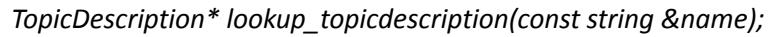
>

TopicDescription 类是 Topic、MultiTopic、ContentFilteredTopic 的基类，保存描述一个主题的所有

信息。用户可以将调用 lookup_topicdescription()方法返回的 TopicDescription 对象动态类型转换为一

个 Topic 或者 ContentFilteredTopic 对象。

如果 topic_name 对应的 TopicDescription 不存在，该方法将返回”NULL”。

```text
允许在 DomainParticipant 未使能时调用 lookup_topicdescription()方法。
注意：在创建或者删除 Topic 同时（如多线程）调用 lookup_topicdescription()方法是不安全的。
```

6.3.8 查找 Topic

```text
> 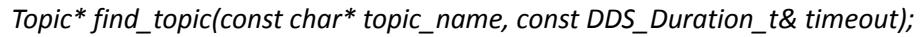
>
find_topic()方法根据用户提供的 topic_name 查找 Topic，若 Topic 已经存在则会创建并返回该
```

topic 的引用，否则会等待创建该 topic 直到超时，该操作会增加 Topic 对象的引用次数，在删除该

topic 时，该 topic 每有一个引用则需要多执行一次删除。

6.3.9 内置实体管理

```text
get_builtin_subscriber()方法向用户提供获取用户实体发现的内置订阅者的功能：
Subscriber* get_builtin_subscriber();
```

内置实体是指负责 DDS 中间件内部数据交互（发现信息、存活性信息）的主题、数据写者以及

数据读者。为了能够获取“发现信息”，域参与者提供访问内部订阅者的接口，用户再通过该内置订

阅者的功能获取想要的发现信息，内置实体由域参与者自动创建，并通过 Subscriber 的

lookup_datareader 接口获取内置的数据读者，使用内置的数据读者除了其生命周期与用户自定义数

据读者不同之外，其他操作与用户自定义数据读者一致。提供给用户使用的内置数据读者及其关联

的主题名称及其关联的数据类型参见下表：

表 6-4 内置数据读者及其关联的数据类型

| 内置数据读者 | 主题名称 | 数据类型 |
| --- | --- | --- |
| ParticipantBuiltinTopicDataDataRea<br>der | BUILTIN_PARTICIPANT_TOPIC_NA<br>ME | DDS_ParticipantBuiltinTopicD<br>ata |
| PublicationBuiltinTopicDataDataRea<br>der | BUILTIN_PUBLICATION_TOPIC_NA<br>ME | DS_PublicationBuiltinTopicDat<br>a |
| SubscriptionBuiltinTopicDataDataRe | BUILTIN_SUBSCRIPTION_TOPIC_N | DDS_SubscriptionBuiltinTopic |
| ader | AME | Data |

注意：获取到的内置实体不应该删除，否则会造成系统异常。

6.3.10 通信管理

- ignore_participant(const InstanceHandle_t& handle)

该方法用于忽略指定的域参与者，即如同未发现该域参与者，忽略该域参与者下的所有订

阅、发布信息。其中参数 handle 是用户标识远端的域参与者。

通信管理功能的常见使用场景为访问控制，即通过域参与者详细信息判断该域参与者数据

写者、数据读者是否具备相应的权限。如果已经发现了该域参与者则将解开与该域参者的匹配。

- ignore_publication(const Instancehandle_t& handle)

该方法用于忽略指定数据写者，即不予本地数据读者匹配。

忽略发布是对于本地的数据读者来说的，在该方法被调用之后，该域参与者下的所有数据

读者均不会收到来自该数据写者的数据。

- ignore_subscription(const Instancehandle_t& handle)

该方法用于忽略指定数据读者，即不与本地数据写者匹配。

忽略订阅是对于本地数据写者来说的，在该方法被调用之后，该域参与者下的所有数据写

者均不会向该数据读者发送数据。

6.3.11 域信息查询

- get_domain_id()

获取该域参与者所属的域。

- get_discovered_participant_data(ParticipantBuiltinTopicData& a_pd,const

InstanceHandle_t& a_handle)

该方法查询指定标识的域参与者的详细信息。

- get_discovered_participants(InstanceHandleSeq& discoved_handleList)

获取该域参与者发现的域参与者的标识列表（包含本身）。

在 ZRDDS 中，当域参与者使能后，会通过发现协议自动感知同一个域下的域参与者，并与

之交换当前实体的信息，以建立发布/订阅关系。域参与者发现远程域参与者的条件包括：

1) 两者在同一个域内；

2) 未调用 ignore_participant 方法手动忽略远程域参与者；

用户可以通过两种方式获取当前域参与者已经发现的其他域参与者信息：

1) 同步方式，用户在需要该信息时按如下步骤获取：

a) 用户调用本接口获取发现的域参与者标识；

b) 调用 get_discovered_participant_data 通过上一步中获取的标识查看远程域参与者

的详细信息；

2) 异步回调方式

a) 通过设置内置数据读者（ DDS::ParticipantBuiltinTopicDataDataReader ）的监听器。

b) 在监听器中获取发现远程域参与者的详细信息；同步方式优点在于比较简单，缺

点在于不能及时的获取最新的状态，或者说想要获取及时的状态的代价较高（通过高

频率的轮询）。异步回调方式，使用相对复杂，但能够及时的获取最新的发现状态。

6.3.12 其他 DomainParticipant 操作

- get_instance_handle()

获取一个实体的 InstanceHandle_t。

- contains_entity()

当用户拥有一个实体的 InstanceHandle_t 时，可以根据该函数的返回值来判断此实体是否

属于 DomainParticipant。

- get_publishers()

获取由 DomainParticipant 创建的 Pblisher 列表。

- get_subscribers()

获取由 DomainParticipant 创建的 Subscriber 列表。

## 第7章主题

DataWriter 和 DataReader 之间必须使用相同的主题（Topic）才能够相互通信。一个 Topic 包括

topic_name 和 type_name。type_name 是一个已经在 ZRDDS 中注册过的数据类型的名字；topic_name

是通信系统中的两个不同部分相互发现的关键，也是一个 Topic 区别于其它 Topic 的标识。一个数据

类型可以同时被多个 Topic 关联，但是每个 Topic 只能关联一个数据类型（通过 type_name）。

Topic、DataWriter、DataReader 之间的关系如下：

- 多个 Topic 可以关联同一个数据类型（包含相同的 type_name）；

- 用户程序可以让多个 DataWriter 关联同一个 Topic；

- 用户程序可以让多个 DataReader 关联同一个 Topic；

- 需要相互交流的 DataWriter 和 DataReader 必须关联相同的 Topic；

- Topic 由 DomainParticipant 创建和删除，所以归属于 DomainParticipant。当两个用户程序下

的 DomainParticipant 希望使用相同的 Topic 时（比如一个用户程序的 DataWriter 希望向另一个

用户程序的 DataReader 发布信息），他们必须各自创建具有相同 topic_name 和 type_name（并

且数据类型相同）的 Topic（即使两个用户程序在同一个物理节点上）（或者 topic_name 相同和

typecode 相同）。

本章主要包含以下内容：

- TopicDescription

- Topic

- Topic QoS

- ContentFilteredTopic

### 7.1. TopicDescription

TopicDescription 接口是主题和基于内容过滤主题的基类，抽象公共的属性包括名称、关联的类

型名称以及所属的域参与者，TopicDescription 的函数见表7-1。

表 7-1 Topic 函数

| 函数 | 描述 |
| --- | --- |
| get_participant | 获取代表的主题所属的域参与者 |
| get_type_name | 获取代表的主题在创建时传入的关联的数据<br>类型名称 |
| get_name | 获取代表的主题在创建时传入的主题名称 |

### 7.2. Topic

在用户创建一个 Topic 之前，必须保证已经创建了一个 DomainParticipant 并且已经在

DomainParticipant 中注册了一个数据类型。

Topic 经常在实体的一些操作中作为参数被使用。例如，Publisher/Subscriber 创建一个

DataWriter/DataReader。当创建好一个 Topic 之后，用户就可以通过 Topic 函数进行一系列操作，Topic

的函数如表7-2 所示。

表 7-2 Topic 函数

| 函数 | 描述 |
| --- | --- |
| enable() | 使能Topic |
| get_listener() | 获取Topic的Listener |
| set_listener() | 修改Topic的Listener |
| get_qos() | 获取Topic的QoS |
| set_qos() | 修改Topic的QoS |
| get_inconsistent_topic_status() | 获取发现的不一致Topic的状态 |
| get_participant() | 获取Topic所归属的DomainParticipant |
| get_instance_handle() | 获取实例句柄 |
| get_name() | 获取Topic的Topic name |
| get_type_name() | 获取Topic的Type name |
| get_status_changes() | 获取自从上次获取状态后状态的改变 |
| get_statuscondition() | 获取与Topic相关的StatusCondition |

7.2.1 创建 Topic

```text
DomainParticipant 通过 create_topic()方法创建 Topic：
Topic* create_topic(
```

const char * topic_name,

const char * type_name,

const TopicQos & qos,

TopicListener *a_listener,

const StatusKindMask &mask);

- topic_name：Topic 的名字，是 Topic 区别于其它 Topic 的标识符。

- type_name：新创建的主题关联的类型名称，需与注册时的名称一致。

- qos：本参数指定 Topic 的 QoS 策略。如果要使用默认的 QoS，则可以使用内置变

量”TOPIC_QOS_DEFAULT”作为参数，如果要使用自定义的 QoS，则可以自行构造一个 TopicQos，

关于 Topic 的 QoS 设置请参考 6.2.3 节。

注意：在多线程环境下使用”TOPIC_QOS_DEFAULT”作为参数创建 Topic 是不安全的，因为另

一个线程可能也在同时调用 set_default_topic_qos()函数。

- a_Listener：Listener 是一系列回调接口。当 Topic 有特定事件（状态变化）发生时，ZRDDS

使用 Listener 通知应用程序，关于 Topic 的 Listener 设置请参考 6.2.4 节。如果用户不需要安装

Listener，则可以将该参数设置为 NULL。

- mask：该参数为位掩码，用于选择性地开启 listener 的回调接口。mask 每一位的取值对应

Listener 是否相应一件特定的事件。如果用户希望 Listener 响应所有事件，可以将设置参数

为”DDS_STATUS_MASK_ALL”；如果用户希望 Listener 不响应任何事件，可以将参数设置

为”DDS_STATUS_MASK_NONE”。关于 Topic 的 Status 请参考 6.2.5 节。

例 7-1：用缺省的 QoS 策略创建 Topic.

```text
// 注册数据类型
string type_name= FooTypeSupport::get_instance()->get_type_name();
ReturnCode_t rtn = FooTypeSupport::get_instance()->register_type(participant,
type_name.c_str());
if(rtn !=DDS_RETCODE_OK ) {/* error */ }
// 创建Topic
Topic* m_topic = participant->create_topic(
```

“ExampleFoo”,

type_name.c_str(),

TOPIC_QOS_DEFAULT,

NULL,

```text
DDS_STATUS_MASK_NONE);
if(m_topic == NULL){/* error */ }
```

7.2.2 删除 Topic

```text
用户通过使用 DomainParticipant 的 delete_topic()方法，删除一个 Topic：
ReturnCode_t delete_topic(Topic *a_topic);
```

注意：当存在任意一个 DataWriter 或者 DataReader 仍然在使用 Topic 时，不能删除该 Topic。所

以，在删除一个 Topic 之前，必须保证关联它的 DataWriter 和 DataReader 已经被删除。

当 DomainParticipant 使用 find_topic 查找过该 topic 时，需要额外执行 delete_topic()删除该 topic

才能真正将该 topic 删除（每查找一次需额外执行一次删除）。

7.2.3 设置 Topic 的 QoS 策略

Topic 的 QoS 除 topic_data 用于提供额外的存储空间外，其余 QoS 用于预先设置 DataWriter 和

DataReader 的 QoS（见 copy_from_topic_qos()）。以下是 TopicQos 的结构，相关描述见表7-1。

TopicQos struct

```text
{
DDS_TopicDataQosPolicy topic_data;
DDS_DurabilityQosPolicy durability;
DDS_DurabilityServiceQosPolicy durability_service;
DDS_DeadlineQosPolicy deadline;
DDS_LatencyBudgetQosPolicy latency_budget;
DDS_LivelinessQosPolicy liveliness;
DDS_ReliabilityQosPolicy reliability;
DDS_DestinationOrderQosPolicy destination_order;
DDS_HistoryQosPolicy history;
DDS_ResourceLimitsQosPolicy resource_limits;
DDS_TransportPriorityQosPolicy transport_priority;
DDS_LifespanQosPolicy lifespan;
DDS_OwnershipQosPolicy ownership;
};
```

表 7-1Topic 的 QoS 策略

| QoS策略 | 描述 | 参考 |
| --- | --- | --- |
| Deadline | 用于初始化DataReaderQos和DataWriterQos的Deadline。 | 见10.4节 |
| DestinationOrder | 用于初始化 DataReaderQos 和 DataWriterQos 的<br>DestinationOrder。 | 见10.5节 |
| Durability | 用于初始化DataReaderQos和DataWriterQos的Durability。 | 见10.7节 |
| DurabilityService | 用于初始化 DataReaderQos 和 DataWriterQos 的<br>DurabilityService。 | 见 10.34<br>节 |
| History | 用于初始化DataReaderQos和DataWriterQos的History。 | 见 10.10<br>节 |
| LatencyBugdet | 用于初始化 DataReaderQos 和 DataWriterQos 的<br>LatencyBugdet。 | 见 10.35<br>节 |
| Lifespan | 用于初始化DataReaderQos和DataWriterQos的Lifespan。 | 见 10.11<br>节 |
| Liveliness | 用于初始化DataReaderQos和DataWriterQos的Liveliness。 | 见 10.12<br>节 |
| Ownership | 用于初始化DataReaderQos和DataWriterQos的Ownership。 | 见 10.15<br>节 |
| Reliability | 用于初始化DataReaderQos和DataWriterQos的Reliability。 | 见 10.25<br>节 |
| ResourceLimits | 用于初始化 DataReaderQos 和 DataWriterQos 的<br>ResourceLimits。 | 见 10.26<br>节 |
| TopicData | 为用户提供额外的topic存储空间 | 见 10.29<br>节 |
| TransportPriority | 用于初始化 DataReaderQos 和 DataWriterQos 的<br>TransportPriority。 | 见 10.36<br>节 |

7.2.3.1 在创建 Topic 时配置 QoS 策略

在例7-2 中，用内置变量”TOPIC_QOS_DEFAULT”作为 QoS 参数，在创建 Topic 时使用缺省的 QoS

策略，缺省的 TopicQos 策略由 DomainParticipant 配置。用户可以调用 DomainParticipant 的

set_default_topic_qos()方法改变缺省的 TopicQos 值。

在创建 Topic 时，也可以不使用缺省的 QoS 策略。用户可以先调用 DomainParticipant 的

get_default_topic_qos()方法初始化一个 TopicQos 对象，然后再自定义修改这个对象的值，最后再创

建 Topic 时将这个对象作为 QoS 参数传递，见例7-2。

例 7-2：用自定义的 QoS 策略创建 Topic。

```text
//获取当前QoS 策略
Topic topic_qos;
if(participant-> get_default_topic_qostopic_qos() != DDS_RETCODE_OK){/* error */ }
//修改QoS 策略
topic_qos.ownership.kind = DDS_EXCLUSIVE_OWNERSHIP_QOS;
// 创建Topic
Topic* m_topic = participant->create_topic(
```

“ExampleFoo”,

type_name,

topic_qos,

NULL,

```text
DDS_STATUS_MASK_NONE);
if(m_topic == NULL) {/* error */ }
```

7.2.3.2 在创建 Topic 后配置 Qos 策略

```text
可以在 Topic 创建后修改它的 QoS 策略，如例7-3 所示。该示例首先通过调用 get_qos()方法获
取 Topic 当前的 QoS 策略，在修改 QoS 策略值后，调用 set_qos()方法更新的 Topic 的 QoS 策略。注
```

意一些 QoS 策略在 Topic 使能后无法被修改（Topic 永远是使能的）。

例 7-3：修改 Topic 的 QoS 策略。

```text
//获取当前QoS 策略
Topic topic_qos;
if(topic->get_qos(topic_qos) != DDS_RETCODE_OK) {/* error */ }
//修改QoS 策略
topic_qos.deadline.period.sec = 1;
//设置新的QoS 策略
if(topic->set_qos(topic_qos) != DDS_RETCODE_OK ) {/* error */ }
```

7.2.4 TopicQos

在 TopicQos 的 QoS 策略中，只有 TopicDataQosPolicy 直接应用于 Topic 自身。TopicQos 剩余的部

分可以用来设置 DataWriter 或者 DataReader 的 QoS 策略。在设置 TopicQos 或者复制 TopicQos 到

DataWriterQos 和 DataReaderQos 时，DDS 不会检查这些值是否正确，因此用户需要保证复制的 QoS

在使用时不会出错。

使用 TopicQos 来配置 DataWriter 或 DataReader 的 QoS 策略，是使关联同一个 Topic 的 DataWriter

和 DataReader 共享一系列 QoS 策略的好方法，并且可以有效避免 QoS 策略不一致性的问题。

7.2.4.1 用 Topic 的 QoS 策略赋值 DataWriter 的 QoS 策略

使用 TopicQos 来配置 DataWriter 的 QoS 策略，有以下方法：

```text
- 调用 create_datawriter()时，设置 QoS 参数为”DATAWRITER_QOS_USE_TOPIC_QOS”。
- 调用 Publisher 的 copy_from_topic_qos()方法来使用 TopicQos 给 DataWriterQos 赋值。
```

7.2.4.2 用 Topic 的 QoS 策略赋值 DataReader 的 QoS 策略

使用 TopicQos 来配置 DataReader 的 QoS 策略，有以下方法：

```text
- 调用 create_datareader()时，传递 QoS 参数”DATAREADER_QOS_USE_TOPIC_QOS”。
- 调用 Subscriber 的 copy_from_topic_qos()方法使用 TopicQos 给 DataReaderQos 赋值。
```

7.2.5 设置 Topic 的 Listener

应用程序可以给 Topic 设置相应的 TopicListene（r 用户需要继承 TopicListener 并实现 TopicListener

的方法 ）， 也可以不设置 ， 取决于应用程序的需求 。 TopicListener 只有一个回调函数

on_inconsistent_topic()，当设置好一个 TopicListener 后，只要该 Topic 监测到其他的应用程序创建了

一个具有相同 topic_name 却关联了不同的数据类型的 Topic，ZRDDS 会立刻调用 TopicListener 的

on_inconsistent_topic()方法。

7.2.6 关于 Topic 的 Status

Topic 只有一个状态 ——INCONSISTENT_TOPIC Status 。 用户可以通过调用

get_inconsistent_topic_status()方法获取当前的 INCONSISTENT_TOPIC Status 信息，也可以通过

TopicListener 来获取 INCONSISTENT_TOPIC Status 的改变信息。

- INCONSISTENT_TOPIC Status

为了保证两个应用程序使用相同的 Topic 进行通信，必须保证 Topic 具有相同的 topic_name

和数据类型。这个状态负责检测 DomainParticipant 是否创建了一个与本地 Topic 名称相同、数

据类型不同的 Topic。当本地 DomainParticipant 使用该 topic 创建了一个 DataWriter(DataReader)

时，其他 DomainParticipant 使用 topic_name 相同数据类型不同的 topic 创建了一个

DataReader(DataWriter)，该状态会改变。

当 INCONSISTENT_TOPICStatus 改变时 ， ZRDDS 将会调用 TopicListener 的

on_inconsistent_topic()方法。也可以调用 Topic 的 get_inconsistent_topic_status()方法获取

INCONSISTENT_TOPIC 的当前状态。

7.2.7 查询操作

- 查询 Topic 的 DomainParticipant：

DomainParticipant* get_participant();

- 查询 Topic 的 topic_name：

char* get _name();

- 查询 Topic 的 type_name：

char* get_type_name();

### 7.3. ContentFilteredTopic

ContentFilteredTopic 是一种能够过滤内容的主题，它允许在订阅主题的同时指定一个感兴趣的

主题数据的子集。例如，假设有一个主题的内容包含锅炉的温度，而用户只对正常操作范围以外的

温度系数感兴趣。一个基于内容过滤的主题可以用来限制 DataReader 需要处理的数据量，以及减少

网络内发送的数据量。

当创建了一个 ContentFilteredTopic，用户可以使用表7-2 中的相关操作：

表 7-2ContentFilteredTopic 的相关操作

| 操作 | 描述 |
| --- | --- |
| set_expression_parameters() | 设置过滤表达式参数 |
| get_expression_parameters() | 获取过滤表达式参数 |
| get_related_topic() | 获取关联的主题 |
| get_participant() | 获取创建该ContentFilterTopic的DomainParticipant |
| get_type_name() | 获取类型名称 |
| get_name() | 获取ContentFilteredTopic的名称 |

7.3.1 ContentFilteredTopic 介绍

ContentFilteredTopic 在 Topic（也称作关联主题）和用户指定的过滤内容之间建立一种联系，过

滤内容包括一个过滤表达式和一系列参数。

- 过滤表达式是关于主题内容的一个逻辑表达式，类似于 SQL 表达式中的 WHERE 子句。

- 参数是向过滤表达式中的参数提供值的字符串，过滤表达式中的每一个参数必须传入一个

对应的参数字符串。

ContentFilteredTopic 是 TopicDescription 的子类，并且可以用来创建 DataReader。但是

ContentFilteredTopic 并不是 DDS 实体——它不具有 QoS 策略和 Listener。

ContentFilteredTopic 与其他 DDS 实体的关系如下：

- ContentFilteredTopic 只在创建 DataReader 时使用，而 DataWriter 不可以。

- 一个 ContentFilteredTopic 可以创建多个 DataReader。

- ContentFilteredTopic 属于 DomainParticipant（可被其创建或删除）。

- ContentFilteredTopic 和 Topic 必须在同一个 DomainParticipant 下。

- 一个 ContentFilteredTopic 只能关联到一个 Topic 上。

- 一个 Topic 可以关联到多个 ContentFilteredTopic 上。

- 同一 DomainParticipant 下的多个 ContentFilteredTopic、Topic 必须具有不同的名字。

- 由 ContentFilteredTopic 创建的 DataReader 将使用关联的 Topic 的 QoS 和 Listener。

- 当改变 ContentFilteredTopic 参数时，所有与该 ContentFilteredTopic 关联的 DataReader 都能

监测到改变。

- 与 Topic 关联的 ContentFilteredTopic 都被删除后才能删除该 Topic。

- 与 ContentFilteredTopic 关联 DataReader 删除后才能删除该 ContentFilteredTopic。

7.3.2 创建 ContentFilteredTopic

```text
用 DomainParticipant 的 create_contentfilteredtopic( )方法创建 ContentFilteredTopic：
ContentFilteredTopic * create_contentfilteredtopic(
```

const char* name,

const Topic * related_topic,

const char *filter_expression,

const StringSeq& expression_parameters);

- name：ContentFilteredTopic 的名字，该参数不能为空。需要注意，该名称仅仅用于底层唯

一标识 ContentFilteredTopic ， 为了支持 lookup_topicdescription ， 该名称应与同一个

DomainParticipant 下 Topic、ContentFilteredTopic 名称不同；

- related_topic：需要被过滤的 Topic，该参数不能为空。需要注意，ContentFilteredTopic 与

所关联的 Topic 必须在同一个 DomainParticipant 下 ， 并且一个 Topic 可以与多个

ContentFilteredTopic 相关联。

- filter_expression：关于 Topic 内容的一个逻辑表达式。如果为”true”，则数据样本被接收，

否则该数据样本将被抛弃。ContentFilteredTopic 被创建后， filter_experssion 不可以再改变。该

参数不能为空。

- expression_parameters：关于表达式参数的字符串队列。每个参数对应过滤表达式的相应

位置。该参数可通过 set_expression_parameters()函数进行修改。

例 7-4：创建一个 ContentFilteredTopic。

```text
//定义相关参数
char cftopic_name[16] = "cftopic_name";
char cftopic_expre[32] = "writerID=%0 AND dataSize=%1";
StringSeq cf_parameters;
cf_parameters.maximum(2);
cf_parameters.length(2);
const char *tmp = "1";
cf_parameters.set_at(0 ,tmp);
tmp = "2";
cf_parameters.set_at(1, tmp);
//创建 CFTopic
ContentFilteredTopic * content_filtered_topic = pDP->create_contentfilteredtopic(
```

cftopic_name,

topic,

cftopic_expre,

```text
cf_parameters);
if(content_filtered_topic == NULL) { /* error */ }
```

7.3.3 删除 ContentFilteredTopic

- 确保没有 DataReader 正在使用 ContentFilteredTopic 时才可以删除 ， 否则将返

回”DDS_RETCODE_PRECONDITION_NOT_MET”。

```text
 delete_contentfilteredtopic( )函数删除 ContentFilteredTopic： ReturnCode_t delete_contentfilteredtopic ( ContentFilteredTopic * a_contentfilteredtopic )
```

7.3.4 ContentFilteredTopic 的相关操作

7.3.4.1 设置过滤表达式参数

```text
用 set _expression_parameters( )函数设置过滤表达式参数：
ReturnCode_t set_expression_parameters(const StringSeq& parameters)
```

- parameters：过滤表达式参数，该参数不能为空。参数序列中的每个元素对应于过滤表达

式中相应的位置。

ContentFilteredTopic 的操作不会改变序列，用户必须确保参数序列是有效的。相关内容请参考

字符串支持章节中关于序列细节的描述。

7.3.4.2 获取当前过滤表达式参数

```text
用 get_expression_parameters( )函数获取过滤表达式参数：
ReturnCode_t get_expression_parameters (StringSeq & parameters)
```

- parameters：过滤表达式参数，该参数不能为空。参数序列的字符串内存大小是按照字符

串支持的相关描述来配置的。

这个操作将返回给用户最后一次成功调用 set_expression_parameters( )时指定的表达式参数，如

果该函数一直未被调用，则返回创建 ContentFilteredTopic 时设置的参数。

7.3.5 SQL 过滤表达式

SQL 过滤表达式类似于 SQL 中的 WHERE 子句。

7.3.5.1 SQL 语法

本节描述了 SQL 语法的子集——巴克斯诺尔范式（BNF），可以用于创建过滤表达式。

本节使用了以下字体规定：

- 非终结符使用斜体排版。

- ‘终结符’使用引用并使用等宽字体排版。下面的大多数 BNF 语法使用大写，但是不区分

大小写。

- 符号使用加粗排版。

- 符号（元素 // ‘,’）代表一个非空的用逗号分隔的元素列表。

```text
FilterExpression ::= Condition Condition ::= Predicate | Condition 'AND' Condition | Condition 'OR' Condition | 'NOT' Condition | '(' Condition ')' Predicate ::= ComparisonPredicate | BetweenPredicate ComparisonPredicate ::= Fieldname RelOp Parameter | Parameter RelOp Fieldname | Fieldname RelOp Fieldname BetweenPredicate ::= Fieldname 'BETWEEN' Range | Fieldname 'NOT BETWEEN' Range Fieldname::= FIELDNAME
```

.

```text
RelOp ::= '=' | '>' | '>=' | '<' | '<=' | '<>' Range ::= Parameter TO Parameter Parameter ::= INTEGERVALUE | CHARVALUE | FLOATVALUE | STRING | PARAMETER
```

7.3.5.2 符号表达式

以下描述了 SQL 语法中使用的符号的语法和意义：

FIELDNAME——数据结构体中域的一个引用。一个点“.”操作结构体的成员。一个 FILEDNAME 中

能够使用的点号没有限制。FIELDNAME 可以引用任意深度的数据结构体。域的名字由 IDL 中定义的

对应结构体决定，域名能否匹配取决于语言（如 C/C++、Java）规定的结构体映射。参考数组和序列

（Sequence）中第 n+1 个元素使用符号‘[n]’（n 是自然数，包含 0）。FIELDNAME 必须是一个原始的

IDL 类型：它可以是 boolean、octet、(unsigned)short、(unsigned)long、(unsigned)long long、float、

double、char、string 或 enum。

```text
FIELDNAME: FieldNamePart ( "." FieldNamePart )*
where FieldNamePart : IDENTIFIER ( "[" Index "]" )*
```

Index> : (["0"-"9"])+

| ["0x","0X"](["0"-"9", "A"-"F", "a"-"f"])+

INTEGERVALUE——任何连续的数字，可以选择在之前添加加号或减号，代表系统范围之内的十

进制整数。十六进制数使用 0x 开头并且必须是有效的十六进制表达式。

> 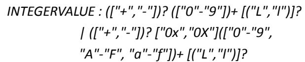
>

CHARVALUE——使用[0, 255]整型表示。

FLOATVALUE——任何连续的数字，可以选择在之前添加加号或减号并且可以选择包含小数点

（‘.’）。10 的指数表示可能使用 en 或 En 语法（n 是一个数字，可选择加号或减号前缀）加在尾部。

> 
>

STRING——单引号中任何连续的字符（除了单引号）。

STRING : "'" (~["'"])* "'"

PARAMETER——格式是%n，n 是小于 100 的自然数（包括 0）。它引用给出的第 n+1 个参数。该

参数只能是原始类型值格式。它不能是 FIELDNAME。

PARAMETER : "%" (["0"-"9"])+

7.3.5.3 兼容性判断

只有某些类型对比组合是有效的，见表7-3。

表 7-3 有效类型对比

|  | BOOLEAN<br>VALUE | INTEGER<br>VALUE | FLOAT<br>VALUE | CHAR<br>VALUE | STRING | ENUMERATED<br>VALUE |
| --- | --- | --- | --- | --- | --- | --- |
| BOOLEAN | YES |  |  |  |  |  |
| INTEGERVALU |  | YES | YES |  |  |  |
| FLOATVALUE |  | YES | YES |  |  |  |
| CHARVALUE |  |  |  | YES | YES | YES |
| STRING |  |  |  | YES | YES | YES |
| ENUMERATED<br>VALUE |  | YES |  | YES | YES | YES |

7.3.5.4 字符串

过滤表达式和参数可以使用 IDL 的字符串。字符串常量必须放在单引号中间。

例 7-5：

“string_type =‘this is a string’”

7.3.5.5 数组

数组使用熟悉的“[]”符号。

例 7-6：

```text
struct ArrayType {
long value[255][5];
};
```

使用 ArrayType 类型的主题时以下表达式是有效的：

"value[244][2] = 5"

7.3.5.6 序列

序列的元素使用“[]”。

例 7-7：

```text
struct SequenceType {
sequence<long> s;
```

};

使用 SequenceType 类型的主题时以下表达式是有效的：

> 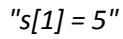
>

### 7.4. TypeSupport

类型支持接口用于向 ZRDDS 中间件注册用户自定义类型（IDL 文件），因此定义以下接口，并且

用户自定义类型支持接口实现这些接口（由编译器自动生成）。

表 6-4 TypeSupport 的函数

|  | 函数 | 描述 |
| --- | --- | --- |
| 单例管理 | get_instance() | 获取单例。 |
|  | finalize_instance() | 销毁单例。 |
| 注册类型 | register_type() | 向指定的域参与者注册类型，由子类实现。 |
| 注销类型 | unregister_type() | 从指定的域参与者中注销类型，由子类实现。 |
| 获取类型名称 | get_type_name() | 获取类型的默认名称。 |
| 是否含有键值 | has_key() | 类型是否含有健域。 |

用户调用 register_type 后，ZRDDS 中间件将会把该类型对象（样本）的生命周期函数、序列化

以及反序列化函数等注册到底层，在数据传输时调用。

## 第8章发布数据

本章将讨论如何创建、配置和使用发布者（Publisher）与数据写者（DataWriter）来进行数据发

布。本章还描述了这些实体之间的交互关系以及所能进行的操作。

本章主要包含以下内容：

- 概述：数据发布过程

- Publisher

- Publisher QoS

- DataWriter

- DataWriter QoS

本章旨在帮助用户熟悉数据发布过程及其所需的实体。

### 8.1. 概述：数据发布过程

典型的数据发布过程如下：

- 创建和配置相关类型对象

1) 使用 DomainParticipantFactory 创建 DomainParticipant。

2) 使用 TypeSupport 向 DomainParticipant 注册一个类型。该类型从用户提供的 IDL 文件

中生成，例如“FooDataType”。

3) 使用 DomainParticipant 创建一个关联已注册数据类型的 Topic。

4) 使用 DomainParticipant 创建 Publisher。

5) 使用 Publisher 和 Topic 创建一个 DataWriter。

6)将获得的 DataWriter 使用安全方式转换成具体数据类型的 DataWriter，例如

“dynamic_cast`<FooDataTypeDataWriter*>`( datawriter)”。

注意：其中步骤 4)可以在步骤 2)或者步骤 3)之前完成，不影响结果。

- 发布数据

1) 创建一个数据对象，例如“Foo”的对象，并为其成员进行赋值。注意：如果该对

象仅用于注册（见步骤 2），则仅需对是键的成员进行赋值（详细信息请参见 2.7 节有关

键的介绍）。

2) （可选）通过传入 Foo 的对象向 FooDataWriter 注册数据实例，获得一个

InstanceHandle_t。对于有键域的类型，键域填充不同的值会获得不同的 InstanceHandle_t，

对于没有键域的类型，使用任何该类型的对象注册均会获得同一个 InstanceHandle_t。

3) 调用“FooDataWriter”的 write()函数，传入 Foo 对象和注册数据实例时获得的

InstanceHandle_t。对于没有注册的实例，可以传入”DDS_HANDLE_NIL_NATIVE”值，ZRDDS

将为用户完成注册工作。每一次发布的一个数据称为一个样本。ZRDDS 会保存用户所提

供的样本并根据用户设置的 QoS 进行相应的处理。当 DataWriter 发现与之匹配的

DataReader 时，样本将会被传送到物理传输设备进行传输。当发布过程完成后，不论成

功与否，write()函数将会返回。

### 8.2. Publisher

一个需要发布数据的应用程序需要如下 ZRDDS 实体：DomainParticipant，Topic，Publisher 和

DataWriter。所有的 ZRDDS 实体都拥有一个与之相对应的 Listener 和一系列 QoS 配置。Listener 用于

在 ZRDDS 实体的状态发生改变时通知应用程序。QoS 配置允许用户的应用程序设置 ZRDDS 实体的行

为和资源使用。

发布过程涉及的一系列 ZRDDS 实体的主要工作如下：

- DomainParticipant 实体指定了发布的信息所在的域。

- Topic 实体指定了要订阅的数据的名字以及数据相关的类型。

- 应用程序通过 DataWriter 发布数据。DataWriter 在创建时被绑定到一个 Topic 上，因此，

DataWriter 发布的数据都有一个特定的名字和类型。应用程序使用 DataWriter 的 write 函数来表

明一个新的数据样本可被发布。

- Publisher 管理了若干 DataWriter 的行为。Publisher 决定了数据何时被真正发布到另一个应

用程序。根据Publisher和DataWriter的QoS设定，数据有可能在发布之前被暂存甚至不被发布。

默认情况下，数据在调用 write()函数的时候被发布。

> 
>
> **图示信息：**
> - A single labeled box with the text 'Data' centered on a black background.
> - Label: 'Data'
> - Box is light gray with rounded corners and subtle shadow

> 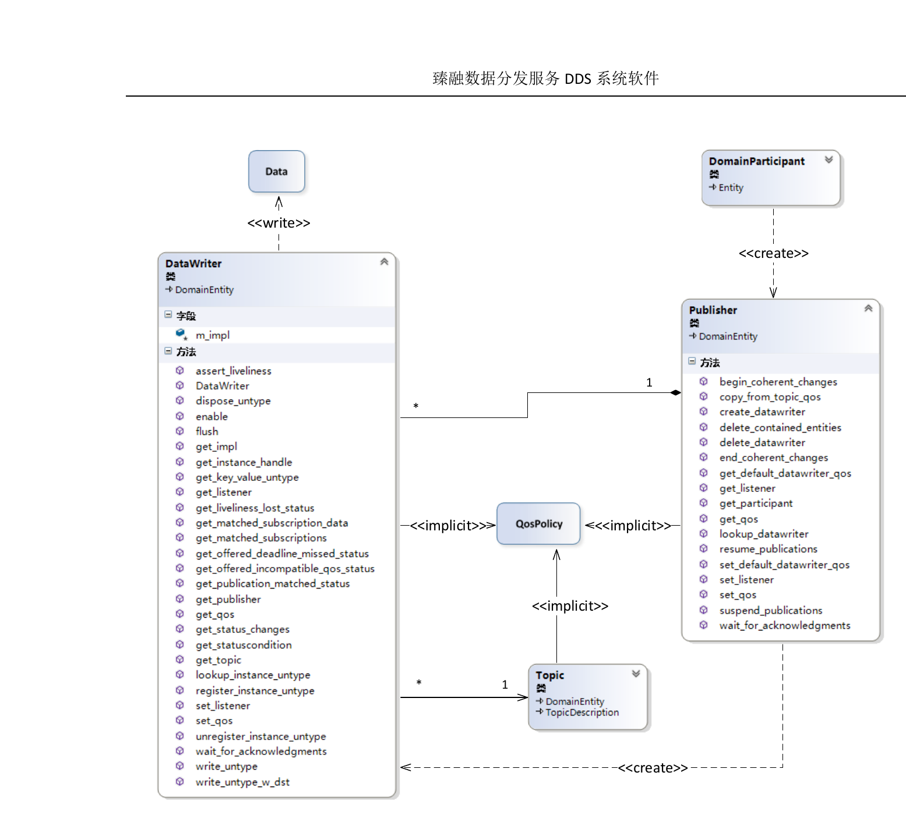
> **图 8-1ZRDDS 发布端模型**
> **图示信息：** UML class diagram showing relationships among DataWriter, Publisher, Topic, QosPolicy, DomainParticipant, and Data entities in the DDS system software.
图 8-1ZRDDS 发布端模型

用户可以选择使用多个 Publisher，每个 Publisher 管理若干 DataWriter，也可以使用一个 Publisher

管理所有的 DataWriter。ZRDDS 发布端模型如图8-1 所示，展示了我们提到的这些实体之间的关联

关系以及每个实体所拥有的函数。

当用户拥有一个 Publisher 以后，可以使用 Publisher 的函数进行一系列操作，其中最主要的函

数是 create_datawriter()，具体如表8-1 所示：

表 8-1Publisher 的函数

|  | 函数 | 描述 |
| --- | --- | --- |
|  | enable() | 使能Publisher |
|  | get_listener() | 获取Publisher的Listener |
|  | set_listener() | 设置Publisher的Listener |
|  | get_qos() | 获取Publisher的QoS |
|  | set_qos() | 设置Publisher的QoS |
|  | create_datawriter() | 创建一个DataWriter |
| DW<br>相关<br>操作 | delete_datawriter() | 删除一个属于该Publisher的DataWriter |
|  | delete_contained_entities() | 删除该Publisher创建的所有DataWriter |
|  | lookup_datawriter() | 根据Topic名字查找该Publisher的DataWriter |
|  | copy_from_topic_qos() | 将TopicQoS复制到DataWriterQoS中 |
|  | get_default_datawriter_qos() | 获取Publisher的默认DataWriterQos值 |
|  | set_default_datawriter_qos() | 设置Publisher的默认DataWriterQos值 |
|  | begin_coherent_changes() | 表明程序将开始一系列连续发布 |
|  | end_coherent_changes() | 结束连续发布 |
| 获取<br>Pub<br>相关<br>信息 | get_participant() | 获取创建该Publisher的DomainParticipant |
|  | get_instance_handle() | 获取实例的句柄 |
|  | get_status_changes() | 获取自从上次获取状态后状态的改变 |
|  | get_statuscondition() | 获取与Publisher相关的StatusCondition |
| 其他 | wait_for_acknowledgments() | 阻塞线程直到所有数据被对端响应或超时 |
|  | suspend_publications() | 挂起Publisher下所有DataWriter的数据发布。 |
|  | resume_publications() | 取消挂起Publisher下所有DataWriter的数据发布。 |

8.2.1 创建 Publisher

在创建 Publisher 之前，需要有一个 DomainParticipant（见 6.3 节）。获得了 DomainParticipant

之后，可以使用 DomainParticipant 的函数 create_publisher()函数创建 Publisher。create_publisher()

函数原型如下：

> 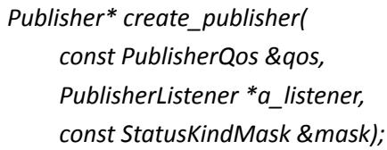
>

- qos：本参数指定 Publisher 的 QoS 策略。如果要使用默认的 QoS，则可以使用内置变

量”PUBLISHER_QOS_DEFAULT”作为参数，如果要使用自定义的 QoS，则可以自行构造一个

PublisherQos，关于 Publisher 的 QoS 设置请参考 8.2.4 节。

注意：在多线程环境下使用”PUBLISHER_QOS_DEFAULT”作为参数创建 Publisher 是不安全

的，因为另一个线程可能也在同时调用 DomainParticipant 的 set_default_publisher_qos()函数。

- a_listener：Listener 是一系列回调接口。当 Publisher 和由其创建的 DataWriter 有特定事件

发生时，ZRDDS 使用 Listener 通知应用程序，关于 Publisher 的 Listener 设置请参考 7.2.5 节。如

果用户不需要安装 Listener，则可以将该参数设置为”NULL”。

- mask：该参数为位掩码，用于选择性地开启 listener 的回调接口。mask 每一位的取值对应

Listener 是否相应一件特定的事件。如果用户希望 Listener 响应所有事件，可以将设置参数

为”DDS_STATUS_MASK_ALL”；如果用户希望 Listener 不响应任何事件，可以将参数设置

为”DDS_STATUS_MASK_NONE”。关于 Publisher 的 Status 请参考 7.2.6 节。

例 8-1：使用默认的 QoS 创建一个 Publisher。

Publisher* publisher = participant->create_publisher(

PUBLISHER_QOS_DEFAULT,

NULL,

```text
DDS_STATUS_MASK_NONE);
if (publisher == NULL) { /* error */};
```

8.2.2 删除 Publisher

删除 Publisher 包含两个步骤：

```text
- 首先要删除该 Publisher 创建的所有 DataWriter。可以使用 Publisher 的 delete_datawriter()
或者 delete_contained_entities()操作删除 DataWriter。
- 通过 DomainParticipant 的 delete_publisher()操作删除 Publisher。
```

8.2.3 删除 Publisher 的所有子实体

Publisher 的 delete_contained_entities()操作可以删除由该 Publisher 创建的所有 DataWriter，函

数原型如下：

ReturnCode_t delete_contained_entities();

当该函数成功返回之后，应用程序可以安全删除 Publisher。

8.2.4 设置 Publisher 的 QoS 策略

Publisher 的 QoS 控制其具体行为，可认为 QoS 是 Publisher 的属性。PublisherQos 类结构如下：

class PublisherQos

```text
{
DDS_PresentationQosPolicy presentation;
DDS_PartitionQosPolicy partition;
DDS_GroupDataQosPolicy group_data;
DDS_EntityFactoryQosPolicy entity_factory;
DDS_AsynchronousPublisherQosPolicy asynchronous_publisher;
};
```

PublisherQos 各项的含义见第10 章。

8.2.4.1 创建 Publisher 时配置 QoS 策略

- 如例 8-1 所示，可以使用”PUBLISHER_QOS_DEFAULT”作为 Publisher 创建时的 QoS 参数，此

时 DomainParticipant 会使用其保存的默认 PublisherQos。DomainParticipant 保存的默认

PublisherQos 可以使用 DomainParticipant 的 set_default_publisher_qos()操作进行修改。

- 也可以使用自定义的 QoS 创建 Publisher，具体过程见例 8-2。如代码所示，首先通过

DomainParticipant 的 get_default_publisher_qos()操作初始化 PublisherQos 对象，然后在默认值的

基础上进行修改，修改后的对象可以被用于创建 Publisher。

例 8-2：使用自定义的 QoS 创建 Publisher。

```text
// 获取默认PublisherQos PublisherQos publisher_qos; if (participant->get_default_publisher_qos(publisher_qos) !=DDS_RETCODE_OK) {/* error */} // 在此处修改QoS<sub>，</sub> 例如修改ENTITY_FACTORY QoS publisher_qos.entity_factory.autoenable_created_entities =false; // 创建Publisher Publisher* publisher = participant->create_publisher( publisher_qos, NULL, DDS_STATUS_MASK_NONE); if (publisher == NULL) {/* error */}
```

8.2.4.2 创建 Publisher 后配置 QoS 策略

```text
如例8-3 所示，在 Publisher 创建之后，可以使用 get_qos()和 set_qos()操作进行 QoS 的获取和设
置。通过 get_qos()操作可以获取 Publisher 当前的 QoS，在修改其值之后，使用 set_qos()操作设置新
```

的 QoS。需要注意的是，在 Publisher 使能之后，某些 QoS 不能再被修改。

例 8-3：在 Publisher 创建后修改其 QoS。

```text
// 获取当前Publisher 的QoS
PublisherQos publisher_qos;
if (publisher->get_qos(publisher_qos) != DDS_RETCODE_OK) {/* error */}
// 修改QoS
publisher_qos.entity_factory.autoenable_created_entities =true;
// 设置新的QoS
if (publisher->set_qos(publisher_qos) != DDS_RETCODE_OK ) {//error }
```

8.2.4.3 获取及设置默认 DataWriter 的 QoS 策略

Publisher 会保存一个默认的 DataWriterQos 值 ， 用于在应用程序使

用”DATAWRITER_QOS_DEFAULT”作为参数创建 DataWriter 时设置 DataWriterQos，该值可以被

```text
set_default_datawriter_qos()操作修改：
ReturnCode_t set_default_datawriter_qos(const DataWriterQos &qoslist);
默认 DataWriterQos 可以通过 get_default_datawriter_qos()操作获取：
ReturnCode_t get_default_datawriter_qos(DataWriterQos &qoslist);
```

该函数获取的值与在创建 DataWriter 时使用”DATAWRITER_QOS_DEFAULT”作为参数得到的

DataWriterQos一致，即该函数获取的DataWriterQos是最后一次成功调用set_default_datawriter_qos()

所传入的值。

注意：在多线程使用时，设置和获取默认的 DataWriterQos 是不安全的。当设置默认的

```text
DataWriterQos 时 ， 其他线程可能调用 get/set_default_datawriter_qos() 操作或者使
用 ”DATAWRITER_QOS_DEFAULT” 作为参数调用 create_datawrite() 操作 。 同时 ， 当获取默认
DataWriterQos 时，其他线程也可能同时调用 set_default_datawriter_qos()操作。
```

8.2.5 设置 Publisher 的 Listener

应用程序可以给 Publisher 设置相应的 PublisherListener，也可以不设置，取决于应用程序的需

求。PublisherListener 本质上是一系列回调方法的集合，ZRDDS 会在相关的 Status 变化时调用相应的

回调方法来通知应用程序。Listener 的相关信息参见 5.3 节。

注意：有些方法无法在回调方法中使用，具体参见 5.3.6 节。

PublisherListener是DataWriterListener的扩展，也就是说PublisherListener包含DataWriterListener

的所有回调函数。PublisherListener 没有特有的 Status 和对应的回调函数。当 DataWriter 发生了

DataWriter 的 Listener 没有监听而 Publisher 的 Listener 监听了的事件时，DDS 将会调用 Publisher 的

Listener 回调函数，如果 Publisher 和 DataWriter 的 Listener 都没有监听该事件，那么事件将会传递到

DomainParticipant 的 Listener。

PublisherListener 可以在 Publisher 创建的时候指定，也可以在创建后使用 set_listener()方法来设

置，如例8-4 和例8-5 所示。

例 8-4：创建 Publisher 时设置 Listener。

```text
PublisherListener * listener;
StatusKindMask mask = DDS_STATUS_MASK_ALL;
publisher = participant->create_publisher(pub_qos, listener, mask);
```

例 8-5：创建 Publisher 后设置 Listener。

```text
mask = DDS_STATUS_MASK_NONE;
publisher->set_listener(listener, mask);
```

8.2.6 关于 Publisher 的 Status

Publisher 没有特有的 Status。DataWriter 的状态变化不会影响 Publisher 的状态。

8.2.7 获取 Publisher 的关联实体

- get_participant()

获取创建该 Publisher 的父类工厂 DomainParticipant。

- lookup_datawriter()

通过 Topic 名字查找由该 Publisher 创建的 DataWriter。该 DataWriter 与指定名字的 Topic 关联。

如果与该 Topic 关联的 DataWrier 有多个，该函数仅返回其中一个。

8.2.8 Publisher 的其他操作

8.2.8.1 Wait for Acknowledgment

Publisher 的 wait_for_acknowledgments()操作会阻塞调用该函数的线程直到该 Publisher 下的所

有 DataWriter 发送的全部数据都被匹配的对端响应或等待时间超出参数”max_wait”指定的时间，函

数原型如下所示。

> 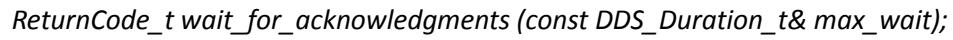
>

如果所有样本都确认被匹配的对端响应，则返回”DDS_RETCODE_OK”；如果 DataWriter 等待时

间超出”max_wait”，则返回”DDS_RETCODE_TIMEOUT”。

### 8.3. DataWriter

创建 DataWriter 之前，需要先创建一个 Publisher 和一个 Topic。用户在获得一个 DataWriter 之

后，就可以使用表8-2 中列出的函数来进行 DataWriter 的相关操作。其中最为重要的函数是 write()。

表 8-2DataWriter 的函数

|  | 函数 | 描述 |
| --- | --- | --- |
|  | enable() | 使能DataWriter。 |
|  | get_listener() | 获取DataWriter的Listener。 |
|  | set_listener() | 修改DataWriter的Listener。 |
|  | get_qos() | 获取DataWriter的QoS。 |
|  | set_qos() | 修改DataWriter的QoS。 |
|  | write() | 发布某个实例的新样本。 |
|  | write_w_timestamp() | 与write()相同，但是允许应用提供时间戳。 |
|  | write_w_dst | 向指定对端发布一个数据样本。 |
|  | lookup_instance() | 根据提供的实例获取InstanceHandle_t。 |
|  | register_instance() | 声明 DataWriter 将要写出某实例的样本，提<br>高之后write该实例的效率（只对有键的数据<br>有效）。 |
|  | register_instance_w_timestamp() | 与 register_instance()相同，但是允许应用提<br>供时间戳。 |
|  | unregister_instance() | 注销实例，表明放弃实例的所有权（只对有<br>键的数据有效）。 |
|  | unregister_instance_w_timestamp() | 与 unregister_instance()相同，但是允许应用<br>提供时间戳。 |
|  | dispose() | 销毁实例，即声明实例不再存在（只对有键<br>的数据有效）。 |
|  | dispose_w_timestamp() | 与dispose ()相同，但是允许应用提供时间戳。 |
|  | get_key_value() | 获取与指定InstanceHandle_t对应的键值。 |
| 获取<br>匹配<br>对端 | get_matched_subscription_data() | 获取匹配的订阅端数据，应用程序需要提供<br>其InstanceHandle_t。 |
|  | get_matched_subscriptions() | 获取已经匹配的订阅端列表，订阅端以其<br>InstanceHandle_t表示。 |
| 获取<br>DW<br>相关<br>信息 | get_publisher() | 获取DataWriter所属的Publisher。 |
|  | get_topic() | 获取DataWriter所关联的Topic。 |
|  | get_instance_handle() | 获取实例的句柄。 |
| 获取<br>状态<br>信息 | get_liveness_lost_status() | 获取LIVELINESS_LOST Status。 |
|  | get_offered_deadline_missed_status() | 获取OFFERED_DEADLINE_MISSED Status。 |
|  | get_offered_incompatible_qos_status() | 获取OFFERED_INCOMPATIBLE_QOS Status。 |
|  | get_publication_matched_status() | 获取PUBLICATION_MATCHED Status。 |
|  | get_status_changes() | 获取自从上次获取状态后状态的改变。 |
|  | get_statuscondition() | 获取与DataWriter相关的StatusCondition。 |
| 存活<br>性管<br>理 | assert_liveliness() | 声明DataWriter的存活性。 |
| 其他 | wait_for_acknowledgements() | 阻塞线程直到所有数据被对端响应或超时。 |
|  | flush() | 将batch发送到网络。 |

8.3.1 创建 DataWriter

在创建 DataWriter 之前，需要获取到 Publisher 和 Topic。

```text
DataWriter 由 Publisher 的 create_datawriter()操作创建，创建的 DataWriter 即属于创建它的
Publisher。create_datawriter()的函数原型如下所示：
DataWriter* create_datawriter(
```

Topic * topic,

const DataWriterQos &qos,

DataWriterListener *listener,

const StatusKindMask &mask);

- topic：该 DataWriter 所需要发布的 Topic。该 Topic 必须在使用前由 Publisher 所属的

DomainParticipant 创建。

- qos：本参数指定 DataWriter 的 QoS 策略。如果要使用默认的 QoS，则可以使用内置变

量”DATAWRITER_QOS_DEFAULT”作为参数，如果要使用自定义的 QoS，则可以自行构造一个

DataWriterQos，关于 DataWriter 的 QoS 设置参考 8.3.3 节。

注意：在多线程环境下使用”DATAWRITER_QOS_DEFAULT”创建 DataWriter 是不安全的，因

为另一个线程也可能同时调用 set_default_datawriter_qos()操作。

- listener：Listener 是一系列回调接口。当 DataWriter 有特定事件发生时，ZRDDS 使用 Listener

通知应用程序，关于 DataWriter 的 QoS 设置请参考 8.3.4 节。若用户不需要安装 Listener，则可

以将其设置为”NULL”。

- mask：该参数为位掩码，用于选择性地开启 listener 的回调接口。mask 每一位的取值对应

Listener 是否相应一件特定的事件。如果用户希望 Listener 响应所有事件，可以将设置参数

为”DDS_STATUS_MASK_ALL”；如果用户希望 Listener 不响应任何事件，可以将参数设置

为”DDS_STATUS_MASK_NONE”。关于 DataWriter 的 Status 请参考 8.3.5 节。

例 8-6：使用默认 DataWriterQos 创建 DataWriter。

Publisher* publisher = participant->create_publisher(

PUBLISHER_QOS_DEFAULT,

NULL,

```text
DDS_STATUS_MASK_NONE);
DataWriter* writer = publisher->create_datawriter(
```

topic,

DATAWRITER_QOS_DEFAULT,

NULL,

```text
DDS_STATUS_MASK_NONE);
// 使用安全类型转换
FooDataWriter* foo_writer = dynamic_cast<FooDataWriter*>(writer);
if (foo_writer == NULL) {/* error */ };
创建了 DataWriter 之后，即可以使用 write()操作发布数据。
```

8.3.2 删除 DataWriter

用户可使用 Publisher 的 delete_datawriter()操作删除 Publisher 下的某一个 DataWriter，函数原

型如下：

ReturnCode_t delete_datawriter(DataWriter *writer);

在一些情况中，可能需要删除 Publisher 拥有的所有 DataWriter，如果仍旧使用上述方法，一面

操作繁琐且效率低下 ， 另一方面可能会遗漏某个 DataWriter ， 可以使用 Publisher 的

```text
delete_contained_entities()操作一次性删除 Publisher 下所有的 DataWriter，函数原型如下：
ReturnCode_t delete_contained_entities();
```

8.3.3 设置 DataWriter 的 QoS 策略

DataWriter 的 QoS 控制其行为和资源。DataWriterQos 类结构如下：

class DataWriterQos : public QosPolicy

```text
{
DDS_DurabilityQosPolicy durability;
DDS_DurabilityServiceQosPolicy durability_service;
DDS_DeadlineQosPolicy deadline;
DDS_LatencyBudgetQosPolicy latency_budget;
DDS_LivelinessQosPolicy liveliness;
DDS_ReliabilityQosPolicy reliability;
DDS_DestinationOrderQosPolicy destination_order;
DDS_HistoryQosPolicy history;
DDS_ResourceLimitsQosPolicy resource_limits;
DDS_TransportPriorityQosPolicy transport_priority;
DDS_LifespanQosPolicy lifespan;
DDS_UserDataQosPolicy user_data;
DDS_OwnershipQosPolicy ownership;
DDS_OwnershipStrengthQosPolicy ownership_strength;
DDS_WriterDataLifecycleQosPolicy writer_data_lifecycle;
/* extend qos*/
DDS_BatchQosPolicy batch;
DDS_PublishModeQosPolicy publish_mode;
DDS_DataWriterProtocolQosPolicy protocol;
DDS_DataWriterResourceLimitsQosPolicy writer_resource_limits;
DDS_DataWriterMessageModeQosPolicy message_mode;
DDS_TransportConfigQosPolicy receive_addresses;
};
```

DataWriterQos 各项的含义见第10 章。

DataWriter 的许多 QoS 同时也在 DataReaderQos 中存在，部分 QoS 要求在 DataWriter 端的设置

与在 DataReader 端的设置兼容才允许 DataWriter 和 DataReader 匹配。

还有一部分 QoS 的值可以在 DataWriter 使能之后修改，可以使用 get_qos()和 set_qos()操作达成

目标。

8.3.3.1 创建 DataWriter 时配置 QoS 策略

在例8-7 中演示了使用特殊值”DATAWRITER_QOS_DEFAULT”创建 DataWriter 的过程。可以通过

```text
Publisher 的 set_default_datawriter_qos()操作修改 DataWriter 默认的 QosPolicy。
如果需要使用自定义的 DataWriterQos，可以使用 get_default_writer_qos()操作初始化
```

DataWriterQos 类的对象，修改部分值后用该对象作为 QoS 参数创建 DataWriter。具体过程如例8-7

所示。

例 8-7：使用自定义 QoS 创建 DataWriter。

```text
// 用默认DataWriterQos 初始化该对象
DataWriterQos writer_qos;
publisher->get_default_datawriter_qos(writer_qos);
// 修改QoS
writer_qos.history.depth = 5;
// 使用修改后的QoS 对象创建DataWriter
DataWriter * writer = publisher->create_datawriter(
```

topic,

writer_qos,

NULL,

```text
DDS_STATUS_MASK_NONE);
if (writer == NULL) {/* error */}
```

8.3.3.2 创建 DataWriter 后配置 QoS 策略

```text
应用程序可以通过使用 DataWriter 的 get_qos()和 set_qos()操作获取和设置其 QoS。具体过程如
例8-8 所示，在该示例中，首先使用 get_qos()操作获取到 DataWriter 当前的 QoS，进行修改之后，
通过 set_qos()操作将新 QoS 值传入 DataWriter。
```

例 8-8：修改已存在 DataWriter 的 QoS。

```text
// 获取当前QoS
DataWriterQos writer_qos;
if (datawriter->get_qos(writer_qos) != DDS_RETCODE_OK) {/* error */}
// 在此处修改QoS
writer_qos.deadline.period.sec = 1;
// 设置新的QoS
if (datawriter->set_qos(writer_qos) != DDS_RETCODE_OK ) {/* error */}
```

8.3.3.3 使用 Topic 的 QoS 策略初始化 DataWriter 的 QoS 策略

DataWriterQos 中的几个项同时也存在于 TopicQos 中。ZRDDS 不要求这些项目的值在

DataWriterQos和TopicQos中一致。在TopicQos中存在这些项是为了给使用者提供参考和建议。ZRDDS

为使用 TopicQos 初始化 DataWriterQos 提供了方便的方式，用 Topic 的 Qos 策略赋值 DataWriter 和

DataReader，具体过程如例8-9 和例8-10 所示。

例 8-9：拷贝 TopicQos 指定项到 DataWriterQos 中。

```text
DataWriterQos writer_qos;
TopicQos topic_qos;
// 获取当前Topic 的Qos和默认DataWriterQos
if (topic->get_qos(topic_qos) != DDS_RETCODE_OK) {/* error */}
if (publisher->get_default_datawriter_qos(writer_qos) !=DDS_RETCODE_OK) {/* error */}
// 从TopicQos中拷贝指定项到DataWriterQos 中
writer_qos.deadline = topic_qos.deadline;
writer_qos.reliability = topic_qos.reliability;
// 使用修改后的DataWriterQos 创建DataWriter
DataWriter* writer = publisher->create_datawriter(
```

topic,

writer_qos,

NULL,

```text
DDS_STATUS_MASK_NONE);
if(writer == NULL) {/* error */}
```

例 8-10：将 TopicQos 中所有对应项拷贝到 DataWriteQos 中。

```text
DataWriterQos writer_qos;
TopicQos topic_qos;
// 获取当前Topic 的Qos和默认DataWriterQos
if (topic->get_qos(topic_qos) != DDS_RETCODE_OK) {/* error */}
if (publisher->get_default_datawriter_qos(writer_qos) != DDS_RETCODE_OK) {/* error */}
// 将TopicQos中所有与DataWriterQos 中对应的项拷贝到DataWriteQos 中
Publisher->copy_from_topic_qos(writer_qos, topic_qos);
// 使用修改后的DataWriterQos 创建DataWriter
DataWriter* writer = publisher->create_datawriter(
```

topic,

writer_qos,

NULL,

```text
DDS_STATUS_MASK_NONE);
if(writer == NULL) {/* error */}
```

8.3.4 设置 DataWriter 的 Listener

应用程序可以给 DataWriter 设置相应的 DataWriterListener，也可以不设置，取决于应用程序的

需求。DataWriterListener 本质上是一系列回调方法的集合，ZRDDS 会在 DataWriter 的状态变化时调

用相应的回调方法来通知应用程序。Listener 的相关信息参见 5.3 节。

注意：有些方法无法在回调方法中使用，具体参见 5.3.6 节。

DataWriterListener 可以在 DataWriter 创建的时候指定，也可以在创建后使用 set_listener()操作

来设置。表8-3 为 DataWriterListener 的一系列回调方法。

表 8-3DataWriterListener 回调方法

| 方法名 | 描述 |
| --- | --- |
| on_publication_matched() | PUBLICATION_MATCHED Status改变时回调此方法。 |
| on_liveliness_lost() | LIVELINESS_LOST Status改变时回调此方法。 |
| on_offered_deadline_missed() | OFFERED_DEADLINE_MISSED Status改变时回调此方法。 |
| on_ offered _incompatible_qos() | OFFERED_INCOMPATIBLE_QOS Status改变时回调此方法。 |

8.3.5 关于 DataWriter 的 Status

8.3.5.1 LIVELINESS_LOST Status

该状态变化表明 DataWriter 在 Liveliness 规定的时间内没有声明其存活性。该状态改变时

```text
DataWriterListener 的 on_liveliness_lost() 回调函数被调用。 也可以调用 DataWriter 的 get_
liveliness_lost_status()方法获取该状态的当前值。详见 10.12 节。
```

8.3.5.2 OFFERED_DEADLINE_MISSED Status

该状态变化表明 DataWriter 在 Deadline 规定的时间内没有发送已注册的实例下的数据，每个没

有在 Deadline 规定时间内发送数据的实例都会改变该状态。该状态改变时 DataWriterListener 的

```text
on_offered_deadline_missed() 回调函数被调用 。 也可以调用 DataWriter 的
get_offered_deadline_missed _status()方法获取该状态的当前值。详见 10.4 节。
```

8.3.5.3 OFFERED_INCOMPATIBLE_QOS Status

该状态变化表明 DataWriter 发现一个主题相同但是 QoS 不匹配的 DataReader。该状态改变时

```text
DataWriterListener 的 on_offered_incompatible_qos()回调函数被调用。也可以调用 DataWriter 的
get_offered_incompatible_qos_status()方法获取该状态的当前值。
```

8.3.5.4 PUBLICATION_MATCHED Status

该状态变化表明 DataWriter 发现一个匹配的 DataReader，或者与匹配的 DataReader 失去匹配

（DataReader 被删除、与 DataReader 的 QoS 变为不匹配）。该状态改变时 DataWriterListener 的

```text
on_publication_matched() 回调函数被调用 。 也可以调用 DataWriter 的
get_publication_matched_status()方法获取该状态的当前值。
```

只有在 DataWriter 和 DataReader 具有相同的主题、数据类型和匹配的 QoS 时才会产生“匹配”。

此外，如果用户指定忽略某一 DataReader，那么这个 DataReader 永远不会被匹配。

8.3.6 获取 DataWriter 的 Status

用户可以通过 get_status_changes()获取一系列从上一次应用获取该状态或被 listener 调用后产

生变化的状态列表。用户可以通过调用表8-4 中的函数获取 DataWriter 的状态。

表 8-4 检查 DataWriter Status

|  | 函数 |  |  | 描述 |  |
| --- | --- | --- | --- | --- | --- |
| get_publication_matched_status() |  |  | 获取PUBLICATION _MATCHED Status。 |  |  |
| get_liveliness_lost_status () |  |  | 获取LIVELINESS_LOST Status。 |  |  |
| get_offered_deadline_missed_status () |  |  | 获取OFFERED_DEADLINE_MISSED Status。 |  |  |
| get_offered_incompatible_qos_status () |  |  | 获取OFFERED_INCOMPATIBLE_QOS Status。 |  |  |
| get_status_changes() |  |  | 上述status变化的列表。 |  |  |

8.3.7 获取 DataWriter 的关联实体

```text
- get_matched_subscriptions()：获取已匹配 DataReader 的句柄列表。
- get_matched_subscription_data()：获取已匹配 DataReader 的数据信息。
- get_publisher()：获取创建 DataWriter 的 Publisher。
- get_topic()：获取 DataWriter 关联的 Topic。
```

8.3.8 使用特定类型的 DataWriter

对于每一个 DataWriter，都需要被绑定到一个特定的数据类型上。数据类型由编译器从 IDL 文

件生成。对于每一个数据类型，例如 Foo，都会有一个 FooDataWriter 类与之对应。该类的存在使应

用程序可以使用类型安全的接口进行操作。

在实际应用中，任何与类型相关的操作，例如注册实例和发布数据样本，都应该使用对应特定

```text
类型的接口。例如如果需要发布 Foo 类型的数据，应该使用 FooDataWriter 的 write()操作。
Publisher 的 create_datawriter()操作返回值的类型是 DataWriter*，这是由于 Publisher 与类型无
```

关，该接口可用于创建任何类型的 DataWriter，且创建的 DataWriter 实际上是特定类型的 DataWriter

（FooDataWriter），因此在创建之后需要转换操作。

将一般的 DataWriter 转换为具体的 DataWriter 的示例：

> 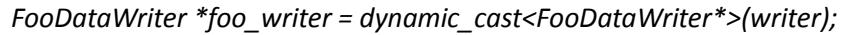
>

8.3.9 实例管理

本节内容只适用于含有键的数据类型，关于键域的具体内容请参考 2.7 节。

8.3.9.1 注册及注销实例

在使用包含键域数据类型时，ZRDDS 会检查键域的值，以决定其属于哪一个实例。如果在使用

含有键域的数据类型前，对其进行注册并使用注册时获得的 InstanceHandle_t 进行后续的操作，可

以提高程序的性能。如果应用程序对实例数量有限制且已注册的实例数量已经达到限制，注册将会

失败。

注意：注册过的实例如果被销毁（dispose）但是并没有被注销（unregister），则仍然会占用已

注册实例的数量。

如果应用程序不显式的注册实例，则在第一次写出该实例数据样本时，ZRDDS 会自动为其注册。

写出未注册的实例的数据样本时，可以使用”DDS_HANDLE_NIL_NATIVE”作为 InstanceHandle_t 参数，

但是该做法会降低程序性能，因为每一次发布数据时，ZRDDS 都会去检查数据样本并获取其

InstanceHandle_t。

同一个实例可以重复注册，ZRDDS 确保每次注册获取到的 InstanceHandle_t 一致。

```text
当一个实例不再被使用时，应用程序可以注销它。注销通过 DataWriter 的 unregister_instance()
操作实现。unregister_instance()操作必须在一个实例被注册之后才能调用。虽然一个实例允许多次
```

被注册，但是不允许多次被注销。

一旦一个实例被注销，并且没有其他 DataWriter 发布该实例的数据，则匹配的 DataReader 认为

该实例状态转变为 NOT_ALIVE_NO_WRITERS，具体参考 10.23 节。

例 8-11：注册和注销实例。

```text
// 注册实例 InstanceHandle_t handle = foo_writer->register_instance ( &foo ); if (handle == DDS_HANDLE_NIL_NATIVE) {/* error */} // 注销实例 if (foo_writer->unregister_instance(foo, handle) != DDS_RETCODE_OK) {/* error */}
```

8.3.9.2 销毁实例

DataWriter 调用 dispose()操作表明本代数据结束。

8.3.9.3 查找 InstanceHandle_t

```text
DataWriter 的某些函数，例如 write()操作，需要实例的 InstanceHandle_t 作为一个参数，应用程
序可以通过 lookup_instance()操作获取已注册实例的 InstanceHandle_t，该函数原型如下：
InstanceHandle_t lookup_instance ( Foo* key_holder );
```

如果传入的实例未注册或者已经被注销，则函数返回 DDS_HANDLE_NIL_NATIVE。

8.3.9.4 从 InstanceHandle_t 获取 Instance 的 Key 值

当拥有一个实例的 InstanceHandle_t 时，可以通过 get_key_value()操作从 DataWriter 获取该实例

对应的键值。获取的键值会被填充到用户传入的数据实例对象中。

8.3.10 发布数据

```text
DataWriter 的 write()操作通知 ZRDDS 在某个实例下有新的数据样本需要发布。默认情况下，调
用 write()操作时，新的数据样本会被立即通过网络发布出去（假定已经有匹配的 DataReader）。此外，
```

还可以通过配置 DataWriter 所属的 Publisher 决定是否立即发布数据或者是否发布数据。应用程序可

以通过配置 PresentationQosPolicy 获得上述写出模式。

例 8-12：发布数据示例。

```text
Foo foo;
foo.id = 1;// 假定id为Foo类型的键域
DataWriter * datawriter = publisher->create_datawriter(topic, qos, listener, mask);
FooDataWriter * foo_datawriter=dynamic_cast<FooDataWriter*>(datawriter);
// 注册实例
InstanceHandle handle=foo_datawriter->register_instance(&foo);
if(handle==DDS_HANDLE_NIL_NATIVE) {/* error */}
// 发布数据
RetCode_t ret=foo_datawriter->write(foo, handle);
if(ret!=DDS_RETCODE_OK) {/* error */}
//注销实例
if(foo_datawriter->unregister_instance(foo, handle)!=DDS_RETCODE_OK) {/* error */}
```

8.3.11 指定对端发送

ZRDDS提供指定对端发送以支持简单的队列模式，用户调用DataWriter的write_w_dst()操作后，

ZRDDS 将只把样本发送到参数中指定 InstanceHandle_t 的 DataReader，对端的 InstanceHandle_t 可以

从接口 get_matched_subscriptions 或者从内置 DataReader 的回调中获取。

例 8-133：指定对端发布数据示例。

```text
Foo foo;
foo.id = 1;// 假定id为Foo类型的键域
DataWriter * datawriter = publisher->create_datawriter(topic, qos, listener, mask);
FooDataWriter * foo_datawriter=dynamic_cast<FooDataWriter*>(datawriter);
// 注册实例
InstanceHandle handle=foo_datawriter->register_instance(&foo);
if(handle==DDS_HANDLE_NIL_NATIVE) {/* error */}
// 获取有效的对端标识
InstanceHandleSeq readerIds;
foo_datawriter->get_matched_subscriptions(readerIds);
InstanceHandle_t targetId = readerIds[0];
// 发布数据
RetCode_t ret=foo_datawriter->write_w_dst(foo, handle, targetId);
if(ret!=DDS_RETCODE_OK) {/* error */}
//注销实例
if(foo_datawriter->unregister_instance(foo, handle)!=DDS_RETCODE_OK)
{/* error */}
```

## 第9章订阅数据

本章将讨论如何创建、配置和使用订阅者（Subscriber）与数据读者（DataReader）来进行数据

订阅。本章还描述了这些实体之间的交互关系以及所能进行的操作。

本章主要包含以下内容：

- 概述：数据订阅过程

- Subscriber

- Subscriber Qos

- DataReader

- DataReader Qos

本章旨在帮助用户熟悉数据订阅过程及其所需的实体。

### 9.1. 概述：数据订阅过程

应用程序可以通过如下三种方式去订阅数据：

```text
- 应用程序可以主动地使用 DataReader 的 read()或者 take()方法去查看是否有新的数据到达，
并通过 read()或 take()方法获取到数据。这种方式一般称为数据轮询。
```

- 应用程序也可以使用 Listener 来让 ZRDDS 系统在有新数据到达时，对应用程序进行异步地

通知。通过在 DataReader 上添加 Listener，当有新数据到达时，ZRDDS 系统会通过 Listener 的回

```text
调方法来通知应用程序，应用程序可以对回调方法进行自定义的修改，如在其中通过 read()或
take()方法来获取新的数据。这种方式可以让应用程序最实时收到最新数据。
- 应用可以使用 Condition 和 WaitSet 然后调用 wait()等待新数据。DDS 会阻塞应用线程直到
Condition 中设置的条件（如数据到达或指定的状态）变为”true”。然后应用会恢复，之后使用
read()或 take()获取数据。
DataReader 的 read()方法会向应用程序提供一份数据的拷贝，同时在它的数据队列中保留这些
数据。而 DataReader 的 take()方法则直接将数据从它的数据队列中移除，并将它们提供给应用程序，
```

更多细节参见 9.3.10 节。

典型的数据订阅过程如下：

- 创建和配置相关类型对象

1)创建一个 DomainParticipant。

2) 在该 DomainParticipant 下注册用户自定义的数据类型，例如 FooDataType。

3) 使用 DomainParticipant 创建一个已注册数据类型的 Topic。

4) 使用该 DomainParticipant 创建一个 Subscriber。

5) 使用 Subscriber 和 Topic 创建一个 DataReader。

6) 使用类型安全的方式将一般的 DataReader 转换成类型相关的 DataReader，比如

“dynamic_cast`<FooDataTypeDataReader*>`(datareader)”。

注意：其中步骤 4)可以在步骤 2)或者步骤 3)之前完成，不影响结果。

现在使用以下的一种方法接收数据：

- 使用数据轮查询方式接收数据：

```text
使用 FooDataReader 的read()或者 take()方法去访问那些 DataReader订阅并存储起来的数据。
read()或 take()这个系列的方法可以被任意调用，即使 DataReader 的数据队列为空。
```

- 使用异步方式接收数据：

在 DataReader 或 Subscriber 上安装一个 Listener，当有新数据到达 DataReader 时 DDS 线程

会调用回调函数，步骤如下：

1) 通过继承 DataReaderListener，创建一个与 FooDataReader 相关的 DataReaderListener，

如 FooDataReaderListener，或继承 SubscriberListener，创建一个 SubscriberListener。

```text
如果创建了一个实现了 on_data_available()回调函数的 DataReaderListener:当数据到达
DataReader 时 on_data_available()会被调用。
如果创建了一个实现了 on_data_on_readers()回调函数的 SubscriberListener：当有数据
到达任何该 Subscriber 创建的 DataReader 时 on_data_on_readers()会被调用。
```

2) 安装 Listener 到 DataReader 或 Subscriber 上。

如果是DataReader，安装Listener时掩码中”DDS_DATA_AVAILABLE_STATUS”位设置为”1”。

如果是 Subscriber，安装 Listener 时掩码中”DDS_DATA_ON_READERS_STATUS”位设置

为”1”。

3) 当新的数据到达 DataReader 时，只有一个 Listener 会被调用。

如果安装了 Subscriber 的 Listener ， DDS 会先调用 Subscriber 的 Listener 。

on_data_on_readers()的优先级高于 on_data_available()。

如果没有设置任何 Listener 监听该状态，当数据到达 DataReader 时 DDS 不会调用任何

用户函数。

4) 在DataReaderListener的on_data_available()方法中调用FooDataReader的read()或take()

函数获取数据。

如果 SubscriberListener 的 on_data_on_readers()被调用，可以直接在 Subscriber 上收到

新数据的DataReader上调用read()或take()。或者也可以调用Subscriber的notify_datareaders()

方法。这样会调用所有收到数据的 DataReader 的 DataReaderListener（如果安装并监听）的

on_data_available()方法。

- 等待（阻塞）直到数据到达：

1) 使用 DataReader 创建一个描述希望等待的数据样本的 ReadCondition。例如用户可以

指定希望等待没有读取过并仍被认为存活的样本。或者可以创建一个 StatusCondition 指定

希望等待 DDS_DATA_AVAILABLE_STATUS 状态改变。

2) 创建一个 WaitSet。

3) 关联 ReadCondition 或 StatusCondition 到 WaitSet。

```text
4) 调用 WaitSet 的 wait()操作，指定为希望的数据会等待的时间。当 wait()返回时，它会
表明操作超时或附加的 Condition 变为 true（因此收到了期望的数据）。
5) 使用 FooDataReader 的 read()或 take()操作获取 DataReader 收到的数据。
```

### 9.2. Subscriber

应用程序的订阅过程涉及到了一系列的 ZRDDS 实体：DomainParticipant、Topic、Subscriber 以及

DataReader。所有的 ZRDDS 实体都有与之相关的一系列 QoS，通过这些 QoS，应用程序可以对 ZRDDS

实体的行为以及资源进行配置。

订阅过程涉及的一系列 ZRDDS 实体的主要工作如下：

- DomainParticipant 实体指定了订阅的信息所在的域。

- Topic 实体指定了要订阅的数据的名字以及数据相关的类型。

- DataReader 实体是应用程序获取订阅数据的直接实体。在创建一个 DataReader 实体时，需

要将其与一个 Topic 实体进行绑定，通过这样的方式间接地确定了 DataReader 所订阅数据的类

型。应用程序通过 DataReader 实体的 read()或 take()方法去访问 DataReader 收到的数据。

- Subscriber 实体负责管理一系列 DataReader 实体。每一个 DataReader 实体都属于某一个

Subscriber 实体。

订阅模块的结构如图9-1 所示。

> 
>
> **图示信息：**
> - A single labeled box with the text 'Data' centered on a black background; no other visible elements or structure.
> - 'Data' label inside a rounded rectangular box
> - Box has light gradient fill and subtle shadow
> - No connections, arrows, or additional nodes visible

> 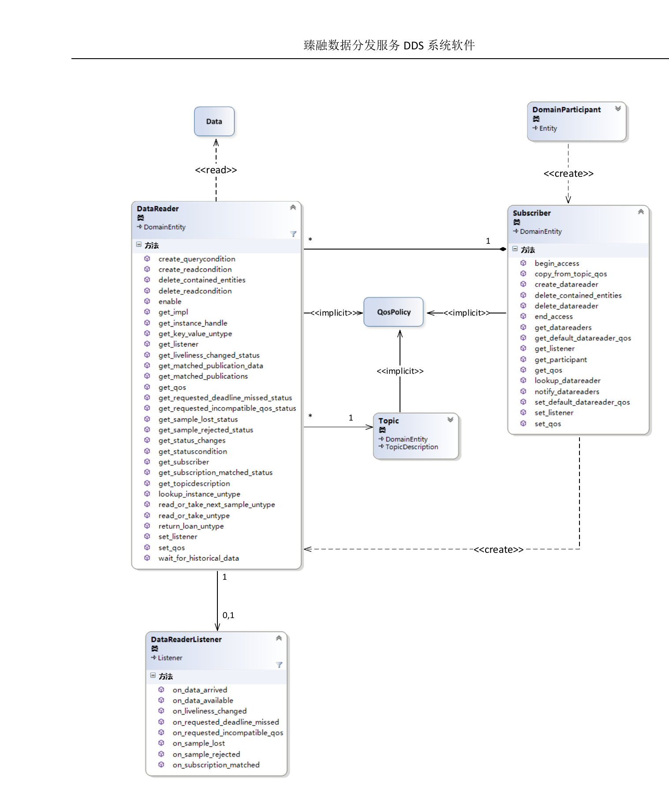
> **图 9-1ZRDDS 订阅端模型**
> **图示信息：** UML class diagram showing relationships among DDS system components: DataReader, Subscriber, DomainParticipant, Topic, QosPolicy, and DataReaderListener.
图 9-1ZRDDS 订阅端模型

当用户拥有一个 Subscriber 以后，可以使用表9-1 的函数。

表 9-1Subscriber 的函数

|  |  |  |  | 函数 |  |  | 描述 |  |
| --- | --- | --- | --- | --- | --- | --- | --- | --- |
| 配置<br>Sub |  |  | enable() |  |  | 使能Subscriber |  |  |
|  |  |  | get_listener() |  |  | 获取Subscriber的Listener |  |  |
|  |  |  | set_listener() |  |  | 设置Subscriber的Listener |  |  |
|  |  |  | get_qos() |  |  | 获取Subscriber的QoS |  |  |
|  |  |  | set_qos() |  |  | 设置Subscriber的QoS |  |  |
| 关于<br>DR<br>相关<br>操作 |  |  | create_datareader() |  |  | 创建一个DataReader |  |  |
|  |  |  | delete_datareader() |  |  | 删除一个属于该Subscriber的DataReader |  |  |
|  |  |  | delete_contained_entities() |  |  | 删除该Subscriber创建的所有DataReader |  |  |
|  |  |  | lookup_datareader() |  |  | 根据Topic名字查找该Subscriber的DataReader |  |  |
|  |  |  | get_datareaders() |  |  | 根据DR存储实例的数据样本状态查询DR |  |  |
|  |  |  | notify_datareaders() |  |  | 调用所有处于DATA_AVAILABLE状态的DR关联的<br>Listener的on_data_available()回调函数 |  |  |
|  |  |  | copy_from_topic_qos() |  |  | 将TopicQoS复制到DataReaderQos |  |  |
|  |  |  | get_default_datareader_qos() |  |  | 获取Subscriber的默认DataReaderQos值 |  |  |
|  |  |  | set_default_datareader_qos() |  |  | 设置Subscriber的默认DataReaderQos值 |  |  |
| 获取<br>Sub<br>相关<br>信息 |  |  | get_participant() |  |  | 获取创建该Subscriber的DomainParticipant |  |  |
|  |  |  | get_instance_handle() |  |  | 获取实例的句柄 |  |  |
|  |  |  | get_status_changes() |  |  | 获取自从上次获取状态后状态的改变 |  |  |
|  |  |  | get_statuscondition() |  |  | 获取与Subscriber相关的StatusCondition |  |  |

#### 9.2.1. 创建 Subscriber

为了订阅数据，应用程序必须创建至少一个 Subscriber。要创建一个 Subscriber，应用程序首先

需要创建一个 DomainParticipant，接着，使用 DomainParticipant 的 create_subscriber()方法创建

Subscriber，方法声明如下：

Subscriber* create_subscriber(

const SubscriberQos &qos,

SubscriberListener* listener,

const StatusKindMask &mask);

- qos：本参数指定 Subscriber 的 QoS 策略。如果要使用默认的 QoS，则可以使

用”SUBSCRIBER_QOS_DEFAULT”；如果要使用自定义的 QoS，则可以自行构造一个 SubscriberQos，

关于 Subscriber 的 QoS 设置请参考 9.2.4 节。

注意：在多线程环境下使用”SUBSCRIBER_QOS_DEFAULT”作为参数创建 Subscriber 是不安

全的，因为另一个线程可能也在同时调用DomainParticipant的set_default_subscriber_qos()函数。

- listener：Listener 是一系列回调接口。当 Subscriber 和由其创建的 DataReader 有特定事件

发生时，ZRDDS 使用 Listener 通知应用程序，关于 Subscriber 的 Listener 设置请参考 9.2.5 节。

如果用户不需要安装 Listener，则可以将该参数设置为”NULL”。

- mask：本参数为位掩码，用于选择性地开启 listener 的回调接口。mask 每一位的取值对应

Listener 是否相应一件特定的事件。如果用户希望 Listener 响应所有事件，可以将设置参数

为”DDS_STATUS_MASK_ALL”；如果用户希望 Listener 不响应任何事件，可以将参数设置

为”DDS_STATUS_MASK_NONE”。关于 Subscriber 的 Status 请参考 8.2.6 节。

例 9-1：使用默认的 QoS 创建 Subscriber。

Subscriber *subscriber = participant->create_subscriber(

SUBSCRIBER_QOS_DEFAULT,

NULL,

```text
DDS_STATUS_MASK_NONE);
if (subscriber == NULL) {/* error */}
```

9.2.2 删除 Subscriber

删除一个 Subscriber 的步骤：

- 应用程序首先需要删除所有由该 Subcriber 创建的 DataReader。可以使用 Subsriber 的

delete_datareader()方法逐个删除 DataReader，或者使用 delete_contained_entities()方法一次性

删除所有的 DataReader。

- 使用 DomainParticipant 的 delete_subscriber()方法删除 Subscriber。

注意：在 Listener 的回调方法中不能删除 Subscriber。

9.2.3 删除 Subscriber 的所有子实体

Subscriber 的 delete_contained_entities()操作可以删除由该 Subscriber 创建的所有 DataReader，

函数原型如下：

ReturnCode_t delete_contained_entities();

当该函数成功返回之后，应用程序可以安全删除 Subscriber。

9.2.4 设置 Subscriber 的 QoS 策略

Subscriber 的 QoS 用于控制 Subscirber 的行为。SubscriberQos 的结构如下：

strcuct SubscriberQos

```text
{
DDS_PresentationQosPolicy presentation;
DDS_PartitionQosPolicy partition;
DDS_GroupDataQosPolicy group_data;
DDS_EntityFactoryQosPolicy entity_factory;
};
```

SubscriberQos 各项的含义见第10 章。

9.2.4.1 创建 Subscriber 时配置 QoS 策略

在例9-1 中，已经演示了如何使用默认的 QoS 来创建 Subscriber，这里主要介绍下使用非默认

的 QoS 来创建 Subscriber。一般来说有以下两种方式：

- 通过DomainParticipant的set_default_subscriber_qos()操作可以自定义默认的SubscirberQos。

以后再使用”SUBSCRIBER_QOS_ DEFAULT”即可得到先前设置的值。

- 若不想修改默认的 SubscriberQos，可以通过 get_default_subscriber_qos()方法获取到默认的

SubscriberQos，然后在此基础上做自己的修改。

例 9-2：使用非默认的 QoS 创建 Subscriber。

```text
// 获取默认QoS
SubscriberQos sub_qos;
if (participant->get_default_subscriber_qos(subscriber_qos) != DDS_RETCODE_OK) {/* error
*/}
// 修改QoS
sub_qos.entity_factory.autoenable_created_entities = false;
// 创建Subscriber
Subscriber *subscriber = participant->create_subscriber(
```

sub_qos,

NULL,

```text
DDS_STATUS_MASK_NONE);
if (subscriber == NULL) { /*error */ }
```

9.2.4.2 创建 Subscriber 后配置 QoS 策略

```text
在一个 Subscriber 创建后，应用程序仍旧可以使用 Subscriber 的 get_qos()操作获取到 QoS，做
出修改后再使用 Subscriber 的 set_qos()操作进行设置。
```

例 9-3：修改一个已经创建的 Subscriber 的 QoS。

```text
// 获取QoS
SubscriberQos sub_qos;
if (subscriber->get_qos(sub_qos) != DDS_RETCODE_OK) { /* error */ }
// 修改QoS
sub_qos.entity_factory.autoenable_created_entities = false;
// 设置QoS
if (subscriber->set_qos(sub_qos) != DDS_RETCODE_OK) { /* error */ }
```

9.2.4.3 获取及设置默认 DataReader 的 QoS 策略

Subscriber 会保存一个默认的 DataReaderQos 值 ， 用于在应用程序使

用”DATAREADER_QOS_DEFAULT”作为参数创建 DataReader 时设置 DataReaderQos，该值可以被如下

函数修改：

ReturnCode_t set_default_datareader_qos(const DataReaderQos &qoslist);

默认 DataReaderQos 可以通过如下函数获取：

> 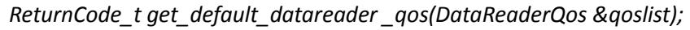
>

该函数获取的值与在创建 DataReader 时使用”DATAREADER_QOS_DEFAULT”作为参数得到的

DataReaderQos 一致 ， 即该函数获取的 DataReaderQos 是最后一次成功调用

set_default_datareader_qos()操作所传入的值。

注意：在多线程使用时，设置和获取默认的 SubscriberQos 是不安全的。当设置默认的

```text
SubscriberQos 时，其他线程可能调用 get_default_subscriber_qos()、set_default_subscriber_qos()操作
或者使用”SUBSCRIBER_QOS_DEFAULT”作为参数调用 create_subscriber()操作。同时，获取默认
SubscriberQos 时，其他线程也可能同时调用 set_default_subscriber_qos()操作。
```

9.2.5 设置 Subscriber 的 Listener

应用程序可以给 Subscriber 设置相应的 SubscriberListener，也可以不设置，取决于应用程序的

需求。SubscriberListener 本质上是一系列回调方法的集合，ZRDDS 会在相关的 Status 状态发生变化

时调用相应回调方法来通知应用程序。Listener 的相关信息请参见 5.3 节。

注意：有些方法无法在回调方法中使用，具体参见 5.3.6 节。

SubscriberListener 是 DataReaderListener 的扩展 ， 也就是说 SubscriberListener 包含

DataReaderListener 的所有回调函数 ， 另外 ， SubscriberListener 还有一个特有的回调函数

```text
on_data_on_readers() ， on_data_on_readers() 优先于 DataReaderListener 的回调函数
on_data_available()。当有新的数据到达时，将会优先调用 SubscriberListener 的回调函数
on_data_on_readers()，on_data_on_readers()操作通过调用 Subscriber 的 notify_datareaders()操作使
得相应 DataReaderListener 的 on_data_on_readers()操作被调用，详细请参见 9.3.4 节。
SubscriberListener 可以在 Subscriber 创建的时候指定，也可以在创建后使用 set_listener()方法来
```

设置，如例9-4 和例9-5 所示。

例 9-4：创建 Subscriber 时设置 Listener。

```text
SubscriberListener* listener;
StatusKindMask mask = DDS_STATUS_MASK_ALL;
Subscriber= participant->create_Subscriber (sub_qos, listener, mask);
```

例 9-5：创建 Subscriber 后设置 Listener。

```text
mask = DDS_STATUS_MASK_NONE;
Subscriber->set_listener(listener, mask);
```

SubscriberListener 继承自 DataReaderListener，也拥有 DataReader 的所有回调方法。当 ZRDDS

想要通知 DataReader 有一个相关的 status 发生改变（如 LIVELINESS_CHANGED Status）时，会先检查

DataReader 是否监听该状态，如果监听了该状态，则将事件调度给 DataReaderListener；否则将事件

调度给 SubscriberListener。

9.2.6 关于 Subscriber 的 Status

Subscriber 只有一个 Status：DDS_DATA_ON_READERS_STATUS。该状态在 Subscriber 下的任意一

个 DataReader 收到数据时会改变，该状态改变时如果 Subscriber 的 Listener 监听了该状态，则 DDS

会调用 SubscriberListener 的 on_data_on_readers()回调函数。

9.2.7 获取 Subscriber 的关联实体

- get_participant()

获取创建该 Subscriber 的 DomainParticipant。

- lookup_datareader()

通过 Topic 名字查找由该 Subscriber 创建的 DataReader。该 DataReader 与指定名字的 Topic

关联。如果与该 Topic 关联的 Subscriber 有多个，该函数仅返回其中一个。

- get_datareaders()

根据DataReader存储实例的数据样本状态查询DataReader。可以设置的条件包括样本状态、

视图状态以及实例状态，以上状态均通过掩码来表示，使用按位与操作来表示是否符合。

DataReader 中只要有一个数据满足则该 DataReader 符合条件。

virtual ReturnCode_t get_datareaders(

DataReaderPtrSeq &datareader,

const SampleStateMask &sample_states,

const ViewStateMask &view_states,

const InstanceStateMask &instance_states)

- datareader：存储符合条件的 DataReader 列表。

- sample_states：需要满足的样本状态条件。

- view_states：需要满足的视图状态条件。

- instance_states：需要满足的实例状态条件。

### 9.3. DataReader

创建 DataReader 之前，需要有一个 Subscriber 和一个 Topic。当用户获得了一个 DataReader 之

```text
后，就可以使用 DataReader 的函数进行一系列操作，具体如表9-2 所示，其中重要的函数是 read()
和 take()。
```

表 9-2DataReader 的方法

|  |  |  |  | 函数 |  |  | 描述 |  |
| --- | --- | --- | --- | --- | --- | --- | --- | --- |
| 配置<br>DR |  |  | enable() |  |  | 使能DataReader。 |  |  |
|  |  |  | get_listener() |  |  | 获取DataReader的Listener。 |  |  |
|  |  |  | set_listener() |  |  | 设置DataReader的Listener。 |  |  |
|  |  |  | get_qos() |  |  | 获取DataReader的QoS。 |  |  |
|  |  |  | set_qos() |  |  | 设置DataReader的QoS。 |  |  |
| 通过<br>Read<br>访问<br>数据 |  |  | read() |  |  | 读取 DataReader 收到的数据样本集合的一<br>个拷贝。 |  |  |
|  |  |  | read_instance() |  |  | 与read()相同，但是所有实例属于参数指定<br>的实例。 |  |  |
|  |  |  | read_next_instance() |  |  | 类似read_instance，读取指定实例的下一个<br>实例的数据。 |  |  |
|  |  |  | read_next_instance_w_condition() |  |  | 读取下一个与指定的ReadCondition条件匹<br>配的instance的数据。 |  |  |
|  |  |  | read_next_sample() |  |  | 获取下一个没有被访问过的数据 |  |  |
|  |  |  | read_w_condition() |  |  | 获取 DataReader 中符合指定的<br>ReadCondition条件的数据。 |  |  |
| 通过<br>Take<br>访问<br>数据 |  |  | take() |  |  | 类似 read()，但读取到的数据会从 DR 的数<br>据队列中移除。 |  |  |
|  |  |  | take_instance() |  |  | 类似read_instance()，但读取到的数据会从<br>DR的数据队列中移除。 |  |  |
|  |  |  | take_next_instance() |  |  | 类似read_next_instance()，但读取到的数据<br>会从DR的数据队列中移除。 |  |  |
|  |  |  | take_next_instance_w_condition() |  |  | 类似read_next_instance_w_condition ()，但<br>读取到的数据会从DR的数据队列中移除。 |  |  |
|  |  |  | take_next_sample() |  |  | 类似 read_next_sample()，但读取到的数据<br>会从DR的数据队列中移除。 |  |  |
|  |  |  | take_w_condition() |  |  | 类似 read_w_condition()，但读取到的数据<br>会从DR的数据队列中移除。 |  |  |
| 获取<br>匹配<br>对端 |  |  | get_matched_publication_data() |  |  | 获取给定 InstanceHandle_t 指定的<br>DataWriter的信息。 |  |  |
|  |  |  | get_matched_publications() |  |  | 获取与该 DataReader 匹配且未被忽略的<br>DataWriter的InstanceHandle_t列表。 |  |  |
| 获取<br>DR<br>相关<br>信息 |  |  | get_subscriber() |  |  | 获取DataReader所属的Subscriber。 |  |  |
|  |  |  | get_topicdescription() |  |  | 获取关联Topic的TopicDescription。 |  |  |
|  |  |  | get_instance_handle() |  |  | 获取实例句柄。 |  |  |
|  |  |  | get_key_value() |  |  | 通过InstanceHandle_t获取相关实例的键。 |  |  |
| 获取<br>DR<br>状态<br>信息 |  |  | get_sample_lost_status() |  |  | 获取SAMPLE_LOST Status。 |  |  |
|  |  |  | get_sample_rejected_status() |  |  | 获取SAMPLE_REJECTED Status。 |  |  |
|  |  |  | get_subscription_matched_status() |  |  | 获取SUBSCRIPTION_MATCHED Status。 |  |  |
|  |  |  | get_liveliness_changed_status() |  |  | 获取LIVELINESS_CHANGED Status。 |  |  |
|  |  |  | get_requested_deadline_missed_status() |  |  | 获取REQUESTED_DEADLINE_MISSED Status。 |  |  |
|  |  |  | get_requested_incompatible_qos_status() |  |  | 获取REQUESTED_INCOMPATIBLE_QOS Status。 |  |  |
|  |  |  | get_status_changes() |  |  | 获取自从上次获取状态后状态的改变。 |  |  |
|  |  |  | return_loan() |  |  | 归还通过read或take向DR租借的空间。 |  |  |
|  |  |  | lookup_instance() |  |  | 根据相关的实例的键获取<br>InstanceHandle_t。 |  |  |
|  |  |  | get_statuscondition() |  |  | 获取与DataWriter相关的StatusCondition。 |  |  |
|  |  |  | create_readcondition() |  |  | 创建一个绑定到该 DataReader 上的<br>ReadCondition。 |  |  |
|  |  |  | create_querycondition() |  |  | 创建一个绑定到该 DataReader 上的<br>QueryCondition。 |  |  |
|  |  |  | delete_readcondition() |  |  | 删除一个绑定到该 DR 上的 ReadCondition<br>或QueryCondition。 |  |  |
|  |  |  | delete_contained_entities() |  |  | 删除该 DataReader 创建的所有<br>ReadCondition(包括QueryCondition)。 |  |  |
|  |  |  | wait_for_historical_data() |  |  | 等待历史数据。 |  |  |

9.3.1 创建 DataReader

在创建 DataReader 之前，必须先创建 DomainParticipant、Topic 以及 Subscriber。在保证了这些

条件后，通过 Subscriber 的 create_datareader()方法来创建 DataReader，所创建的 DataReader 将属于

该 Subscriber。create_datareader 方法的声明如下：

DataReader* create_datareader(

TopicDescription *topic,

const DataReaderQos &qos,

DataReaderListener *listener,

const StatusMaskKind &mask)

- topic：本参数指定 DataReader 所订阅的 Topic。本参数必须在创建 DataReader 前通过

DomainPaticipant 的方法生成。

- qos ： 本参数指定 Subscriber 的 QoS 。 如果要使用默认的 QoS ， 则可以使用

DATAREADER_QOS_DEFAULT；如果要使用自定义的 QoS，则可以自行构造一个 DataReaderQos，

关于 Subscriber 的 QoS 设置请参考 9.2.4 节。

注意：在多线程环境下使用 DATAREADER_QOS_DEFAULT 作为参数创建 Topic 是不安全的，

因为另一个线程可能也在同时调用 Subscriber 的 set_default_datareader_qos()函数。

- listener：Listener 是一系列回调接口，该参数指定了供 ZRDDS 系统异步通知应用程序的

Listener，关于 DataReader 的 Listener 设置请参考 8.4.4 节。如果用户不需要安装 Listener，则可

以将该参数设置为”NULL”。

- mask：本参数为位掩码，用于选择性地开启 listener 的回调接口。mask 每一位的取值对应

Listener 是否相应一件特定的事件。如果用户希望 Listener 响应所有事件，可以将设置参数

为”DDS_STATUS_MASK_ALL”；如果用户希望 Listener 不响应任何事件，可以将参数设置

为”DDS_STATUS_MASK_NONE”。关于 DataReader 的 Status 请参考 8.4.5 节。

例 9-6：为使用默认的 Qos 创建 DataReader 的例子。

```text
// FooReaderListener 为用户自行定义的<sub>，</sub> 继承自 DataReaderListener DataReaderListener* reader_listener = new FooDataReaderListener(); DataReader* reader = subscriber->create_datareader( topic, DATAREADER_QOS_DEFAULT, reader_listener, DDS_STATUS_MASK_ALL); if (reader == NULL) {/* error */} FooDataReader* foo_reader = dynamic_cast<FooDataReader*>(reader);
```

9.3.2 删除 DataReader

删除 DataReader 的步骤如下：

```text
1) 使用 delete_readcondition()或 delete_contained_entities()删除所有该 DataReader 创建
的 ReadConditions 和 QueryConditions。通过 return_loan()操作归还所有应用程序向
```

DataReader 租借的空间。

2) 使用 Subscriber 的 delete_datarader()方法删除掉 DataReader。

注意：不能在 DataReader 的 Listener 回调中删除 DataReader。

9.3.3 设置 DataReader 的 QoS 策略

DataReader 的 QoS 用于对 DataReader 的行为进行控制，从某种程度上说，可以把 QoS 当做是

DataReader 的属性来看待。DataReaderQos 的结构如下：

struct DataReaderQos

```text
{
DDS_DurabilityQosPolicy durability;
DDS_DeadlineQosPolicy deadline;
DDS_LatencyBudgetQosPolicy latency_budget;
DDS_LivelinessQosPolicy liveliness;
DDS_ReliabilityQosPolicy reliability;
DDS_DestinationOrderQosPolicy destination_order;
DDS_HistoryQosPolicy history;
DDS_ResourceLimitsQosPolicy resource_limits;
DDS_UserDataQosPolicy user_data;
DDS_OwnershipQosPolicy ownership;
DDS_TimeBasedFilterQosPolicy time_based_filter;
DDS_ReaderDataLifecycleQosPolicy reader_data_lifecycle;
DDS_TypeConsistencyEnforcementQosPolicy type_compatibility;
DDS_TransportConfigQosPolicy receive_addresses;
};
```

DataReaderQos 各项的含义见第10 章。

对于一个 DataReader 而言，如果它要和一个 DataWriter 进行数据交流，则它们两者之间的 QoS

必须得是兼容的。对于 DataReader 和 DataWriter 都拥有的 QoS，我们把 DataWriter 那方定为“提供

方”，DataReader 那方定为“需求方”。兼容意味着提供方所提供数据的要优于或者等于需求方的

要求。

一些 QoS 在 DataReader 创建后仍然可以修改，应用程序可以在使用 DataReader 的过程中使用

get_qos()和 set_qos()操作来修改自身的 QosPolicy。

9.3.3.1 创建 DataReader 时配置 QoS 策略

在例 9-6 中，已经展示了如何使用默认的 QoS 来创建 DataReader，即使用特殊常

量”DATAREADER_QOS_DEFAULT”。

如果想要在创建 DataReader 时使用非默认的 QoS，可以自行构造一个 DataReaderQos。构造的

方式可以在默认的 QoS 的基础之上进行修改，也可以完全地由手动创建配置。例9-7 为一个简单的

使用非默认 QoS 创建 DataReader 的例子。

例 9-7：使用非默认的 QoS 创建 DataReader。

```text
DataReaderQos reader_qos;
if(subscriber->get_default_datareader_qos(reader_qos) != DDS_RETCODE_OK) {/*error*/}
reader_qos.history.depth = 2;
DataReader* reader = subscriber->create_datareader(
```

topic,

reader_qos,

reader_listener,

```text
DDS_STATUS_MASK_ALL);
if (reader == NULL) {/* error */}
FooDataReader* foo_reader = dynamic_cast<FooDataReader*>(reader);
```

9.3.3.2 创建 DataReader 后配置 QoS 策略

通过使用 get_qos()和 set_qos()操作可以对创建后的 DataReader 的 Qos 进行选择性地修改。但

是，有一部分 QoS 在 DataReader 使能后将不能再被修改。

例 9-8：修改一个已经创建的 DataReader 的 QoS。

```text
DataReaderQos reader_qos;
if (datareader->get_qos(reader_qos) != DDS_RETCODE_OK) {/* error */}
// 修改QoS
reader_qos.deadline.period.sec = 2;
// 设置新的QoS
if (datareader->set_qos(reader_qos) != DDS_RETCODE_OK) {/* error */}
```

9.3.3.3 使用 Topic 的 QoS 策略初始化 DataReader 的 QoS 策略

DataReaderQos 中的几个项同时也存在于 TopicQos 中。ZRDDS 不要求这些项目的取值在

DataReaderQos 和 TopicQos 中一致。在 TopicQos 中存在的这些项是为了给使用者提供一个参考和建

议。ZRDDS 为使用 TopicQos 初始化 DataReaderQos 提供了简便的方式，用户可以使用 Topic 的 QoS

策略为 DataWriter 和 DataReader 的 QoS 策略赋值。具体过程见例9-9 和例9-10。

例 9-9：拷贝 TopicQos 指定项到 DataReaderQos 中。

```text
DataReaderQos reader_qos;
TopicQos topic_qos;
// 获取当前Topic 的Qos和默认DataReaderQos
if (topic->get_qos(topic_qos) != DDS_RETCODE_OK) {/* error */}
if (subscriber->get_default_datareader_qos(writer_qos) != DDS_RETCODE_OK) {/* error */}
// 从TopicQos中拷贝指定项到DataReaderQos 中
reader _qos.deadline = topic_qos.deadline;
reader _qos.reliability = topic_qos.reliability;
// 使用修改后的DataReaderQos 创建DataReader
DataReader* reader= subscriber ->create_datareader (
```

topic,

reader _qos,

NULL,

```text
DDS_STATUS_MASK_NONE);
if(reader== NULL) {/* error */}
```

例 9-10：将 TopicQos 中所有对应项拷贝到 DataWriteQos 中。

```text
DataReaderQos reader_qos;
TopicQos topic_qos;
// 获取当前Topic 的QoS 和默认DataReaderQos
if (topic->get_qos(topic_qos) != DDS_RETCODE_OK) {/* error */}
if (subscriber->get_default_datareader_qos(writer_qos) !=DDS_RETCODE_OK) {/* error */}
// 将TopicQos中所有与DataReaderQos 中对应的项拷贝到DataReaderQos中
Subscriber->copy_from_topic_qos(reader_qos, topic_qos);
// 使用修改后的DataReaderQos 创建DataReader
DataWriter* reader = subscriber->create_datareader (
```

topic,

reader _qos,

NULL,

DDS_STATUS_MASK_NONE);

> 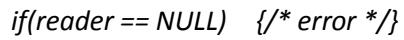
>

9.3.4 设置 DataReader 的 Listener

应用程序可以给 DataReader 设置相应的 DataReaderListener，也可以不设置，取决于应用程序

的需求。DataReaderListener 本质上是一系列回调方法的集合，ZRDDS 会在 DataReader 的状态变化时

调用相应的回调方法来通知应用程序，如在新数据到达时调用 on_data_available()方法。Listener 的

相关信息参见 5.3 节。

注意：有些方法无法在回调方法中使用，具体参见 5.3.6 节。

如果应用程序不需要异步的接受数据到达信息和状态改变信息，则不需要为 DataReader 设置相

应的 Listener，在这种情况下，可以通过定期的使用 read()或 take()方法来访问数据。

DataReaderListener 可以在 DataReader 创建的时候指定，也可以在 DataReader 创建后使用

set_listener()方法来进行设置。如表 9-3 所示介绍了 DataReaderListener 的一系列回调方法。

表 9-3DataReaderListener 回调方法

| 方法名 | 描述 |
| --- | --- |
| on_data_available() | DATA_AVAILABLE Status改变时回调此方法 |
| on_sample_lost() | SAMPLE_LOST Status改变时回调此方法 |
| on_sample_rejected() | SAMPLE_REJECTED Status改变时回调此方法 |
| on_subscription_matched() | SUBSCRIPTION_MATCHED Status改变时回调此方法 |
| on_liveliness_changed() | LIVELINESS_CHANGED Status改变时回调此方法 |
| on_requested_deadline_missed() | REQUESTED_DEADLINE_MISSED Status改变时回调此方法 |
| on_requested_incompatible_qos() | REQUESTED_INCOMPATIBLE_QOS Status改变时回调此方法 |

当有数据到达DataReader时，DDS会按顺序检查Subscriber是否监听DATA_ON_READERSStatus，

DomainParticipant是否监听 DATA_ON_READERSStatus，DataReader是否监听 DATA_ON_READERSStatus，

Subscriber 是否监听 DATA_AVAILABLEStatus，DomainParticipant 是否监听 DATA_AVAILABLEStatus，直

到有一个实体监听 DDS 将状态通知给该实体（不论是否设置了 Listener），如果该实体设置了 Listener

则调用对应的回调函数。

例 9-11：:实现一个简单的 DataReaderListener。

class FooReaderListener : public DataReaderListener

{

public:

```text
virtual void on_data_available(DataReader *reader);
// 这个例子不实现其他的回调方法
};
void FooReaderListener::on_data_available(DataReader *reader)
{
FooDataReader *foo_reader = (FooDataReader *) reader;
FooSeq data_values;
SampleInfoSeq sample_infos;
ReturnCode_t rtn;
if (reader == NULL)
{
printf(“DataReader error\n”);
return;
}
rtn = foo_reader->take(
```

data_values, sample_infos,

100,

DDS_ANY_SAMPLE_STATE,

DDS_ANY_VIEW_STATE,

```text
DDS_ANY_INSTANCE_STATE);
if (rtn == DDS_RETCODE_NO_DATA) { return; }
if (rtn !=DDS_RETCODE_OK) {printf(“take error\n”); }
for (size i = 0; i < data_values.size(); ++i)
{
// 存在数据
if (sample_infos[i].valid_data) {/* 操作数据 */ }
}
foo_reader->return_loan(data_values, sample_infos);
}
```

9.3.5 关于 DataReader 的 Status

DataReader的状态可以通过get_*_status()操作获取，使用listener监听状态变化（针对有Listener

的状态），或使用 StatusCondition 和 WaitSet 等待状态变化。每个状态对应一个结构体类型。

9.3.5.1 DATA_AVAILABLE Status

这个状态表明 DataReader 有新数据到达。通常情况下意味着一个新的数据到达 DataReader。

然而，在有的情况下在 DATA_AVAILABLE Status 状态改变前 DataReader 会收到多个数据。例如

DataReader 希望接收持久化保存的数据时，即可能一次收到一批旧的数据；或者 DataReader 希望收

到可靠的数据（ReliabilityQos），如果 ZRDDS 没有按顺序收到数据，就会在收到正确的数据后一次性

提交多包数据给应用。

DATA_AVAILABLE Status 的改变意味着当前 DataReader 所属的 Subscriber 的

ON_DATA_ON_READERS Status 也发生改变。

DATA_AVAILABLE Status 会在调用 read()或 take()操作或这两个操作的一种变种时重置。不同于其

他大多数状态，DATA_AVAILABLE Status 是读通信状态，见 4.4 节。

```text
当这个状态改变时 DataReaderListener 的 on_data_available()回调函数会被调用，但是，如果
SubscriberListener 或 DomainParticipantListener 实现了 on_data_on_readers()，这种情况下则会优先
调用 on_data_on_readers()。
```

9.3.5.2 LIVELINESS_CHANGED Status

该状态声明一个或多个匹配的 DataWriter 的存活性发生了变化（alive 或 not alive）。DataReader

和 DataWriter 之间的存活性结构由他们的 LivelinessQos 决定。

DataReaderListener 的 on_liveliness_changed()回调函数会在以下情况被调用：

1. DataWriter 失去存活性，在 LivelinessQos 指定的时间内没有收到一包数据；

2. DataWriter 失去存活性后被恢复；

3. DataReader 发现一个新的匹配的实体；

4. 修改 Qos 使原本匹配的实体不再匹配，这时中间件则不再维护实体的存活性。此外：

如果之前 DataWriter 是活跃的，则 alive_count 减小，not_alive_count 保持不变；如果之前

DataWriter 已失去活性，则 alive_count 保持不变，not_alive_count 减小。

可以通过调用 DataReader 的 get_liveliness_changed_status() 操作检查 DataReader 的

LIVELINESS_CHANGEDStatus。

通过一系列操作来改变 DataWriter 的存活性时，LIVELINESS_CHANGEDStatus 状态变化如表9-4

所示。

表 9-4on_liveliness_changed 被调用时 Status 的状态

|  |  |  | alive_ | alive_count | not_alive_ | not_alive_co |
| --- | --- | --- | --- | --- | --- | --- |
|  | 实际操作\ 统计数量 |  |  |  |  |  |
|  |  |  | count | _change | count | unt_change |
|  | 初始值 |  | x | 0 | y | 0 |
|  | 创建DataWriter |  | x+1 | 1 | y | 0 |
|  | 删除DataWriter |  | x-1 | -1 | y | 0 |
|  | DataWriter失去活性 |  | x-1 | -1 | y+1 | 1 |
|  | 失去活性的DataWriter声明活性 |  | x+1 | 1 | y-1 | -1 |
|  | 修改活跃的DataWriter的qos，改为不匹配 |  | x-1 | -1 | y | 0 |
|  | 修改失活的DataWriter的qos，改为不匹配 |  | x | 0 | x-1 | -1 |

9.3.5.3 REQUESTED_DEADLINE_MISSED Status

该状态表明在 DeadlineQos 设置的时间内，DataReader 的一个数据实例没有收到新的数据。对

于没有 Key 的主题，这个状态仅意味着 DataReader 在 DEADLINE 时间内没有收到任何数据。对于有

Key 的主题，在 DataReader 曾经收到过的实例中一个实例的数据，在 DEADLINE 时间内没有收到该

实例的新的数据。

```text
当该状态改变时 DataReaderListener 的 on_requested_deadline_missed()回调函数被调用。也可以
调用 DataReader 的 get_ requested_deadline_missed_status()方法获取该状态的当前值。
```

9.3.5.4 REQUESTED_INCOMPATIBLE_QOS Status

该状态改变表明 DataReader 发现了一个主题相同的 DataWriter，但是该 DataWriter 的 Qos 策略

与 DataReader 的 Qos 策略不匹配。

```text
当该状态改变时 DataReaderListener 的 on_requested_incompatible_qos()方法被调用。也可以调
用 DataReader 的 get_requested_ incompatible_qos_missed_status()方法获取该状态的当前值。
```

9.3.5.5 SAMPLE_LOST Status

该状态表明 DataReader 没有成功接收 DataWriter 发送的一个或多个数据。

对于一个 DataReader，当没有足够的资源接收发送过来的数据时，数据可能被接收程序丢掉。

这些数据被认为是被拒绝的（REJECTED）。DataWriter 受限于能够存储的发送消息的数量，如果

DataWriter 继续发送数据，新的数据可能覆盖还没有被 DataReader 接收的旧数据。被覆盖的数据不

再会被发送到 DataReader，因此这些数据被认为是丢失了。

```text
该状态改变时 DataReaderListener 的 on_sample_lost()回调函数被调用。也可以调用 DataReader
的 get_sample_lost_status()方法获取该状态的当前值。
```

9.3.5.6 SAMPLE_REJECTED Status

该状态表明DataReader由于资源超过限制，丢掉了一个或多个从匹配的DataWriter 收到的数据。

例如，如果接收队列满（队列中的数据数量等于 ResourceLimitsQosPolicy 的”max_samples”）。

```text
该状态改变时 DataReaderListener 的 on_sample_rejected()回调函数被调用。也可以调用
DataReader 的 get_sample_rejected_status()方法获取该状态的当前值。
```

触发该状态时 StatusKind 包括 NOT_REJECTED 、 REJECTED_BY_INSTANCE_LIMIT 、

REJECTED_BY_SAMPLES_LIMIT、REJECTED_BY_SAMPLES_PER_INSTANCE_LIMIT。

9.3.5.7 SUBSCRIPTION_MATCHED Status

该状态变化表明 DataReader 发现了一个匹配的 DataWriter 或 DataReader 与已经匹配的

DataWriter 失去匹配。

只有在 DataWriter和 DataReader 有相同的主题和数据类型以及相匹配的 Qos时才会产生“匹配”。

此外，如果用户指定忽略某一 DataWriter，那这个 DataWriter 永远不会被匹配。

```text
该状态改变时 DataReaderListener 的 on_subscription_matched()回调函数被调用。也可以调用
DataReader 的 get_subscription_matched_status()方法获取该状态的当前值。
```

9.3.6 查找 DataReader 的 Status

表 9-5 检查 DataWriter Status

| 方法名 | 描述 |
| --- | --- |
| get _data_available_status () | 获取DATA_AVAILABLE Status。 |
| get _sample_lost_status () | 获取SAMPLE_LOST Status。 |
| get _sample_rejected_status () | 获取SAMPLE_REJECTED Status。 |
| get _subscription_matched_status () | 获取SUBSCRIPTION_MATCHED Status。 |
| get _liveliness_changed_status () | 获取LIVELINESS_CHANGED Status。 |
| get _requested_deadline_missed_status () | 获取REQUESTED_DEADLINE_MISSED Status。 |
| get _requested_incompatible_qos_status () | 获取REQUESTED_INCOMPATIBLE_QOS Status。 |
| get_status_changes() | 上述status变化的列表。 |

用户可以通过 get_status_changes()获取一系列从上一次应用获取该状态或被 listener 调用后产

生变化的状态列表。用户可以通过调用表9-5 中的函数获取 DataReader 的状态。

9.3.7 获取 DataReader 的关联实体

```text
- get_matched_publications()：获取已匹配 DataWriter 的句柄列表。
- get_matched_publication_data()：获取已匹配 DataWriter 的数据信息。
- get_subscriber()：获取创建 DataReader 的 Subscriber。
- get_topic()：获取 DataReader 关联的 Topic。
```

9.3.8 使用特定类型的 DataReader

应用程序可以通过 Subscriber 的方法创建一个与具体类型相关的 DataReader，例如 Foo 类型。

但是 Subscriber 的 create_datareader()操作返回的是一个一般的 DataReader，而不是具体的

FooDataReader，因此，当应用程序想要通过创建出来的 DataReader 访问数据时，需要将该 DataReader

转换为具体的 FooDataReader，然后使用 FooDataReader 的类型相关的方法来访问数据。可以通过如

下办法来实现将一般的 DataReader 转换为具体的 DataReader：

FooDataReader *foo_reader = (FooDataReader *) reader;

9.3.9 实例管理

9.3.9.1 查找 InstanceHandle_t

```text
在 DataReader 的某些操作如 read_instance()和 take_instance()中，需要指定一个 InstanceHandle_t
的参数。应用程序可以通过 lookup_instance()操作来获得一个实例所对应的 InstanceHandle_t。
```

例 9-12：查找 InstanceHandle_t。

```text
Foo instance;
InstanceHandle_t handle = foo_datareader->lookup_instance(&instance);
```

9.3.9.2 获取 Instance 的 Key 值

```text
应用程序可以通过使用 get_key_value()方法，根据一个 InstanceHandle_t 来获取到它对应的实例
的键。get_key_value()方法获取到的键是填充到一个完整的实例中的，例如填充到一个 Foo 的实例中。
例 9-13：使用 get_key_value()获取一个 Foo 实例的键。
```text
Foo key_value; // 用来订阅键的实例if (foo_datareader->get_key_value(key_value, handle) != DDS_RETCODE_OK){ /* error */ }// 现在可以访问key_value 中的键所对应的域获取相应的键值了`<sub>`。`</sub>`
```
```

9.3.10 访问数据

对于应用程序而言，想要访问 DataReader 订阅到的数据，必须得使用与数据类型相关的

DataReader。例如，如果想要访问类型为 Foo 的数据，则应用程序必须使用 FooDataReader 的方法。

```text
9.3.10.1 使用 read()和 take()访问数据
应用程序想要访问 DataReader 收到的数据样本，必须通过 read()和 take()系列的方法，这些方
```

法会将样本以及对应的 SampleInfo 填充进传入方法的参数中。

应用程序可以通过指定传入 read()和 take()方法中的参数，有选择地获取想要的样本。比如说获

取所有的样本，或者说，通过设置传入的 sample_states、view_states 和 instance_states 掩码，来获

取一部分的数据样本。

注意：本节中的方法介绍均以 FooDataReader 为例。

9.3.10.2 read()和 take()的区别

这里的 Read 和 Take 泛指一系列以 read 或者 take 开头的方法，DataReader 中对于每一个方法都

提供了相应的 Read 和 Take 版本，它们的区别仅仅在于 DataReader 对于返回的数据有不同的处理。

在 Take 系列的方法中，DataReader 在将数据返回给应用程序后，会把它们从 DataReader 的数据队

列中移除。而在 Read 系列的方法中，则是将数据队列中数据的一份拷贝返回给应用程序，并不会

把它们从数据队列中移除。除此之外，每一组 read 和 take 方法几乎一模一样，包括参数、返回数

据的内容、以及相应的 SampleInfo 等等。

9.3.10.3 read()和 take()

这一组方法会根据传入的参数，返回符合条件的数据样本及它们相关的 SampleInfo，样本的个

数的上限取决于参数。

```text
read()和 take()的方法声明如下所示：
ReturnCode_t read(
```

FooSeq &data_values,

SampleInfoSeq &sample_infos,

long max_samples,

SampleStateMask sample_mask,

ViewStateMask view_mask,

```text
InstanceStateMask instance_mask);
ReturnCode_t take(
```

FooSeq &data_values,

SampleInfoSeq &sample_infos,

long max_samples,

SampleStateMask sample_mask,

ViewStateMask view_mask,

InstanceStateMask instance_mask);

该方法从数据读者中读取一系列的样本（及其关联的样本信息），读取的样本最大个数由参数

max_samples 指定。

传入的参数 data_values 以及 sample_infos 序列有三个属性：当前长度 len、最大长度 max_len

以及是否拥有空间 own,根据 data_values 以及 sample_infos 的三个属性的值，通信中间件的行为可

以是：

- data_values 以及 sample_infos 的 len、max_len、own 属性必须相同，否则该方法返

回”DDS_RETCODE_PRECONDITON_NOT_MET”错误；

- 调用成功后，data_values 以及 sample_infos 具有相同的 len、max_len、own 属性，且按照

下标一一关联；

- 如果输入的 max_len 为 0，则表明用户没有提供样本空间，通信中间件以租借的方式填充

data_values 以及 sample_infos，即 owns 属性设置成 false，len 设置为获取到的样本数量，此时

通信中间件不能对样本做深拷贝，当用户使用完返回的空间时应该调用 return_loan 方法归还这

些空间；

- 如果输入的 max_len 大于 0 并且 owns 属性为 false，为了避免可能的内存泄漏，该方法返

回”DDS_RETCODE_PRECONDITON_NOT_MET”错误；

```text
- 如果输入的 max_len 大于 0 并且 owns 属性为 true，则表明用户提供了样本空间，通信中
间件应将保存的样本以及样本信息拷贝到提供的空间中，在返回值中 owns 属性设置为 true，len
```

表示拷贝的样本个数，max_len 保持不变，这些样本序列则不需要归还到通信中间件；

- 当 max_samples 等于”LENGTH_UNLIMITED”时，通信中间件拷贝尽可能多的样本；

- 当 max_samples 小于等于 max_len 时，则通信中间件至多拷贝 max_samples 个样本；

- 当 max_samples 大于 max_len 时，则直接返回”RETCODE_PRECONDITION_NOT_MET”错误。

这组方法会向 ZRDDS 租借空间，因此需要使用 return_loan()操作归还租借的空间。

这组方法是非阻塞的，即使数据队列为空或无符合条件的样本，也会对数据队列进行访问，并

返回”DDS_RETCODE_NO_DATA”，表示没有数据。

通过使用 sample_mask、view_mask 以及 instance_mask，应用程序可以获取到不同组合的样本。

比如说：获取所有的样本、获取未曾访问过的样本、获取被销毁掉的实例的样本等等。

```text
例 9-14：使用 read()访问数据。
FooSeq data_values;
SampleInfoSeq sample_infos;
// 使用read 获取至多100 个数据样本
ReturnCode_t rtn = foo_datareader->read(
```

data_values,

sample_infos,

100,

DDS_ANY_SAMPLE_STATE,

DDS_ANY_VIEW_STATE,

```text
DDS_ANY_INSTANCE_STATE);
if (rtn == DDS_RETCODE_NO_DATA) { /* error */ }
if (rtn != DDS_RETCODE_OK) { /* error */ }
// 归还空间
rtn = foo_datareader->return_loan(data_values, sample_infos);
if (rtn != DDS_RETCODE_OK) { /* error */ }
9.3.10.4 read_next_sample()和 take_next_sample ()
这组方法会获取到下一个未被访问过的数据，获取到的数据和如下的 read()或者 take()的返回结
```

果是一样的：

read(data_values,

sample_infos,

1,

DDS_NOT_READ_SAMPLE_STATE,

DDS_ANY_VIEW_STATE,

DDS_ANY_INSTANCE_STATE);

或者：

take(data_values,

sample_infos,

1,

DDS_NOT_READ_SAMPLE_STATE,

DDS_ANY_VIEW_STATE,

```text
DDS_ANY_INSTANCE_STATE);
read_next_sample()和take_next_sample()的方法声明如下所示：
ReturnCode_t read_next_sample(Foo &data_value, SampleInfo &sample_info);
ReturnCode_t take_next_sample(Foo &data_value, SampleInfo &sample_info);
```

如果 DataReader 对数据队列中没有未读的样本，本方法会返回”DDS_RETCODE_NO_DATA”，表

示没有数据。

本方法不需要向 DataReader 租借空间，因为传入的参数要求用户提供好相应的空间。因此，不

```text
需要使用 return_loan()方法归还空间。
例 9-15：使用 read_next_sample()访问数据。
```text
Foo data_value; SampleInfo sample_info; ReturnCode_t rtn = foo_datareader->read_next_sample(data_value, sample_info); if (rtn == DDS_RETCODE_NO_DATA) {/* error */} if (rtn != DDS_RETCODE_OK) {/* error */} // 无需归还空间
```
9.3.10.5 read_instance()和 take_instance()
这组方法与 read()和 take()几乎一样，但它们只会访问某一个指定的实例的样本。因此，它们相
比于 read()和 take()的参数，增加了一个参数用来表示要访问的实例的 InstanceHandle_t。它们的方
```

法声明如下：

ReturnCode_t read_instance(

FooSeq &data_values,

SampleInfoSeq &sample_infos,

long max_samples,

const InstanceHandle_t &handle,

SampleStateMask sample_mask,

ViewStateMask view_mask,

```text
InstanceStateMask instance_mask);
ReturnCode_t take_instance(
```

FooSeq &data_values,

SampleInfoSeq &sample_infos,

long max_samples,

const InstanceHandle_t &handle,

SampleStateMask sample_mask,

ViewStateMask view_mask,

InstanceStateMask instance_mask);

如果指定的 InstanceHandle_t 在 DataReader 中不存在的话 ， 则调用这组方法会返

回”DDS_RETCODE_BAD_PARAMETER”。

对于传入的 InstanceHandle_t，可以通过对先前的 read()等方法获取的数据使用 lookup_instance()

方法获取到，或者直接从相应的 SampleInfo 中获取。

```text
这组方法会向 ZRDDS 租借空间，因此需要使用 return_loan()归还租借的空间。
例 9-16：使用 read_instance()访问数据。
```

```text
// 假设先前通过read_next_sample 获取到了数据样本及其SampleInfo<sub>，</sub>// 想要获取更多该实例的数据// 从SampleInfo 中获取InstanceHandle_tInstanceHandle_t handle = sample_info.instance_handle;FooSeq data_values;SampleInfoSeq sample_infos;// 使用read_instance 获取至多100 个数据样本ReturnCode_t rtn = foo_datareader->read_instance(data_values,sample_infos,100,DDS_ANY_SAMPLE_STATE,DDS_ANY_VIEW_STATE,DDS_ANY_INSTANCE_STATEinstance_handle);if (rtn == DDS_RETCODE_NO_DATA) {/* error */}if (rtn != DDS_RETCODE_OK) {/* error */}// 归还空间rtn = foo_datareader->return_loan(data_values, sample_infos);if (rtn != DDS_RETCODE_OK) {/* error */}
```

```text
9.3.10.6 read_next_instance()和 take_next_instance()
这组方法与 read_instance()和 take_instance()方法相似，但它们参数中指定的 InstanceHandle 并
```

不是要访问的实例的 InstanceHandle_t，而是要访问实例的前一个实例的 InstanceHandle_t。除此之

外，两组方法基本一样。方法的声明如下：

ReturnCode_t read_next_instance(

FooSeq &data_values,

SampleInfoSeq &sample_infos,

long max_samples,

const InstanceHandle_t &previous_handle,

SampleStateMask sample_mask,

ViewStateMask view_mask,

```text
InstanceStateMask instance_mask);
ReturnCode_t take_next_instance(
```

FooSeq &data_values,

SampleInfoSeq &sample_infos,

long max_samples,

const InstanceHandle_t &previous_handle,

SampleStateMask sample_mask,

ViewStateMask view_mask,

InstanceStateMask instance_mask);

DataReader 会在内部对实例之间的顺序进行维护，能够保证任意两个实例之间使用的值不会相

同。

当指定的 InstanceHandle_t 为”DDS_HANDLE_NIL_NATIVE”，表示访问第一个实例的数据，因为

该 InstanceHandle_t 被认为是“最小的”InstanceHandle_t。

```text
这组方法会向 ZRDDS 租借空间，因此需要使用 return_loan()归还租借的空间。
例 9-17：使用 read_next_instance()访问数据。
```

```text
// 获取第一个实例的数据FooSeq data_values;SampleInfoSeq sample_infos;// 使用read_instance 获取至多100 个数据样本ReturnCode_t rtn = foo_datareader->read_instance(data_values,sample_infos,100,DDS_HANDLE_NIL_NATIVE,DDS_ANY_SAMPLE_STATE,DDS_ANY_VIEW_STATE,DDS_ANY_INSTANCE_STATE);if (rtn == DDS_RETCODE_NO_DATA) {/* error */}if (rtn != DDS_RETCODE_OK) {/* error */}// 归还空间rtn = foo_datareader->return_loan(data_values, sample_infos);if (rtn != DDS_RETCODE_OK) {/* error */}
```

9.3.10.7 read_w_condition()和 take_w_condition()

该组方法等价于将 SampleStateMask, ViewStateMask, InstanceStateMask 三个状态掩码创建

ReadCondition，并将该 ReadCondition 作为参数代替 read/take 系列函数中的三个状态掩码参数。

9.3.10.8 向 DataReader 归还空间

DataReader 的 read()和 take()系列的操作大多需要提供至少两个序列：

- 用于订阅数据样本的序列。

- 用于订阅数据样本对应的 SampleInfo 的队列。

需要注意的是，订阅数据样本的序列为 FooSeq 类型的。DataReader 会为样本序列申请相应的

空间，然后将样本交给用户使用，这里称为“租借”空间。因此，应用程序在使用完样本后，需要

通过 return_loan()操作将这部分租借的空间归还给 DataReader，否则，ZRDDS 将有可能消耗完操作

系统的所有内存。

```text
注意：read_next_sample()和 take_next_sample()的参数不是 FooSeq，因此是不会租借空间的。
return_loan()方法的声明如下：
ReturnCode_t return_loan(
```

FooSeq &data_values,

SampleInfoSeq & sample_infos);

9.3.11 DataReader 的 SampleInfo 结构

当应用程序使用 read()或 take()方法来访问数据时，对于每一个返回的样本，都会返回一个相应

的 SampleInfo 信息。SampleInfo 信息中包含了一系列与样本相关的额外信息，用户可以通过这些信

息对样本进行进一步的操作。

表9-6 为 SampleInfo 的类结构以及简要描述。

表 9-6SampleInfo 类结构

| 类型 | 变量名 | 描述 |
| --- | --- | --- |
| SampleStateKind | sample_state | 参考8.3.11.1节。 |
| InstanceStateKind | instance_state | 参考8.3.11.2节。 |
| ViewStateKind | view_state | 参考8.3.11.3节。 |
| InstanceHandle_t | instance_handle | 数据的InstanceHandle_t。 |
|  | publication_handle | 发送该数据的 DataWriter 的<br>InstanceHandle_t 。 用户可以从<br>get_matched_publications() 方法获取的<br>InstanceHandle_t 列表中找相同值，也可<br>以在 get_matched_publication_data()操作<br>中使用它。 |
| long | disposed_generation_count | 参考8.3.11.5节。 |
|  | no_writers_generation_count |  |
|  | sample_rank | 参考8.3.11.6节。 |
|  | generation_rank |  |
|  | absolute_generation_rank |  |
| bool | valid_data | 参考8.3.11.4节。 |
| Time_t | source_timestamp | DataWriter在发布数据样本时的时间。 |
| InstanceHandle_t | publication_handle | 发送此样本的源端数据写者标识 |
| SequenceNumber_t | write_sequence_number | 此样本在数据写者端的序列号 |

9.3.11.1 样本状态(Sample States)

对于每一个 DataReader 接收的样本，它都会为该数据样本维护一个 sample_state。这个状态信

息可能的值如下：

- DDS_READ_SAMPLE_STATE：该数据样本已经被访问过了。

- DDS_NOT_READ_SAMPLE_STATE：该数据样本尚未被访问过。

通过 read()或 take()方法获取到的一系列样本的 sample_state 可以不同。

9.3.11.2 实例视图状态(View States)

ViewStateKind 是 DataReader 为每一个 instance 关联的状态信息。这个状态信息可能的值如下：

- DDS_NEW_VIEW_STATE：

当出现下述情况时，实例会处于此状态：

1. DataReader 尚未访问过此实例的样本，这是第一次访问。

2. 这个实例消失后又再次出现，例如 DataWriter 对该 instance 进行了 dispose()操作，之

后 DataReader 又再次收到该 instance 下的数据。

这两种情况可以通过 disposed_generation_count 和 no_writers_generation_count 进行区分。

- DDS_NOT_NEW_VIEW_STATE:

该实例的样本先前被访问过且其存活状态在上次访问后未被刷新。

```text
不同于 SampleStateKind，ViewStateKind 是关联一个 instance 的状态信息，通过 read()或者
take()方法取出一组同一个 instance 下的数据时，它们的 ViewStateKind 取值相同。
```

9.3.11.3 实例状态(Instance States)

InstanceStateKind 也是 DataReader 为每一个 instance 关联的状态信息。这个状态信息可能的值

如下：

- DDS_ALIVE_INSTANCE_STATE

表示实例处于存活状态。当出现下述情况时，实例会处于此状态：

1. DataReader 曾经收到过来自该实例的数据样本。

2. 修改该实例的 DataWriter 是存活的。

3. 该实例至今未被显式的销毁掉（或者在销毁后又收到了新的数据样本）。

- DDS_NOT_ALIVE_DISPOSED_INSTANCE_STATE

表示该实例被 DataWriter 显式的进行了 dispose()操作。

- DDS_NOT_ALIVE_NO_WRITERS_INSTANCE_STATE

表示 DataReader 认为该实例为非存活的，因为当前没有 DataWriter 在发送该实例的数据。

与 SampleStateKind 类似，通过 read()或 take()方法获取到的一系列样本的 instance_state 可以不

同。

InstanceStateKind 的取值变化与 OwnershipQosPolicy 有关：

- 当 OwnershipQosPolicy 取值”DDS_EXCLUSIVE_OWNERSHIP_QOS”时，只有拥有该 instance 的

DataWriter 对该 instance 进行 dispose()操作后，该 instance 关联的 InstanceStateKind 才会被置

为”DDS_NOT_ALIVE_DISPOSED_INSTANCE_STATE”。

- 当 OwnershipQosPolicy 取值”SHARED_OWNERSHIP_QOS”时，任意一个 DataWriter 对该

instance 进行 dispose() 操作后 ， 该 instance 关联的 InstanceStateKind 被置

为”DDS_NOT_ALIVE_DISPOSED_INSTANCE_STATE”。当任意一个 DataWriter 向 DataReader 发送新

数据后，该 instance 关联的 InstanceStateKind 被置为”DDS_ALIVE_INSTANCE_STATE”。

9.3.11.4 数据有效位

valid_data 表示 DataReader 收到的数据是否是一个真实的数据，还是仅仅是一个状态数据。一

```text
般情况下，通过 read()或 take()操作取出的数据包括具体的数据值以及对应的 SampleInfo 信息。但在
某些情况下，read()或 take()操作取出的 SampleInfo 信息并不关联一个具体的值，而是一些状态变化
而产生的状态数据。例如：DataWriter 对一个 instance 进行 dispose()操作后，DataReader 会收到该
```

instance 的状态数据（InstanceStateKind 为”DDS_NOT_ALIVE_DISPOSED_INSTANCE_STATE”），对应的

```text
valid_data 为 false。
如果 valid_data 为 true，read()或 take()取出的数据有效，反之无效。
为保证数据操作的安全性，用户在使用 read()或 take()操作数据后，首先应该验证 vaild_data 取
```

值，判断取出的数据是否为真实数据还是状态数据。

9.3.11.5 Generation Counts

由于实例可以通过应用程序的某一些方法导致它在 ALIVE 和 NOT_ALIVE 的状态中变化，并且在

每一次 ALIVE 期间都可以使用 DataWriter 发布数据，在 DataReader 端也可以收到相应的样本。为了

区分这些变化的情况，定义了“代”的概念。每一次实例状态由 NOT_ALIVE 变成了 ALIVE 时，对实

例来说认为是新的一代。

DataReader 为每一个实例都维护了两个计数值来统计实例当前处于的“代”，如下：

- disposed_generation_count

统计实例的状态由 NOT_ALIVE_DISPOSED 变为 ALIVE 的次数。当实例的资源被回收时，该值

会被重置为 0。

- no_writers_generation_count

统计实例的状态由 NOT_ALIVE_NO_WRITERS 变为 ALIVE 的次数。当实例的资源被回收时，

该值被重置为 0。

DataReader 会在每次收到数据时，将实例的这两个计数值的当前值与该数据绑定起来，并在用

户访问该数据样本时，这两个值将在 SampleInfo 中提供。

9.3.11.6 Generation Ranks

在通过 read()和 take()方法获取到的数据样本集合中，可能存在属于同一个实例，但是不同代的

数据的，因此，DataReader 还需要在 SampleInfo 中提供每一个数据样本相关的“代”的信息，除了

通过上述的两个计数值，还包括以下几个值：

- sample_rank

用户在通过调用每一次 read()和 take()操作获取到的所有样本中，属于同一个实例下的样本

可能有许多个，这些样本都是按照时间的先后顺序来进行排序的，这个值指的是 SampleInfo 对

应的样本在这些样本中的位置。比如调用一次 read()操作获取到了 10 个关于实例 A 的样本，那

么，最新的那个样本的 sample_rank 值为 0，而最老的那个的 sample_rank 值为 9。注意，这些

样本的先后顺序仅仅是指在返回集合中的顺序，而并不一定是在 DataReader 数据队列中的顺序。

- generation_rank

这个参数用来区分 SampleInfo 对应的样本与返回集合中同属于一个实例的所有样本中最新

样本间的“代”的差异。比如用户调用一次 read()操作获取到了 10 个关于实例 A 下的样本，并

且最新的样本的 generation_rank 值为 0，而其他的样本的 generation_rank 则表示它们的“代”

和最新的样本的“代”之间的差值。

- absolute_generation_rank

这个参数的含义与 generation_rank 类似，它的值也是用来区分 SampleInfo 对应的样本与最

新的样本之间的“代”的差异。但在这个参数中，“最新”是指在 DataReader 订阅到的所有该

实例下的样本中的最新样本，而不是返回集合中属于该实例的所有样本中的最新样本，也就是

说该样本并不一定处于 DataReader 的返回集合中。

通过使用上述的 SampleInfo 中的三个 rank 值，应用程序可以得到样本的信息，并根据这些

SampleInfo 信息判断出对应的样本是否是所需要的，比如说：

- 应用程序想要最新的一个数据，那么它只要访问那些 sample_rank 为 0 的 SampleInfo 对应

的数据样本。

- 应用程序想要实例最新一代的数据，那么它只要访问那些 absolute_generation_rank 为 0 的

SampleInfo 对应的数据样本。

- 应用程序想要区分数据样本是否同代，那么它只要比较两个数据样本的 SampleInfo 中的

generation_rank 是否相同。

## 第10章 QoS 策略

本章旨在帮助用户熟悉 QoS 的含义及使用方法，主要包含以下内容：

```text
- AsynchronousPublisherQosPolicy (DDS Extension)
- BatchQosPolicy(DDS Extension)
- DataWriterMessageModeQosPolicy(DDS Extension)
```

- DeadlineQosPolicy

- DestinationOrderQosPolicy

- DiscoveryConfigQosPolicy(DDS Extension)

- DurablityQosPolicy

- EntityFactoryQosPolicy

- GroupDataQosPolicy

- HistoryQosPolicy

- LifespanQosPolicy

- LivelinessQosPolicy

- LogQosPolicy

- DDSMsgStaticsInfoQosPolicy

- OwnershipQosPolicy

- OwnershipStrengthQosPolicy

- PartitionQosPolicy

- PresentitionQosPolicy

```text
- DataWriterProtocolQosPolicy(DDS Extension)
- PublishModeQosPolicy(DDS Extension)
```

- RapidIOConfigQosPolicy

- RapidIOControllerQosPolicy

- ReaderDataLifecycleQosPolicy

- ReceiveThreadConfigQosPolicy(DDS Extension)

- ReliabilityQosPolicy

- ResourceLimitsQosPolicy

- ThreadCoreAffinityQosPolicy(DDS Extension)

- TimeBasedFilterQosPolicy

- TopicDataQosPolicy

- TransportConfigQosPolicy

- UserDataQosPolicy

- WriterDatalifecycleQosPolicy

- DataWriterResourceLimitsQosPolicy(DDS Extension)

- DurabilityServiceQosPolicy

- LatencyBudgetQosPolicy

- TransportpriorityQosPolicy

### 10.1. AsynchronousPublisherQosPolicy (DDS Extension)

表 10-1 AsynchronousPublisherQosPolicy 的属性

| 可变性 | 兼容性(RxO) | 关联实体 |
| --- | --- | --- |
| NO | YES | Publisher |
| 类型 | 变量名 | 描述 |
| DDS_Boolean | disable_asynchronous_write | 是否禁用异步发送模式。 |
| DDS_Boolean | disable_asynchronous_batch | 是否禁用异步批量发送模式。 |

该 QoS 用于控制 Publisher 是否使用异步发送或异步批量发送方式来发送数据。

该 QoS 可以用于减少用户线程发送数据的时间，使得大包数据可以被可靠的发送。

如果设置为异步发送，Publisher 会创建两个线程，一个用于异步发送数据，另一个则用于异步

批量发送。一个 Publisher 下所有”publish_mode”设置为”DDS_ASYNCHRONOUS_PUBLISH_MODE_QOS”

的 DataWriter 会使用同一个发送线程。异步的发送线程会替 DataWriter 处理发送过程，而该线程只

会在第一个异步的 DataWriter 使能时创建。

一个Publisher下所有使用”batch”并且”max_flush_delay”不为”INFINITE_DURATION”的DataWriter

使用同一个异步批量发送线程，而该线程只会在第一个这种 DataWriter 使能时创建。

该 QoS 允许用户独立地调整数据是否使用异步发送和 batch 的异步发送。

 QoS 成员

```text
如果使用异步发送数据，则”disable_asynchronous_write“必须设置为”false“，并且 false 为默
认值。如果该值为”true”，那么由该 Publisher 创建的 DataWriter，它的 DataWriterQos 的成
```

员”publish_mode”必须设置为“DDS_SYNCHRONOUS_PUBLISH_MODE_QOS”。

```text
如果使用异步批量发送方式发送数据，则“disable_asynchronous_batch”必须设置为”false”，
并且 false 为默认值。如果该值设置为 true，那么由该 Publisher 创建的 DataWriter，它的
```

DataWriterQos 的成员”batch”的成员”max_flush_delay“必须设置为”INFINITE_DURATION”。

 QoS 属性

该 QoS 在实体使能后不能修改。

该 QoS 作用于 Publisher，要求兼容性。当“disable_asynchronous_write”的值为“true”时，那

么由该 publisher 创建的 DataWriter 的 PublishModeQosPolicy 的成员 “ kind” 的值必须为

“DDS_ASYNCHRONOUS_PUBLISH_MODE_QOS”；当“disable_asynchronous_batch”的值为“true”时，那么

由该 publisher 创建的 DataWriter 的 BatchQoSPolicy 的成员 “max_flush_delay” 的值必须为

“INFINITE_DURATION”。

 相关 QoS

```text
BatchQosPolicy(10.2 节)。
PublishModeQosPolicy(10.20 节)。
```

### 10.2. BatchQosPolicy(DDS Extension)

表 10-2 Batch QosPolicy 的属性

| 可变性 | 兼容性(RxO) | 关联实体 |
| --- | --- | --- |
| NO | NULL | DataWriter |
| 类型 | 变量名 | 描述 |
| DDS_Boolean | enable | 是否使用批量发送 |
| DDS_Long | max_data_bytes | 批量发送时样本最大累计长度 |
| DDS_Long | max_meta_data_bytes | 批量发送时元素样本最大累计长<br>度 |
| DDS_Long | max_samples | 批量发送时最大样本数量 |
| DDS_Duration_t | max_flush_delay | 最大发送延迟 |
| DDS_Duration_t | source_timestamp_resolution | 设置批量发送的源时间戳分辨率 |
| DDS_Boolean | thread_safe_write | 多线程写操作是否安全 |

该 QoS 能够通过减少在发送小包数据时传播和回复时的通信量来增加吞吐量。

由该 QoS 设置的机制允许 DDS 收集多个用户数据样本，然后使用一个网络数据包来发送这些数

据样本，利用发送大数据包的优势可以提高有效的吞吐量。

该 QoS 可以显著地增加应用对小包数据的有效吞吐量。小包数据（大小小于 2048 字节）的吞

吐量通常会被 CPU 能力限制而不是网络带宽。将一些小的数据样本合并成一个大的数据包来发送，

可以提高网络利用率并且提高吞吐量。

如果使用了批量发送，样本被写入时不会立即被发送，而是先将它们被打包到一个大包中，然

后等到满足一定条件时，再把这个大包发送出去。一个大包总是包含完整的样本，也就是说一个样

本不会被分片放到多个大包中。

只要达到下面条件中的一个，大包就会被发送到网络上：

- 用户设置的发送条件

 达到批量发送的大小限制（max_data_bytes）

 批量发送中的样本数量达到限制（max_samples）

 从应用写入大包的第一包数据开始的时间达到限制，即达到最大发送延迟

（max_flush_delay）

 应用显式的调用 DataWriter 的 flush()函数

- 非用户设置的发送条件

 如果 DataWriter 所关联的主题没有 key，则批量发送中的样本数量与 DataWriter 的

DataWriterQos 的成员”resource_limits“的成员”max_samples“的值相等时会发送；如果

DataWriter 所关联的主题有 key，则批量发送中的样本数量与 DataWriter 的

DataWriterQos 的成员”resource_limits“的成员”max_samples_per_instance“的值相等时

会发送。

 QoS 成员

“enable”指定是否使用批量发送将数据打包发送，默认值为 false。

“max_data_bytes”设置批量发送中所有连续的样本最大长度，当到达该限制时或到达之前，

打包的数据会被自动发送。这个长度不包括 batch 中样本关联的 meta_data。默认值为 1024.

“max_samples”设置一次批量发送中样本的最大数量。当到达该限制时，batch 被自动发送。

默认值为”LENGTH_UNLIMIT”。

“max_flush_delay”设置最大发送延迟。当到达该周期时 batch 会被自动发送。该延迟从应用

将第一个数据写入 batch 开始计时。

“source_timestamp_resolution”设置 batch 的源时间戳分辨率。该变量决定 batch 中的样本

如何关联时间戳。理论上一个 batch 中的所有样本都需要带有时间戳，但实际中并不是每一个

样本都需要带有时间戳，而具体是哪几个样本带有时间戳则有“source_timestamp_resolution”的

值来决定的。如果”source_timestamp_resolution”是”INFINITE_DURATION”，batch 中的所有样本

都会使用第一个样本的源时间戳。如果”source_timestamp_resolution”是”0”，batch 中的每个样

本都使用各自的时间戳。如果“source_timestamp_resolution”的值是其它的，那么哪些样本带有

时间戳，则就需要经过计算了，假设样本是带有时间戳的样本，如果样本 、样本 ···它们

的时间戳的值减去时间戳的值小于”source_timestamp_resolution”的值，那么样本 、

样本 ···就不会带有时间戳，它们将沿用样本的时间戳 ，直到样本的时间戳的值减去

样本的时间戳的值的差刚好不小于”source_timestamp_resolution”的值，则样本就是带有时

间戳的样本。当”source_timestamp_resolution”设置为”INFINITE_DURATION”时 batch 处理过程的

性能更好。默认值为”INFINITE_DURATION”。

```text
“thread_safe_write”决定 write 操作是否是线程安全的。如果设置为”true”多个线程可以同时
调用 DataWriter 的 write 操作。设置为”false”可以增加使用 batch 时的吞吐量。默认值为”false”。
```

 同步和异步发送

通常 batch 是同步发送的：

- 当一个 batch 达到应用设置的大小限制时（max_samples 或 max_data_bytes），因为应

```text
用调用了 write()，batch 会被在正在写入的线程立即发送。
- 当应用手动地发送（flush()）batch 时，batch 会被调用线程立即发送。
```

- 如果 DataWriter 所关联的主题没有 key，则批量发送中的样本数量与 DataWriter 的

DatWriterQos 的成员”resource_limits “的成员”max_samples“的值相等时会写入线程立即发

送；如果 DataWriter 所关联的主题有 key，则批量发送中的样本数量与 DataWriter 的

DatWriterQos 的成员”resource_limits “的成员”max_samples_per_instance “的值相等时会被

写入线程立即发送。

一些情况下是异步的：

- 为了使用时间限制（max_flush_delay）发送 batch，需要设置 DataWriter 的

DataWriterQos 的成员”publish_mode”的值为”DDS_ASYNCHRONOUS_PUBLISH_MODE_QOS”

的异步 batch 发送。这会使 Publisher 创建一个额外的线程用于发送 DataWriter 的 batch。

这与异步发送数据相似。

 性能

使用 batch 的目的是提高在快速发送小包数据时的吞吐量。在这样的情况下，吞吐量可以

提升几倍更接近与底层网络通信的物理限制。

将样本收集到一个 batch 中意味着它们在被程序写入时不会被立即发送到网络上，因此

会增加延迟。无论如何当应用发送数据的速度大于网络能够支持的速度时，网络有效带宽花

费在回复和数据重发上的比例会增长。在这种情况下使用 batch 减少上层的发送可以减小延

迟同时提高吞吐量。

提升 batch 吞吐量的方法如下：

- 当 batch 中包含大量的小包数据时设置”thread_safe_write”为”false”。如果不使用线程

安全的配置，则不能使用异步发送。

- 设置”source_timestamp_resolution”为”INFINITE_DURATION”。设置该值时 batch 中的所

有样本使用相同的源时间戳。

 QoS 属性

该 QoS 在使能后不能修改。

该 QoS 只作用于 DataWriter，所以不存在兼容性。

一致性规则：

- “max_samples”与”max_data_bytes”不能同时设置为”LENGTH_UNLIMITED”。

- 如果”max_flush_delay”不是”INFINITE_DURATION”，则该 DataWriter 相关的 Publish

```text
的AsynchronousPublisherQosPolicy的成员”disable_asynchronous_batch”必须设置为”false”。
- 如果”thread_safe_write”设置为”false”，”source_timestamp_resolution”必须设置
```

为”INFINITE_DURATION”。

 相关 QoS

AsynchronousPublisherQosPolicy (10.1 节)。为基于时间限制发送 batch，需要使用 Publisher

的 PublisherQos 的成员“asynchronous_publisher”的“disable_asynchronous_batch”的值。

LifespanQosPolicy(10.11 节)。当设置 LifespanQosPolicy 的成员”duration“的值小于 batch 的发

送周期（max_flush_delay）时需要注意。如果 batch 在发送周期前没有被填满，LifespanQosPolicy

的”duration”会使样本在发送前丢失。

HistoryQosPolicy(10.10 节)。不要设置 DataReader 或 DataWriter 的 HistoryQosPolicy 小于

DataWriter 的最大 batch 尺寸（max_samples）。当 DataWriter 的 HistoryQosPolicys 小于 batch

的”max_samples”时一些数据不会被发送。当 DataReader 的 HistoryQosPolicys 小于 batch

的”max_samples”时，数据在提交给应用前可能会被丢弃。

### 10.3. DataWriterMessageModeQosPolicy(DDS Extension)

表 10-3 DataWriterMessageModeQosPolicy 的属性

| 可变性 | 兼容性(RxO) | 关联实体 |
| --- | --- | --- |
| NO | NULL | DataWriter |
| 类型 | 变量名 | 描述 |
| DDS_Boolean | without_timestamp | 是否发送时间戳 |
| DDS_Boolean | without_inlineQos | 是否带内联Qos |
| DDS_Boolean | disallow_message_coalesce | 是否允许消息合并 |
| DDS_Boolean | message_header_coalesce | 该成员只在rapidio中使用。 |

该 QoS 允许用户控制报文中的信息，以减少消息内容。

 QoS 成员

```text
“without_timestamp”控制发送数据时是否发送时间戳。默认为”false”，会发送时间戳。该
值为”true”时，DataWriterQos 中的”destination_order.kind“必须为”BY_RECEPTION_TIMESTAMP_
```

DESTINATIONORDER_QOS”。

“without_inlineQos”控制发送数据时是否发送内联的 Qos 策略。默认值为”false”，带内联的

Qos 策略。

“disallow_message_coalesce”该值决定是否允许心跳包和数据包合并，以及是否允许多个重

传的 data 数据包合并。默认值为”false”，允许消息合并。

“message_header_coalesce”控制发布数据序列化时是否需要预留空间以使得消息头可以合

并到同一个数据块中，默认为”false”，表示不预留空间，消息头使用单独的数据块保存。

 QoS 属性

该 QoS 在实体使能后不能修改。

DataReader 端没有该 QoS，所以不要求兼容性。

 相关 QoS

无相关 QoS。

### 10.4. DeadlineQosPolicy

表 10-4DeadlineQosPolicy 的属性

|  | 可变性 |  |  | 兼容性(RxO) |  |  | 关联实体 |  |
| --- | --- | --- | --- | --- | --- | --- | --- | --- |
| YES |  |  | YES |  |  | Topic、DataWriter、DataReader |  |  |
|  | 类型 |  |  | 变量名 |  |  | 描述 |  |
| DDS_Duration_t |  |  | period |  |  | 每个实例数据的最小发布周期 |  |  |

该 QoS 可以在希望周期性发布一个主题下的每个实例的数据时使用。在发布端，应用必须遵守

这个约定，即每个实例在”deadline”周期内至少被更新一次。在订阅端，则要求每个实例在”deadline”

周期内至少收到一包数据。

 QoS 成员

DeadlineQos 只包含一个 period 成员，表示最小周期的取值，period 的取值需要大于 0，默

认值为”DDS_TIME_INFINITE”。

 QoS 属性

该 QoS 可以在实体使能后修改。

该 QoS 要求兼容性，DataWriter 的 DeadlineQosPolicy 的成员“period”不大于 DataReader 的

DeadlineQosPolicy 的成员“period”。这表明 DataReader 不能期望接收数据的频率比 DataWriter

发送数据的频率更快 。 DataReader 的 DeadlineQosPolicy 的 ”period” 必须大于

TimeBasedFilterQosPolicy 的”minimum_separation”，否则在设置 Qos 或创建 DataReader 时会失

败。

 QoS 说明

```text
对于有 key 的主题，DeadlineQosPolicy 分别作用于每个实例，当 DataWriter 使用 write()或
者 register_instance()操作一个新的实例后，DeadlineQosPolicy 基于该实例开始计时。当
```

DataReader 收到一个新的实例后，DeadlineQosPolicy 基于该实例开始计时。

对于没有 key 的主题，当 DataWriter 使用 write()或 register_instance()操后 DeadlineQosPolicy

开始计 。 DataReader 的 DeadlineQosPolicy 在收到 DataWriter 发送的第一包数据后

DeadlineQosPolicy 开始计时。

当应用没有按照 DataWriter 的 DeadlineQosPolicy 要求的周期发送数据时 ，

OFFERED_DEADLINE_MISSEDStatus 状态会被改变。同样的，应用在 DataReader 的 DeadlineQos

要求的周期内没有收到数据时，REQUESTED_DEADLINE_MISSED Status 状态会被改变。

对于 DataReader 而言，DeadlineQosPolicy 和 TimeBasedFilterQosPolicy（见 10.28 节）会相

互影响，例如：尽管DataWriter发送的足够快能够满足自身的DeadlineQosPolicy，但是DataReader

可能会违反自身的 DeadlineQosPolicy 的规定。这种情况是因为 DDS 会丢弃任何在

TimeBasedFilterQosPolicy 设置的最小间隔内收到的数据，而这些数据可能能够满足 DataReader

的 DeadlineQosPolicy 的要求。为了避免 DataReader 触发 deadline 超时，尽管匹配的 DataWriter

遵守自身的 deadline，需要设置 Qos 参数满足以下关系：

DataReader的deadline的period DataReader的 minimum_separation + DataWriter 的

deadline 的period.

尽管可以设置 Topic 的 DeadlineQos，这个值只用于初始化 DataWriter 或 DataReader 的

DeadlineQos，它不会直接影响 DDS 的操作。

 相关 QoS

LivelinessQosPolicy（10.12 节）

OwnershipQosPolicy（10.15 节）

TimeBasedFilterQosPolicy（10.28 节）

### 10.5. DestinationOrderQosPolicy

表 10-5DestinationOrderQosPolicy 的属性

|  | 可变性 |  |  | 兼容性(RxO) |  |  | 关联实体 |  |
| --- | --- | --- | --- | --- | --- | --- | --- | --- |
| NO |  |  | YES |  |  | Topic、DataWriter、DataReader |  |  |
|  | 类型 |  |  | 变量名 |  |  | 描述 |  |
| DDS_DestinationOrderQosPolicyKind |  |  | kind |  |  | 决定接收顺序的方式 |  |  |

该 QoS 决定 DataReader 在接收来自不同的 DataWriter 发送的数据时的接收顺序。

当多个使用相同 Topic 的 DataWriter 向 DataReader 发送数据时，ZRDDS 服务无法保证来自多个

DataWriter 的数据样本之间的接收顺序与其发送顺序一致。当 DataWriter 停止发送数据时，不同

DataReader 收到的最后一包数据可能会不相同。

该 QoS 可以用于创建要求结果一致性的系统。多个应用的中间状态可能不一致，但是当

DataWriter 停止发送同一个主题下的数据时，所有应用会以相同的状态结束。

每个数据样本有两个时间戳，一个发送时间戳和一个接收时间戳。发送时间戳由 DataWriter 在

数据被发布时记录。接收时间戳由 DataReader 在数据被接收时记录。

 QoS 成员

DestinationOrderQos 的 kind 成员包含以下两种类型：

- BY_RECEPTION_TIMESTAMP_DESTINATIONORDER_QOS

默认情况下选择该类型。数据会被以接收到的顺序提交给 DataReader，这可能会导致

不同的接收顺序。

- BY_SOURCE_TIMESTAMP_DESTINATIONORDER_QOS

数据会被以发送时的顺序提交给 DataReader。如果 DataReader 收到的一包数据的源时

间戳（source_timestamp）比最后收到的一包数据的源时间戳早，那这包新数据就会被丢

弃。不是所有来自不同 DataWriter 的数据都会被发送到一个 DataReader，也不是所有

DataReader 都会收到来自 DataWriter 的相同的数据。但是当 DataWriter“停止”发送数据时，

所有 DataReader 最终会收到相同的数据。

当 DataWriter 的类型是”BY_SOURCE_TIMESTAMP_DESTINATIONORDER_QOS”时：发布

一个数据的时间戳必须不小于前一个发布的数据的时间戳，否则发布数据会失败。

当 DataReader 的类型是 ”BY_SOURCE_TIMESTAMP_DESTINATIONORDER_QOS”时 ，

DataReader 只会接收发送时间戳比上一个收到的数据发送时间戳大的数据。其他数据会被

拒绝，但是不会影响 DataReader 的 SAMPLE_REJECTED 状态。

 QoS 属性

该 QoS 在使能后不能修改。

该 QoS 要求兼容性，需要满足以下匹配规则：

DataWriter 的DestinationOrder 的kind DataReader 的DestinationOrder 的kind

其中 ”BY_RECEPTION_TIMESTAMP_DESTINATIONORDER_QOS“ 所代表的数值比

“BY_SOURCE_TIMESTAMP_DESTINATIONORDER_QOS”所代表的数值大。

 QoS 说明

可以设置Topic的 DestinationOrderQosPolicy，这个值只用于初始化DataWriter 或 DataReader

的 DestinationOrderQosPolicy，它不会直接影响 DDS 的操作。

 相关 QoS

HistoryQosPolicy（10.10 节）

OwnershipQosPolicy（10.15 节）

### 10.6. DiscoveryConfigQosPolicy(DDS Extension)

表 10-6 DiscoveryConfigQosPolicy 的属性

| 可变性 | 兼容性(RxO) | 关联实体 |
| --- | --- | --- |
| NO | YES | DomainParticipant |
| 类型 | 变量名 | 描述 |
| DDS_Duration_t | participant_liveliness_a<br>ssert_period | DomainParticipant 发送存活性消息<br>的周期 |
| DDS_Duration_t | participant_liveliness_l<br>ease_duration | 其他 DomainParticipant 检查该<br>DomainParticipant存活性的周期 |

该 QoS 用于声明和判断 DomainParticipant 的存活性。

 QoS 成员

“participant_liveliness_assert_period” 指定 DomainParticipant 声明存活性的周期 ，

DomainParticipant 会按照该 QoS 发送消息声明存活性。

“participant_liveliness_lease_duration”指定检查 DomainParticipant 存活性的周期。该值会随

DomainParticipant 的消息发送给其他 DomainParticipant，其他 DomainParticipant 将会按照该值

检查此 DomainParticipant 的存活性。若超过该周期后没有收到声明此 DomainParticipant 存活性

的消息，其他 DomainParticipant 会认为该 DomainParticipant 已经被删除不存在了。

其中必须满足：

。

 QoS 属性

该 QoS 在实体使能后不能修改。

该 QoS 作用于 DomainParticipant ， 要求兼容性 。 其兼容性要求

。

 相关 QoS

LivelinessQosPolicy(10.12 节)。

### 10.7. DurabilityQosPolicy

表 10-7DurabilityQosPolicy 的属性

|  | 可变性 |  |  | 兼容性(RxO) |  |  | 关联实体 |  |
| --- | --- | --- | --- | --- | --- | --- | --- | --- |
| NO |  |  | YES |  |  | Topic、DataWriter、DataReader |  |  |
|  | 类型 |  |  | 变量名 |  |  | 描述 |  |
| DDS_DurabilityQosPolicyKind |  |  | kind |  |  | DataWriter对历史数据的处理方式 |  |  |

在 DDS 通信模型中，DataWriter 和 DataReader 之间的连接关系解耦，即局域网中不存在匹配的

DataReader，DataWriter 也可以发送数据。在 DataReader 加入局域网前，对应匹配的 DataWriter 可

能已经发送了一定数量的样本，DataReader 可能对这些“过时”而无法接收到的数据感兴趣。这种

情况下，可以通过配置 DurabilityQosPolicy，使得 DataReader 可以在加入局域网通信时（创建并使能

时）获取匹配的 DataWriter 先前发送的“历史数据”。

该 QoS 策略控制 DataReader 是否获取对应匹配的 DataWriter 发送的“历史数据”以及数据的来

源。DataReader 可以通过设置该 QoS 来获取对应匹配的 DataWriter 先前发送“历史数据”；在获取

对应匹配的 DataWriter 的“历史数据”的基础上，DataReader 也可以通过设置该 QoS 来选择获取的

来源，例如：DataReader 只获取当前仍然存活的 DataWriter 发送的“历史数据”、或者 DataReader

获取发送端所有 DataWriter（包括已经被删除的 DataWriter）发送的“历史数据”等。

 QoS 成员

DurabilityQos 的 kind 成员目前仅支持以下两种类型：

- VOLATILE_DURABILITY_QOS

默认情况下取该值。在这种情况下，DataWriter 不需要为将来可能出现的 DataReader

保存“历史数据”。DataReader 也不需要获取对应匹配的 DataWriter 保存的“历史数据”。

- TRANSIENT_LOCAL_DURABILITY_QOS

在这种情况下，DataWriter 应该为将来可能会出现的 DataReader 保存“历史数据”，

并将数据保存在本地内存中，数据生命周期与 DataWriter 一致。DataReader 会获取依然存

活的 DataWriter 所保存的“历史数据”。

注意：用户必须将 ReliabilityQosPolicy 设置为”DDS_RELIABLE_RELIABILITY_QOS”才能使

这种情况下的取值生效。此外，DataWriter 保存的“历史数据”数量和 DataReader 接收的

“历史数据”数量受到 HistoryQosPolicy 的影响。

 QoS 属性

该 QoS 在使能后不能修改。

该 QoS 要求兼容性，需要满足以下匹配规则：

DataWriter 的Durability 的kind DataReade 的Durability 的kind

其中：

。

 相关 QoS

HistoryQosPolicy（10.10 节）

ReliabilityQosPolicy（10.25 节）

### 10.8. EntityFactoryQosPolicy

表 10-8EntityFactoryQosPolicy 的属性

|  | 可变性 |  |  | 兼容性(RxO) |  |  | 关联实体 |  |
| --- | --- | --- | --- | --- | --- | --- | --- | --- |
| YES |  |  | NO |  |  | DomainParticipantFactory、<br>DomainParticipant、<br>Subscriber、Publisher |  |  |
|  | 类型 |  |  | 变量名 |  |  | 描述 |  |
| DDS_Boolean |  |  | autoenable_created_entities |  |  | 是否自动使能其所创建的实体 |  |  |

该 QoS 控制创建的子实体是否会自动使能。

实体在创建时可以是使能状态也可以是未使能状态。一个使能的实体可以积极的参与通信。未

使能的实体不能被发现或是参与通信直到它被明确的使能。例如当一个未使能的 DataWriter 调用

```text
write()时数据不会被发送。使能只对未使能的实体有效。如果一个实体是使能的，那么不能将它变
为未使能的。关于 enable()见 4.1.2 节。
```

 QoS 成员

```text
该 QoS 只有一个成员”autoenable_created_entities”。该参数的默认值为”true”。
若”autoenable_created_entities”的值为” true“，一个实体作为工厂对象创建其他子实体时，会
自动使能其所创建的子实体；若”autoenable_created_entities” 的值为”false“，一个实体作为
```

工厂对象创建的子实体是非使能的。

 QoS 属性

该 QoS 在实体使能后可以修改。

该 QoS 不要求兼容性。

 相关 QoS

该 QoS 没有其他相互影响的 Qos。

### 10.9. GroupDataQosPolicy

表 10-9GroupDataQosPolicy 的属性

|  | 可变性 |  |  | 兼容性(RxO) |  |  | 关联实体 |  |
| --- | --- | --- | --- | --- | --- | --- | --- | --- |
| YES |  |  | NO |  |  | Publisher、Subscriber |  |  |
|  | 类型 |  |  | 变量名 |  |  | 描述 |  |
| DDS_CharSeq |  |  | value |  |  | Publisher/Subscriber所附加的额外信息 |  |  |

该 QoS 策略允许应用向 Publisher 和 Subscriber 附加一些额外的信息。该信息在 DataWriter 或

DataReader 被发现时随 DataWriter 或 DataReader 的信息使用内置的主题（见 Discovery 部分）一起

被发送。如何使用这些信息由用户程序决定，ZRDDS 服务将不会对 GroupDataQosPolicy 信息做任何

操作。使用情况一般是应用间的识别、鉴定、授权及加密。

GroupDataQosPolicy 的值在第一次被发现时发送到其他应用，在使用 Publisher 或 Subscriber 的

set_qos()操作修改GroupDataQosPolicy的值后也会重新被发送。用户程序可以为ZRDDS接收Discovery

消息的内置 DataReader 设置 Listener 来获取 GroupDataQosPolicy 的消息。

一般情况 Publisher 或 Subscriber 关联的 GroupDataQosPolicy 只会随 DataWriter 或 DataReader 的

声明信息传播。因此用户需要通过 PublicationBuiltinTopicData 或 SubscriptionBuiltinTopicData 获取

GroupDataQosPolicy 的值。

 QoS 成员

该 QoS 只有一个”value”成员。”value”是一个 sequence 类型（见 Sequence 4.1.1 节），默认

长度为 0，长度和内容由用户设置，最大长度为 255 个字节。

 QoS 属性

该 QoS 在实体使能后可以修改。

该 QoS 不要求兼容性。

 相关 QoS

TopicDataQosPolicy（10.29 节）

UserDataQosPolicy（10.31 节）

### 10.10. HistoryQosPolicy

表 10-10HistoryQosPolicy 的属性

| 可变性 | 兼容性(RxO) | 关联实体 |
| --- | --- | --- |
| NO | YES | Topic、DataWriter、DataReader |
| 类型 | 名字 | 描述 |
| DDS_HistoryQosPolicy<br>Kind | kind | 为每个实例保存样本的方式 |
| DDS_Long | depth | 为每个实例保存样本的数量 |

该 QoS 策略配置了 ZRDDS 在本地存储的历史样本数量。对于含有 key 的 Topic，该 QoS 配置的

信息作用于每一个单独的实例。

 QoS 成员

该 QoS 中的”kind”项决定了是否为每个实例保存所有的样本，类型有以下两种：

- DDS_KEEP_LAST_HISTORY_QOS

这种情况下，ZRDDS 会尝试为每个实例保存最新的样本，当样本的数量达到 depth 限

制时，ZRDDS 会用最新的样本覆盖最旧的样本。

 对于 DataWriter，ZRDDS 会尝试保存每个实例最近发布的 depth 个数据样本。

 对于 DataReader，ZRDDS 会尝试保存每个实例最近收到的 depth 个数据样本。

- DDS_KEEP_ALL_HISTORY_QOS

这种情况下，ZRDDS 会尝试保存一个主题下所有的样本，depth 的值将被忽略。这时

DataWriter 或 DataReader 能够保存的样本数量受 ResourceLimitsQosPolicy 限制（见 10.26

节）。

 QoS 说明

以上描述中使用“尝试”一词是因为实际保存的数量受限于 ResourceLimitsQosPolicy。一个

主题下所有实例的所有样本共享同一个为 DataWriter 或 DataReader 分配的物理队列。这个队列

的大小由 ResourceLimitsQosPolicy 设置。如果一个主题有多个不同的实例，在所有实例下样本

的数量达到”depth“前物理队列可能已经被耗尽。

在”DDS_KEEP_ALL_HISTORY_QOS”的情况下，ZRDDS 只会为一个主题保存 N 个数量样本，而

N 的值就是分配的队列大小。

该 QoS 会与 ReliablityQosPolicy 相互作用，控制 ZRDDS 是否保证所有发送的数据都会被接

收或是保证只有最新发送的 N 包数据会被接收（一种使用“DDS_KEEP_LAST_HISTORY_QOS”设置

的低等级的可靠性）。无论如何发送和接收，队列的物理大小不是有 HistoryQosPolicy 控制的,而

是由 ResourceLimitsQosPolicy 控制。

当物理队列被填满时，ZRDDS 会如何处理由 HistoryQosPolicy 和 ReliablityQosPolicy 决定。

- DDS_KEEP_LAST_HISTORY_QOS

 如果 ReliabilityQosPolicy 是”DDS_BEST_EFFORT_RELIABILITY_QOS”：当队列中一个

实例下样本的数量达到”depth”值，该实例下新的样本会替换队列中该实例中最旧的样

本。

 如果 ReliabilityQosPolicy 是”DDS_RELIABLE_RELIABILITY_QOS”：当队列中一个实例

下样本的数量达到”depth”值，该实例下新的样本会替换队列中该实例中最旧的样本，

样本被覆盖没有被所有可靠的 DataReader 接收。这意味着一些可靠的 DataReader 可

能会无法收到被丢弃的样本。因此，当使用”DDS_KEEP_LAST_HISTORY_QOS”设置时，

不能保证绝对的可靠。关于 DDS 可靠通信的完整讨论请参考第12 章。

- DDS_KEEP_ALL_HISTORY_QOS

 如果 ReliabilityQosPolicy 是”DDS_BEST_EFFORT_RELIABILITY_QOS”：当一个实例下

样本的数量达到 ResourceLimitsQosPolicy 的”max_samples_per_instance”的值时，

DataReader 端会拒绝接受新的数据，DataWriter 端新数据会替换最旧的样本。

 如果 ReliabilityQosPolicy 是”DDS_RELIABLE_RELIABILITY_QOS”：当一个实例下样本

的数量达到 ResourceLimitsQosPolicy 的”max_samples_per_instance”的值时：

a) 在 DataWriter 端只有在样本被认为已经被可靠的 DataReader 接收时，实例下

新的样本会替换该实例在发送队列中最旧的样本。如果实例下最旧的样本没有被

认为已经被接收，尝试写入一个该实例下的新样本的 write 操作会阻塞（时间由

ReliabilityQosPolicy 的”max_blocking_time”决定）。

b) 在 DataReader 端到达 DataReader 的新样本会被丢弃。由于 DataReader 不

会承认接收被丢弃的样本，DataWriter 被迫重新发送该样本。期望在下一次该

样本到达时，DataReader 的队列中的实例下有空间存储该样本。样本残留在

DataReader 的队列中有两种原因。更普遍的原因是用户应用没有使用

DataReader 的 take()方法移除数据。另一个原因是样本以错误的顺序到达，直

到所有的旧样本被接收前用户应用不能 read 或 take 该样本。

尽管可以设置 Topic 的 HistroyQos，它的值只被用于初始化 DataWriter 或 DataReader 的

HistoryQosPolicy，不会直接影响 DDS 的操作。

 QoS 属性

该 QoS 在实体使能后不能修改。

该 QoS 要求兼容性，其兼容性为：

history.depth < resource_limits.max_samples_per_instance

 相关 QoS

不要设置 DataReader 的”depth”小于 DataWriter 的 batch 最大数量（BatchQosPolicy 下

的”max_samples”）。因为 batch 以一个组被接收，DataReader 不能处理整个 batch，会丢失剩余

的样本。

```text
ReliablityQosPolicy(10.25 节)
ResourcLimitesQosPolicy(10.26 节)
```

### 10.11. LifespanQosPolicy

表 10-11 LifespanQosPolicy 的属性

|  | 可变性 |  |  | 兼容性(RxO) |  |  | 关联实体 |  |
| --- | --- | --- | --- | --- | --- | --- | --- | --- |
| YES |  |  | NULL |  |  | Topic、DataWriter |  |  |
|  | 类型 |  |  | 变量名 |  |  | 描述 |  |
| DDS_Duration_t |  |  | duration |  |  | DataWriter所写的数据的有效性最大持续时间 |  |  |

该 QoS 策略的作用在于避免发送过期的数据给应用。DataWriter 所写的每一个样本都有一个死

亡时间，超过该时间后数据不会被发送到任何应用。当一个样本死亡时，该样本将会从 DataReader

缓存、瞬态以及永久信息缓存中删除。

DDS 在所有发送和接收的数据上附加了时间戳。每个样本的死亡时间通过该 QoS 指定的持续时

间加接收时间计算。为了避免不一致，如果有多个 DataWriter 发送同一实例，它们的该 QoS 应使用

相同值。该 QoS 可以用于控制 DDS 存储的数据数量。尽管被设置为存储所有的发送或接收的数据（见

HistoryQosPolicy），DDS 存储的数据总数可能被 LifespanQosPolicy 限制。

该 QoS 策略的实现依赖于发送端和接收端的时间同步。目前只能使用接收时间计算数据的有效

时间。该策略可以与 DurabilityQosPolicy 结合起来使用。

 QoS 成员

该 QoS 包含一个 ”duration” 成员 ， 表示数据有效性的最大持续时间 ， 默认值

为”INFINITE_DURATION”，该值要求大于等于 0。

 QoS 属性

该 QoS 在实体使能后可以修改。

DataReader 端没有该 QoS，所以不要求兼容性。

 相关 QoS

当设置 DataWriter 的 LifespanQosPolicy 的“duration”小于 BatchQosPolicy 的发送周期

（batch_flush_delay）需要注意，如果批量发送在到达”batch_flush_delay”周期前没有被填满，

小的“duration”会导致样本丢失没有被发送。

DurablityQosPolicy(10.7 节)

### 10.12. LivelinessQosPolicy

表 10-12LivelinessQosPolicy 的属性

| 可变性 | 兼容性(RxO) | 关联实体 |
| --- | --- | --- |
| NO | YES | Topic、DataWriter、DataReader |
| 类型 | 变量名 | 描述 |
| DDS_LivelinessQosPolicyKi<br>nd | kind | 判断存活性的方式 |
| DDS_Duration_t | lease_duration | 申明存活性的周期 |

LivelinessQosPolicy 指定了 DDS 如何判断一个 DataWriter 是否是存活的。DataWriter 的存活性与

OwnershipQOSPolicy(10.15 节)的组合用于维持一个实例的所有权（注意:当一个 DataWriter 仍然存活

时DeadlineQosPolicy(10.1节)也用于改变所有权）。一个DataWriter拥有一个实例的所有权，DataWriter

必须保证存活并且遵守 DeadlineQosPolicy 约定。

 QoS 成员

LivelinessQosPolicy 的”kind”成员指定了判断 DataWriter 存活性的方式。”lease_duration”成

员指定了发送到匹配的 DataReader 声明 DataWriter 仍然存活的数据包的最大周期。

kind 包含以下类型：

- DDS_AUTOMATIC_LIVELINESS_QOS

DomainParticipant 负责自动地发送数据包声明 DataWriter 是存活的，该操作至少

以”lease_duration”要求的频率执行。该设置适用的主要的故障模式是发送端应用死亡，不

包括应用仍然存活的情况，而是在一个允许的错误状态下，DomainParticipant 会继续声明

DataWriter 的存活性，但是阻止调用 write 的线程。

该设置是最方便的也是最不精确的声明 DataWriter 存活性的方法。

- DDS_MANUAL_BY_PARTICIPANT_LIVELINESS_QOS

DDS 假设用户程序在”lease_duration”内声明了属于同一个 DomainParticipant 下至少一

个 DataWriter 的存活性或 DomainParticipnat 自身的存活性，则该 DataWriter 也是存活的。

该设置允许用户代码通过任意一个 DataWriter 或他们的 DomainParticipant 的操作控制

整组 DataWriter 存活性的声明。它在管理和方便之间取得了良好的平衡。

- DDS_MANUAL_BY_TOPIC _LIVELINESS_QOS

只有用户程序明确的调用 DataWriter 声明存活性的操作，该 DataWriter 才会被认为是

存活的。

该设置强制用户程序声明 DataWriter 的存活性，可以让用户程序更好地控制何时其他

程序会认为 DataWriter 变为不活跃的，但是会变得很不方便。

 QoS 说明

“DDS_MANUAL_BY_TOPIC_LIVELINESS_QOS”/”DDS_MANUAL_BY_PARTICIPANT_LIVELINESS_

QOS” 作为设置值时 ，用户应用可以通过调用 DataWriter 的 assert_liveliness() （设置

是”DDS_MANUAL_BY_PARTICIPANT_LIVELINESS_QOS”时也可以是 DomainParticipant 的）明确的

声明 DataWriter 的存活性（），或通过调用 DataWriter 的 write()隐式的声明。如果应用

在”lease_duration”周期内没有至少调用一次这些方法，那么订阅端应用认为 DataWriter 不再存

活。发布端应用监控 DataWriter 保证它们通过声明存活性遵守 LivelinessQosPolicy。如果 DDS 发

现一个 DataWriter 没有在”lease_duration”内声明存活性，内部线程会改变 DataWriter 的

LIVELINESS_LOST Status 并触发 DataWriterListener 的 on_liveliness_lost()回调。

DataReader 的 LivelinessQosPolicy 的”kind”设置指定发布端应用维持 DataWriter 存活性使用

特殊的机制。订阅端应用可能希望发布端应用显式地声明匹配的 DataWriter 的存活性而不是通

过它的 DomainParticipant 或其他 DataWriter 的存活性推断的存活性。

DataReader 的”lease_duration”指定匹配的 DataWriter 必须声明存活性的最大周期。此外订

阅端应用使用根据 DataReader 的”lease_duration“设置的周期性唤醒的内部线程检查 DataWriter

是否违反了”lease_duration”。

当一个匹配的 DataWriter 被认为死亡（不活跃的），DDS 会修改每个匹配的 DataReader 的

LIVELINESS_CHANGEDStatus 并调用 DataReaderListener 的 on_liveliness_lost()回调。

 QoS 属性

该 QoS 在使能后不能修改。

该 QoS 要求兼容性，需要满足以下匹配规则：

DataWriter 的liveliness的kind DataReader的liveliness 的kind

其中：

DDS_AUTOMATIC_LIVELINESS_QOS<DDS_MANUAL_BY_PARTICIPANT_LIVELINESS_QOS<DDS_

MANUAL_BY_TOPIC_LIVELINESS_QOS。

DataWriter 的liveliness的lease_duration DataReade 的liveliness 的lease_duration

 相关 QoS

```text
DeadlineQosPolicy(10.4 节)
OwnershipQosPolicy(10.15 节)
OwnershipStrengthQosPolicy(10.16 节)
```

### 10.13. LogQosPolicy

表 10-13LogQosPolicy 的属性

| 可变性 | 兼容性(RxO) | 关联实体 |
| --- | --- | --- |
| NO | NULL | DomainParticipantFactory |
| 类型 | 变量名 | 描述 |
| DDS_ULong | console_mask | 本地日志控制台类型掩码 |
| DDS_ULong | file_mask | 本地日志日志文件类型掩码 |
| DDS_Boolean | enable_distributed_log | 控制是否使能分布式日志 |
| DDS_Long | distributed_log_writer_domain_id | 控制分布式日志发布者所属域 |
| DDS_Long | distributed_log_level_mask | 分布式日志等级掩码 |

LOG QosPolicy 指定了以哪种方式输出那种等级的日志。

 QoS 成员

console_mask、file_mask 和 distributed_log_level_mask 的取值是如下几种值或者这些值

进行“或” 运算后的值：

- ZRLOG_ERROR

表示程序出现了不容忽略的错误，其值为 0x0001 << 1。

- ZRLOG_ADMIN_INFO

表示以系统管理员视角看到的信息，例如一些调试信息，其值为 0x0001<< 2。

- ZRLOG_USER_INFO

表示通知用户的信息，即只能看到自定义的 Endpoint 之间的交互数据，其值为

0x0001 << 3。

- ZRLOG_WARNING

表示一些警告信息，但程序能够正常运行，其值为 0x0001 << 3。

“config_mask”指定了本地日志向控制台输出日志类型的掩码，即在日志文件中记录哪些

级别的信息。其默认值是 0xffffffff，即输出所有级别的日志。

“file_mask”指定了本地日志向日志文件输出日志类型的掩码，即在日志文件中记录哪些

级别的信息。其默认值是 0xffffffff，即输出所有级别的日志。

“enable_distributed_log”指定是否启动分布式日志，其默认值为 false。只有当其值为 true，

distributed_log_writer_domian_id 和 distributed_log_level_mask 才起作用。

“distributed_log_writer_domain_id“指定了日志发布者所属的域，其默认值为 0。

“distributed_log_level_mask”指定了分布式日志的等级的掩码，其默认值为 0xffffffff，即

输出所有级别的日志。

 QoS 说明

该 QoS 主要指定了日志的输出方式。日志可以在本地输出，也可以分布式输出。

本地输出又分为两种：向控制台输出和向日志文件输出。向控制台进行输出方便及时的

查看，而向日志文件输出方便记录保存。

分布式日志是指启用分布式日志应用，向 distributed_log_writer_domain_id 域内发布

distributed_log_level_mask 级别的日志。

 QoS 属性

该 QoS 使能后不能修改。

 相关 QoS

无。

### 10.14. MsgStatisticsInfoQosPolicy

表 10-14MsgStatisticsInfoQosPolicy 属性

| 可变性 | 兼容性(RxO) | 关联实体 |
| --- | --- | --- |
| YES | NO | DomainParticipant、<br>DataWriter、DataReader |
| 类型 | 变量名 | 描述 |
| DDS_Boolean | enable | 是否使用报文统计发布者 |
| DDS_Duration_t | send_period | 发送的周期 |

DDSMsgStaticsInfoQosPolicy 用来配置报文统计信息的发布信息。报文统计信息结构如下：

typedef struct EntityMsgStatisticsInfo

```text
{ZR_UINT8 guid[16]; // @ID(0)ZR_UINT64 sendCount[30];ZR_UINT64 recvCount[30]; // @ID(2)ZR_UINT64 sampleCount;ZR_UINT64 sampleSize;} EntityMsgStatisticsInfo; guid[16]保存的是 DataWriter/DataReader 的 InstanceHandle_t 的值
```

- sendCount[30]

此数组元素依次保存的是发送的 rtps 信息中"ACKNACK", "NACK", "GAP", "INFO_TS",

"HEARTBEAT", "INFO_SRC", "INFO_REPLY_IP4", "INFO_DST","INFO_REPLY",

"NACK_FRAG","HEARTBEAT_FRAG","DATA","RESEND_DATA","DATA_FRAG","RESEND_DATA_FRAG",

"ACKNACK_BATCH","DATA_BATCH","RESEND_DATA_BATCH","HEARTBEAT_BATCH"的数量。

- recvCount[30]

此数组元素依次保存的是接收的 rtps 信息中"ACKNACK", "NACK", "GAP", "INFO_TS",

"HEARTBEAT", "INFO_SRC", "INFO_REPLY_IP4", "INFO_DST","INFO_REPLY",

"NACK_FRAG","HEARTBEAT_FRAG","DATA","RESEND_DATA","DATA_FRAG","RESEND_DATA_FRAG",

"ACKNACK_BATCH","DATA_BATCH","RESEND_DATA_BATCH","HEARTBEAT_BATCH"的数量。

- sampleCount

DataWriter 发送/DataReader 接收到的样本个数。

- sampleSize

DataWriter 发送/DataReader 接收的样本累计大小。

 QoS 说明

如果启用统计发布者，则会在”send_period”的时间间隔发布统计信息出去。此 Qos 存在

两个变量：

```text
“enable”是指是否使用报文统计发布者。其默认值为 false。
“send_period”是指报文统计发布者发布信息的间隔。其默认值为{1,0}。
```

 QoS 属性

其 Qos 启动后不能修改。

 相关 QoS

无。

### 10.15. OwnershipQosPolicy

表 10-15OwnershipQosPolicy 的属性

|  | 可变性 |  |  | 兼容性(RxO) |  |  | 关联实体 |  |
| --- | --- | --- | --- | --- | --- | --- | --- | --- |
| NO |  |  | YES |  |  | Topic、DataWriter、DataReader |  |  |
|  | 类型 |  |  | 变量名 |  |  | 描述 |  |
| DDS_OwnershipQosPolicyKind |  |  | kind |  |  | 是否允许多个 writer 同时更新一个实例的<br>数据 |  |  |

OWNERSHIPQos 决定 DataReader 是否接收来自不同 DataWriter 发送的一个主题下同一实例的

数据。

 QoS 成员

OwnershipQosPolicy 的 kind 成员有以下两种取值：

- DDS_SHARED_OWNERSHIP_QOS

当 OwnershipQosPolicy 是”DDS_SHARED_OWNERSHIP_QOS”时，多个相同主题的

DataWriter 发布同一实例的数据时，所有的数据被发送到订阅的 DataReader。实际上不存

在拥有者，没有一个 DataWriter 负责更新一个实例的数据。订阅端应用会收到所有

DataWriter 发布的数据。

- DDS_EXCLUSIVE_OWNERSHIP_QOS

当 OwnershipQosPolicy 是”DDS_EXCLUSIVE_OWNERSHIP_QOS”时，在同一时间每个实例

只会被一个 DataWriter 拥有。这意味着这个 DataWriter 将会被认为是这个实例的专一拥有

者，拥有者的更改可以修改匹配的 DataReader 中该实例的值。其他 DataWriter 可能提交该

实例的修改，但是只有当前拥有者产生的会被发送给匹配的 DataReader。如果一个没有所

有权的 DataWriter 修改一个实例，不会产生错误或任何提示，该操作仅是被忽略。实例的

拥有者可以动态的改变。

注意：对于没有 key 的主题，”DDS_EXCLUSIVE_OWNERSHIP_QOS”意味着 DataReader

只会收到一个 DataWriter 的数据，因为只存在一个实例。对于有 key 的主题，当不同的

DataWriter 拥有主题下不同实例时 DataReader 可能收到多个 DataWriter 的数据。

 QoS 说明

该 QoS 经常用于帮助用户创建用冗余元素保证组件或应用错误时安全的系统。当系统有活

跃的和紧急备用的组件时，OwnershipQosPolicy 可以用于保证来自备用应用的数据只有在主要

应用错误时会被发送。

OwnershipQosPolicy 也可以用于创建数据通道或主题，设计通道或主题是为了测试或维护

时被外部应用接管。

ZRDDS 如何选择哪个 DataWriter 作为专一拥有者：

当 ownershipQosPolicy 是”DDS_EXCLUSIVE_OWNERSHIP_QOS”时，一个实例的拥有者在任何

时间都是有最大 OwnershipStrengthQosPolicy（10.16 节）、LivelinessQosPolicy（10.12 节）定义的

存活的并且没有违反 DataReader 的 DeadlineQosPolicy （ 10.4 节） 的 DataWriter 。

OwnershipStrengthQosPolicy 只是 DataWriter 设置的一个整数。

如果一个主题的数据类型是有 key 的，那么”DDS_EXCLUSIVE_OWNERSHIP_QOS”所有权是基

于每个实例决定的，每个实例的拥有者是分别决定的。一个 DataReader 可以收到低权重

DataWriter 发送的数据，只要这些数据所属的实例没有被高权重的 DataWriter 发送过。

如果有多个 DataWriter 使用相同的 OwnershipStrengthQosPolicy 发送相同的实例，DDS 保证

使用相同主题的不同的 DataReader（在不同应用中）会选择同一个 DataWriter 作为实例的所有

者。

实例的所有权由每个 DataReader 单独决定，每个 DataReader 可能在不同的时间改变所有

权。DataWriter 没有必要知道他们是否拥有一个实例的所有权，当一个实例的所有权改变时也

不会通知 DataWriter。

DataWriter 的所有权变更可能的情况：

- 拥有更高 OwnershipStrengthQosPolicy 值的 DataWriter 发布了该实例下的数据。

- 拥有该实例所有权的DataWriter的OwnershipStrengthQosPolicy变为比该实例存在的

DataWriter 的权重更小的值。

- 拥有该实例所有权的 DataWriter 不再声明存活性（DataWriter 死亡）。

- 拥有该实例所有权的 DataWriter 违反了 DeadlineQosPolicy 的约定。

 QoS 属性

该 QoS 在使能后不能修改。

该 QoS 要求兼容性，DataWriter 和 DataReader 的”kind”必须相等。

 相关 QoS

```text
DeadlineQosPolicy(10.4 节)
LivenessQosPolicy(10.12 节)
OwnershipStrengthQosPolicy(10.16 节)
```

### 10.16. OwnershipStrengthQosPolicy

表 10-16 OwnershipStrengthQosPolicy 的属性

|  | 可变性 |  |  | 兼容性(RxO) |  |  | 关联实体 |  |
| --- | --- | --- | --- | --- | --- | --- | --- | --- |
| YES |  |  | NULL |  |  | DataWriter |  |  |
|  | 类型 |  |  | 变量名 |  |  | 描述 |  |
| DDS_Long |  |  | value |  |  | 多个DataWriter之间进行判断的权重 |  |  |

OwnershipStrengthQosPolicy 用于排列发送一个主题下相同实例的 DataWriter 的顺序，所以当

OwnershipQosPolicy 设置为” DDS_EXCLUSIVE_OWNERSHIP_QOS”时 ZRDDS 可以决定哪个 DataWriter 会

拥有实例的所有权。

该QoS只有在DataWriter的OwnershipQosPolicy设置为” DDS_EXCLUSIVE_OWNERSHIP_QOS”时才

有意义。权重只是一个整数值，权重最大的 DataWriter 是实例的所有者。一个确定的方法被用于决

定当多个 DataWriter 的权重相等时，哪个 DataWriter 是所有者。

 QoS 成员

该 QoS 的 value 成员表示 DataWriter 的所有权权重，该值越大权重越大。默认值为 0。

 QoS 属性

该 QoS 在实体使能后可以修改。

DataReader 端没有该 QoS，所以不要求兼容性。

 相关 QoS

OwnershipQospolicy(10.15 节)

### 10.17. PartitionQosPolicy

表 10-17 PartitionQosPolicy 的属性

|  | 可变性 |  |  | 兼容性(RxO) |  |  | 关联实体 |  |
| --- | --- | --- | --- | --- | --- | --- | --- | --- |
| YES |  |  | NO |  |  | Publisher、Subscriber |  |  |
|  | 类型 |  |  | 变量名 |  |  | 描述 |  |
| DDS_StringSeq |  |  | values |  |  | “逻辑分区”的名称列表 |  |  |

PartitionQosPolicy 提供了另一种决定哪个 DataWriter 会与哪个 DataReader 匹配通信的方法。它

可以用于阻止有相同主题和匹配的 Qos 的 DataWriter 和 DataReader 进行通信。与应用只有在相同的

域中才能通信相同，DataWriter 和 DataReader 只有属于相同的分区才能互相通信。

 QoS 成员

“values”成员是一个字符串序列，默认值为空序列。在使用前需要先为 Sequence 序列分配

空间。

 QoS 说明

PartitionQosPolicy 作用于 Publisher 和 Subscriber，因此 DataWriter 和 DataReader 所属的分

区由创建它们的 Publisher 和 Subscriber 决定。实现 PartitionQosPolicy 的机制是轻量级相关的（只

要有一个成员匹配则分区相同），并且 PartitionQosPolicy 的成员可以动态修改。

PartitionQosPolicy 由一组识别分区的分区名组成。这些名字是简单的字符串。

概念上，每个分区名可以被认为是在 DDS 域中定义“可见平面”。DataWriter 会将数据发送

到符合 Publisher 分区名的所有可见平面，DataReader 会从所有符合 Subscriber 分区名的所有可

见平面接收数据。

图10-1 举例说明了 PartitionQosPolicy 的概念。图中所有的 DataWriter 和 DataReader 都在

同一个域中并且关联到同一个主题。DataWriter1 属于三个分区：partition_A、partition_B、

partition_C。DataWriter2 属于 partition_C、partition_D。同样的 DataReader1 属于 partition_A、

partition_B，DataReader2 属于 partition_C。在这个拓扑结构中DataWriter1 发送的数据在分区A、

B、C 是可见的。带有“1”的椭圆形代表 DataWriter1 发送的数据样本。同样的 DataWriter2 发送

的数据在分区C、D可见，用带有“2”的椭圆形表示。最终DataWriter1发送的数据会被DataReader1

和 DataReader2 接收，但是 DataWriter2 发送的数据只会被 DataReader2 接收。

> 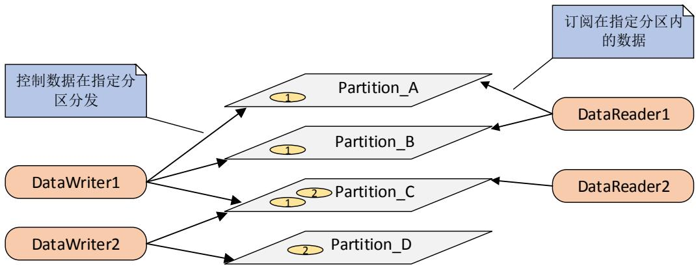
>
> **图示信息：**
>
> - A data flow diagram showing two DataWriters (DataWriter1, DataWriter2) publishing to four partitions (Partition_A, Partition_B, Partition_C, Partition_D), and two DataReaders (DataReader1, DataReader2) subscribing to subsets of those partitions, with annotations indicating control/data distribution and subscription scope.

图 10-1 PARTITION Qos 控制数据可见性

Publisher 和 Subscriber 总是属于一个分区。默认情况下 Publisher 和 Subscriber 属于一个空

的分区，这时 DataWriter 和 DataReader 能够匹配通信。

 分区匹配规则

DataWriter 与 DataReader 之间实现匹配通信需要遵循以下要求：

- DataWriter 和 DataReader 处于同一个域中。

- DataWriter 和 DataReader 关联相同的 Topic。

- DataWriter 和 DataReader 之间的 QoS 不存在冲突。

- DataWriter 和 DataReader 及其附属的工厂对象没有调用 ignore()方法忽略对端。

- DataWriter 和 DataReader 所属的 Publisher 和 Subscriber 至少有一个分区名匹配。

最后一个条件反应了 PartitionQosPolicy 介绍的数据可见性。分区名通过比较字符串进行匹

配，分区名是区分大小写的。

分区不匹配不会被认为是不匹配的 Qos，不会改变 INCOMPATIBLE_QOS 状态。

 分区名匹配模式

用户可以添加正则表达式到 PartitionQosPolicy 中。正则表达式不会定义 Publisher 或

Subscriber 属于哪一组分区，它在匹配过程中被用于检查远端实体的分区名是否与该正则表达

式匹配。因此，Publisher 的 PartitionQosPolicy 中的正则表达式与 Subscriber 的 PartitionQosPolicy

中的正则表达式不匹配。正则表达式只与固定的分区名匹配,因此固定的分区名不会包含任何用

于定义正则表达式的预留字符，例如“*”、“.”、“+”等。

如果 DataWriter 和 DataReader 所属的 Publisher 和 Subscriber 的分区设置如下时，DataWriter

和 DataReader 被认为属于同一分区：

- 至少一个相同的固定分区名

- 一个实体的正则表达式与另一个实体的固定分区名匹配

 正则表达式

Partition QosPolicy 中的字符串可以用正则表达式（Regular Expression）来表示。其中可以

使用的通配符定义如下：

- ？：表示任意字符，

例：“a?c”匹配“abc”，“???de”匹配”abcde”。

- * ：表示任意数量的任意字符，

例：“ab*”匹配”abcd”，“a*d”匹配“abcd”。

- [abc]：表示匹配 a、b、c 中任意一个字符。

例：“hello[ABC]”与“helloA”匹配。

- [^abc]：表示匹配除了 a、b、c 以外的任意一个字符。

例：“hello[^ABC]”与“helloA”不匹配，与“helloD”匹配。

注意： “^“字符只有在“[……]“结构中的首位才有当前语意。

- [a-c]：表示匹配 a 字符开始到 c 字符结束中的任意一个字符（闭区间）。

例：“hello[A-C]”与“helloB”匹配。

- [a-c.eh]：‘.’字符表示连接两个区间，

例：“hello[A-C.EH]”与“helloB”、“helloE”都匹配。

 QoS 属性

该 QoS 在使能后可以修改。

该 QoS 不要求兼容性。尽管只有在分区名匹配的时候 DataWriter 和 DataReader 才能够匹配

通信。

 相关 QoS

无相关 QoS。

### 10.18. PresentationQosPolicy

表 10-18 PresentationQosPolicy 的属性

| 可变性 | 兼容性(RxO) | 关联实体 |
| --- | --- | --- |
| NO | YES | Publisher、Subscriber |
| 类型 | 变量名 | 说明 |
| DDS_Present | access_scope | 控制coherent_access、ordered_access的作用范围。 |
| ation-QosPoli<br>cy-AccessCco<br>pe-Kind |  |  |
| DDS_Boolean | coherent_access | 控制DDS是否支持连续提交数据。 |
| DDS_Boolean | ordered_access | 控制DDS是否保存数据的顺序。 |

通常情况下 DataReader 会以 DataWriter 发送的顺序接收数据。接收应用在收到期望的数据时会

立即将数据提交给 DataReader。

在一些情况下，用户可能希望同一个主题下的一组数据在组中的所有数据到达接收应用后一起

被提交给 DataReader。用户也可能希望数据被以与接收时不同的顺序被提交。特别是有 key 的数据，

用户可能希望 DDS 按照实例的顺序提交数据。

PresentationQosPolicy 允许用户指定不同的描述（presentation）范围，如一个实例、一个主题

下的不同实例、甚至是一个 publisher 下的不同主题（当前不支持）。该 QoS 控制范围内的一组数据

是否被同时提交或是当每个数据到达时被提交。

 QoS 成员

- coherent_access

一个“连续集合”是一组必须被一起提交的数据样本，在这样的一种方式中，在接收

端它们被解读为一个一致的集合，也就是说接收者只会在集合中所有的数据都到达订阅

端后才能够访问数据。

连续性使发布程序能够改变几个数据实例的值，并使这些改变被 DataReader 以原子

的方式（作为一个连续的集合）看到。

设置”coherent_access”为”true”只有在DataWriter和DataReader设置为可靠通信时才

有效。不可靠的 DataReader 永远不会收到属于一组连续数据中的数据。

发送程序使用 Publisher 的 begin_coherent_changes()和 end_coherent_changes()发送

一组连续的数据样本。

如果”coherent_access”是”true”，那么”access_scope”控制连续发送的最大范围，如下：

 如果 ”access_scope” 设置为 ”INSTANCE_PRESENTATION_QOS” ， 使用

begin_coherent_changes()和 end_coherent_changes()不会影响接收端如何接收数据。

这是因为范围被限制在每个实例，每个实例的修改被认为是独立的，因此这些数据

不能使用连续修改打包。

 如果”access_scope”设置为”TOPIC_PRESENTATION_QOS”，那么连续修改会被发

送到每个远端的 DataReader。DataWriter 下不同实例的修改会被作为一个连续的集

合发送，但是不会与其他 DataWriter 下的实例打包发送。

- ordered _access

对于没有 key 的主题，来自单一 DataWriter 的数据样本会被以发送时的顺序保存在

DataReader 的队列中。对于有 key 的主题，单一的 DataWriter 可能创建多个实例、修改实

例的值或删除实例，每次一个数据样本（包括创建和删除事件产生的假的或变化样本）会

被发送并且保存在 DataReader 的队列中。

默认情况下，实例被作为轻量级的主题对待，因为属于一个特殊实例的数据样本被以

DataWriter 发送的顺序存储。其中包含描述实例创建和删除事件的样本。

因为同一主题下不同实例的样本都保存在 DataReader 的同一个队列中，用户可能希望

控制数据样本是否以 DataWriter 发送的顺序保存而不是以所属的实例排序。默认情况下

Subscriber 不会对不同实例下的数据排序。数据包可能在网络上会出现乱序，用户不能知

道不同实例间样本的发送顺序，尽管他们由同一个 DataWriter 生成。

例如，如果一个 DataWriter 注册 3 个实例，那么会产生 3 个数据包声明实例的创建，

这3个变化数据样本保存在DataReader的队列中。默认情况如果这些数据没有按顺序提交，

Subscriber 不会对这些样本排序。用户可能会在看到第一个创建的实例之前看到第三个创

建的实例。

用户可以设置该 QoS，那么DataReader会以 DataWriter 下不同实例的所有事件（创建、

修改、删除）发生时的顺序看到它们。注意该 QoS 只支持来自同一个 DataWriter 的数据。

如果希望控制 DDS 如何对来自同一个主题不同 DataWriter 的数据排序请参见 Destination

```text
QosPolicy(10.5 节)。
如果”ordered_acces”设置为”true”，那么”access_scope”控制排序的范围，如下：
```

 如果”access_scope”设置为”INSTANCE_PRESENTATION_QOS”，DataWriter 发送的数

据样本的相对顺序时基于每个实例的。如果两个样本属于不同的实例，那么它们被提

交的顺序可能会也可能不会与改变发生时的顺序相同。

 如果”access_scope”设置为”TOPIC_PRESENTATION_QOS”，DataWriter 发送的所有实

例下的所有数据的顺序会被保存。

存储在 DataReader 中的数据使用 DataReader 的 read()或 take()操作获取。应用没有必要按

照数据存储在队列中的顺序获取它们。应用实际如何获取从 DataReader 数据最终是由用户代码

决定的。

 QoS 属性

该 QoS 在使能后不能修改。

该 QoS 要求兼容性，需要满足以下匹配规则：

DataWriter 的 ordered_access DataReader 的 ordered_access

DataWriter 的 coherent_access DataReader 的 coherent_access

其中 false<true。

DataWriter 的access_scope DataReader 的access_scope

其中:

INSTANCE_PRESENTATION_QOS< TOPIC_PRESENTATION_QOS<GROUP_PRESENTATION_QOS

（其中 GROUP_PRESENTATION_QOS 暂未实现）

 相关 QoS

DestinationOrderQosPolicy(10.5 节)。

### 10.19. DataWriterProtocolQosPolicy(DDS Extension)

表 10-19 DataWriterProtocolQosPolicy 的属性

| 可变性 | 兼容性(RxO) | 关联实体 |
| --- | --- | --- |
| NO | NULL | DataWriter |
| 类型 | 变量名 | 描述 |
| DDS_Boolean | push_on_write | 当使用 TCP 传输时，用于控制数<br>据阐述 SOCKET 的 TCP_NODELAY<br>选项，设置为 true 时，底层将设<br>置该选项。 |
| DDS_RtpsReliableWriterProtoc<br>ol | rtps_reliable_writer | 可靠性协议 |

DDS 提供了应用间使用 DDS 通信的数据包的协议标准。该 QoS 提供了用户控制协议中可配置部

分的方法，包括协议中的可靠数据发送机制。

 QoS 成员

RtpsReliableWriterProtocol 类包含以下成员：

- heartbeat_period

类型为 DDS_Duration_t，决定 DataWriter 发送心跳包的周期。当 DataWriter 为 Reliable

时，DataWriter 会定期发送 heartbeat 用于确认 DataReader 是否收到了数据。当 DataReader

越快收到一个 heartbeat，它就能越快的发送一个 NACK（回复没有收到数据），并且

DataWriter 可以更快的重新发送数据。

- heartbeats_per_max_samples

类型为 DDS_Long ， DDS 保证会在 ”max_samples” （ 由 HistoryQosPolicy 和

ResoureceLimitsQosPolicy 决定）包内发送”heartbeats_per_max_samples”包心跳消息。该值

应小于等于”max_samples”。

- fastheartbeat_period

当 DataWriter 为 Reliable 或者 Keep_all 时，当存在未反馈的样本且正在等待时间时，

底层将以该时间周期发送 heartbeat。

- max_heartbeat_retries

暂时无用

 QoS 属性

该 QoS 在使能后不能修改。

该 QoS 只作用于 DataWriter，不要求兼容性。

 相关 QoS

```text
HistoryQosPolicy(10.10 节)。
ReliabilityQosPolicy(10.25 节)。
```

### 10.20. PublishModeQosPolicy(DDS Extension)

表 10-20 PublishModeQosPolicy 的属性

| 可变性 | 兼容性(RxO) | 关联实体 |
| --- | --- | --- |
| NO | NULL | DataWriter |
| 类型 | 变量名 | 描述 |
| DDS_PublishModeQosPolicyKi<br>nd | kind | 决定DataWriter的发送方式 |

该 QoS 决定 DataWriter 的发送模式是同步还是异步。

发送模式控制数据是否在用户线程调用 write()时被同步发送，或是被 ZRDDS 内部的线程异步发

送。

每个 Publisher 会创建一个异步发送线程（在 AsynchronousPublisherQosPolicy 中设置）为所有属

于该 Publisher 的异步发送 DataWriter 提供服务。

ZRDDS 发送数据最快的方法是用户线程通过调用 ZRDDS 代码在用户线程发送。然而用户应用有

时会希望 ZRDDS 内部的线程代替用户线程来发送数据。例如：当可靠地发送较大的数据时会使用异

步线程（见 10.1AsynchronousPublisherQosPolicy (DDS Extension)）。

 QoS 成员

PUBLISHER_MODE 的 kind 成员有以下两种取值：

- DDS_ASYNCHRONOUS_PUBLISH_MODE_QOS

数据会被 DDS 内部线程异步发送。

- DDS_SYNCHRONOUS_PUBLISH_MODE_QOS

数据在用户线程写入时被同步发送。

 异步发送的优势

异步发送可能会增加延迟，但会带来以下好处：

- write()不会调用任何网络操作，因此 write()操作会更快更稳定。这在用户线程执行时

间敏感的代码时非常重要。

- 当用户产生数据的时间较长（如需要进行一些复杂运算）且网络调用过程较慢（如处

于低速网络或者存在较多接收端）时，可以充分利用产生数据的时间进行网络调用，将产

生数据和网络调用的过程并行化，减少总时间消耗。

 QoS 属性

该 QoS 在使能后不能修改。

该 QoS 只作用于 DataWriter，所以不存在兼容性。

 相关 QoS

```text
AsynchronousPublisherQosPolicy(10.1 节)。
HistoryQosPolicy(10.10 节)。
```

### 10.21. RapidIOConfigQosPolicy

表 10-21 RapidIOConfigQosPolicy 的属性

|  | 可变性 |  |  | 兼容性(RxO) |  |  | 关联实体 |  |
| --- | --- | --- | --- | --- | --- | --- | --- | --- |
| NO |  |  | NULL |  |  | DomainParticipantFactory |  |  |
|  | 类型 |  |  | 变量名 |  |  | 描述 |  |
| DDS_RapidIOControllerConfig<br>Seq |  |  | controllers_config |  |  | 配置RapidIO控制器属性 |  |  |

RapidIOController 结构如下。

struct RapidIOControllerConfig

```text
{
DDS_Long rapidio_controller;
DDS_ULong rapidio_address;
DDS_ULong receive_window_base_address;
DDS_Long receive_window_size;
DDS_Long receive_subwindow_size;
};
```

controllers_config 可以包含若干 RapidIOControllerConfig 结构。

RapidIOControllerConfig 结构各成员含义如下：

- rapidio_controller

表明该项配置针对的控制器编号。

- rapidio_address

表明该控制器映射的 RapidIO 设备地址。

- receive_window_base_address

表明该 RapidIO 控制器映射的接收内存地址。

- receive_window_size

表明该 RapidIO 控制器映射的接收内存总大小。

- receive_subwindow_size

表明该 RapidIO 控制器划分的接收子窗口大小。

该 QoS 策略针对 RapidIO 控制器提供配置选项。使得 DDS 的使用者可以在应用程序中对 RapidIO

的参数进行配置。由于 RapidIO 可能存在多种实现方式，因此此处仅提供通用的基本配置。

为了提高 RapidIO 接收数据的并行度，对 RapidIO 控制器映射的接收内存空间进行了划分，划分

依据为 ”receive_subwindow_size” ， 即将该控制器映射的总内存大小划分为若

干”receive_subwindow_size”大小的子窗口，针对每个 RapidIO 通信端分配一个接收子窗口。当 RapidIO

通信端需要发送数据时，只会往分配给自身的子窗口中发送数据，这样就允许若干 RapidIO 通信端

向同一个 RapidIO 通信端发送数据而不需要考虑数据冲突的问题。

 QoS 属性

该 QoS 在设置后不能修改。

该 QoS 不要求兼容性。

 相关 QoS

无。

### 10.22. RapidIOControllerQosPolicy

表 10-22RapidIOControllerQosPolicy 的属性

|  | 可变性 |  |  | 兼容性(RxO) |  |  | 关联实体 |  |
| --- | --- | --- | --- | --- | --- | --- | --- | --- |
| NO |  |  | NULL |  |  | DomainParticipant |  |  |
|  | 类型 |  |  | 变量名 |  |  | 描述 |  |
| DDS_Long |  |  | controller_id |  |  | 配置DomainParticipant使用的RapidIO控制器 |  |  |

该项 Qos 配置允许用户选择 DomainParticipant 使用哪个 RapidIO 控制器。控制器通过控制器号

来标识。

 QoS 属性

该 QoS 在实体使能后不能修改。

该 QoS 不要求兼容性。

 相关 QoS

无。

### 10.23. ReaderDataLifecycleQosPolicy

表 10-23 ReaderDataLifecycleQosPolicy 的属性

|  | 可变性 |  |  | 兼容性(RxO) |  |  | 关联实体 |  |
| --- | --- | --- | --- | --- | --- | --- | --- | --- |
| YES |  |  | NULL |  |  | DataReader |  |  |
|  | 类型 |  |  | 变量名 |  |  | 描述 |  |
| DDS_Duratio<br>n_t |  |  | autopurge_nowriter_samples_delay |  |  | 数据样本状态改变后 DataReader<br>维护该样本的最大时间长度 |  |  |
| DDS_Duratio<br>n_t |  |  | autopurge_disposed_samples_delay |  |  |  |  |  |
| DDS_Boolean |  |  | purge_instance_with_not_read_sam<br>ples |  |  | 是否清理存在未读样本的数据实<br>例。 |  |  |

该 QoS 控制 DataReader 关注它所管理的数据实例生命周期行为。

当 DataReader 收到数据时，它被存储在 DataReader 的接收队列。用户应用可能会从队列取出

数据或将它留在队列中。该 QoS 控制 ZRDDS 在发现一个数据没有存活的 DataWriter 时，是否会自动

将数据从接收队列移除（因此用户程序无法再获取到该数据）。

DataWriter 也可以调用 dispose()，通知 DataReader 哪个数据不再存活。该 QoS 也控制 ZRDDS 是

否会移除被销毁的数据。

对于有 key 的主题，从接收队列移除数据样本时是以每个实例为基础的。因此当 ZRDDS 发现一

个实例没有存活的 DataWriter 时，这个实例下的所有数据可以被移除。DataWriter 也可能销毁每个

实例的数据，只有被销毁的实例的数据会被移除。

该 QoS 帮助清理没有取出的不再存活的数据，回收 DataReader 的资源。实例不再存活后指定的

时间内没有被取走的数据会被清理，如同被取走的样本一样。

DataReader 在内部维持没有被应用取走的样本，遵守其他 Qos（如 HistoryQosPolicy 和

ResourceLimitsQosPolicy 的）的限制。DataReader 也维护实例的一致性、视图状态和实例状态信息，

即使数据已经被取走。当之后的数据到达时，这些数据也将被用于正确地计算状态。

在正常的情况下，当且仅当与这些实例相关的 DataWriter 不存在且这些实例下的所有样本都已

被取走时，DataReder 将会回收这些实例所占有的所有资源。DataReader 取出的最后一个样本的实

例状态是”DDS_NOT_ALIVE_NO_WRITERS_INSTANCE_STATE”或”DDS_NOT_ALIVE_DISPOSED_INSTANCE_

STATE”（取决于最后拥有该实例的 DataWriter 是否销毁了该实例）。如果使用该 QoS 的默认值，应用

没有取出这些数据会产生一些问题。没有取出的数据会阻止 DataReader 回收资源并且永远保存在

DataReader 中。

 QoS 成员

“autopurge_nowriter_samples_delay” 定义 DataReader 在一个实例的实例状态变为

NOT_ALIVE_NO_WRITERS_INSTANCE 后维护信息的最大持续时间。超过这个时间后，DataReader

会清除该实例所有的内部信息，没有取出的样本也会丢失。默认值为”INFINITE_DURATION”。

“autopurge_disposed_samples_delay” 定义 DataReader 在一个实例的实例状态变为

NOT_ALIVE_DISPOSED_INSTANCE 后维护信息的最大持续时间。超过这个时间后，DataReader 会

清除该实例所有的内部信息，没有取出的样本也会丢失。默认值为”INFINITE_DURATION”。

“purge_instance_with_not_read_samples”是否清理存在未读样本的数据实例。当该值为false，

在最大时间长度到达并尝试清理数据实例时，如果仍然存在未读样本，则暂不清除。直至用户

read/take 并 return_loan 后才释放实例空间。默认为 true。

 QoS 属性

该 QoS 在使能后可以修改。

该 QoS 只作用于 DataReader，所以不存在兼容性。

 相关 QoS

```text
HistoryQosPolicy(10.10 节)。
LivelinessQosPolicy(10.12 节)。
OwnershipQosPolicy(10.15 节)。
ResourceLimitsQosPolicy(10.26 节)。
WriterDataLifecycleQosPolicy(10.32 节)。
```

### 10.24. ReceiverThreadConfigQosPolicy(DDS Extension)

表 10-24 ReceiverThreadConfigQosPolicy 的属性

| 可变性 | 兼容性(RxO) | 关联实体 |
| --- | --- | --- |
| NO | NULL | DomainParticipant |
| 类型 | 变量名 | 描述 |
| DDS_ReceiverThreadKind | kind | 接收线程的类型 |
| DDS_Long | receive_buffer_length | 配置接收缓冲区 |

该 QoS 用于配置 DomainParticipant 的接收线程。

 QoS 成员

该 QoS 的”kind”成员有以下两种取值：

- DDS_THREAD_PER_PORT

每个端口一个接收线程，DomainParticipant 中配置的每个端口均使用单独的线程监

听并处理，每个 DomainParticipant 需要监听三类端口（接收内置组播、接收内置单播和

接收用户数据），每个端口创建一个线程接收。

- DDS_THREAD_PER_KIND

每个类型一个接收线程，内置的使用一个线程，用户创建的使用一个线程，因此 DDS

只用创建两个监听端口的线程。

- DDS_THREAD_ALL_PORTS

所有端口使用一个线程。

该 QoS 的“receive_buffer_length”用于配置 DomainParticipant 的接收线程使用的缓冲区大

小。默认为 0，表示接收缓存区大小由使用协议的最大分片大小（见 23.2.1.1）确定，大于 0

时则由该成员控制所有协议下的接收缓冲区大小。

 QoS 属性

该 QoS 在实体使能后不能修改。

该 QoS 作用于 DomainParticipant，不要求兼容性。

 相关 QoS

无相关 QoS。

### 10.25. ReliabilityQosPolicy

表 10-25 ReliabilityQosPolicy 的属性

| 可变性 | 兼容性(RxO) | 关联实体 |
| --- | --- | --- |
| NO | YES | Topic、DataWriter、DataReader |
| 类型 | 变量名 | 描述 |
| DDS_ReliabilityQosPolicy<br>Kind | kind | 数据传输可靠性的类型。 |
| DDS_Duration_t | max_blocking_time | write()函数最长的阻塞时间。 |

该 QoS 决定 DataWriter 发布的数据是否会被可靠地发送的匹配的 DataReader。可靠通信在第12

章中进行了详细讨论。

用户可以配置 DataWriter 和 DataReader 之间链接的可靠性 。 使用

“DDS_BEST_EFFORT_RELIABILITY_QOS”配置的链接意味着 DDS 不会使用资源监视或保证 DataWriter

发送的数据被 DataReader 接收。

对于一些情况，例如周期性地更新显示界面，“DDS_BEST_EFFORT_RELIABILITY_QOS”通信是足够

使用的。这是一个主题下 DataReader 从 DataWriter 获取最新数据的最快、最有效率、最不占资源的

方法。但是不保证发送的数据会被接收。数据可能因为很多因素丢失，包括数据在物理传输（如无

线通信甚至是以太网）时丢失。接收到的乱序数据包也会被丢弃，并产生一个 SAMPLE_LOST 状态。

无论如何用户可能会希望一个主题下 DataWriter 发送的所有的数据都绝对可靠地被 DataReader

接收。这意味着 ZRDDS 必须检查数据是否被接收，并且重新发送丢失数据的副本直到 DataReader

收到该数据。

ReliabilityQosPolicy 只是一个简单的控制 DataWriter 和 DataReader 是否可靠通信的开关。可靠性

的级别由 HistoryQosPolicy 和 ResourceLimitsQosPolicy 控制。

 QoS 成员

ReliabilityQosPolicy 的”kind”成员有以下两种取值：

- DDS_BEST_EFFORT_RELIABILITY_QOS

数据只会被发送一次并且允许丢包。没有花费时间或资源追踪数据是否被接收。这种

情况使用最少的资源，但是可能造成丢包。这种设置最适合周期性的数据。DataReader 的

默认值。

- DDS_RELIABLE_RELIABILITY_QOS

ZRDDS会将样本可靠地发送到DataReader的缓冲区直到它们被DataReader确认接收，

并且会重发任何在传输过程中丢失的数据。使用的额外资源由 HistoryQosPolicy 和

ResourceLimitsQosPolicy 配置。ZRDDS 会发送额外的数据包（heartbeat）用于查询和回复

DataReader 接收样本的情况。这种设置在需要保证数据发送时是更好的选择，例如发送事

件或命令。DataWriter 的默认值。

 作用

当 DataWriter 可靠地发送数据，HistoryQosPolicy 和 ResourceLimitsQosPolicy 决定能够存储

多少数据等待 DataReader 的回复。一个被可靠发送的样本会进入 DataWriter 的发送队列等待

DataReader 收到该数据后的回复。DataWriter 的发送队列允许存储多少同一实例下的样本由

HistoryQosPolicy 的 kind 成员和 RESOURCE_LIMITS 的 max_samples_per_instance 和 max_samples

成员决定。

如果 HistoryQosPolicy 的成员“kind”是”DDS_KEEP_LAST_HISTORY_QOS”，那么 DataWriter 的

发送队列中每个实例可以保存”depth”（HistoryQosPolicy 的成员）数量的样本。当队列中一个实

例下没有被回复的样本数量达到”depth”后，DataWriter 写该实例下的新数据会覆盖队列中该实

例最旧的样本。这意味着没有收到回复的样本可能会被覆盖并因此产生丢包情况。尽管

ReliabilityQosPolicy 的成员”kind”是”DDS_RELIABLE_RELIABILITY_QOS”，但是如果 HistoryQosPolicy

的成员“kind”是”DDS_KEEP_LAST_HISTORY_QOS”，DataWriter 发送的数据有可能不会被发送到

DataReader。能够保证的是 DataWriter 停止发送后，最后的 n（HistoryQosPolicy 成员“depth”的

值）包数据会被可靠地发送。

如果 HistoryQosPolicy 的成员“kind”是”DDS_KEEP_ALL_HISTORY_QOS”，那么当发送队列被未

回复的样本填满时（无论是一个实例下未回复的样本数量达到 ResourceLimitsQosPolicy

的”max_samples_per_instance”值或是所有未回复的样本数量达到 ResourceLimitsQosPolicy

的”max_samples”指定的发送队列大小），DataWriter 的下一次 write()操作会被阻塞直到队列中

的一个样本被 DataReader 回复可以被覆盖或是达到 ReliablityQosPolicy 的”max_blocking_period”

规定的超时时间。

如果在达到 ”max_blocking_time” 后队列中仍然没有空间 ， write() 会返回错误代

码”DDS_RETCODE_TIMEOUT”。（DataReader 不支持”max_blocking_time”）

因此对于严格的可靠性（为了保证DataWriter发送所有的数据样本都被DataReader接收），

DataWriter 和 DataReader 都必须使用”DDS_RELIABLE_RELIABILITY_QOS”和”DDS_KEEP_ALL_

HISTORY_QOS”。

 QoS 属性

该 QoS 在使能后不能修改。

该 QoS 要求兼容性，需要满足以下匹配规则：

> 
>
> **图示信息：**
>
> - A line of text stating a reliability kind constraint: 'DataWriter 的 reliability 的 kind ≥ DataReader 的 reliability 的 kind'

其中 DDS_RELIABLE_RELIABILITY_QOS>DDS_BEST_EFFORT_RELIABILITY_QOS

 相关 QoS

```text
HistoryQosPolicy(10.10 节)。
ResourceLimitsQosPolicy(10.26 节)。
```

### 10.26. ResourceLimitsQosPolicy

表 10-2610-27 ResourceLimitsQosPolicy 的属性

| 可变性 | 兼容性(RxO) | 关联实体 |
| --- | --- | --- |
| NO | NO | Topic、DataWriter、DataReader |
| 类型 | 变量名 | 描述 |
| DDS_Long | max_samples | DW/DR所允许保存样本的最大数量 |
| DDS_Long | max_instances | DW/DR所能管理实例的最大数量 |
| DDS_Long | max_samples_per_instance | DW/DR管理的每个实例下样本的最大数量 |
| DDS_Long | initial_samples | 进行预分配的样本的初始值 |
| DDS_Long | max_prealloc_sample_size | 单个样本预分配的空间长度 |

对于可靠性传输，当 HistoryQosPolicy 的成员“kind”设置为”DDS_KEEP_ALL_HISTORY_QOS”时该

QoS 决定了实际的队列最大长度。

一般情况该 QoS 用于限制 DDS 可以分配的系统内存的大小。对于嵌入式的实时系统和注重安全

的系统，需要提前决定使用内存的最大值。动态的分配内存会在实时路径上引入不确定的延迟。

设置该 QoS 后实体在初始化后不会再动态的申请内存空间。

 QoS 成员

“max_samples”指定 ZRDDS 可以为一个 DataWriter 或 DataReader 存储的最大样本数量。这

是一个物理限制，决定发送或接收队列申请的内存。默认值为”LENGTH_UNLIMITED”。

“max_instances”指定一个 DataWriter 或 DataReader 能够管理的最大实例数。默认值

为”LENGTH_UNLIMITED”。

“max_samples_per_instance”指定 ZRDDS 为 DataWriter 或 DataReader 下每个实例存储的最

大样本数量 。 默认值为 ”LENGTH_UNLIMITED” 。 如果使用没有 key 的主题 ， 那

么 ”max_samples_per_instance” 必须等于 ”max_samples” 。 对于有 key 的主

题，”max_samples_per_instance”代表 DataWriter 或 DataReader 允许存储同一实例数据的最大数

量。这是一个逻辑限制，物理限制由”max_samples”决定。

因为理论上实例的数量可能非常大（由”max_instances”决定），用户可能不希望 ZRDDS 为

每个可能的实例存储最大数量的样本（”max_samples_per_instance” * “max_instances”）分配总

内存，因为普通操作中应用中的实体永远没有必要拥有那么多数据。

所以在一个实例下数据的数量到达 ”max_samples_per_instance” 前有可能已经达

到”max_samples”的物理限制。但是DDS要能够为至少一个实例存储”max_samples_per_instance”

包数据，因此”max_samples_per_instance”必须小于等于”max_samples”。

当达到物理限制或逻辑限制时，DataWriter 再发送新数据或 DataReader 再接收新数据时

ZRDDS 会如何处理是由 HistoryQosPolicy 决定。这也与是否是可靠通信有关。

“initial_samples”指定样本的初始值，即在开始时，为多少个样本分配空间。”Initial _sample”

的值必须小于等于”max_samples”的值。

“max_prealloc_sample_size”指定一个样本序列化前，预分配的空间的最大值。当实际所需

的空间的大小超过了最大值，将不再为其分配更大的空间。

 QoS 属性

该 QoS 在使能后不能修改。

该 QoS 不要求兼容性。

 相关 QoS

```text
HistoryQosPolicy(10.10 节)。
ReliabilityQosPolicy(10.25 节)。
```

### 10.27. ThreadCoreAffinityQosPolicy(DDS Extension)

表 10-28ThreadCoreAffinityQosPolicy 的属性

| 可变性 | 兼容性(RxO) | 关联实体 |
| --- | --- | --- |
| NO | NULL | DomainParticipant |
| 类型 | 变量名 | 描述 |
| DDS_ULong | receive_thread_default_affinity_mask | 接收线程默认使用的CPU |
| DDS_ULong | user_data_receive_thread_affinity_mask | 接收用户数据的线程使用<br>的CPU |
| DDS_ULong | builtin_data_receive_thread_affinity_mask | 接收内置消息的线程使用<br>的CPU |
| DDS_ULong | timer_thread_affinity_mask | 计时器线程使用的CPU |
| DDS_ULong | async_send_thread_affinity_mask | 异步发送线程使用的CPU |

该 QoS 用于配置 DDS 线程的依赖性，可以指定线程运行在哪个 CPU 上。

 QoS 成员

“receive_thread_default_affinity_mask”：如果用户没有指定某类线程使用的 CPU，那么这些

线程都会使用该值指定的 CPU。

其他成员分别指定一类线程的使用的 CPU。

该 QoS 的成员为位掩码，每一位对应 CPU 的一个核。如果指定多个核时，ZRDDS 会随机选

择一个。

 QoS 属性

该 QoS 在实体使能后不能修改。

该 QoS 作用于 DomainParticipant，不要求兼容性。

 相关 QoS

无相关 QoS。

### 10.28. TimeBasedFilterQosPolicy

表 10-29 TimeBasedFilterQosPolicy 的属性

|  | 可变性 |  |  | 兼容性(RxO) |  |  | 关联实体 |  |
| --- | --- | --- | --- | --- | --- | --- | --- | --- |
| YES |  |  | NULL |  |  | DataReader |  |  |
|  | 类型 |  |  | 变量名 |  |  | 描述 |  |
| DDS_Duration_t |  |  | minimum_separation |  |  | 同一实例样本的最小时间间隔 |  |  |

该QoS允许用户设置一个周期，在这个周期内DataReader不会收到同一个实例下超过一包数据，

不管 DataWriter 发送同一实例下的数据有多快。

该 QoS 可以通过只发送需要的数量的数据到不同的 DataReader 来减少资源（CPU 和网络带宽）

的使用。

DataWriter 可能发送速率大于 DataReader 的需要。例如一个传感器数据的 DataReader 用于在图

形界面应用中显示用户操作，DataReader 接收数据更新的速率不需要比用户能够察觉到的数据变化

速率快。

使用该 QoS，不同的 DataReader 可以设置自己的时间过滤器，所以发送速率快于 DataReader

设置的周期的数据会被 DDS 丢弃并且不会被发送到 DataReader。注意所有过滤器在接收端生效。

 QoS 成员

“minimum_separation”指定 DataReader 的过滤周期，在该周期内 DataReader 只会收到一包

数据。默认值为 0 表示过滤器不生效。

如图10-2 所示，设置 DataReader 的”minimum_separation”大于 DeadlineQosPolicy 的”period”

是矛盾的。发送到 DataReader 的数据可以被 TimeBasedFilterQosPolicy 过滤。当一个数据样本到

达时，DDS 会接收该数据但是会将同一个实例下之后在”minimum_separation”时间内到达的数

据丢弃。在经过”minimum_separation”后，新的样本到达会被接收并存储到队列中，计时器再

次开始计时 。 如果在 DeadlineQosPolicy 规定的时间内没有样本到达 ，

REQUESTED_DEADLINE_MISSED 状态会改变。

> 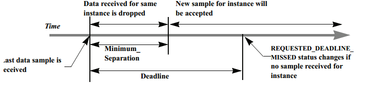
>
> **图示信息：**
>
> - A timeline diagram illustrating the behavior of TimeBasedFilterQosPolicy with time progressing left to right, showing sample reception, dropping, acceptance, and deadline conditions.

图 10-2 DataReader 接收数据

 作用

对于”DDS_BEST_EFFORT_RELIABILITY_QOS”数据发送，如果数据类型是没有 key 的并且

DataWriter 拥有无限的 LivelinessQosPolicy 的 “lease_duration” ， ZRDDS 只会按照

TimeBasedFilterQosPolicy 的要求将数据发送给 DataReader，无论 DataWriter 调用 write()的速率

有多快。

当 DataWriter 为”DDS_RELIABLE_RELIABILITY_QOS“（ReliabilityQosPolicy 的成员”kind“的值）

时，在接收端只有通过 TimeBasedFilterQosPolicy 要求的数据会被保存在 DataReader 的接收队列

中，额外的数据虽然会被接收但是会被丢弃。注意过滤只应用于“alive”的数据（没有被销毁

或注销），因此注销或销毁产生的状态数据不会被过滤。

 QoS 属性

该 QoS 在使能后可以修改。

该 QoS 存在兼容性，其兼容性要求 DeadlineQoSPolicy：：period minimum_separation

 相关 QoS

```text
DeadlineQosPolicy(10.4 节)。
ReliabilityQosPolicy(10.25 节)。
```

### 10.29. TopicDataQosPolicy

表 10-30 TopicDataQosPolicy 的属性

|  | 可变性 |  |  | 兼容性(RxO) |  |  | 关联实体 |  |
| --- | --- | --- | --- | --- | --- | --- | --- | --- |
| YES |  |  | NULL |  |  | Topic |  |  |
|  | 类型 |  |  | 变量名 |  |  | 描述 |  |
| DDS_CharSeq |  |  | value |  |  | Topic所附加的额外信息 |  |  |

该 QoS 提供一个可以用于存储 Topic 额外信息的空间。这个信息在发现阶段在应用间使用内置

的主题传递。如何使用这个信息由用户决定，一般用于应用间的识别、鉴定、授权和加密。

TopicDataQosPolicy 的值在第一次被发现时会发送给远端的应用，在修改 TopicDataQosPolicy 的

值后调用 Topic 的 set_qos()同样也会被发送。当前 TopicDataQosPolicy 只有在发送 DataWriter 和

DataReader 消息时传播。因此用户需要通过 PublicationBuiltinTopicData 或 SubscriptionBuiltinTopicData

获取 TopicDataQosPolicy 的值。

该 QoS 与 GroupDataQosPolicy(10.9 节)和 UserDataQosPolicy(10.31 节)相似。

 QoS 成员

该 QoS 只有一个”value”成员。”value”是一个 sequence 类型（见 Sequence4.1.1 节），默认

长度为 0，长度和内容由用户设置，最大长度为 255 个字节。

 QoS 属性

该 QoS 在实体使能后可以修改。

该 QoS 不要求兼容性。

 相关 QoS

GroupDataQosPolicy（10.9 节）

UserDataQosPolicy（10.31 节）

### 10.30. TransportConfigQosPolicy

表 10-31TransportConfigQosPolicy 的属性

| 可变性 | 兼容性(RxO) | 关联实体 |
| --- | --- | --- |
| NO | NULL | DomainParticipant、 DataReader 、<br>DataWriter |
| 类型 | 变量名 | 描述 |
| DDS_StringSeq | addresses | 配置地址的字符串列表 |

该 QoS 用于配置发送 DomainParticipant 消息的目的地址，可以用于发现不同域的

DomainParticipant。

 QoS 成员

“address”为地址的字符串列表。默认值长度为 1，包含一个组播地址。用户可以将地址字

符串添加到列表中，DDS 会将 DomainParticipant 的信息发送到列表中的地址。

字符串格式如下：

“type://address//port”，具体请参见

表 10-32ZRDDS 当前可配置的地址方式参数

| 类型 |  |  | type |  |  | address |  |  | port |  |  | 举例 |  |
| --- | --- | --- | --- | --- | --- | --- | --- | --- | --- | --- | --- | --- | --- |
| UDP |  | udpv4 |  |  | default: RTPS 中默认<br>的地址，即本机所有<br>有效的IP地址；形如<br>a.b.c.d的点十制IPv4<br>地址 |  |  | 0:表示通过域<br>以及域参与<br>者 ID 计算出<br>来的端口；1 -<br>65535 指定端<br>口 |  |  | udpv4://defa<br>定端口 |  |  |
| TCP |  | tcpv4 |  |  | default: RTPS 中默认<br>的地址，即本机所有<br>有效的IP地址；形如<br>a.b.c.d的点十制IPv4<br>地址 |  |  | 0:表示通过域<br>以及域参与<br>者 ID 计算出<br>来的端口；1 -<br>65535 指定端<br>口 |  |  | tcpv4://defaul<br>t//0，表示使<br>用默认地址，<br>但使用TCP代<br>替默认的<br>UDP ，<br>tcpv4://192.1<br>68.150.54//7<br>655，指定端<br>口 |  |  |
| TCP 多<br>核传输<br>(>=2.4.<br>0) |  | tcpv4_cc |  |  | default: RTPS 中默认<br>的地址，即本机所有<br>有效的IP地址；形如<br>a.b.c.d的点十制IPv4<br>地址 |  |  | 0:表示通过域<br>以及域参与<br>者 ID 计算出<br>来的端口；1 -<br>65535 指定端<br>口 |  |  | tcpv4_cc://de<br>fault//0，表示<br>使用默认地<br>址，但使用<br>TCP代替默认<br>的 UDP ，<br>tcpv4://192.1<br>68.150.54//7<br>655，指定端<br>口 |  |  |
| 不运行<br>RTPS<br>的UDP<br>协议 |  | udpv4_raw |  |  | default: RTPS 中默认<br>的地址，即本机所有<br>有效的IP地址；形如<br>a.b.c.d的点十制IPv4<br>地址 |  |  | 0:表示通过域<br>以及域参与<br>者 ID 计算出<br>来的端口；1 -<br>65535 指定端<br>口 |  |  | udpv4_raw://<br>192.168.150.<br>54//7655，指<br>定端口 |  |  |
| 不运行<br>RTPS<br>的 TCP<br>协议 |  | tcpv4_raw |  |  | default: RTPS 中默认<br>的地址，即本机所有<br>有效的IP地址；形如<br>a.b.c.d的点十制IPv4<br>地址 |  |  | 0:表示通过域<br>以及域参与<br>者 ID 计算出<br>来的端口；1 -<br>65535 指定端<br>口 |  |  | tcpv4_raw://1<br>92.168.150.5<br>4//7655，指<br>定端口 |  |  |
| 共享内<br>存 |  | shmem |  |  | 该字段无效 |  |  | 该字段表示<br>共享内存的<br>大小 |  |  | shmem://def<br>ault//167772<br>16 ： 表示<br>16MB 大小的 |  |  |
|  |  |  |  |  |  |  |  |  |  |  | 共享内存 |  |  |
| RapidI<br>O总线 |  | rapidio |  |  | 该字段无效 |  |  | 0:使用自动分<br>配的虚拟端<br>口；1 - 65535<br>指定虚拟端<br>口。虚拟端口<br>只用于逻辑<br>上区分数据<br>到达的目的<br>地，建议使用<br>自动分配的<br>方式配置，避<br>免出现冲突 |  |  | rapidio://0//0<br>，表示使用<br>RapidIO 且自<br>动分配虚拟<br>端口 ，<br>rapidio://0//6<br>4 ， 指定<br>RapidIO 虚拟<br>端口为64 |  |  |
| PCIE总<br>线 |  | pcie |  |  | 该字段无效 |  |  | 0:使用自动分<br>配的虚拟端<br>口；1 - 65535<br>指定虚拟端<br>口。虚拟端口<br>只用于逻辑<br>上区分数据<br>到达的目的<br>地，建议使用<br>自动分配的<br>方式配置，避<br>免出现冲突 |  |  | pcie://0//0 ，<br>表示使用<br>PCIE 且自动<br>分配虚拟端<br>口 ，<br>pcie://0//64，<br>指定 PCIE 虚<br>拟端口为64 |  |  |

说明：不运行 RTPS 的协议，通常用于需要及其高速的数据传输速率的情况下，此时 ZRDDS

仅运行发现协议，进行主题匹配，主题的数据传输不在底层做处理（序列化、队列维持、QoS

配置等），直接与网络交互，而 ZRDDS 当前使用 RDMA 进行传输的方式依赖于 Mellanox 公司的

VMA 技术，在运行 ZRDDS 程序前，加上 LD_PRELOAD=libvma.so 命令加载 VMA 库使用正常的以

太网配置，即可使用 RDMA 传输。目前只有 DomainParticipantQos 中的 pdp_send_addresses 表

示的是发送的源地址，其他配置项都表示的是接收地址。

 QoS 属性

该 QoS 在实体使能后不能修改。

该 QoS 作用于 DomainParticipant，不要求兼容性。

 相关 QoS

无相关 QoS。

### 10.31. UserDataQosPolicy

表 10-33 UserDataQosPolicy 的属性

|  | 可变性 |  |  | 兼容性(RxO) |  |  | 关联实体 |  |
| --- | --- | --- | --- | --- | --- | --- | --- | --- |
| YES |  |  | NO |  |  | DomainParticipant 、 DataWriter 、<br>DataReader |  |  |
|  | 类型 |  |  | 变量名 |  |  | 描述 |  |
| DDS_CharSeq |  |  | value |  |  | 实体对象所附加的额外信息 |  |  |

该 QoS 为应用提供了一个能够存储额外的 DomainParticipant、DataWriter 或 DataReader 信息的

空间。这个信息在发现阶段在应用间使用内置的主题传递。如何使用这个信息由用户决定，DDS 除

了存储和将其发送到其他应用外不会做任何操作，一般用于应用间的识别、鉴定、授权和加密。

UserDataQosPolicy 会在第一次被发现的时候发送给远端应用，在修改 UserDataQosPolicy 的值后

调用 DomainParticipant、DataWriter 或 DataReader 的 set_qos()同样也会被发送。用户代码可以在内

置的 DataReader 上设置 listener 监听发现信息。用户在回调函数中可以获取实体所关联的

UserDataQosPolicy。

当前UserDataQosPolicy只会随着DomainParticipant、DataWriter或DataReader的声明信息传播。

因此用户需要通过 ParticipantBuiltinTopicData 、 PublicationBuiltinTopicData 或

SubscriptionBuiltinTopicData 获取 UserDataQosPolicy 的值。

 QoS 成员

该 QoS 只有一个”value”成员。”value”是一个 sequence 类型（见 Sequence 4.1.1 节），默认

长度为 0，长度和内容由用户设置，最大长度为 255 个字节。

 QoS 属性

该 QoS 在实体使能后可以修改。

该 QoS 不要求兼容性。

 相关 QoS

GroupDataQosPolicy（10.9 节）

TopicDataQosPolicy（10.29 节）

### 10.32. WriterDataLifecycleQosPolicy

表 10-34 WriterDataLifecycleQosPolicy 的属性

|  | 可变性 |  |  | 兼容性(RxO) |  |  | 关联实体 |  |
| --- | --- | --- | --- | --- | --- | --- | --- | --- |
| YES |  |  | NULL |  |  | DataWriter |  |  |
|  | 类型 |  |  | 变量名 |  |  | 描述 |  |
| DDS_Boolean |  |  | autodispose_unregistered_instances |  |  | 是否自动销毁被注销的数据 |  |  |
|  |  |  |  |  |  | 实例 |  |  |
| DDS_Duration_t |  |  | autopurge_unregistered_instance_delay |  |  | 自动清除已注销的数据实例<br>的延迟 |  |  |
| DDS_Duration_t |  |  | autopurge_disposed_instance_delay |  |  | 自动清除已销毁的数据实例<br>的延迟 |  |  |

该 QoS 策略决定了 DataWriter 将如何处理它所管理的数据实例的生命周期。

```text
用户可以使用 DataWriter 的 unregister()操作声明该 DataWriter 不再希望发送某个实例的数据。
该 QoS 控制 ZRDDS 是否会为这个 DataWriter 自动调用 dispose()销毁这个实例。
```

对于有 key 的主题，该 QoS 控制的行为是基于每个实例的，因此当一个 DataWriter 注销一个实

例，DDS 可以自动的销毁该实例。这是默认情况。

当一个主题的所有权是独有的时候（见 OwnershipQosPolicy（10.15 节）），DataWriter 可能希望

放弃一个实例的所有权，使其他的 DataWriter 能够发送该实例下的数据。在这种情况下，用户可能

只希望 DataWriter 注销一个实例但是不要销毁该实例。

当一个 DataWriter 注销一个实例，意味着这个 DataWriter 不再有该实例下的信息或数据。当一

个实例被销毁，这意味着这个实例“死亡”，该实例将不会拥有来自任何 DataWriter 的信息或数据。

```text
如果“autodispose_unregistered_instances”设置为“true”，在调用 unregister()前的操作与明确地
调用 dispose()的操作一样。
```

当用户删除一个 DataWriter，该 DataWriter 管理的所有实例都会被注销。因此该实例会决定在

DataWriter 被删除时实例是否被销毁。

 QoS 成员

```text
“autodispose_unregistered_instances” 为 ”true” ， 注销实例时会自动销毁该实
例。”autodispose_unregisterer_instances”为”false”，注销实例时不会自动销毁该实例。默认值
为”true”。
```

“autopurge_unregistered_instance_delay”默认值为“DDS_TIME_INFINITE”。当一个实例注销

后，可能不会被立即清除，需要在“autopurge_unregistered_instance_delay”后被清除。

“autopurge_disposed_instance_delay”默认值为“DDS_TIME_INFINITE”。当一个实例销毁后，

可能不会被立即清除，需要在“autopurge_disposed_instance_delay”后被清除

 QoS 属性

该 QoS 在实体使能后可以修改。

DataReader 端没有该 QoS，所以不要求兼容性。

 相关 QoS

没有相关 QoS。

### 10.33. DataWriterResourceLimitsQosPolicy(DDS Extension)

表 10-35DataWriterResourceLimitsQosPolicy 的属性

| 可变性 | 兼容性(RxO) | 关联实体 |
| --- | --- | --- |
| NO | NULL | DataWriter |
| 类型 | 变量名 | 描述 |
| DDS_Long | initial_concurrent_blocking_threads | 允许阻塞的线程数量<br>初始值 |
| DDS_Long | max_concurrent_blocking_threads | 允许阻塞的线程数量<br>最大值 |
| DDS_DataWriterResourceLi<br>mitsInstanceReplacementKin<br>d | instance_replacement | 允许替换的实例类型 |
| DDS_Boolean | replace_empty_instances | 是否允许替换空的实<br>例 |
| DDS_Boolean | autoregister_instances | 是否自动注册实例 |
| DDS_Long | max_batches | 最大的batch数量 |

该 QoS 定义了多种设置可以配置 DataWriter 如何为内部资源分配和使用物理内存。

DataWriter 必须分配内部结构用于处理同步阻塞时尝试调用同一个 DataWriter 的 write()操作的

多个线程，以及分配分批处理（batch）小包样本的存储空间。

这些成员中的大部分有一个初始值或默认值，会随着需要动态地分配额外的内存。用户如果希

望限制一个 DataWriter 可以使用的最大内存，可以为这些成员设置固定的最大值。当设置初始值等

于最大值时，可以避免 ZRDDS 在 DataWriter 创建完成后动态地分配内存。

 QoS 成员

“initial_concurrent_blocking_threads”指定了同一个 DataWriter 下允许同时阻塞的初始线程

数量。

“max_concurrent_blocking_threads”指定了同一个 DataWriter 下允许同时阻塞的最大线程数

量。”max_concurrent_blocking_threads”的值需要大于等于”initial_concurrent_blocking_threads”

的值。

每个用户线程调用 DataWriter 的 write()操作可能会使用一个信号量阻塞该线程。因为用户

代码可能设置一个超时时间（见 ReliabilityQosPolicy 的”max_blocking_time”参数），每个线程必

须使用不同的信号量。如果用户不关心 ZRDDS 在需要时动态地分配信号量，那么可以设

置”max_concurrent_blocking_threads”为一些很大的值（如”MAX_INT32_VALUE”）。如果知道实际

```text
有多少线程会调用同一个 DataWriter 的 write()操作，并且不希望 DDS 在初始化后动态的分配任
何系统资源或内存 ， 那么可以设置 ”max_concurrent_blocking_threads” =
“initial_concurrent_blocking_threads”=可能同时阻塞的线程数量。
```

“max_batches”在分批发送（batch）被使用时指定 DataWriter 会管理的最大的 batch 数量。

DataWriter 能够存储的最大样本数量同时受该值和”max_samples”限制。

“instance_replacement”设置了当 DataWriter 的实例达到资源限制时允许被替换的实例类

型。”instance_replacement”有以下六种取值：

- DDS_UNREGISTERED_INSTANCE_REPLACEMENT

该值为默认值，在这种情况下只会替代已注销的实例。

- DDS_ALIVE_INSTANCE_REPLACEMENT

在这种情况下允许替代存活的实例。

- DDS_DISPOSED_INSTANCE_REPLACEMENT

在这种情况下允许替代被销毁的实例。

- DDS_ALIVE_THEN_DISPOSED_INSTANCE_REPLACEMENT

在这种情况下会先替代存活的实例再替代销毁的实例。

- DDS_DISPOSED_THEN_ALIVE _INSTANCE_REPLACEMENT

在这种情况下会先替代销毁的实例再替代存活的实例。

```text
DDS_ALIVE_OR_DISPOSED_INSTANCE_REPLACEMENT
```

在这种情况下会按照实例的顺序替代存活的或销毁的实例。

“replace_empty_instances”指定在替换实例时是否会替换空的实例。

“autoregister_instances”指定在使用”DDS_HANDLE_NIL_NATIVE”作为参数写一个没有

注册的实例下的数据时是否会自动注册该实例，否则会返回失败。这在实例被替换后非

常有用。

 QoS 属性

该 QoS 在实体使能后不能修改。

DataReader 端没有该 QoS，所以不要求兼容性。

 相关 QoS

```text
BatchQosPolicy(10.2 节)。
HistoryQosPolicy(10.10 节)。
ReliabilityQosPolicy(10.25 节)。
```

### 10.34. DurabilityServiceQosPolicy

暂不支持该 QoS 策略。

### 10.35. LatencyBudgetQosPolicy

暂不支持该 QoS 策略。

### 10.36. TransportPriorityQosPolicy

暂不支持该 QoS 策略。

### 10.37. PropertyQosPolicy(DDS Extension)

表 10-36PropertyQosPolicy 的属性

| 可变性 | 兼容性(RxO) | 关联实体 |
| --- | --- | --- |
| NO | NULL | DomainParticipantFactory、<br>DomainParticipant、<br>DataWriter、<br>DataReader |
| 类型 | 变量名 | 描述 |
| DDS_PropertySeq | value | 字符串属性值。 |
| DDS_BinaryPropertySeq | binary_value | 缓冲区属性值。 |

该 QoS 为 ZRDDS 扩展 QoS，为应用提供了一个除了 UserDataQoSPolicy 以外、能够存储额外的

DomainParticipantFactory、DomainParticipant、DataWriter、DataReader 信息的空间。如何使用这个

信息由用户决定，DDS 除了存储和将其发送到其他应用外不会做任何操作。用户可用其完成应用间

的识别、鉴定、授权和加密。

从上述功能来看，PropertyQosPolicy 与 UserDataQosPolicy 作用十分相似，但二者存在以下差异：

- 在使用 PropertyQosPolicy 时，用户需要将自定义信息以“键-值对”的方式填入属性成员中，

而 UserDataQosPolicy 只允许传入一个字符串值。

- PropertyQosPolicy 不可变，会在第一次被发现的时候发送给远端应用。而 UserDataQosPolicy

是可变的，在 set_qos()时会重新被发送。

- 使用 PropertyQosPolicy，用户可以自行决定属性是否需要被传递至其它对端。如果未设置

传递，则该信息仅保留于本地内置信息中；如果设置了传递，则这个信息将在发现阶段在

发送至其他应用上。而 UserDataQosPolicy 是必须传递的。

用户代码可以在内置的 DataReader 上设置 listener 监听发现信息。用户在回调函数中可以获取

实体所关联的 PropertyQosPolicy。

除用户用途之外，ZRDDS 的特性扩展也在一定程度上采用了 PropertyQosPolicy。自 ZRDDS2.2.7

起，部分新增特性将采用 PropertyQosPolicy 进行扩展，避免接口文件的较大变动。

10.37.1 参数配置功能

见 PART 9。

10.37.2 指定实体 ID

InstanceHandle_t（实例句柄）是实体在整个域（Domain）中的身份标识。自 ZRDDS2.3.0 起，

支持用户对 DDS 实体的实例句柄进行指定。用户可以根据自身需求，固化某些实体的 ID。

实体的实例句柄在概念上等同于实体的 Guid（Global Unique Identity）。GUID 由 16 字节组成，

包含 GuidPrefix 和 EntityId。

- GuidPrefix：Guid 前 12 字节，标识唯一域参与者，可以修改；

- EntityId：Guid 后 4 字节，标识唯一实体，可以修改 3 个字节（最后一个字节用来标记实体

类型，不能修改）。

当用户需要指定实体 ID 时，可以使用 zrdds.sys.guid.*的属性进行修改。

- 指定域参与者的 ID：在编辑域参与者的 Qos 时，往 property 中填入名为 zrdds.sys.guid.prefix

的属性。如下代码示例：

```text
DDS::DomainParticipantQos dpQos;
factory->get_default_participant_qos(dpQos);
DDS_BinaryProperty_t p;
p.name = "zrdds.sys.guid.prefix";
p.value.ensure_length(12, 12);
memcpy(p.value._contiguousBuffer, "0123456789ab",12);
dpQos.property.binary_value.maximum(1);
DDS_BinaryPropertySeq_append(&dpQos.property.binary_value, &p);
```

- 指定数据写者/读者的 ID：在编辑数据读者/写者的 Qos 时，往 property 中填入名为

zrdds.sys.guid.entityId 的属性。如下代码示例：

```text
DDS::DataReaderQos readerQos;
subscriber->get_default_datareader_qos(readerQos);
DDS_BinaryProperty_t drProperty;
drProperty.name = "zrdds.sys.guid.entityId";
drProperty.value.ensure_length(3, 3);
memcpy(drProperty.value._contiguousBuffer, "123", 3);
readerQos.property.binary_value.maximum(1);
DDS_BinaryPropertySeq_append(&readerQos.property.binary_value, &drProperty);
```

10.37.3 数据压缩特性

窄带网络条件下，数据传输的瓶颈在网络带宽上，可以通过数据压缩传输技术将应用数据带宽

突破物理带宽瓶颈。数据压缩传输是指发送端在提交负载数据给网络传输之前，对负载数据进行压

缩，将压缩后的负载提交给网络传输，在接收端，从网络协议栈收到负载之后，先进行数据解压缩，

再提交给应用处理。

10.37.3.1 接口说明

为实现数据压缩特性，DDS 提供了两个函数：

SetDataWriterCompression(

DDS_PropertyQosPolicy *property,

ZR_INT8 *dll_name,

char * compression_name,

CompressionFunc compression_func)

| 参数 | 含义 |
| --- | --- |
| property | 数据写者的PropertyQosPolicy |
| dll_name | 使用的DLL名字（动态加载填动态库名字，静态加载填NULL，使<br>用默认值填NULL）. |
| compression_name | 数据压缩算法名称 |
| compression_func | 压缩函数（动态加载填函数名，静态加载填函数地址，使用默认<br>函数填NULL） |

SetDataReaderCompression(

DDS_PropertyQosPolicy *property,

ZR_INT8 *dll_name,

ZR_INT8 * compression_name,

DeCompressionFunc decompression_func)

| 参数 | 含义 |
| --- | --- |
| property | 数据读者的PropertyQosPolicy |
| dll_name | 使用的DLL名字（动态加载填动态库名字，静态加载填NULL，使<br>用默认值填NULL） |
| compression_name | 数据压缩算法名称 |
| decompression_func | 解压函数（动态加载填函数名，静态加载填函数地址，使用默认<br>函数填NULL） |

10.37.3.2 代码示例

在使用数据压缩特性时，用户需要分别对数据写者、数据读者的 PropertyQosPolicy 调用上述接

口对压缩算法进行设置。示例如下所示：

1) 使用内置压缩算法（lz4）。

| 角色 | 代码示例 |
| --- | --- |
| 发布 | DataWriterQos writer_qos;<br>publisher->get_default_datawriter_qos(writer_qos);<br>SetDataWriterCompression(&dwQos->property, NULL, NULL, NULL); |
| 订阅 | DataReaderQos reader_qos;<br>subscriber->get_default_datareader_qos(reader_qos);<br>SetDataWriterCompression(&drQos->property, NULL, NULL, NULL); |

2) 静态加载，需要静态实现函数。

注：发布和订阅端的压缩算法名需要一致。

| 角色 | 代码示例 |
| --- | --- |
| 发布 | DataWriterQos writer_qos;<br>publisher->get_default_datawriter_qos(writer_qos);<br>SetDataWriterCompression(<br>&dwQos->property,<br>NULL,<br>“test”,<br>&compression); |
| 订阅 | DataReaderQos reader_qos;<br>subscriber->get_default_datareader_qos(reader_qos);<br>SetDataReaderCompression(&drQos->property,<br>NULL,<br>“test”,<br>decompression); |

3) 动态加载。以动态库的形式加载压缩算法。

| 角色 | 代码示例 |
| --- | --- |
| 发布 | DataWriterQos writer_qos;<br>publisher->get_default_datawriter_qos(writer_qos);<br>SetDataWriterCompression(&dwQos->property,<br>“MyLz4.dll”,<br>“test”,<br>“testCompression”); |
| 订阅 | DataReaderQos reader_qos;<br>subscriber->get_default_datareader_qos(reader_qos);<br>SetDataReaderCompression(&drQos->property,<br>"MyLz4.dll",<br>“test”,<br>“testDecompression”); |

PART 3 应用实例

## 第11章创建应用程序

本章主要介绍在以下平台创建 ZRDDS 应用程序的方法，主要包括以下内容：

- 运行环境要求

- 软件安装指南

- 生成自定义数据类型文件

- 在 Windows 平台上配置 ZRDDS 工程

- 创建 ZRDDS 应用程序

本章仅描述用户在相应平台创建一个 ZRDDS 应用程序所需的基本步骤，对于每一步骤的具体

实现，例如连接 lib，编译器选项等，并不详细说明。

### 11.1. 运行环境要求

臻融数据分发服务 DDS 系统软件正常运行所需要的最低配置为：

- CPU：奔腾 166

- 内存：16M

- 磁盘空间：500M

- 网络：10/100M 以太网

### 11.2. 软件安装指南

第一步：双击安装包，启动安装程序，若杀毒软件或防火墙弹出警告，请允许安装程序运行或

将安装程序添加到白名单。点击“下一步”。

> 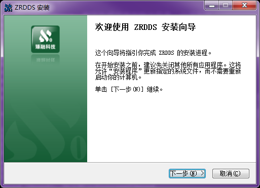
>
> **图示信息：**
>
> - ZRDDS 安装向导的欢迎界面，显示安装前提示和操作按钮。

图 11-1 安装步骤一图

第二步：选择安装路径后，并点击“安装”。

> 
>
> **图示信息：**
>
> - ZRDDS 安装向导的目录选择界面，使用 Nullsoft Install System v3.04。

图 11-2 安装步骤二图

第三步：等待安装完成。

> 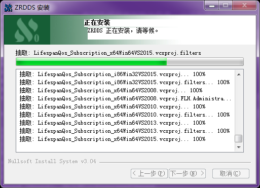
>
> **图示信息：**
>
> - ZRDDS installation window showing extraction progress of multiple LifespanQos_Subscription files using Nullsoft Install System v3.04.

图 11-3 安装步骤三图

第四步：若安装过程中出现如下图所示的提示框，代表在本次安装之前，机器中已经安装过

ZRDDS，此次安装会替换关于 ZRDDS 的环境变量。点击”确定”。

> 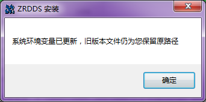
>
> **图示信息：**
>
> - A Windows-style dialog box titled 'ZRDDS 安装' displaying a status message and a confirmation button.

图 11-4 安装步骤四图

第五步：安装程序会在系统中设置环境变量，为了使环境变量起效，需要重新启动计算机，用

户在使用 ZRDDS 之前重启即可。

> 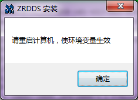
>
> **图示信息：**
>
> - A Windows-style dialog box titled 'ZRDDS 安装' displaying a message instructing the user to restart the computer for environment variables to take effect, with a single '确定' button.

图 11-5 安装步骤五图

第六步：安装完后，点击“完成”。

> 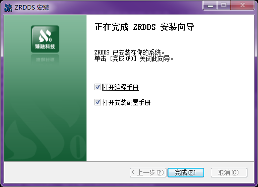
>
> **图示信息：**
>
> - ZRDDS 安装向导的完成界面，显示安装已成功并提供后续操作选项。

图 11-6 安装步骤六图

至此，臻融数据分发服务 DDS 系统软件已经成功安装到计算机上。

### 11.3. 生成自定义数据类型文件

在使用 ZRDDS 进行通信前，发布端和订阅端需要共同确定一种数据结构。一种数据结构需要有

配套的平台相关的数据类型描述文件来支持。例如：以 Foo 类型作为通信所需的数据类型，则它就

必须有先关的 Foo.h、Foo.cpp、FooTypeSupport.h、FooTypeSupport.cpp、FooDataWriter、FooDataReader

这 6 个数据类型描述文件。配套的数据类型描述文件需要通过 zrddsgen 编译器进行生成。（注意：

由 Zrddsgen 编译器输出的文件，用户可以根据需要进行适当修改，一般不建议修改），详见 4.2 节

11.3.1 创建 IDL 文件

zrddsgen 编译器需要使用后缀名为”idl”的文件（以下简称为”idl 文件“）来作为输入文件，来生

成配套的文件。idl 文件里定义了通信所需的数据类型。

例如：以下是 Foo.idl 文件的内容，struct Foo 就是用户自定义的数据类型，用来通信。

struct Foo

```text
{
long x;
double y;
} ;
```

11.3.2 使用 zrddsgen 编译器

zrddsgen.exe 文件位于安装目录下的 bin 目录中。用命令行方式调用 zrddsgen.exe，并输入相关

指令（详见 4.2 节），示例如图11-7 所示。

> 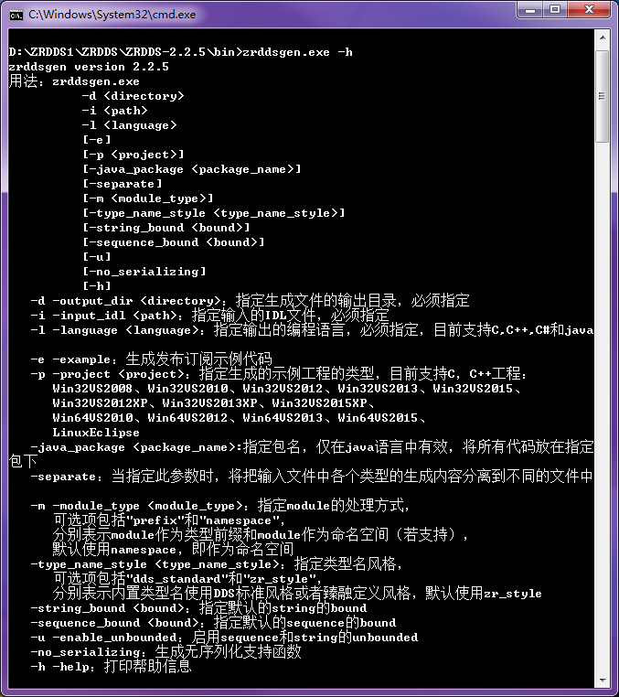
>
> **图示信息：**
>
> - Command-line help output for zrddsGen.exe showing usage, options, and descriptions in Chinese.

图 11-7 用命令行方式调用 zrddsgen.exe 及输入的相关指令

注意：用户需要有生成路径的写入权限，否则无法成功生成。

### 11.4. 在 Windows 平台上配置 ZRDDS 应用

在创建 Windows 平台上的 ZRDDS 应用程序之前，必须确保：

- Window 版本，Visual C++ 2008 或 Visual C++2010 或 Visual C++2013 的支持

- 臻融数据分发服务 DDS 系统已经安装

11.4.1 使用 Visual Studio 2008\2010\2013 创建工程

11.4.1.1 创建工程

- 单击文件。

- 单击新建。

- 单击项目。

- 选择 Visual C++中的空项目，创建一个工程。

> 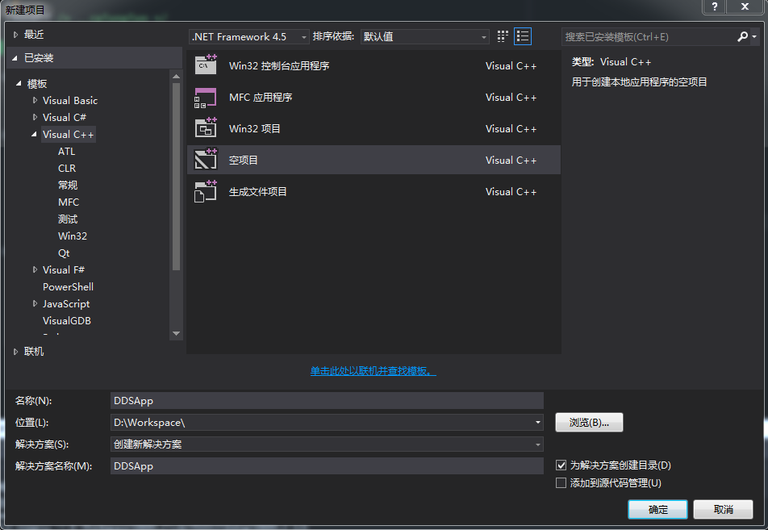
>
> **图示信息：**
>
> - Visual Studio 'New Project' dialog in Chinese, showing template selection and project configuration fields.

图 11-8 创建空项目图

- 将 zrddsgen.exe 生成的文件添加到工程（Foo.h、Foo.cpp、FooDataRreader.h、FooDataWriter.h、

FooTypeSupport.h、FooTypeSupport.cpp）。

11.4.1.2 添加 ZRDDS 头文件

- 在菜单栏点击项目，选择属性。

- 选择 C/C++。

- 选择 C/C++ ， 在附加包含目录中添加 “ `$(ZRDDS_HOME)\include`\

```text
ZRDDSCoreInterface;$(ZRDDS_HOME)\include\CPlusPlusInterface”（如果使用 C 语言时，添加的文
件是“$(ZRDDS_HOME)\include\ ZRDDSCoreInterface;$(ZRDDS_HOME)\include\Cinterface”）。
```

11.4.1.3 添加链接库

臻融数据分发服务 DDS 系统 Windows 平台运行库文件的命名规则如表11-1 所示。

表 11-1DDS 运行库命名规则

> 
>
> **图示信息：**
>
> - A single-line text string showing a library file path with bracketed version alternatives.

其中：

ZRDDS 固定前缀；

C 或者 Cpp 表明当前库是用于 C 或者 C++语言；

z 表明当前为静态库，否则为动态库；

d 表明当前库是 Debug 版本，否则为 Release 版本

_ 固定分隔符

VS2008`/VS2010/VS2013` 表明当前库用于哪个 IDE。

工程配置如下：

- 项目菜单栏，选择属性。

- 选择链接器。

- 选择常规，在附加库目录中添加“`$(ZRDDS_HOME)\lib\win32`”，如果需要生成 64 位应用程

序，需要选择“`$(ZRDDS_HOME)\lib\win64`”。

- 在项目->属性->链接器->输入->附加依赖项中根据表11-2 配置运行时库。

> 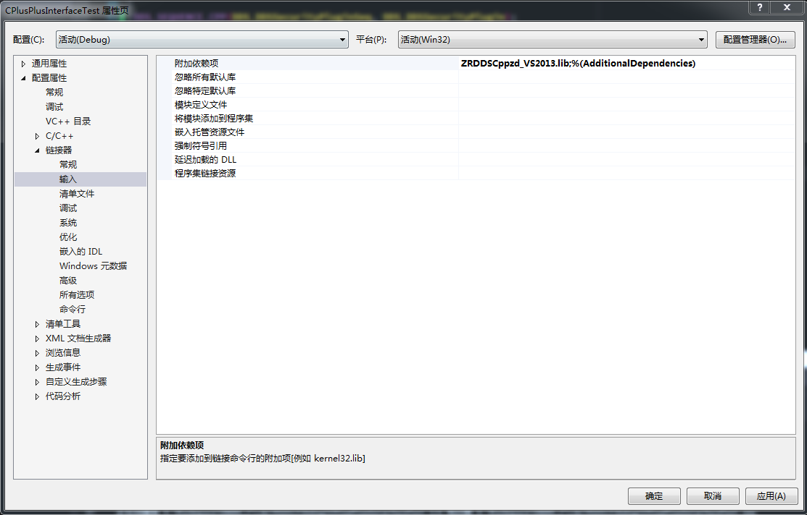
>
> **图示信息：**
>
> - Visual Studio project property page for 'CPPlusInterfaceTest', showing Linker → Input settings under Debug configuration and Win32 platform.

图 11-9 配置运行时库图

- 在项目->属性->C/C++->预处理器->预处理器定义中根据表11-2 添加预编译符。

> 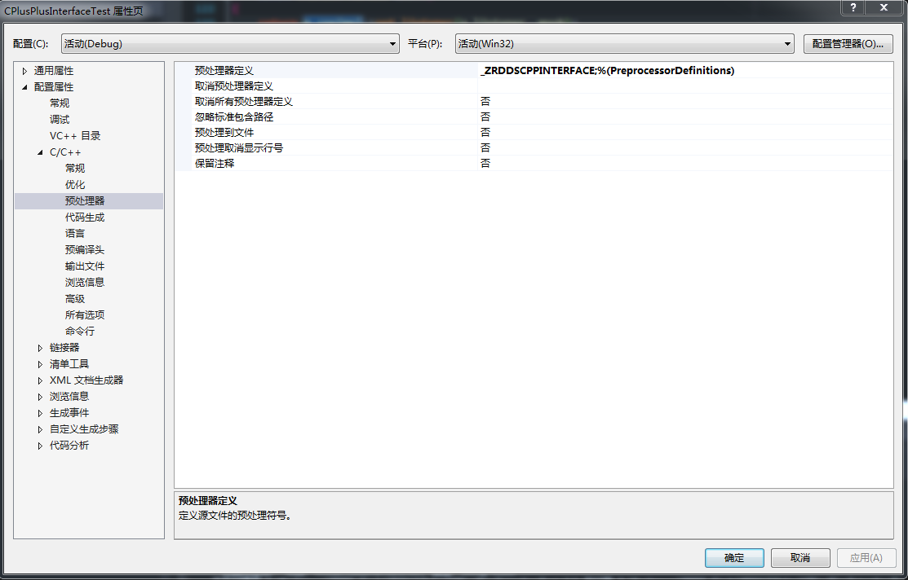
>
> **图示信息：**
>
> - Visual Studio property page for 'CPlusPlusInterfaceTest' showing C/C++ preprocessor settings under Debug configuration and Win32 platform.

图 11-10 添加编译符图

- 在项目->属性->C/C++->代码生成->运行库中根据选择的库版本进行配置，debug 库使用

/MDd，release 库使用/MD。

> 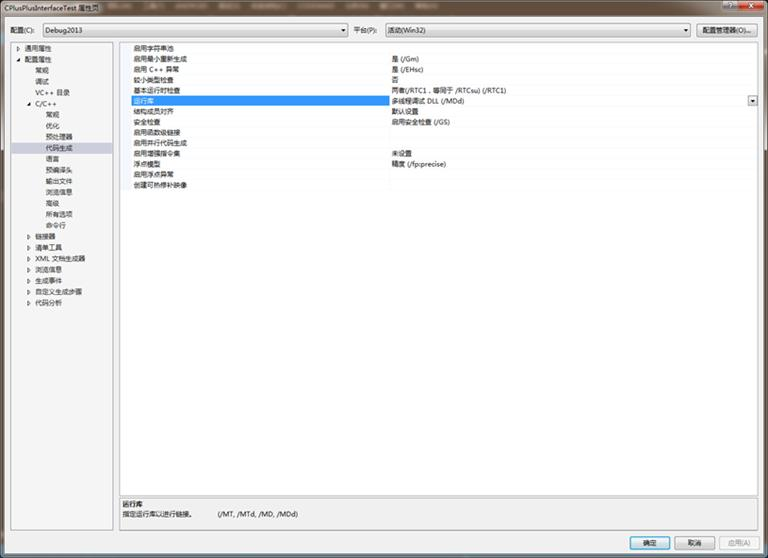
>
> **图示信息：**
>
> - Visual Studio property pages for a C++ project named 'CPlusPlusInterfaceTest', showing the 'Linker' > 'Advanced' configuration tab under Debug|Win32 platform.

图 11-11 选择运行库版本图

表 11-2 库文件选择

| 库文件 | 预编译符 |
| --- | --- |
| ZRDDSCpp_VS2008.lib | _ZRDDSDLLIMPORT<br>_ZRDDSCPPINTERFACE |
| ZRDDSCppd_VS2008.lib | _ZRDDSDLLIMPORT<br>_ZRDDSCPPINTERFACE |
| ZRDDSCppz_VS2008.lib | _ZRDDSCPPINTERFACE |
| ZRDDSCppzd_VS2008.lib | _ZRDDSCPPINTERFACE |
| ZRDDSCpp_VS2010.lib | _ZRDDSDLLIMPORT<br>_ZRDDSCPPINTERFACE |
| ZRDDSCppd_VS2010.lib | _ZRDDSDLLIMPORT<br>_ZRDDSCPPINTERFACE |
| ZRDDSCppz_VS2010.lib | _ZRDDSCPPINTERFACE |
| ZRDDSCppzd_VS2010.lib | _ZRDDSCPPINTERFACE |
| ZRDDSCpp_VS2013.lib | _ZRDDSDLLIMPORT<br>_ZRDDSCPPINTERFACE |
| ZRDDSCppd_VS2013.lib | _ZRDDSDLLIMPORT<br>_ZRDDSCPPINTERFACE |
| ZRDDSCppz_VS2013.lib | _ZRDDSCPPINTERFACE |
| ZRDDSCppzd_VS2013.lib | _ZRDDSCPPINTERFACE |
| ZRDDSC_VS2008.lib | _ZRDDSDLLIMPORT |
| ZRDDSCd_VS2008.lib | _ZRDDSDLLIMPORT |
| ZRDDSCz_VS2008.lib |  |
| ZRDDSCzd_VS2008.lib |  |
| ZRDDSC_VS2010.lib | _ZRDDSDLLIMPORT |
| ZRDDSCd_VS2010.lib | _ZRDDSDLLIMPORT |
| ZRDDSCz_VS2010.lib |  |
| ZRDDSCzd_VS2010.lib |  |
| ZRDDSC_VS2013.lib | _ZRDDSDLLIMPORT |
| ZRDDSCd_VS2013.lib | _ZRDDSDLLIMPORT |

ZRDDSCz_VS2013.lib

ZRDDSCzd_VS2013.lib

至此，工程配置完成，可以编写相关代码使用臻融数据分发服务 DDS 系统软件。

11.4.1.4 运行

如果使用静态库进行编译时，可以直接运行生成的应用程序，如果使用动态库进行编译，需要

将安装目录中\lib\win32 文件夹下的对应动态链接库（dll 文件）拷贝到应用程序的运行目录下。例

如，当使用 ZRDDSCppd_VS2013.lib 库进行编译时，需要将 ZRDDSCppd_VS2013.dll 文件拷贝到应用程

序运行目录下才能正常运行。同时也可以将安装目录中的\lib\win32 目录配置到操作系统的 PATH 中，

可以避免拷贝。

### 11.5. 在 Linux 平台配置 ZRDDS 应用

通过 Visual GDB 创建 ZRDDS 在 Liunx 平台上的应用之前，必须确保：

- 在 Windows 开发平台上，Visual C++2010 或 Visual C++2013 的支持

- 在 Windows 开发平台上，已安装 Visual GDB

- 臻融数据分发服务 DDS 系统已经安装

- 在 Linux 运行平台上，已安装 g++编译器

11.5.1 使用 Visual GDB 创建工程

11.5.1.1 创建工程

- 单击文件。

- 单击新建。

- 单击项目

- 选择 Visual GDB 中的 Linux Project Wizard，创建一个工程。

11.5.1.2 添加 ZRDDS 头文件

- VisualGDB 项目属性菜单栏，选择 Makefile settings。

- 选择 include directories。

- 在 include directories 中添加

“`$(ZRDDS_HOME)\include\ZRDDSCoreInterface`;`$(ZRDDS_HOME)\include\CplusPlusInterface`”。

11.5.1.3 添加 ZRDDS 库文件

- VisualGDB Project Properties 菜单栏，选择 Makefile settings。

- 选择 Library directories。

- 在 Library directoriess 中添加`$(ZRDDS_HOME)\lib\win32`。

- 选择 Library names。

- 在 Library names 中添加 DDS 库文件，根据运行时库不同，可以添加的支持库包括：

libZRDDSCppz.a、libZRDDSCppzd.a、libZRDDSCpp.so、libZRDDSCppd.so。

| 库文件 | 运行时库配置 | 预编译符 |
| --- | --- | --- |
| libZRDDSCppz.a | MT | _ZRDDSCPPINTERFACE |
| libZRDDSCppzd.a | MTd | _ZRDDSCPPINTERFACE |
| libZRDDSCpp.so | MD | _ZRDDSDLLIMPORT<br>_ZRDDSCPPINTERFACE |
| libZRDDSCppd.so | MDd | _ZRDDSDLLIMPORT |

注意：输入库文件的名字时需去除“lib”部分。

- 在 Library names 中输入“pthread”。

### 11.6. 创建 ZRDDS 应用程序

11.6.1 ZRDDS 的头文件

臻融数据分发服务 DDS 系统（ZRDDS）所有用户可见的头文件都在`<安装目录\include>`下，用户

可以选择需要的头文件加入自己的工程。

通过 zrddsgen.exe 程序可以通过配置.idl 文件，生成自定义数据类型所需要的所有文件。

11.6.2 发布端应用程序

> 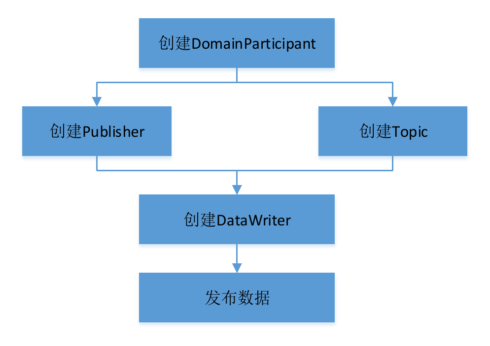
> **图 11-12 发布端应用程序流程图**
> **图示信息：** A flowchart showing the sequence of steps to create and publish data in a ZRDDS application, with branching after the first step.
图 11-12 发布端应用程序流程图

例 11-1：发布端应用程序示例。

```text
#include "DomainParticipantFactory.h"
#include "DomainParticipant.h"
#include "DefaultQos.h"
#include "Publisher.h"
#include "Foo.h"
#include "FooTypeSupport.h"
#include “FooDataWriter.h”
#include<stdio.h>
#include<windows.h>
using namesapce DDS;
static int shutdown(DomainParticipant *participant);
int main()
{
// 创建DomainParticipant
DomainParticipant* part = DomainParticipantFactory::get_instance().create_participant(
DomainId_t(24),
```

DOMAINPARTICIPANT_QOS_DEFAULT,

NULL,

```text
DDS_STATUS_MASK_NONE);
if (part == NULL)
{
printf("创建DomainParticipant 失败\n");
return -1;
}
// 创建Publisher
Publisher* pub = part->create_publisher(
```

PUBLISHER_QOS_DEFAULT,

NULL,

```text
DDS_STATUS_MASK_NONE);
if (pub == NULL)
{
printf("创建Publisher 失败\n");
return shutdown(part);
}
// 注册数据类型
ReturnCode_t rtn = FooTypeSupport::get_instance()->register_type(part, NULL);
if (rtn != DDS_RETCODE_OK)
{
printf("注册数据类型失败\n");
return shutdown(part);
}
// 创建Topic
Topic* FooTopic = part->create_topic(
```

"Foo",

FooTypeSupport::get_instance()->get_type_name(),

TOPIC_QOS_DEFAULT,

NULL,

```text
DDS_STATUS_MASK_NONE);
if (FooTopic == NULL)
{
printf("创建Topic 失败\n");
return shutdown(part);
}
// 创建DataWriter
DataWriter* dw = pub->create_datawriter(
```

FooTopic,

DATAWRITER_QOS_DEFAULT,

NULL,

```text
DDS_STATUS_MASK_NONE);
FooDataWriter* FooDw = dynamic_cast<FooDataWriter*>(dw);
if (FooDw == NULL)
{
printf("创建DataWriter 失败\n");
return shutdown(part);
}
//等待和订阅端的连接
Sleep(3000);
Foo data;
FooInitialize(&data);
data.y = 2;
for (int i = 0; i < 100; i++)
{
data.x = i;
printf("发布数据%d\n", i);
ReturnCode_t ret = FooDw->write(data, DDS_HANDLE_NIL_NATIVE);
if (ret != DDS_RETCODE_OK)
{
printf("发布数据%d 失败\n", i);
return shutdown(part);
}
Sleep(100);
}
FooFinalize(&data);
shutdown(part);
return 0;
}
/* Delete all entities */
static int shutdown(DomainParticipant *participant)
{
ReturnCode_t retcode;
int status = 0;
if (participant != NULL)
{
retcode = participant->delete_contained_entities();
if (retcode != DDS_RETCODE_OK)
{
printf("delete_contained_entities error\n");
status = -1;
}
retcode = DomainParticipantFactory::get_instance().delete_participant(participant);
if (retcode != DDS_RETCODE_OK)
{
printf("delete_participant error\n");
status = -1;
}
}
return status;
}
```

11.6.3 订阅端应用程序

> 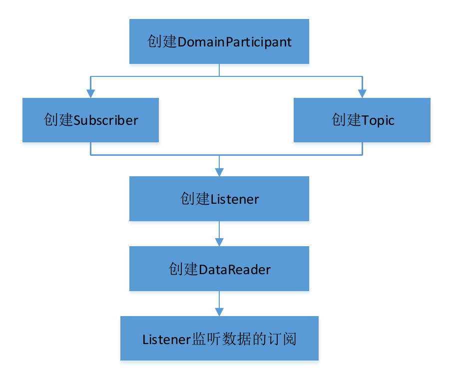
> **图 11-13 订阅端应用程序流程图**
> **图示信息：** A vertical flowchart showing the sequence of creating ZRDDS application components, starting from DomainParticipant and ending with Listener listening to data subscriptions.
图 11-13 订阅端应用程序流程图

例 11-2：订阅端应用程序示例。

```text
#include "DomainParticipantFactory.h"
#include "DomainParticipant.h"
#include "DefaultQos.h"
#include "Subscriber.h"
#include "Topic.h"
#include "Foo.h"
#include "FooTypeSupport.h"
#include “FooDataReader.h”
#include <stdio.h>
using namespace DDS;
```

class fooListener : public DataReaderListener

{

public:

```text
virtual void on_data_available(DataReader *reader);
};
void fooListener::on_data_available(DataReader *reader)
{
FooDataReader* fooDr = dynamic_cast<FooDataReader*>(reader);
if (fooDr == NULL)
```

```text
{ printf("DataReader 类型转换失败"); return; } FooSeq dataseq; SampleInfoSeq infoseq; //订阅数据 ReturnCode_t rtn = fooDr->take(dataseq, infoseq, MAX_INT32_VALUE, DDS_ANY_SAMPLE_STATE, DDS_ANY_VIEW_STATE, DDS_ANY_INSTANCE_STATE); if (rtn == DDS_RETCODE_NO_DATA) { return; } else if (rtn != DDS_RETCODE_OK) { printf("取出数据失败\n"); return; } for (int i = 0; i < dataseq.length(); ++i) { if (infoseq[i].valid_data) printf("收到数据<sub>，</sub> x 值为%d\n", dataseq[i].x); } rtn = fooDr->return_loan(dataseq, infoseq); if (rtn != DDS_RETCODE_OK) printf("归还空间失败\n"); } static int shutdown(DomainParticipant *participant); int main() { // 创建DomainParticipant DomainParticipant* part = DomainParticipantFactory::get_instance().create_participant( DomainId_t(24), DOMAINPARTICIPANT_QOS_DEFAULT, NULL, DDS_STATUS_MASK_NONE); if (part == NULL) {
```

```text
printf("创建DomainParticipant 失败\n");
return -1;
}
// 创建Subscriber
Subscriber* sub = part->create_subscriber(
```

SUBSCRIBER_QOS_DEFAULT,

NULL,

```text
DDS_STATUS_MASK_NONE);
if (sub == NULL)
{
printf("创建Subscriber 失败\n");
return shutdown(part);
}
// 注册数据类型
ReturnCode_t rtn = FooTypeSupport::get_instance()->register_type(part, NULL);
if (rtn != DDS_RETCODE_OK)
{
printf("注册数据类型失败\n");
return shutdown(part);
}
// 创建Topic
Topic* FooTopic = part->create_topic(
```

"Foo",

FooTypeSupport::get_instance()->get_type_name(),

TOPIC_QOS_DEFAULT,

NULL,

```text
DDS_STATUS_MASK_NONE);
if (FooTopic == NULL)
{
printf("创建Topic 失败\n");
return shutdown(part);
}
fooListener listener;
DataReader* dr = sub->create_datareader(
```

FooTopic,

DATAREADER_QOS_DEFAULT,

&listener,

```text
DDS_STATUS_MASK_ALL);
if (dr == NULL)
{
printf("创建DataReader 失败\n");
return shutdown(part);
}
while (true)
{
printf("time 4s go!\n");
Sleep(4000);
}
}
/* Delete all entities */
static int shutdown(DomainParticipant *participant)
{
ReturnCode_t retcode;
int status = 0;
if (participant != NULL)
{
retcode = participant->delete_contained_entities();
if (retcode != DDS_RETCODE_OK)
{
printf("delete_contained_entities error\n");
status = -1;
}
retcode = DomainParticipantFactory::get_instance().delete_participant(participant);
if (retcode != DDS_RETCODE_OK)
{
printf("delete_participant error\n");
status = -1;
}
}
return status;
}
```

PART 4 深入理解

## 第12章可靠通信模型

本章介绍了 ZRDDS 的可靠通信模型，主要包含以下内容：

- 通信模型

- 可靠通信模型的报文机制

- QoS 策略对通信模型的影响

### 12.1. 通信模型

通过设置 ZRDDS 中的 Qos 策略，用户可以使用两种的通信模型进行通信，主要包括以下是两种

通信模型：

- “尽力而为”通信模型：不关心数据是否丢失或乱序，只是尽可能地发送。

- “可靠”通信模型：保证数据不丢失以及顺序正确。

12.1.1 “尽力而为”通信模型

在默认情况下，ZRDDS 服务使用“尽力而为”通信模型。在“尽力而为”通信模型中，ZRDDS

服务不会确保通信过程中数据的有序性，也不会对丢失的数据进行重发。

例如：发送端向接收端依次发送 a1、a2、a3 三个数据，因为网络问题，a2 数据丢失了。接收

端只收到了 a1、a3 两包数据。在“尽力而为”通信模型中，接收端会在收到数据后直接传给用户。

即，用户依次收到 a1、a3 两包数据。在“可靠”通信模型中，为了保证数据的有序性以及不丢失数

据，接收端会在收到 a3 数据时，向发送端请求重发 a2 数据。在 a2 数据重发并且成功接收后，接收

端会将 a2、a3 两包数据依次提交用户，从而保证数据的不丢失以及有序性。

“尽力而为”通信模型适合一些持续发送、并且只关心最新数据的通信。例如，一个雷达系统

每秒向显控台发送自身的状态信息。在这个环境下，显控台允许偶尔的丢包，只关心最新的雷达状

态信息，比较适合“尽力而为”通信模型。

“尽力而为”通信模型不保证数据的有序性，但并不意味着接收端收到的数据会出现乱序。例

如：发送端依次发送 a1、a2、a3 三个数据到接收端，因为网络问题，a2 的接收出现延迟（先收到

a3，之后才收到 a2）。接收端在提交 a3 数据给用户后，会忽略延迟收到的 a2 数据。

12.1.2 “可靠”通信模型

“可靠”通信模型中，ZRDDS 服务会通过一系列的机制来保证接收端完整、有序地接收发送端

的数据。

在ZRDDS服务中，DataWriter会使用一个“发送队列”来保存最新发送的数据。对应的，DataReader

会使用一个“接收队列”来保存最新接收的数据。

在“可靠”通信模式中，DataWriter 通过接收 DataReader 的反馈信息 ACK 来确认 DataReader

已经接收到发送的数据。当 DataWriter 的“发送队列”达到资源上限后，DataWriter 需要移除旧的

数据来为新的数据腾出空间。如果旧的数据已经被所有可靠通信模式的 DataReader 接收（即

DataWriter 收到这些 DataReader 的反馈信息 ACK），这个数据即可从“发送队列”中移除。如果“发

送队列”不存在可以移除的数据，那么 DataWriter 会根据 HistoryQosPolicy 的配置进行进一步操作：

可能会阻塞一定时间等待“发送队列”腾出空间，也可能会直接删除旧的、未被完全响应的数据。

“可靠”通信模型保证数据通信的有序性，ZRDDS 服务会给所有可靠通信模式下的数据设置内

置序号，DataReader 会根据数据的内置序号来判断收到的数据是否乱序。如果 DataReader 收到一包

乱序数据，DataReader 会将这包数据放入“接收队列”中，但并不会将这包数据提供给用户，而是

向 DataWriter 请求重发丢失的数据（这包数据乱序，意味着之前丢失了若干包数据）。当 DataWriter

重发丢失数据后，DataReader 会将恢复顺序的数据一起上传用户。

“可靠”通信模型中，DataReader 可能会因为“接收队列”长度达到资源上限而拒绝接收

DataWriter 发来的数据，并且通过 on_sample_rejected()方法回调通知用户。在 DataReader 拒绝接收

数据后，该数据在 DataWriter 的“发送队列”中被视为未被响应的数据，DataWriter 会不断试图向

DataReader 重发该数据，直到 DataReader 接收或 DataWriter 因为“发送队列”长度达到资源上限，

不得不将该数据删除。DataReader 也可能会因为“接收队列”长度达到资源上限而用新的数据替代

旧的数据，在这种情况下，DataReader 会使用 on_sample_lost()回调通知用户。

事实上，DataWriter 使用 write 方法并返回 DDS_RETCODE_OK 并不意味着所有 DataReader 成功

收到数据，而是表示数据成功加入到“发送队列”中。

### 12.2. 可靠通信模型的报文机制

为了实现“可靠”通信模型，ZRDDS 服务使用了如下报文：

- DATA：数据报文，ZRDDS 服务将数据对象的内容以及内置序号组合成为数据报文。数据对

象会在 DataWriter 进行 write()操作后加入“发送队列”中，内置序号代表数据对象加入“发送

队列”中的先后顺序。内置序号是数据报文发送顺序的重要标识，接收端在收到数据报文后，

通过解析序号信息可以判断是否出现报文乱序。

- HB：心跳报文，DataWriter 通过向 DataReader 发送心跳报文请求反馈（ACK/ACKNACK）。

DataWriter 在可靠通信过程中，为了保证 DataReader 完整有序接收到所发送的数据报文， HB

```text
报文中包含其所发送的数据报文的内置序号。例如：DataWriter 在发送 DATA(1-3)的数据报文后，
会向 DataReader 发送 HB(1-3)查询是否完全收到（DataReader 通过 ACK/ACKNACK 报文反馈查询
```

信息）。

- ACK：反馈报文，DataReader 在收到 DataWriter 的 HB 报文后，如果自身不存在数据报文丢

失/乱序，则反馈 ACK 报文告知 DataWriter。DataReader 在收到新的数据报文时，可以根据新的

数据报文中的内置序号与上一包数据报文中的内置序号的比较判断是否丢包（内置序号连续则

不丢包），但是 DataReader 永远无法判断自身是否收到最新的一包数据，所以需要借助 HB 提供

的内置序号信息。

- ACKNACK：反馈报文，DataReader 在收到 DataWriter 的 HB 报文后，如果自身出现丢失数

据报文的现象，则反馈 ACKNACK 报文告知 DataWriter。ACKNACK 报文中包含 DataReader 丢失

的数据报文的内置序号，DataWriter 在收到 ACKNACK 报文后，会将 DataReader 丢失的数据报文

重发（只要对应的数据依旧在 DataWriter 的“发送队列”中）。

图 9-1 所示是 DataWriter 使用 write ()操作向 DataReader 进行一次数据发送的过程。

DataWriter 在发送一个数据对象时，会将一个内置序号与其绑定（内置序号一般为该数据对象

在“发送队列”中的序号）。例如，数据报文 DATA(A,1)意味着发送数据对象 A 的同时绑定了内置序

号“1”。

在 ZRDDS 服务中，多个报文可能会通过一个 socket 包进行传输，从而提高通信的效率。在图

12-1 中，DataWriter 将 HB(1)报文与 DATA(A,1)报文一起打包发送到 DataReader。

当 DataReader 收到数据报文后，会将内置序号与数据对象一起保存在“接收队列”中。通过保

存在“接收队列”中的内置序号集，DataReader 可以判断自身是否发生丢包以及丢失了哪些数据报

文。若 DataReader 判断自身并没有发生丢包，DataReader 即可将“接收队列”中的数据提供给上层

用户 take/read。

当 DataWriter 向 DataReader 发送 HB 报文后，DataReader 需要向 DataWriter 反馈。若 DataReader

判断自身并没有丢包，DataReader 向 DataWriter 发送 ACK 报文表示自身状态正常。DataWriter 在收

到 ACK 报文后，将“发送队列”中的对应数据的状态置为√，表示该数据已经被 DataReader 响应。

当 DataWriter 的“发送队列”长度达到资源上限时，√状态的数据是可以被新数据替代的。

> 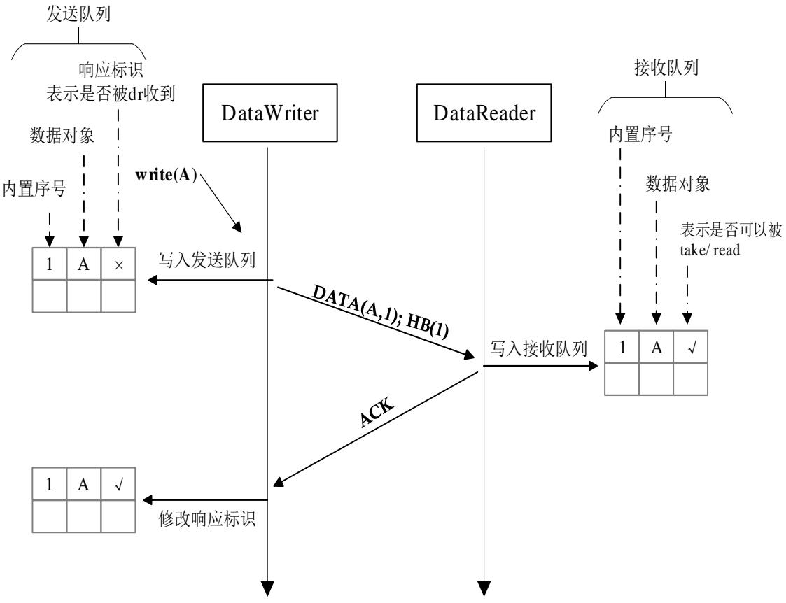
>
> **图示信息：**
>
> - A sequence diagram illustrating a reliable communication model with DataWriter and DataReader components, showing message flow including DATA, HB, and ACK, and queue state changes.

图 12-1DataWriter 向 DataReader 发送数据

图12-2 是 DataWriter 向 DataReader 数据发送时出现丢包后的处理过程。

```text
假设 DataWriter 在向 DataReader 发送数据报文 DATA(A,1)时，因为网络问题，数据包丢失。当
DataReader 收到第二个 socket 包（DATA(B,2);HB(1-2)）时，DataReader 判断出自身出现丢包，丢失的
```

数据报文的内置序号为 1。

DataReader 在判断出自身丢包后，将会进行以下行为：

- 将 DATA(B,2)放入“接收队列”中，并给予×状态位，表示不能提供给上层用户 take/read

（因为 ZRDDS 服务需要保证数据的有序性，在内置序号 1 的数据提供给用户之前，内置序号 2

的数据不能提前被用户 take/read）。

```text
- 向 DataWriter 发送 ACKNACK(1)，请求重发 DATA(?,1)。
DataWriter 在收到 ACKNACK(1)后，会从“发送队列”中找对内置序号为 1 的数据，并将其重发。
当 DataReader 收到重发的 DATA(A, 1)后，DataReader 同时将“接收队列”中 DATA(A,1)，DATA(B,2)的
```

状态置为√，表示它们可以提交给上层用户 take/read。

> 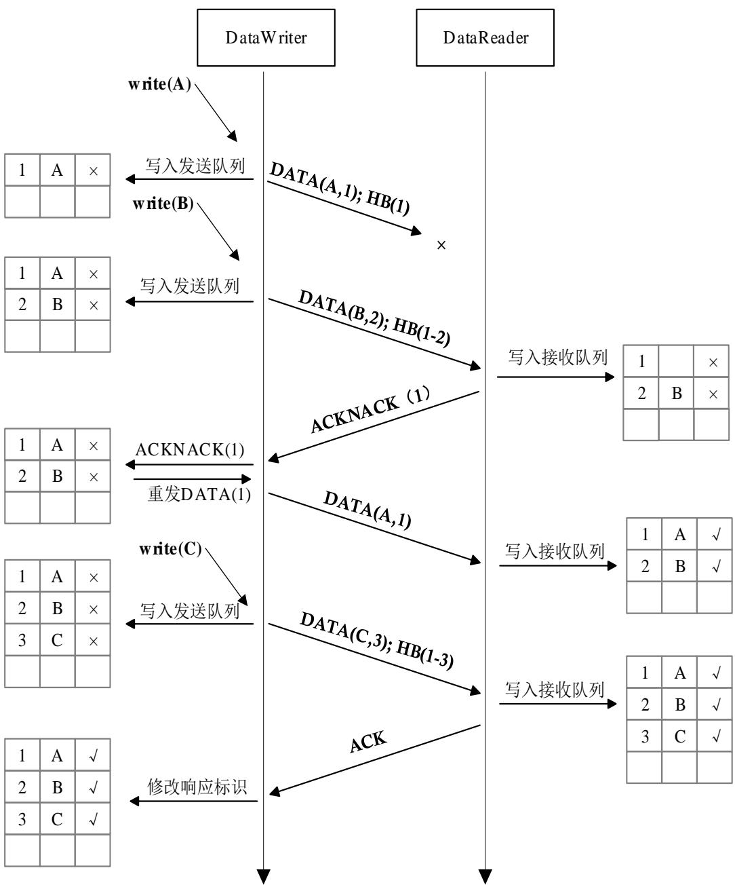
>
> **图示信息：**
>
> - Sequence diagram illustrating a reliable communication protocol between DataWriter and DataReader, showing message exchange, queue states, and acknowledgment handling with retransmission.

图 12-2DataWriter 发送数据时发生数据丢包的处理过程

“可靠”通信模型的特点就是 DataWriter 与 DataReader 之间会通过 HB、ACK/ACKNACK 报文进

行交互，从而验证是否出现丢包、是否需要进行重发等。

### 12.3. QoS 策略对通信模型的影响

“可靠”/“尽力而为”通信模型主要受到 Reliability QosPolicy、History QosPolicy、RescourceLimits

QosPolicy 三个 QoS 策略影响，如表12-1 所示。

表 12-1 影响通信模型的 3 个 QoS

| QosPolicy | 描述 | 关联实体 |
| --- | --- | --- |
| Reliability | 当Reliability.kind = RELIABLE时，使用“可靠”通信模型；<br>当Reliability.kind = BEST_EFFORTE时，使用“尽力而为”通信模型。 | DataWriter<br>DataReader |
| History | 该 QoS 影响“发送”/“接收”队列的最大长度，以及在队列长度达<br>到上限时的处理方法。 | DataWriter<br>DataReader |
| RescourceLimits | 该QoS是ZRDDS服务控制系统资源的QoS策略，它决定用户在<br>一个DW/DR下存储instance数量的上限以及每个instance下最<br>大的数据样本数量。它决定了“发送”/“接收”队列的最大长度。 | DataWriter<br>DataReader |

12.3.1 选择通信模型

用户通过设置 Reliability QosPolicy 的 kind 对象的取值来选择通信模型。当 kind 取值为 RELIABLE

时，表示选择“可靠”通信模型；当 kind 取值为 BEST_EFFORTE 时，表示选择“尽力而为”通信模

型。

DataWriter 和 DataReader 对于 Reliability.kind 的设置可以是不同的，但要保证 DataWriter 和

DataReader 的 Reliability 兼容，兼容性要求见 qos 部分。

12.3.2 “发送队列”和“接受队列”

DataWriter 有一个“发送队列”来处理发送的数据，同样，DataReader 也有一个“接收队列”

来处理接收的数据。考虑到内存资源的管理，这两种队列的长度不可能无限大。在 ZRDDS 服务中，

History QosPolicy 和 RescourceLimits QosPolicy 控制“发送队列”和“接收队列”的长度。

RescourceLimits QosPolicy 中的 max_samples 参数决定“发送队列”、“接收队列”的长度上限。

但是在“发送队列”和“接收队列”中，对于每个 instance 下的数据也存在数量限制。单个 instance

的数据数量限制取值如表12-2 所示。

表 12-2 History QosPolicy 对实际队列长度的作用

| History.kind | 单个instance的数据数量 |
| --- | --- |
| KEEP_LAST | 数据数量由 History.depth 决定 ， 并且用户需保证<br>ResourceLimits.max_sample_per_instance>=History.depth |
| KEEP_ALL | 数据数量由ResourceLimits的max_sample_per_instance决定 |

例 12-1：当 DataWriter 的 QosPolicy 取值如下时：

```text
writer_qos.rescource_limits.max_samples = 20
writer_qos.rescource_limits.max_instances = 3;
writer_qos.rescource_limits.max_samples_per_instance = 10;
writer_qos.history.depth = 5;
```

writer_qos.history.kind =DDS_KEEP_LAST_HISTORY_QOS;

“发送队列”的最大长度为 20，但对于单个 instance 来说，该 instance 下是数据不能超过 5 个。

例 12-2：当 DataWriter 的 QosPolicy 取值如下时：

```text
writer_qos.rescource_limits.max_samples = 20
writer_qos.rescource_limits.max_instances = 3;
writer_qos.rescource_limits.max_samples_per_instance = 10;
writer_qos.history.depth = 5;
writer_qos.history.kind = DDS_KEEP_ALL_HISTORY_QOS;
```

“发送队列”的最大长度为 20，但对于单个 instance 来说，该 instance 下是数据不能超过 10

个。

对于“发送队列”和“接收队列”长度达到资源上限有两种可能，一种是队列中的数据总量达

到最大值，即 max_samples；另一种是单个 instance 下的取值达到上限。

DataWriter 的“发送队列”中有以下 3 种数据：

- 通过 write()操作放入的准备发送的数据。

- 已经发送的，但还没有被所有 Reliable DataReader 响应的“历史数据”。

```text
 已经发送的，并且已经被所有 Reliable DataReader 响应的“历史数据”。
```

ZRDDS服务会尽可能快地将 write()操作放入“发送队列”中的数据发送，这取决于整个 DataWriter

的发送调度。当“发送队列”长度达到资源上限时，DataWriter 无法将准备发送的数据放入“发送

```text
队列”中，write()操作将被阻塞。
当 write()操作放入的数据被发送后，这些数据即被视为“历史数据”。“历史数据”分为已经被
```

所有 Reliable DataReader 响应、未被所有 Reliable DataReader 响应两种。未被所有 Reliable DataReader

响应的“历史数据”因为没有收到所有匹配的 Reliable DataReader 的 ACK 报文（这些数据是可能被

DataReader 要求重发的），因此在“发送队列”长度达到上限后，它们的删除是需要斟酌的（具体

的处理机制取决于 HistoryQosPolicy）。已经被所有 Reliable DataReader 响应的“历史数据”在“发送

队列”长度达到上限时，是可以覆盖的，因为不会再有 DataReader 会向 DataWriter 请求重发这些数

据。

DataReader“接收队列”中有可以被上层用户访问和不可以被上层用户访问的数据。

DataReader 在收到 DATA 报文后，会根据其内置序号判断自身是否出现丢包。例如：DataReader

之前收到的 DATA报文的内置序号是1，如果 DataReader收到的下一个DATA 报文中的内置序号为 2，

那么意味着没有出现丢包，收到的数据可以被上层用户访问；如果 DataReader 收到的下一个 DATA

报文的内置序号是 3，那么意味着 DataReader 在接收过程中出现丢包。为了保证数据的有序性，在

DataReader 向 DataWriter 请求重发丢失数据并获取前，内置序号 3 的数据不可以被上层用户访问。

```text
DataReader 的“接收队列”中的数据只有在用户使用 take()操作后才能释放资源。用户使用 read()
操作后，“接收队列”仍然需要为这些数据保留空间。如果用户长期使用 read()操作而不使用 take()
```

操作读取数据，可能会导致“接收队列”达到资源上限，从而影响之后的数据接收。此外，当“接

收队列”中的数据的源 DataWriter 下线后，这些数据所占据的资源是可以被释放的（需要遵守

ReaderDataLifecycle Qos 10.23 节）。

```text
12.3.3 writer()阻塞时间
在“可靠”通信模型中（RELIABLE KEEP_ALL），DataWriter 在使用 write()操作时，如果“发送队
列”长度达到资源上限，write()可能会阻塞等待“发送队列”的资源释放。阻塞等待的时间取决于
```

ReliabilityQosPolicy 中的 max_blocking_time 参数。

```text
如果在 write()操作阻塞等待时间内，“发送队列”的资源始终没有释放，write()操作将失败并返
回 DDS_RETCODE_TIMEOUT。反之，如果在 write()操作阻塞等待时间内，“发送队列”的资源释放，
write()操作将立即执行。
```

12.3.4 资源上限处理机制

DataWriter “发送队列”的长度和 DataReader “接收队列”的长度的最大值取决于

RescourceLimitsQosPolicy 中的 max_samples 参数。但是 max_samples 参数并不是限制队列长度的唯

一标准，在 max_samples 参数基础上，“发送队列”和“接收队列”中单个 instance 下的数据存在数

量限制，这取决于 HistoryQosPolicy 和 RescourceLimitsQosPolicy 的共同作用。

假设 DataWriter 与 DataReader 只使用一个 instance 下的数据进行通信，在考虑资源限制时，只

需要考虑实例队列的上限即可，如表12-3 所示。

表 12-3 单实例通信的处理机制

| History.kind | Reliabililty.kind | 当dw/dr实例队列满时的表现 |
| --- | --- | --- |
| KEEP_LAST | BEST_EFFORT | 新数据覆盖旧数据。 |
|  | RELIABLE | 新数据覆盖旧数据。<br>对于 dw：如果被覆盖的旧数据属于未响应的数据，当 dr 需要该<br>数据重发时，dw将无法提供该数据。dw将会在旧数据被覆盖时<br>通知dr该数据的丢失，dr将回调通知用户on_sample_lost()。<br>对于dr：如果用户在覆盖旧数据之前没有对其进行过read操作，<br>那么旧数据对于用户来说相当于丢失。 |
| KEEP_ALL | BEST_EFFORT | dr 将拒绝接收新数据（回调 on_sample_reject()通知用户）。因为<br>处于“尽力而为”通信模式，对于dr来说，这个数据相当于丢失了，<br>所以 dr 会还通知用户该数据的丢失（回调 on_sample_lost()通知<br>用户）。 |
|  | RELIABLE | 对于 dw：尝试用新数据覆盖旧数据。如果旧数据都已经被所有<br>reliable reader响应，则旧数据可以被替代；如果旧数据没有被所<br>有 reliable reader 响应 ， 将阻塞 write() 操作<br>Reliability.max_blocking_time指定的时间长度，阻塞时间结束后还 |
|  |  | 未发送则write()操作失败，返回超时。<br>对于 dr：在队列已满的情况下，将拒绝接收新数据（回调<br>on_sample_reject()通知用户）。dw会在之后不断尝试重发该数据，<br>直到dr接收该数据。如果对应的 dw 取值是KEEP_LAST，在不断<br>重发过程中，可能会丢失重发的数据（dw 队列已满），此时 dr<br>将回调 on_sample_lost()；如果对应的 dw 取值是 KEEP_ALL，dw<br>在不断重发过程中，会一直保留数据、可能会阻塞新数据的write<br>操作。<br>注意：在KEEP_ALL & RELIABLE配置下的dr的“接收队列”在一般<br>情况下，只有使用 take 操作才能释放队列资源。但是，当“接收<br>队列”中数据的源dr消失（对端主动delete或触发liveness机制）<br>后，这些数据是允许被释放资源的。 |

注意：表12-3 中，如果 DataReader 的 reliable.kind = BEST_EFFORT，那么没有必要考虑 dw 队列

满的情况。因为 DataWriter 只有在“可靠”通信模型中才会在“发送队列”中保存未被所有 reliable

reader 响应的数据。

如表12-4所示是DataWriter/DataReader的ReliabilityQosPolicy和HistoryQosPolicy在不同取值下，

DataWriter 和 DataReader 在“发送/接收队列”达到资源上限后的表现概况，其中需要注意以下几点：

- 整个描述过程是基于该环境：DataWrtier 向 DataReader 不停发送一个实例下的数据，

DataReader 在收到数据后仅使用 read()操作检查数据而不使用 take()操作释放数据。

- DataWriter/DataReader 的“发送/接收队列”达到资源上限的情况有两种，取决于

DataWriter/DataReader 的 history.kind 的取值。

- 当 DataReader.Reliable.kind = BEST_EFFORT 时，不需要考虑 DataWriter 的“发送队列”达到

资源上限的情况（即使 DataWriter 为 Reliable）。因为 DataWriter 的“发送队列”只可能因为在

“可靠”通信模式时需要存储重传的数据而达到资源上限。

表 12-4“发送/接收队列”资源上限的处理机制

| dw.history | dr.history<br>描述 |
| --- | --- |
| keep_last | keep_last<br>dr接收队列达到资源上限时，新数据覆盖旧数据。 |
| keep_all | keep_last |
| keep_last | keep_all<br>dr 接收队列达到资源上限时，再次收到数据包会回调<br>on_sample_reject()和on_sample_lost()。 |
| keep_all | keep_all |
| keep_last | keep_last<br>dr接收队列达到资源上限时，新数据覆盖旧数据。 |
| keep_all | keep_last |
| keep_last | keep_all<br>假设dw已经发送n个数据：<br> n < dr. max_sample_per_instance 正常接收。<br> dr.max_sample_per_instance < n < dr.max_sample<br>dr拒绝接收数据，并回调on_sample_reject()通知用户，<br>但仍将收到的数据存储在dr处等待接收队列释放。<br> dr.max_sample < n < dr.max_sample+dw.depth |

```text
> 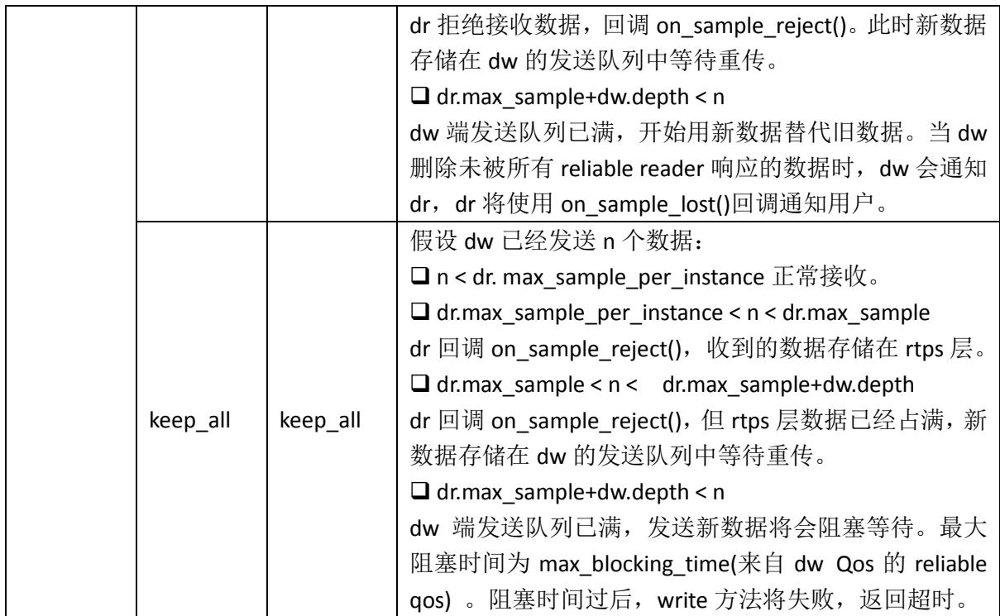
>
> **图示信息：**
>
> - A table row describing QoS behavior for 'keep_all' policy, with conditions and outcomes involving dr, dw, rtps layer, and sample limits.
如表 12-5DataWriter 的 Qos 取不同值时的表现情况描述所示是 DataReader.QoS=RELIABLE &
```

KEEP_ALL 情况下，当 DataWriter 的 Qos 取不同值时的表现情况描述。注意：DataReader 收到数据后

只是调用 read()操作。

表 12-5DataWriter 的 Qos 取不同值时的表现情况描述

|  | dw取值 |  |  | 相关表现 |  |
| --- | --- | --- | --- | --- | --- |
| RELIABLE &<br>KEEP_LAST |  |  | 假设dw一共发送了n个数据，以下是发送数据的不同阶段的相关表现：<br> n<=max_sample_per_instance<br>正常接收。注意，max_sample_per_instance来自dr的resourcelimits，之后没有<br>强调说是dw的qos参数都指来自dr。<br> max_sample_per_instance<n<=max_samples<br>dr 回调 on_sample_rejected()方法通知用户，表示 dr 对于该实例下数据的存储<br>达到资源上限。但事实上，dr 会将后续的数据保存下来(直到数据总量达到<br>max_samples)，等待用户take操作释放空间，所以在dw看来dr未拒绝该数据<br>的接收（响应该数据）。<br> max_samples<n<=max_samples+dw.history.depth<br>因为 dr 在收到 max_samples 个数据后，dr 存储的数据总量达到资源上限，dr<br>开始拒绝接收新数据（从用户角度来看依旧是回调on_sample_rejected()方法）。<br>在dw保存的发送数据队列中，这些被拒绝接收的数据被视为未被dr响应的数<br>据。在这些未被响应的数据数量达到dw的发送队列长度上限(dw.history.depth)<br>前，dw会不断在发送队列中删除旧的、已被响应过的数据，添加新的、未被响<br>应的数据。<br> n>max_samples+dw.history.depth<br>dw发送队列中保存的未被dr响应的数据达到资源上限，dw不得不去除旧的、 |  |  |

未被响应的数据，来为新的数据的加入腾出空间。在可靠传输下 dw 这种行为

意味着丢失数据，所以 dw 会通知 dr，dr 会使用 on_sample_lost()方法回调通知

用户。

假设 dw 一共发送了 n 个数据，以下是发送数据的不同阶段的相关表现：

- n<=max_sample_per_instance

正常接收。注意，max_sample_per_instance 来自 dr 的 resourcelimits，之后没有

强调说是 dw 的 qos 参数都指来自 dr。

```text
- max_sample_per_instance<n<=max_samples
dr 回调 on_sample_rejected()方法通知用户，表示 dr 对于该实例下数据的存储
```

达到资源上限。但事实上，dr 会将后续的数据保存下来(直到数据总量达到

max_samples)，等待用户 take 操作释放空间，所以在 dw 看来 dr 未拒绝该数据

的接收（响应该数据）。

- max_samples<n<=max_samples+dw. max_sample_per_instance

RELIABLE &

因为 dr 在收到 max_samples 个数据后，dr 存储的数据总量达到资源上限，dr

KEEP_ALL

开始拒绝接收新数据（从用户角度来看依旧是回调 on_sample_rejected()方法）。

在 dw 保存的发送数据队列中，这些被拒绝接收的数据被视为未被 dr 响应的数

据。在这些未被响应的数据数量达到 dw 的发送队列长度上限(dw.history.depth)

前，dw 会不断在发送队列中删除旧的、已被响应过的数据，添加新的、未被响

应的数据。

- n>max_samples+dw.history.depth

dw 发送队列中保存的未被 dr 响应的数据达到资源上限，dw 尝试使用新据覆盖

旧数据失败（全部为未被 dr 响应的数据）。dw 开始阻塞 write 方法，最大阻塞

时间为 max_blocking_time(来自 dw Qos 的 reliable qos) 。阻塞时间过后，write

方法将失败，返回超时。

12.3.5 实例管理

在 DataWriter 与 DataReader 实际通信过程中，可能不仅使用一个 instance 下的数据。在使用多

种 instance 进行通信的过程中，需考虑到使用的 instance 数量不能超过资源上限。

在 DataWriter 进行 write/register_instance 操作注册新的 instance 时，如果已有的 instance 数量

达到上限，会尝试用新的 instance 替代旧的 instance。

DataWriter 的 instance 替换规则见 WRITER_RESOURCE_LIMITS Qos。

## 第13章 TCP 并发传输

ZRDDS 提供 TCP 并发传输功能，包括 TCP 多核传输与 TCP 多网卡传输，TCP 多核传输支持用户

为读者或写者指定所使用的核，实现绑核传输，当用户为某一个读者或写者配置了多个核时，该实

体将会创建同样数量的线程，并一一绑定用户所指定的核，进行多核并发传输，其本质为在单个网

卡上建立多条 TCP 通道，进行数据传输；TCP 多网卡传输支持用户为读写者配置使用的多个网卡，

并依据网卡数量建立传输通道，进行并发传输，在使用多网卡配置时，也支持绑核操作，与 TCP 多

核传输不同的是，多网卡传输本质为在多个网卡上分别建立 TCP 通道，通过配置多个网卡，实现多

条 TCP 通道并发。并发传输功能可极大提高 ZRDDS 在 TCP 传输模式下性能。当前此特性只支持 ZRDDS

（>=2.4.0）下的 C、C++版本。多核传输与多网卡传输所支持配置项基本相同，此处一并介绍。

本章主要包含以下内容：

- 掩码值说明

- 配置说明

- 配置示例

### 13.1. 掩码值说明

在绑核时，需要指定所绑核掩码值的十进制数值，掩码值、需指定的十进制值、与对应 CPU 序

号关系如下：

表 13-1 TCP 并发传输掩码说明表

| CPU序号 | 对应掩码值 | 掩码值所对应的十进制 |
| --- | --- | --- |
| 0 | 0x00000001 | 1 |
| 1 | 0x00000002 | 2 |
| 2 | 0x00000004 | 4 |
| 3 | 0x00000008 | 8 |
| … | … | … |

默认情况下，需要通过设置上述掩码对应的十进制值进行绑核。除去此种方式外，ZRDDS 为用

户提供 sysctl.global.use_cpu_id 配置项，当设置此配置项为 true 时，支持直接使用 CPU 序号代替掩

码，当需要绑核数量超过 32 时，必须使用 sysctl.global.use_cpu_id 进行配置。

### 13.2. 配置说明

13.2.1 发送端配置说明

 配置项介绍

发送端主要有如下配置项

表 13-2 TCP 并发传输发送端配置项

| 所属实体 | 配置项 | 含义 |
| --- | --- | --- |
| dpf | sysctl.global.net.tcp_send_batch_len | 小包并包发送，指定并包发送<br>长度 |
|  | sysctl.global.net.tcp_min_subcontract_len | 最小分包大小，当所传输的数<br>据包小于此值时，不进行分包<br>操作，采用单核传输 |
|  | sysctl.global.use_cpu_id | 使用cpu序号代替掩码。 |
| dp | usertraffic_receive_addresses | 使用 TCP 多核传输时，地址头<br>需使用tcpv4_cc，使用TCP多网<br>卡传输时，地址头需使用<br>tcpv4_mc |
| dw | sysctl.dw.asynchronous_send_thread_max_flush_delay | 开启小包并包发送时的自动发<br>送周期配置 |
|  | sysctl.dw.asynchronous_send_thread_affinity_masks | 发送端绑核掩码。可通过设置<br>多次来绑多个核 |

 配置项说明

sysctl.global.net.tcp_send_batch_len

默认值为 0，表示不启用小包并包发送，即不考虑用户此次要发送的包的大小，直接发送。

当设置了指定值，例如设置值为 N，表明当用户要发送的包大小积攒到 N 时，再统一发送。

例如用户第 i（i 从 1 开始）次发送的数据大小为 n 当时，发送 n 到 n 包，否则

i 1 k-1

将第 k 次发送数据暂存不进行发送。

以具体数值为例：

设置 sysctl.global.net.tcp_send_batch_len 值为 8388608（8M）

用户第一次发送数据大小为5M，此时要发送数据未到达指定发送大小8M，则此包将暂存下来，

此次并不进行发送。

用户第二次的发送数据大小为 4M，此时要发送数据大小为 5M+4M > 8M，由于最大发送数据量

为 8M，而此时累计数据量为 9M，因此并不能一次将两包全部发送，此时只发送第一包大小为

5M 的数据，暂存第二包大小为 4M 的数据。

用户第三次的发送数据大小为 4 M，此时要发送的数据大小为 4M+4M = 8M，由于最大发送数

据量为 8M，而此时累计数据量刚好为 8M，因此可一次将两包全部发送，此时暂存数据大小为

0。

sysctl.dw.asynchronous_send_thread_max_flush_delay

用于设置开启小包并包发送时的自动发送周期。默认值为 200ms， 当不配置

sysctl.global.net.tcp_send_batch_len 时，此配置项无效。此配置项用于应对用户数据未达到

sysctl.global.net.tcp_send_batch_len 所设置的值，且无新数据发送时，之前积压的数据无法及时

发送的情况。设置sysctl.dw.asynchronous_send_thread_max_flush_delay为T，则表明每隔时间T，

就将未发送的用户数据全部发送，不论积压数据是否达到 sysctl.global.net.tcp_send_batch_len

所设置的值。

sysctl.global.net.tcp_min_subcontract_len

默认值为 0，表示永远进行分包发送。当设置了指定值，例如设置值为 N，表明当用户要

发送的包小于 N 时，不进行分包，采用单核直接发送，只有当用户所发的包大于 N 时，才进行

多核发送。

sysctl.global.use_cpu_id

默认为 false，表示不开启此功能，此时需要设置 CPU 掩码值对应的十进制值指定要绑定的

CP。

当配置了 sysctl.global.use_cpu_id 可配置项时，可直接使用序号值代替掩码值，例如：

当用户指定使用 CPU0 时，可直接填入数值 0；

当用户指定使用 CPU1 时，可直接填入数值 1；

… …

注意：当 CPU 数量超过 32 时，必须使用 sysctl.global.use_cpu_id 进行配置。

sysctl.dw.asynchronous_send_thread_affinity_masks

发送端绑核掩码。可通过设置多次来绑多个核。例如在配置文件中设置 4 次

sysctl.dw.asynchronous_send_thread_affinity_masks ， 且值分别为 0,1,2,3 （ 此处以开启

sysctl.global.use_cpu_id 为例）。

在 TCP 多核发送过程中，ZRDDS 将创建 4 个发送线程，并分别绑定 CPU0，CPU1，CPU2，

CPU4 进行数据发送。即设置 n 次 sysctl.dw.asynchronous_send_thread_affinity_masks，ZRDDS 会

为用户创建 n 个发送线程，分别绑定 sysctl.dw.asynchronous_send_thread_affinity_masks 所设置

的值。

在 TCP 多网卡发送过程中，ZRDDS 根据所配置的网卡数量创建线程，并为线程绑核，配置

的绑核掩码数量>网卡 IP 数量时，多余的绑核掩码将不会使用；当配置的绑核掩码数量<网卡 IP

数量时，多出来的发送线程将不进行绑核。假设当前用户在 usertraffic_receive_addresses 中配

置了 2 个网卡的 IP 地址 ， ZRDDS 将创建 2 个发送线程 ， 并将

sysctl.dw.asynchronous_send_thread_affinity_masks 所配置的前 2 个值绑定到 2 个发送线程；当

用户在 usertraffic_receive_addresses 中配置了 5 个网卡的 IP 地址，ZRDDS 将创建 5 个发送线程，

并将 sysctl.dw.asynchronous_send_thread_affinity_masks 所配置所有 4 个值绑定到前 4 个发送线

程，最后一个发送线程不进行绑核。

usertraffic_receive_addresses

用户数据使用的地址监听列表，设置方式可参照 10.30 TCP 多核传输模式的配置方式与 TCP

多网卡传输模式的配置方式。

13.2.2 接收端配置说明

13.2.2.1 基础配置

 配置项介绍

接收端主要有如下配置项

表 13-3 TCP 并发传输接收端配置项

| 所属实体 | 配置项 | 含义 |
| --- | --- | --- |
| dpf | sysctl.global.use_cpu_id | 使用cpu序号代替掩码。 |
| dp | usertraffic_receive_addresses | 使用TCP多核传输时，地址头需使用tcpv4_cc，使用<br>多网卡传输时，地址头需使用tcpv4_mc |
|  | tcp_receive_thread_affinity_masks | 使用 TCP 模式传输时，接收端绑核掩码。可通过设<br>置多次来设置多个可绑核 |

 配置项说明

sysctl.global.use_cpu_id

与发送端配置说明中一致。

usertraffic_receive_addresses

与发送端配置说明中一致

tcp_receive_thread_affinity_masks

与发送端 sysctl.dw.asynchronous_send_thread_affinity_masks 配置方式一致。

13.2.2.2 扩展配置

接收端扩展配置主要包括接收缓冲区数量配置与数据提交线程配置。

默认情况下，接收端会为每个匹配对端创建一个接收缓冲区，当数据接收完成后将此缓冲区向

上提交，最终传递到用户使用的回调函数中进行处理。只有当此缓冲区中数据被处理完成后才可进

行下一包数据的接收。

ZRDDS 为用户提供了一些扩展配置，支持用户配置多个接收缓冲区，并使用单独的数据提交线

程，在一定程度上使数据接收与数据提交并发运行。

 配置项介绍

扩展配置主要有如下配置项

表 13-4 TCP 并发传输接收端扩展配置项

| 配置项 | 含义 |
| --- | --- |
| sysctl.dp.use_callback_thread | 使用单独的数据提交线程 |
| sysctl.dp.recv_buffer_count | 接收缓冲区数量 |
| sysctl.dp.callback_thread_affinity_mask | 提交线程绑核掩码 |

 配置项说明

sysctl.dp.use_callback_thread

设置为 true 时表示使用单独的数据提交线程。

sysctl.dp.recv_buffer_count

只有在使用单独的数据提交线程时有效，并且配置值需大于 1。

sysctl.dp.callback_thread_affinity_mask

只有在使用单独的数据提交线程时有效，为数据提交线程进行绑核，掩码值设置与

tcp_receive_thread_affinity_masks 配置相似。

 扩展接口说明

在默认情况下，只存在一个接收缓冲区进行数据的接收与提交，只有当此缓冲区数据处理完成

后才可进行下一包数据的接收。因此，为降低在数据处理时对此缓冲区的长时间占用对数据接收线

程的影响，用户常常需要在回调函数中将数据拷贝出来在其它线程进行处理，并将此接收缓冲区及

时归还进行之后数据的接收。

当使用扩展配置时，ZRDDS 为用户提供了缓冲区租借与归还接口，由于底层存在多个缓冲区进

行数据接收，单个缓存区的长时间占用对数据接收线程的影响大幅度降低。在此种情况下，用户可

对此缓冲区进行租借，并直接将其传入其它线程进行处理，在处理完成后将缓冲区进行归还。在数

据租借与归还过程中需要提供此缓冲区的序列号，序列号记录在数据的样本信息（SampleInfo）中，

由于数据的样本信息在用户归还样本（return_loan）时会一并归还并在之后的样本中复用，因此用

户需将此样本信息进行拷贝使用（在数据的传输中，存储样本信息所占用空间大概率远远小于样本

数据所占用的空间，因此其拷贝所消耗的时间与空间资源大概率远远小于对样本数据拷贝所消耗的

资源）。

缓冲区租借与归还接口如下（以 c++语言为例）：

表 13-5 TCP 多核接收端扩展接口

| 接口 | 参数 | 参数含义 | 说明 |
| --- | --- | --- | --- |
| loan_recv_buffer | SampleInfo* | 数据样本信息 | 样本缓冲区租借 |
| return_recv_buffer | SampleInfo* | 数据样本信息 | 样本缓冲区归还 |

缓冲租借接口与归还接口必须成对使用，在未记录数据样本信息的情况下，缓冲区租借与归还

接口必须在回调函数中调用，且调用时机需在样本归还接口（return_loan）调用之前；在记录样本

数据的情况下，缓冲区租借接口必须在回调函数中调用，缓冲区归还接口可在其它线程调用。

### 13.3. 配置示例

13.3.1 TCP 多核传输配置示例

发送端配置示例：

```text
<zrdds_qos xmlns="http://www.omg.org/dds/">
<qos_library name="default_lib">
<qos_profile name="default_profile">
<participantfactory_qos name="default">
```

`<property>`

`<value>`

`<element>`

<!-- 设置小包并包发送，数据长度达到 8M 时再发送 -->

`<name>`sysctl.global.net.tcp_send_batch_len`</name>`

`<value>`8388608`</value>`

`</element>`

`<element>`

<!-- 设置使用 cpu 序号代替掩码 -->

`<name>`sysctl.global.use_cpu_id`</name>`

`<value>`true`</value>`

`</element>`

`</value>`

`</property>`

`</participantfactory_qos>`

`<participant_qos name="tcp_dp_mult">`

`<usertraffic_receive_addresses>`

`<addresses>`

```text
<!-- 使用 tcpv4_cc 作为传输模式，表明使用 tcp 多核传输的方式 -->
<element>tcpv4_cc://default//0</element>
```

`</addresses>`

`</usertraffic_receive_addresses>`

`</participant_qos>`

`<datawriter_qos name="tcp_datawriter_mult_0">`

`<reliability>`

`<kind>`BEST_EFFORT_RELIABILITY_QOS`</kind>`

`</reliability>`

`<message_mode>`

```text
<without_timestamp>true</without_timestamp>
<without_inlineQos>true</without_inlineQos>
```

`</message_mode>`

`<property>`

`<value>`

`<element>`

<!-- 此处设置使用小包并包发送时的自动发送时间为 200ms -->

`<name>`sysctl.dw.asynchronous_send_thread_max_flush_delay`</name>`

`<value>`{0,200000000}`</value>`

`</element>`

<!-- 此处指定发送时绑定如下核进行发送 ， 绑几个核就需要写几个

sysctl.dw.asynchronous_send_thread_affinity_masks-->

`<element>`

`<name>`sysctl.dw.asynchronous_send_thread_affinity_masks`</name>`

<!-- 因前面设置了 sysctl.global.use_cpu_id，所以此处直接以 cpu 序号代替掩码，若

不使用 sysctl.global.use_cpu_id，此处应写为： -->

<!-- `<value>`1`</value>`此处为 0x00000001 的十进制值-->

`<value>`0`</value>`

`</element>`

`<element>`

`<name>`sysctl.dw.asynchronous_send_thread_affinity_masks`</name>`

`<value>`1`</value>`

`</element>`

`<element>`

`<name>`sysctl.dw.asynchronous_send_thread_affinity_masks`</name>`

`<value>`2`</value>`

`</element>`

`<element>`

`<name>`sysctl.dw.asynchronous_send_thread_affinity_masks`</name>`

`<value>`3`</value>`

`</element>`

`</value>`

`</property>`

`</datawriter_qos>`

`</qos_profile>`

`</qos_library>`

`</zrdds_qos>`

接收端配置示例：

```text
<zrdds_qos xmlns="http://www.omg.org/dds/">
<qos_library name="default_lib">
<qos_profile name="default_profile">
<participantfactory_qos name="default">
```

`</participantfactory_qos>`

`<participant_qos name="tcp_dp_mult">`

`<usertraffic_receive_addresses>`

`<addresses>`

```text
<!-- 使用 tcpv4_cc 作为传输模式，表明使用 tcp 多核传输的方式 -->
<element>tcpv4_cc://default//0</element>
```

`</addresses>`

`</usertraffic_receive_addresses>`

`<receiver_thread_config>`

`<kind>`THREAD_PER_KIND`</kind>`

`<use_select>`false`</use_select>`

`<receive_buffer_length>`20971520`</receive_buffer_length>`

`</receiver_thread_config>`

`<thread_core_affinity>`

`<user_data_receive_thread_affinity_mask>`2`</user_data_receive_thread_affinity_mask>`

<!-- 指定接收时绑定 cpu0、cpu1、cpu2、cpu3 四个核进行传输 -->

<!-- 因前面设置了 sysctl.global.use_cpu_id，所以此处直接以 cpu 序号代替掩码，若不使

```text
用 sysctl.global.use_cpu_id，此处应写为： -->
<!-- <tcp_receive_thread_affinity_masks> -->
```

<!-- `<element>`1`</element>`

<!-- `<element>`2`</element>`

<!-- `<element>`4`</element>`

<!-- `<element>`8`</element>`

<!-- `</tcp_receive_thread_affinity_masks>` -->

`<tcp_receive_thread_affinity_masks>`

`<element>`0`</element>`

`<element>`1`</element>`

`<element>`2`</element>`

`<element>`3`</element>`

`</tcp_receive_thread_affinity_masks>`

`</thread_core_affinity>`

`<property>`

`<value>`

<!-- 使用单独的提交线程 -->

`<element>`

`<name>`sysctl.dp.use_callback_thread`</name>`

`<value>`true`</value>`

`</element>`

<!-- 底层接收缓冲区数量 -->

`<element>`

`<name>`sysctl.dp.recv_buffer_count`</name>`

`<value>`2`</value>`

`</element>`

<!-- 提交线程绑核掩码 -->

`<element>`

`<name>`sysctl.dp.callback_thread_affinity_mask`</name>`

`<value>`2`</value>`

`</element>`

`</value>`

`</property>`

`</participant_qos>`

`<datareader_qos name="best-effort">`

`<reliability>`

`<kind>`BEST_EFFORT_RELIABILITY_QOS`</kind>`

`</reliability>`

`</datareader_qos>`

`</qos_profile>`

`</qos_library>`

`</zrdds_qos>`

13.3.2 TCP 多网卡传输配置示例

上述配置在 TCP 多核传输配置示例中已有展示配置方式，此处不再赘述，仅选择部分配置项为

用户参考。

示例场景如下：

存在数据写者 A，数据读者 B，数据读者 C。节点环境如下：

表 13-6 数据写者 A 节点环境

| 数据写者A |  |  |  |
| --- | --- | --- | --- |
| 网卡信息 | e1 | e2 | e3 |
| 对应IP | 192.168.11.1 | 192.167.11.1 | 192.166.11.1 |
| 数据读者B |  |  |  |
| 网卡信息 | e1 | e2 | e3 |
| 对应IP | 192.168.11.2 | 192.167.11.2 | 192.166.11.2 |

表 13-7 数据读者 B 节点环境

> 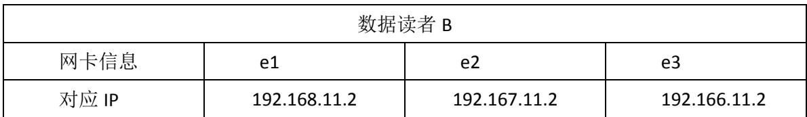
>
> **图示信息：**
>
> - A two-row table titled '数据读者 B' showing network interface information and corresponding IP addresses for three interfaces: e1, e2, and e3.

表 13-8 数据读者 C 节点环境

| 网卡信息 | e1 | e2 |
| --- | --- | --- |
| 对应IP | 192.168.11.3 | 192.167.11.3 |

期待通信效果如下：

> 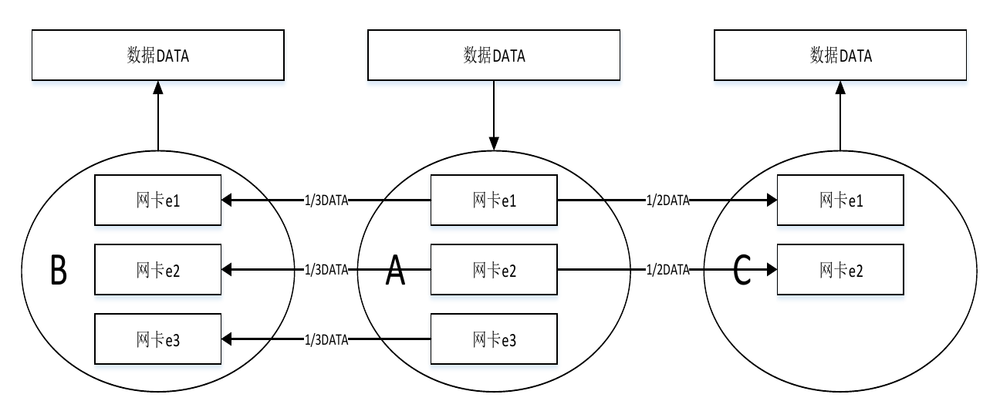
> **图 13-1 通信效果**
> **图示信息：** A data flow diagram showing three groups (B, A, C) each containing three network cards (网卡e1, 网卡e2, 网卡e3), with arrows indicating data distribution ratios from group A to B and C, and upward arrows from each group to '数据DATA'.
图 13-1 通信效果

配置方式如下：

数据写者 A:

`<participantfactory_qos name="default">`

`<property>`

`<value>`

`<element>`

<!-- 使用 cpu 序号代替掩码 -->

`<name>`sysctl.global.use_cpu_id`</name>`

`<value>`true`</value>`

`</element>`

`</participantfactory_qos>`

`<participant_qos name="tcp_dp">`

> 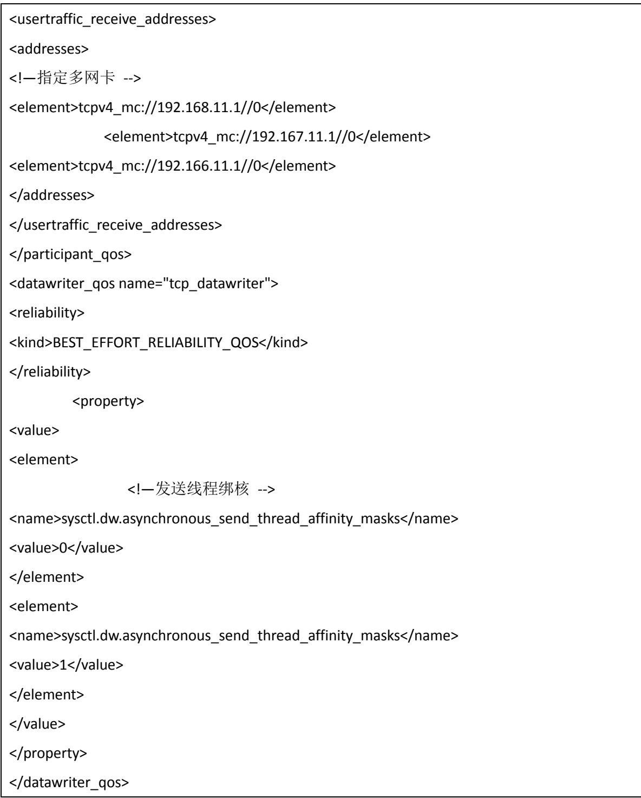
>

数据读者 B:

> 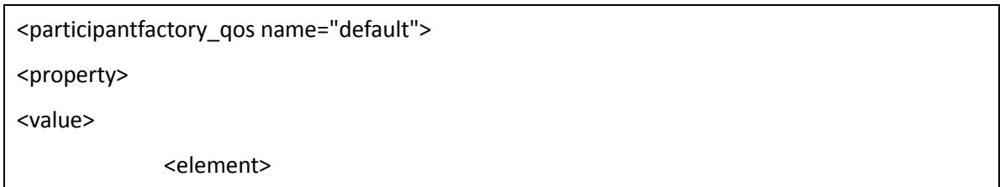
>

<!-- 使用 cpu 序号代替掩码 -->

`<name>`sysctl.global.use_cpu_id`</name>`

`<value>`true`</value>`

`</element>`

`</participantfactory_qos>`

`<participant_qos name="tcp_dp">`

`<usertraffic_receive_addresses>`

`<addresses>`

```text
<!—指定多网卡 -->
<element>tcpv4_mc://192.168.11.2//0</element>
<element>tcpv4_mc://192.167.11.2//0</element>
<element>tcpv4_mc://192.166.11.2//0</element>
```

`</addresses>`

`</usertraffic_receive_addresses>`

`<receiver_thread_config>`

<!—设置缓冲区长度 -->

`<receive_buffer_length>`20971520`</receive_buffer_length>`

`</receiver_thread_config>`

`<thread_core_affinity>`

<!—接收线程绑核 -->

`<tcp_receive_thread_affinity_masks>`

`<element>`5`</element>`

`<element>`6`</element>`

`</tcp_receive_thread_affinity_masks>`

`</thread_core_affinity>`

`<property>`

`<value>`

<!-- 使用单独的提交线程 -->

`<element>`

`<name>`sysctl.dp.use_callback_thread`</name>`

`<value>`true`</value>`

`</element>`

<!-- 底层接收缓冲区数量 -->

`<element>`

`<name>`sysctl.dp.recv_buffer_count`</name>`

`<value>`2`</value>`

`</element>`

<!-- 提交线程绑核掩码 -->

`<element>`

`<name>`sysctl.dp.callback_thread_affinity_mask`</name>`

`<value>`2`</value>`

`</element>`

`</value>`

`</property>`

`</participant_qos>`

`<datareader_qos name="tcp-datareader">`

`<reliability>`

`<kind>`BEST_EFFORT_RELIABILITY_QOS`</kind>`

`</reliability>`

`</datareader_qos>`

数据读者 C:

`<participantfactory_qos name="default">`

`<property>`

`<value>`

`<element>`

<!-- 使用 cpu 序号代替掩码 -->

`<name>`sysctl.global.use_cpu_id`</name>`

`<value>`true`</value>`

`</element>`

`</participantfactory_qos>`

`<participant_qos name="tcp_dp">`

`<usertraffic_receive_addresses>`

`<addresses>`

```text
<!—指定多网卡 -->
<element>tcpv4_mc://192.168.11.3//0</element>
```

`<element>`tcpv4_mc://192.167.11.3//0`</element>`

`</addresses>`

`</usertraffic_receive_addresses>`

`<receiver_thread_config>`

<!—设置缓冲区长度 -->

`<receive_buffer_length>`20971520`</receive_buffer_length>`

`</receiver_thread_config>`

`<thread_core_affinity>`

<!—接收线程绑核 -->

`<tcp_receive_thread_affinity_masks>`

`<element>`5`</element>`

`<element>`6`</element>`

`</tcp_receive_thread_affinity_masks>`

`</thread_core_affinity>`

`</participant_qos>`

`<datareader_qos name="tcp-datareader">`

`<reliability>`

`<kind>`BEST_EFFORT_RELIABILITY_QOS`</kind>`

`</reliability>`

`</datareader_qos>`

## 第14章 UDP 大包零拷贝

ZRDDS 为用户提供的零拷贝内置数据类型，使用零拷贝数据类型，可通过减少拷贝次数而提高

传输性能。但由于零拷贝数据类型不支持数据分片，无法应用于 UDP 大包传输。为解决此问题，ZRDDS

提供了大包零拷贝的特性大包零拷贝模式下只能使用尽力而为(BEST_EFFORT_RELIABILITY_QOS)的通

信方式，无法使用可靠(RELIABLE_RELIABILITY_QOS)通信方式。可通过配合使用 UDP 报文时延功能降

低数据丢包率，提高可靠性。当前此特性只支持 ZRDDS（>=2.4.0）下的 C、C++版本

本章主要包含以下内容：

- 大包零拷贝配置

- UDP 报文时延

- on_data_arrived 回调

### 14.1. 大包零拷贝配置

14.1.1 配置说明

14.1.1.1 发送端配置说明

表 14-1 大包零拷贝发送端配置项

|  | 所属实体 |  |  | 配置项 |  |  | 默认值 |  |
| --- | --- | --- | --- | --- | --- | --- | --- | --- |
| dw |  |  | sysctl.dw.align_payload |  |  | 0 |  |  |

sysctl.dw.align_payload

负载对齐长度。发送端会添加指定大小的 pad 包，使用户数据之前的数据大小对齐

sysctl.dw.align_payload所设定值，一般可设置为64或128。此值需保证与接收端sysctl.dr.align_payload

所设置值相同。

14.1.1.2 接收端配置说明

表 14-2 大包零拷贝接收端配置项

|  | 配置项 | 默认值 |
| --- | --- | --- |
|  | sysctl.dr.align_payload | 0 |
|  | sysctl.dr.recv_buffer_count | 1 |
|  | sysctl.dr.max_sample_size | 64*1024 |
|  | receive_addresses | N/A |

sysctl.dr.align_payload

负载对齐长度。接收端此值需保证与发送端 sysctl.dw.align_payload 所设置值相同。

sysctl.dr.recv_buffer_count

底层接收缓冲区数量，当前仅支持 1、2，为 2 时将会启动非零拷贝的租借反序列化。

sysctl.dr.max_sample_size

数据接收缓冲区总大小。

receive_addresses

底层传输协议配置与使用 IP 地址配置，当设置 sysctl.dr.recv_buffer_count 为 2 时，必须指定此

配置项。

14.1.2 配置示例

14.1.2.1 发送端配置示例

`<datawriter_qos name="best_effort_writer">`

`<reliability>`

`<kind>`BEST_EFFORT_RELIABILITY_QOS`</kind>`

`</reliability>`

`<property>`

`<value>`

`<element>`

`<name>`sysctl.dw.align_payload`</name>`

`<value>`128`</value>`

`</element>`

`</value>`

`</property>`

`</datawriter_qos>`

14.1.2.2 接收端配置示例

`<datareader_qos name="best_effort_reader">`

`<reliability>`

`<kind>`BEST_EFFORT_RELIABILITY_QOS`</kind>`

`</reliability>`

<!-- 指定使用 IP，根据实际情况修改 -->

`<receive_addresses>`

`<addresses>`

`<element>`udpv4://192.168.31.0//65536`</element>`

`</addresses>`

`</receive_addresses>`

`<property>`

`<value>`

`<element>`

`<name>`sysctl.dr.align_payload`</name>`

`<value>`128`</value>`

`</element>`

`<element>`

`<name>`sysctl.dr.recv_buffer_count`</name>`

`<value>`2`</value>`

`</element>`

`<element>`

`<name>`sysctl.dr.max_sample_size`</name>`

`<value>`2100004`</value>`

`</element>`

`</value>`

`</property>`

`</datareader_qos>`

### 14.2. UDP 报文时延

使用大包零拷贝时，由于其无法保证可靠性，可能会存在丢包问题。因此，需通过配置 UDP 报

文时延进行流量控制，从而减少丢包率。此特性与大包零拷贝特性相互独立，在普通的 UDP 传输中

也可使用。

14.2.1 配置说明

表 14-3 UDP 报文时延配置项

| 配置项 | 默认值 |
| --- | --- |
| sysctl.global.net.delay_count | 0 |
| sysctl.global.net.delay_time | 10 |
| sysctl.global.net.delay_size | 60*1024 |
| sysctl.global.net.delay_mode | 0 |

sysctl.global.net.delay_count

UDP 时延报文个数阈值。当超过 sysctl.global.net.delay_size 所规定大小的报文发送数量到达此值

时进行时延。

sysctl.global.net.delay_time

UDP 时延时间，单位为微秒。

sysctl.global.net.delay_size

UDP 报文大小阈值。当报文大小超过此阈值时，才计入发送个数，当发送个数大于

sysctl.global.net.delay_count 时进行时延。

sysctl.global.net.delay_mode

延时方式，0 为 sleep，1 为同步时延，2 为 for 循环时延，此项通常不需要配置。

14.2.2 配置示例

```text
<zrdds_qos xmlns="http://www.omg.org/dds/">
<qos_library name="default_lib">
<qos_profile name="default_profile">
<participantfactory_qos name="non_rio">
```

`<property>`

`<value>`

`<element>`

`<name>`sysctl.global.net.delay_count`</name>`

`<value>`2`</value>`

`</element>`

`<element>`

`<name>`sysctl.global.net.delay_time`</name>`

`<value>`10`</value>`

`</element>`

`<element>`

`<name>`sysctl.global.net.delay_size`</name>`

`<value>`60 * 1024`</value>`

`</element>`

`</value>`

`</property>`

`</participantfactory_qos>`

`</qos_profile>`

`</qos_library>`

`</zrdds_qos>`

### 14.3. on_data_arrived 回调

直接通知数据到达的回调函数，需用户手动设置监听器并编写回调函数处理逻辑。当且仅当设

置 sysctl.dr.use_data_arrived 为 true 时，会触发 on_data_arrived 回调函数，否则不会触发。若同时设

置 on_data_arrived 与 on_data_available 函数，将优先调用 on_data_arrived，此时在 on_data_available

中无需再做处理。具体使用方式可参照代码示例。

14.3.1 配置说明

表 14-4 回调 on_data_arrived 配置项

|  | 所属实体 |  |  | 配置项 |  |  | 默认值 |  |
| --- | --- | --- | --- | --- | --- | --- | --- | --- |
| dr |  |  | sysctl.dr.use_data_arrived |  |  | false |  |  |

14.3.2 代码示例

```text
class Mylistener : public DDS::DataReaderListener
{
void on_data_arrived(DataReader* reader, void* curSample, const SampleInfo& curInfo)
{
Bytes* sample = (Bytes*)curSample;
// 通过该语句获取收到的样本所属主题名称
const char* topicName = reader->get_topicdescription()->get_name();
// 非零拷贝（缓冲区类型）按照如下语句获取缓冲区指针与长度
const char* buffer = (const char*)sample->value.get_contiguous_buffer();
const unsigned int length = sample->value.length();
// TODO 在此填写业务处理
printf("received data(%s) length(%u) from topic(%s)\n", buffer, length, topicName);
}
};
int ZRDDSDemoModulesInitial()
{
// 获取入口，并指明 QoS 配置
DomainParticipantFactory* factory = DDSIF::Init(NULL, "non_rio");
if (factory == NULL) { printf("DDSIF::Initialize failed.\n"); return -1; }
// 初始化使用 udp 的域参与者
DomainParticipant* udpDp = DDSIF::CreateDP(150, "udp_dp");
if (NULL == udpDp) { printf("DDSIF::CreateDP failed.\n"); return -2; }
// 创建非零拷贝（缓冲区类型）数据读者，并设置监听器
g_zrddsModule.m_listener = new Mylistener();
DataReader* airTrackDr = DDSIF::SubTopic(
udpDp, "AirTrack", BytesTypeSupport::get_instance(), "best_effort_reader",
g_zrddsModule.m_listener);
if (NULL == airTrackDr) { printf("DDSIF::SubscribeTopic failed.\n"); return -4; }
return 0;
}
int main()
{
if (ZRDDSDemoModulesInitial() < 0) { getchar(); return -1; }
getchar();
DDSIF::Finalize();
return 0;
}
```

PART5 C 语言接口

## 第15章 C 接口

C 接口和 C++接口的使用在大致方向上一致，但存在着细微的差别，这些差别主要体现在 C 语

言和 C++的区别。下文将对此进行详细介绍

本章主要包括以下内容：

- C 接口简介

- C 接口使用方式

- C 接口使用的注意事项

### 15.1. C 接口的简介

以上章节中的示例程序通过 ZRDDS 的 C++接口描述，ZRDDS 除了提供 C++接口外，还提供 C 语

言接口，C 语言的接口和 C++接口使用方式几乎一样，二者之间的数据类型和接口也都是一一对应

的。C 语言接口和 C++接口的区别主要体现在两处：

1. C++接口中的类型及接口均包含在 DDS 命名空间中，而 C 语言与之对应的为在所有类型接

口名前添加”DDS_”前缀代替 C++中的作用域，注意：全局的常量、枚举成员等 C 与 C++接

口相同，在名称前面均包含”DDS_”前缀；。

2. C 语言接口与 C++对应接口的名字不同，且比 C++多一个参数。具体规则如下：

a) C 语言接口 ： DDS_`<Entity>`_operatorname(DDS_Entity*self,DDS_ParaType1 para1,

DDS_ParaType2 para2, ...)。

b) C++接口：`<Entity>`::operatorname(ParaType1 para1, ParaType2 para2, ...)。

C 语言与 C++接口的对应关系，详见表 15-1（其中的 FooDataReader 和 FooDataWriter 只是一个

例子，用户可以根据自己的需要替换它们）。

表 15-1 C 接口与 C++接口的对照表

|  | C接口 | C++接口 |
| --- | --- | --- |
|  | DDS_DomainParticipantFactory _create_participant | create_participant |
|  | DDS_DomainParticipantFactory _delete_participant | delete_participant |
|  | DDS_DomainParticipantFactory<br>_get_default_participant_qos | get_default_participant_qos |
|  | DDS_DomainParticipantFactory<br>_set_default_participant_qos | set_default_participant_qos |
|  | DDS_DomainParticipantFactory _lookup_participant | lookup_participant |
|  | DDS_DomainParticipantFactory _get_instace | get_instace |
|  | DDS_DomainParticipantFactory _get_qos | get_qos |
|  | DDS_DomainParticipantFactory _set_qos | set_qos |
| DomainPartici<br>pant | DDS_DomainParticipant_enable | enable |
|  | DDS_DomainParticipant_get_listener | get_listener |
|  | DDS_DomainParticipant_set_listener | set_listener |
|  | DDS_DomainParticipant_get_qos | get_qos |
|  | DDS_DomainParticipant_set_qos | set_qos |
|  | DDS_DomainParticipant_get_domain_id | get_domain_id |
|  | DDS_DomainParticipant_get_instance_handle | get_instance_handle |
|  | DDS_DomainParticipant_get_status_changes | get_status_changes |
|  | DDS_DomainParticipant_get_statuscondition | get_statuscondition |
|  | DDS_DomainParticipant_delete_contained_entities | delete_contained_entities |
|  | DDS_DomainParticipant_contains_entity | contains_entity |
|  | DDS_DomainParticipant_assert_liveliness | assert_liveliness |
|  | DDS_DomainParticipant_get_discovered_participant_data | get_discovered_participant_da<br>ta |
|  | DDS_DomainParticipant_get_discovered_participants | get_discovered_participants |
|  | DDS_DomainParticipant_ignore_participant | ignore_participant |
|  | DDS_DomainParticipant_create_topic | create_topic |
|  | DDS_DomainParticipant_delete_topic | delete_topic |
|  | DDS_DomainParticipant_get_default_topic_qos | get_default_topic_qos |
|  | DDS_DomainParticipant_set_default_topic_qos | set_default_topic_qos |
|  | DDS_DomainParticipant_find_topic | find_topic |
|  | DDS_DomainParticipant_lookup_topicdescription | lookup_topicdescription |
|  | DDS_DomainParticipant_create_contentfilteredtopic | create_contentfilteredtopic |
|  | DDS_DomainParticipant_delete_contentfilteredtopic | delete_contentfilteredtopic |
|  | DDS_DomainParticipant_create_publisher | create_publisher |
|  | DDS_DomainParticipant_delete_publisher | delete_publisher |
|  | DDS_DomainParticipant_get_default_publisher_qos | get_default_publisher_qos |
|  | DDS_DomainParticipant_set_default_publisher_qos | set_default_publisher_qos |
|  | DDS_DomainParticipant_get_publisher | get_publisher |
|  | DDS_DomainParticipant_ignore_publication | ignore_publication |
|  | DDS_DomainParticipant_create_subscriber | create_subscriber |
|  | DDS_DomainParticipant_delete_subscriber | delete_subscriber |
|  | DDS_DomainParticipant_get_default_subscriber_qos | get_default_subscriber_qos |
|  | DDS_DomainParticipant_set_default_subscriber_qos | set_default_subscriber_qos |
|  | DDS_DomainParticipant_get_subscriber | get_subscriber |
|  | DDS_DomainParticipant_get_builtin_subscriber | get_builtin_subscriber |
|  | DDS_DomainParticipant_ignore_subscription | ignore_subscription |
| Topic | DDS_Topic_enable | enable |
|  | DDS_Topic_get_listener | get_listener |
|  | DDS_Topic_set_listener | set_listener |
|  | DDS_Topic_get_qos | get_qos |
|  | DDS_Topic_set_qos | set_qos |
|  | DDS_Topic_get_inconsistent_topic_status | get_inconsistent_topic_status |
|  | DDS_Topic_get_participant | get_participant |
|  | DDS_Topic_get_instance_handle | get_instance_handle |
|  | DDS_Topic_get_name | get_name |
|  | DDS_Topic_get_type_name | get_type_name |
|  | DDS_Topic_get_status_changes | get_status_changes |
|  | DDS_Topic_get_statuscondition | get_statuscondition |
| TopicDescripti<br>on | DDS_TopicDescription_get_participant | get_participant |
|  | DDS_TopicDescription_get_type_name | get_type_name |
|  | DDS_TopicDescription_get_name | get_name |
| ContenFiltere<br>dTopic | DDS_ ContenFilteredTopic _set_expression_parameters | set_expression_parameters |
|  | DDS_ ContenFilteredTopic _get_expression_parameters | get_expression_parameters |
|  | DDS_ ContenFilteredTopic _get_related_topic | get_related_topic |
|  | DDS_ ContenFilteredTopic _get_participant | get_participant |
|  | DDS_ ContenFilteredTopic _get_type_name | get_type_name |
|  | DDS_ ContenFilteredTopic _get_name | get_name |
| Publisher | DDS_Publisher_enable | enable |
|  | DDS_Publisher_get_listener | get_listener |
|  | DDS_Publisher_set_listener | set_listener |
|  | DDS_Publisher_get_qos | get_qos |
|  | DDS_Publisher_set_qos | set_qos |
|  | DDS_Publisher_create_datawriter | create_datawriter |
|  | DDS_Publisher_delete_datawriter | delete_datawriter |
|  | DDS_Publisher_delete_contained_entities | delete_contained_entities |
|  | DDS_Publisher_lookup_datawriter | lookup_datawriter |
|  | DDS_Publisher_copy_from_topic_qos | copy_from_topic_qos |
|  | DDS_Publisher_get_default_datawriter_qos | get_default_datawriter_qos |
|  | DDS_Publisher_set_default_datawriter_qos | set_default_datawriter_qos |
|  | DDS_Publisher_begin_coherent_changes(0 | begin_coherent_changes(0 |
|  | DDS_Publisher_end_coherent_changes | end_coherent_changes |
|  | DDS_Publisher_get_participant | get_participant |
|  | DDS_Publisher_get_instance_hanle | get_instance_hanle |
|  | DDS_Publisher_get_status_changes | get_status_changes |
|  | DDS_Publisher_get_statuscondition | get_statuscondition |
|  | DDS_Publisher_wait_for_acknowledgments | wait_for_acknowledgments |
|  | DDS_Publisher_suspend_publications | suspend_publications |
|  | DDS_Publisher_resume_publications | resume_publications |
| Subscriber | DDS_Subscriber_enable | enable |
|  | DDS_Subscriber_get_listener | get_listener |
|  | DDS_Subscriber_set_listener | set_listener |
|  | DDS_Subscriber_get_qos | get_qos |
|  | DDS_Subscriber_set_qos | set_qos |
|  | DDS_Subscriber_create_datareader | create_datareader |
|  | DDS_Subscriber_delete_datareader | delete_datareader |
|  | DDS_Subscriber_lookup_datareader | lookup_datareader |
|  | DDS_Subscriber_get_datareaders | get_datareaders |
|  | DDS_Subscriber_notify_datareaders | notify_datareaders |
|  | DDS_Subscriber_copy_from_topic_qos | copy_from_topic_qos |
|  | DDS_Subscriber_get_default_datareader_qos | get_default_datareader_qos |
|  | DDS_Subscriber_set_default_datareader_qos | set_default_datareader_qos |
|  | DDS_Subscriber_get_participant | get_participant |
|  | DDS_Subscriber_get_instance_handle | get_instance_handle |
|  | DDS_Subscriber_get_status_changes | get_status_changes |
|  | DDS_Subscriber_get_statuscondition | get_statuscondition |
| StatusConditi<br>on | DDS_StatusCondition_get_trigger_value | get_trigger_value |
|  | DDS_StatusCondition_set_enabled_statuses | set_enabled_statuses |
|  | DDS_StatusCondition_get_enabled_statuses | get_enabled_statuses |
|  | DDS_StatusCondition_get_entity | get_entity |
| GuradConditi<br>on | DDS_GuardCondition_get_trigger_value | get_trigger_value |
|  | DDS_GuardCondition_set_trigger_value | set_trigger_value |
| ReadConditio<br>n | DDS_ReadCondition_get_trigger_value | get_trigger_value |
|  | DDS_ReadCondition_get_datareader | get_datareader |
|  | DDS_ReadCondition_get_sample_state_mask | get_sample_state_mask |
|  | DDS_ReadCondition_get_view_state_mask | get_view_state_mask |
|  | DDS_ReadCondition_get_instance_state_mask | get_instance_state_mask |
| Entity | DDS_Entity_get_instance_handle | get_instance_handle |
|  | DDS_Entity_get_statuscondition | get_statuscondition |
|  | DDS_Entity_get_status_changes | get_status_changes |
| WaitSet | DDS_WaitSet_attach_condition | attach_condition |
|  | DDS_WaitSet_detach_condition | detach_condition |
|  | DDS_WaitSet_wait | wait |
|  | DDS_WaitSet_get_conditions | get_conditions |
| FooDataRead<br>er | FooDataReader_read | read |
|  | FooDataReader_take | take |
|  | FooDataReader_read_next_sample | read_next_sample |
|  | FooDataReader_take_next_sample | take_next_sample |
|  | FooDataReader_read_instance | read_instance |
|  | FooDataReader_take_instance | take_instance |
|  | FooDataReader_read_next_instance | read_next_instance |
|  | FooDataReader_take_next_instance | take_next_instance |
|  | FooDataReader_read_next_instance_w_condition | read_next_instance_w_conditi<br>on |
|  | FooDataReader_take_next_instance_w_condition | take_next_instance_w_conditi<br>on |
|  | FooDataReader_read_w_condition | read_w_condition |
|  | FooDataReader_take_w_condition | take_w_condition |
|  | FooDataReader_return_loan | return_loan |
|  | FooDataReader_get_key_value | get_key_value |
|  | FooDataReader_lookup_instance | lookup_instance |
|  | FooDataReader_create_readcondition | create_readcondition |
|  | FooDataReader_delete_readcondition | delete_readcondition |
|  | FooDataReader_delete_contained_entities | delete_contained_entities |
|  | FooDataReader_create_querycondition | create_querycondition |
|  | FooDataReader_set_qos | set_qos |
|  | FooDataReader_get_qos | get_qos |
|  | FooDataReader_set_listener | set_listener |
|  | FooDataReader_enable | enable |
|  | FooDataReader_get_listener | get_listener |
|  | FooDataReader_get_liveliness_changed_status | get_liveliness_changed_status |
|  | FooDataReader_get_requested_deadline_missed_status | get_requested_deadline_miss<br>ed_status |
|  | FooDataReader_get_subscription_matched_status | get_subscription_matched_sta<br>tus |
|  | FooDataReader_get_matched_publication_data | get_matched_publication_dat<br>a |
|  | FooDataReader_get_matched_publications | get_matched_publications |
|  | FooDataReader_get_sample_lost_status | get_sample_lost_status |
|  | FooDataReader_get_sample_rejected_status | get_sample_rejected_status |
|  | FooDataReader_get_subscriber | get_subscriber |
|  | FooDataReader_get_topic_description | get_topicdescription |
|  | FooDataReader_get_requested_incompatible_qos_status | get_requested_incompatible_<br>qos_status |
|  | FooDataReader_wait_for_historical_data | wait_for_historical_data |
| FooDataWrite<br>r | FooDataWriter_write | write |
|  | FooDataWriter_write_w_timestamp | write_w_timestamp |
|  | FooDataWriter_register_instance | register_instance |
|  | FooDataWriter_register_instance_w_timestamp | register_instance_w_timestam<br>p |
|  | FooDataWriter_unregister_instance | unregister_instance |
|  | FooDataWriter_unregister_instance_w_timestamp | unregister_instance_w_timest<br>amp |
|  | FooDataWriter_dispose | dispose |
|  | FooDataWriter_dispose_w_timestamp | dispose_w_timestamp |
|  | FooDataWriter_get_key_value | get_key_value |
|  | FooDataWriter_lookup_instance | lookup_instance |
|  | FooDataWriter_assert_liveliness | assert_liveliness |
|  | FooDataWriter_get_liveliness_lost_status | get_liveliness_lost_status |
|  | FooDataWriter_get_offered_deadline_missed_status | get_offered_deadline_missed_<br>status |
|  | FooDataWriter_get_publication_matched_status | get_publication_matched_stat<br>us |
|  | FooDataWriter_get_matched_subscription_data | get_matched_subscription_da<br>ta |
|  | FooDataWriter_get_matched_subscriptions | get_matched_subscriptions |
|  | FooDataWriter_set_qos | set_qos |
|  | FooDataWriter_get_qos | get_qos |
|  | FooDataWriter_set_listener | set_listener |
|  | FooDataWriter_enable | enable |
|  | FooDataWriter_get_listener | get_listener |
|  | FooDataWriter_get_topic | get_topic |
|  | FooDataWriter_get_publisher | get_publisher |
|  | FooDataWriter_get_offered_incompatible_qos_status | get_offered_incompatible_qos<br>_status |
|  | FooDataWriter_wait_for_acknowledgments | wait_for_acknowledgments |

### 15.2. C 接口使用方式

C 语言接口的使用方式与 C++相对应的接口的使用方式类似，因此不在此进行重复赘述。C 语言

接口的具体使用方式请参考相对应的 C++接口和下面的例子。

例：C 语言应用程序实例：

订阅端：

include "DomainParticipantFactory.h"

```text
#include "DomainParticipant.h"
#include "DefaultQos.h"
#include "Subscriber.h"
#include "DataReader.h"
#include "Topic.h"
#include "DataReaderListener.h"
#include "Foo.h"
#include "FooDataReader.h"
#include "FooTypeSupport.h"
#include <stdio.h>
#include <string.h>
void MyListener_on_data_available(DDS_DataReader *the_reader)
{
printf("received data.\n");
FooDataReader *_reader = (FooDataReader*)the_reader;
FooSeq data_values;
FooSeq_initialize(&data_values);
DDS_SampleInfoSeq sample_infos;
DDS_SampleInfoSeq_initialize(&sample_infos);
if (NULL == the_reader)
{
printf("datareader error.\n");
return;
}
FooDataReader_take(_reader, &data_values, &sample_infos, MAX_INT32_VALUE,
DDS_ANY_SAMPLE_STATE, DDS_ANY_VIEW_STATE, DDS_ANY_INSTANCE_STATE);
for (int i = 0; i < sample_infos._length; i++)
{
FooPrintData(FooSeq_get_reference(&data_values,i));
}
FooDataReader_return_loan(_reader, &data_values, &sample_infos);
return;
}
int main()
{
/*域*/
DDS_DomainId_t domainId = 11;
DDS_DomainParticipantFactory* factory =
DDS_DomainParticipantFactory_get_instance();
if (NULL == factory)
{
printf("get insance failed.\n");
return -1;
}
/*域参与者*/
DDS_DomainParticipant *participant =
DDS_DomainParticipantFactory_create_participant(factory, domainId,
&DOMAINPARTICIPANT_QOS_DEFAULT, NULL, DDS_STATUS_MASK_NONE);
if (NULL == participant)
{
printf("create participant failed.\n");
return -1;
}
/*注册类型*/
const char* type_name = FooTypeSupport_get_type_name();
if (NULL == type_name)
{
printf("get type name failed.\n");
return -1;
}
DDS_ReturnCode_t ret =FooTypeSupport_register_type(participant, type_name);
if (ret != DDS_RETCODE_OK)
{
printf("register type failed.\n");
return -1;
}
/*主题*/
DDS_Topic *topic = DDS_DomainParticipant_create_topic(participant, "example",
type_name, &TOPIC_QOS_DEFAULT, NULL, DDS_STATUS_MASK_NONE);
if (NULL == topic)
{
printf("get topic failed.\n");
return -1;
}
/*订阅端*/
DDS_Subscriber *subscriber = DDS_DomainParticipant_create_subscriber(participant,
&SUBSCRIBER_QOS_DEFAULT, NULL, DDS_STATUS_MASK_NONE);
if (NULL == subscriber)
{
printf("create suscriber failed.\n");
return -1;
}
/*设置监听器*/
DDS_DataReaderListener readerListener;
memset(&readerListener, 0, sizeof(readerListener));
readerListener.on_data_available = MyListener_on_data_available;
/*datareader*/
DDS_DataReaderQos datareader_qos;
DDS_Subscriber_get_default_datareader_qos(subscriber, &datareader_qos);
datareader_qos.history.depth = 5;
DDS_DataReader *reader = DDS_Subscriber_create_datareader(subscriber,
(DDS_TopicDescription*)topic, &datareader_qos, &readerListener, DDS_STATUS_MASK_ALL);
if (NULL == reader)
{
printf("create datareader failed.\n");
return -1;
}
FooDataReader *_reader = (FooDataReader*)(reader);
while (true)
{
ZRSleep(1000);
}
return 0;
}
```

发布端：

```text
#include "DomainParticipantFactory.h" #include "DomainParticipant.h" #include "DefaultQos.h" #include "Publisher.h" #include "DataWriter.h" #include "FooTypeSupport.h" #include "FooDataWriter.h" #include "Foo.h" #include <stdio.h> #include "ZRSleep.h" int main() { /*域*/ DDS_DomainId_t domainId = 150; DDS_DomainParticipantFactory* DDS_DomainParticipantFactory_get_instance(); if (NULL == factory)
```

DDS_DomainParticipantFactory* factory =

```text
{
printf("get instance failed.\n");
return -1;
}
/*域参与者*/
DDS_DomainParticipant *participant =
DDS_DomainParticipantFactory_create_participant(factory, domainId,
&DOMAINPARTICIPANT_QOS_DEFAULT, NULL, DDS_STATUS_MASK_NONE);
if (NULL == participant)
{
printf("create participant failed.\n");
return -1;
}
/*注册类型*/
const char* type_name = FooTypeSupport_get_type_name();
if (NULL == type_name)
{
printf("get type name failed.\n");
return -1;
}
DDS_ReturnCode_t rtn = FooTypeSupport_register_type(participant, type_name);
if (rtn != DDS_RETCODE_OK)
{
printf("register type failed.\n");
return -1;
}
/*主题*/
DDS_Topic *topic = DDS_DomainParticipant_create_topic(participant, "example",
type_name, &TOPIC_QOS_DEFAULT, NULL, DDS_STATUS_MASK_NONE);
if (NULL == topic)
{
printf("create topic failed.\n");
return -1;
}
/*发布端*/
DDS_Publisher *publisher = DDS_DomainParticipant_create_publisher(participant,
&PUBLISHER_QOS_DEFAULT, NULL, DDS_STATUS_MASK_NONE);
if(NULL == publisher)
{
printf("create publisher failed.\n");
return -1;
}
/*datawriter*/
DDS_DataWriterQos datawriter_qos;
DDS_Publisher_get_default_datawriter_qos(publisher, &datawriter_qos);
datawriter_qos.history.depth = 5;
DDS_DataWriter *writer = DDS_Publisher_create_datawriter(publisher, topic,
&datawriter_qos, NULL, DDS_STATUS_MASK_NONE);
if(NULL == writer)
{
printf("create datawriter failed.\n");
return -1;
}
FooDataWriter *_writer = (FooDataWriter*)(writer);
/*data*/
Foo data;
FooInitialize(&data);
DDS_InstanceHandle_t handle = FooDataWriter_register_instance(_writer, &data);
while (true)
{
/*此处可以对data 赋值*/
FooDataWriter_write(_writer, &data, &handle);
printf("send a data\n");
ZRSleep(1000);
}
return 0;
}
```

### 15.3. C 接口使用的注意事项

由于 C 接口不存在类这一概念，因此也不存在相应的初始化函数和析构函数，所以需要注意以

下两点：

1. 在堆上创建数据变量时，要采用相应的函数进行分配初始化、删除（或者自己使用 C 语言

的 malloc()函数进行创建，并对变量的每个成员进行初始赋值，删除时采用 free()函数）。

2. 在栈上创建数据变量时，也要记得采用相应的函数进行初始化（或手动赋值）。

注意：特别是*Seq 类型的变量，在栈上创建后，要调用*_initialize()函数进行初始化。

例如：在栈上创建一个 ZRStringSeq 类型的变量 seq。

```text
DDS_StringSeq seq;
DDS_StringSeq_initialize(&seq);
```

PART 6 多种接口风格及开发流程

## 第16章标准协议接口

标准协议接口，即 OMG DDS 标准中所规定的接口。

本章节将主要介绍标准协议接口的基本使用及代码示例。包括以下内容：

- 标准协议接口的使用

- 标准协议接口代码示例

### 16.1. 标准协议接口的使用

#### 16.1.1. 开发流程

图 13-1 给出了 ZRDDS 应用程序开发流程的简单示意。

> 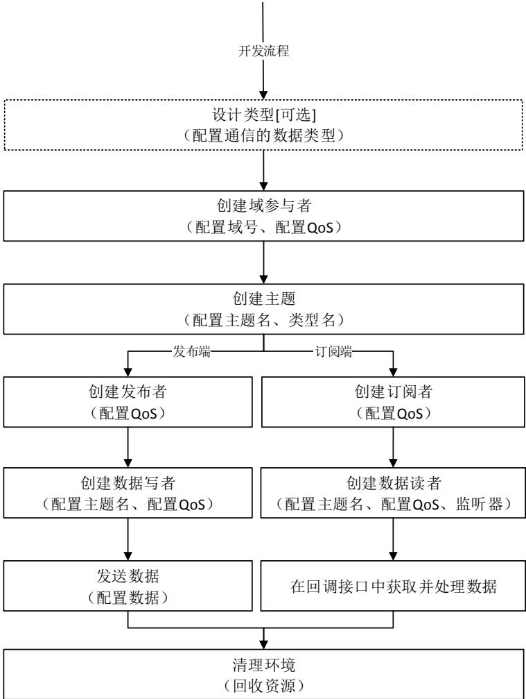
>
> **图示信息：**
>
> - A flowchart titled '开发流程' showing a top-down development workflow with branching for publisher and subscriber paths.

图 13-1 标准协议接口开发流程

图 13-2、图 13-3 分别给出了各个步骤在发布端、订阅端所映射的 DDS 标准协议接口。用户可

以按照此流程进行开发，使用标准协议接口编写出最简单的数据收发程序。

> 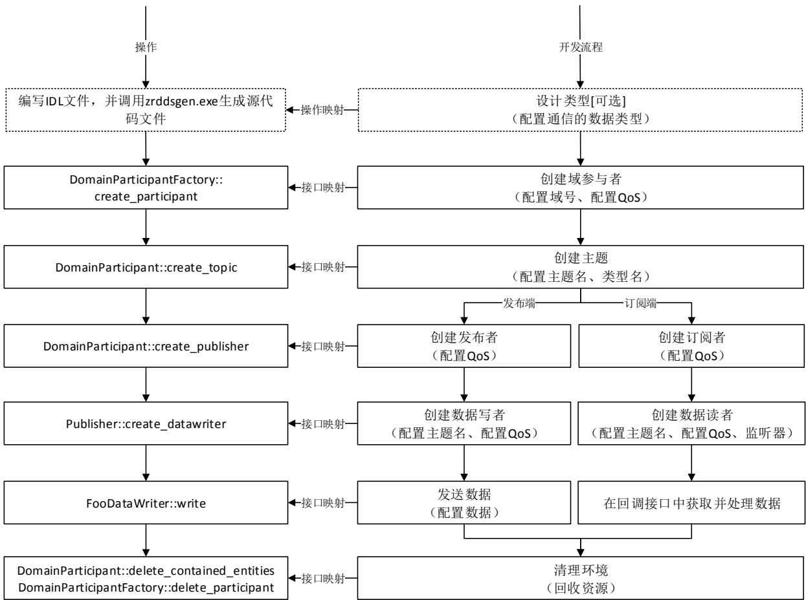
>
> **图示信息：**
>
> - A dual-column flowchart showing the development process (right column) and corresponding operation steps with API calls (left column), linked by '接口映射' arrows.

图 13-2 标准协议接口开发流程（发布端）

> 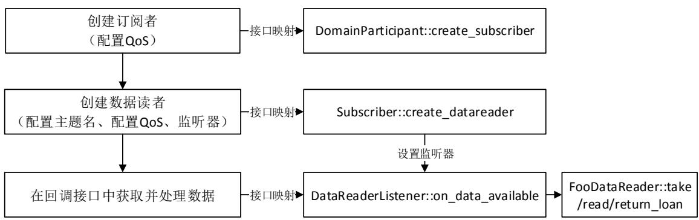
>
> **图示信息：**
>
> - A flowchart showing the development workflow for a standard protocol interface, with three main steps on the left mapped to corresponding method calls on the right via '接口映射' (interface mapping) arrows.

图 13-3 标准协议接口开发流程（订阅端）

注：图中订阅端采用的是监听器接收、处理到达数据。在实际的标准协议接口中，订阅端也可

以采用条件-等待模型来接收、处理数据。

16.1.2 主要接口介绍

下表列出了开发流程中所涉及的主要接口。

表 16-1 标准协议接口开发流程主要接口

| 接口名称 | 说明 |
| --- | --- |
| DDS::DomainParticipantFactory::get_instance() | 初始化ZRDDS，并获取域参与者工厂。 |
| DDS::DomainParticipantFactory::create_participant() | 创建域参与者，并配置域、QoS、监听器。 |
| DDS::DomainParticipant::create_topic() | 创建主题实体，并设置主题名称、关联的数<br>据类型、QoS以及监听器。 |
| DDS::DomainParticipant::create_publisher() | 创建发布者实体，并设置QoS、监听器。 |
| DDS::DomainParticipant::create_subscriber() | 创建订阅者实体，并设置QoS、监听器。 |
| DDS::Publisher::create_datawriter() | 创建与指定主题关联的数据写者，并设置<br>QoS、监听器。 |
| DDS::Subscriber::create_datareader() | 创建与指定主题关联的数据读者，并设置<br>QoS、监听器。 |
| DDS::ZRDDSDataWriter::write() | 向DDS系统发布数据。 |
| DDS::DataReaderListener | 数据读者监听器监听器，用户需要继承该监<br>听器并重载on_data_available，实现数据的获<br>取、处理逻辑。 |
| DDS::ZRDDSDataReader::read() | 从数据读者底层获取用户样本数据。当数据<br>到达并调用用户实现的 on_data_available 函<br>数时，用户可通过该函数获取数据。 |
| DDS::ZRDDSDataReader::take() | 从数据读者底层取出到达的样本数据。当数<br>据到达并调用用户实现的 on_data_available<br>函数时，用户可通过该函数取出数据。 |
| DDS::ZRDDSDataReader::return_loan() | 采用 take 函数取出数据后，需要调用该函数<br>进行空间的归还。 |
| DDS::DomainParticipant::delete_contained_entities() | 删除域参与者创建的所有实体。 |
| DDS::DomainParticipantFactory::delete_participant() | 删除指定的域参与者。在调用该方法之前需<br>要保证该域参与者的所有子实体都已经被删<br>除。 |

### 16.2. 标准协议接口代码示例

C++ 语言可参见安装目录下开发者手册 （ `/doc/ZRDDS_CPP_UserManual.chm` 或

doc`/cpp/html/index.html`）中示例：

 发布端：DataReceiveByListener/main_pub.cpp

 订阅端：

 采用监听器：DataReceiveByListener/main_sub.cpp

 采用条件-等待：DataReceiveByWaitSet/main_sub.cpp

C 语言可参见安装目录下开发者手册（`/doc/ZRDDS_C_UserManual.chm` 或 doc`/c/html/index.html`）

中示例：

 发布端：DataReceiveByListener/main_pub.c

 订阅端：

 采用监听器：DataReceiveByListener/main_sub.c

 采用条件-等待：DataReceiveByWaitSet/main_sub.c

## 第17章扩展接口

ZRDDS 在保留扩展性以及兼容性的基础上，在标准协议接口之上进行了扩展，以减轻开发难度

以及代码复杂度。

相比于标准协议接口，扩展的接口提供以下功能：

 支持 XML 配置 QoS，实现不修改程序也可以修改实体的 QoS：

 可指定 QoS 的 XML 配置文件路径加载至 ZRDDS 内部，形成 QoS 仓库；

 可使用 QoS 仓库中的 QoS 配置来创建/初始化各类实体，包括域参与者工厂、域参与

者、数据写者及数据读者；

 可使用 QoS 仓库中的 QoS 配置初始化实体 QoS；

 使用方式参见第 20 章 XML 配置实体 QoS。

 简单的数据监听器（SimpleDataReaderListener）

 定义了简单处理逻辑的数据读者回调处理函数。当有数据到达时，用户可以直接在

on_process_sample 的回调参数中获取到数据，不需要用户手动调用 take/read 系列函

数；

 实体创建逻辑精简化

 创建域参与者时，ZRDDS 内部会预先创建发布者、订阅者。

 在创建域参与者后，可跳过发布者、订阅者的动作，直接创建主题、数据写者、数据

读者：

 创建主题时，会先查找该主题是否已经创建。如果没有则自动创建，否则将使用已经

创建的主题；

 使用预先创建好的发布者、订阅者来创建主题关联的数据写者、读者。

 实体回收逻辑精简化

 为域参与者工厂添加了删除所有子实体的接口，简化资源回收逻辑。

本章将主要介绍扩展接口的基本使用及代码示例。并且，在本章的末尾将以表格形式列出 ZRDDS

针对上述功能所扩展的接口。

本章主要包括以下内容：

- 扩展接口的使用

- 标准协议接口代码示例

- 扩展内容一览

### 17.1. 扩展接口的使用

#### 17.1.1. 开发流程

扩展接口的开发流程及其操作映射如图 14-1 所示。

> 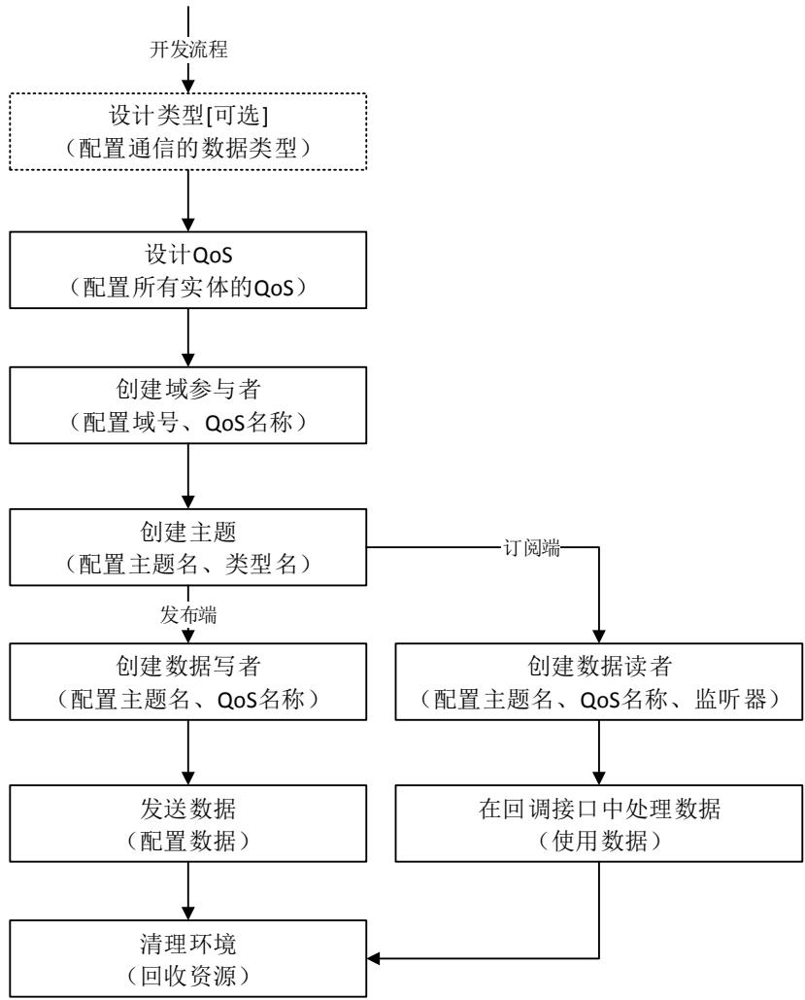
>
> **图示信息：**
>
> - A vertical flowchart depicting the development process for an extension interface, with a branching path after '创建主题' (Create Topic) into '发布端' (Publisher) and '订阅端' (Subscriber) streams.

图 14-1 扩展接口开发流程

图 14-2、图 14-3 分别给出了各个步骤在发布端、订阅端所映射的扩展接口。用户可以按照此流

程进行开发，使用扩展接口编写出最简单的数据收发程序。

> 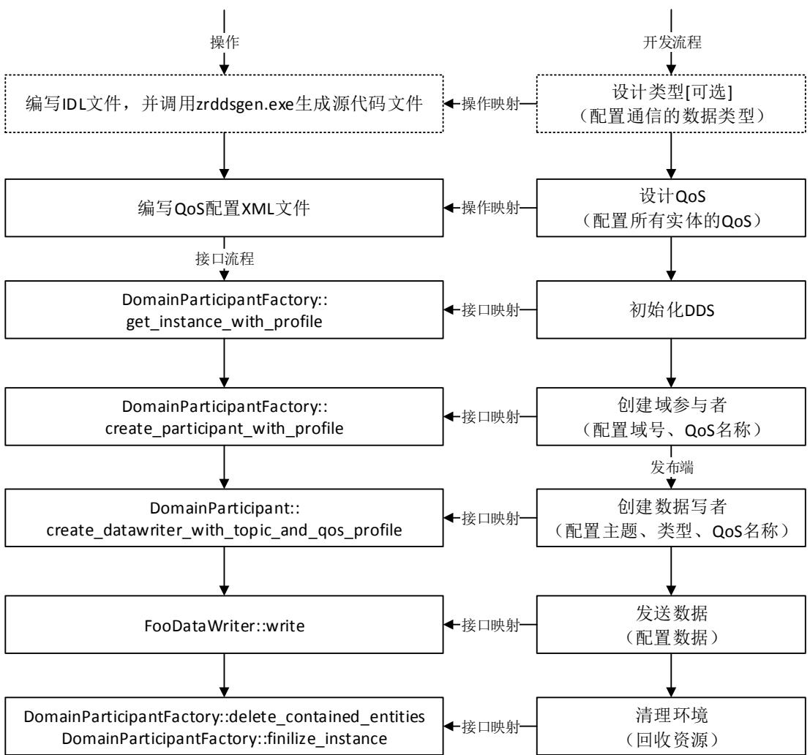
>
> **图示信息：**
>
> - A dual-column flowchart showing the mapping between development process steps (right column) and corresponding operation steps with interface calls (left column), connected by '操作映射' and '接口映射' labels.

图 14-2 扩展接口开发流程（发布端）

> 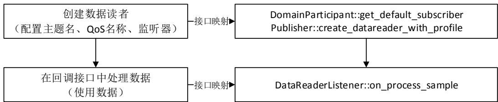
>
> **图示信息：**
>
> - A flow diagram showing the mapping between data reader creation and callback handling via interface mappings.

图 14-3 扩展接口开发流程（订阅端）

#### 17.1.2. 主要接口介绍

下表列出了开发流程中所涉及的主要接口。

表 17-1 扩展开发流程主要接口

|  | 接口名称 |  |  | 说明 |  |
| --- | --- | --- | --- | --- | --- |
| DDS::DomainParticipantFactory::get_in<br>stance_w_profile() |  |  | 初始化ZRDDS，并获取域参与者工厂。 |  |  |
| DDS::DomainParticipantFactory::create<br>_participant_with_qos_profile() |  |  | 创建域参与者，并配置域、QoS、监听器。 |  |  |
| DDS::DomainParticipant::create_datawr<br>iter_with_topic_and_qos_profile() |  |  | 创建与指定主题名称、类型名称关联的数据写者，并设置<br>QoS、监听器。 |  |  |
| DDS::DomainParticipant::create_datare<br>ader_with_topic_and_qos_profile() |  |  | 创建与指定主题名称、类型名称关联的数据读者，并设置<br>QoS、监听器。 |  |  |
| DDS::ZRDDSDataWriter::write |  |  | 向 DDS 系统发布数据，由于 DDS 的强类型安全，应转化为<br>特定类型的数据写者调用write函数，如零拷贝的数据写者，<br>应调用 ZeroCopyBytesDataWriter::write 接口，对于非零拷贝<br>（缓冲区类型）应调用 BytesDataWriter::write。 |  |  |
| DDS::SimpleDataReaderListener |  |  | 默认简单的数据到达监听器，用户继承该监听器并在<br>DDS::SimpleDataReaderListener< T, TSeq,<br>TDataReader >::on_process_sample 中处理到达的样本。 |  |  |
| DDS::DomainParticipantFactory::delete<br>_contained_entities() |  |  | 删除该程序创建的所有的实体。 |  |  |
| DDS::DomainParticipantFactory::finalize<br>_instance() |  |  | 回收DDS中间件所有资源。 |  |  |

### 17.2. 标准协议接口代码示例

模拟三个应用程序，其交互逻辑图如下，app1 与 app2 通过 UDP 网络交互 AirTrack 主题，app1

与 app3 之间通过 RIO 交互 SeaTrack 主题，均使用零拷贝数据类型。

> 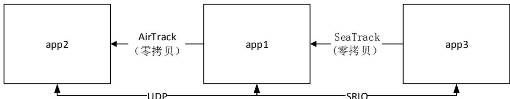
>
> **图示信息：**
>
> - A block diagram showing three applications (app1, app2, app3) connected via labeled data paths and protocols.

UDP SRIO

图 14-4 示例通信场景图

C++ 语言可参见安装目录下开发者手册 （ `/doc/ZRDDS_CPP_UserManual.chm` 或

doc`/cpp/html/index.html`）中示例：

 其中 QoS 配置文件示例参见 ExtendInterface/ZRDDS_QOS_PROFILES.xml

 其中 app1 的代码参见 ExtendInterface/app1.cpp

 其中 app2 的代码参见 ExtendInterface/app2.cpp

 其中 app3 的代码参见 ExtendInterface/app3.cpp

C 语言可参见安装目录下开发者手册（`/doc/ZRDDS_C_UserManual.chm` 或 doc`/c/html/index.html`）

中示例：

 其中 QoS 配置文件示例参见 ExtendInterface/ZRDDS_QOS_PROFILES.xml

 其中 app1 的代码参见 ExtendInterface/app1.c

 其中 app2 的代码参见 ExtendInterface/app2.c

 其中 app3 的代码参见 ExtendInterface/app3.c

### 17.3. 扩展内容一览

下表介绍了扩展接口相较于标准协议所扩展的内容。

表 17-2 扩展开发流程主要接口

|  | 接口名称 | 说明 |
| --- | --- | --- |
|  | DDS_QosProfileQosPolicy | 域参与者工厂的QoS，定义与Qos配置文件有关的配置<br>项。 |
|  | DDS::DomainParticipantFactory::<br>reload_qos_profiles | 根据QosProfileQosPolicy（有关QoS配置的配置）配置<br>重新加载QoS配置到库中。 |
|  | DDS::DomainParticipantFactory::<br>unload_qos_profiles | 卸载所有的QoS配置。 |
|  | DDS::DomainParticipantFactory::<br>add_qos_library | 添加一个QoS库。 |
|  | DDS::DomainParticipantFactory::<br>remove_qos_library | 删除一个QoS库。 |
|  | DDS::DomainParticipantFactory::<br>add_qos_profile | 在指定QoS库中添加一个QoS配置。 |
|  | DDS::DomainParticipantFactory::<br>remove_qos_profile | 从指定QoS库中移除一个QoS配置。 |
|  | DDS::DomainParticipantFactory::<br>lookup_qos_libraries | 查找名称符合pattern限定的QoS库。 |
|  | DDS::DomainParticipantFactory::<br>lookup_qos_profiles | 在指定QoS库中查找名字符合pattern的QoS配置。 |
|  | DDS::DomainParticipantFactory::<br>get_instance_w_profile() | 初始化ZRDDS，并获取域参与者工厂。默认使用运行目<br>录的 ZRDDS_QOS_PROFILES.xml文件中获取域参与者工<br>厂的QoS。 |
|  | DDS::DomainParticipantFactory::<br>set_qos_with_profile | 从QoS仓库获取QoS配置并设置到域参与者工厂。 |
|  | DDS::DomainParticipantFactory::<br>set_default_participant_qos_wit<br>h_profile | 从 QoS 仓库获取域参与者 QoS 并将其设为默认域参与<br>者QoS。 |
|  | DDS::DomainParticipantFactory::<br>get_participant_factory_qos_fro<br>m_profile | 从QoS仓库获取域参与者工厂QoS的配置。 |
|  | DDS::DomainParticipantFactory::<br>get_participant_qos_from_profil<br>e | 从QoS仓库获取域参与者QoS的配置。 |
|  | DDS::DomainParticipantFactory::<br>get_publisher_qos_from_profile | 从QoS仓库获取发布者QoS的配置。 |
|  | DDS::DomainParticipantFactory::<br>get_subscriber_qos_from_profil<br>e | 从QoS仓库获取订阅者QoS的配置。 |
|  | DDS::DomainParticipantFactory::<br>get_topic_qos_from_profile | 从QoS仓库获取主题QoS的配置。 |
|  | DDS::DomainParticipantFactory::<br>get_datawriter_qos_from_profil<br>e | 从QoS仓库获取数据写者QoS的配置。 |
|  | DDS::DomainParticipantFactory::<br>get_datareader_qos_from_profil<br>e | 从QoS仓库获取数据读者QoS的配置。 |
|  | DDS::DomainParticipantFactory::<br>create_participant_with_qos_pr<br>ofile | 从QoS仓库获取QoS配置并用其创建域参与者。 |
|  | DDS::DomainParticipant::set_qos<br>_with_profile | 从QoS仓库获取QoS配置并设置到域参与者。 |
|  | DDS::DomainParticipant::set_def<br>ault_topic_qos_with_profile | 从QoS仓库获取主题QoS并将其设为默认主题QoS。 |
|  | DDS::DomainParticipant::set_def<br>ault_publisher_qos_with_profile | 从 QoS 仓库获取发布者 QoS 并将其设为默认发布者<br>QoS。 |
|  | DDS::DomainParticipant::set_def<br>ault_subscriber_qos_with_profil<br>e | 从 QoS 仓库获取订阅者 QoS 并将其设为默认订阅者<br>QoS。 |
|  | DDS::DomainParticipant::create_<br>publisher_with_qos_profile | 从QoS仓库中获取发布者QoS并用其创建发布者。 |
|  | DDS::DomainParticipant::create_<br>subscriber_with_qos_profile | 从QoS仓库中获取订阅者QoS并用其创建订阅者。 |
|  | DDS::DomainParticipant::create_<br>topic_with_qos_profile | 从QoS仓库中获取主题QoS并用其创建主题。 |
|  | DDS::Publisher::set_default_data<br>writer_qos_with_profile | 从 QoS 仓库中获取数据写者 QoS 并将其设为默认数据<br>写者QoS。 |
|  | DDS::Publisher::set_qos_with_pr<br>ofile | 从QoS仓库中获取发布者QoS并将其设置到发布者中。 |
|  | DDS::Publisher::create_datawrit<br>er_with_qos_profile | 从QoS仓库中获取数据写者QoS并用其创建数据写者。 |
|  | DDS::Subscriber::set_default_dat | 从 QoS 仓库中获取数据读者 QoS 并将其设置为默认 |
|  | areader_qos_with_profile | DataReaderQos。 |
|  | DDS::Subscriber::set_qos_with_<br>profile | 从QoS仓库中获取订阅者QoS并将其设置到订阅者中。 |
|  | DDS::Subscriber::create_datarea<br>der_with_qos_profile | 从QoS仓库中获取数据读者QoS并用其创建数据读者。 |
|  | DDS::Topic::set_qos_with_profile | 从QoS仓库中获取主题QoS并将其设置到主题中。 |
| 实体创<br>建逻辑<br>精简化 | DDS::DomainParticipant::create_<br>datawriter_with_topic_and_qos<br>_profile() | 创建指定主题、并使用 QoS 仓库中的数据写者 QoS 创<br>建该主题的数据写者。 |
|  | DDS::DomainParticipant::create_<br>datareader_with_topic_and_qos<br>_profile() | 创建指定主题、并使用 QoS 仓库中的数据读者 QoS 创<br>建该主题的数据读者。 |
| 简单的<br>数据监<br>听器 | DDS::SimpleDataReaderListener | 默认简单的数据到达监听器，用户继承该监听器并在<br>DDS::SimpleDataReaderListener< T, TSeq,<br>TDataReader >::on_process_sample 中处理到达的样本。 |
| 实体回<br>收逻辑<br>精简化 | DDS::DomainParticipantFactory::<br>delete_contained_entities() | 删除该程序创建的所有的实体。 |
|  | DDS::DomainParticipantFactory::<br>finalize_instance() | 回收DDS中间件所有资源。 |

## 第18章简化接口

为进一步缩短应用程序开发周期，ZRDDS 提供了更精简的发布订阅接口，即简化接口。简化接

口具有如下特点：

 更低的入门成本：简化接口是对标准、扩展接口的进一步封装，可以最大程度地将 DDS 实

体概念透明化，降低使用的学习成本。

 使用简单：初始化后，用户只需要围绕主题名称进行数据发布、订阅动作，即可实现数据

交换。同时，支持使用 XML 配置 QoS，进一步减少代码量，不需要修改程序即可修改 QoS。

使用方式参见 XML 配置实体 QoS。

简化接口虽然可以降低 ZRDDS 的上手难度，但是，我们仍然建议用户对实体及实体的 QoS 配置

进行学习、调优，从而使软件适应不同的使用场景、资源使用等其他需求。

本章将主要介绍简化接口的基本使用及代码示例。同时，简化接口中涉及了零拷贝/非零拷贝数

据的使用，还将对这两类数据类型进行介绍。

主要包括以下内容：

- 简化接口的使用

- 简化接口代码示例

### 18.1. 简化接口的使用

18.1.1 开发流程

简化接口的开发流程及其操作映射如图 15-1 所示。

> 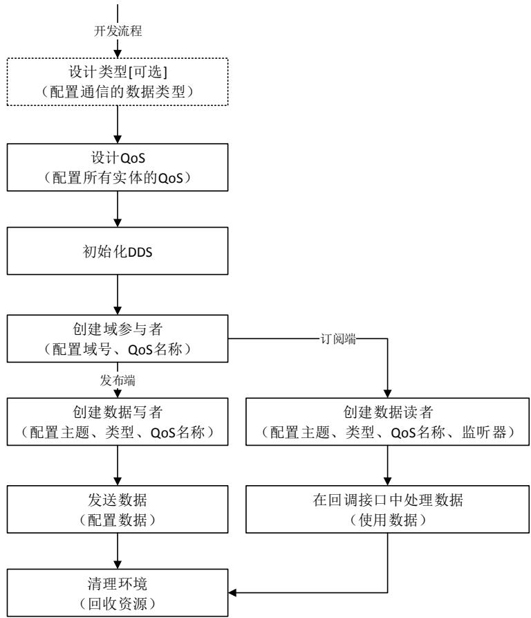
>
> **图示信息：**
>
> - A flowchart depicting the development process for a DDS-based system, showing sequential and parallel steps from initialization to cleanup.

图 15-1 标准协议接口开发流程

图 15-2、图 15-3 分别给出了各个步骤在发布端、订阅端所映射的 DDS 简化接口。用户可以按

照此流程进行开发，使用简化接口编写出最简单的数据收发程序。

> 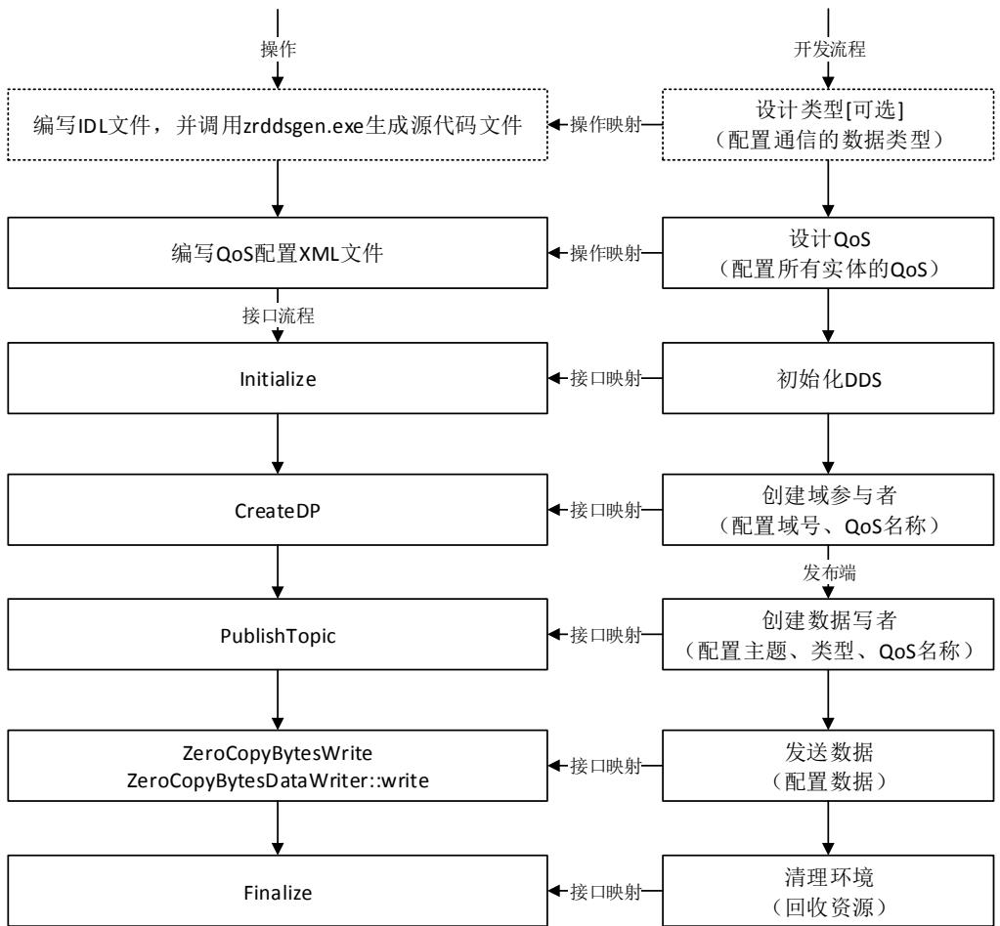
>
> **图示信息：**
>
> - A dual-column flowchart showing the mapping between '操作' (Operation) steps on the left and '开发流程' (Development Process) steps on the right, connected by '操作映射' and '接口映射' links.

图 15-2 简化接口开发流程（发布端）

> 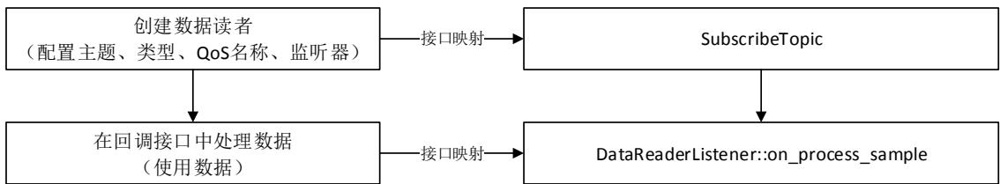
>
> **图示信息：**
>
> - A flowchart showing the mapping between user-facing operations and underlying interface implementations for a data reader system.

图 15-3 简化接口开发流程（订阅端）

#### 18.1.2. 零拷贝/非零拷贝数据类型

简化接口还提供了内置的零拷贝数据类、非零拷贝（缓冲区）类型供用户直接使用。

##### 18.1.2.1. 非零拷贝数据类型

为方便用户直接传输缓冲区数据类型，ZRDDS 提供内置的缓冲区类型，即 DDS_Bytes。

其实际类型为 DDS_OctetSeq，与字符串类型一致。但与字符串类型不同的地方在于，非零拷贝

数据类型允许内容中包含’\0’，而字符串类型会将’\0’视为字符串结束符。

18.1.2.2 零拷贝数据类型

为了支持 RTPS 协议，用户所使用的数据结构需要在发送端被序列化成 RTPS 报文并发送，在接

收端被反序列化成用户数据并提交。在通常情况下，用户的数据从发送到被接收，至少需要经历两

次数据拷贝。当用户数据长度较大且底层通信协议速度较快时，多次拷贝会对性能造成很大影响。

为了提升通信性能，ZRDDS 提供了一种内置的零拷贝数据类型，底层传输的长度为

reservedLength + userLength ，用户在使用零拷贝数据类型时，在分配空间时可按照最大可能的长度

分配，但在每次传输时应通过设置 userLength 来指定实际需要传输的样本长度。

使用该类型需满足以下条件：

 必须设置 DDS_DataWriterMessageModeQosPolicy::message_header_coalesce = true，否则数

据传输将出现异常

 用户申请数据空间时预留至少 512 字节的空间作为 ZRDDS 报文头序列化的空间，即

reservedLength >= 512；用户真正的负载在 userBuffer 处开始填写。

 使用零拷贝数据类型，不支持异步发送、批量发送以及涉及重传的 QoS，包括可靠传输以

及持久化 QoS；

 使用零拷贝数据类型，不支持数据分片。

18.1.3 主要接口介绍

下表列出了流程中所涉及的主要接口。

表 18-1 简化接口开发流程主要接口

| 接口名称 | 说明 |
| --- | --- |
| DDS::DDSIF::Init() | 初始化ZRDDS，并获取域参与者工厂。 |
| DDS::DDSIF::CreateDP() | 创建域参与者，并配置域、QoS、监听器。 |
| DDS::DDSIF::PubTopic() | 创建与指定主题名称、类型名称关联的数据<br>写者，并设置QoS、监听器。 |
| DDS::DDSIF::UnPubTopic() | 取消发布，通过指定精确的数据写者指针。 |
| DDS::DDSIF::UnPubTopicWTopicName() | 取消发布，通过指定域以及主题名称。 |
| DDS::DDSIF::SubTopic() | 创建与指定主题名称、类型名称关联的数据<br>读者，并设置QoS、监听器。 |
| DDS::DDSIF::UnSubTopic() | 取消订阅，通过指定精确的数据读者指针。 |
| DDS::DDSIF::UnSubTopicWTopicName() | 取消订阅，通过指定域以及主题名称。 |
| DDS::ZRDDSDataWriter::write() | 向DDS系统发布数据，由于DDS的强类型安<br>全，应转化为特定类型的数据写者调用 write<br>函数，如零拷贝的数据写者，应调用<br>ZeroCopyBytesDataWriter::write() 接口，对于<br>非零拷贝 （ 缓冲区类型 ） 应调用 |
|  | BytesDataWriter::write() 。 |
| DDS::SimpleDataReaderListener | 默认简单的数据到达监听器，用户继承该监<br>听器并在 DDS::SimpleDataReaderListener< T,<br>TSeq, TDataReader >::on_process_sample 中<br>处理到达的样本。 |
| DDS::DDSIF::Finalize() | 回收DDS中间件所有资源。 |

### 18.2. 简化接口代码示例

模拟了三个应用程序，其交互逻辑图如下，app1 与 app2 通过 UDP 网络交互 AirTrack 主题，关

联非零拷贝（缓冲区类型），app1 与 app3 之间通过 RIO 交互 SeaTrack 主题，关联零拷贝数据类型。

> 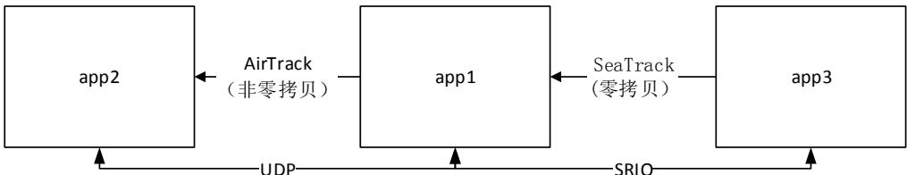
>
> **图示信息：**
>
> - A block diagram showing three applications (app1, app2, app3) connected by labeled data flows: AirTrack (非零拷贝) from app1 to app2, SeaTrack (零拷贝) from app3 to app1, and UDP and SRIO connections from app2 and app3 respectively pointing upward to app1.

UDP SRIO

图 18-1 示例通信场景图

C++ 语言可参见安装目录下开发者手册 （ `/doc/ZRDDS_CPP_UserManual.chm` 或

doc`/cpp/html/index.html`）中示例：

 其中 QoS 配置文件示例参见 SimpleInterface/ZRDDS_QOS_PROFILES.xml

 其中 app1 的代码参见 SimpleInterface/app1.cpp

 其中 app2 的代码参见 SimpleInterface/app2.cpp

 其中 app3 的代码参见 SimpleInterface/app3.cpp

C 语言可参见安装目录下开发者手册（`/doc/ZRDDS_C_UserManual.chm` 或 doc`/c/html/index.html`）

中示例：

 其中 QoS 配置文件示例参见 SimpleInterface/ZRDDS_QOS_PROFILES.xml

 其中 app1 的代码参见 SimpleInterface/app1.c

 其中 app2 的代码参见 SimpleInterface/app2.c

 其中 app3 的代码参见 SimpleInterface/app3.c

通过./MakeAll.sh 命令生成例子程序， *将 XML 配置文件放到程序的运行目录*，再依次启动三

个应用程序，可以看到 app1 有周期性的输出，app2 有周期性输出。

## 第19章简化接口 SUSTAIN

此接口主要是为了实现客户的一个特殊需求，要求接口在运行过程当中能够解决所在线程被杀

时，被持有的锁能够正确解锁，以免客户再次使用相同接口时无法获取锁，出现死锁的情况。本章

除接口名称有所更改其它内容与错误！未找到引用源。完全一致。

### 19.1. 简化接口 SUSTAIN 的使用

19.1.1 主要接口介绍

下表列出了流程中所涉及的主要接口。

表 19-1 简化接口开发流程主要接口

| 接口名称 | 说明 |
| --- | --- |
| DDS::DDSIF_SUSTAIN::Init() | 初始化ZRDDS，并获取域参与者工厂。 |
| DDS::DDSIF_SUSTAIN::CreateDP() | 创建域参与者，并配置域、QoS、监听器。 |
| DDS::DDSIF_SUSTAIN::PubTopic() | 创建与指定主题名称、类型名称关联的数据<br>写者，并设置QoS、监听器。 |
| DDS::DDSIF_SUSTAIN::UnPubTopic() | 取消发布，通过指定精确的数据写者指针。 |
| DDS::DDSIF_SUSTAIN::UnPubTopicWTopicName() | 取消发布，通过指定域以及主题名称。 |
| DDS::DDSIF_SUSTAIN::SubTopic() | 创建与指定主题名称、类型名称关联的数据<br>读者，并设置QoS、监听器。 |
| DDS::DDSIF_SUSTAIN::UnSubTopic() | 取消订阅，通过指定精确的数据读者指针。 |
| DDS::DDSIF_SUSTAIN::UnSubTopicWTopicName() | 取消订阅，通过指定域以及主题名称。 |
| DDS::ZRDDSDataWriter::write() | 向DDS系统发布数据，由于DDS的强类型安<br>全，应转化为特定类型的数据写者调用 write<br>函数，如零拷贝的数据写者，应调用<br>ZeroCopyBytesDataWriter::write() 接口，对于<br>非零拷贝 （ 缓冲区类型 ） 应调用<br>BytesDataWriter::write() 。 |
| DDS::SimpleDataReaderListener | 默认简单的数据到达监听器，用户继承该监<br>听器并在 DDS::SimpleDataReaderListener< T,<br>TSeq, TDataReader >::on_process_sample 中<br>处理到达的样本。 |
| DDS::DDSIF_SUSTAIN::Finalize() | 回收DDS中间件所有资源。 |

PART7 XML 使用

## 第20章 XML 配置实体 QoS

一般情况下，用户通过 DDS 标准接口对实体 QoS 进行配置，如各个实体的 get/set qos 函数。标

准接口使用简洁、直观，但是，当用户需要改变实体的 QoS 时，则需要修改代码并重新进行编译，

降低了参数调整的效率。为提高效率，ZRDDS 提供了 QoS 配置文件，用户可以在 QoS XML 配置文件

中预先配置好 QoS，在程序运行时，会从 XML 配置文件中获取 QoS 配置并将其应用到实体上。如此

一来，当用户需要变更 QoS 时，不再需要对程序进行重新编码，而是修改 QoS XML 文件即可。

本章节主要介绍如何使用 XML 配置 QoS、列出相关接口并给出 XML 文件的示例。主要包括以

下内容：

- XML 配置说明

- 编写 QoS 配置文件

- 管理 ZRDDS 内部 QoS 仓库

- QoS 设置相关接口

- XML 示例

### 20.1. XML 配置说明

XML 配置实体 QoS 分为以下步骤：

 编写 QoS 配置文件；

 加载 QoS 配置文件，ZRDDS 将在创建域参与者工厂时，将配置的 QoS 文件中的 QoS 加载到

ZRDDS 内部形成 QoS 仓库；

 在 QoS 相关接口中引用 QoS 仓库中的实体 QoS 进行相关配置。

### 20.2. 编写 QoS 配置文件

ZRDDS 使用 XML 文件来表达 QoS 内容，为增加 QoS 配置的灵活性，引入以下概念。

表 20-1xml 根节点与说明对照表

|  | 概念 |  |  | 根节点 |  |  | 说明 |  |
| --- | --- | --- | --- | --- | --- | --- | --- | --- |
| 实体QoS |  |  | `<participantfactory_qos>``<participant_qos>`<br>`<publisher_qos>`<br>`<subscriber_qos>`<br>`<datawriter_qos>` |  |  | 表示各类实体的QoS配置，为配<br>置的最小单元。 |  |  |
|  |  |  | `<datareader_qos>`<br>`<topic_qos>` |  |  |  |  |  |
| QoS配置<br>（QoSProfile） |  |  | `<qos_profile>` |  |  | 多个实体QoS组成一个QoS配<br>置； |  |  |
| QoS库（QoSLibrary） |  |  | `<qos_library>` |  |  | 多个QoS配置组成一个库。 |  |  |

配置文件重要配置项如下表：

表 20-2 配置属性与说明对照表

|  | 属性/子元素 | 说明 |
| --- | --- | --- |
|  | qos_library | 可出现0到无限次的子元素，类型为qosLibrary。 |
|  | name | 可选属性，用于在DDS系统中唯一标识该QoS库，默认为<br>"default". |
|  | qos_profile | 可出现 0 到无限次的子元素，类型为 qosProfile，表示该<br>QoS库中包含的QoS配置信息，一个QoS库中可以包含多<br>个name属性相同的QoS配置，含义为后出现的自动继承<br>前面出现的QoS配置。 |
|  | qos_profile | 可出现0到无限次的子元素，类型为qosProfile。 |
|  | name | 可选属性，用于在DDS库中唯一标识该QoS配置，默认为<br>"default"。一个 QoS 配置中允许包含多个 name 属性相同<br>的同类实体QoS配置，含义为后出现的自动继承前面出现<br>的实体配置。 |
|  | base_name | 可选属性，引用其他 QoS配置的name 属性，作为该QoS<br>配置的父配置，即本QoS配置继承于父配置，继承的含义<br>为覆盖父配置中的QoS值，引用的父配置必须在该QoS配<br>置之前定义，当需要引用其他QoS库中的QoS配置时，需<br>要使用完整路径，例如：需要引用library2中的profile1，<br>则写成"library2::profile1",而当引用同一个 QoS 库中的 QoS<br>配置时，QoS库的名称可以省略，写成“profile1”即可，<br>如果相同 QoS 配置(相同 name 属性)设置不同的<br>base_name，则取后一次继承的结果。 |
|  | participantfactory<br>_qos | 可出现0到无限个的子元素，类型为participantfactoryQos，<br>定义该QoS配置下包含的域参与者工厂QoS配置。 |
|  | participant_qos | 可出现0到无限个的子元素，类型为participantQos，定义<br>该QoS配置下包含的域参与者QoS配置。 |
|  | topic_qos | 可出现0到无限个的子元素，类型为topicQos，定义该QoS<br>配置下包含的主题QoS配置。 |
|  | publisher_qos | 可出现 0 到无限个的子元素，类型为 publisherQos，定义<br>该QoS配置下包含的发布者QoS配置。 |
|  | subscriber_qos | 可出现0到无限个的子元素，类型为subscriberQos，定义<br>该QoS配置下包含的订阅者QoS配置。 |
|  | datawriter_qos | 可出现0到无限个的子元素，类型为datawriterQos，定义 |
|  |  | 该QoS配置下包含的数据写者QoS配置。 |
|  | datareader_qos | 可出现0到无限个的子元素，类型为datareaderQos，定义<br>该QoS配置下包含的数据读者QoS配置。 |
| participantfactor<br>yQos | name | 可选属性，用于在 QoS 配置中唯一标识该域参与者工厂<br>QoS配置，默认为"default"。 |
|  | base_name | 可选属性，引用其他域参与者工厂QoS配置，作为该QoS<br>配置的父配置，即本QoS配置继承于父配置，继承的含义<br>为覆盖父配置中的QoS值，引用的父配置必须在该QoS配<br>置之前定义，例如：需要引用name属性为library2的QoS<br>库下的name属性为profile1的QoS配置中的name属性为<br>factory1 的域参与者工厂 QoS 配置，如果本 QoS 配置在<br>library2 QoS 库之外，则必须使用完整的引用路径<br>"library2::profile1::factory1"，如果本QoS配置在library2 QoS<br>库之内，profile1 QoS配置之外，则可以省略QoS库的前缀<br>为"profile1::factory1"，如果本QoS配置在"library2::profile1"<br>中，则可以省略 QoS 配置前缀为:"factory1"即可，这种引<br>用方式同样适用于 participantQos、publisherQos、<br>subscriberQos、topicQos、datawriterQos、datareaderQos。 |
| participantQos | name | 可选属性，用于在QoS配置中唯一标识该域参与者QoS配<br>置，默认为"default"。 |
|  | base_name | 可选属性，引用其他域参与者QoS配置，作为该QoS配置<br>的父配置，详细参见participantfactoryQos.base_name的描<br>述。 |
| topicQos | name | 可选属性，用于在QoS配置中唯一标识该主题QoS配置，<br>默认为"default"。 |
|  | base_name | 可选属性，引用其他主题QoS配置，作为该QoS配置的父<br>配置，详细参见participantfactoryQos.base_name的描述。 |
| publisherQos | name | 可选属性，用于在QoS配置中唯一标识该发布者QoS配置，<br>默认为"default"。 |
|  | base_name | 可选属性，引用其他发布者QoS配置，作为该QoS配置的<br>父配置，详细参见participantfactoryQos.base_name的描述。 |
| subscriberQos | name | 可选属性，用于在QoS配置中唯一标识该订阅者QoS配置，<br>默认为"default"。 |
|  | base_name | 可选属性，引用其他订阅者QoS配置，作为该QoS配置的<br>父配置，详细参见participantfactoryQos.base_name的描述。 |
| datawriterQos | name | 可选属性，用于在QoS配置中唯一标识该数据写者QoS配<br>置，默认为"default"。 |
|  | base_name | 可选属性，引用其他数据写者QoS配置，作为该QoS配置<br>的父配置，详细参见participantfactoryQos.base_name的描<br>述。 |
| datareaderQos | name | 可选属性，用于在QoS配置中唯一标识该数据读者QoS配 |

置，默认为"default"。

base_name 可选属性，引用其他数据读者 QoS 配置，作为该 QoS 配置

的父配置，详细参见 participantfactoryQos.base_name 的描

述。

实体 QoS 的 XML 格式为以对应 QoS 结构成员名称为子元素名称递归，基本数据类型为叶节点，

值作为叶节点的文本。叶节点格式如下表所示：

表 20-3 类型名称与属性对照表

| 类型名称 | 说明 |
| --- | --- |
| DDS_Boolean | 布尔值true/false |
| DDS_Octet | 8位无符号字符类型 |
| DDS_Char | 8位有符号字符类型，支持10进制以及0x开头的16进制数 |
| DDS_Short | 16位有符号定点数，支持10进制以及0x开头的16进制数 |
| DDS_UShort | 16位无符号定点数，支持10进制以及0x开头的16进制数 |
| DDS_Long | 32位有符号定点数，支持10进制以及0x开头的16进制数 |
| DDS_ULong | 32位无符号定点数，支持10进制以及0x开头的16进制数 |
| DDS_LongLong | 64位有符号定点数，支持10进制以及0x开头的16进制数 |
| DDS_ULongLong | 64位无符号定点数，支持10进制以及0x开头的16进制数 |
| DDS_Float | 32位浮点数，7位有效数字 |
| DDS_Double | 64位浮点数，15位有效数字 |
| DDS_String | 字符串类型 |
| DDS_CharSeq | 当存在sequenceMaxLength可选属性时，结构为多个element子元素，element<br>值为DDS_Char类型，当不存在sequenceMaxLength时，为字符串类型。 |
| DDS_StringSeq | 以element为子元素，每个element代表一个sequence成员。 |

为方便用户编写 QoS XML 文件，ZRDDS 提供网页端 QoS 配置工具，在线帮助文档的 XML 配置

实体 QoS “编写 QoS 配置文件”的最后链接。

### 20.3. 管理 ZRDDS 内部 QoS 仓库

以 C++为例，通过以下接口管理 ZRDDS 中的 QoS 仓库。将 C++接口中“::”改为“_”，即为 C 接口。

表 20-4 接口与说明对照表

| 接口 | 说明 |
| --- | --- |
| DDS_QosProfileQosPolicy | 定义与Qos配置文件有关的配置项。 |
| DDS::DomainParticipantFactory::reload_qos_profiles | 根据QosProfileQosPolic（y 有关QoS配置的配置）<br>配置重新加载QoS配置到库中。 |
| DDS::DomainParticipantFactory::unload_qos_profiles | 卸载所有的QoS配置。 |
| DDS::DomainParticipantFactory::add_qos_library | 添加一个QoS库。 |
| DDS::DomainParticipantFactory::remove_qos_library | 删除一个QoS库。 |
| DDS::DomainParticipantFactory::add_qos_profile | 在指定QoS库中添加一个QoS配置。 |
| DDS::DomainParticipantFactory::remove_qos_profile | 从指定QoS库中移除一个QoS配置。 |

### 20.4. QoS 设置相关接口

以 C++ 为例 ， 通过以下实体接口进行 QoS 配置 。 C 中数据读者的接口为

DataReaderSetQosWithProfile，数据写者的接口为 DataWriterSetQosWithProfile。其余 C 中实体的接

口可将 C++中实体接口的“::”改为“_”得到。

表 20-5 实体接口及说明对照表

|  | 接口 | 说明 |
| --- | --- | --- |
|  | DDS::DataReader::set_qos_with_profile | 从QoS仓库获取QoS配置并设置到数据读<br>者。 |
|  | DDS::DataWriter::set_qos_with_profile | 从QoS仓库获取QoS配置并设置到数据写<br>者。 |
|  | DDS::DomainParticipant::set_qos_with_profile | 从QoS仓库获取QoS配置并设置到域参与<br>者。 |
|  | DDS::DomainParticipant::set_default_topic_qo<br>s_with_profile | 从QoS仓库获取主题QoS并将其设为默认<br>主题QoS。 |
|  | DDS::DomainParticipant::set_default_publisher<br>_qos_with_profile | 从QoS仓库获取发布者QoS并将其设为默<br>认发布者QoS。 |
|  | DDS::DomainParticipant::set_default_subscrib<br>er_qos_with_profile | 从QoS仓库获取订阅者QoS并将其设为默<br>认订阅者QoS。 |
|  | DDS::DomainParticipant::create_publisher_wit<br>h_qos_profile | 从QoS仓库中获取发布者QoS并用其创建<br>发布者。 |
|  | DDS::DomainParticipant::create_subscriber_wi<br>th_qos_profile | 从QoS仓库中获取订阅者QoS并用其创建<br>订阅者。 |
|  | DDS::DomainParticipant::create_topic_with_q<br>os_profile | 从QoS仓库中获取主题QoS并用其创建主<br>题。 |
|  | DDS::DomainParticipantFactory::set_qos_with<br>_profile | 从QoS仓库获取QoS配置并设置到域参与<br>者工厂。 |
|  | DDS::DomainParticipantFactory::set_default_p<br>articipant_qos_with_profile | 从QoS仓库获取域参与者QoS并将其设为<br>默认域参与者QoS。 |
|  | DDS::DomainParticipantFactory::get_participan<br>t_factory_qos_from_profile | 从 QoS 仓库获取域参与者工厂 QoS 的配<br>置。 |
|  | DDS::DomainParticipantFactory::get_participan<br>t_qos_from_profile | 从QoS仓库获取域参与者QoS的配置。 |
|  | DDS::DomainParticipantFactory::get_publisher<br>_qos_from_profile | 从QoS仓库获取发布者QoS的配置。 |
|  | DDS::DomainParticipantFactory::get_subscribe<br>r_qos_from_profile | 从QoS仓库获取订阅者QoS的配置。 |
|  | DDS::DomainParticipantFactory::get_topic_qos | 从QoS仓库获取主题QoS的配置。 |
|  | _from_profile |  |
|  | DDS::DomainParticipantFactory::get_datawrite<br>r_qos_from_profile | 从QoS仓库获取数据写者QoS的配置。 |
|  | DDS::DomainParticipantFactory::get_dataread<br>er_qos_from_profile | 从QoS仓库获取数据读者QoS的配置。 |
|  | DDS::DomainParticipantFactory::create_partici<br>pant_with_qos_profile | 从QoS仓库获取QoS配置并用其创建域参<br>与者。 |
|  | DDS::DomainParticipantFactory::lookup_qos_li<br>braries | 查找名称符合pattern限定的QoS库。 |
|  | DDS::DomainParticipantFactory::lookup_qos_p<br>rofiles | 在指定 QoS 库中查找名字符合 pattern 的<br>QoS配置。 |
| 发布者 | DDS::Publisher::set_default_datawriter_qos_w<br>ith_profile | 从QoS仓库中获取数据写者QoS并将其设<br>为默认数据写者QoS。 |
|  | DDS::Publisher::set_qos_with_profile | 从QoS仓库中获取发布者QoS并将其设置<br>到发布者中。 |
|  | DDS::Publisher::create_datawriter_with_qos_p<br>rofile | 从QoS仓库中获取数据写者QoS并用其创<br>建数据写者。 |
| 订阅者 | DDS::Subscriber::set_default_datareader_qos_<br>with_profile | 从QoS仓库中获取数据读者QoS并将其设<br>置为默认DataReaderQos。 |
|  | DDS::Subscriber::set_qos_with_profile | 从QoS仓库中获取订阅者QoS并将其设置<br>到订阅者中。 |
|  | DDS::Subscriber::create_datareader_with_qos<br>_profile | 从QoS仓库中获取数据读者QoS并用其创<br>建数据读者。 |
| 主题 | DDS::Topic::set_qos_with_profile | 从QoS仓库中获取主题QoS并将其设置到<br>主题中。 |

### 20.5. XML 示例

典型的 XML 示例如下。

```text
<qos_library name="ExampleQosLib1">
<qos_profile name="ExampleQosProfile1">
```

`</qos_profile>`

`</qos_library>`

```text
<qos_library name="ExampleQosLib2">
<qos_profile name="ExampleQosProfile1" base_name="ExampleQosLib1::ExampleQosProfile1">
<participantfactory_qos name="ExampleDpFQos">
```

`<entity_factory>`

`<autoenable_created_entities>`false`</autoenable_created_entities>`

`</entity_factory>`

`</participantfactory_qos>`

`<participant_qos name="ExampleDpQos">`

`<usertraffic_receive_addresses>`

```text
<addresses sequenceMaxLength="1">
<element>tcpv4://default//0</element>
```

`</addresses>`

`</usertraffic_receive_addresses>`

`</participant_qos>`

`<datawriter_qos name="ExampleDwQos">`

`<user_data>`

`<value>`DefaultExampleDWQos`</value>`

`</user_data>`

`<history>`

`<kind>`KEEP_ALL_HISTORY_QOS`</kind>`

`</history>`

`<reliability>`

`<kind>`RELIABLE_RELIABILITY_QOS`</kind>`

`</reliability>`

`</datawriter_qos>`

```text
<datareader_qos name="ExampleDrQos">
<user_data sequenceMaxLength="2">
```

`<value>`41`</value>`

`<value>`42`</value>`

`</user_data>`

`<history>`

`<kind>`KEEP_ALL_HISTORY_QOS`</kind>`

`</history>`

`<reliability>`

`<kind>`RELIABLE_RELIABILITY_QOS`</kind>`

`</reliability>`

`</datareader_qos>`

`</qos_profile>`

`</qos_library>`

PART8RapidIO 使用

## 第21章 RapidIO 处理规程

RapidIO 通信是在 ZRDDS 基础之上扩展的功能。因此在开始阅读本章节、学习如何在 ZRDDS 中

使用 RapidIO 通信前，建议先阅读前序章节的内容，知悉 ZRDDS 的使用流程。在后续章节的描述中，

不再对 ZRDDS 基础概念及使用方式进行介绍。

本章节将对 RapidIO 使用过程涉及的数据类型及各个模块的配置方式进行介绍。主要包括以下

内容：

- 所支持的运行环境

- RapidIO 通信配置模块

- 零拷贝内置数据类型

- 任务核亲和性配置模块

- 数据封装内容配置模块

- 数据拷贝配置模块

### 21.1. 所支持的运行环境

目前 RapidIO 支持以下运行环境：

1） 华睿 2 号+VxWorks 操作系统平台定制接口；

2） X86 或者银河麒麟的 mport 接口；

3） 6678/Reworks 定制接口。

### 21.2. RapidIO 通信配置模块

该模块为用户提供配置 RapidIO 相关参数及是否启用 RapidIO 通信的接口。

用户可以通过 DomainParticipantFactoryQos.rapidio_config 对 RapidIO 初始化的参数进行配置，通

过 DomainParticipantQos.rapidio_controller 选择通信使用的 RapidIO 控制器 ， 并通过

DomainParticipantQos.usertraffic_receive_addresses 配置使用 RapidIO 通信。

当用户需要使用 RapidIO 时，首先需要在 DomainParticipantFactoryQos 的 rapidio_config 中对

RapidIO 初始化参数进行配置。该类型是一个 RapidIO 控制器参数序列，用户可以对多个控制器的参

数进行配置。针对一个控制器，其包含的参数包括：

 rapidio_controller：当前配置的控制器号；

 rapidio_address：当前控制器使用的 RapidIO 设备基地址；

 receive_window_base_address：RapidIO 的接收窗映射的物理内存地址；

 receive_window_size：RapidIO 接收窗大小，作为每次开窗的大小；

 receive_subwindow_size：RapidIO 接收窗子窗大小；

 receive_window_limit：RapidIO 接收窗限制最大开窗个数；

 rapidio_address_limit：RapidIO 设备地址最大限制。

数据交互在 RapidIO 接收窗进行，当没有空闲接收窗时会申请一个新的接收窗，大小为

receive_window_size，并将接收窗按 receive_subwindow_size 划分若干个子窗，每个子窗分配给一个

匹配对端进行通信。

receive_window_size/receive_subwindow_size 即为当前配置的控制器每个接收窗所能匹配的通

信端数量，例如配置的接收窗总大小为 4MB，接收窗子窗大小为 1MB，则在当前节点使用 RapidIO

通信时，每个接收窗最多只能连接 4MB/1MB=4 个通信对端，再乘上可以申请的最大接收窗个数即

为最多可连接的通信对端。

而最大的接收窗个数由以下两个限制的较小值决定：

 receive_window_limit 直接限制了接收窗的最大个数，默认为 8；

 rapidio_address_limit 限制了开窗范围在[rapidio_address, rapidio_address_limit]，接收窗的最

大个数为(rapidio_address_limit-rapidio_address)/receive_window_size，rapidio_address_limit

默认为 0xffffffff。

当用户使用 RapidIO 进行通信时，首先需要在 DomainParticipantQos 的 rapidio_controller 中选择

通信使用的 RapidIO 控制器。然后需要将 DomainParticipantQos 里的 usertraffic_receive_addresses 地

址配置为 RapidIO 地址。具体格式如下：

rapidio://`<device id>`//`<port>`

其中 rapidio 前缀表示该地址为 RapidIO 地址。

`<device id>`为本机的 RapidIO 通信设备号。用户可以填写 0 表示 ZRDDS 自动获取设备号。若用

户配置的设备号与本机实际的设备号不符合，通信将无法进行。

`<port>`表示通信使用的端口号。ZRDDS 可以为每个 DomainParticipant 自动生成端口号，用户也

可以指定特定的端口号。在RapidIO协议中没有端口的概念，因此此处配置的端口号并没有在RapidIO

协议进行映射，而是在应用层进行的映射。用户可以填写 0 表示使用默认分配的端口号。

当用户针对特定数据类型（如该 QoS 配置的用户数据）设置了接收地址之后，ZRDDS 将不再使

用其他地址进行数据接收，例如，若只提供了 RapidIO 的地址，ZRDDS 将不再使用以太网进行用户

数据的接收。如果同时提供了多个不同的地址，ZRDDS 在每个地址上都会接收到数据，当接收到重

复数据（如同时在 RapidIO 地址和以太网地址接收到同一个数据）时，ZRDDS 会过滤掉重复的数据。

一个典型的 RapidIO 地址配置示例如下所示：

DomainParticipantFactoryQos dpfQos;

```text
// 配置控制器相关属性
if (!dpfQos.rapidio_config.controllers_config.ensure_length(1, 1))
{
printf("ensure rio controllers config length failed.\n");
}
// 该配置针对控制 0
dpfQos.rapidio_config.controllers_config[0].rapidio_controller = 0;
// 接收窗映射的内存地址
dpfQos.rapidio_config.controllers_config[0].receive_window_base_address = 0x10000000;
// RapidIO 设备基地址
dpfQos.rapidio_config.controllers_config[0].rapidio_address = 0x10000000;
// RapidIO 接收窗大小
dpfQos.rapidio_config.controllers_config[0].receive_window_size = 0x10000000;
// RapidIO 接收窗子窗大小
dpfQos.rapidio_config.controllers_config[0].receive_subwindow_size = 0x01000000;
// 设置 QoS
TheParticipantFactory.set_qos(dpfQos);
DomainParticipantQos dpQos;
// 首先获取默认的 QoS 配置
TheParticipantFactory.get_default_participant_qos(dpQos);
// 选择使用的控制器
dpQos.rapidio_controller = 0;
// 设置地址列表的 Sequence 长度
dpQos.usertraffic_receive_addresses.addresses.ensure_length(1, 1);
// 使用默认的 RapidIO 地址和端口配置
const char* rapdioAddr = "rapidio://0//0";
// 将 RapidIO 地址添加到地址列表中
dpQos.usertraffic_receive_addresses.addresses.set_at(0, rapdioAddr);
// 使用配置好的 DomainParticipantQos 创建 DomainParticipant
DomainParticipant* dp =
TheParticipantFactory. create_participant(1, dpQos, NULL, DDS_STATUS_MASK_NONE);
```

### 21.3. 零拷贝内置数据类型

为了支持 RTPS 协议，用户所使用的数据结构需要在发送端被序列化成 RTPS 报文并发送，在接

收端被反序列化成用户数据并提交。在通常情况下，用户的数据从发送到被接收，至少需要经历两

次数据拷贝。当用户数据长度较大且底层通信协议速度较快时，多次拷贝会对性能造成很大影响。

为了提升通信性能，ZRDDS 提供了一种内置的零拷贝数据类型。

该类型名称为 DDS_ZeroCopyBytes，其具体结构如下：

struct DDS_ZeroCopyBytes

```text
{
ZR_INT32 totalLength;
ZR_INT32 reservedLength;
ZR_INT8* value;
};
```

用户使用该类型时，按照常规的方式进行类型注册、创建主题、创建数据读者和数据写者即可。

当用户发布该类型的数据时，需要满足额外的一些条件：

 配置 DataWriterQos.message_mode.message_header_coalesce 为 true；

 用户申请数据空间时预留至少 512 字节的空间作为 ZRDDS 报文头序列化的空间，基

reservedLength 不小于 512；

 用户在 DDSZeroCopyBytes 结构中正确填写总长度(totalLength)和保留长度(reservedLength);

 用户数据从（value + reservedLength）的位置开始填写，长度不超过（totalLength -

reservedLength）；

 用户不启用异步发送（asynchronous_write）、批量发送（batch）和涉及到重传的 QoS 配置

（包括 Relibility 和 Durability）。

当满足上述条件之后，ZRDDS 发送将不再拷贝用户的数据，而 ZRDDS 协议头将直接在用户提供

的空间上进行序列化。

在数据接收端，需要使用同样的数据结构进行数据接收。对于接收的数据，用户必须及时处理。

如果用户处理速度低于数据接收速度，旧的数据将会被覆盖，用户可能得到错误的数据内容。如果

用户需要缓存数据，需要在应用层进行。

### 21.4. 任务核亲和性配置模块

该模块用于配置 ZRDDS 内部任务的核亲和性，即将任务绑定到指定的处理器核心。配置同样通

过 QoS 进行，用于配置的 QoS 为 DomainParticipantQos.thread_core_affinity。其中的每个项都适用掩

码的形式表示其可以绑定的核心。掩码从低位开始，第一位对应系统中的第一个核心，一次类推。

在 VxWorks 中，当配置了多个可以绑定的核心时，默认使用编码最小的一个，如掩码设置为

0x00000005 表示该任务允许绑定到第 0 号和第 2 号核心，在 VxWorks 上绑定到 0 核。

ThreadCoreAffinityQosPolicy 各个项的含义如下所示：

表 21-1 配置项及其含义对照表

| 配置项 | 含义 |
| --- | --- |
| receive_thread_default_affinity_mask | 接收任务默认绑定的核心，当使用多端口共享<br>一个接收任务时该配置有效 |
| user_data_receive_thread_affinity_mask | 用户数据接收任务绑定的核心，当使用单端口<br>独享接收任务时该配置有效 |
| builtin_data_receive_thread_affinity_mask | DDS 内置数据接收任务绑定的核心，当使用单<br>端口独享接收任务时该配置有效 |
| timer_thread_affinity_mask | 定时器任务绑定的核心 |
| async_send_thread_affinity_mask | 异步发送任务绑定的核心，当启用了异步发送<br>时该配置有效 |

### 21.5. 数据封装内容配置模块

在一定的使用场景下，RTPS 报文的包含的一部分信息会被忽略。例如样本数据带有的 KeyHash

用于 DDS 监控服务，如果不适用监控服务，则样本数据可以不带有 KeyHash 信息。在消除样本数据

带有的一部分信息之后，可以加快发布端的数据发布速率，也能加快订阅端的数据处理速率，提升

整体的性能。

该项配置同样通过 QoS 进行设置。配置项为 DataWriterQos.message_mode.without_inlineQos 和

```text
DataWriterQos.message_mode.without_timestamp。默认值为 false，即带有所有的信息。如果希望能
够去除该信息，可以将两项都设置为 true。需要注意的是，
DataWriterQos.message_mode.without_timestamp 项如果需要设置为 true，则
```

DataWriterQos.destination_order.kind 就不能设置为

BY_SOURCE_TIMESTAMP_DESTINATIONORDER_QOS。

### 21.6. 数据拷贝配置模块

在华睿 2 号平台上，拷贝较大时数据可以使用 DMA 的方式加快拷贝速度。为此 ZRDDS 提供了

QoS 用于配置是否启用 DMA 进行数据拷贝 。 该 QoS 配置为

DomainParticipantFactory.min_dma_copy_size。该项 QoS 的含义为使用 DMA 拷贝的最小数据长度。

当需要拷贝的数据长度低于该值时，将使用 memcpy 函数进行数据拷贝，当需要拷贝的数据长

度达到或超过该值时，将会使用 DMA 的方式进行拷贝。该设置将影响到全局的数据拷贝，包括用

户数据和 DDS 内部数据。当将该值设置为 0x7fffffff 时，所有的数据都使用 memcpy 进行拷贝，但该

值设置为 0 时，所有的数据都使用 DMA 进行拷贝。

在实际测试中，数据长度小于 16KB 时，memcpy 拷贝速度由于 DMA 拷贝速度，当数据长度在

16KB 到 32KB 时，两者拷贝速度接近，当数据长度超过 32KB 时，DMA 拷贝速度优于 memcpy 的拷

贝速度。

## 第22章华睿 2 号+SylixOS 系统上 RapidIO 使用

在需要进行 RapidIO 通信的节点（单或多）上运行一个门铃代理程序 ZRDDSRIOProxy，再启动设

置好 QoS 的 ZRDDS 接收端、发送端程序即可进行 RapidIO 通信。

### 22.1. 运行代理程序

使用 ZRDDS 进行 RapidIO 通信时，首先需要运行门铃代理程序 ZRDDSRIOProxy。在每个节点直

接运行门铃代理程序，驻留一个门铃代理进程，该进程负责 RapidIO 通信时窗口、子窗口的分配，

以及门铃信息的分发。

门铃代理程序的运行参数：./ZRDDSRIOProxy [config_path]。其中 config_path 代表配置文件路径，

该参数为可选参数，若不配置则采用默认的窗口配置。门铃程序的窗口配置文件决定 RapidIO 设备

基地址和接收窗映射地址。配置文件每行代表一个接收窗，由 4 个数值组成，数值之间用空格分开。

配置文件数值的含义如下（ 表中为部分默认配置 ）。 注意，其中 RapidIO 设备基地址

0x20000000-0x2fffffff 段为用户预留地址不可设置，0x00000000 会影响首次使用不可设置。设置接收

窗映射地址时，只能映射 0x10000000-0x4fffffff 这个段的数据。

| 控制器号 | RapidIO设备基地址 | 接收窗映射地址 | 接受窗大小（MB） |
| --- | --- | --- | --- |
| 0 | 0x10000000 | 0x10000000 | 256 |
| 0 | 0x30000000 | 0x20000000 | 256 |

### 22.2. DDS 应用配置

ZRDDS 应用进行 RapidIO 通信，需要设置相应的 QoS，详细描述见 21.2 节，具体配置可参考其

中配置示例。用户需要特别注意的是 DomainParticipantFactoryQos 的 rapidio_config 中的 RapidIO 初

始化参数。其中只有 rapidio_controller 和 receive_window_size 两个参数是用户修改可以产生实际效

果的，即用户可以根据实际情况设定控制器号和分配的 RapidIO 窗口大小。用户设置的子窗大小

```text
receive_subwindow_size 需要满足 receive_window_size/receive_subwindow_size<= 16 和
receive_subwindow_size>= 0x00400000 这两个约束条件。实际子窗单元大小由门铃程序初始化设置
```

为 0x00200000。

PART 9 参数配置

## 第23章可配置性

ZRDDS 提供方式使得用户可以对部分内部参数进行按需求配置，本章主要介绍这些参数的意义

与配置方式。包括以下内容

- 配置说明

- 可配置参数

### 23.1. 配置说明

- 通过 DDS 的可配置性增强，可为用户提供一种统一的方式对 DDS 内部的参数进行配置，可

实现按需对不同数据读写者进行不同配置。

- 通过在不同实体 Qos 中 property 添加配置项完成对 DDS 的配置

### 23.2. 可配置参数

本小节旨在帮助用户了解当前可配置参数类型及意义，主要包括基于全局的参数，基于数据写

者参数及基于数据读者参数（对于花括号类型初始值，无特殊说明时，单位为{秒, 纳秒}）。

23.2.1 全局配置

23.2.1.1 可配置项

全局参数要求在 DomainParticipantFactory 下的 Qos 中进行配置，一旦配置成功则该工厂下所有

域参与者及其管理的实体都将采用用户配置的参数。

表 23-1 全局配置参数、含义及默认值对照表

| 配置参数 | 参数作用 | 默认值 |
| --- | --- | --- |
| sysctl.global.network.disabled_int<br>erface | 网卡禁用，通过填入网卡的名称，<br>在使用DDS不会使用该网卡进行任<br>何数据传输 | 无默认值 |
| sysctl.global.time.clock_id | 设置时间源 | clockId:CLOCK_MONOTON<br>IC |
| sysctl.global.net.int_sockport_bas<br>e | DDS 自中断起始端口，DDS 会监听<br>本地回环接口上的该端口，用于解<br>开DDS接收线程阻塞。 | 7399 |
| sysctl.global.net.zrnet_ipv4_udp_<br>max_packet_length | 使用UDP协议时的单个分片大小。 | 65408(byte) |
| sysctl.global.net.zrnet_ipv4_tcp_<br>max_packet_length | 使用TCP协议时的单个分片大小。 | 2100000(byte) |
| sysctl.global.net.zrnet_shmem_m<br>ax_packet_length | 使用共享内存时的单个分片大小。 | 1*1024*1024(byte) |
| sysctl.global.net.zrnet_rapidio_m<br>ax_packet_length | 使用RIO时的单个分片大小。 | 4*1024*1024(byte) |
| sysctl.global.net.defalut_max_blo<br>cking_time | 内置数据写者数据发送超时时间<br>（暂未使用） | { 0, 100 * 1000 * 1000 } |
| sysctl.global.net.default_datap_s<br>uppression | 默认的Data(p)发送抑制时间（在该<br>时间内至多只有一次data(p)发送）。 | { 0, 10 * 1000 * 1000 } |
| sysctl.global.net.idlewaittime | 等待时间（暂未使用）。 | 10*1000 |
| sysctl.global.net.sendbufsize | socket的发送缓存大小。 | 64*1024*1024(byte) |
| sysctl.global.net.recvbufsize | socket的接收缓存大小。 | 64*1024*1024(byte) |
| sysctl.global.net.delay_count | UDP时延个数。 | 0 |
| sysctl.global.net.delay_time | UDP时延 | 1000 |
| sysctl.global.net.delay_size | UDP统计报文阈值 | 60 * 1024 |
| sysctl.global.net.delay_mode | 延时方式，0-sleep，1为同步，2为<br>for循环 | 0 |
| sysctl.global.net.auto_switch_rec<br>v_mode | UDP是否自动切换接收方式 | false |
| sysctl.global.net.recv_count_limit | UDP关闭select | 1000 |
| sysctl.global.net.loop_count_limit | UDP开启select | 1000000 |
| sysctl.global.net.switch_scale | UDP开启select | 3 |
| sysctl.global.rio.delay_empty_wai<br>ting_us | 空循环中等待时间 | 100(us) |
| sysctl.global.rio.waiting_db_ack_c<br>ount | 等待次数，用于检测链路超时 | 30000 |
| sysctl.global.rio.waiting_db_ack_t<br>ime | 每次等待的时间，用于检测链路（此<br>处单位为us） | 1(us) |
| sysctl.global.rio.send_sleep_time | 每次发送间隔（此处单位为us） | 0 |
| sysctl.global.rio.sendbuffersize | 使用RIO时发送缓存大小 | 4*1024*1024 (byte) |
| sysctl.global.rio.max_mport_msg<br>_size | 单个端口发送的最大数据大小 | 4*1024*1024+1024(byte) |
| sysctl.global.net.udp_max_batch<br>_num | UDP 接收线程单个端口最大处理次<br>数 | 1024 |
| sysctl.global.net.udp_max_batch<br>_len | UDP 接收线程单个端口最大处理大<br>小 | 1024 * 1024 * 32(byte) |
| sysctl.global.net.tcp_max_batch_<br>num | TCP 接收线程单个端口最大处理次<br>数 | 1024 |
| sysctl.global.net.tcp_max_batch_l<br>en | TCP 接收线程单个端口最大处理大<br>小 | 1024 * 1024 * 32(byte) |
| sysctl.global.net.tcp_send_batch_<br>len | TCP多核模式下发送batch大小 | 0 |
| sysctl.global.net.tcp_listen_timeo<br>ut | TCP超时时间（tcp下阻塞的接收和<br>发送超时时间） | {2，0}<br>Windows 下单位为(秒,<br>纳秒}<br>Linux下单位为{秒, 微秒} |
| sysctl.global.net.tcp_keepidle_ti | keep_alive机制触发时间（该时间内 | 5(s) |
| me | 如果没有数据就出发 keep_alive 机<br>制） |  |
| sysctl.global.net.tcp_keepintvl_ti<br>me | keep_alive 心跳包发送时间间隔<br>（tcp 下间隔该数量的时间发送一<br>个心跳包） | 1(s) |
| sysctl.global.net.tcp_keepcnt_cou<br>nt | tcp 连续发送包数判定超时报数配<br>置（tcp下通过连续发送该数据的数<br>据包，如果全部都未收到，则判定<br>超时） | 3 |
| sysctl.global.net.tcp_user_timeou<br>t | tcp发送数据后没有收到ACK报文，<br>超时时间配置 | 1000(ms) |
| sysctl.global.net.select_timeout | 自中断超时时间配置 | {1, 0} |
| sysctl.global.net.check_if_up | 是否检查网卡处于Up状态 | true |
| sysctl.global.net.check_if_running | 是否检查网卡处于Running状态 | true |
| sysctl.global.net.enable_lo | 当没有可用IP地址时，是否自动启<br>用本地回环进行通信，即127.0.0.1 | true |
| sysctl.global.net.enable_sort_add<br>r | 是否开启地址排序功能 | true |
| sysctl.global.net.auto_sort_timeo<br>ut | 地址排序尝试连接的超时时间配置 | 1000(ms) |
| sysctl.global.net.reconnect_anyw<br>ay | Tcp连接失败（除了对端ctrl-c引起<br>的）后是否总是尝试重新连接 | false |
| sysctl.global.fpga.enable_signal | 跨机箱SRIO是否开启信号捕获来释<br>放资源 | false |
| sysctl.global.fpga.enable_xml_cfg | 跨机箱SRIO是否使用xml形式的配<br>置表 | false |
| sysctl.global.fpga.box_id | 指定当前机箱号id | 0 |
| sysctl.global.fpga.retry_limit | 跨机箱SRIO可靠模式下重传次数和<br>超时时间配置 | 8(次), 1000(ms) |
| sysctl.global.fpga.enable_db_pp | 跨机箱SRIO是否开启可靠模式 | false |
| sysctl.global.fpga.affinity_mask | 跨机箱SRIO接收线程绑核配置，无<br>符号16位，根据想要绑核的cpu编<br>号，把对应位设为 1，不绑的位设 | 65535 |
|  | 为0，绑cpu0，值为1，绑cpu0和<br>cpu1，置为3 |  |
| sysctl.global.srio.affinity_mask | 机箱内SRIO接收线程绑核配置，配<br>置方法如上 | 65535 |
| sysctl.global.fpga.enable_cp | 跨机箱SRIO是否拷贝接收数据 | false |
| sysctl.global.fpga.enable_cmp | 跨机箱SRIO是否比较数据是否重复 | false |
| sysctl.global.mempool.mem_mod<br>e | 内存分配模型配置，当前支持两种<br>模型直接系统的malloc/free分配空<br>间（值为 0）以及 ZRDDS 实现的内<br>存池分配空间（值为1） | 1 |
| sysctl.global.ignore_unknown_su<br>bmessage | 设置是否忽略未知子消息 | true |
| sysctl.global.identification_path | 配置辅助标识所在路径。Data(p)中<br>的辅助标识，用于辅助实体标识确<br>定唯一实体。默认情况下不设置路<br>径，以系统时间为辅助标识。设置<br>路径则读取文件中非零unsigned int<br>值作为辅助标记代替系统时间，读<br>取为零则仍以系统时间为辅助标<br>识。 | 无默认值 |
| sysctl.global.use_cpu_id | 是否使用CPU编号进行绑核设置 | false |

其中 sysctl.global.time.clock_id 可配置值存在两种格式

格式 1：dev:$PATH

$PATH 为系统硬件时钟设备路径，通常情况下设备路径为`/dev/ptp0`，虚拟机中无此设备

格式 2：clockId:$KIND

$KIND 为参数值，有如下常用参数值

| 参数值 | 含义 |
| --- | --- |
| CLOCK_REALTIME | 根据系统实时时间获取当前时间 |
| CLOCK_MONOTONIC | 从系统启动开始计时并获取当前时间，不受被<br>用户改变的影响 |

23.2.1.2 配置示例

- 在代码中配置：

全局参数在 DomainParticipantFactory 下的 Qos 中进行配置，在填写好配置值后设置 Qos 即可

配置方法如下：

```text
// 获取参与者工厂实例
DDS::DomainParticipantFactory* factory = DDS::DomainParticipantFactory::get_instance();
DDS::DomainParticipantFactoryQos dpfQos;
//RTPS 初始端口值配置
factory->get_qos(dpfQos);
DDS_PropertyQos_AppendProperty(&dpfQos.property, "sysctl.global.net.int_sockport_base",
"7399", false);
factory->set_qos(dpfQos);
```

- 在 XML 中配置：

```text
<zrdds_qos xmlns="http://www.omg.org/dds/">
<qos_library name="lib1">
<qos_profile name="profile1">
<participantfactory_qos name="app1">
```

`<property>`

`<value>`

<!-- 在 name 标签内输入配置参数名称， value 标签中输入配置参数的值 -->

`<element>`

`<name>`sysctl.global.net.int_sockport_base`</name>`

`<value>`7399`</value>`

`<propagate>`false`</propagate>`

`</element>`

`</value>`

`</property>`

`</participantfactory_qos>`

`</qos_profile>`

`</qos_library>`

`</zrdds_qos>`

23.2.1.3 注意事项

- 全局配置需要在域参与者工厂 QoS 中进行配置。

- 全局配置的信息可以通过日志进行查看，日志号为2450到2455，主题名为SYSTEM_CONFIG。

23.2.2 域参与者参数

23.2.2.1 可配置项

域参与者参数要求在 DomainParticipant 下的 Qos 中进行配置，不同的 DomainParticipant 可配置

不同的参数值。

表 23-2 域参与者配置参数、含义及默认值对照表

| 配置参数 | 参数作用 | 默认值 |
| --- | --- | --- |
| sysctl.dp.domain_id | 设置域号 | -1 |
| sysctl.dp.prematch_dp_clean_duration | 清理预匹配域参与者<br>的周期，由于预匹配的<br>域参与者信息无主动<br>方式退出，在此处设置<br>清理定时，以防该列表<br>积压 | {600,0} |

23.2.2.2 配置示例

 在代码中配置：

```text
//在创建DomainParticipant 前进行配置
DDS::DomainParticipantQos dpQos;
factory->get_default_participant_qos(dpQos);
//DomainParticipant 域号设置
DDS_PropertyQos_AppendProperty(&dpQos.property, "sysctl.dp.domain_id", "150", false);
DDS::DomainParticipant* dp = factory->create_participant(
```

1,

dpQos,

NULL,

DDS::STATUS_MASK_NONE);

 在 XML 中配置：

```text
<zrdds_qos xmlns="http://www.omg.org/dds/">
<qos_library name="lib1">
<qos_profile name="profile1">
<participant_qos name="dp1">
```

`<property>`

> 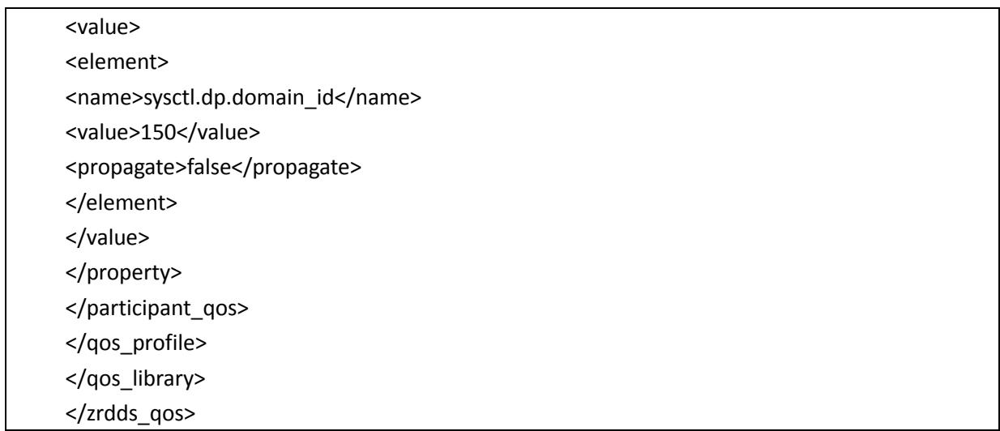
>

23.2.2.3 注意事项

 域参与者级别的配置需要在创建域参与者时传入，不支持先创建域参与者再设置 Qos 的方

式进行设置。

 域参与者配置的日志号为 2460，主题为 SYSTEM_CONFIG。

23.2.3 数据写者参数

23.2.3.1 可配置项

数据写者参数要求在DataWriter下的Qos中进行配置，不同的DataWriter可配置不同的参数值。

表 23-3 数据写者配置参数、含义及默认值对照表

| 配置参数 | 参数作用 | 默认值 |
| --- | --- | --- |
| sysctl.dw.no_serializing_length_limit | “无序列化”模式<br>时，数据不进行序列<br>化的最小长度 | 9000 |
| sysctl.dw.sample_space_waiting_limit | 样本空间等待限制 | 1024*1024*300 |
| sysctl.dw.sample_space_blocking_limit | 样本空间阻塞限制 | 1024*1024*600 |
| sysctl.dw.loan_sample_space_waiting_limit | 租借样本空间等待<br>限制 | 1024*1024*400 |
| sysctl.dw.loan_sample_space_blocking_limit | 租借样本空间阻塞<br>限制 | 1024*1024*1024 |
| sysctl.dw.max_spare_samples | 最大空闲数据样本<br>数量 | 128 |
| sysctl.dw.statistic.fragment_length | datawriter 分片大 | 4*1024*1024 |
|  | 小 |  |
| sysctl.dw.merge_zerocopy | 是否开启零拷贝空<br>间合并 | false |
| sysctl.dw.align_payload | 负载对齐长度，用<br>于实现UDP收端大<br>包零拷贝 | 0 |
| sysctl.dw.asynchronous_send_thread_affinity_masks | 长度为异步发送创<br>建的线程个数，元<br>素依次对应该线程<br>绑定的核心掩码 | 无默认值 |
| sysctl.dw.asynchronous_send_thread_max_flush_delay | TCP 多核模式下最<br>大发送延迟，每当<br>达到该时间时会触<br>发刷新，当以其他<br>方式刷新时，会重<br>置刷新时间 | {0, 100000000 } |

23.2.3.2 配置示例

 在代码中配置：

```text
//在创建DataWriter 前进行配置
DDS::DataWriterQos writerQos;
publisher->get_default_datawriter_qos(writerQos);
//DataWriter 分片大小配置
DDS_PropertyQos_AppendProperty(&writerQos.property,"sysctl.dw.statistic.fragment_length",
"4*1024*1024", false);
DDS::DataWriter *writer = publisher->create_datawriter(
```

topic,

writerQos,

NULL,

DDS::STATUS_MASK_NONE);

 在 XML 中配置：

```text
<zrdds_qos xmlns="http://www.omg.org/dds/">
<qos_library name="lib1">
<qos_profile name="profile1">
<datawriter_qos name="app1">
```

`<property>`

`<value>`

`<element>`

`<name>`sysctl.dw.statistic.fragment_length`</name>`

`<value>`4*1024*1024`</value>`

`<propagate>`false`</propagate>`

`</element>`

`</value>`

`</property>`

`</datawriter_qos>`

`</qos_profile>`

`</qos_library>`

`</zrdds_qos>`

23.2.3.3 注意事项

 数据写者级别的配置需要在创建数据写者时传入，不支持先创建数据写者再设置 Qos 的方

式进行设置。

 数据写者配置的日志号为 2465，主题为 SYSTEM_CONFIG。

23.2.4 数据读者参数

23.2.4.1 可配置项

数据读者参数要求在 DataReader 下的 Qos 中进行配置，不同的 DataReader 可配置不同的参数

值。

表 23-4 数据读者配置参数、含义及默认值对照表

| 配置参数 | 参数作用 | 默认值 |
| --- | --- | --- |
| sysctl.dr.defalut_hb_suppression | HeartBeat抑制时间 | { 0, 100 * 1000 * 1000 } |
| sysctl.dr.max_nack_sample_num | 单个 AckNack 负反馈样本数<br>量 | 8 |
| sysctl.dr.max_nackfrag_num | 单次负反馈分片最大数量 | 2 |
| sysctl.dr.max_sample_size | 最大的样本个数 | 64 * 1024 |
| sysctl.dr.recv_buffer_count | 底层接收缓冲区数量，当前<br>仅支持1/2，为2时将会启动<br>非零拷贝的租借反序列化 | 1 |
| sysctl.dr.align_payload | 负载对齐长度，用于实现 | 0 |

UDP 收端大包零拷贝

sysctl.dr.use_data_arrived 使用 on_data_arrived 回调函 false

数

23.2.4.2 配置示例

 在代码中配置：

```text
//在创建DataReader 前进行配置
DDS:: DataReaderQos readerQos;
subscriber->get_default_ datareader _qos(readerQos);
// HB 抑制配置
DDS_PropertyQos_AppendProperty(&readerQos.property, "sysctl.dr.defalut_hb_suppression",
"{ 0, 100 * 1000 * 1000 }", false);
DDS:: DataReader *reader= subscriber ->create_ datareader (
```

topic,

readerQos,

listener,

DDS::STATUS_MASK_ALL);

 在 XML 中配置：

```text
<zrdds_qos xmlns="http://www.omg.org/dds/">
<qos_library name="lib1">
<qos_profile name="profile1">
<datareader_qos name="app1">
```

`<property>`

`<value>`

`<element>`

`<name>`sysctl.dr.defalut_hb_suppression`</name>`

```text
<value>{ 0, 100 * 1000 * 1000 }</value>
<propagate>false</propagate>
```

`</element>`

`</value>`

`</property>`

`</datareader_qos>`

`</qos_profile>`

`</qos_library>`

`</zrdds_qos>`

23.2.4.3 注意事项

 数据读者级别的配置需要在创建数据读者时传入，不支持先创建数据读者再设置 Qos 的方

式进行设置。

 数据写者配置的日志号为 2470，主题为 SYSTEM_CONFIG。

PART 10 Docker 使用

## 第24章 Docker 容器部署 ZRDDS 应用

Docker 容器可以被认为是一种轻量级的沙箱，每个容器内运行着不同的应用，容器之间相互隔

离。很多时候你可以将容器当成应用本身。

 镜像：类似于虚拟机镜像，是一个只读的模板。

 容器：类似于一个轻量级沙箱，用来运行应用并隔离其它容器的应用。容器是从镜像创建

的应用运行示例。镜像是只读的，当容器从镜像启动的时候，会在容器的最上层创建一个

可写层。

从 ZRDDS2.2.7 开始，ZRDDS 应用程序支持 Docker 容器部署、运行。用户可以根据自身部署需

求采用 Docker 将 ZRDDS 应用程序运行于容器中。

本章主要介绍 ZRDDS 适用的前提条件、Docker 环境下 ZRDDS 应用授权及具体的使用步骤。主

要包括以下内容：

- 适用范围

- Licence 授权方式

- 使用步骤

- 常见问题

### 24.1. 适用范围

24.1.1 Docker 网络类型

Docker 提供了若干种原生网络，同时也有许多第三方提供的网络插件，用于支持容器之间以及

容器与外界交互。

在 DDS 通信模型中，域参与者之间默认采用 UDP 组播完成互相发现。因此，如果需要在容器中

运行 ZRDDS 应用程序，需要将容器部署于支持组播的网络类型下。

支持组播的网络类型包括：原生的 macvlan、host、bridge 网络类型，第三方的 weave 插件。如

果使用 Kubernetes 等容器管理工具，则需要将其网络插件替换为 weave 等支持组播的网络插件。

24.1.2 宿主机操作系统

当前仅支持宿主机为 Linux 操作系统的容器运行。

### 24.2. Licence 授权方式

如果您采购的 ZRDDS 是节点授权模式，或您正在使用试用版 ZRDDS，则需要对宿主机节点进行

授权，并将 ZRDDS_HOME 目录挂载至容器中，才可在容器中运行 ZRDDS 应用程序。

### 24.3. 使用步骤

24.3.1 宿主机安装 ZRDDS

 将安装包文件 ZRDDSSetupX64GCC4.8.4-2.2.7.tar.gz 拷贝至宿主机中，并解压；

> 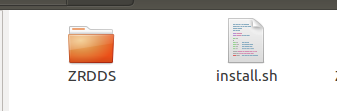
>
> **图示信息：**
>
> - File explorer view showing two items: a folder named 'ZRDDS' and a script file named 'install.sh'.

 执行 sudo ./install.sh；

 出现 Install ZRDDS to `/usr/ZRDDS` finished！则认为安装成功。默认安装路径为`/usr/ZRDDS`；

 重启宿主机，确保 echo $ZRDDS_HOME 时可打印`/usr/ZRDDS`：

> 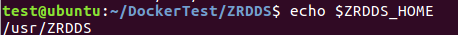
>
> **图示信息：**
> - Terminal output showing the result of echoing the ZRDDS_HOME environment variable in a Docker test directory.
> - Prompt: test@ubuntu:~`/DockerTest/ZRDDS`$
> - Command executed: echo $ZRDDS_HOME
> - Output value: `/usr/ZRDDS`

24.3.2 宿主机获取授权

进入`/usr/ZRDDS/bin` 目录，运行 LicenceInfoUtil。对于需要运行容器的宿主机而言，此步骤为必

须步骤。

> 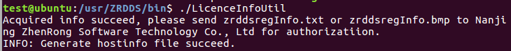
>
> **图示信息：**
> - Terminal output of executing ./LicenceInfoUtil in `/usr/ZRDDS/bin`, showing successful acquisition of host info and generation of authorization files.
> - Command executed: ./LicenceInfoUtil
> - Output line 1: 'Acquired info succeed, please send zrddsregInfo.txt or zrddsregInfo.bmp to Nanjing ZhenRong Software Technology Co., Ltd for authorization.'
> - Output line 2: 'INFO: Generate hostinfo file succeed.'
> - Current working directory: `/usr/ZRDDS/bin`
> - User/host: test@ubuntu

获取到 zrddslicence.lic 后，将该文件放置到宿主机的 ZRDDS_HOME 目录下。

24.3.3 开发 DDS 应用程序

用户根据自身需求完成 DDS 应用程序的开发、编译工作。

根据需要，可以选择构建应用的 Docker 镜像，也可以选择在运行容器后再部署应用程序。

24.3.4 运行容器及 DDS 应用程序

采用镜像运行容器时，需要将宿主机的 ZRDDS_HOME 目录挂载至容器中，并将容器中的对应目

录设置为 ZRDDS_HOME 环境变量。

如下运行容器的指令：

docker run -it -v `/usr/ZRDDS`:`/usr/ZRDDS` --env ZRDDS_HOME=`/usr/ZRDDS` --network macvaln_test

[镜像 ID]

其中 -v `/usr/ZRDDS`:`/usr/ZRDDS-Docker` 是指将宿主机的 `/usr/ZRDDS` 挂载至容器中的

`/usr/ZRDDS-Docker` 目录中，而--env ZRDDS_HOME=`/usr/ZRDDS-Docker` 则是将 ZRDDS_HOME 的环境变

量的值设置容器中的相应目录。如此一来，在容器中的 DDS 应用启动时便可访问宿主机中的

zrddslicence.lic 授权文件，从而完成授权的验证动作。

注意，上面的指令仅作为示例。如果您使用的是 Kubernetes 等容器管理工具，请采用该工具中

目录挂载、环境变量设置的方式完成本步骤。

### 24.4. 常见问题

Q：将 DW、DR 分别部署于两个容器中，且容器部署于支持组播的网络环境下。但 DW 和 DR

之间仍然无法匹配。

A：请按照以下步骤进一步进行检查：

 两个容器是否为多网卡？如果是多网卡，则是否分别含有 IP 地址一致的网卡？

 如果有，则在两个应用的 DPFQos 中，增加名为 sysctl.global.network.disabled_interface 的

property，并在 value 中填入网卡的名称。

 重新编译、部署，并尝试。

如您感兴趣，可阅读以下具体原因：

在 ZRDDS 中，应用会将当前网络中所有网卡的 IP 信息保存至自身发现信息中，并向组播进行发

送。当其他应用从组播获取到这个发现信息后，会向发现信息中所带的 IP 地址向对方发送匹配握手

信息。当两个应用交换握手信息后，才认为完成匹配。

而不同容器一般存在一个用于和宿主机进行通信的网卡，比如名为 docker 的网卡。且不同容器

的 docker 网卡的 IP 地址一般都是采用的默认值。因此，当应用向其他应用发送握手信息时，可能

会误用这个一模一样的 IP 进行通信。事实上，这包数据是无法到达真实目的端的，但由于本机上也

存在这个 IP 地址，因此从网络层面看会认为这包数据发送成功。

PART 11ZRDDS 日志使用

## 第25章日志说明

本章节主要介绍 ZRDDS 日志的级别，日志支持的输出通道，当前所支持的不同输出模式以及日

志接口的使用方式。主要包括以下内容：

- 日志级别

- 日志输出模式

- 日志风格

- 日志 API

### 25.1. 日志级别

级别参数与含义如下表所示：

表 25-1 级别参数与含义对照表

| 级别 | 含义 |
| --- | --- |
| ZRLOG_ERROR | 程序出现不可忽略的错误。 |
| ZRLOG_ADMIN_INFO | 系统管理员视角的信息,如一些调试信息。 |
| ZRLOG_USER_INFO | 通知用户视角信息，即只能看到自定义Endpoint之间的数<br>据交互。 |
| ZRLOG_WARNING | 警告信息但是能够正常运行。 |

### 25.2. 日志输出模式

DDS 日志可以输出到以下通道：

1） 控制台

默认情况日志会输出至控制台中。通过控制台查看日志时，可通过日志颜色判断日志等级，控

制台中红色代表 ZRLOG_ERROR 级别的错误日志，黄色的代表 ZRLOG_WARNING 级别的警告日志，

绿色代表 ZRLOG_ADMIN_INFO 级别的调试日志，以及默认颜色的 ZRLOG_USER_INFO 级别的用户

信息日志。

2） 日志文件

默认在程序运行目录中生成名为“应用程序名称.ddslog”的日志文件。如果不存在则创建，如

果存在则重写。故而用户在发生故障时，建议在重新启动程序将日志文件进行备份，避免被覆

盖。

3） 分布式日志

将日志信息封装成日志主题（主题名 ZRDDS_DIST_LOG_TOPIC，类型名称 ZRDDSLogMessage）发

布出去，并在指定对端接收获取。

以上方式均可通过配置 QOS（见 25.4.1）或修改调试文件（见 26.1）来控制输出等级。

### 25.3. 日志风格

根据用户对日志信息关注点不同，ZRDDS 提供三种日志风格，包括标准风格、极简风格以及元

信息风格。风格可通过 ZRLogSetDisplayStyle 接口或者交互式调试日志的方式进行切换。

25.3.1 标准风格

默认情况下，ZRDDS 将采用标准风格进行日志输出。使用标准风格时，日志将按照以下模式输

出：

******************** 时间（精确到毫秒） ********************

LOGINFO：LEVEL`<日志级别>`

FUN：文件名：函数名`<LINE：行号>`

具体日志内容

*******************************************************************

在“具体日志内容”中将展示日志产生原因、调试信息等详细内容。

例如：

> 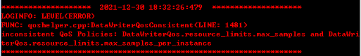
>
> **图示信息：**
> - A log entry in standard style showing an ERROR-level message with timestamp, log level, function location, and inconsistent QoS policy details.
> - Timestamp: 2021-12-30 18:32:26:479
> - LOGINFO: LEVEL(ERROR)
> - FUNC: qoshelper.cpp:DataWriterQosConsistent(LINE: 1481)
> - inconsistent QoS Policies: DataWriterQos.resource_limits.max_samples and DataWriterQos.resource_limits.max_samples_per_instance

25.3.2 极简风格

极简风格不展示文件名，函数名以及行号等内容，只展示时间，日志级别与用户所关注的日志

具体信息，输出模式如下：

[ 时间（精确到毫秒）] [ 日志级别] 具体日志内容

此模式更为简约，对日志内容展示更为清晰。

例如：

> 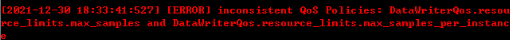
>
> **图示信息：**
>
> - A red-colored log line showing an ERROR timestamped at 2021-12-30 18:33:41:527, indicating an inconsistency in QoS policies related to DataWriterQos resource limits.

25.3.3 元信息风格

元信息风格在极简风格之上，对文件，函数名以及行号等进行展示，输出模式如下：

[ 时间（精确到毫秒）] [ 日志级别] [ 文件名：函数名：行号]

具体日志内容

相较于标准风格，元信息风格以更简约的模式展示了日志信息，方便用户更快定位到所需了解

的内容。

例如：

> 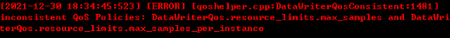
>
> **图示信息：**
> - A single-line log entry showing an ERROR-level message with timestamp, file`/function/line` context, and a QoS inconsistency detail.
> - [2021-12-30 18:34:45:523] [ERROR] [qoshelper.cpp:DataWriterQosConsistent:1481]
> - inconsistent QoS Policies: DataWriterQos.resource_limits.max_samples and DataWriterQos.resource_limits.max_samples_per_instance

### 25.4. 日志 API

25.4.1 日志 QoS

ZRDDS 支持使用日志 Qos 来配置日志系统，包括日志等级掩码、是否使能分布式日志等。用户

可通过配置域参与者工厂 Qos 下的 dds_log 成员来使能分布式日志以及控制日志输出等级。成员属

性详见该手册 10.13 章节。

日志等级掩码值与使能级别对应关系如下：

表 25-2 日志等级掩码与使能级别对照表

| 掩码值（十进制） | 掩码值（十六进制） | 使能级别 |
| --- | --- | --- |
| 0 | 0x00 | 不输出任何日志 |
| 2 | 0x02 | 仅输出错误日志 |
| 18 | 0x12 | 输出错误日志、警告日志 |
| 22 | 0x16 | 输出错误日志、警告日志、管理员等<br>级日志 |
| 30 | 0x1E | 输出所有日志 |

25.4.1.1 配置示例

分布式日志相关配置方式将在 27.1 中进行举例介绍，此处只举例输出级别配置。

DDS::DomainParticipantFactoryQos dpfQos;

```text
factory->get_qos(dpfQos);
//控制台仅开启错误日志
dpfQos.dds_log.console_mask = 2;
//文件开启错误日志与警告日志
dpfQos.dds_log.file_mask = 18;
factory->set_qos(dpfQos);
```

25.4.2 日志接口

ZRDDS 为用户提供一些日志接口，这些接口可以帮助用户以日志形式输出指定内容。

25.4.2.1 接口介绍

ZRDDS 支持的日志接口如下表：

表 25-3 日志接口说明表

| 接口 | 参数 | 参数含义 | 说明 |
| --- | --- | --- | --- |
| ZRLogInitial()<br>（支持版本>=2.2.7） | ZR_UINT32 consoleMask, | 输出到控制台的<br>日志等级掩码. | 初始化日志模块接<br>口。<br>在初始化域参与者<br>工厂时将自动初始<br>化日志模块。<br>一般情况下，不需<br>要主动调用。 |
|  | ZR_UINT32 fileMask, | 输出到日志文件<br>的日志等级掩<br>码. |  |
|  | ZRLogDisplayStyle style | 日志风格（风格<br>类型与对应参数<br>值在本表后介<br>绍） |  |
| ZRLogDestroy()<br>（支持版本>=2.2.7） | 无 | 无 | 回收日志接口。<br>在回收域参与者工<br>厂时将自动回收日<br>志资源。<br>一般情况下，不需<br>要主动调用。 |
| ZRLOG() | type | 该日志所属的级<br>别（级别参数在<br>本表后介绍） | 输出指定级别的日<br>志。 |
|  | format | 字符串格式(类<br>printf). |  |
|  | ….. | 变参 |  |
| ZRLOG_DEBUG() | guid | 该调试信息所属<br>实体 | 输出调试日志。 |
|  | topic | 该调试信息所属<br>主题 |  |
|  | debugNo | 该调试信息所属<br>编号 |  |
|  | format | 字符串格式 |  |
|  | … | 变参 |  |
| ZRLOG_DEBUG_W_POS() | guid | 所属实体 | 输出调试日志并携<br>带自定义位置信<br>息。 |
|  | topic | 所属主题 |  |
|  | debugNo | 调试信息编号 |  |
|  | file | 所属文件 |  |
|  | func | 所属函数 |  |
|  | line | 行号 |  |
|  | format | 字符串格式 |  |
|  | … | 变参 |  |
| ZRLOG_USER() | 参数信息同ZRLOG_DEBUG() |  | 输出用户信息日<br>志。 |
| ZRLOG_USER_W_POS() | 参数信息同ZRLOG_DEBUG_W_POS() |  | 输出用户信息日志<br>并携带自定义位置<br>信息。 |
| ZRLOG_DEBUG_W_EXP() | guid | 所属实体 | 输出调试信息宏，<br>在输出前后分别执<br>行指定表达式。 |
|  | topic | 所属主题 |  |
|  | debugNo | 调试信息编号 |  |
|  | preState1 | 第一条前置语句 |  |
|  | preState2 | 第二条前置语句 |  |
|  | postState1 | 第一条后置语句 |  |
|  | postState2 | 第二条后置语句 |  |
|  | format | 字符串格式 |  |
|  | … | 变参 |  |
| ZRLogSetDisplayStyle() | ZRLogDisplayStyle style | 日志风格 | 指定输出日志风格 |
| ZRLogBeginLog() | DDS_LogType type | 以下调试信息所<br>属的类型 | 当需要连续写入日<br>志信息时调用，必<br>须与 ZRLogEndLog<br>配合使用，在二者<br>之间的日志内容将<br>合并为一条日志，<br>只进行一次输出。 |
|  | const ZR_INT8* file | 所属文件名 |  |
|  | const ZR_INT8* func | 所属函数 |  |
|  | ZR_UINT32 line | 行号 |  |
|  | ZR_BOOLEAN combie | 是否将连续日志<br>合并成一个，在<br>分布式日志时有<br>区别，合并后发<br>送一条日志，不<br>合并则发送多条<br>日志，合并对于<br>连续输出的长度<br>有限制 |  |
| ZRLogEndLog() | 无 | 无 | 当连续写入日志信<br>息结束时调用，与<br>ZRLogBeginLog配合<br>使用，连续日志在<br>调用此函数时进行<br>输出。 |

ZRDDS 支持的风格类型与参数值如下表所示，相关风格的具体展示模式已在 25.3 中介绍

表 25-4 日志风格与参数对照表

| 日志风格 | 参数值 |
| --- | --- |
| 标准风格 | GRACEFUL_STYLE |
| 极简风格 | PRACTICAL_STYLE |
| 元信息风格 | META_STYLE |

25.4.2.2 接口使用示例

> 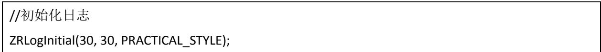
>

```text
//指定日志风格
ZRLogSetDisplayStyle(GRACEFUL_STYLE);
ZRLOG(ZRLOG_ERROR, "ZRLOG(level = %d)", 2);
ZRSleep(500);
ZRLOG_DEBUG(NULL, "EXAMPLE", 3001, "ZRLOG_DEBUG");
ZRSleep(500);
ZRLOG_DEBUG_W_POS(NULL, "HAHA", 3002, __FILE__, __FUNCTION__, __LINE__,
"ZRLOG_DEBUG_W_POS ok!");
//回收日志接口
ZRLogDestroy();
```

## 第26章交互式调试日志

交互式调试日志可控制日志的输出，调试文件名称为“zrdds_debug_file.zrdebug”，该调试文件生

效的时机包含两个：

1） 创建域参与者工厂时。

2） DDS 周期性检查（100ms）到调试文件修改时。

交互式日志一般在需要调试时使用，正常情况下不需要使用。

本章节主要包括以下内容：

- 调试文件书写规范

- 参数介绍

- 调试文件示例

### 26.1. 调试文件书写规范

调试文件由多条单行的调试命令组成，调试命令的格式为：debug_cmd 命令编号命令参数，其

中调试命令编号及其参数参见下表：

表 26-1 调试命令编号与参数对照表

| 命令编号 | 命令类型 | 命令参数 |
| --- | --- | --- |
| 0 | 使能指定调试编号范围 | 开始编号结束编号 |
| 1 | 取消使能指定调试编号范围 | 开始编号结束编号 |
| 2 | 使能指定主题调试信息 | 主题名(无需引号，特殊值将在26.2.1节中介绍) |
| 3 | 取消使能指定主题调试信息 | 主题名 |
| 4 | 使能指定实体调试信息 | InstanceHandle的16进制串<br>（当16进制串为0时，为使能所有实体） |
| 5 | 取消使能指定实体调试信息 | InstanceHandle的16进制串 |
| 6 | 设置日志级别 | 控制台掩码文件掩码分布式日志掩码（掩码值将在<br>26.2.2中进行介绍） |
| 8 | 使能指定日志风格 | 风格编号（编号与其对应风格在26.2.3中介绍） |

### 26.2. 参数介绍

26.2.1 特殊主题名称

表 26-2 特殊主题与含义对照表

| 主题名称 | 含义 |
| --- | --- |
| ZRDDS_NETWORK_TOPIC | 网络相关操作 |
| ZRDDS_DOMAINPARTICIPANT_TOPIC | 域参与者相关调试信息 |
| ZRDDS_DOMAINPARTICIPANTFACTORY_TOPIC | 域参与者工厂调试信息 |
| ZRDDS_MPORT_TOPIC | MPORT实现的RIO调试信息 |
| ZRDDS_VALIDATOR_TOPIC | License验证相关调试信息 |
| ZRDDS_INTERACTIVECMD_TOPIC | 交互式命令相关调试信息 |
| ZRDDS_ANY_LOG_TOPIC_NAME___ | 任意主题的调试信息（若开启此名称调试信息，调<br>试文件中关闭某一特定主题的指令将会失效） |

注：ZRDDS_ANY_LOG_TOPIC_NAME___末尾为 3 个下划线

26.2.2 日志级别掩码值

设置掩码格式为 debug_cmd 6 [控制台掩码][文件掩码] [分布式日志掩码]。在对应掩码位置输入

以下数值，可调整其日志输出等级。此处必须填入十六进制整形。

例如 debug_cmd 6 1E1E 1E，表示在控制台、日志文件、分布式日志中均输出所有等级日志。

表 26-3 使能级别与参数值对照表

| 使能级别 | 参数值 |
| --- | --- |
| 不输出任何日志 | 0 |
| 仅输出错误日志 | 2 |
| 输出错误日志、警告日志 | 12 |
| 输出错误日志、警告日志、管理员等级日志 | 16 |
| 输出所有日志 | 1E |

26.2.3 日志风格编号值

下表为日志风格与所对应的编号值，若用户设置编号之外的值，将默认使用标准风格，当设置

多次日志风格时，以最后一次设置为准。

表 26-4 风格类型与参数对照表

| 风格类型 | 参数值 |
| --- | --- |
| 标准风格 | 0 |
| 极简风格 | 2 |
| 元信息风格 | 4 |

例如 debug_cmd 80，表示使用标准风格输出日志。

### 26.3. 调试文件示例

//开启日志号为 3002 到 4003 区间内的日志（包括 3002 与 4003）

debug_cmd 0 3002 4003

//取消使能日志号为 3020 到 3030 区间内的日志（包括 3020 与 3030）

debug_cmd 1 3020 3030

//使能域参与者工厂调试主题相关调试信息

debug_cmd 2 ZRDDS_DOMAINPARTICIPANT_TOPIC

//取消使能域参与者相关调试信息

debug_cmd 3 ZRDDS_DOMAINPARTICIPANT_TOPIC

//使能指定实体

debug_cmd 4 00000000000000000000000000000000

//使能级别掩码为允许控制台，文件，分布式日志都使能

debug_cmd 6 ffff ffff ffff

//使能日志风格为极简风格

debug_cmd 8 2

## 第27章分布式日志

分布式日志功能，是将本地的日志信息通过主题数据的方式发布到 DDS 网络中，通过日志服务

查看，或者应用手动创建主题使用获取。分布式日志通常在需要在远端查看ZRDDS运行情况时使用，

正常情况下不需要使用。

本章节主要包括以下内容：

- 配置方式

- 日志信息

- 日志类型 IDL 文件

### 27.1. 配置方式

分布式日志功能是将日志信息通过指定数据类型 ZRDDSLogMessage 记录并在指定主题

ZRDDS_DIST_LOG_TOPIC 下发布，由相关订阅者接收解析的过程。用户可以通过设置 Qos 值指定日志

发布的域号与是否使能分布式日志。Qos 配置方式如下：

```text
DomainParticipantFactoryQos dpfQos;
DomainParticipantFactory::get_instance()->get_qos(dpfQos);
//设置日志发布域号为 115
dpfQos.dds_log.distributed_log_writer_domain_id = 115;
//使能分布式日志
dpfQos.dds_log.enable_distributed_log = true;
DomainParticipantFactory::get_instance()->set_qos(dpfQos);
```

日志接收端需要以指定的数据类型 ZRDDSLogMessage 在相同域号的指定主题

ZRDDS_DIST_LOG_TOPIC 下接收日志信息，用户可通过自定义函数输出或处理所接收的日志信息。

### 27.2. 日志信息

日志内容通过指定数据类型 ZRDDSLogMessage 记录并分发，ZRDDSLogMessage 的成员与记录内

容如下表：

表 27-1 数据类型成员与所记录内容对照表

| 成员 | 记录内容 |
| --- | --- |
| DDS_Octet version[2] | 记录当前日志版本号 |
| DDS_ULong rtps_host_id | 记录日志发布端IP地址 |
| DDS_ULong rtps_app_id; | 记录生成日志程序进程号 |
| DDS_Char* rtps_app_name | 记录此条日志所在程序名 |
| DDS_ULong level | 记录日志等级 |
| DDS_Char* function | 记录此条日志所在函数名 |
| DDS_Long debug_num | 记录日志号（非调试日志此值为0） |
| DDS_Char* debug_topic_name | 记录日志主题名（非调试日志此值为0） |
| DDS_Char* content | 记录日志内容 |
| DDS_ULongLong thread_id | 记录生成此条日志线程号 |
| DDS_Char* file | 记录此条日志所在文件名 |
| DDS_ULong line_no | 记录此条日志所在行号 |
| DDS_ULong entity_id[4] | 记录产生此条日志的实体Guid |
| DDS_LongLong time | 记录日志产生时间 |

### 27.3. 日志类型 IDL 文件

可直接通过 ZRDDS 编译器编译 IDL 文件生成日志订阅端，并通过自定义函数进行日志信息

的处理，日志数据类型 IDL 如下：

struct ZRLogMessage

```text
{
octet version[2];
unsigned long rtps_host_id;
unsigned long rtps_app_id;
string rtps_app_name;
unsigned long level;
string function;
long debug_num;
string debug_topic_name;
string content;
unsigned long long thread_id;
string file;
unsigned long line_no;
unsigned long entity_id[4];
long long time;
};
```
