## 1. 安装环境要求

## 1.1. 硬件环境

CPU：奔腾4及以上级别x86兼容处理器；华睿2号等嵌入式处理器

内存：256M

磁盘空间：开发机500M，运行机取决于应用大小

网络：10M 及以上支持 TCP/IP 协议以太网、RapidIO

## 1.2. 软件环境

表 1 臻融数据分发服务 DDS 系统软件软件环境要求
<table><tr><td rowspan=1 colspan=1>操作系统</td><td rowspan=1 colspan=1>系统最低版本</td><td rowspan=1 colspan=1>依赖环境</td></tr><tr><td rowspan=2 colspan=1>Windows</td><td rowspan=1 colspan=1>Windows XP</td><td rowspan=1 colspan=1>Visual Sutdio 2008 及以上版本的 IDE 及运行库</td></tr><tr><td rowspan=1 colspan=1>MinGW</td><td rowspan=1 colspan=1>4.4.0等</td></tr><tr><td rowspan=1 colspan=1>Linux</td><td rowspan=1 colspan=1>Linux2.6.0 以上</td><td rowspan=1 colspan=1>g++4.8以上版本，包含C++相关支持库、工具链，Make工具链</td></tr></table>

## 2. 安装与配置

## 2.1. Windows 安装

第一步：双击安装包，启动安装程序，若杀毒软件或防火墙弹出警告，请允许安装程序运行或将安装程序添加到白名单。点击“下一步”。

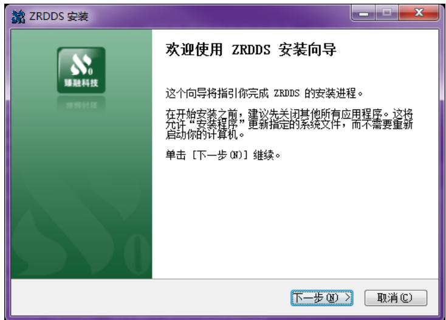

第二步：选择安装路径后，并点击“安装”。

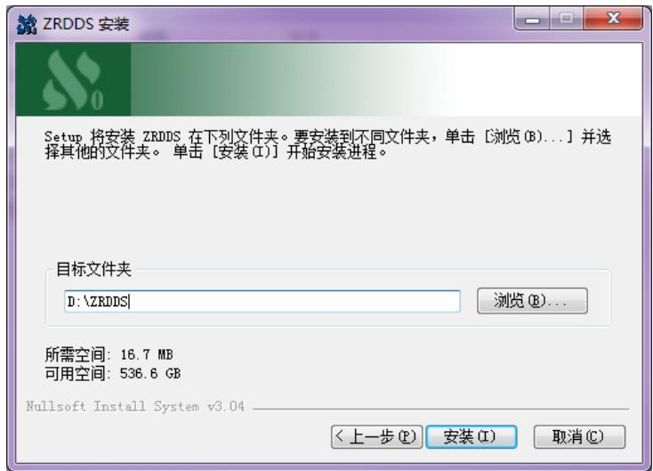

## 第三步：等待安装完成。

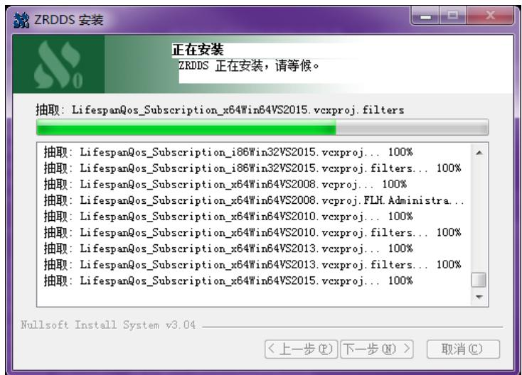

第四步：若安装过程中出现如下图所示的提示框，代表在本次安装之前，机器中已经安装过ZRDDS，此次安装会替换关于 ZRDDS的环境变量。点击”确定”。

第五步：安装程序会在系统中设置环境变量，为了使环境变量起效，需要重新启动计算机，用户在使用 ZRDDS之前重启即可。

第六步：安装完后，点击“完成”。

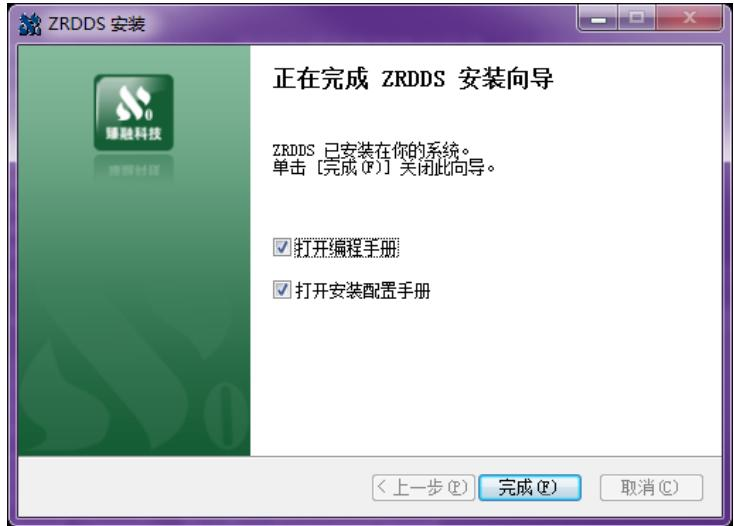  
至此，臻融数据分发服务DDS系统软件已经成功安装到计算机上。

## 2.2. Linux 安装

 解压 ZRDDS 开发包，可以双击解压至任意目录，或使用命令：tar xzvfZRDDSSetupX64JDK1.8GCC4.8.4.tar.gz 解压后有一个目录 ZRDDS 以及一个安装脚本 install.sh；

 打开终端，进入安装脚本所在目录，为安装脚本添加执行权限：chmod +xinstall.sh 并以 root 权限执行安装脚本：sudo ./install.sh

 默认安装在目录/usr/ZRDDS 中，并会设置 ZRDDS\_HOME 环境变量；

## 2.3. ZRDDS 授权文件获取步骤

 Windows 平台双击运行安装目录/bin/LicenceInfoUtil.exe 获取授权信息；

 Linux 平台使用终端进入安装目录的 bin 目录，并运行./LicenceInfoUtil 应用获取授权信息；

 运行成功将会有提示，将同一目录的 zrddsregInfo.txt 或二维码 zrddsregInfo.bmp 发送给臻融软件科技有限公司；

 接收臻融软件科技有限公司生成的授权文件zrddslicence.lic；

 将授权文件放在ZRDDS安装目录或者ZRDDS运行程序运行目录即可完成ZRDDS应用授权；

 授权文件仅能够在获取授权信息的那台机器上面使用。

## 2.4. 创建数据类型支持文件

由于 DDS 中允许用户使用自定义的数据类型进行数据发布和订阅，因此需要用户在使用 DDS 编写应用程序前定义所使用的数据类型。数据类型通过 IDL 文件定义，IDL 文件具体格式见ZRDDS用户手册第3 章。IDL文件编写完成后，需要使用到安装目录中bin目录下的zrddsgen.exe/zrddsgen 进行编译，生成支持文件。zrddsgen.exe/zrddsgen 通过命令行运行，

Windows下通过命令提示符进入到其目录下运行，通常情况下的运行参数如下：

<table><tr><td>zrddsgen.exe -i [inputFile] -d [outputDir] -l C++</td></tr><tr><td>Linux下通过终端进入到ZRDDS安装目录/bin目录下运行，通常情况下的运行参数如下：</td></tr><tr><td>zrddsgen -i [inputFile] -d [outputDir] -l C++</td></tr></table>

其中[inputFile]替换为用户的IDL文件，[outputDir]替换为支持文件输出的目录。更多参数的信息见 ZRDDS 用户手册第 3 章。

假定用户定义的数据类型名称为 Foo，使用 zrddsgen.exe 生成的支持文件总共有六个，分 别 为 ： Foo.h 、 Foo.cpp 、 FooDataReader.h 、 FooDataWriter.h 、 FooTypeSupport.h 、FooTypeSupport.cpp。如果使用 C 语言，生成的文件为：Foo.h、Foo.c、FooDataReader.h、FooDataWriter.h、FooTypeSupport.h、FooTypeSupport.c

使用zrddsgen.exe 生成的支持文件可以使用在所有ZRDDS支持的操作系统上。

## 2.5. Viusal Studio 配置工程

在Windows平台上，臻融数据分发服务DDS支持的IDE包括：VS2008、VS2010和VS2013。下面以VS2013 作为示例对配置过程进行说明。更详细的配置见ZRDDS用户手册。

## 2.5.1. 创建工程

 单击文件。

 单击新建。

 单击项目。

 选择 Visual C++中的空项目，创建一个工程。

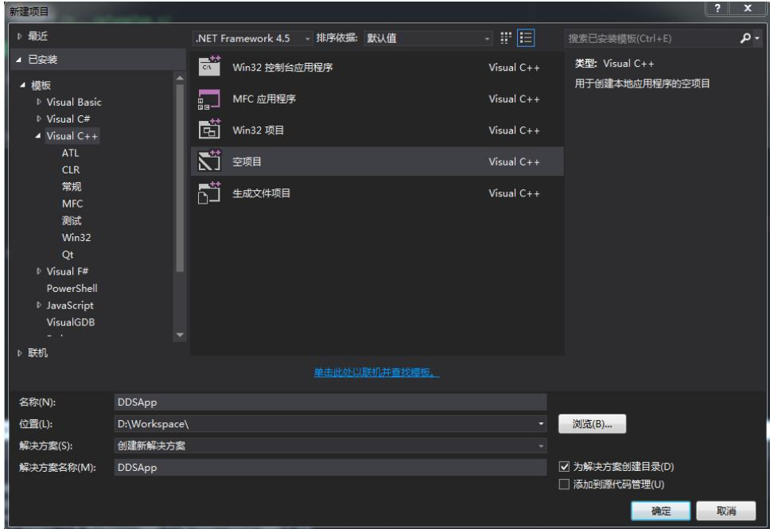  
 将 zrddsgen.exe 生成的文件添加到工程（Foo.h、Foo.cpp、FooDataReader.h、FooDataWriter.h、FooTypeSupport.h、FooTypeSupport.cpp）。

## 2.5.2. 配置包含文件目录

 在菜单栏点击项目，选择属性。

 选择 C/C++。

 选 择 常 规 ， 在 附 加 包 含 目 录 中 添 加 “ \$(ZRDDS\_HOME)/include/ZRDDSCoreInterface;\$(ZRDDS\_HOME)/include/CPlusPlusInterface”，如果使用 C 语言开发 则 需 要 添 加 “ \$(ZRDDS\_HOME)/include/ZRDDSCoreInterface;\$(ZRDDS\_HOME)/include/CInterface”。

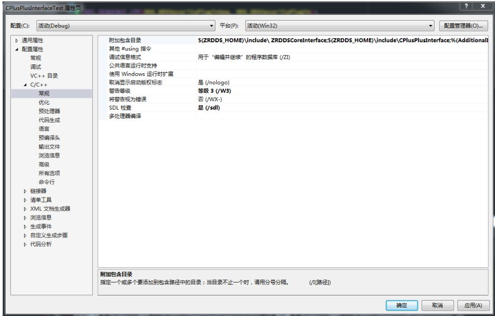

## 2.5.3. 配置链接库

臻融数据分发服务 DDS系统软件Windows平台运行库文件的命名规则如表2所示。

表 2DDS 运行库命名规则  
ZRDDS(C|Cpp)[z][d]\_(VS2008|VS2010|VS2013).lib  
其中：  
ZRDDS 固定前缀；  
C 或者Cpp表明当前库是用于C 或者 C++语言；  
z 表明当前为静态库，否则为动态库；  
d 表明当前库是Debug版本，否则为 Release版本  
固定分隔符  
VS2008/VS2010/VS2013 表明当前库用于哪个 IDE。  
工程配置如下：  
 在菜单栏点击项目，选择属性。  
 选择链接器。  
 选择常规，在附加库目录中添加“\$(ZRDDS\_HOME)/lib”。  
 选择输入，在附加依赖项中根据需要，选择添加表3 中的一个库文件。  
 在项目->属性->链接器->输入->附加依赖项中根据表3 配置运行时库。

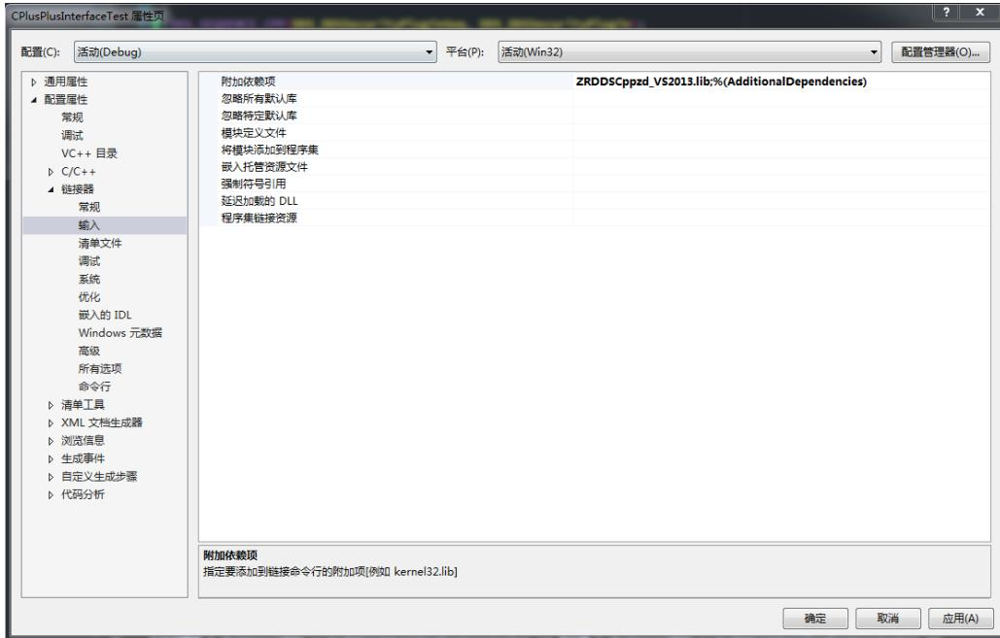

 在项目->属性->C/C++->预处理器->预处理器定义中根据表 3添加预编译符。  
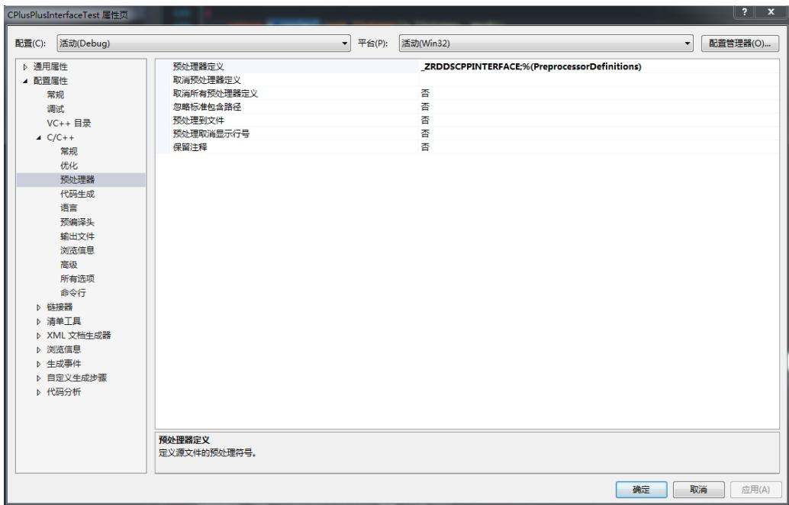

 在项目->属性->C/C++->代码生成->运行库中根据选择的库版本进行配置，debug 库使用/MDd，release 库使用/MD。

<table><tr><td colspan="4">CPlusPlusinterfaceTest 压性质</td></tr><tr><td colspan="4">配置(C): Debug2013 平台(P):</td></tr><tr><td>p 通用雕性 应用字符举油</td><td></td><td>活动(Win32)</td><td>配置管理器(O)..</td></tr><tr><td>配置服性</td><td>启用最小重新生成 是(/Gm)</td><td></td><td></td></tr><tr><td>常观</td><td>应用C++ 异常</td><td>星(/EHsc)</td><td></td></tr><tr><td>调试</td><td>较小类型检查</td><td>否</td><td></td></tr><tr><td>VC++ 目录</td><td>基本运行时检查</td><td>两者(/RTC1.等同于/RTCsu) (/RTC1)</td><td></td></tr><tr><td>C/C++</td><td>运行库</td><td>多线程试 DLL (/MDd)</td><td>日</td></tr><tr><td>常观</td><td>结构成员对齐</td><td>默认设置</td><td></td></tr><tr><td>优化</td><td>安全检查</td><td>应用安全检查(/GS)</td><td></td></tr><tr><td>预处理器 代码生成</td><td>应用值数设链接</td><td></td><td></td></tr><tr><td>语言</td><td>应用并行代码生成 应用增续指令集</td><td>未设置</td><td></td></tr><tr><td>预编课头 输出文件</td><td>浮点模型</td><td>精度(/fp:precise)</td><td></td></tr><tr><td>浏亮信息 高级 所有选项</td><td>应用浮点鼻第 创建可热修补缺像</td><td></td><td></td></tr><tr><td>自令行 链接器</td><td></td><td></td><td></td></tr><tr><td></td><td></td><td></td><td></td></tr><tr><td></td><td></td><td></td><td></td></tr><tr><td>消单工具</td><td></td><td></td><td></td></tr><tr><td>XML 文相生成器</td><td></td><td></td><td></td></tr><tr><td>浏范信息 生成事体</td><td></td><td></td><td></td></tr><tr><td>自定义生成步骤 代码分析</td><td></td><td></td><td></td></tr><tr><td></td><td></td><td></td><td></td></tr><tr><td></td><td></td><td></td><td></td></tr><tr><td></td><td></td><td></td><td></td></tr><tr><td></td><td></td><td></td><td></td></tr><tr><td></td><td></td><td></td><td></td></tr><tr><td></td><td></td><td></td><td></td></tr><tr><td></td><td></td><td></td><td></td></tr><tr><td></td><td></td><td></td><td></td></tr><tr><td></td><td></td><td></td><td></td></tr><tr><td></td><td></td><td></td><td></td></tr><tr><td></td><td></td><td></td><td></td></tr><tr><td></td><td></td><td></td><td></td></tr><tr><td>运行库</td><td></td><td></td><td></td></tr><tr><td></td><td></td><td></td><td></td></tr><tr><td></td><td></td><td></td><td></td></tr><tr><td></td><td></td><td></td><td></td></tr><tr><td></td><td></td><td></td><td></td></tr><tr><td></td><td></td><td></td><td></td></tr><tr><td>指定运行库以进行链接。</td><td></td><td></td><td></td></tr><tr><td></td><td></td><td></td><td></td></tr><tr><td></td><td>(/MT, /MTd, /MD, /MDd)</td><td></td><td></td></tr><tr><td></td><td></td><td></td><td></td></tr><tr><td></td><td></td><td></td><td></td></tr><tr><td></td><td></td><td></td><td></td></tr><tr><td></td><td></td><td></td><td></td></tr><tr><td></td><td></td><td></td><td></td></tr><tr><td></td><td></td><td></td><td></td></tr><tr><td></td><td></td><td></td><td></td></tr><tr><td></td><td></td><td></td><td>确定 取消 应用(A)</td></tr><tr><td></td><td></td><td></td><td></td></tr><tr><td></td><td></td><td></td><td></td></tr><tr><td></td><td></td><td></td><td></td></tr><tr><td></td><td></td><td></td><td></td></tr><tr><td></td><td></td><td></td><td></td></tr><tr><td></td><td></td><td></td><td></td></tr><tr><td></td><td></td><td></td><td></td></tr><tr><td></td><td></td><td></td><td></td></tr><tr><td></td><td></td><td></td><td></td></tr><tr><td></td><td></td><td></td><td></td></tr><tr><td></td><td></td><td></td><td></td></tr><tr><td></td><td></td><td></td><td></td></tr><tr><td></td><td></td><td></td><td></td></tr><tr><td></td><td></td><td></td><td></td></tr><tr><td></td><td></td><td></td><td></td></tr><tr><td></td><td></td><td></td><td></td></tr><tr><td></td><td></td><td></td><td></td></tr><tr><td></td><td></td><td></td><td></td></tr></table>

表 3Windows 库文件选择
<table><tr><td rowspan=1 colspan=1>语言</td><td rowspan=1 colspan=1>Visual Studio 版本</td><td rowspan=1 colspan=1>库文件</td><td rowspan=1 colspan=1>预编译符</td></tr><tr><td rowspan=12 colspan=1>C++</td><td rowspan=4 colspan=1>VS2008</td><td rowspan=1 colspan=1>ZRDDSCpp_VS2008.lib</td><td rowspan=1 colspan=1>_ZRDDSDLLIMPORTZRDDSCPPINTERFACE</td></tr><tr><td rowspan=1 colspan=1>ZRDDSCppd_VS2008.lib</td><td rowspan=1 colspan=1>_ZRDDSDLLIMPORTZRDDSCPPINTERFACE</td></tr><tr><td rowspan=1 colspan=1>ZRDDSCppz_VS2008.lib</td><td rowspan=1 colspan=1>ZRDDSCPPINTERFACE</td></tr><tr><td rowspan=1 colspan=1>ZRDDSCppzd_VS2008.lib</td><td rowspan=1 colspan=1>_ZRDDSCPPINTERFACE</td></tr><tr><td rowspan=4 colspan=1>VS2010</td><td rowspan=1 colspan=1>ZRDDSCpp_VS2010.lib</td><td rowspan=1 colspan=1>ZRDDSDLLIMPORT_ZRDDSCPPINTERFACE</td></tr><tr><td rowspan=1 colspan=1>ZRDDSCppd_VS2010.lib</td><td rowspan=1 colspan=1>_ZRDDSDLLIMPORTZRDDSCPPINTERFACE</td></tr><tr><td rowspan=1 colspan=1>ZRDDSCppz_VS2010.lib</td><td rowspan=1 colspan=1>ZRDDSCPPINTERFACE</td></tr><tr><td rowspan=1 colspan=1>ZRDDSCppzd_VS2010.lib</td><td rowspan=1 colspan=1>ZRDDSCPPINTERFACE</td></tr><tr><td rowspan=4 colspan=1>VS2013</td><td rowspan=1 colspan=1>ZRDDSCpp_VS2013.lib</td><td rowspan=1 colspan=1>_ZRDDSDLLIMPORTZRDDSCPPINTERFACE</td></tr><tr><td rowspan=1 colspan=1>ZRDDSCppd_VS2013.lib</td><td rowspan=1 colspan=1>ZRDDSDLLIMPORT_ZRDDSCPPINTERFACE</td></tr><tr><td rowspan=1 colspan=1>ZRDDSCppz_VS2013.lib</td><td rowspan=1 colspan=1>ZRDDSCPPINTERFACE</td></tr><tr><td rowspan=1 colspan=1>ZRDDSCppzd_VS2013.lib</td><td rowspan=1 colspan=1>_ZRDDSCPPINTERFACE</td></tr><tr><td rowspan=1 colspan=1>C</td><td rowspan=1 colspan=1>VS2008</td><td rowspan=1 colspan=1>ZRDDSC_VS2008.lib</td><td rowspan=1 colspan=1>_ZRDDSDLLIMPORT</td></tr></table>

<table><tr><td rowspan=3 colspan=1></td><td rowspan=1 colspan=1>ZRDDSCd_VS2008.lib</td><td rowspan=1 colspan=1>_ZRDDSDLLIMPORT</td></tr><tr><td rowspan=1 colspan=1>ZRDDSCz_VS2008.lib</td><td rowspan=1 colspan=1></td></tr><tr><td rowspan=1 colspan=1>ZRDDSCzd_VS2008.lib</td><td rowspan=1 colspan=1></td></tr><tr><td rowspan=4 colspan=1>VS2010</td><td rowspan=1 colspan=1>ZRDDSC_VS2010.lib</td><td rowspan=1 colspan=1>_ZRDDSDLLIMPORT</td></tr><tr><td rowspan=1 colspan=1>ZRDDSCd_VS2010.lib</td><td rowspan=1 colspan=1>_ZRDDSDLLIMPORT</td></tr><tr><td rowspan=1 colspan=1>ZRDDSCz_VS2010.lib</td><td rowspan=1 colspan=1></td></tr><tr><td rowspan=1 colspan=1>ZRDDSCzd_VS2010.lib</td><td rowspan=1 colspan=1></td></tr><tr><td rowspan=4 colspan=1>VS2013</td><td rowspan=1 colspan=1>ZRDDSC_VS2013.lib</td><td rowspan=1 colspan=1>_ZRDDSDLLIMPORT</td></tr><tr><td rowspan=1 colspan=1>ZRDDSCd_VS2013.lib</td><td rowspan=1 colspan=1>ZRDDSDLLIMPORT</td></tr><tr><td rowspan=1 colspan=1>ZRDDSCz_VS2013.lib</td><td rowspan=1 colspan=1></td></tr><tr><td rowspan=1 colspan=1>ZRDDSCzd_VS2013.lib</td><td rowspan=1 colspan=1></td></tr></table>

至此，工程配置完成，可以编写相关代码使用臻融数据分发服务DDS系统软件。

## 2.5.4. 运行

如果使用静态库进行编译时，可以直接运行生成的应用程序，如果使用动态库进行编译，需要将安装目录中\lib文件夹下的对应动态链接库（dll文件）拷贝到应用程序的运行目录下。例如，当使用 ZRDDSCppd\_VS2013.lib 库进行编译时，需要将 ZRDDSCppd\_VS2013.dll 文件拷贝到应用程序运行目录下才能正常运行。同时也可以将安装目录中的\lib目录配置到操作系统的PATH 中，可以避免拷贝。

## 2.6. Eclipse 配置 C/C++工程

在 Linux 平台上，臻融数据分发服务 ZRDDS 支持多种 IDE，此处以 Eclipse 为例。在 Linux平台上需要安装 g++编译器，Eclipse 需要 C/C++开发插件。

## 2.6.1. 创建工程

 单击 Project…。

 选择 C/C++。

 单击 C++ Project（C 语言为 C Project）。

 在 Project type 中选择 Executable 中的 Empty Project。

 在 Toolchains 中选择工具链，这里以 Linux GCC 为例。

 单击 Finish，创建一个空项目。

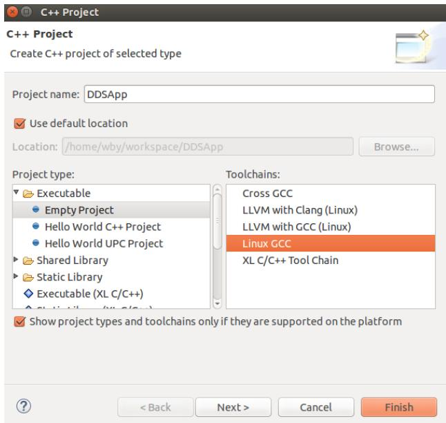

 将 zrddsgen.exe/zrddsgen 生成的文件添加到项目（Foo.h、Foo.cpp、FooDataReader.h、FooDataWriter.h、FooTypeSupport.h、FooTypeSupport.cpp）。

## 2.6.2. 配置包含文件目录

 右键项目，选择 Properties。

 选择 C/C++ Build 下的 Settings。

 在 ToolSetting 选项卡中选择 GCC C++ Compiler（C 语言则为 GCC C Compiler）下的Includes，在 Include paths 中添加头文件所在目录，\$(ZRDDS\_HOME)为 Linux 上 ZRDDS的 安 装 目 录\$(ZRDDS\_HOME)/include/ZRDDSCoreInterface\$(ZRDDS\_HOME)/include/CPlusPlusInterface。

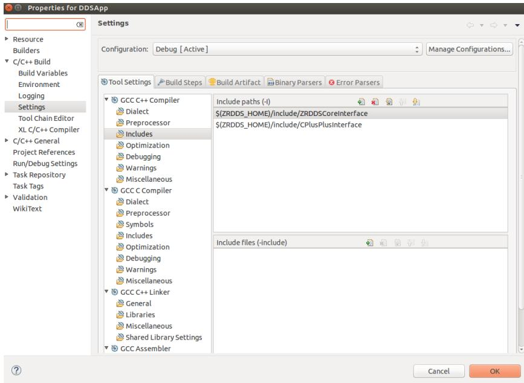

## 2.6.3. 配置链接库

 右键项目，选择 Properties。

 选择 C/C++ Build 下的 Settings。

 在 ToolSetting 选项卡中选择 GCC C++ Linker（C 语言则为 GCC C Linker）下的 Libraries，在 Library search path 中添加运行库所在目录，\$(ZRDDS\_HOME)为 Linux 上 ZRDDS的安装目录，\$(ZRDDS\_HOME)/lib。

 在 Libraries 中添加库名，包括 pthread 和 ZRDDS 库名。不同版本的 ZRDDS 库文件可根据表4 选择。注意：输入库文件的名字时需去除“lib”部分和文件后缀。

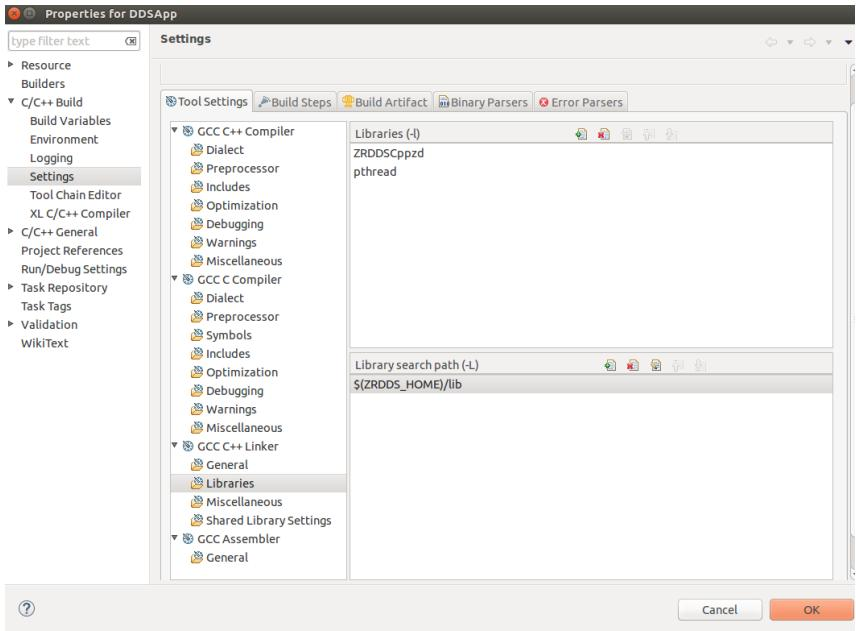

表 4 Linux 库文件选择
<table><tr><td rowspan=1 colspan=1>语言</td><td rowspan=1 colspan=1>编译所需库文件</td><td rowspan=1 colspan=1>说明</td><td rowspan=1 colspan=1>预编译符</td></tr><tr><td rowspan=4 colspan=1>C++</td><td rowspan=1 colspan=1>libZRDDSCppzd.a</td><td rowspan=1 colspan=1>Debug 版本静态库</td><td rowspan=1 colspan=1>_ZRDDSCPPINTERFACE</td></tr><tr><td rowspan=1 colspan=1>libZRDDSCppz.a</td><td rowspan=1 colspan=1>Release 版本静态库</td><td rowspan=1 colspan=1>_ZRDDSCPPINTERFACE</td></tr><tr><td rowspan=1 colspan=1>libZRDDSCppd.so</td><td rowspan=1 colspan=1>Debug 版本动态库</td><td rowspan=1 colspan=1>_ZRDDSCPPINTERFACE</td></tr><tr><td rowspan=1 colspan=1>libZRDDSCpp.so</td><td rowspan=1 colspan=1>Release版本动态库</td><td rowspan=1 colspan=1>_ZRDDSCPPINTERFACE</td></tr><tr><td rowspan=4 colspan=1>C</td><td rowspan=1 colspan=1>libZRDDSCzd.a</td><td rowspan=1 colspan=1>Debug 版本静态库</td><td rowspan=1 colspan=1></td></tr><tr><td rowspan=1 colspan=1>libZRDDSCz.a</td><td rowspan=1 colspan=1>Release 版本静态库</td><td rowspan=1 colspan=1></td></tr><tr><td rowspan=1 colspan=1>libZRDDSCd.so</td><td rowspan=1 colspan=1>Debug版本动态库</td><td rowspan=1 colspan=1></td></tr><tr><td rowspan=1 colspan=1>libZRDDSC.so</td><td rowspan=1 colspan=1>Release版本动态库</td><td rowspan=1 colspan=1></td></tr></table>

 在 ToolSetting 选项卡中选择 GCC C++ Compiler 下的 Preprocessor，在 Defined symbols中添加所选库文件对应的预编译符（C 语言无需预编译符）。

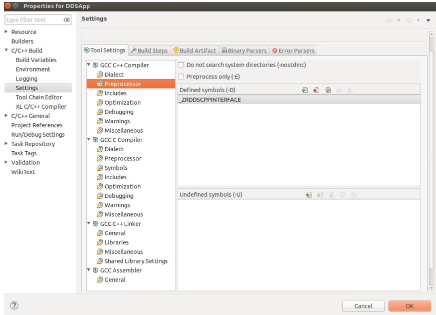  
至此，工程配置完成，可以编写相关代码使用臻融数据分发服务DDS系统软件。

## 2.6.4. 运行

如果使用静态库进行编译时，可以直接在终端运行生成的可执行文件，如果使用动态库进行编译，需要将安装目录中/lib文件夹下的对应动态链接库（so文件）拷贝到可执行文件的运行目录下。例如，当使用 libZRDDSCppd.so 库进行编译时，需要将 libZRDDSCppd.so 文件拷贝到可执行文件运行目录下才能正常运行。同时也可以将安装目录中的/lib目录配置到操作系统的PATH 中，可以避免拷贝。

## 2.7. QtCreator 项目配置

要使用ZRDDS中间件需要包含头文件所在目录，库文件所在目录，库文件名，使用C++库需要添加预编译符。以上配置可在 QtCreator 创建的项目中的.pro 文件中手动设置，具体设置方式如下：

 头文件目录：在.pro 文件中键入 INCLUDEPATH += dir1 dir2，dir1，dir2 为头文件目录 ， 用 C++ 语 言 为 \$(ZRDDS\_HOME)/include/ZRDDSCoreInterface 和\$(ZRDDS\_HOME)/include/CPlusPlusInterface ， 用 C 语 言 为\$(ZRDDS\_HOME)/include/ZRDDSCoreInterface 和\$(ZRDDS\_HOME)/include/CInterface。其中\$(ZRDDS\_HOME)为 ZRDDS 安装目录。

 库文件及其所在目录：在.pro文件中键入LIBS+=-L dir –llib。dir为库文件所在目录，跟在-L 之后，为\$(ZRDDS\_HOME)/lib。lib 为库文件名，不带后缀，跟在-l 之后，分为 ZRDDS 库（见表 1）以及 Windows 相关库（ws2\_32，wsock32，iphlpapi）。

表 1 Window 下 qt 环境库文件选择
<table><tr><td>语言</td><td>编译所需库文件</td><td>说明</td><td>预编译符</td></tr><tr><td colspan="1" rowspan="2">C++</td><td colspan="1" rowspan="1">ZRDDSCppzd.lib</td><td colspan="1" rowspan="1">Debug 版本静态库</td><td colspan="1" rowspan="1">_ZRDDSCPPINTERFACE</td></tr><tr><td colspan="1" rowspan="1">ZRDDSCppz.lib</td><td colspan="1" rowspan="1">Release 版本静态库</td><td colspan="1" rowspan="1">_ZRDDSCPPINTERFACE</td></tr><tr><td colspan="1" rowspan="2">C</td><td colspan="1" rowspan="1">ZRDDSCzd.lib</td><td colspan="1" rowspan="1">Debug 版本静态库</td><td colspan="1" rowspan="1"></td></tr><tr><td colspan="1" rowspan="1">ZRDDSCz.lib</td><td colspan="1" rowspan="1">Release 版本静态库</td><td colspan="1" rowspan="1"></td></tr></table>

 预编译符：在.pro 文件中键入 DEFINES += \_ZRDDSCPPINTERFACE。使用 ZRDDS 的 C++库时需要添加这个预编译符。

 编译设置：若出现 not permitted with -fno-rtti 问题，在.pro 文件中键入 CONFIG += rtti。  
至此，Windows下qt环境ZRDDS项目配置完成，以C++为例，下面为具体配置示例。

DDSApp. pr   
DDSApP QT += core   
DDSApp.pro   
头文件   
源文件   
4 TARGET = DDSApp   
CONFIG += console   
CONFIG -= app bundle   
TEMPLATE = app   
CharSeq.cpp   
CharSeg publication.cpp   
CharSeqTypeSupport.cpp   
Charseq.h\   
CharSeqDataReader.h\   
CharSeqDataWriter.h\   
CharSeqTypeSupport.h   
INCLUDEPATH += S(ZRDDS HOME)\include\ZRDDSCoreInterface S(ZRDDS HOME)\include\CPlusPlusInterface   
LIBS += -L \$(ZRDDS HOME)\lib -1ZRDDSCppzd -lws2 32 -lwsock32 -liphlpapi   
DEFINES += ZRDDSCPPINTERFACE   
TARGET = CharSeq pub