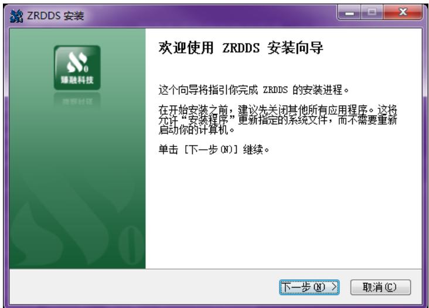
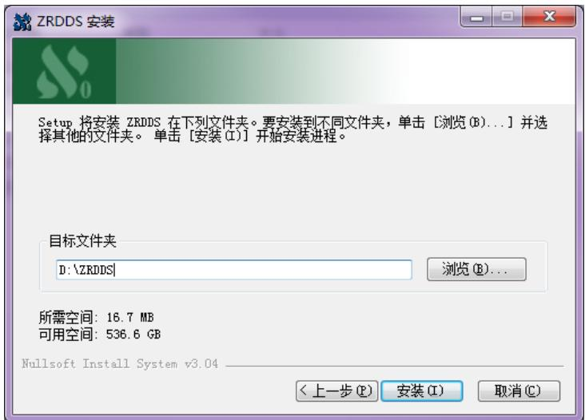
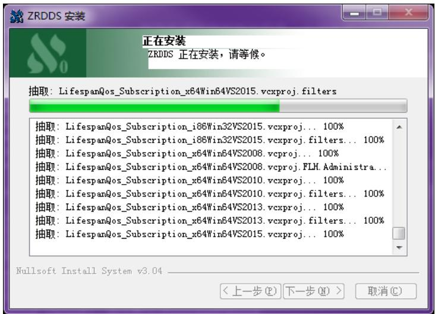
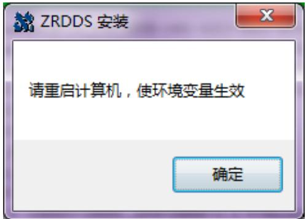
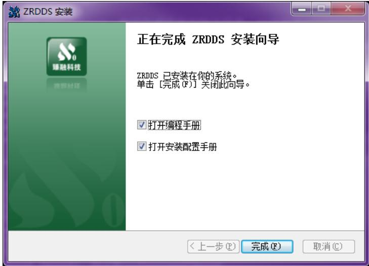
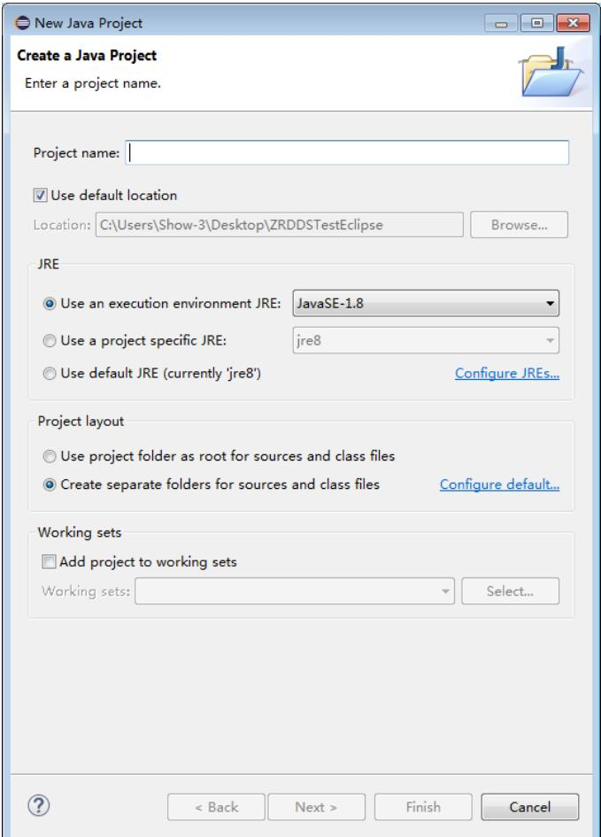
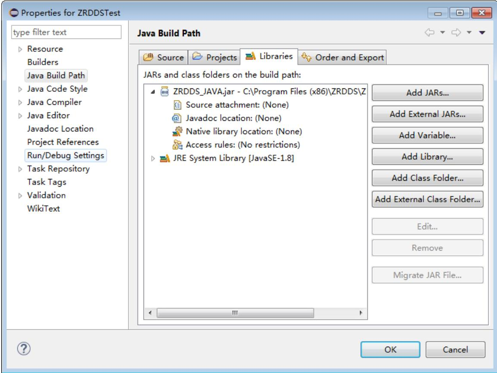
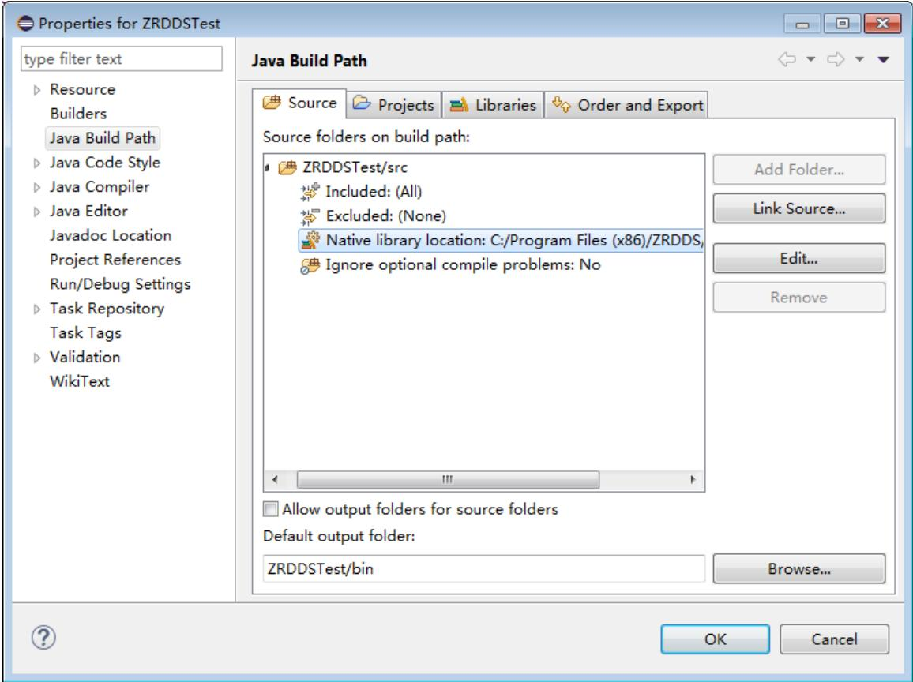
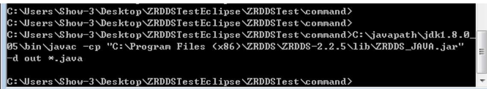
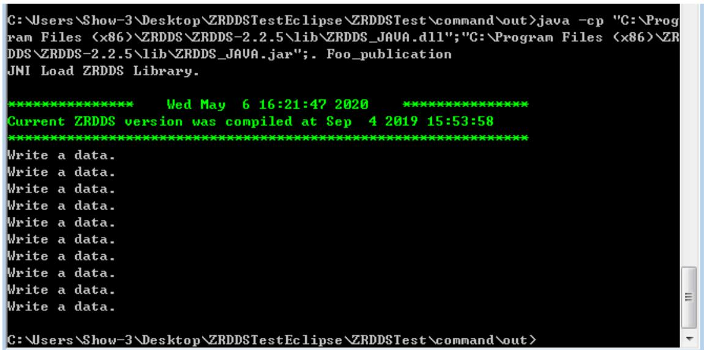

## 1. 安装环境要求

## 1.1. 硬件环境

CPU：奔腾4及以上级别x86兼容处理器；华睿2号等嵌入式处理器

内存：256M

磁盘空间：开发机500M，运行机取决于应用大小

网络：10M 及以上支持 TCP/IP 协议以太网、RapidIO

## 1.2. 软件环境

表 1 臻融数据分发服务 DDS 系统软件软件环境要求
<table><tr><td rowspan=1 colspan=1>操作系统</td><td rowspan=1 colspan=1>系统最低版本</td><td rowspan=1 colspan=1>依赖环境</td></tr><tr><td rowspan=1 colspan=1>Windows</td><td rowspan=1 colspan=1>Windows XP</td><td rowspan=1 colspan=1>java-jdk1.8 以上</td></tr></table>

## 2. 安装与配置

## 2.1. 安装

第一步：双击安装包，启动安装程序，若杀毒软件或防火墙弹出警告，请允许安装程序运行或将安装程序添加到白名单。点击“下一步”。

  
第二步：选择安装路径后，并点击“安装”。

## 第三步：等待安装完成。

第四步：若安装过程中出现如下图所示的提示框，代表在本次安装之前，机器中已经安装过ZRDDS，此次安装会替换关于 ZRDDS的环境变量。点击”确定”。

第五步：安装程序会在系统中设置环境变量，为了使环境变量起效，需要重新启动计算机，用户在使用 ZRDDS之前重启即可。

  
第六步：安装完后，点击“完成”。

  
至此，臻融数据分发服务DDS系统软件已经成功安装到计算机上。

## 2.2. ZRDDS 授权文件获取步骤

 双击运行安装目录/bin/LicenceInfoUtil.exe 获取授权信息；

 运行成功将会有提示，将同一目录的 zrddsregInfo.txt 或二维码 zrddsregInfo.bmp 发送给臻融软件科技有限公司；

 接收臻融软件科技有限公司生成的授权文件zrddslicence.lic；

 将授权文件放在ZRDDS安装目录或者ZRDDS运行程序同一目录即可完成ZRDDS应用授权；

 授权文件仅能够在获取授权信息的那台机器上面使用。

## 2.3. 创建数据类型支持文件

由于 DDS 中允许用户使用自定义的数据类型进行数据发布和订阅，因此需要用户在使用 DDS 编写应用程序前定义所使用的数据类型。数据类型通过 IDL 文件定义，IDL 文件具体格式见ZRDDS用户手册第3 章。IDL文件编写完成后，需要使用到安装目录中bin目录下的zrddsgen.exe 进行编译，生成支持文件。zrddsgen.exe 通过命令行运行，需要使用 Windows中的命令提示符进入到其目录下运行，通常情况下的运行参数如下：

假定用户定义的数据类型名称为 Foo，使用 zrddsgen.exe 生成的支持文件总共有五个，  
分别为：Foo.java、FooDataRreader.java、FooSeq.java、FooDataWriter.java、FooTypeSupport.java。  
使用zrddsgen.exe 生成的支持文件可以使用在所有ZRDDS支持的操作系统上。

zrddsgen.exe –i [inputFile] –d [outputDir] –l java

其中[inputFile]替换为用户的 IDL 文件，[outputDir]替换为支持文件输出的目录。更多参数的信息见ZRDDS用户手册第3 章。

## 2.4. 配置工程

在Windows平台上，臻融数据分发服务DDS支持多种IDE，此处以eclipse为例

## 2.4.1. 创建工程

 单击 File。

 单击 New。

 选择 Java Project，填写项目名，创建一个工程。

 将 zrddsgen.exe 生 成 的 文 件 添 加 到 工 程 （ Foo.java 、 FooDataRreader.java 、FooDataWriter.java、FooSeq、FooTypeSupport.java）。

## 2.4.2. 配置链接库

## 2.4.2.1. 链接 ZRDDS\_JAVA.jar

 右键工程->properties->Java Bulid Path->Libraries 选择 Add External JARS…，选择安装目录下的 ZRDDS\_JAVA.jar 文件。

## 2.4.2.2. 链接动态库 ZRDDS\_JAVA.dll

 右键工程->properties->Java Bulid Path->Source，展开工程目录，双击 Native librarylocation，External Folder…，选择安装目录下的 lib 目录。

## 2.4.3. 运行

直 接 添 加 main 函 数 或 者 使 用 编 译 器 –e 命 令 生 成 的 Foo\_publication.java 或 者Foo\_subscriber.java 编译运行即可。

## 2.5. 命令行编译运行

使用 zrddsgen.exe 生成文件（Foo.java、FooDataRreader.java、FooDataWriter.java、FooSeq、FooTypeSupport.java，Foo\_publication.java）。

 使用java 编译，将编译输出至文件夹 out下：

javac –cp 安装目录/lib/ZRDDS\_JAVA.jar –d out \*.java

输出

<table><tr><td colspan="2">名称</td><td>修改日期</td><td>类型</td><td>大小</td></tr><tr><td></td><td>Foo.class</td><td>2020/5/6 16:18</td><td>CLASS 文件</td><td>1 KB</td></tr><tr><td></td><td>Foo_publication.class</td><td>2020/5/6 16:18</td><td>CLASS 文件</td><td>4KB</td></tr><tr><td></td><td>Foo_subscription.class</td><td>2020/5/6 16:18</td><td>CLASS 文件</td><td>3 KB</td></tr><tr><td></td><td>FooDataReader.class</td><td>2020/5/6 16:18</td><td>CLASS 文件</td><td>1 KB</td></tr><tr><td></td><td>FooDataWriter.class</td><td>2020/5/6 16:18</td><td>CLASS 文件</td><td>1 KB</td></tr><tr><td></td><td>FooSeq.class</td><td>2020/5/6 16:18</td><td>CLASS 文件</td><td>1 KB</td></tr><tr><td></td><td>FooTypeSupport.class</td><td>2020/5/6 16:18</td><td>CLASS 文件</td><td>5 KB</td></tr><tr><td></td><td>TestDataReaderListener.class</td><td>2020/5/6 16:18</td><td>CLASS 文件</td><td>3KB</td></tr></table>

##  进入 out 文件夹下使用 java 运行：

## java –cp [ZRDDS\_JAVA.jar];[ZRDDS\_JAVA.dll];. Foo\_publication

Foo\_publication.java 中带有 main 函数

