# 臻融数据分发服务 DDS 系统软件

# 故障排查指南


单位名称：南京臻融科技有限公司

公司地址：南京市江宁区将军大道南佑路7 号

公司电话：025-52106986

网 址：www.zrtechnology.com

邮 编：211106

## 目录

1. DDS 通信过程 .........  
1.1 发现过程.........  
1.2 匹配过程..........  
1.3 通信过程......  
1.3.1 尽力而为模式..........  
1.3.2 可靠模式....................  
2 排故手段........  
2.1 网络工具.........  
2.1.1 ping.....................  
2.1.2 iperf .................... ....8  
2.1.3 sockperf............................. ......13  
2.2 交互式日志...... ....18  
2.2.1 ZRDDS 日志系统....... ....18  
2.2.2 ZRDDS 日志控制....... ......20  
2.2.3 ZRDDS 常用调试日志号 ....................... ...23  
2.3 抓包工具........ ......27  
2.3.1 DDS 的数据包封装 .................................. ......27  
2.3.2 tcpdump ........ ....28  
2.3.3 WireShark........ ......29  
2.4 ZRDDS 管理监控器 ........... ......34  
3 典型故障......... ....38  
3.1 编译失败..... ....38  
3.1.1 环境变量未生效...... ....38  
3.1.2 预编译符缺失..... ...38  
3.1.3 头文件与库不匹配........ ...38  
3.1.4 库与编译方式不匹配............... ...39  
3.1.5 动态库缺失............ ....39  
3.1.6 VisualGDB 库缺失... ...39  
3.1.7 丢失 Psapi.lib ........ ...40  
3.1.8 VS2015 版本（update 3）和库不匹配 ..................................  
3.2 初始化失败........ ......41  
3.2.1 报错................. .......41  
3.2.2 崩溃......  
......45  
3.3 收不到数据....... ......46  
3.3.1 网络环境检测...... ...46  
3.3.2 ZRDDS 配置检测 .................. ......47  
3.3.3 高级诊断......... ..49  
3.4 通信异常.... ...51  
3.4.1 序列化/反序列化失败 ......................... ......51  
3.4.2 丢包严重..... ..52  
3.4.3 数据中断.. ..52  
3.4.4 发送失败.. ...52  
3.4.5 网络中断.. ...53  
3.5 异常崩溃... ..54  
3.6 错误日志. ..57  
3.6.1 日志索引.. ....57  
3.6.2 无法找到对端可用地址.. ...58  
3.6.3 序列化失败.... ...59  
3.6.4 发现不一致版本. ..60  
3.6.5 设置优先级失败... ...60  
3.6.6 XML 文件解析失败.. ....61  
3.6.7 零拷贝禁用可靠性策略... ....61  
3.6.8 没有可用端口... ....62  
4 排故流程... ..62  
附录1 socket编程常见错误码及含义.. ...1

## 表格目录

表格 1 通信模式匹配... ..4  
表格 2 ping 工具的常见用法... ......7  
表格 3 iperf 的常见用法 .... ....8  
表格 4 Iperf 的使用示例 ... ...................................................  
表格 5 sockperf 的常见用法. ....13  
表格 6 sockperf 的使用示例..... ......14  
表格 7 调试命令编号与参数对照表............. ......21  
表格 8 特殊主题与含义对照表...... ....21  
表格 9 使能级别与参数值对照表..... .....22  
表格 10 ZRDDS 常用调试日志号..... ....23  
表格 11 tcpdump 常用命令 ....... .....29  
表格 12 子消息分析常用字段.... ....33

## 图目录

图 1 发现信息丢失.......  
图 2 单播优化..... ..3  
图 3 可靠模式通信......  
图 4 可靠模式下的数据覆盖............. .....6  
图 5 可靠模式下的数据发送失败....... ....7  
图 6 ping 工具的使用结果示例 ..........................  
图 7 UDP 测试 Server 端 ......... ....10  
图 8 UDP 测试 Client 端 ................... ......11  
图 9 TCP 测试 Server 端 ............................. .......11  
图 10 TCP 测试 Client 端 .......... ......12  
图 11 Multicast 测试 Server 端 .............. ......12  
图 12 Multicast 测试 Client 端 ......................... ......13  
图 13 UDP 测试 Client 端 ...........  
图 14 UDP 测试 Server 端 ........................ ......16  
图 15 TCP 测试 Client 端 .................. ......16  
图 16 TCP 测试 Server 端 ........... .......17  
图 17 Multicast 测试 Client 端 ................. .............................. ......17  
图 18 Multicast 测试 Server 端 ................................................................................. .......18  
图 19 RTPS 消息结构... ...27  
图 20 子消息结构......... ....28  
图 21 选择抓取网卡............ ........30  
图 22 开始捕获....... ......30  
.......30  
图 24数据分析图. ...31  
图 25 过滤后数据.... ......31  
.......32  
图 27 RTPS 消息详情......... ......32  
图 28 系统物理视图.......... ....35  
图 29 进程详细信息.. ....35  
图 30 系统逻辑视图........... ......36  
图 31 主题详细信息视图.................... ......37  
图 32 匹配分析视图........ .......37  
图 33 预编译符缺失导致的编译失败报错图 ............................... ......38  
图 34 缺失 pthread 报错图... ....39  
图 35 缺失 dl 库报错图.................... ......40  
图 36 licence 文件未找到 ..... .....41  
图 37 licence 文件被修改 .......... ......41  
图 38 licence 文件过期 ............... ......41  
图 39 没有可用网卡....... ....43  
图 40 没有网卡......... ......44  
图 41 程序中的DDS版本信息打印.... ...45  
图 42 日志文件中的DDS版本信息打印...... ....45  
图 43 销毁信号量... ..46  
图 44创建域参与者.... ........................................................ ....47  
图 45 监控器域视图..... ...................................................................... ....47  
图 46 创建主题.... .................................................. ...48  
图 47 主题信息.... ....48  
图 48 创建数据写者..... ................................................................... ....48  
图 49 Qos 不匹配打印 ... ...48  
图 50 实体 Qos 信息视图 ... ....49  
图 51配置域参与者使用的地址... .................................................... ....49  
图 52 DATA 子消息 .... .................................. ....50  
图 53 HEARBEAT 子消息. ....50  
图 54 ACKNACK 子消息“ACK”. ....................................... ....50  
图 55ACKNACK 子消息“NACK”.... ........................................... ....51  
图 56 序列化失败...... ....51  
图 57 反序列化失败.... ....52  
图 58 发送队列已满... ...53  
图 59 发送失败（超时）.... ....53  
图 60 尝试重连... ....53  
图 61 重连失败. ...53  
图 62 重连成功.. ...53  
图 63 组播发送失败. ....54  
图 64 程序崩溃图..... .....55  
图 65 GDB 加载 core 文件.. ...56  
图 66 序列化 sequence 数据失败 ..... ...59

## 1. DDS 通信过程

在默认的典型配置之下，DDS 是基于 UDP 实现的应用层通信协议。DDS 在 UDP 的简单协议之上，对用户数据进行了封封装，实现了多种功能的支持。以下分析均基于使用默认配置的DDS应用进行。

DDS从启动到通信通常需要经历三个过程，分别是发现、匹配和通信。这三个过程必须顺序进行，后一个过程必须依赖前一个过程的信息。

## 1.1 发现过程

DDS 的发现是通过 DomainParticipant 向特定的组播地址发送数据并接收来自其他DomainParticipant 的组播数据实现的。在 DDS 发送的发现数据中，包含了 DomainParticipant的基本信息，包括其 GUID、数据接收地址和端口、超时时间等信息。通过这些信息，可以对 DomainParticipant 建立起单播通信的通道，进行后续的过程。

DomainParticipant会按照一定的频率发送发现数据，通常发送的间隔小于其声明的超时时间。如果超过了超时时间未收到某个 DomainParticipant 发送的发现数据，该DomainParticipant 将被判定为下线，与之相关的所有信息都将被清除。DomainParticipant 也可以主动发送下线的数据包，表明自己将要离开。但是由于该数据并没有可靠传输的协议保证其能够被收到，因此不应当依赖这一过程。对于其他 DomainParticipant 而言，收到主动发送的数据包而下线与因超过设定时间未收到发现数据包导致下线的过程是一样的，仅在时间长短上有区别。

在 DDS 协议中，仅要求组播发送发现数据。在实现中，为了加快发现速度，在收到新的 DomainParticipant 发送的发现数据后，会立即通过单播向其发送自身的发现数据，以减少发现所需时间。

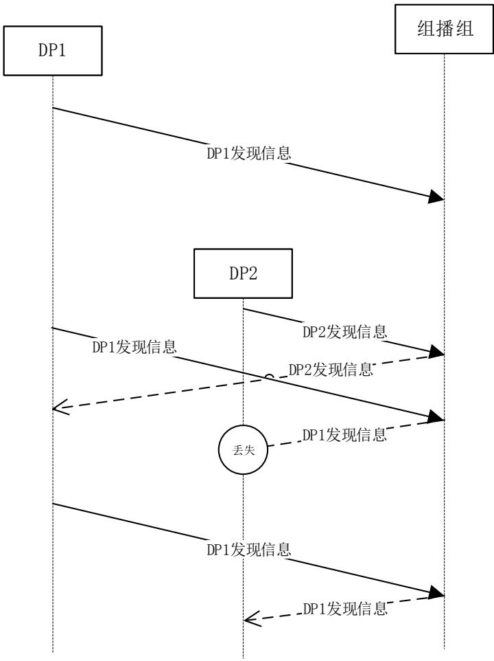  
图 1 发现信息丢失

如图1 所示，当DP1发出的发现信息丢失后，DP2无法在其创建后立即发现DP1，而需要等待 DP1 下一个发现信息的发送周期时才能发现。若发现信息发送频率较低，会明显延长发现的时间消耗。

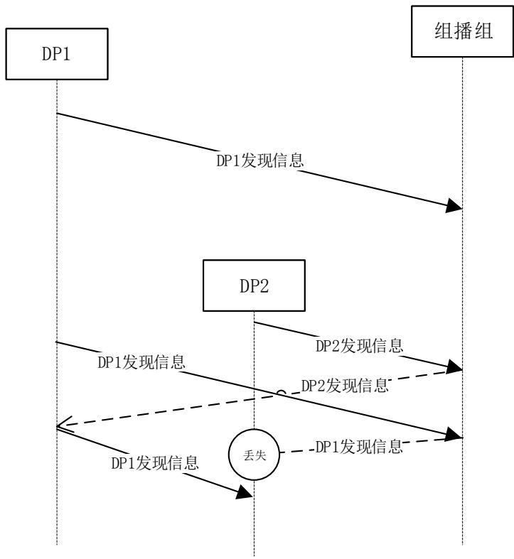  
图 2 单播优化

当加入单播优化之后，如图 2 所示，当 DP1 收到 DP2 发出的发现信息后，立即通过单播向 DP2 发送自身的发现信息，使 DP2 也能及时发现 DP1，可以明显缩短因为发现信息的偶然丢失产生的发现延迟。

## 1.2 匹配过程

在 DomainParticipant 互相发现后，就可以进行匹配过程。

DDS的匹配过程是指在两个 DomainParticipant之间交互用户创建的主题、数据写者和数据读者的信息，再根据对方的信息与自身的信息建立同一主题下数据写者和数据读者的关联关系。

匹配的数据交互过程都是通过单播进行。匹配双方会通过内置主题发送自身的数据读者和数据写者的信息，包括GUID、所属主题、所属类型、需要一致性判断的 QoS等。收发这些数据的数据读者和数据写者都被设置为可靠通信模式，因此能够保证这些信息不会因网络丢包等原因丢失。当收到对方的数据读者和数据写者信息后，首先检查自身是否包含对应的主题，然后在相应主题下将对方的数据写者与自身的数据读者、对方的数据读者与自身的数据写者进行一一配对，配对过程需要检查 QoS 是否能够兼容，最后就可以在能够匹配的数据写者和数据读者之间建立数据通路，开始通信过程。

## 1.3 通信过程

DDS通信过程可以分成两个模式，分别为尽力而为（Best-effort）和可靠（Reliable）。使

用哪一种模式取决于数据写者和数据读者的QoS配置，具体情况如表格 1所示。

表格 1 通信模式匹配
<table><tr><td rowspan=1 colspan=1>数据写者配置</td><td rowspan=1 colspan=1>数据读者配置</td><td rowspan=1 colspan=1>实际使用</td></tr><tr><td rowspan=1 colspan=1>尽力而为</td><td rowspan=1 colspan=1>尽力而为</td><td rowspan=1 colspan=1>尽力而为</td></tr><tr><td rowspan=1 colspan=1>尽力而为</td><td rowspan=1 colspan=1>可靠</td><td rowspan=1 colspan=1>不匹配，无法通信</td></tr><tr><td rowspan=1 colspan=1>可靠</td><td rowspan=1 colspan=1>尽力而为</td><td rowspan=1 colspan=1>尽力而为</td></tr><tr><td rowspan=1 colspan=1>可靠</td><td rowspan=1 colspan=1>可靠</td><td rowspan=1 colspan=1>可靠</td></tr></table>

后面说的通信模式都是指实际使用的模式。

## 1.3.1 尽力而为模式

在尽力而为模式下，数据能否送达取决于网络层的可靠性。DDS 使用 UDP 进行数据收发，而 UDP 本身并不提供可靠机制，有可能产生数据丢失、乱序的问题。DDS 会对发出的每一个数据包编号，并在接收端（数据读者）按编号顺序提交数据。因此，DDS可以保证数据读者接收到的数据不会产生乱序。但是，当数据包丢失时，DDS会直接将其跳过，不会采取重传等措施，因此当网络层发生数据丢失或因为缓存填满导致数据被丢弃时，对用户而言就发生了丢包。

对于发送端（数据写者）而言，数据读者不会反馈任何信息，因此发出的数据是否被数据读者收到是未知的。

由于尽力而为模式不会因为数据丢失、乱序导致额外的开销，因此其收发速度和资源占用优于可靠模式。对于没有可靠性要求的数据——例如传感器周期性上报的信息——可以采用尽力而为模式发送。

## 1.3.2 可靠模式

DDS 的可靠模式通过心跳-反馈的方式实现。当用户提交数据到数据写者之后，数据写者会对数据进行编号，在编号数值溢出前，是严格逐个递增的。数据读者在收到数据之后，就能够根据其编号缺失的情况确定是否发生了丢包，并根据数据写者发送的心跳数据确认头尾缺失的数据。数据读者确定数据丢失的情况后，会通过反馈的方式通知数据写者，令其重新发送丢失的数据。

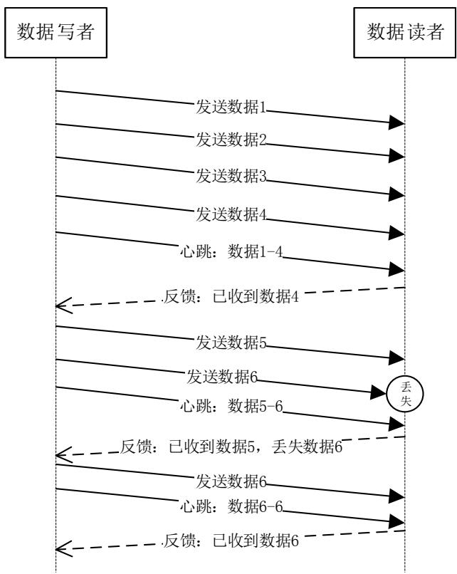  
图 3 可靠模式通信

如图3 所示，数据写者将数据编号后发送到数据读者，并定时发送心跳数据，告知数据读者当前的数据范围。数据读者收到数据和心跳后，会向数据写者反馈自己接收的情况。若数据读者发生了数据丢失，将会通过反馈告知数据写者，数据写者根据反馈重新发送丢失的数据。

为了能够支持数据重发，要求数据写者能够保留一部分用户数据。保留数据的策略通过HistoryQos 进行配置，HistoryQos 中，包含的 kind 成员定义数据应当保留最新（KEEP\_LAST）还是完整保留（KEEP\_ALL）。当设置为保留最新的策略时，数据写者仅保留 HistoryQos.depth中设置的数据数量（暂不考虑实例）。当数量超出这个限制时，数据写者会直接将最旧的数据覆盖。如果此时被覆盖的数据没有被数据读者收到，仍然会产生数据丢失。

其过程如图 4所示。数据写者被设置为KEEP\_LAST策略，且数据样本仅保留4 个。当其连续发送数据时，无论数据读者是否收到（即数据写者是否收到数据读者的反馈信息），都会将旧的数据覆盖：当发送数据 5 时覆盖数据 1，当发送数据 6 时覆盖数据 2。如果数据 2恰好丢失，当数据读者的反馈到达数据写者时，数据2已经被覆盖，无法重发。此时数据写者就会告知数据读者数据2 已经丢失，并重新发送心跳信息，指明当前数据范围为 3-6。数据读者收到这一信息后，确认 2无法重传，发生了数据丢包，然后反馈其余数据包已经收到。

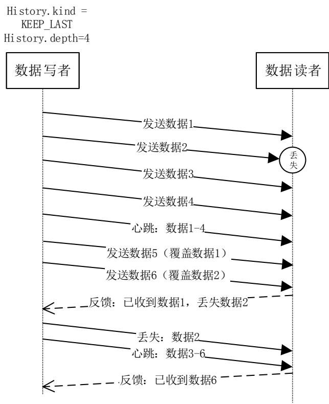  
图 4 可靠模式下的数据覆盖

如果用户不希望出现数据覆盖的情况，应当将数据写者历史数据的保存策略设置为KEEP\_ALL。此时 HistoryQos.depth 的值将不再起效，数据写者会按照 ResourceLimits 中的设置保留尽可能多的历史数据。当历史数据的数量超出限制且数据读者未反馈时，数据写者会阻塞调用者或者返回失败。

如图 5 所示，数据写者的历史数据保存策略设置为 KEEP\_ALL 时，若数据读者未反馈其接收状态，则在保存的数据数量超出限制时，将返回失败，直到数据读者反馈后才能将数据覆盖。需要注意的一点是当用户通过数据写者发送数据失败时，数据的编号并不会增加，直到数据发送成功后才增加。

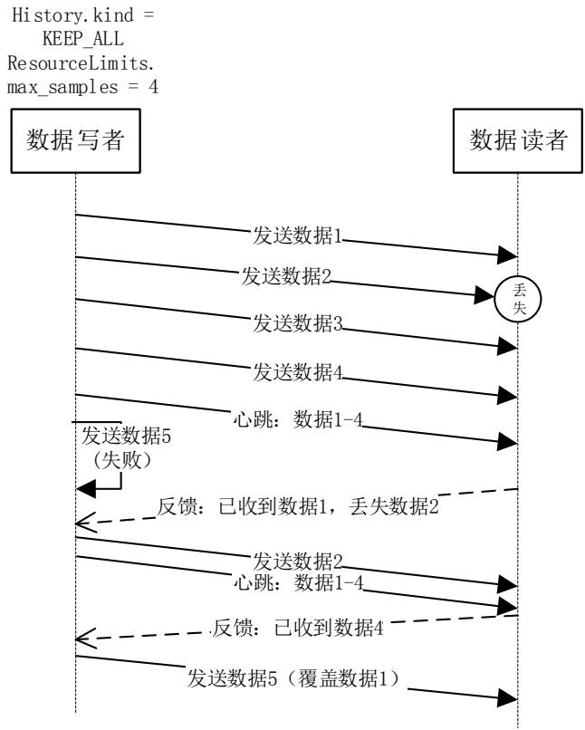  
图 5 可靠模式下的数据发送失败

虽然此处描述的通信是用户主题数据的通信，但是 DDS 内置主题也是按照相同的方式进行处理，因此在分析其过程时，也可以按照同样的过程分析。

## 2 排故手段

## 2.1 网络工具

## 2.1.1 ping

ping命名可以检测两台机器之间网络是否联通，详细用法可通过ping –h指令进行了解，此处只介绍部分常见用法。

常见用法：

表格 2 ping 工具的常见用法
<table><tr><td>ping -h</td><td>查看详细使用方式</td></tr><tr><td>ping &lt;IP&gt;</td><td>检测是否能与地址为IP的设备通信</td></tr></table>

示例：

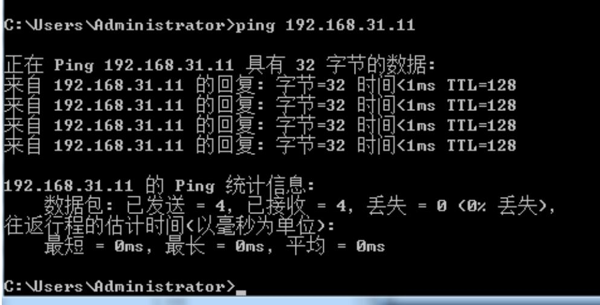  
图 6 ping 工具的使用结果示例

## 2.1.2 iperf

iperf 是一个网络性能测试用具，可以测试 tcp 和 udp 带宽质量。详细用法可通过 iperf –h指令进行了解，此处只介绍部分常见用法。

常见用法：

表格 3iperf的常见用法
<table><tr><td rowspan=1 colspan=1>指令</td><td rowspan=1 colspan=1>含义</td><td rowspan=1 colspan=1>示例</td></tr><tr><td rowspan=1 colspan=3>公用选项</td></tr><tr><td rowspan=1 colspan=1>-h</td><td rowspan=1 colspan=1>查看使用指南</td><td rowspan=1 colspan=1>iperf-h</td></tr><tr><td rowspan=1 colspan=1>-B</td><td rowspan=1 colspan=1>绑定一个主机地址或接口(用于多网卡多IP情况下指定所使用的IP)</td><td rowspan=1 colspan=1>iperf-S-B 192.168.31.11</td></tr><tr><td rowspan=1 colspan=1>-u</td><td rowspan=1 colspan=1>指定使用 udp 协议</td><td rowspan=1 colspan=1></td></tr><tr><td rowspan=1 colspan=1>-p</td><td rowspan=1 colspan=1>指定服务端使用的端口或客户端所连接的端口</td><td rowspan=1 colspan=1>iperf-c 192.168.31.11-p 6001</td></tr><tr><td rowspan=1 colspan=1>-i</td><td rowspan=1 colspan=1>指定每次报告之间的间隔时间，单位为s，默认值为1</td><td rowspan=1 colspan=1>iperf-c 192.168.31.11-i2</td></tr><tr><td rowspan=1 colspan=1>-W</td><td rowspan=1 colspan=1>指定 TCP 窗口大小</td><td rowspan=1 colspan=1>iperf-c 192.168.31.11-w 1M</td></tr><tr><td rowspan=1 colspan=3>server 专用选项</td></tr></table>

client:  
udp: iperf –u –c 192.168.31.11(server 端的 ip) –b 1000M –l 1024  
tcp: iperf –c 192.168.31.11 –l 1024

<table><tr><td rowspan=1 colspan=1>-S</td><td rowspan=1 colspan=1>作为 server 端启用</td><td rowspan=1 colspan=1>iperf -s</td></tr><tr><td rowspan=1 colspan=3>client 专用选项</td></tr><tr><td rowspan=1 colspan=1>-C</td><td rowspan=1 colspan=1>作为 client 端启用</td><td rowspan=1 colspan=1>iperf -c 192.168.31.11(192.168.31.11 为server端地址)</td></tr><tr><td rowspan=1 colspan=1>-F</td><td rowspan=1 colspan=1>指定文件作为数据流进行带宽测试</td><td rowspan=1 colspan=1>iperf-c 192.168.31.11-F test.tar.gz</td></tr><tr><td rowspan=1 colspan=1>-t</td><td rowspan=1 colspan=1>测试时间</td><td rowspan=1 colspan=1>iperf-c 192.168.31.11-t 60</td></tr></table>

注1：当测试时，使用 udp协议时，收发端都要指定相同的带宽，包长；当使用 tcp时不用指定带宽，指定host就可以了；

注 2：带宽： 40g 40000M 千兆 1000M

注3：当某些数据包过大需要指定tcp窗口大小(默认 85k)；

注 4：udp 发不了超过 8M 的数据，会因为 sample too long 而 write failed.

例如： server:

iperf –u –s –B [本机 ip]

注：

1.吞吐量参照 server 端的 BandWidth 或者是 client 端的 server Report 的 bandWidth

2.server 端根据情况绑定 ip 地址和带宽（udp）;

3.tcp 测试时延加-N(no delay)

4. 设置包长（-l）

示例：

按照示例指令在两个节点间分别启用客户端和服务端，可进行相应模式下的连通性测试。

表格 4Iperf 的使用示例
<table><tr><td colspan="4">iperf 收发示例</td></tr><tr><td>模式</td><td colspan="2">Client</td><td>Server</td></tr><tr><td>udp</td><td colspan="2">iperf</td><td>iperf</td></tr><tr><td></td><td colspan="2">-u</td><td>-u</td></tr><tr><td colspan="1" rowspan="1"></td><td colspan="2" rowspan="1">-C &lt;serverlP&gt;-p &lt;ServerPort&gt;</td><td colspan="1" rowspan="1">-S-B &lt;serverIP&gt;-p &lt;ServerPort&gt;</td></tr><tr><td colspan="1" rowspan="1">tcp</td><td colspan="2" rowspan="1">iperf-C &lt;serverlP&gt;-p &lt;ServerPort&gt;</td><td colspan="1" rowspan="1">iperf-S-B &lt;serverIP&gt;-p &lt;ServerPort&gt;</td></tr><tr><td colspan="1" rowspan="1">multicast</td><td colspan="2" rowspan="1">iperf-u-C &lt;multicastIP&gt;-p &lt;multicastPort&gt;</td><td colspan="1" rowspan="1">iperf-u-S-B &lt;multicastIP&gt;-p &lt;multicastPort&gt;</td></tr><tr><td colspan="4" rowspan="1">参数值</td></tr><tr><td colspan="2" rowspan="1">&lt;multicastIP&gt;&lt;multicastPort&gt;&lt;serverlP&gt;&lt;serverPort&gt;</td><td colspan="2" rowspan="1">组播地址组播端口服务端监听地址服务端监听端口</td></tr></table>

结果示例：

UDP 测试：

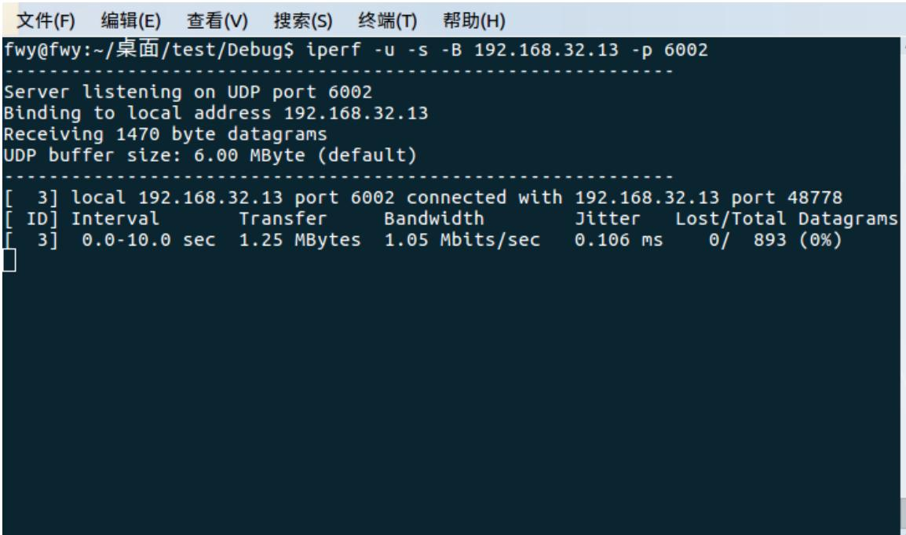  
图 7 UDP 测试 Server 端

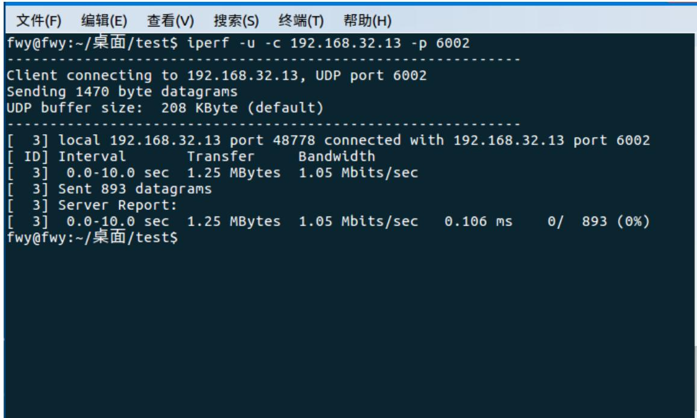  
图 8UDP 测试 Client 端

TCP 测试：

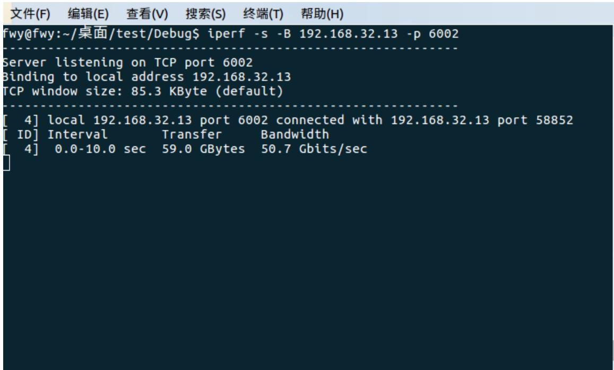  
图 9 TCP 测试 Server 端

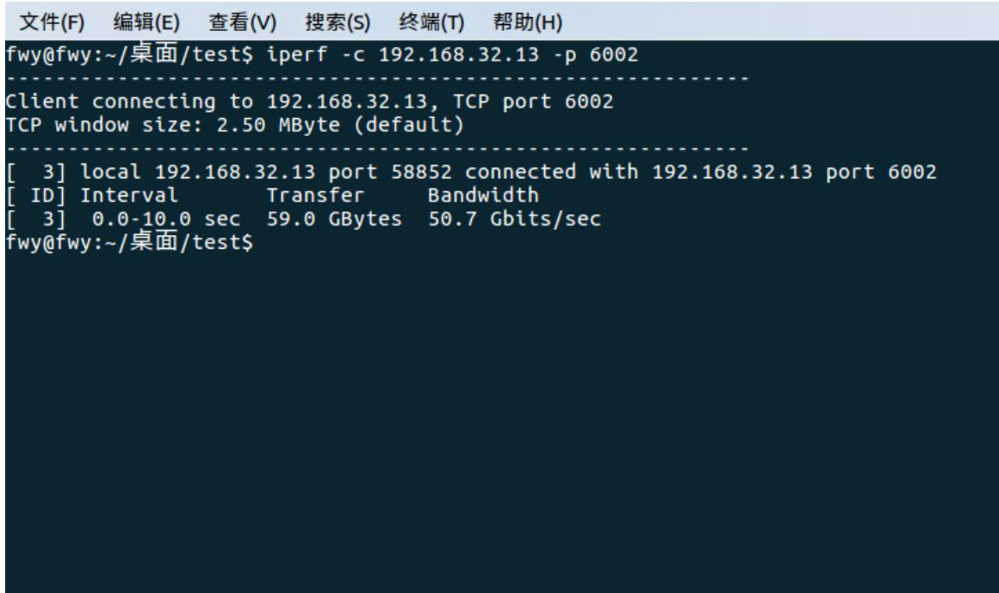  
图 10TCP 测试 Client 端

Multicast 测试：

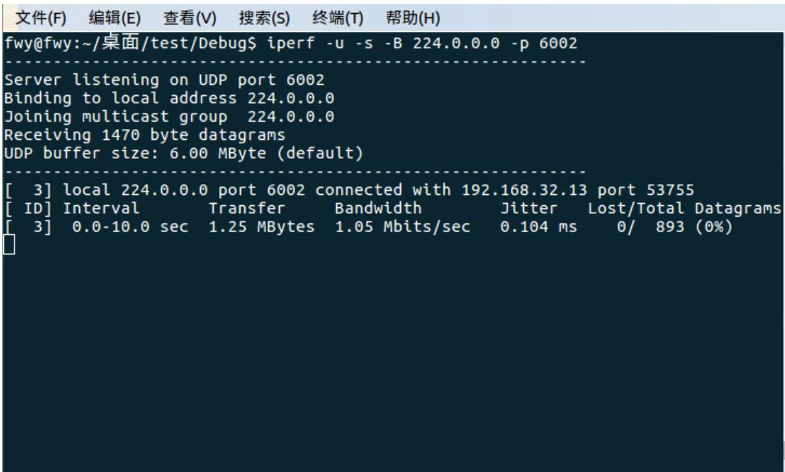  
图 11Multicast 测试 Server 端

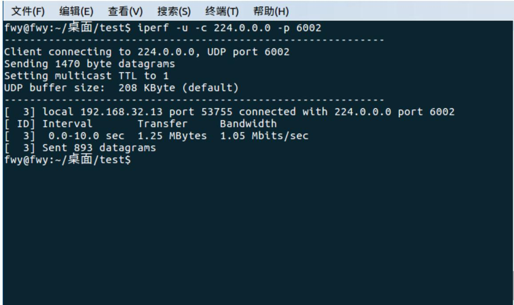  
图 12Multicast 测试 Client 端

## 2.1.3 sockperf

sockperf是基于套接字API的网络基准测试试用程序，旨在测试高性能系统的性能（延时和吞吐），详细用法可通过sockperf–h指令进行了解，此处只介绍部分常见用法。

常见用法：

表格 5sockperf 的常见用法
<table><tr><td colspan="1" rowspan="1">sockperf 常用指令</td><td colspan="1" rowspan="1">参数</td><td colspan="1" rowspan="1">值</td><td colspan="1" rowspan="1">含义</td></tr><tr><td colspan="1" rowspan="1"></td><td colspan="1" rowspan="1">-h</td><td colspan="1" rowspan="1">无</td><td colspan="1" rowspan="1">查看使用指南</td></tr><tr><td colspan="1" rowspan="8">server&lt;sr&gt;</td><td colspan="3" rowspan="1">作为服务端启用</td></tr><tr><td colspan="1" rowspan="1">-i</td><td colspan="1" rowspan="1">&lt;|P&gt;</td><td colspan="1" rowspan="1">监听/发送地址</td></tr><tr><td colspan="1" rowspan="1">-p</td><td colspan="1" rowspan="1">&lt;Port&gt;</td><td colspan="1" rowspan="1">监听/发送端口</td></tr><tr><td colspan="1" rowspan="1">--tcp</td><td colspan="1" rowspan="1">无</td><td colspan="1" rowspan="1">使用 tcp 协议</td></tr><tr><td colspan="1" rowspan="1">--mc-rx-if</td><td colspan="1" rowspan="1">&lt;|P&gt;</td><td colspan="1" rowspan="1">接收组播地址</td></tr><tr><td colspan="1" rowspan="1">--mc-tx-if</td><td colspan="1" rowspan="1">&lt;IP&gt;</td><td colspan="1" rowspan="1">发送组播地址</td></tr><tr><td colspan="1" rowspan="1">--mc-lookback-enable</td><td colspan="1" rowspan="1">无</td><td colspan="1" rowspan="1">使能本地回环</td></tr><tr><td colspan="1" rowspan="1">--uc-reuseaddr</td><td colspan="1" rowspan="1">无</td><td colspan="1" rowspan="1">使能端口复用</td></tr><tr><td colspan="1" rowspan="3">ping-pong&lt;pp&gt;</td><td colspan="3" rowspan="1">作为客户端启用</td></tr><tr><td colspan="1" rowspan="1">--client_ip</td><td colspan="1" rowspan="1">&lt;|P&gt;</td><td colspan="1" rowspan="1">绑定作为客户端的地址（用于多网卡多IP 情况下指定所使用的IP)</td></tr><tr><td colspan="1" rowspan="1">--client_port</td><td colspan="1" rowspan="1">&lt;Port&gt;</td><td colspan="1" rowspan="1">绑定作为客户端</td></tr><tr><td colspan="1" rowspan="3"></td><td colspan="1" rowspan="1"></td><td colspan="1" rowspan="1"></td><td colspan="1" rowspan="1">的端口</td></tr><tr><td colspan="1" rowspan="1">--full-log</td><td colspan="1" rowspan="1">&lt;FileName&gt;</td><td colspan="1" rowspan="1">记录接收信息到csv 表格中</td></tr><tr><td colspan="2" rowspan="1">上述 server 下指令在此处也可使用</td><td colspan="1" rowspan="1">含义与 server 处相同</td></tr><tr><td colspan="1" rowspan="2">throughtput&lt;tp&gt;</td><td colspan="3" rowspan="1">作为客户端测试吞吐率</td></tr><tr><td colspan="2" rowspan="1">上述 ping-pong下指令在此处也可使用</td><td colspan="1" rowspan="1">含义与ping-pong处相同</td></tr></table>

示例：

按照示例指令在两个节点间分别启用客户端和服务端，可进行相应模式下的连通性测试。

表格 6sockperf 的使用示例
<table><tr><td colspan="3">sockperf 收发指令示例</td></tr><tr><td>模式</td><td>Client</td><td>Server</td></tr><tr><td>udp tcp</td><td>sockperf.exe pp -i&lt;serverlP&gt; -p &lt;serverPort&gt; --client_ip&lt;clientIP&gt; --clientPort&lt;clientPort&gt; --uc-reuseaddr --full-log LocalUDPUnicast.csv sockperf.exe</td><td>sockperf.exe server -i &lt;serverlP&gt; -p &lt;serverPort&gt; sockperf.exe</td></tr><tr><td>multicast pp</td><td>pp —i &lt;serverlP&gt; -p &lt;serverPort&gt; --client_ip &lt;clientIP&gt; --clientPort&lt;clientPort&gt; --tcp --uc-reuseaddr --full-log LocalTCPUnicast.csv sockperf.exe</td><td>server -i &lt;serverlP&gt; -p &lt;serverPort&gt; --tcp sockperf.exe</td></tr><tr><td></td><td>-p &lt;multicastPort&gt; --mc-tx-if &lt;clientIP&gt; --clientPort&lt;clientPort&gt; --mc-loopback-enable --full-log</td><td>-p &lt;multicastPort&gt; --mc-rx-if &lt;serverlP&gt; --mc-loopback-enable</td></tr><tr><td>参数值 &lt;multicastIP&gt;</td><td>LocalUDPMulticast.csv 组播地址</td><td></td></tr></table>

<table><tr><td>&lt;multicastPort&gt;</td><td>组播端口</td></tr><tr><td>&lt;serverlP&gt;</td><td>服务端监听地址</td></tr><tr><td>&lt;serverPort&gt;</td><td>服务端监听端口</td></tr><tr><td>&lt;clientIP&gt;</td><td>客户端地址</td></tr><tr><td>&lt;clientPort&gt;</td><td>客户端端口</td></tr><tr><td>LocalUDPUnicast.csv</td><td>记录 udp 收发信息的表格文件名</td></tr><tr><td>LocalTCPUnicast.csv</td><td>记录 tcp 收发信息的表格文件名</td></tr><tr><td>LocalUDPMulticast.csv</td><td>记录组播收发信息的表格文件名</td></tr></table>

结果示例：

UDP 测试：

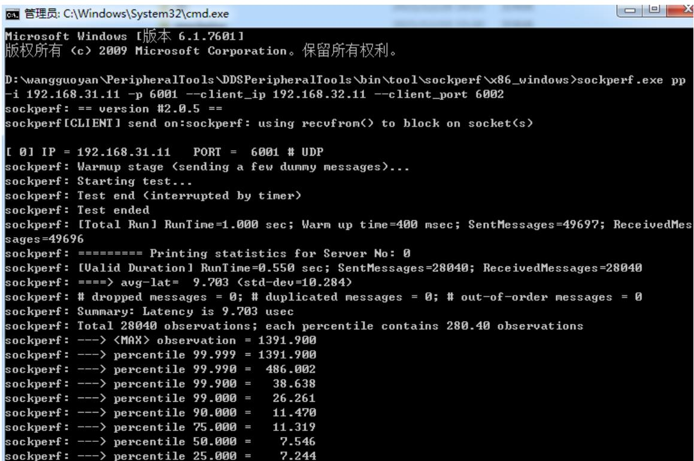  
图 13 UDP 测试 Client 端

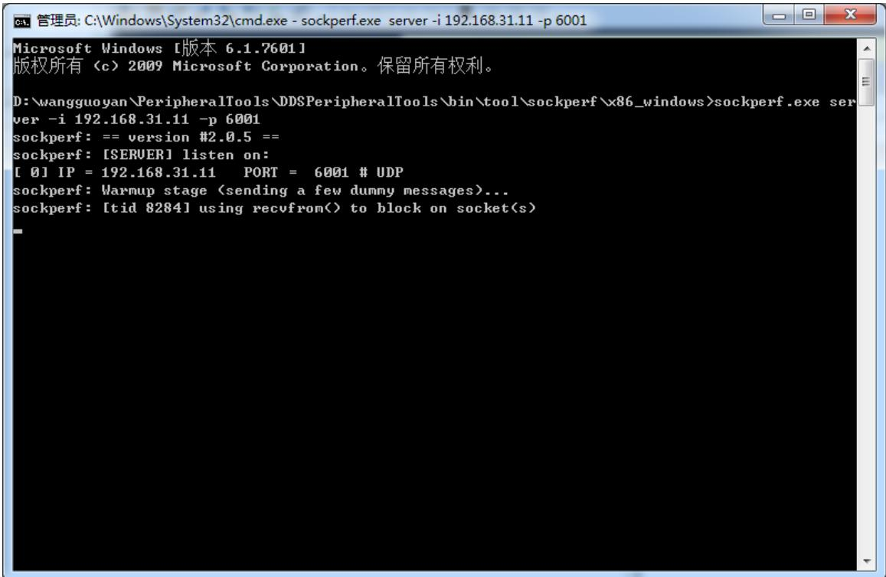  
图 14UDP 测试 Server 端

TCP 测试：

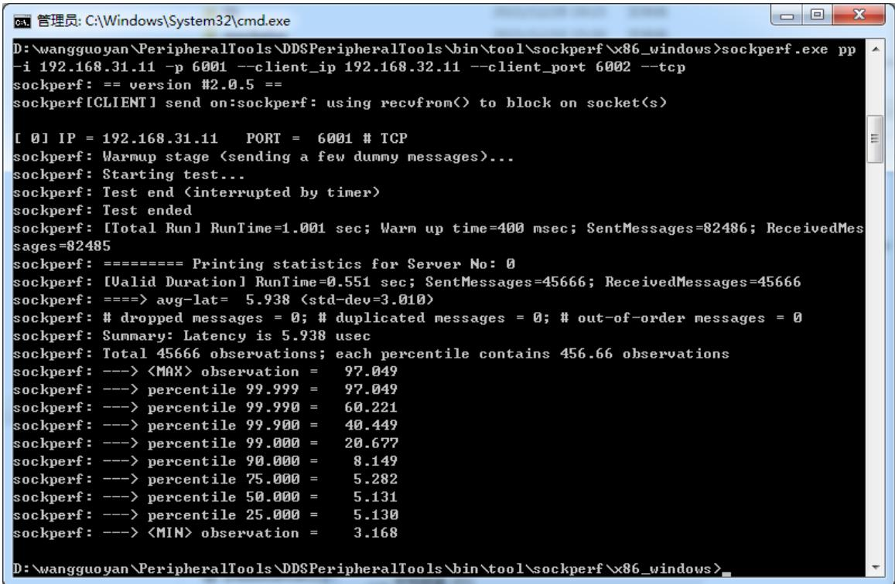  
图 15 TCP 测试 Client 端

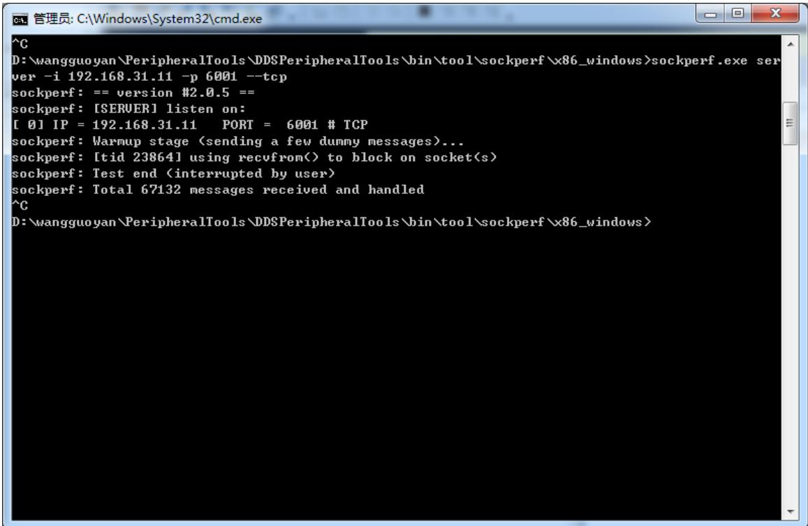  
图 16 TCP 测试 Server 端

Multicast 测试：

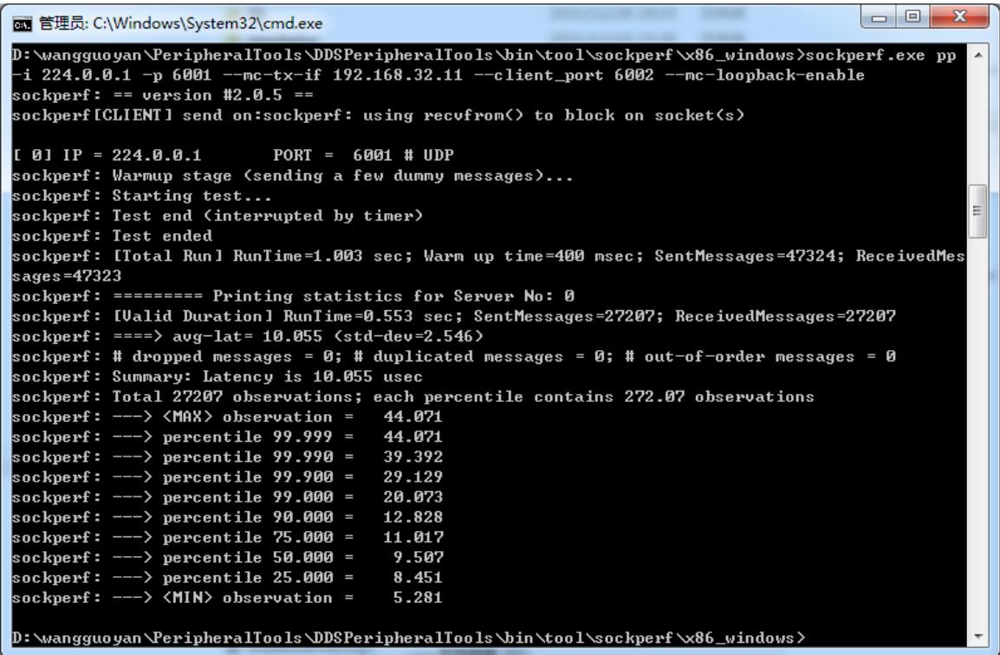  
图 17 Multicast 测试 Client 端

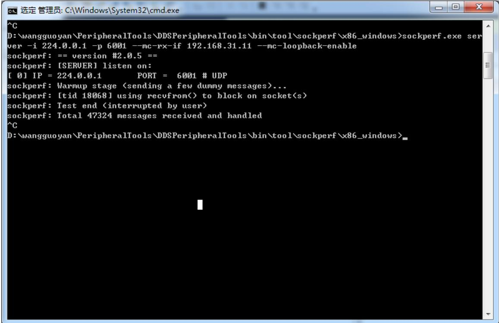  
图 18Multicast 测试 Server 端

## 2.2 交互式日志

在 ZRDDS 的运行过程中，当某些异常或特定条件被触发时，可能会在控制台、日志文件中输出日志信息。这些日志信息一般是错误、警告内容，用于告知在系统运行过程中发生的错误，是最直接的排错手段之一。但是，当系统已经开始输出错误、警告等级的日志，往往是已经在异常发生之后，为时已晚。而仅通过单一的错误、警告日志信息，我们只能拿到发生异常的直接原因，难以推断系统内部的逻辑错误。

为了能够通过日志对系统行为进行深度分析，我们在 ZRDDS 各模块的不同运行阶段的关键点上增加了若干可动态开关的日志信息。即交互式调试日志。我们为不同日志分配了对应的日志号，可以通过控制文件选择性地对交互式调试日志进行开关。

在本小节中，我们将对 ZRDDS的日志系统、交互式日志调试文件进行介绍。

## 2.2.1 ZRDDS 日志系统

## 2.2.1.1 日志级别

在 ZRDDS 中存在四种级别的日志级别，包括错误、警告、系统信息及用户信息。其参数、含义及控制台中日志的颜色参见下表。

表 2.2-1 级别参数与含义对照表

<table><tr><td rowspan=1 colspan=1>级别</td><td rowspan=1 colspan=1>Level</td><td rowspan=1 colspan=1>含义</td><td rowspan=1 colspan=1>控制台颜色</td></tr><tr><td rowspan=1 colspan=1>ZRLOG_ERROR</td><td rowspan=1 colspan=1>2</td><td rowspan=1 colspan=1>程序出现不可忽略的错误。</td><td rowspan=1 colspan=1>红</td></tr><tr><td rowspan=1 colspan=1>ZRLOG_ADMIN_INFO</td><td rowspan=1 colspan=1>4</td><td rowspan=1 colspan=1>系统管理员视角的信息,如一些调试信息。</td><td rowspan=1 colspan=1>绿</td></tr><tr><td rowspan=1 colspan=1>ZRLOG_USER_INFO</td><td rowspan=1 colspan=1>8</td><td rowspan=1 colspan=1>通知用户视角信息，即只能看到自定义Endpoint之间的数据交互。</td><td rowspan=1 colspan=1>默认</td></tr><tr><td rowspan=1 colspan=1>ZRLOG_WARNING</td><td rowspan=1 colspan=1>16</td><td rowspan=1 colspan=1>警告信息但是能够正常运行。</td><td rowspan=1 colspan=1>黄</td></tr></table>

## 2.2.1.2 日志输出通道

DDS日志可以输出到以下三个通道：

## 1） 控制台

默认情况日志会输出至控制台中。通过控制台查看日志时，可通过日志颜色判断日志等级，控制台中红色代表 ZRLOG\_ERROR 级别的错误日志，黄色的代表 ZRLOG\_WARNING级别的警告日志，绿色代表 ZRLOG\_ADMIN\_INFO 级别的调试日志，以及默认颜色的ZRLOG\_USER\_INFO 级别的用户信息日志。

## 2） 日志文件

默认在程序运行目录中生成名为“应用程序名称.ddslog”的日志文件。如果不存在则创建，如果存在则重写。故而用户在发生故障时，建议在重新启动程序将日志文件进行备份，避免被覆盖。

## 2.2.1.3 日志输出控制

DDS日志输出控制示例如下。

## 2.2.1.3.1 关闭日志文件输出

配置dpf的dds\_log的qos；dds只会打印在界面上，而不会输出到文件里   
<participantfactory\_qos>   
<dds\_log>   
<file\_mask>0</file\_mask>   
</dds\_log>   
</participantfactory\_qos>

## 2.2.1.3.2 关闭控制台打印

关闭终端打印日志的 dpf\_qos 配置；

<participantfactory\_qos>

<dds\_log>

## 2.2.1.4 日志输出格式

日志的输出格式如下图所示：

\*\*\*\*\*\*\*\*\*\*\*\*\*\*\*\*\*\*\*\*\*\*\*\*\*\*时间 \*\*\*\*\*\*\*\*\*\*\*\*\*\*\*\*\*\*\*\*\*\*\*\*\*\*  
LEVEL：日志级别  
FILE：源码文件名  
FUNC：函数名 (LINE：源码文件中日志行号)  
具体日志内容  
\*\*\*\*\*\*\*\*\*\*\*\*\*\*\*\*\*\*\*\*\*\*\*\*\*\*\*\*\*\*\*\*\*\*\*\*\*\*\*\*\*\*\*\*\*\*\*\*\*\*\*\*\*\*\*\*\*\*\*\*\*\*\*\*\*\*\*

例如：

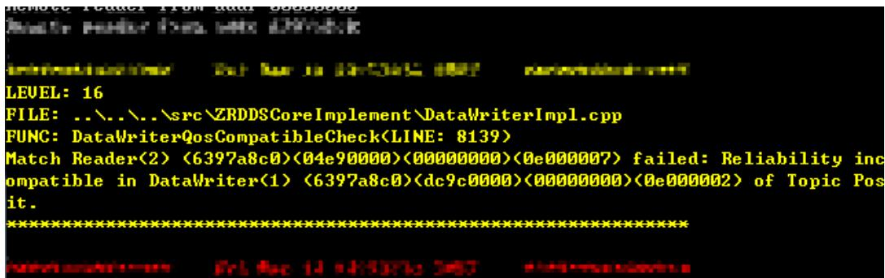  
通过该日志的描述结合其文件、行号，可快速定位异常位置。

## 2.2.2 ZRDDS 日志控制

## 2.2.2.1 交互式日志调试文件

交互式日志调试文件，是用来控制日志输出等级、调试日志输出范围、日志输出通道的配置文件。调试文件名称为“zrdds\_debug\_file.zrdebug”，将其放置于运行目录中即可。

调试文件生效的时机包含两个：

1. 创建域参与者工厂时，会读取调试文件内容。

2. DDS周期性检查（100ms）到调试文件修改时，会重新读取文件内容。

## 2.2.2.1.1 调试文件编写规范

调试文件由多条单行的调试命令组成，调试命令的格式为：debug\_cmd 命令编号命令参数，其中调试命令编号及其参数参见下表：

表格 7 调试命令编号与参数对照表
<table><tr><td rowspan=1 colspan=1>命令编号</td><td rowspan=1 colspan=1>命令类型</td><td rowspan=1 colspan=1>命令参数</td><td rowspan=1 colspan=1>示例</td></tr><tr><td rowspan=1 colspan=1>0</td><td rowspan=1 colspan=1>使能指定调试编号范围</td><td rowspan=1 colspan=1>开始编号结束编号</td><td rowspan=1 colspan=1>debug_cmd 0 13 15使能日志号为13~15的调试日志</td></tr><tr><td rowspan=1 colspan=1>1</td><td rowspan=1 colspan=1>取消使能指定调试编号范围</td><td rowspan=1 colspan=1>开始编号结束编号</td><td rowspan=1 colspan=1>debug_cmd 1 13 15取消使能日志号为13~15的调试日志</td></tr><tr><td rowspan=1 colspan=1>2</td><td rowspan=1 colspan=1>使能指定主题调试信息</td><td rowspan=1 colspan=1>主题名(无需引号，特殊值将在1)节中介绍)</td><td rowspan=1 colspan=1>debug_cmd 2 example使能主题名为 example 相关的日志</td></tr><tr><td rowspan=1 colspan=1>3</td><td rowspan=1 colspan=1>取消使能指定主题调试信息</td><td rowspan=1 colspan=1>主题名</td><td rowspan=1 colspan=1>debug_cmd 3 example取消使能主题名为 example 相关的日志</td></tr><tr><td rowspan=1 colspan=1>4</td><td rowspan=1 colspan=1>使能指定实体调试信息</td><td rowspan=1 colspan=1>InstanceHandle 的 16 进制串（当16进制串为0时，为使能所有实体)</td><td rowspan=1 colspan=1>debug_cmd                              4c0a80c0300000bf000000001000100c2使能指定InstanceHandle的实体相关日志</td></tr><tr><td rowspan=1 colspan=1>5</td><td rowspan=1 colspan=1>取消使能指定实体调试信息</td><td rowspan=1 colspan=1>InstanceHandle 的 16 进制串</td><td rowspan=1 colspan=1>debug_cmd                              5c0a80c0300000bf000000001000100c2取消使能指定InstanceHandle的实体相关日志</td></tr><tr><td rowspan=1 colspan=1>6</td><td rowspan=1 colspan=1>设置日志级别</td><td rowspan=1 colspan=1>控制台掩码文件掩码分布式日志掩码（掩码值将在下一章节进行介绍）</td><td rowspan=1 colspan=1>debug_cmd 6 1E 1E 1E在控制台中输出所有等级的日志在日志文件中输出所有等级的日志在分布式日志中输出所有等级的日志</td></tr><tr><td rowspan=1 colspan=4>调试文件被ZRDDS读取后，会生成一个调试响应文件</td></tr></table>

“zrdds\_debug\_response\_file.zrdebug “。当调试文件编写出现语法错误时，ZRDDS 会将错误信息写入响应文件中。因此，当发现调试文件未起效时，可以打开响应文件检查是否存在异常。  
另外，请注意文件的行尾格式。在 UNIX 上可能会因为调试文件的行尾格式为Dos/Windows，导致调试文件中的命令无效。

## 2.2.2.1.2 参数介绍

## 1) 特殊主题名称

表格 8 特殊主题与含义对照表
<table><tr><td colspan="1" rowspan="1">主题名称</td><td colspan="1" rowspan="1">含义</td></tr><tr><td colspan="1" rowspan="1">ZRDDS_NETWORK_TOPIC</td><td colspan="1" rowspan="1">网络相关操作</td></tr><tr><td colspan="1" rowspan="1">ZRDDS_DOMAINPARTICIPANT_TOPIC</td><td colspan="1" rowspan="1">域参与者相关调试信息</td></tr><tr><td colspan="1" rowspan="1">ZRDDS DOMAINPARTICIPANTFACTORY TOPIC</td><td colspan="1" rowspan="1">域参与者工厂调试信息</td></tr><tr><td colspan="1" rowspan="1">ZRDDS_MPORT_TOPIC</td><td colspan="1" rowspan="1">MPORT 实现的 RIO 调试信息</td></tr><tr><td colspan="1" rowspan="1">ZRDDS_VALIDATOR_TOPIC</td><td colspan="1" rowspan="1">License 验证相关调试信息</td></tr><tr><td>ZRDDS_INTERACTIVECMD_TOPIC</td><td>交互式命令相关调试信息</td></tr><tr><td>ZRDDS_ANY_LOG_TOPIC_NAME</td><td>任意主题的调试信息（若开启此名称调试信 息，调试文件中关闭某一特定主题的指令将会 失效）</td></tr></table>

注：ZRDDS\_ANY\_LOG\_TOPIC\_NAME\_\_\_末尾为 3 个下划线

## 2) 日志级别掩码值

设置掩码格式为 debug\_cmd 6 [控制台掩码][文件掩码] [分布式日志掩码]。在对应掩码位置输入以下数值，可调整其日志输出等级。此处必须填入十六进制整形。

例如debug\_cmd 6 1E 1E 1E，表示在控制台、日志文件、分布式日志中均输出所有等级日志。

表格 9 使能级别与参数值对照表
<table><tr><td rowspan=1 colspan=1>使能级别</td><td rowspan=1 colspan=1>参数值</td></tr><tr><td rowspan=1 colspan=1>不输出任何日志</td><td rowspan=1 colspan=1>0</td></tr><tr><td rowspan=1 colspan=1>仅输出错误日志</td><td rowspan=1 colspan=1>2</td></tr><tr><td rowspan=1 colspan=1>输出错误日志、警告日志</td><td rowspan=1 colspan=1>12</td></tr><tr><td rowspan=1 colspan=1>输出错误日志、警告日志、管理员等级日志</td><td rowspan=1 colspan=1>16</td></tr><tr><td rowspan=1 colspan=1>输出所有日志</td><td rowspan=1 colspan=1>1E</td></tr></table>

## 2.2.2.1.3 调试文件示例

```c
//开启日志号为 3002 到 4003 区间内的日志（包括 3002 与 4003）
debug_cmd 0 3002 4003
//取消使能日志号为3020到3030区间内的日志（包括3020与3030）
debug_cmd 1 3020 3030
//使能域参与者工厂调试主题相关调试信息
debug_cmd 2 ZRDDS_DOMAINPARTICIPANT_TOPIC
//取消使能域参与者相关调试信息
debug_cmd 3 ZRDDS_DOMAINPARTICIPANT_TOPIC
//使能指定实体
debug_cmd 4 00000000000000000000000000000000
//使能级别掩码为允许控制台，文件，分布式日志都使能所有等级的日志
debug_cmd 6 1E 1E 1E
```

注意：使能后如果想要关闭对应日志输出，需要取消使能，才能正确地将日志关闭。

例如，在ZRDDS运行过程中，我们想要查看第13 号日志的相关内容，可以在文件中输入“debug\_cmd 013 13”并保存。当ZRDDS识别到调试文件发生修改，便会做出响应，开始输出第13号日志的相关内容。此时，如果我们想要关闭13 号日志的输出，将debug\_cmd 013 13 进行单行注释，修改为“//debug\_cmd 013 13”并保存，是无法正确关闭该日志输出的。正确的做法是，将“debug\_cmd 0 13 13”修改为“debug\_cmd 1 13 13”，即取消使能第 13 号日志，才能够正确将该日志关闭。

## 2.2.2.2 日志 API

当然，除了交互式日志调试文件可以控制以外，用户还可以通过调用全局 API进行设置，但这往往意味着需要重新进行编译，不属于运行过程进行动态排故的手段，因此，此处不会对 API 接口进行介绍。如需要，可查阅 ZRDDSCoreInterface\ZRUserLog.h 中相关接口。在调用域参与者工厂的单例后调用相关API即可。

## 2.2.3 ZRDDS 常用调试日志号

表格 10ZRDDS 常用调试日志号
<table><tr><td>阶 段</td><td>日志说明</td><td>日志 号</td><td></td><td>备注</td></tr><tr><td>收发地址绑定</td><td>创建域参与者时，设置用于接 收报文的地址信息</td><td>345</td><td>local(%s) create UDPRecvLocatorInfo with kind(%d) for locator(%s)</td><td>kind(%d)数据类 型 (1:DOMAIN_KIND 4:PDP_KIND 8:META_KIND 16:USER_KIND)</td></tr><tr><td></td><td>将接收地址加入组播 设置组播发送接口</td><td>322 326</td><td>local(%s) add addr(%s) membership ifAddr(%08x). local(%s) create send locator(%s)</td><td></td></tr><tr><td>实 体 匹 配</td><td></td><td></td><td>and set interface(%08x).</td><td></td></tr><tr><td rowspan="7"></td><td>周期性发送 DATA(p)</td><td>13</td><td>local(%s) send data(p) to pdpAddr(%s).</td><td></td></tr><tr><td>其它节点的DATA(p)的版本 &lt;2.2.5 或地址数&lt;=1，跳过地址 自动排序</td><td>45</td><td>local(%s) ignore sort locator with participant(%s) version(%u %u) locSize(%u)</td><td></td></tr><tr><td>其它节点的 DATA(p)并对地址 自动排序时，调换顺序</td><td>49</td><td>local(%s) swap participant(%s) activeLloc(%u %s) with unAvailLoc(%u %s)</td><td></td></tr><tr><td>收到 DATA(p)，且完成自动地址 排序、认为匹配后打印相关信 息</td><td>52</td><td>local(%s) associate with participant(%s) with meta locator(%s) user locator(%s) lease(%d %u)</td><td>可以看出地址是 否排序正确</td></tr><tr><td>收到报文时，更新其它域参与 者的存活状态</td><td>59</td><td>local(%s) assert remote dp(%s) liveliness at(%d %u) exsit(%d)</td><td></td></tr><tr><td>周期性检查其它节点的存活状 态，认为某节点超时失活</td><td>61</td><td>local(%s) check dp(%s) at(%d %u) lastSeen(%d %u) lease(%d %u) time out construct data(p)</td><td></td></tr><tr><td>周期性检查其它节点的存活状 态，认为某节点仍存活</td><td>62</td><td>local(%s) check dp(%s) at(%d %u) lastSeen(%d %u) not lease(%d %u)</td><td></td></tr><tr><td colspan="1" rowspan="8"></td><td colspan="1" rowspan="1"></td><td colspan="1" rowspan="1"></td><td colspan="1" rowspan="1">and reset duration to(%llu)</td><td colspan="1" rowspan="1"></td></tr><tr><td colspan="1" rowspan="1">数据读者收到数据写者信息时，打印其地址</td><td colspan="1" rowspan="1">175</td><td colspan="1" rowspan="1">local(%s)     get     writer(%s)unicast(%s)          multicast(%s)writerSpecificLocators(%d)useShmem(%u)</td><td colspan="1" rowspan="1">数据读者收到数据写者信息时，打印其地址</td></tr><tr><td colspan="1" rowspan="1">数据读者匹配到数据写者</td><td colspan="1" rowspan="1">178</td><td colspan="1" rowspan="1">local(%s)    match    writer(%s)result(%d)</td><td colspan="1" rowspan="1">数据读者匹配到数据写者</td></tr><tr><td colspan="1" rowspan="1">数据读者与数据写者解除匹配</td><td colspan="1" rowspan="1">183</td><td colspan="1" rowspan="1">local(%s) disassociate reader(%s)with writer(%s)</td><td colspan="1" rowspan="1">数据读者与数据写者解除匹配</td></tr><tr><td colspan="1" rowspan="1">数据写者匹配到数据读者</td><td colspan="1" rowspan="1">197</td><td colspan="1" rowspan="1">local(%s)    match   reader(%s)result(%d)</td><td colspan="1" rowspan="1">数据写者匹配到数据读者</td></tr><tr><td colspan="1" rowspan="1">数据写者与数据读者解除匹配</td><td colspan="1" rowspan="1">196</td><td colspan="1" rowspan="1">local(%s) disassociate writer(%s)with reader(%s)</td><td colspan="1" rowspan="1">数据写者与数据读者解除匹配</td></tr><tr><td colspan="1" rowspan="1">数据读者同一主题下不存在相同类型的本地数据写者</td><td colspan="1" rowspan="1">189</td><td colspan="1" rowspan="1">has no matched local(%s) writerlocalTopic(%p) localWriterlds(%p)localTypeName(%s) to reader(%s)</td><td colspan="1" rowspan="1"></td></tr><tr><td colspan="1" rowspan="1">数据写者同一主题下不存在相同类型的本地数据读者</td><td colspan="1" rowspan="1">177</td><td colspan="1" rowspan="1">local(%s) has no matchedtopic(%d) or reader(%p) associatewith remote writer(%s)</td><td colspan="1" rowspan="1"></td></tr><tr><td colspan="1" rowspan="9">数据收发</td><td colspan="1" rowspan="1">收到报文，打印报文长度及来源端口</td><td colspan="1" rowspan="1">275</td><td colspan="1" rowspan="1">domainId(%d) dp(%s)receiveddata(%s)             bufCount(%u)recvSize(%u)   on   locator(%s)from(%s)</td><td colspan="1" rowspan="1">recvSize(%u)数据长度from(%s) 来源网络端口</td></tr><tr><td colspan="1" rowspan="1">收到报文，打印报文内容</td><td colspan="1" rowspan="1">276</td><td colspan="1" rowspan="1">recvSize(%u) detail packet:</td><td colspan="1" rowspan="1">会将报文的 HEX串打印出来，慎用</td></tr><tr><td colspan="1" rowspan="1">数据写者发送心跳的心跳范围</td><td colspan="1" rowspan="1">791</td><td colspan="1" rowspan="1">New heartbeat(%u) from %d.%uto %d.%u.</td><td colspan="1" rowspan="1"></td></tr><tr><td colspan="1" rowspan="1">数据写者收到数据读者的ACKNACK 消息</td><td colspan="1" rowspan="1">1290</td><td colspan="1" rowspan="1">Processing    acknack     fromreader %s, acked sn %lld</td><td colspan="1" rowspan="1"></td></tr><tr><td colspan="1" rowspan="1">数据写者处理 ACKNACK 消息时，打印数据读者的状态</td><td colspan="1" rowspan="1">1291</td><td colspan="1" rowspan="1">Processing     acknack     fromreader %s, last ack %lld, lastnack %lld.</td><td colspan="1" rowspan="1"></td></tr><tr><td colspan="1" rowspan="1">数据读者将数据标为已被接收(ACKED)</td><td colspan="1" rowspan="1">773</td><td colspan="1" rowspan="1">Informing sample %lld acked.</td><td colspan="1" rowspan="1"></td></tr><tr><td colspan="1" rowspan="1">数据读者将数据标为已被发送（提交到网络）后数据写者释放信号量，驱动被阻塞的发送线程</td><td colspan="1" rowspan="1">774</td><td colspan="1" rowspan="1">Informing sample sending waitingthread on sample %Ild.</td><td colspan="1" rowspan="1"></td></tr><tr><td colspan="1" rowspan="1">数据读者将数据标为已被接收(ACKED)后数据写者释放信号量，驱动用户waitForAllAcked的线程</td><td colspan="1" rowspan="1">775</td><td colspan="1" rowspan="1">Informing sample acking waitingthread on sample %lld.</td><td colspan="1" rowspan="1"></td></tr><tr><td colspan="1" rowspan="1">数据写者在某些数据被 ACKED</td><td colspan="1" rowspan="1">776</td><td colspan="1" rowspan="1">Trying to remove not alive</td><td colspan="1" rowspan="1"></td></tr><tr><td colspan="1" rowspan="1">后释放已经不存活的实例</td><td colspan="1" rowspan="1"></td><td colspan="1" rowspan="1">instance %s.</td><td colspan="1" rowspan="1"></td></tr><tr><td colspan="1" rowspan="1">数据写者收到数据读者的NACK_FRAG 消息</td><td colspan="1" rowspan="1">1310</td><td colspan="1" rowspan="1">Informing  nack   frag   fromreader %s, sn %lld.</td><td colspan="1" rowspan="1"></td></tr><tr><td colspan="1" rowspan="1">数据写者重发 DATA</td><td colspan="1" rowspan="1">1293</td><td colspan="1" rowspan="1">Resend sample %lld to reader %s.</td><td colspan="1" rowspan="1"></td></tr><tr><td colspan="1" rowspan="1">数据写者重发 DATA_FRAG</td><td colspan="1" rowspan="1">1313</td><td colspan="1" rowspan="1">Resend frag %lld:%u to reader %s.</td><td colspan="1" rowspan="1"></td></tr><tr><td colspan="1" rowspan="1">数据写者发送 GAP</td><td colspan="1" rowspan="1">1150</td><td colspan="1" rowspan="1">Sending gap from %lld to %lld toreader %s.</td><td colspan="1" rowspan="1"></td></tr><tr><td colspan="1" rowspan="1">数据读者收到数据写者的心跳，打印</td><td colspan="1" rowspan="1">474</td><td colspan="1" rowspan="1">reader(%s) received hbMsg fromsrcld(%s) reset writer counter(%u)local reliability(%u)historySeq(%d                  %u)expected(%d                    %u)fromHeartbeatBatch(%d)</td><td colspan="1" rowspan="1"></td></tr><tr><td colspan="1" rowspan="1">数据读者收到过期的数据写者的心跳，忽略</td><td colspan="1" rowspan="1">473</td><td colspan="1" rowspan="1">reader(%s) ignore hbMsg fromsrcld(%s) due to counter(%u)leased</td><td colspan="1" rowspan="1"></td></tr><tr><td colspan="1" rowspan="1">数据读者处理数据写者的心跳后，打印接收窗口及资源占用状态</td><td colspan="1" rowspan="1">479</td><td colspan="1" rowspan="1">reader(%s)m_curAvailSampleNum(%d)m_curFreeSampleNum(%d)updatewriter recvWindow after handlehb(%d.%u - %d.%u)send hb replyisFinal(%d) rightDiff(%lld)</td><td colspan="1" rowspan="1"></td></tr><tr><td colspan="1" rowspan="1">数据读者收到数据写者的心跳后，构建 ACKNACK</td><td colspan="1" rowspan="1">590</td><td colspan="1" rowspan="1">reader(%s) construct acknack forwriter(%s)    lastSeq(%d    %u)maxResource(%u)curAvailSampleNum(%u)dataFragInfo(%u)rejectedByInstance(%d)seqNumSet</td><td colspan="1" rowspan="1"></td></tr><tr><td colspan="1" rowspan="1">数据读者收到数据后通知用户(调用用户 listener)</td><td colspan="1" rowspan="1">466</td><td colspan="1" rowspan="1">self(%s) info user with ret(%d)mask(%u)              listener(%p)on_data_available(%p)</td><td colspan="1" rowspan="1"></td></tr><tr><td colspan="1" rowspan="1">数据读者样本资源不足以存储数据，并拒绝（reject）</td><td colspan="1" rowspan="1">545</td><td colspan="1" rowspan="1">reader(%s) loan (%u) sample fordataMsg from srcld(%s) failed.</td><td colspan="1" rowspan="1"></td></tr><tr><td colspan="1" rowspan="1">数据读者实例资源不足，拒绝并抛弃（reject&amp;lost）</td><td colspan="1" rowspan="1">448</td><td colspan="1" rowspan="1">reader(%s)SubscriptionInstanceNew(%s) forsample(%d %u) wrier(%d %u)failed info rejected</td><td colspan="1" rowspan="1"></td></tr><tr><td colspan="1" rowspan="1">数据读者为某个样本获取实例下样本空间(max_samples_per_instance)时失败，并拒绝（reject）</td><td colspan="1" rowspan="1">454</td><td colspan="1" rowspan="1">reader(%s) reject and lost(%d)sample due to purge instance(%s)failed</td><td colspan="1" rowspan="1"></td></tr><tr><td colspan="1" rowspan="1">数据读者为实例的第一个样本创建实例空间</td><td colspan="1" rowspan="1">455</td><td colspan="1" rowspan="1">reader(%s)     received     newinstance(%s) sample create and</td><td colspan="1" rowspan="1"></td></tr></table>

<table><tr><td colspan="1" rowspan="13"></td><td colspan="1" rowspan="1"></td><td colspan="1" rowspan="1"></td><td colspan="1" rowspan="1">copy keySample(%p) ret(%d) "</td><td colspan="1" rowspan="1"></td></tr><tr><td colspan="1" rowspan="1">数据读者接收到数据后，将数据存到对应数据写者的接收窗口后，打印接收窗口状态</td><td colspan="1" rowspan="1">494</td><td colspan="1" rowspan="1">reader(%s)m_curAvailSampleNum(%d)m_curFreeSampleNum(%d)\nstoresample(%d %u) from writer toindex(%u) offset(%u) update</td><td colspan="1" rowspan="1"></td></tr><tr><td colspan="1" rowspan="1">数据读者收到 GAP，打印 GAP及数据读者自身状态</td><td colspan="1" rowspan="1">571</td><td colspan="1" rowspan="1">reader(%s)m_curAvailSampleNum(%d)m_curFreeSampleNum(%d)received gapMsg from srcld(%s)leftSeqDiff(%d) rigthSeqDiff(%d)</td><td colspan="1" rowspan="1"></td></tr><tr><td colspan="1" rowspan="1">数据读者处理 GAP，并将样本标记为丢失</td><td colspan="1" rowspan="1">576</td><td colspan="1" rowspan="1">reader(%s) mark sample(%d %u)lost remove frag(%d)</td><td colspan="1" rowspan="1"></td></tr><tr><td colspan="1" rowspan="1">数据读者处理 GAP 完成后打印自身状态及接收窗口状态</td><td colspan="1" rowspan="1">579</td><td colspan="1" rowspan="1">reader(%s)m_curAvailSampleNum(%d)m_curFreeSampleNum(%d)updatewriter recvWindow after handlegap</td><td colspan="1" rowspan="1"></td></tr><tr><td colspan="1" rowspan="1">数据写者尝试使用新样本数据替换内存中的样本空间(keep_last)</td><td colspan="1" rowspan="1">671</td><td colspan="1" rowspan="1">Trying to obtain sample withsize %u.Keep last, history depth %d.Instance samples %u, first sn %lld.</td><td colspan="1" rowspan="1"></td></tr><tr><td colspan="1" rowspan="1">数据写者尝试使用新样本数据替换内存中的单个实例的样本空间（keep_all）</td><td colspan="1" rowspan="1">673</td><td colspan="1" rowspan="1">Trying to obtain sample with sizeKeep all, max samples perinstance %d. Instance samples %u,first sn %lld.</td><td colspan="1" rowspan="1"></td></tr><tr><td colspan="1" rowspan="1">数据写者尝试使用新样本数据替换内存中的所有实例的样本空间（keep_all）</td><td colspan="1" rowspan="1">675</td><td colspan="1" rowspan="1">Trying to obtain sample withsize %u.Keep all:%d, max samples %d.Samples %u, first sn %lld.</td><td colspan="1" rowspan="1"></td></tr><tr><td colspan="1" rowspan="1">数据写者替换到样本空间</td><td colspan="1" rowspan="1">676</td><td colspan="1" rowspan="1">New sample with size %u isobtained. Sn %lld, frags %u</td><td colspan="1" rowspan="1"></td></tr><tr><td colspan="1" rowspan="1">可靠数据写者由于资源不足进入等待 Acked 的阻塞状态</td><td colspan="1" rowspan="1">870</td><td colspan="1" rowspan="1">Waiting for sample %lld acked.</td><td colspan="1" rowspan="1"></td></tr><tr><td colspan="1" rowspan="1">可靠数据写者由于超时，未成功等到 Acked，解除等待资源的阻塞状态</td><td colspan="1" rowspan="1">871</td><td colspan="1" rowspan="1">Waiting for sample %lld ackedfailed.</td><td colspan="1" rowspan="1"></td></tr><tr><td colspan="1" rowspan="1">可靠数据写者等到 Acked，解除等待资源的阻塞状态</td><td colspan="1" rowspan="1">872</td><td colspan="1" rowspan="1">Waiting for sample %lld ackedsucceeded.</td><td colspan="1" rowspan="1"></td></tr><tr><td colspan="1" rowspan="1">数据写者进入waitForAllAcked的状态</td><td colspan="1" rowspan="1">890</td><td colspan="1" rowspan="1">Waiting for all samples acked.Current reliable readers %u</td><td colspan="1" rowspan="1"></td></tr><tr><td colspan="1" rowspan="1">资源回</td><td colspan="1" rowspan="1">数据写者发送某个实例的 UD消息</td><td colspan="1" rowspan="1">1190</td><td colspan="1" rowspan="1">Trying send disposed(%d) orunregistered(%d) information forinstance %s.</td><td colspan="1" rowspan="1"></td></tr><tr><td colspan="1" rowspan="3">收</td><td colspan="1" rowspan="1">数据写者归还样本空间</td><td colspan="1" rowspan="1">730</td><td colspan="1" rowspan="1">Returning sample with sn %lld,length %u.</td><td colspan="1" rowspan="1"></td></tr><tr><td colspan="1" rowspan="1">数据写者归还 DATA_FRAG 空间</td><td colspan="1" rowspan="1">731</td><td colspan="1" rowspan="1">Returning sample frag withsn %lld, length %u.</td><td colspan="1" rowspan="1"></td></tr><tr><td colspan="1" rowspan="1">存在未删除的域参与者导致资源回收失败</td><td colspan="1" rowspan="1">253</td><td colspan="1" rowspan="1">factory(%p) has participants(%u)not deleted.</td><td colspan="1" rowspan="1"></td></tr></table>

## 2.3 抓包工具

## 2.3.1 DDS 的数据包封装

DDS的数据包封装格式遵循OMG RTPS v2.2 标准（兼容v2.1）。由于协议内容过多，在此处仅对重点部分进行说明。

## 1) RTPS 消息

DDS 发出的每一个数据包都是一个 RTPS 消息。RTPS 消息由一个 RTPS 消息头和若干个子消息组成，在结构上如图19所示。

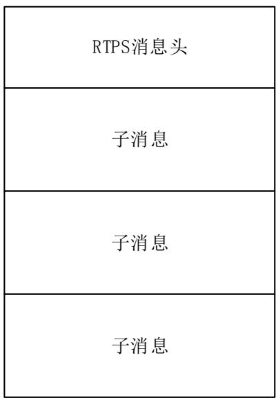  
图 19 RTPS 消息结构

在 RTPS 消息头中，包含发出该消息的 DomainParticipant GUID 前缀、协议版本号、厂商ID号。其后紧接若干个子消息。

## 2) 子消息

子消息是RTPS中的最小消息单元，所有的 RTPS消息都包含一个或若干个子消息。子消息包含一个子消息头和子消息内容。如图 20 所示。

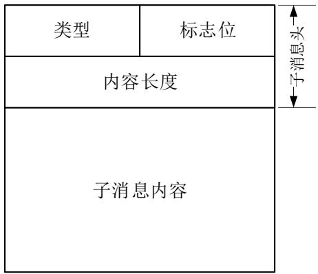  
图 20 子消息结构

所有子消息的头部结构都完全一致，而内容部分则根据子消息类型的不同而不同。子消息头部包含子消息类型、标志位和子消息内容长度。在当前DDS中支持的子消息类型包含：INFO\_TS、INFO\_DST、ACKNACK、HEARTBEAT、DATA、GAP、NACK\_FRAG、DATA\_FRAG。其含义如表 2所示。

表 2 子消息含义
<table><tr><td rowspan=1 colspan=1>子消息</td><td rowspan=1 colspan=1>长度*</td><td rowspan=1 colspan=1>发出者</td><td rowspan=1 colspan=1>接收者</td><td rowspan=1 colspan=1>含义</td></tr><tr><td rowspan=1 colspan=1>INFO_TS</td><td rowspan=1 colspan=1>8</td><td rowspan=1 colspan=1>不限制</td><td rowspan=1 colspan=1>不限制</td><td rowspan=1 colspan=1>用于声明消息的时间戳</td></tr><tr><td rowspan=1 colspan=1>INFO_DST</td><td rowspan=1 colspan=1>12</td><td rowspan=1 colspan=1>不限制</td><td rowspan=1 colspan=1>不限制</td><td rowspan=1 colspan=1>用于声明消息的目的端</td></tr><tr><td rowspan=1 colspan=1>ACKNACK</td><td rowspan=1 colspan=1>不定</td><td rowspan=1 colspan=1>数据读者</td><td rowspan=1 colspan=1>数据写者</td><td rowspan=1 colspan=1>数据读者表明自身已收到和缺失的数据序号</td></tr><tr><td rowspan=1 colspan=1>HEARTBEAT</td><td rowspan=1 colspan=1>28</td><td rowspan=1 colspan=1>数据写者</td><td rowspan=1 colspan=1>数据读者</td><td rowspan=1 colspan=1>数据写者表明自身保存的数据序号范围</td></tr><tr><td rowspan=1 colspan=1>DATA</td><td rowspan=1 colspan=1>不定</td><td rowspan=1 colspan=1>数据写者</td><td rowspan=1 colspan=1>数据读者</td><td rowspan=1 colspan=1>承载数据内容</td></tr><tr><td rowspan=1 colspan=1>GAP</td><td rowspan=1 colspan=1>不定</td><td rowspan=1 colspan=1>数据写者</td><td rowspan=1 colspan=1>数据读者</td><td rowspan=1 colspan=1>数据写者表明某些序号的数据已经不存在</td></tr><tr><td rowspan=1 colspan=1>NACK_FRAG</td><td rowspan=1 colspan=1>不定</td><td rowspan=1 colspan=1>数据读者</td><td rowspan=1 colspan=1>数据写者</td><td rowspan=1 colspan=1>数据读者表明自身缺失的分片编号</td></tr><tr><td rowspan=1 colspan=1>DATA_FRAG</td><td rowspan=1 colspan=1>不定</td><td rowspan=1 colspan=1>数据写者</td><td rowspan=1 colspan=1>数据读者</td><td rowspan=1 colspan=1>承载分片数据内容</td></tr></table>

\*注：仅指内容长度

对于未在表中列出的子消息，可以通过其头部指明的长度跳过，不会影响对后续子消息的解析。

各个子消息的具体结构不再此处详述，可参考 RTPS协议相关部分。

用户提交的数据通常都是通过 DATA 或 DATA\_FRAG 承载，包括 DDS 内置主题的数据也是通过这两个子消息承载。其他子消息是作为状态同步、可靠性保障等功能服务的。对应到本文件第一章第3节中的描述，数据对应DATA子消息，心跳对应HEARTBEAT子消息，反馈对应ACKNACK 子消息，丢失对应GAP子消息。

## 2.3.2 tcpdump

tcpdump 主要用来抓取 linux 环境下的数据包，需要具备 root 权限的用户才能使用，可以将抓取的数据包保存为 cap格式，然后使用 WireShark 工具进行分析。

表格 11 tcpdump 常用命令
<table><tr><td rowspan=1 colspan=1>命令</td><td rowspan=1 colspan=1>说明</td></tr><tr><td rowspan=1 colspan=1>-C</td><td rowspan=1 colspan=1>在收到指定的数量的分组后，tcpdump就会停止</td></tr><tr><td rowspan=1 colspan=1>-D</td><td rowspan=1 colspan=1>打印出系统中所有可以用 tcpdump 截包的网络接口</td></tr><tr><td rowspan=1 colspan=1>-f</td><td rowspan=1 colspan=1>将外部的Internet地址以数字的形式打印出来</td></tr><tr><td rowspan=1 colspan=1>-F</td><td rowspan=1 colspan=1>从文件读取表达式，忽略命令行中的表达式</td></tr><tr><td rowspan=1 colspan=1>-i</td><td rowspan=1 colspan=1>指定网络接口</td></tr><tr><td rowspan=1 colspan=1>-W</td><td rowspan=1 colspan=1>指定保存文件</td></tr><tr><td rowspan=1 colspan=1>-nn</td><td rowspan=1 colspan=1>不进行端口名称的转换</td></tr><tr><td rowspan=1 colspan=1>-P</td><td rowspan=1 colspan=1>不将网络接口设置为混杂模式</td></tr><tr><td rowspan=1 colspan=1>-V</td><td rowspan=1 colspan=1>输出一个稍微详细的信息，例如在ip包中可以包括ttl和服务类型的信息</td></tr></table>

示例: 抓取网卡eth0上的网络数据包，并保存为 out.cap  
tcpdump –i eth0 –w out.cap

## 2.3.2.1 条件抓包

设置固定时长抓一次包（循环抓包）：

参数：-G 设置时间（s）

例如：tcpdump -i ens33 -s0 -G 10 -w %Y\_%m%d\_%H%M\_%S.pcap

设置报文到达指定数量保存；

参数：-c 10 设置包数 ; -s0：指定大小，（如果不加这个参数，超出 10MB 的部分将被丢弃）

例如：tcpdump -i ens33 -s0 -c 10 -w a.pcap

设置每 N兆（1000000字节）抓一次

参数：-c N 设置大小

例如： tcpdump -i ens33 -s0 -c 1 -w a.pcap

## 抓组播的包

例如：Tcpdump – eth0 ‘ip multicast and udp and dst 239.255.0.1 and src haost [本机 ip]’;

## 2.3.3 WireShark

Wireshark 是常用的网络抓包和分析工具。

## 2.3.3.1 WireShark 数据抓包

## a) 选择本地网卡

捕获  
…使用这个过滤器：输入捕获过滤器…  
VMware Network Adapter VMnet8  
本地连接   
VMware Network Adapter VMnet1  
图 21 选择抓取网卡

## b) 捕获数据

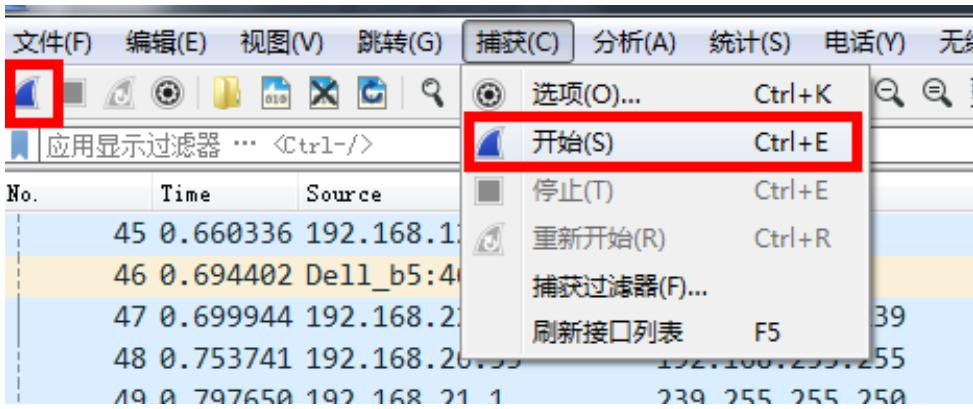  
图 22 开始捕获

c) 停止捕获

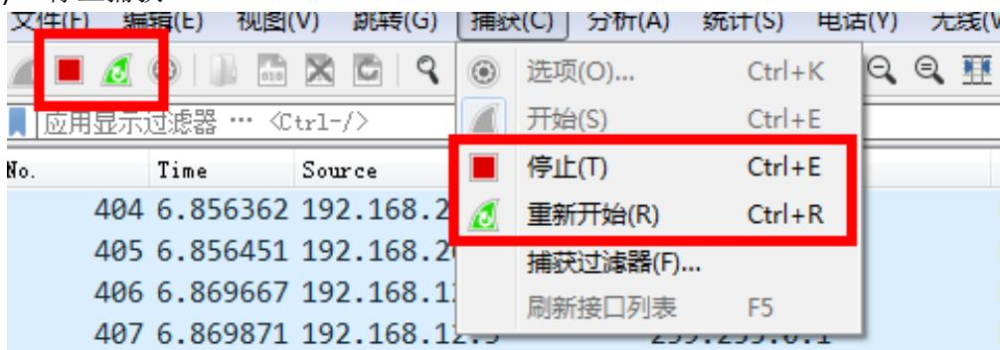  
图 23 停止捕获  
d) WireShark 可以设置抓取的数据包数量和大小，可以筛选数据协议。

## 2.3.3.2 WireShark 抓包分析

在Wireshark中，内置了 DDS数据包的解析器，可以帮助用户分析DDS的通信过程，排除通信故障。

一下为 WireShark 数据分析界面：

<table><tr><td colspan="10">DDSTest prapng 司 文件(F) 编辑(E) 视否(V) 即装(G) 捕获(C) 分析(A) 统计(S) 电话(Y) 无线(W) 工具(T) 帮助(H) 菜单栏</td></tr><tr><td colspan="10">④ 2 XC 9 些了 a Q Q 快捷键 应用显示过滤器…Ctrl-/&gt;</td></tr><tr><td colspan="10"></td></tr><tr><td>Time</td><td>Source 10.000000 Micro-St_02:35:f6</td><td>Destination Broadcast</td><td>Frotocal ength 60</td><td></td><td></td><td>Info éste Who has 2021-03-02 02:45:38.833262</td><td></td><td></td><td></td></tr><tr><td>2 0.050308 192.158.12.3</td><td></td><td>239.255.0.1</td><td>ARP RTPS</td><td>510 51264</td><td>55900</td><td>1234471 DATA(p)</td><td>2021-03-02 02:45:38.883570</td><td>显示过滤器</td><td></td></tr><tr><td>3 0.050503 192.158.12.3</td><td></td><td></td><td></td><td>510 51265</td><td>/400</td><td>12344/1 DAIA(p)</td><td></td><td></td><td></td></tr><tr><td></td><td></td><td>239.255.0.1</td><td>RIPS 60</td><td></td><td></td><td>Who has 192.168.3.1?</td><td>2021-03-02 02:45:38.883/65</td><td></td><td></td></tr><tr><td></td><td>4 0.079043 RealtakS_68:01:21</td><td>Broadcast</td><td>ARP 60</td><td></td><td></td><td></td><td>2021-03-02 02:45:38.912305</td><td></td><td></td></tr><tr><td></td><td>5 0.086434 Cisco_18:6c:22</td><td>Broadcast</td><td>0x8899</td><td></td><td></td><td></td><td>Realtek Layer 2 Proto.. 2021-03-02 02:45:38.919696</td><td></td><td></td></tr><tr><td></td><td>6 0.095075 b4:2e:99:ec:d3:58</td><td>Broadcast</td><td>ARP</td><td>60</td><td></td><td></td><td>Who has 192.168.21.10.. 2021-03-02 02:45:38.923337 Who has 192.168.110.1.. 2021-03-02 02:45:38.945601</td><td>封包列表</td><td></td></tr><tr><td></td><td>70.112339 De11_b5:46:5a</td><td>Broadcast</td><td>ARP</td><td>60 512 55547</td><td>26900</td><td></td><td></td><td></td><td></td></tr><tr><td></td><td>8 0.125790 192.158.12.1</td><td>239.255.0.1</td><td>RTPS</td><td>512 55548</td><td>7400</td><td>1231375 DATA(p)</td><td>2021-03-02 02:45:38.959052</td><td></td><td></td></tr><tr><td></td><td>9 0.125916 192.158.12.1</td><td>239.255.0.1</td><td>RTPS</td><td>60</td><td></td><td>1231375 DATA(p)</td><td>2021-03-02 02:45:38.959178</td><td></td><td></td></tr><tr><td></td><td>10 0.156210 Micro-St_02:35:45</td><td>Broadcast</td><td>ARP</td><td>92 137</td><td>137</td><td></td><td>Who has 192.168.110.1.. 2021-03-02 02:45:38.989472</td><td></td><td></td></tr><tr><td></td><td>11 0.156914 192.158.12.1</td><td>192.168.255.255</td><td>NBNS</td><td>119</td><td></td><td>MST. Root - 32763/0/4_.</td><td>Name query NB WPAD&lt;€0&gt; 2021-03-02 02:45:38.990176 2021-03-02 02:45:39.011209</td><td></td><td></td></tr><tr><td></td><td>12 0.177947 44:67:47:27:0d:d5</td><td>Spanning-tree-(fcr-. STP</td><td>RTPS</td><td>518 49559</td><td>26900</td><td>1231414 DATA(p)</td><td>2021-03-02 02:45:39.052768</td><td></td><td></td></tr><tr><td></td><td>13 0.219506 192.158.12.1</td><td>239.255.0.1</td><td>RTPS</td><td>518 49560</td><td>7480</td><td>1231414 DATA(p)</td><td>2021-03-02 02:45:39.052769</td><td></td><td></td></tr><tr><td></td><td>14 0.219507 192.158.12.1</td><td>239.255.0.1</td><td>ARP</td><td>60</td><td></td><td></td><td>Who has 192.168.110.1.. 2021-03-02 02:45:39.189286</td><td></td><td></td></tr><tr><td></td><td>15 0.356024 Del1_1a:2e:32</td><td>Broadcast C1sco_ab:5c:2e</td><td>LOOP 60</td><td></td><td></td><td></td><td>Unknown funct1on (256) 2021-03-02 02:45:39.237326</td><td></td><td></td></tr><tr><td>17 0.406566 192.158.12.1</td><td>16 0.404064 C1sco_44:60:f6</td><td>239.255.0.1</td><td>RTPS</td><td>510 65399</td><td>7400</td><td>1234310 DATA(p)</td><td>2021-03-02 02:45:39.239828</td><td></td><td></td></tr><tr><td></td><td>18 0.406661 192.158.12.1</td><td>239.255.0.1</td><td>RTPS</td><td>510 65400</td><td>55900</td><td>1234310 DATA(p)</td><td>2021-03-02 02:45:39.239923</td><td></td><td></td></tr><tr><td colspan="10">Frame 8: 512 bytes on wire (4096 bits), 512 bytes captured (4096 bits) on interface 0 Ethernet II, Src: RealtekS_68:01:21 (00:e0:4c:68:01:21), Dst: IPv4mcast_7f:00:01 (01:00:5e:7f:00:01)</td></tr><tr><td></td><td>Internet Protocol Version 4, Src: 192.168.12.1, Dst: 239.255.0.1 User Datagram Protocol, Src Port: 55547, Dst Port: 26900</td><td></td><td></td><td></td><td></td><td></td><td></td><td></td><td></td></tr><tr><td>Real-Time Publish-Subscribe Wire Protocol Magic: RTPS Protocol version: 2.1</td><td></td><td></td><td></td><td></td><td></td><td></td><td></td><td>数据包详 细信息</td><td></td></tr><tr><td>vendorId: 50.82 (Unkncwn)</td><td></td><td></td><td></td><td></td><td></td><td></td><td></td><td></td><td></td></tr><tr><td></td><td>guidPrcfix: c0u80c∂10€0005dc00000001 Default port mapping: MULTICAST_METATRAFFIC, donainId-78</td><td></td><td></td><td></td><td></td><td></td><td></td><td></td><td></td></tr><tr><td>subnessageId: DATA (0x15)</td><td> Flags: 0x05, Data present, Endianress bit</td><td></td><td></td><td></td><td></td><td></td><td></td><td></td><td></td></tr><tr><td></td><td>octetsToNextHeader: 446</td><td></td><td></td><td></td><td></td><td></td><td></td><td></td><td></td></tr><tr><td></td><td>0000 0000 0000 0000 = Extra flags: 0x0000</td><td></td><td></td><td></td><td></td><td></td><td></td><td></td><td></td></tr><tr><td></td><td>Olels Lu Inline QuS: 16</td><td></td><td></td><td></td><td></td><td></td><td></td><td></td><td></td></tr><tr><td></td><td></td><td></td><td></td><td></td><td></td><td></td><td></td><td></td><td></td></tr><tr><td>0020</td><td>00 01 d8 fb 69 14 01 de 86 55</td><td>54 50 53 02 01</td><td>.URTPS.</td><td></td><td></td><td></td><td></td><td></td><td></td></tr><tr><td>0030 5a</td><td>52 cθ a8 ec 01 0e 86 05 dc 00</td><td>80 88 01 15 05</td><td></td><td></td><td></td><td></td><td></td><td></td><td></td></tr><tr><td>0040</td><td>e0 00 00 01 ee 10 00 00 00 00</td><td>01 80 c2 ee è</td><td></td><td></td><td></td><td></td><td></td><td>二进制数据</td><td></td></tr><tr><td>0050</td><td>88 df 54 12 06 03 e0 00 02 ea</td><td>80 88 00 84</td><td></td><td></td><td></td><td></td><td></td><td></td><td></td></tr><tr><td>0060</td><td>00 00 of e0 15 g0 02 00 02 01 Ga</td><td>50 80 10</td><td></td><td></td><td></td><td></td><td></td><td></td><td></td></tr><tr><td>0070</td><td>a8 θc 01 00 00 05 58 do 80 e0 00 00 01 ee 52</td><td>中 e0 01 88 00 32</td><td>ZRX</td><td></td><td></td><td></td><td></td><td></td><td></td></tr><tr><td>0080 16 0090</td><td>00 02 5a 04 à 00 3f 80 00 01 00 00 00 00 00 00 69 80</td><td>88 00 00</td><td></td><td></td><td></td><td></td><td></td><td></td><td></td></tr><tr><td>00a0 4</td><td>ce g 00 00 ee 00 00 a8 0c 01 31</td><td>01 18 e0</td><td></td><td></td><td></td><td></td><td></td><td>其他信息</td><td></td></tr><tr><td>00b0 00</td><td>00 23 G9 80 00 06 00 00 00 00</td><td>00 00 00 00</td><td></td><td></td><td></td><td></td><td></td><td></td><td></td></tr><tr><td>00c0 00</td><td>00 cθ a8 0c 01 2c 00</td><td>04 00 00 80 00 00 59 08</td><td></td><td></td><td></td><td></td><td></td><td></td><td></td></tr><tr><td></td><td>Resl-Tina Pahlisl-Suhtreriha Wire Protaral (rtzs), e 字节</td><td></td><td></td><td></td><td></td><td></td><td></td><td>分组371·已显示971 100 0%)加载时间0·0 19</td><td>配置文件 lufault</td></tr></table>

图 24 数据分析图

数据过滤：可以通过表达式过滤出自己感兴趣的数据
<table><tr><td colspan="11">rtps(ip. addr == 192.168.156.12||ip. addr == 192.168.150.51)</td></tr><tr><td>Ho.</td><td>Tine</td><td>Source</td><td>Destination</td><td>Protocol</td><td>Length Source Port</td><td>Destination Port</td><td>writerSeqHunber Info</td><td></td><td>date</td></tr><tr><td></td><td></td><td>60 1.321679 192.168.156.12</td><td>239.255.0.1</td><td>RTPS</td><td>714 59962</td><td>7650</td><td></td><td>1 DATA(p)</td><td>2021-03-02 02:45:40.154941</td></tr><tr><td></td><td></td><td>61 1.321704 192.168.156.12</td><td>239.255.0.1</td><td>RTPS</td><td>714 59962</td><td>7400</td><td>1 DATA(p)</td><td></td><td>2021-03-02 02:45:40.154966</td></tr><tr><td></td><td></td><td>62 1.322346 192.168.150.51</td><td>192.168.156.12</td><td>RTPS</td><td>106 57870</td><td>7660</td><td></td><td>1 INFO_DST, ACKNACK</td><td>2021-03-02 02:45:40.155608</td></tr><tr><td></td><td></td><td>63 1.322482 192.168.150.51</td><td>192.168.156.12</td><td>RTPS</td><td>110 57871</td><td>7660</td><td></td><td>1,0 INFO_DST, HEARTBEAT</td><td>2021-03-02 02:45:40.155744</td></tr><tr><td></td><td></td><td>64 1.322483 192.168.150.51</td><td>192.168.156.12</td><td>RTPS</td><td>106 57870</td><td>7660</td><td></td><td>1 INFO_DST, ACKNACK</td><td>2021-03-02 02:45:40.155745</td></tr><tr><td></td><td></td><td>65 1.322483 192.168.150.51</td><td>192.168.156.12</td><td>RTPS</td><td>106 57870</td><td>7660</td><td></td><td>1 INFO_DST, ACKNACK</td><td>2021-03-02 02:45:40.155745</td></tr><tr><td></td><td></td><td>66 1.322483 192.168.150.51</td><td>192.168.156.12</td><td>RTPS</td><td>110 57871</td><td>7660</td><td></td><td>1,0 INFO_DST, HEARTBEAT</td><td>2021-03-02 02:45:40.155745</td></tr><tr><td></td><td></td><td>67 1.322617 192.168.150.51</td><td>192.168.156.12</td><td>RTPS</td><td>110 57871</td><td>7660</td><td></td><td>1,1 INFO_DST, HEARTBEAT</td><td>2021-03-02 02:45:40.155879</td></tr><tr><td></td><td></td><td>68 1.322725 192.168.150.51</td><td>192.168.156.12</td><td>RTPS</td><td>106 57870</td><td>7660</td><td></td><td>1 INFO_DST, ACKNACK</td><td>2021-03-02 02:45:40.155987</td></tr><tr><td></td><td></td><td>69 1.322725 192.168.150.51</td><td>192.168.156.12</td><td>RTPS</td><td>110 57871</td><td>7660</td><td></td><td>1,1 INFO_DST, HEARTBEAT</td><td>2021-03-02 02:45:40.155987</td></tr><tr><td></td><td></td><td>70 1.322859 192.168.150.51</td><td>192.168.156.12</td><td>RTPS</td><td>706 57870</td><td>7660</td><td></td><td>1 DATA(p)</td><td></td></tr><tr><td></td><td></td><td>71 1.325717 192.168.156.12</td><td>192.168.150.51</td><td>RTPS</td><td>106 59963</td><td>7660</td><td></td><td>1 INFO_DST, ACKNACK</td><td>2021-03-02 02:45:40.156121</td></tr><tr><td></td><td></td><td>72 1.325863 192.168.156.12</td><td>192.168.150.51</td><td>RTPS</td><td>110 59964</td><td>7660</td><td></td><td>1,0 INFO_DST, HEARTBEAT</td><td>2021-03-02 02:45:40.158979</td></tr><tr><td></td><td></td><td>73 1.325921 192.168.156.12</td><td>192.168.150.51</td><td>RTPS</td><td>106 59963</td><td>7660</td><td></td><td></td><td>2021-03-02 02:45:40.159125</td></tr><tr><td></td><td></td><td>74 1.325979 192.168.156.12</td><td>192.168.150.51</td><td>RTPS</td><td>106 59963</td><td>7660</td><td></td><td>1 INFO_DST, ACKNACK 1 INFO_DST, ACKNACK</td><td>2021-03-02 02:45:40.159183 2021-03-02 02:45:40.159241</td></tr><tr><td></td><td></td><td>75 1.326050 192.168.150.51</td><td>192.168.156.12</td><td>RTPS</td><td>110 57871</td><td>7660</td><td></td><td>1,0 INFO_DST, HEARTBEAT</td><td>2021-03-02 02:45:40.159312</td></tr><tr><td></td><td></td><td>76 1.326108 192.168.156.12</td><td>192.168.150.51</td><td>RTPS</td><td>110 59964</td><td>7660</td><td></td><td>1,1 INFO_DST, HEARTBEAT</td><td>2021-03-02 02:45:40.159370</td></tr><tr><td></td><td></td><td>77 1.326176 192.168.150.51</td><td>192.168.156.12</td><td>RTPS</td><td>106 57870</td><td>7660</td><td></td><td>1 INFO_DST, ACKNACK</td><td>2021-03-02 02:45:40.159438</td></tr><tr><td></td><td></td><td></td><td></td><td></td><td></td><td></td><td></td><td></td><td></td></tr></table>

图 25 过滤后数据

分析：

<table><tr><td>No.</td><td>Time</td><td>Delta time</td><td>Delta time display Source</td><td></td><td>Destination</td><td>Protocol</td><td>Length</td><td>Info</td><td></td></tr><tr><td>43</td><td>0.068816</td><td>0.000095</td><td>0.000095</td><td>4: 54:4..</td><td>19h21</td><td>uvir</td><td>è</td><td>Peirt tune W</td><td>p 4 </td></tr><tr><td>44</td><td>0.068816</td><td>0.000000</td><td>0.000000</td><td>vłą, ā.2, 151</td><td>,,</td><td>D</td><td>à</td><td>Pandad  E</td><td> a 2</td></tr><tr><td>45</td><td>0.081132</td><td>0.012316</td><td>0.012316</td><td>GCTAC b9Lub</td><td>frostont</td><td>d</td><td>2</td><td>Hn ha y. 1t.</td><td>9.104 212</td></tr><tr><td>46</td><td>0.094684</td><td>0.013552</td><td>0.013552</td><td>Mcn-SrT-Sh-5 troant</td><td></td><td>H</td><td>tè</td><td>Wey. hen 249,24.</td><td>prst ét i</td></tr><tr><td>47</td><td>0.094902</td><td>0.000218</td><td>0.000218</td><td>291.184 18,74</td><td>239.255.0.1</td><td>RTPS</td><td>858</td><td>INFO_TS, DATA(p)</td><td></td></tr></table>

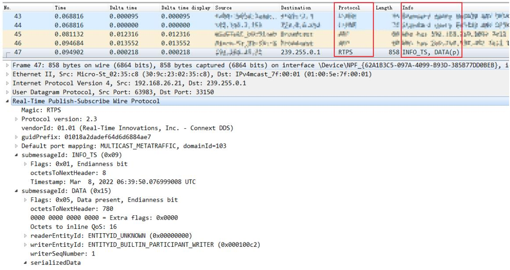  
图 26 Wireshark 解析 DDS 数据包

如图 26 所示，通过 Wireshark 抓取的一个 DDS 的数据包可以直接被解析出来，可以看到图中两个红框，左边红框里是数据包的协议，已经被解析为 RTPS，右边红框里的数据包信息显示了该数据包中包含两个子消息，分别为 INFO\_TS 和 DATA。在下面的详细信息中，数据包内的每个字段都以可读的形式显示，能大大提升数据分析效率。在Wireshark的过滤器中填入“rtps”（不包含引号），可以将其他消息过滤，只留下RTPS消息。

在图 26 中，注意到其中显示的 DATA 子消息后还包含一个“(p)”后缀。这一后缀号表示这是一个属于“Participant”的 DATA 子消息。通常这类子消息就是 DDS 用于发现的数据包。Wireshark 还能识别出保存了 DataWriter 匹配信息的 DATA(w)子消息，保存了 DataReader 匹配信息的DATA(r)子消息。而用户的数据，通常仅标识为“DATA”而不包含任何后缀。

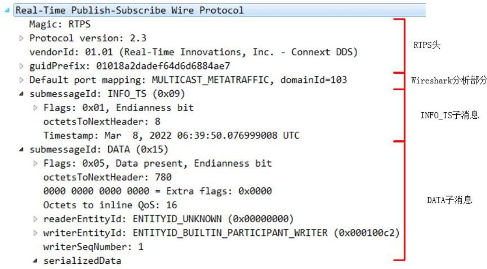  
图 27 RTPS 消息详情

在RTPS详情中，我们可以清晰地看到RTPS的消息结构，如图 27 所示。消息起始部分是RTPS消息头，后面还包含了 Wireshark 分析得到的域号。紧接着是一个 INFO\_TS子消息，包含了时间戳的信息。而后是一个DATA子消息，包含了数据内容。用户还可以展开各个子项查看更详细的信息。

表格 12 子消息分析常用字段
<table><tr><td colspan="1" rowspan="1">子消息</td><td colspan="1" rowspan="1">字段</td><td colspan="1" rowspan="1">说明</td></tr><tr><td colspan="1" rowspan="2">RTPS 消息</td><td colspan="1" rowspan="1">guidPrefix</td><td colspan="1" rowspan="1">通过该字段是 DomainParticipant GUID 的前 12 个字节，可以确定消息所属的DomainParticipant              因为DomainParticipant 的 GUID 后 4 个字节都是固定的，仅使用前12个字节区分</td></tr><tr><td colspan="1" rowspan="1">domainld</td><td colspan="1" rowspan="1">该字段表示消息来自于哪个域号，在用户没有设定接收地址时该字段分析是准确的，如果用户设定了接收地址和端口，该字段则不能作为参考</td></tr><tr><td colspan="1" rowspan="1">【通用】</td><td colspan="1" rowspan="1">octetsToNextHeader</td><td colspan="1" rowspan="1">当前子消息内容的长度，通常可用于识别或过滤特定长度的数据</td></tr><tr><td colspan="1" rowspan="4">DATA</td><td colspan="1" rowspan="1">writerSeqNumber</td><td colspan="1" rowspan="1">数据的序列号，表明数据是当前DataWriter 发出的第几个数据</td></tr><tr><td colspan="1" rowspan="1">writerEntityld</td><td colspan="1" rowspan="1">发出该数据的DataWriter标识，Wireshark可分析出是由内置主题还是用户主题的的 DataWriter发出，可以初步确定数据归属的主题，如果结合DATA(w)数据中的 Guid 信息，可以确定数据所属主题</td></tr><tr><td colspan="1" rowspan="1">readerEntityld</td><td colspan="1" rowspan="1">数据发往的 DataReader表示，如果是ENTITYID_UNKNOWN表示发送给所有同主题的 DataReader</td></tr><tr><td colspan="1" rowspan="1">serializedData</td><td colspan="1" rowspan="1">用户的数据内容，在知晓主题的数据结构和数据序列化规则之后，可以通过该字段手动解析出数据内容，特定场景下能有效帮助定位问题</td></tr><tr><td colspan="1" rowspan="2">DATA_FRAG</td><td colspan="1" rowspan="1">writerSeqNumber</td><td colspan="1" rowspan="1">当前分片数据所属的完整数据的序列号</td></tr><tr><td colspan="1" rowspan="1">fragmentStartingNum</td><td colspan="1" rowspan="1">当前分片数据的首个分片号，通常一个数据包仅包含一个分片数据，因此该值就是分片数据的分片号</td></tr><tr><td colspan="1" rowspan="2">HEARTBEAT</td><td colspan="1" rowspan="1">firstAvailableSeqNumber</td><td colspan="1" rowspan="1">未被 readerEntityld 指定 DataReader确认的 DataWriter数据队列中的第一个数据序列号，如果当前子消息的readerEntityId 是 ENTITYID_UNKNOWN,则表示未被所有 DataReader 确认的数据队列中的第一个数据序列号</td></tr><tr><td colspan="1" rowspan="1">lastSeqNumber</td><td colspan="1" rowspan="1">DataWriter数据队列中最后一个数据的序列号，如果该值小于</td></tr><tr><td colspan="1" rowspan="1"></td><td colspan="1" rowspan="1"></td><td colspan="1" rowspan="1">firstAvailableSeqNumber，则 表明readerEntityld 指定的DataReader（若readerEntityId 是 ENTITYID_UNKNOWN 则表示所有DataReader）已经确认了当前DataWriter发出的所有数据</td></tr><tr><td colspan="1" rowspan="1">GAP</td><td colspan="1" rowspan="1">gapList</td><td colspan="1" rowspan="1">DataWriter声明的缺失数据的序列号，较新版本的 Wireshark 可以直接显示出序列号的列表</td></tr><tr><td colspan="1" rowspan="1">ACKNACK</td><td colspan="1" rowspan="1">readerSNState</td><td colspan="1" rowspan="1">DataReader声明的已经收到和缺失的数据序列号，较新版本的 Wireshark 可以直接显示出序列号的列表</td></tr><tr><td colspan="1" rowspan="2">NACK_FRAG</td><td colspan="1" rowspan="1">wirterSN</td><td colspan="1" rowspan="1">分片所属完整数据包的序列号</td></tr><tr><td colspan="1" rowspan="1">fragmentNumberState</td><td colspan="1" rowspan="1">缺失的分片信息</td></tr></table>

上表列出了使用 Wireshark分析RTPS子消息时常用的字段及含义。

需要注意的是，Wireshark 抓包会占用大量内存和磁盘空间，如果应用程序正在大量收发数据，有可能导致内存被快速占满，且CPU被抢占，影响其他应用程序甚至系统的运行。同时，如果用户使用版本较低的 Wireshark抓包时，无法抓取到本地回环的数据包，有可能产生应用程序明明在正常通信但是 Wireshark 上看不到任何数据包的情况。如果在 Windows平台可以使用 RawCap 工具抓取本地回环的数据包，并将其保存的文件通过 Wireshark 进行解析。

除了使用 Wireshark 抓包之外，Linux 平台上还可以使用 tcpdump 进行抓包。如果保存成文件，同样可以使用 Wireshark打开并解析。

## 2.4 ZRDDS 管理监控器

第一步：检查域是否相同以及主题名是否一致

在确保物理网络正常的情况下，双方无法进行通信，需要先检查双方的域号以及主题名是否一致。

如图 28 所示，在“系统物理视图”中，找到通信双方所属的进程。双击显示进程名，在如图 29所示，在进程详细信息视图中，查看实体（数据读者/数据写者）所属的域，以及主题名。对比通信双方是否在相同的域，以及主题名和类型名是否相同。

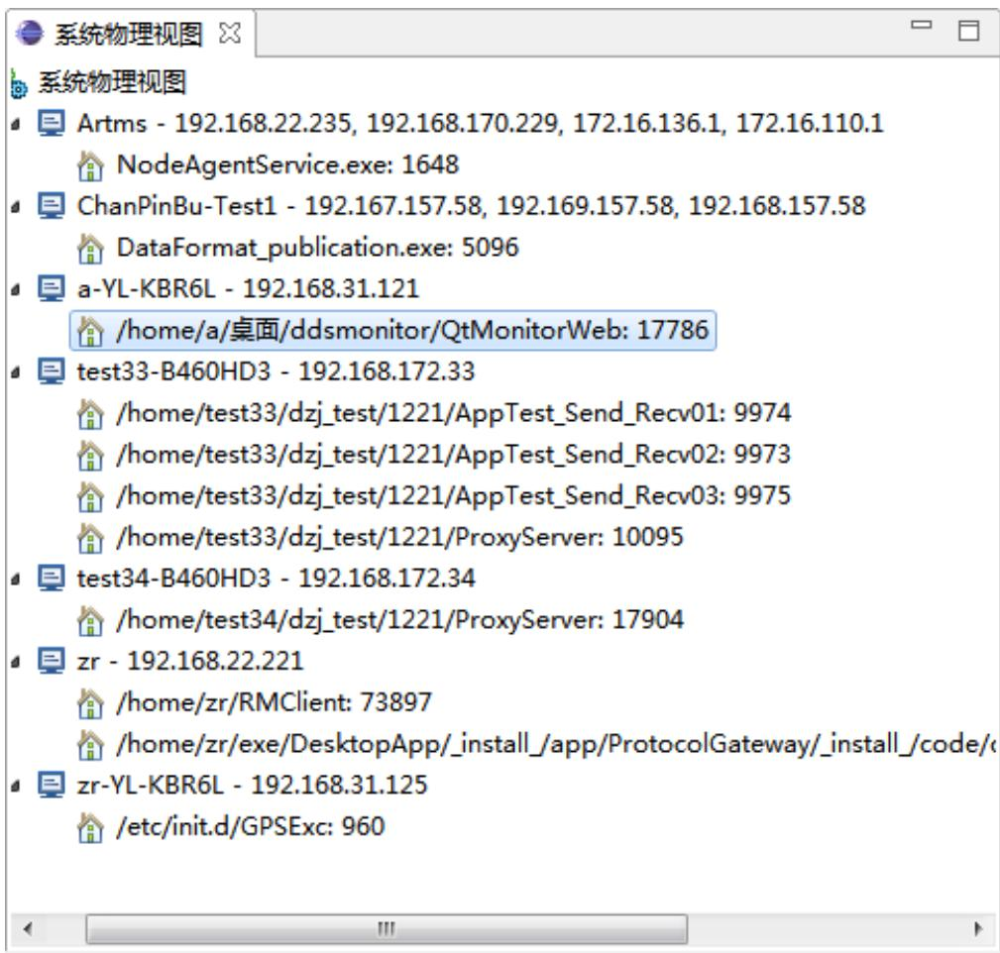  
图 28 系统物理视图

<table><tr><td rowspan=2 colspan=3>a-YL-KBR6L - 192.168.31.121/home/a/... ht706-os - 192.168.172.102/home/ht70...实体名称</td><td rowspan=1 colspan=2>test33-B460HD3 - 192.168.172.33/home...</td><td rowspan=1 colspan=2>□日</td></tr><tr><td rowspan=1 colspan=1>摘要信息</td><td rowspan=1 colspan=1></td><td rowspan=1 colspan=1></td><td></td><td rowspan=2 colspan=1></td></tr><tr><td rowspan=1 colspan=2>4数据读者</td><td rowspan=1 colspan=2></td><td rowspan=1 colspan=2></td></tr><tr><td rowspan=1 colspan=2>主题名称： CONFIG</td><td rowspan=1 colspan=2>类型名称: ZRAppModuleInfo</td><td rowspan=1 colspan=2></td><td rowspan=23 colspan=1>m</td></tr><tr><td rowspan=1 colspan=2>4 域参与者</td><td rowspan=1 colspan=2>所属域：6</td><td rowspan=1 colspan=2></td></tr><tr><td rowspan=1 colspan=2>数据写者</td><td rowspan=1 colspan=2></td><td rowspan=1 colspan=2></td></tr><tr><td rowspan=1 colspan=2>4数据读者</td><td rowspan=1 colspan=2></td><td rowspan=1 colspan=2></td></tr><tr><td rowspan=1 colspan=2>主题名称: APPCMDRESULT</td><td rowspan=1 colspan=2>类型名称: ZRAppCmdResult</td><td rowspan=1 colspan=2></td></tr><tr><td rowspan=1 colspan=2>4 域参与者</td><td rowspan=1 colspan=2>所属域：6</td><td rowspan=1 colspan=2></td></tr><tr><td rowspan=1 colspan=2>数据写者</td><td rowspan=1 colspan=2></td><td rowspan=1 colspan=2></td></tr><tr><td rowspan=1 colspan=2>4数据读者</td><td rowspan=1 colspan=2></td><td rowspan=1 colspan=2></td></tr><tr><td rowspan=1 colspan=2>主题名称: APPHEARTBEAT</td><td rowspan=1 colspan=2>类型名称: ZRAppHeartbeat</td><td rowspan=1 colspan=2></td></tr><tr><td rowspan=1 colspan=2>4 域参与者</td><td rowspan=1 colspan=2>所属域：6</td><td rowspan=1 colspan=2></td></tr><tr><td rowspan=1 colspan=2>4数据写者</td><td rowspan=1 colspan=2></td><td rowspan=1 colspan=2></td></tr><tr><td rowspan=1 colspan=2>主题名称: APPCMD</td><td rowspan=1 colspan=2>类型名称: ZRAppCmd</td><td rowspan=1 colspan=2></td></tr><tr><td rowspan=1 colspan=2>数据读者</td><td rowspan=1 colspan=2></td><td rowspan=1 colspan=2></td></tr><tr><td rowspan=1 colspan=2>域参与者</td><td rowspan=1 colspan=2>所属域：6</td><td rowspan=1 colspan=2></td></tr><tr><td rowspan=1 colspan=2>4数据写者</td><td rowspan=1 colspan=2></td><td rowspan=1 colspan=2></td></tr><tr><td rowspan=1 colspan=2>主题名称: UPDATECONFIG</td><td rowspan=1 colspan=2>类型名称: ZRAppModuleInfo</td><td rowspan=1 colspan=2></td></tr><tr><td rowspan=1 colspan=2>数据读者</td><td rowspan=1 colspan=2></td><td rowspan=1 colspan=2></td></tr><tr><td rowspan=1 colspan=2>4 域参与者</td><td rowspan=1 colspan=2>所属域：50</td><td rowspan=1 colspan=2></td></tr><tr><td rowspan=1 colspan=2>数据写者</td><td rowspan=1 colspan=2></td><td rowspan=1 colspan=2></td></tr><tr><td rowspan=1 colspan=2>数据读者</td><td rowspan=1 colspan=2></td><td rowspan=1 colspan=2></td></tr><tr><td rowspan=1 colspan=2>4 域参与者</td><td rowspan=1 colspan=2>所属域: 12</td><td rowspan=1 colspan=2></td></tr><tr><td rowspan=1 colspan=2>数据写者</td><td rowspan=1 colspan=2></td><td rowspan=1 colspan=2></td></tr><tr><td rowspan=1 colspan=1>4数据读者</td><td rowspan=1 colspan=1></td><td rowspan=1 colspan=2></td><td rowspan=1 colspan=2></td></tr><tr><td rowspan=1 colspan=1>DDS实体列表日志信息</td><td rowspan=1 colspan=6></td></tr></table>

图 29 进程详细信息

## 第二步：数据类型以及 QoS是否相同

若能够确定通信双方的域号、主题名和数据类型名相同，但通信双方仍旧无法通信，则需要进一步判断通信是否能够匹配上（请注意：这里使用的是“能够”，因为监控器是通过监控到的数据读者和数据写者的信息，来模拟双方是否应该匹配上）。

如图 31 所示，在“系统逻辑视图“”中，找到需要检测的实体所属的域号和主题名并双击。弹出如图 31 所示的“主题详细信息”视图，在“实体列表”的标签页中，可以看到该域号该主题下数据读者和数据写者的信息。通过状态信息，可以初步判断双方是否匹配上了：

 Normal：代表数据读者和数据写者能够匹配；

 warning：代表该域号该主题下，仅有数据读者或者数据写者；

 error：代表数据读者和数据写者不能够匹配。

若是不能够匹配，则需要进一步查看是哪些数据读者和数据写者没能匹配上，以及没有匹配上的原因。在“实体列表”标签页中，选中一实体，则在如图 32 所示的视图中则显示其需要匹配的实体信息，并显示是否匹配上以及不匹配的原因。（加入选中的实体时数据写者，则“匹配分析”视图中显示的则是“实体列表”标签页中数据读者的信息）。

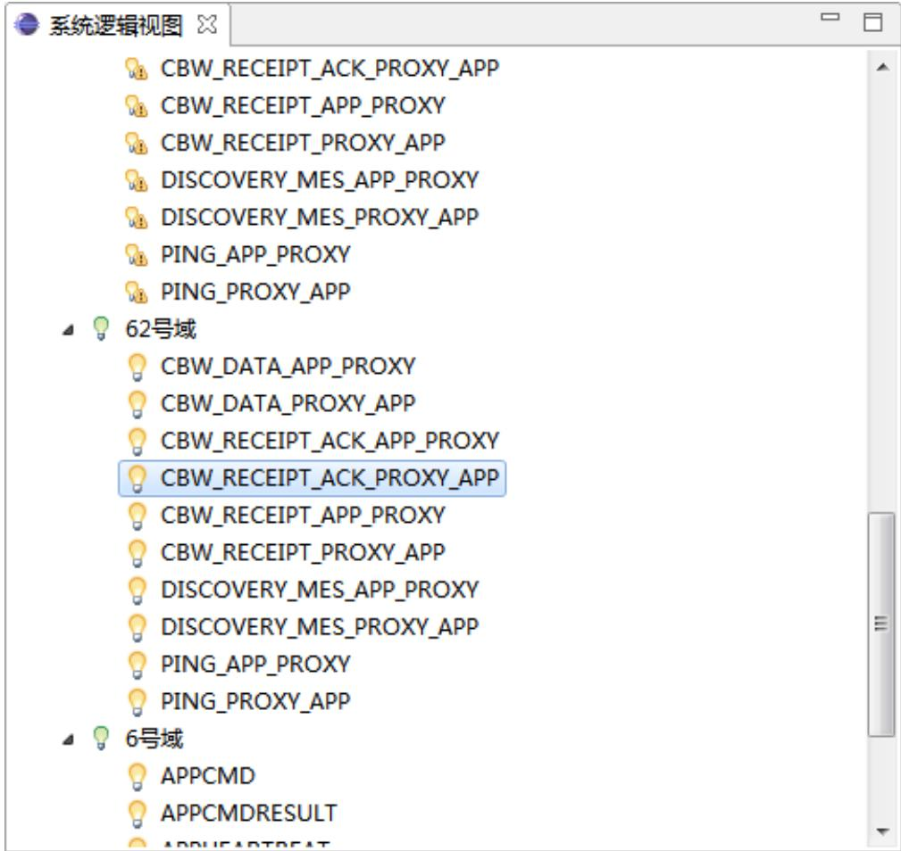  
图 30 系统逻辑视图

<table><tr><td rowspan=1 colspan=3>62号域：CBW_RECEIPT_ACK_PROXY_APP主题详细信息</td><td rowspan=1 colspan=4>□日</td></tr><tr><td rowspan=1 colspan=1>实体类型</td><td rowspan=1 colspan=1>节点</td><td rowspan=1 colspan=2>进程/模块名</td><td rowspan=1 colspan=1>进程/任务号</td><td rowspan=1 colspan=1>标识</td><td rowspan=1 colspan=1>状态</td></tr><tr><td rowspan=1 colspan=1>DataWriter</td><td rowspan=1 colspan=1>test33-B460HD3 - 192.168.172... /h</td><td rowspan=1 colspan=2>ome/test33/dzj_test/1221/Pr...</td><td rowspan=1 colspan=1>10095</td><td rowspan=1 colspan=1>0xc0a8ac210000276f0000000016000...</td><td rowspan=1 colspan=1>Normal</td></tr><tr><td rowspan=1 colspan=1>DataReader</td><td rowspan=1 colspan=1>test33-B460HD3 - 192.168.172...</td><td rowspan=1 colspan=2>/home/test33/dzj_test/1221/A...</td><td rowspan=1 colspan=1>9975</td><td rowspan=1 colspan=1>0xc0a8ac21000026f70000000019000...</td><td rowspan=1 colspan=1>Normal</td></tr><tr><td rowspan=1 colspan=1>DataReader</td><td rowspan=1 colspan=1>test33-B460HD3 - 192.168.172...</td><td rowspan=1 colspan=2>/home/test33/dzj_test/1221/A...</td><td rowspan=1 colspan=1>9973</td><td rowspan=1 colspan=1>0xc0a8ac21000026f50000000019000...</td><td rowspan=1 colspan=1>Normal</td></tr><tr><td rowspan=1 colspan=1>DataReader</td><td rowspan=1 colspan=1>test33-B460HD3 - 192.168.172...</td><td rowspan=1 colspan=2>/home/test33/dzj_test/1221/A...</td><td rowspan=1 colspan=1>9974</td><td rowspan=1 colspan=1>0xc0a8ac21000026f60000000019000..</td><td rowspan=1 colspan=1>Normal</td></tr><tr><td rowspan=1 colspan=1></td><td rowspan=1 colspan=1></td><td rowspan=1 colspan=2></td><td rowspan=1 colspan=1></td><td rowspan=1 colspan=1></td><td rowspan=1 colspan=1></td></tr><tr><td rowspan=1 colspan=1></td><td rowspan=1 colspan=1></td><td rowspan=1 colspan=2></td><td rowspan=1 colspan=1></td><td rowspan=1 colspan=1></td><td rowspan=1 colspan=1></td></tr><tr><td rowspan=1 colspan=1></td><td rowspan=1 colspan=1></td><td rowspan=1 colspan=2></td><td rowspan=1 colspan=1></td><td rowspan=1 colspan=1></td><td rowspan=1 colspan=1></td></tr><tr><td rowspan=1 colspan=1></td><td rowspan=1 colspan=1></td><td rowspan=1 colspan=2></td><td rowspan=1 colspan=1></td><td rowspan=1 colspan=1></td><td rowspan=1 colspan=1></td></tr><tr><td rowspan=1 colspan=1></td><td rowspan=1 colspan=1></td><td rowspan=1 colspan=2></td><td rowspan=1 colspan=1></td><td rowspan=1 colspan=1></td><td rowspan=1 colspan=1></td></tr><tr><td rowspan=1 colspan=1></td><td rowspan=1 colspan=1></td><td rowspan=1 colspan=2></td><td rowspan=1 colspan=1></td><td rowspan=1 colspan=1></td><td rowspan=1 colspan=1></td></tr><tr><td rowspan=1 colspan=1></td><td rowspan=1 colspan=1></td><td rowspan=1 colspan=2></td><td rowspan=1 colspan=1></td><td rowspan=1 colspan=1></td><td rowspan=1 colspan=1></td></tr><tr><td rowspan=1 colspan=1></td><td rowspan=1 colspan=1></td><td rowspan=1 colspan=2></td><td rowspan=1 colspan=1></td><td rowspan=1 colspan=1></td><td rowspan=1 colspan=1></td></tr><tr><td rowspan=1 colspan=1></td><td rowspan=1 colspan=1></td><td rowspan=1 colspan=2></td><td rowspan=1 colspan=1></td><td rowspan=1 colspan=1></td><td rowspan=1 colspan=1></td></tr><tr><td rowspan=1 colspan=1></td><td rowspan=1 colspan=1></td><td rowspan=1 colspan=2></td><td rowspan=1 colspan=1></td><td rowspan=1 colspan=1></td><td rowspan=1 colspan=1></td></tr><tr><td rowspan=1 colspan=1></td><td rowspan=1 colspan=1></td><td rowspan=1 colspan=2></td><td rowspan=1 colspan=1></td><td rowspan=1 colspan=1></td><td rowspan=1 colspan=1></td></tr><tr><td rowspan=1 colspan=1></td><td rowspan=1 colspan=1></td><td rowspan=1 colspan=2></td><td rowspan=1 colspan=1></td><td rowspan=1 colspan=1></td><td rowspan=1 colspan=1></td></tr><tr><td rowspan=1 colspan=1></td><td rowspan=1 colspan=1></td><td rowspan=1 colspan=2></td><td rowspan=1 colspan=1></td><td rowspan=1 colspan=1></td><td rowspan=1 colspan=1></td></tr><tr><td rowspan=1 colspan=1></td><td rowspan=1 colspan=1></td><td rowspan=1 colspan=2></td><td rowspan=1 colspan=1></td><td rowspan=1 colspan=1></td><td rowspan=1 colspan=1></td></tr><tr><td rowspan=1 colspan=1></td><td rowspan=1 colspan=1></td><td rowspan=1 colspan=2></td><td rowspan=1 colspan=1></td><td rowspan=1 colspan=1></td><td rowspan=1 colspan=1></td></tr><tr><td rowspan=1 colspan=1></td><td rowspan=1 colspan=1></td><td rowspan=1 colspan=2></td><td rowspan=1 colspan=1></td><td rowspan=1 colspan=1></td><td rowspan=1 colspan=1></td></tr><tr><td rowspan=1 colspan=1></td><td rowspan=1 colspan=1></td><td rowspan=1 colspan=2></td><td rowspan=1 colspan=1></td><td rowspan=1 colspan=1></td><td rowspan=1 colspan=1></td></tr><tr><td rowspan=1 colspan=7>III实体列表●主题匹配图 主题数据订阅主题数据发布</td></tr></table>

图 31 主题详细信息视图

<table><tr><td rowspan=3 colspan=1>匹配分析</td><td rowspan=1 colspan=5>品日</td></tr><tr><td rowspan=2 colspan=1>检查项</td><td rowspan=2 colspan=1>匹配规则</td><td rowspan=2 colspan=1>发布端</td><td rowspan=2 colspan=1>订阅端</td><td></td></tr><tr><td rowspan=1 colspan=1></td></tr><tr><td rowspan=1 colspan=2>0xc0a8ac21000026f7000000001900000/h</td><td rowspan=1 colspan=1>ome/test33/dzj_test/1221/AppTest_Send_Recv03: 9975</td><td rowspan=1 colspan=1></td><td rowspan=1 colspan=1>是</td><td rowspan=1 colspan=1></td></tr><tr><td rowspan=1 colspan=2>类型名称</td><td rowspan=1 colspan=1>类型名称必须相等</td><td rowspan=1 colspan=1>FileReceipt</td><td rowspan=1 colspan=1>FileReceipt</td><td rowspan=1 colspan=1></td></tr><tr><td rowspan=1 colspan=2>类型编码</td><td rowspan=1 colspan=1>类型编码必须相同</td><td rowspan=1 colspan=1>struct ::InsCon... s</td><td rowspan=1 colspan=1>truct ::InsContent{sequen...</td><td rowspan=1 colspan=1></td></tr><tr><td rowspan=1 colspan=2>QoS匹配项</td><td rowspan=1 colspan=1>QoS必须满足RxO规则</td><td rowspan=1 colspan=1></td><td rowspan=1 colspan=1></td><td rowspan=1 colspan=1></td></tr><tr><td rowspan=1 colspan=2>durability</td><td rowspan=1 colspan=1></td><td rowspan=1 colspan=1></td><td rowspan=1 colspan=1></td><td rowspan=1 colspan=1></td></tr><tr><td rowspan=1 colspan=2>presentation</td><td rowspan=1 colspan=1>需要满足以下三个条件</td><td rowspan=1 colspan=1></td><td rowspan=1 colspan=1></td><td rowspan=1 colspan=1></td></tr><tr><td rowspan=1 colspan=2>deadline</td><td rowspan=1 colspan=1></td><td rowspan=1 colspan=1></td><td rowspan=1 colspan=1></td><td rowspan=1 colspan=1></td></tr><tr><td rowspan=1 colspan=2>latency_budget</td><td rowspan=1 colspan=1></td><td rowspan=1 colspan=1></td><td rowspan=1 colspan=1></td><td rowspan=1 colspan=1></td></tr><tr><td rowspan=1 colspan=2>ownership</td><td rowspan=1 colspan=1></td><td rowspan=1 colspan=1></td><td rowspan=1 colspan=1></td><td rowspan=1 colspan=1></td></tr><tr><td rowspan=1 colspan=2>liveliness</td><td rowspan=1 colspan=1>需满足以下两个条件</td><td rowspan=1 colspan=1></td><td rowspan=1 colspan=1></td><td rowspan=1 colspan=1></td></tr><tr><td rowspan=1 colspan=2>reliability</td><td rowspan=1 colspan=1></td><td rowspan=1 colspan=1></td><td rowspan=1 colspan=1></td><td rowspan=1 colspan=1></td></tr><tr><td rowspan=1 colspan=2>destination</td><td rowspan=1 colspan=1></td><td rowspan=1 colspan=1></td><td rowspan=1 colspan=1></td><td rowspan=1 colspan=1></td></tr><tr><td rowspan=1 colspan=2>0xc0a8ac21000026f5000000001900000/h</td><td rowspan=1 colspan=1>ome/test33/dzj_test/1221/AppTest_Send_Recv02: 9973</td><td rowspan=1 colspan=1></td><td rowspan=1 colspan=1>是</td><td rowspan=1 colspan=1></td></tr><tr><td rowspan=1 colspan=2>0xc0a8ac21000026f6000000001900000/h</td><td rowspan=1 colspan=1>ome/test33/dzj_test/1221/AppTest_Send_Recv01: 9974</td><td rowspan=1 colspan=1></td><td rowspan=1 colspan=1>是</td><td rowspan=1 colspan=1></td></tr><tr><td rowspan=1 colspan=2></td><td rowspan=1 colspan=1></td><td rowspan=1 colspan=1></td><td rowspan=1 colspan=1></td><td rowspan=1 colspan=1></td></tr></table>

图 32 匹配分析视图

注：ZRDDS管理监控器的介绍以及使用方法，参照《ZRDDS管理监控器使用手册》

## 3 典型故障

## 3.1 编译失败

## 3.1.1 环境变量未生效

可能存在在工程中通过 ZRDDS\_HOME 环境变量链接库和头文件，然而实际情况下ZRDDS\_HOME环境变量未生效，导致编译失败。

故障表现：

编译时报错库文件，头文件找不到。

排查方式：

若工程所链库和头文件地址是基于 ZRDDS\_HOME环境变量，则检查环境变量是否生效。

Window 下在 cmd 窗口中输入 set 指令，查看环境变量中是否存在 ZRDDS\_HOME 且值是否正确，在 Linux 下输入 echo \$ZRDDS\_HOME 查看。

通常在设置环境变量后需重启才可使环境变量生效，若发现环境变量已写入但未生效可通过重启的方式使其生效。

## 3.1.2 预编译符缺失

可能存在C++工程中未填写预编译符或预编译符填写失败的情况。故障表现：

编译时部分sequence 处理函数无法识别导致报错，常见报错如下：

说明 文件 项目   
4 error C2039:“clear”：不是“DDS\_StringSeq”的成员 test\_publication.cpp 1 58 test\_publication   
2 error C2039: “ensure\_length”:不是“DDS\_StringSeq”的成员 test\_publication.cpp 1 56 test\_publication   
3 error C2039: “set\_at"：不是“DDS\_StringSeq”的成员 test\_publication.cpp test\_publication   
7 IntelliSense: class "DDS\_StringSeq" 没有成员 "clear" test\_publication.cpp 50 58 test\_publication   
5 IntelliSense: class "DDS\_StringSeq"没有成员 "ensure\_length" test\_publication.cpp 51 56 test\_publication   
6 IntelliSense: class "DDS\_StringSeq\* 没有成员 "set\_at test\_publication.cpp 47 57 test\_publication   
A1 warning MSB8028: The intermediate directory (Debug) contains files shared from another project Microsoft.CppBuild.targets 5 388 test\_publication   
(test\_subscription.vcxproj). This can lead to incorrect clean and rebuild behavior.   
错误列表 输出 查找结果 1 查找符号结果  
图 33 预编译符缺失导致的编译失败报错图

排查方式：

此时需根据用户手册第十章表 10-2 检查在工程的项目->属性->C/C++->预处理器->预处理器定义中填写的预编译符是否正确。

## 3.1.3 头文件与库不匹配

可能存在本地安装多个版本的ZRDDS，在工程中头文件和库版本不一致的情况。

故障表现：

可能出现无法解析的外部命令或运行过程中异常崩溃等问题。排查方式：

重新检查所添加的头文件和链接库位置是否为同一版本。

## 3.1.4 库与编译方式不匹配

可能存在编译方式与链接库不匹配情况，如链接动态库，使用静态编译或链接静态库，使用DLL 编译

可能出现未声明的标识符，无法解析的外部命令等问题。排查方式：

对照用户手册第十章表10.1 检查当前编译方式所链接的库是否正确。

## 3.1.5 动态库缺失

可能出现动态库路径未在链接路径（LD\_LIBRARY\_PATH）以及运行路径（Path）造成的编译或运行失败；

在运行时报错无法启动，丢失 dll。

排查方式：

查看链接路径与运行路径下是否存在所需的动态库，若不存在，则将动态库拷贝到相应位置，再次运行，查看编译情况。

## 3.1.6 VisualGDB 库缺失

在编译GDB工程时可能由于库缺失或库名填写错误导致编译失败。（注意：GDB 工程下输入库文本的名字时需要去除lib部分。）故障表现：

当缺失pthread库时通常会有以下报错：

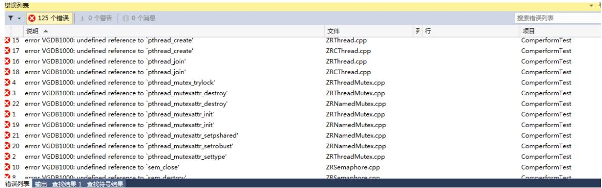  
图 34 缺失 pthread 报错图

当缺失dl库时通常会有以下报错：

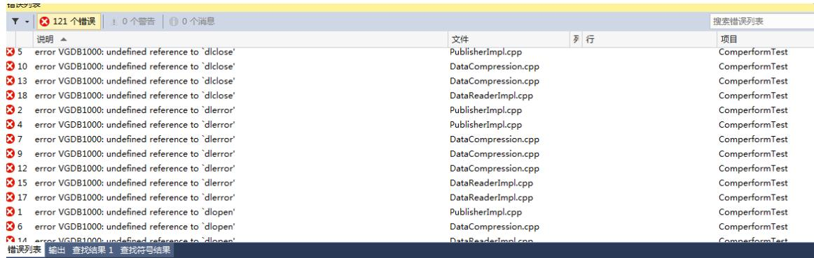  
图 35 缺失 dl 库报错图

排查方式：

1) 查看是否添加 pthread 库。

2) 查看是否添加 dl 库。

## 3.1.7 丢失 Psapi.lib

Zrdds 版本> =2.3.3

在使用VS2008、VS2010 编译和WindowsXP版本程序时，由于版本问题可能会缺少一个系统库 Psapi.lib；

报错信息如下：

.⊥.me风用洲口誤坏，止风用里，付冰士快  
“/LTCG”规范)  
版本\vs\_2008\_x32\ZRDDS\ZRDDS-2.3.3\examples\cpp\ide\Debug\DataReceiveByListener\_Subscription\_i8f  
:error LNK2001:无法解析的外部符号 EnumProcessModules@16  
:errorLNK2001:无法解析的外部符号\_GetModuleFileNameExA@16  
32\ZRDDS\ZRDDS-2.3.3\examples\cpp\ide\Debug\DataReceiveByListener\_Subscription\_i86Win32VS2008.e:  
20220928\版本\vs 2008 x32\ZRDDS\ZRDDS-2.3.3\examples\cpp\ide\DataReceiveByListener Subscription'  
- 3 个错误，1 个警告  
姚讨 0个==========

解决：在链接器里加 Psapi.lib 即可；

## 3.1.8 VS2015 版本（update 3）和库不匹配

原因：用老版本的编译器链接新版本编译器编出来的库，报版本对不上；报错信息如下：

示输出来源(S):生成 之  
1> 正在生成代码  
1> ZRDDSCppzd\_VS2015.lib(ZRBuiltinTypeCPlusPlusSequence.obj)：找到 MSIL.netmodule或使用 /GL 编译的模块；正在使用 /LTCG 重新启动链接；将 /LTCG 添加到链接命令行以改  
1>LINK：warning LNK4075：忽略“/INCREMENTAL”(由于“/LTCG”规范）  
1>main\_pub.obj:warning LNK4075:忽略“/EDITANDCONTINUE”(由于“/OPT:LBR”规范)  
1>LINK：fatal error C1900:“P1”(第“20150812”版)和“P2”(第“20130802”版)之间I1 不匹配  
1>LINK：fatal error LNK1257: 代码生成失败  
生成：成功0个，失败1个，最新0个，跳过0个

解决方案：

1） 更新 VS2015 update 3 版本；

## 3.2 初始化失败

## 3.2.1 报错

一般情况下，DDS初始化失败会打印错误日志来提示失败的原因，以下为常见的初始化失败场景。

## 3.2.1.1 Licence 验证

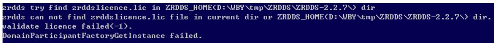  
图 36 licence 文件未找到

出现图36错误日志打印表示用户验证文件（zrddslicence.lic）没有找到。DDS会在环境变量\${ZRDDS\_HOME}所表示目录和当前程序的运行目录下查找用户验证文件。因此，出现图36问题需要确认上述目录下是否有用户验证文件、用户验证文件是否被重命名等。

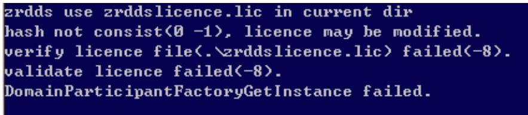  
图 37 licence 文件被修改

出现图 37 错误日志打印表示 DDS 成功读取到了用户验证文件（zrddslicence.lic），但文件内容修改导致验证不成功。用户验证文件不允许修改，修改导致无法验证成功需要将文件修改还原，若无法还原则需向我司重新申请用户验证文件。

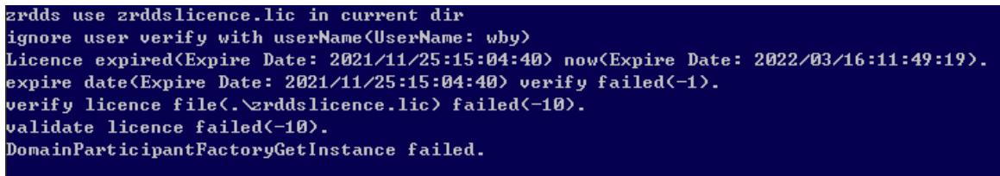  
图 38 licence 文件过期

出现图 38 错误日志打印表示当前系统时间不在用户验证文件的有效时间范围中，用户验证文件中的时间是按现实中的时间设置的，所以在使用时要确保系统时间和现实时间对应。

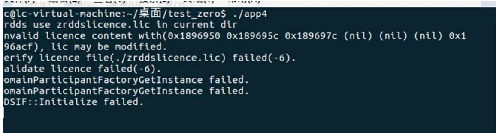  
图 39 licence 文件格式错误

如图 39 错误日志打印，当 lic 文件没有更改文本格式时，例如 windows 下的 lic 文件在linux 下使用时同样也会报 lic 被修改的报错，并且返回值是-6; 在 notepad 里可以更改文本格式

## 3.2.1.2 网络环境

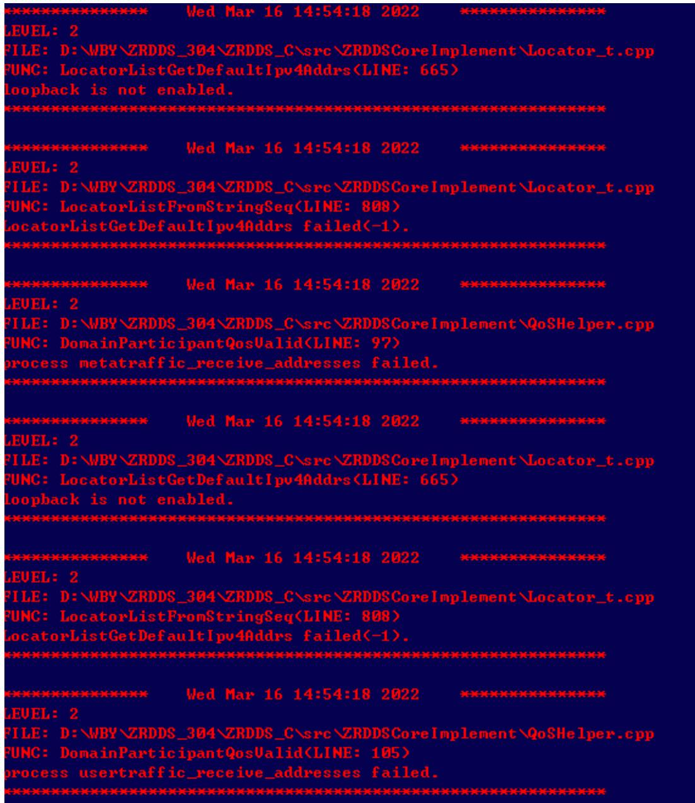  
图 39 没有可用网卡

出现图39错误日志打印时，表示 DDS没有找到可用的网卡，并且没有打开使用本地回环的选项。当使用场景为多台设备进行通信时，出现这个错误需要检查当前设备是否有可使用的网卡、网线连接是否正常。当使用场景为单台设备自发自收时，出现这个错误需要确定qos配置中是否禁止了本地回环的使用。

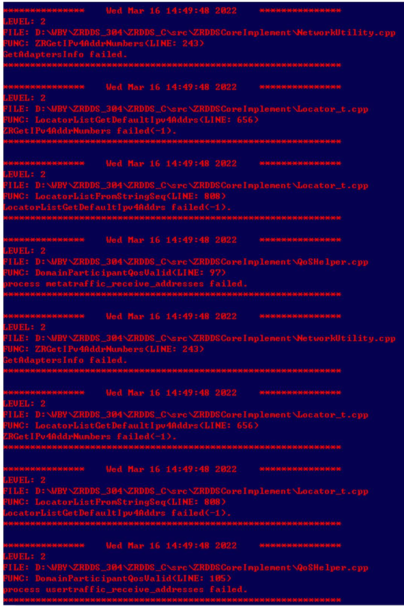  
图 40 没有网卡

windows出现图40 错误日志打印时，表示 DDS没有找到任何网卡。这种情况下需要检查是否将本机的网卡都禁用了。

## 3.2.2 崩溃

在使用 DDS 进行初始化过程中出现问题时，一般情况下只会进行错误日志打印，不会造成程序崩溃。为了分析确定具体的崩溃原因，以下为一些必要的检查措施：

确定 DDS 版本信息。默认情况下 DDS 的版本信息会在程序和日志文件中打印，是 DDS相关的第一条日志打印。图 41即为程序中的DDS版本信息打印，version<>中表示的是 DDS版号，was compiled at后面的时间表示当前使用的DDS库编译生成的时间。图42为DDS日志文件中的版本信息，DDS 日志文件以程序名作为文件名，以 ddslog 作为文件后缀，如test.exe.ddslog。DDS日志文件会保存在程序运行的目录下（与程序所在目录进行区分）。

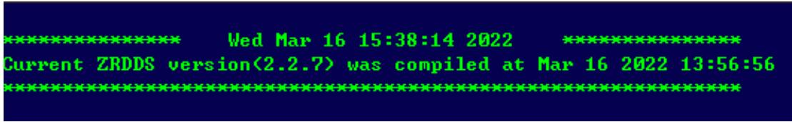  
图 41 程序中的 DDS 版本信息打印

Wed Mar 16 15:38:14 2022   
Current ZRDDS version(2.2.7) was compiled at Mar 16 2022 13:56:56   
大火火火火火火火火火火火火火火火火火火火火火火火火火火火火火火火火火火火火火火火火火火火火火火火火火火火火火火火火火火火火火  
图 42 日志文件中的 DDS 版本信息打印

检查工程配置。参照 ZRDDS安装配置手册，检查相应的工程配置过程是否有误或遗漏。检查头文件和库是否匹配。通过查看程序所使用的库和头文件 ZROSDefine.h（ZRDDSCoreInterface目录下）的修改时间，可以简单判断两者是否匹配。

检查是否判断返回值。在 3.2.1 中，DDS 初始化失败打印错误日志之后，函数调用会返回空指针不会是成功之后的 DDS 对象。如果对返回值没有进行空指针判断而直接进行后续操作，就会造成崩溃问题。

## 3.2.3 其他

## 3.2.3.1 linux 验证卡死

linux上在启动 DDS时，可能会遇到程序卡在 licence验证，无法正常运行下去。这种情况可能是由于之前一次程序启动时，在进行 licence 验证时，程序提前退出导致有个信号量没有销毁，之后再启动程序会获取到之前的信号量，卡在等待信号量释放。

验 证 和 解 决 方 法 如 图 43 所 示 ， 到 /dev/shm 目 录 下 ， 查 看 是 否 有 sem.ZRDDSUserValidatorSemaphore 这个文件，将这个文件删除即可。

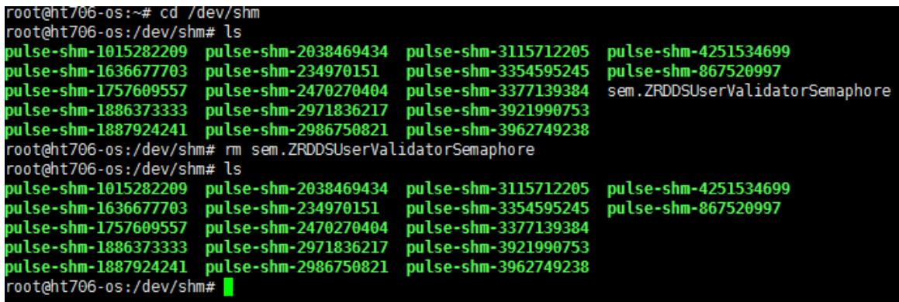  
图 43 销毁信号量

## 3.3 收不到数据

## 3.3.1 网络环境检测

（1） 使用ping命令查看相关节点网络是否联通（具体操作参见2.1）；

（2） 使用iperf/sockperf进行组播收发测试（具体操作参见2.1）：

a) 多网卡情况下的组播测试；

b) 如果不通需检查组播路由、防火墙设置；

（3） 操作系统是否安装了安全、杀毒软件，如360安全卫士/360杀毒，江民等。如有，请彻底退出并卸载后再次尝试。或将 DDS 应用程序设置为软件的白名单；

（4） 网络内是否有相同 IP的节点，常见如：本机有多个网卡或多个 IP，分别参与了不同子网，而其它网内有相同的IP节点。如目前大部分银河麒麟机器上预装了 docker，这导致每个机器上都有 docker0网卡，且不同机器上的 docker0 网卡大概率被预设为默认一致的地址（默认为172.12.0.1）。DDS 可能会误用该网卡的地址导致数据发送至这个 docker 网卡的地址中，最终导致无法通信。这种情况下，建议通过以下方式进行处理：

a) 修改 IP 地址；

b) 通过可配置性屏蔽指定网卡；

通过配置文件修改qos

```xml
<participantfactory_qos>
<property>
<value>
<element>
<name>sysctl.global.network.disabled_interface</name>
<value>docker0</value>
<propagate>false</propagate>
</element>
</value>
</property>
</participantfactory_qos>
```

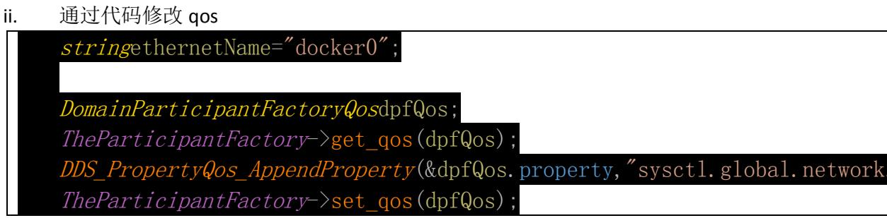  
（5） 运行安装包下的测试例子验证是否能够运行成功；

## 3.3.2 ZRDDS 配置检测

（1） 是否相同域

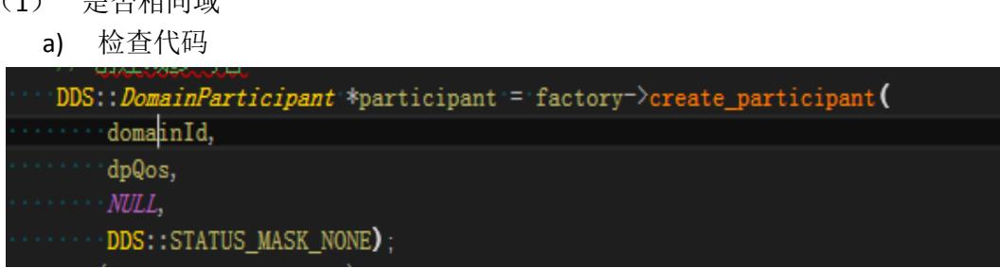  
图 44 创建域参与者

b) 监控器查看域号信息

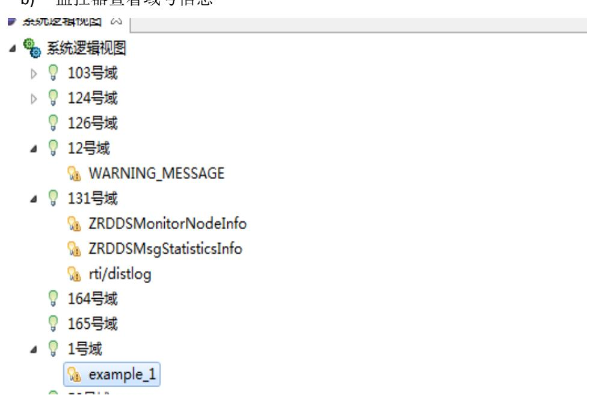  
图 45 监控器域视图

## （2） 主题名、类型名是否匹配

## a) 检查代码

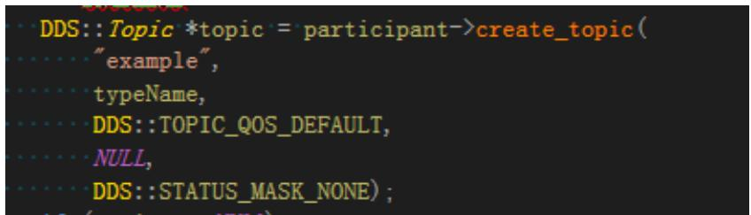  
图 46 创建主题

b) 监控器查看主题信息（截图）；

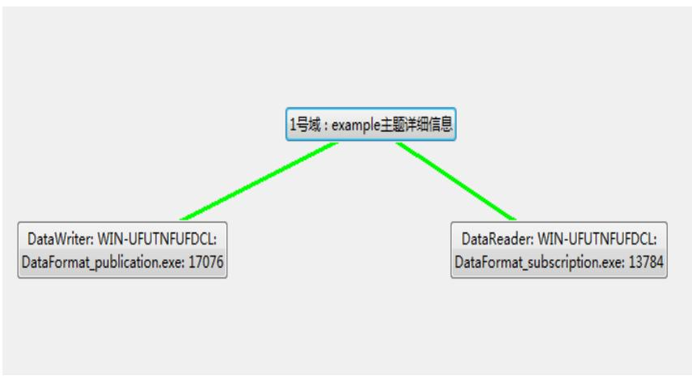  
图 47 主题信息

（3） QoS是否兼容

a) 检查代码

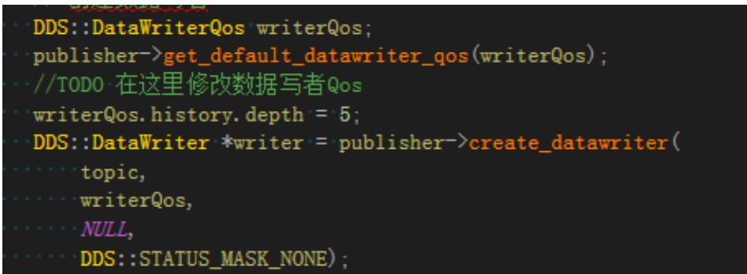  
图 48 创建数据写者

b) 查看是否有 QoS 不匹配的日志信息；

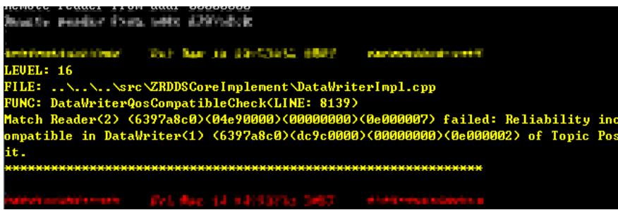  
图 49 Qos 不匹配打印

c) 监控器查看实体信息（截图）；

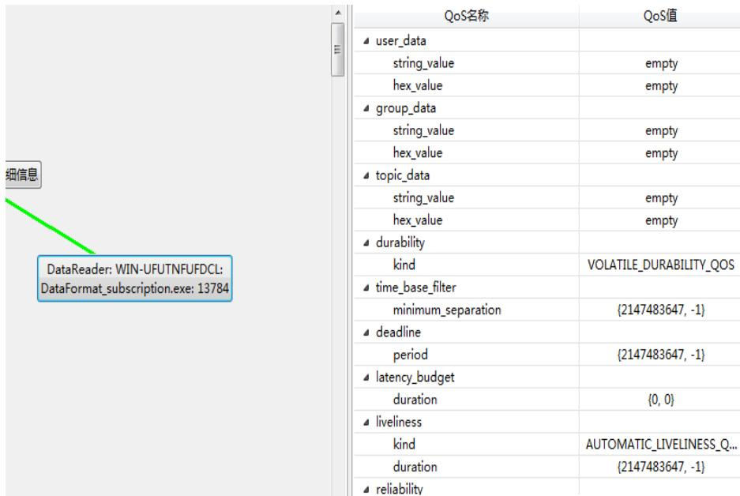  
图 50 实体 Qos 信息视图  
（4） 配置的地址不正确

a) 配了两个不同的网段

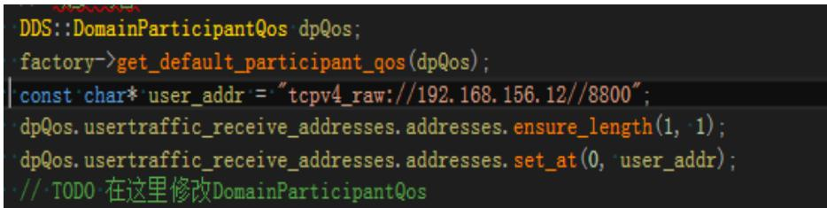  
图 51 配置域参与者使用的地址

b) 自动地址排序是否正确（查看日志）

日志号（49），参见2.2.3

## 3.3.3 高级诊断

如果环境、ZRDDS配置检测均正确，且发送成功：

1、确认网络中确实有数据发送至本节点。抓包确认发送方节点是否有向本节点发送数据，且指向端口正确，且该端口被 DR 所在进程正确地监听。如果没有，需要考虑发送是否成功或者节点之间的网络问题；

2、可靠传输的情况下，可以查看发送方节点向本节点发送的数据中，是否有 DATA 或DATA\_FRAG 的消息。如果有，可以通过 writerSeqNumber 查看这些 DATA/DATA\_FRAG是否一直是同一包：

submessageId: DATA (0x15)   
Flags: 0x05, Data present, Endianness bit   
octetsToNextHeader: 64   
0000 0000 0000 0000 = Extra flags: 0x0000   
Octets to inline QoS: 16   
readerEntityId: 0x0b000004 (Application-defined reader (no key): 0x0b0000)   
writerEntityId: 0x0d000003 (Application-defined writer (no key): 0x0d0000)   
writerSeqNumber: 3   
serializedData  
图 52 DATA 子消息

如果一直是同一包，则可以考虑是否用户未取数据。或是 DataReader 中有关ResourceLimit的处理存在异常，这种情况下，需要使用日志进一步进行分析。

3、可靠传输的情况下，如果抓包中未看到DATA或DATA\_FRAG 类型的子消息，只能看到 HEARTBEAT、ACK\_NACK 或 NACK\_FRAG。则可以：

a) 查看通过 firstAvailableSeqNum 及 lastSeqNum 来确认 HEARTBEAT 的数据范围。HEARTBEAT 是数据写者表明自身保存的数据序号范围的子消息。正常情况下，如果开启了内存持久化，则持有数据量不超过 resourceLimitQos 中设置的max\_samples\_per\_instance 的 数 值 ； 如 果 未 开 启 内 存 持 久 化 ， 则 不 超 过historyQos 中 depth 的数值。如果 firstAvailableSeqNum>lastSeqNum，说明数据写者中已经没有数据，请确认数据写者调用write时的返回值及网络环境状况；

submessageId: HEARTBEAT (0x07)   
Flags: 0x01, Endianness bit   
octetsToNextHeader: 28   
readerEntityId: 0x0b000004 (Application-defined reader (no key): 0x0b0000)   
writerEntityId: 0x0d000003 (Application-defined writer (no key): 0x0d0000)   
firstAvailableSegNumber: 3   
lastSeqNumber: 3 说明该DW的内存中的数据范围为[3,3]   
count: 5  
图 53 HEARBEAT 子消息

b) 如果确认HERATBEAT没有异常，则可以确认数据读者的相关状况。

ACKNACK 分为两种类型，一种是表明“ACK”，告知数据写者已收到，可以继续往下发。还有一种表明“NACK”，即告知数据写者自身确实的数据，请求重传。

如下图所示为“ACK”。bitmapBase 为 4，numBits 为 0，表明该数据读者已经收到了 SN=3 的数据，可以开始接收 SN=4的数据了。

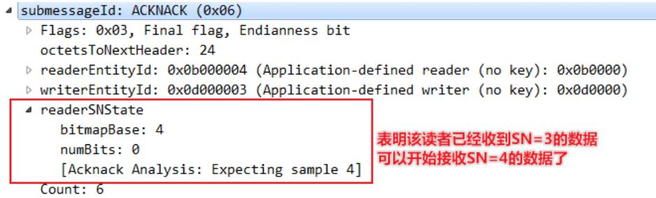  
图 54 ACKNACK 子消息“ACK”

如下图所示，为“NACK”。bitmapBase 为 103454，numBits 为 1，表明从注意，数据读者的“NACK”所请求的 SN 理应在数据写者所发的HEARTBEAT范围之内，“ACK”则应比数据写者的 HEARTBEAT 的 lastSeqNum 大 1，否则说明数据读者处理 HEARTBEAT 的过程存在异常。这种情况下，需要使用日志进一步进行分析。如果ACKNACK 没有异常，且一直处于“ACK”的状态，则需要确认数据写者的数据是否发送成功？或考虑数据写者的数据发送流程异常，此时，需要进一步使用日志进行确认。

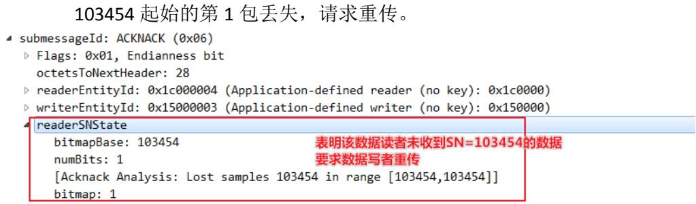  
图 55ACKNACK 子消息“NACK”

c) 如果 ACKNACK 中，存在“NACK”类型的消息。则需要检查数据读者向数据写者发回 NACK 后，数据写者是否有向数据读者重发该 NACK 所指向的 SN 的数据（DATA/DATA\_FRAG），或是否有向数据读者发送GAP。如果以上都无，而是周期性（默认为3秒）继续发送与之前一模一样的HEARTBEAT，则需要考虑数据写者处理HEARTBEAT 的逻辑异常，需要进一步使用日志进行分析。

4、使用日志进行分析。详见2.2.3 常用调试日志号。

## 3.4 通信异常

## 3.4.1 序列化/反序列化失败

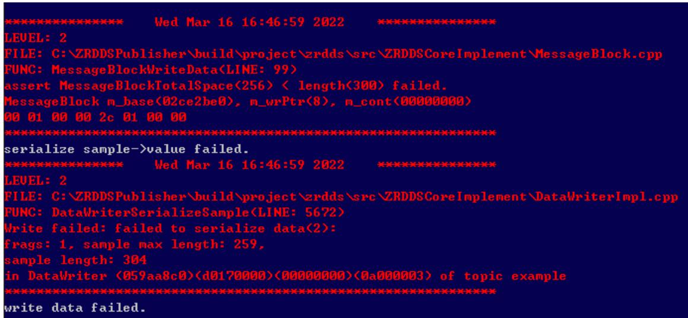  
图 56 序列化失败

图 56 为 DDS 发送方发送时序列化数据失败，从而导致发送失败。图 56 中的序列化失败的原因是给 sequence 设置的大小超过了最大可设置大小 256B。通过 idl 生成自定义数据

类型时，默认情况下（zrddsgen 没有加-u 参数）sequence 最大为 256B。zrddsgen 生成时加上-u 参数，则 sequence 大小可以设置大于 256B。

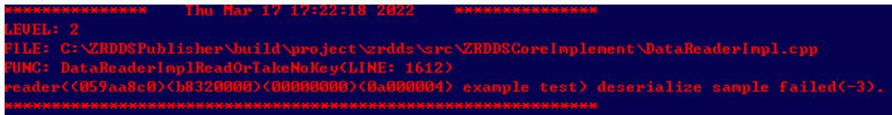  
图 57 反序列化失败

图 57 中的错误日志表示数据接收时数据反序列化失败，出现这个问题的原因可能是收发两边数据类型同名但内部结构不同。根据最后返回的错误码可以在 idl 生成的文件中对应反序列化函数内查看具体的失败原因。

## 3.4.2 丢包严重

使用DDS出现丢包严重问题的原因大致可以分为两部分：

 处理耗时。在接收程序中，如果在接收回调中进行长时间处理，就可能导致数据接收不及时而丢失。在接收回调中尽量只做一些数据拷贝存储的操作，将耗时的处理在其他地方其他线程进行。

网络问题。出现丢包或者使用 DDS 之前，最好测试一下网络本身的丢包情况，如果网络本身丢包就很严重，DDS也就无法确保能够完全可靠不丢包。同时网络丢包除了直接影响数据通信，还可能影响程序之间 DDS 维持匹配的机制，出现反复断开匹配也会产生丢包的现象。

## 3.4.3 数据中断

通信过程中出现数据中断问题，在没有错误日志打印的情况下，可能的原因为 dp超时导致收发匹配断开。

判断是否存在dp超时可以通过使用交互式日志的方法，参考交互式日志的使用方法，打开dp超时下线的日志号，观察数据中断时是否有相应日志打印。

dp超时下线是因为在一定时间内没有收到 dp的发现数据。由于发现数据的收发是不可靠的，发现数据就可能因为网络问题频繁丢包导致判断下线。另一方面如果dp的发现数据发送频率过低，而超时时间又相对较小，则轻微的网络问题可能导致发现数据少量丢包就判断超时，更容易判断下线。

## 3.4.4 发送失败

DDS 发送失败的原因需要根据实际错误日志来分析，如 3.4.1 中序列化问题会导致发送失败，以下为常见的发送失败情况。

使用可靠模式进行 udp 通信时，如果接收方在接收回调的处理耗时过长，可能导致发送方发送队列中的数据无法及时确定已接收，队列数据来不及清理，从而使新的数据无法加入队列发送，数据发送失败，出现图58中警告日志。

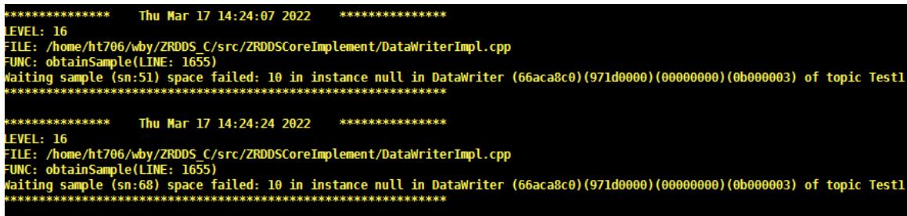  
图 58 发送队列已满

## 3.4.5 网络中断

使用TCP协议通信时，由于网络中断导致通信异常会有相应的日志信息。当网线连接异常或其他原因导致网络中断时，数据发送超时，会尝试 TCP 重新连接，直到重新连接成功，如图 59、图 60、图 61、图 62。

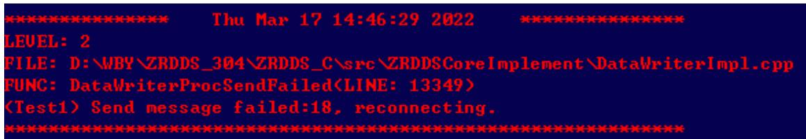

图 59 发送失败（超时）  
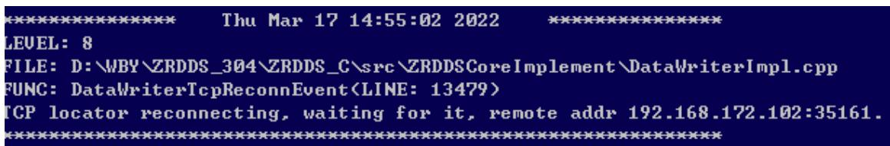

图 60 尝试重连  
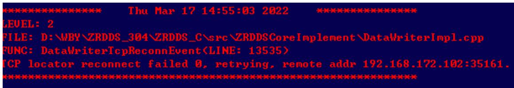

图 61 重连失败  
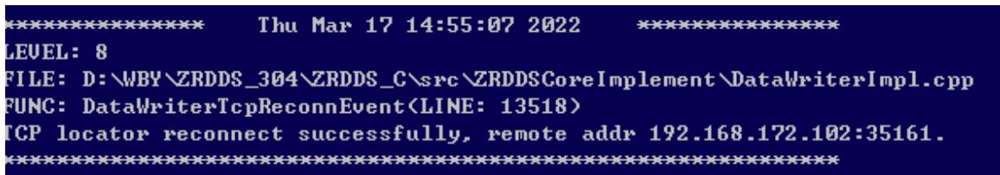  
图 62 重连成功

在通信过程中如果将网卡禁用，会导致dp的组播发现数据发送失败，出现图63中的错误日志。

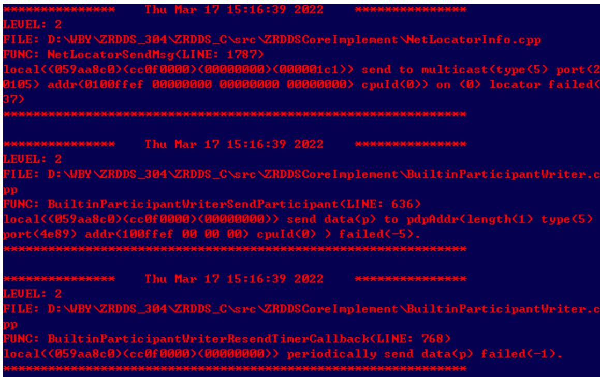  
图 63 组播发送失败

## 3.5 异常崩溃

检查异常崩溃通常分为以下情况：

1.读取未赋值的变量；

（1）一个变量未初始化、未赋值，就读取它的值。

2.函数栈溢出

（1）定义了一个体积太大的局部变量

（2）函数嵌套调用，层次过深（如无穷递归）

## 3.数组访问越界

（1）访问数据元素时，下标越界

4.指针的目标对象不可用

（1）空指针

（2）野指针

 指针未赋值

 free/delete 释放了的对象

 不恰当的指针强制转换

Windows 下（以 VS 为例）：

第一步：根据报错值，初步判断是哪种类型的崩溃

“The variable is being used without being intialized.”代表读取未赋值的变量。

“Stack overflow 代表函数栈溢出

“Stack around the variable was corrupted”代表数组访问越界

“未处理的异常：0xC0000005:读取位置0x00000000时发生访问冲突”代表指针的目标对象不可用

第二步：在debug模式下进行调试，当程序运行崩溃时，如图64所示在界面中点击“中断”按钮。

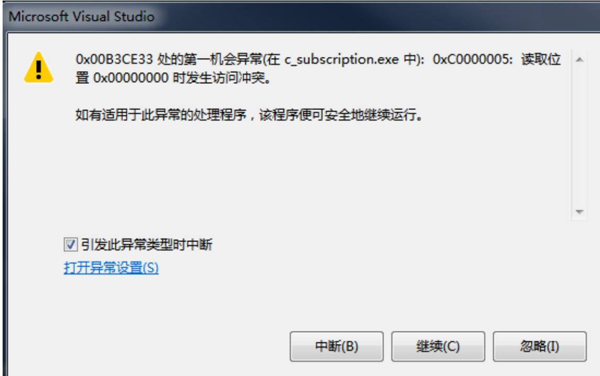  
图 64 程序崩溃图

第三步：打开“调用堆栈”窗口，这个窗口可以直接观察到发生错误的时候、函数栈的各层函数的信息。（如果没有显示这个窗口，可从菜单里“调试|窗口|调用堆栈”里打开）。

“调用堆栈”窗口里可以观察到：

 函数的调用层次

 每一次函数里的局部变量（含参变量）的值

 全部变量的值

第四步：

1.若是函数的栈越界，需要一步一步来调试，并配合系统自带的“任务管理器”来确定是哪些步骤导致了内存快速上涨，并分析上涨原因。

2.若是野指针，则需要一步一步进行调试，来查看该指针在哪里被改变了。

Linux:

若现场有程序源码，可以借用Visual GDB进行调试（具体使用详见“调试器”使用章节）；若没有则需要使用core dump + gdb的方法来查找原因。

第一步：保存core 文件，两种保存方式

1.在程序启动前，输入“ulimit -c unlimited”代码，此命令只会对当前终端有用。

2.修改/etc/security/limits.conf 文件，在文件中增加一行

# /etc/security/limits.conf   
#   
#Each line describes a limit for a user in the from

#   
#<domain><type><item><value>   
\* soft core unlimited

第二步：运行程序。当崩溃后，找到 core 文件（默认情况下，core 文件在执行文件所在目录下，名字为core），查看core 文件的大小，若文件过大，需要考虑是不是函数栈溢出；

第三步：使用“gdb program core”加载 core 文件，其中 program 为可执行程序名，core为生成的core 文件名；

第四步：加载 core 文件之后，系统一般会打印如所示的信息，通过查看信号量，来初步判断问题原因。

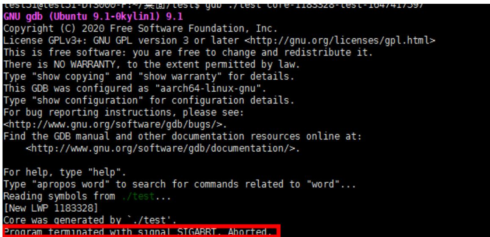  
图 65 GDB 加载 core 文件

注：程序崩溃，常见的信号量为 sinal SIGABRT(6)和 sinal SIGSEGV(11)。SIGABRT 一般是多次调用 free、fclose 等函数造成的；SIGSEGV 代表是非法内存访问，有可能是函数的栈溢出，使用空指针等造成，需要进一步分析。

第五步：使用bt命令查看函数调用栈信息，常用命令如下：

“bt”是”backtrace”的缩写，使用“bt”或者“backtrace”都可以  
bt<n>：n是一个正整数，表示只打印栈顶上 n层的信息；  
bt<-n>：-n表示一个负整数，表示只打印栈底下n层的信息。

第六步：使用f命令查看某栈层的信息，常用命令如下：

第七步：使用info命令查看详细信息，常用命令如下：

info f：打印详细的当前栈层的信息  
info args：打印出当前函数的参数名及其值  
infolocals：打印出当前函数中所有局部变量及其值

第八步：使用GDB 进行调试，常用命令如下：

(gdb)help：查看命令帮助，具体命令查询在 gdb中输入 help+命令，简写 h  
(gdb)run：重新开始运行文件(run-text：加载文本文件；run-bin：加载二进制文件)，  
简写r  
(gdb)start：单步执行，运行程序，停在第一执行语句

(gdb)list：查看源代码（list-n：从第 n行开始查看代码；list+函数名：查看具体函数），简写l(gdb) set：设置变量的值(gdb)next：单步调试（逐过程，函数直接执行），简写n(gdb)step：单步调试（逐语句，跳入自定义函数内部执行），简写 s(gdb)backtrace：查看函数的调用的栈帧和层级关系，简写b(gdb) frame：切换函数的栈帧，简写 f(gdb)info：查看函数内部局部变量的数值，简写i(gdb)finish：结束当前函数，返回到函数调用点(gdb) continue：继续执行，简写 c(gdb) print：打印值及地址，简写 p(gdb) quit：退出 gdb，简写 q(gdb) break+num：在第 num 行设置断点，简写 b(gdb) info breakpoints：查看当前设置的所有断点(gdb) delete breakpoints num：删除第 num 个断点，简写 d(gdb) display：追踪查看具体变量的值(gdb) undisplay：取消追踪观察变量(gdb)watch：被设置观察点的变量发生修改时，打印显示(gdb) i watch：显示观察点(gdb) enable breakpoints：启用断点(gdb) disable breakpoints：禁用断点(gdb) x：查看内存(gdb) run argv[1] argv[2]：调试时命令行传参

## 3.6 错误日志

## 3.6.1 日志索引

<table><tr><td rowspan=1 colspan=1>日志信息</td><td rowspan=1 colspan=1>章节号</td></tr><tr><td rowspan=1 colspan=1>local(%s) can not find available tcp/ip locators for remote(%s) in(%d %u) netRet(%d)</td><td rowspan=1 colspan=1>3.6.2</td></tr><tr><td rowspan=1 colspan=1>serialize * failed</td><td rowspan=1 colspan=1>3.6.3</td></tr><tr><td rowspan=1 colspan=1>domainId(%u) participant(%s) deserialize RTPSMsgHeader fromsrcAddr(%s) failed(%d).</td><td rowspan=1 colspan=1>3.6.4</td></tr><tr><td rowspan=1 colspan=1>Failed to set priority option for locator of Publisher %s,error %d.</td><td rowspan=1 colspan=1>3.6.5</td></tr><tr><td rowspan=1 colspan=1>Parse XML failed: %s.</td><td rowspan=1 colspan=1>3.6.6</td></tr><tr><td rowspan=1 colspan=1>Reliability has been disabled with ZeroCopyBytes writer %s ofTopic %s.</td><td rowspan=1 colspan=1>3.6.7</td></tr><tr><td rowspan=1 colspan=1>local(%s) no availiable port under domain(%d), release port orspecific port and retry.</td><td rowspan=1 colspan=1>3.6.8</td></tr></table>

## 3.6.2 无法找到对端可用地址

## 3.6.2.1 日志信息

local(%s) can not find available tcp/ip locators for remote(%s) in (%d %u) netRet(%d)  
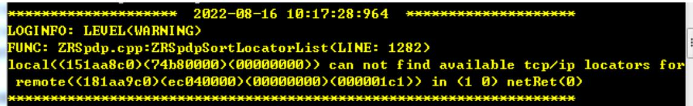

本地运行的 DDS 程序无法找到与远程 DDS 程序有效 IP 进行通信，远程 IP 的信息参见remote 后括号内的 16 进制数，图中转化为 IP 地址为 192.169.26.24。

## 3.6.2.2 原因

DDS 通过组播发现一个远端节点，远端 DDS 所在节点存在多个 IP 的情况下，DDS会通过尝试 TCP 连接选择可用的 IP 地址进行通信。本地节点与远端节点间不存在能够通信的IP地址时（地址均不在同一个网段）会打印本条日志。

此外，与远程的域参与者进行地址选择的过程的最长时间为可配置性"sysctl.global.net.auto\_sort\_timeout"（默认 1s）,当网络繁忙等原因导致在超时时间内未完成地址选取时也会报错。

## 3.6.2.3 可能导致的问题

（1） 未能正确选取远程DDS域参与者地址可能会导致无法传输数据。尝试建立连接的过程中；

（2） 如果连接失败通信线程最多会阻塞1s，当存在多个不能连接的节点时，可能会影响本节点数据的收发。

## 3.6.2.4 解决方法

（1） 配置通信双边节点IP到同一个网段。

（2） 通过设置域参与者的 meta\_traffic\_address 以及 user\_traffic\_address 为指定网段，此时DDS认为该节点上只有1个 IP时，不会尝试使用TCP建立连接。

（3） 当网络较差的情况下，通过可配置性适当延长地址选择时间。

（4） 域隔离，对不同网段的 DDS程序使用不同的域号，域参与者之间就不会尝试建立连接。

## 3.6.3 序列化失败

## 3.6.3.1 日志信息

输出”serialize \* failed“，序列化 sequence 类型数据失败。

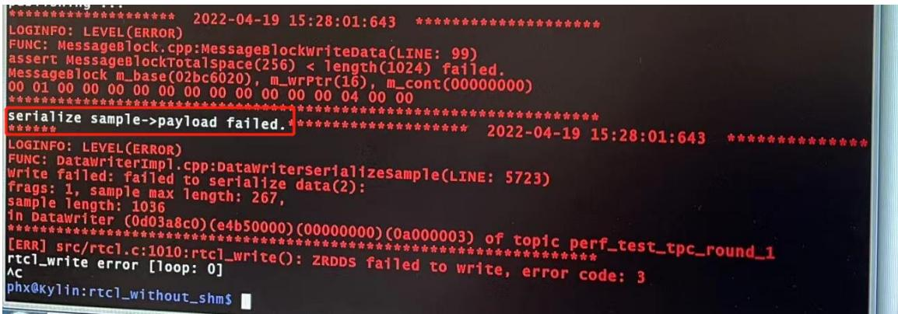  
图 66 序列化 sequence 数据失败

## 3.6.3.2 原因

用户发送 sequence 数据长度大于 idl 设置的最大长度，如果 idl 中没有设置最大长度则编译器使用默认值256.

检查，确认：struct 名.cpp 文件打开找到 StringSeqStructGetSerializedSampleMaxSize()，return256 之类的；

加完-u 之后：

68 DDS\_ULong StringSeqStructGetSerializedSampleMaxSize()   
return MAX\_UINT32\_VALUE;   
  
DDS\_ULong StringSeqStructGetSerializedKeyMaxSize()   
{   
return MAX\_UINT32\_VALUE;   
一

## 3.6.3.3 解决方法

以下两种方法：

（1） 设置较大长度限制，发送数据时不要超过长度限制。

（2） 编译器选项设置不限制 sequence长度，使用编译器时加入“-u”例：

## 3.6.4 发现不一致版本

## 3.6.4.1 日志信息

domainId(%u) participant(%s) deserialize RTPSMsgHeader from srcAddr(%s) failed(%d).

收到从源IP地址的 RPTS报文，报文头解析失败。

## 3.6.4.2 原因

网络中其他程序使用了非 ZRDDS 的其他 DDS产品，且该DDS 产品不符合 OMG 的 RTPS协议规范。

该现象不会影响 ZRDDS的正常通信。

## 3.6.4.3 解决方法

以下两种方法：

（1） 关闭非 ZRDDS的程序或者在网络上进行物理隔离；

（2） 使用符合 RTPS协议规范的DDS产品。

## 3.6.5 设置优先级失败

## 3.6.5.1 日志信息

Failed to set priority option for locator of Publisher %s, error %d.

Linux操作系统上设置优先级选项失败。

## 3.6.5.2 原因

该问题只会在Linux系统出现，设置socket通信优先级时需要root权限，普通用户启动程序时就会报错。

## 3.6.5.3 解决方案

该问题不影响DDS的正常通信，如需屏蔽该警告日志需要root权限启动。

## 3.6.6 XML 文件解析失败

## 3.6.6.1 日志信息

Parse XML failed: %s.

使用”\*\_w\_profile”接口时，解析 XML 配置失败。

## 3.6.6.2 原因

Qos 配置文件不符合 XML 规范。

## 3.6.6.3 解决方案

根据错误信息提示检查XML 配置文件内容。

## 3.6.7 零拷贝禁用可靠性策略

## 3.6.7.1 日志信息

Reliability has been disabled with ZeroCopyBytes writer %s of Topic %s.

在使用零拷贝数据通信时，DDS自动禁用了数据可靠性策略。

## 3.6.7.2 原因

使用零拷贝数据通信时，DDS不会拷贝数据进行存储，无法对数据进行重传操作，可靠性策略失效，所以DDS自动使用了尽力而为模式。

该警告日志不会影响正常数据通信。

## 3.6.7.3 解决方案

使用零拷贝数据类型通信时，将可靠性配置设置为尽力而为模式。

## 3.6.8 没有可用端口

## 3.6.8.1 日志信息

local(%s) no availiable port under domain(%d), release port or specific port and retry.  
在指定域下没有可用端口。

## 3.6.8.2 原因

根据DDS协议规定，每个可用的端口数量是250个，每个DP会占用两个端口，同一节点上同一域号最多创建124 个域参与者。当同一节点上同一域的参与者超过124 时端口会超出范围，创建参与者失败。

## 3.6.8.3 解决方案

一般情况下，一个应用内在一个域下只需要使用一个域参与者，应用内共用域参与者，减少域参与者数量。或者将域参与者分配到不同的域下或不同的节点上。

## 4 排故流程

1) 确认使用环境（计算机环境、编译环境，网络环境）；

2) 确认版本（如何获取版本号（以及使用编译语言），根据第一条日志判断版本号）；

3) 保留日志文件，是否有报错日志以及警告，根据日志分析；

4) 确认稳定复现场景（节点数量，数据流向，操作流程）；

5) 在以前故障中匹配是否有类似的故障；

6) 记录问题情况，进行分析与讨论，尝试复现；

7) 记录问题解决方案，举一反三思考其他可能问题；

8) 生成修复版本；

9) 形成问题归零报告。

## 附录 1socket 编程常见错误码及含义

<table><tr><td colspan="1" rowspan="1">c Name</td><td colspan="1" rowspan="1">Value</td><td colspan="1" rowspan="1">Description</td><td colspan="1" rowspan="1">含义</td></tr><tr><td colspan="1" rowspan="1">EINTR</td><td colspan="1" rowspan="1">1</td><td colspan="1" rowspan="1">Interrupted system call</td><td colspan="1" rowspan="1">中断的系统调用</td></tr><tr><td colspan="1" rowspan="1">EBADF</td><td colspan="1" rowspan="1">2</td><td colspan="1" rowspan="1">Bad file number</td><td colspan="1" rowspan="1">无效文件描述符</td></tr><tr><td colspan="1" rowspan="1">EWOULDBLOCK</td><td colspan="1" rowspan="1">4</td><td colspan="1" rowspan="1">Same as “EAGAIN"</td><td colspan="1" rowspan="1">与 EAGAIN 的含义类似</td></tr><tr><td colspan="1" rowspan="1">EAGAIN</td><td colspan="1" rowspan="1">5</td><td colspan="1" rowspan="1">Try again</td><td colspan="1" rowspan="1">再次尝试</td></tr><tr><td colspan="1" rowspan="1">EMSGSIZE</td><td colspan="1" rowspan="1">7</td><td colspan="1" rowspan="1">Message too long</td><td colspan="1" rowspan="1">消息太长</td></tr><tr><td colspan="1" rowspan="1">EADDRINUSE</td><td colspan="1" rowspan="1">8</td><td colspan="1" rowspan="1">Address already in use</td><td colspan="1" rowspan="1">地址已被使用</td></tr><tr><td colspan="1" rowspan="1">ENETUNREACH</td><td colspan="1" rowspan="1">10</td><td colspan="1" rowspan="1">Network is unreachable</td><td colspan="1" rowspan="1">网络不可达</td></tr><tr><td colspan="1" rowspan="1">ECONNRESET</td><td colspan="1" rowspan="1">14</td><td colspan="1" rowspan="1">Connection reset by</td><td colspan="1" rowspan="1">连接被重置</td></tr><tr><td colspan="1" rowspan="1">ENOBUFS</td><td colspan="1" rowspan="1">15</td><td colspan="1" rowspan="1">No buffer space available</td><td colspan="1" rowspan="1">没有可用的缓存空间</td></tr><tr><td colspan="1" rowspan="1">EISCONN</td><td colspan="1" rowspan="1">16</td><td colspan="1" rowspan="1">Transport endpoint is alreadyconnected</td><td colspan="1" rowspan="1">传输端点已连接</td></tr><tr><td colspan="1" rowspan="1">ENOTCONN</td><td colspan="1" rowspan="1">17</td><td colspan="1" rowspan="1">Transport endpoint is notconnected</td><td colspan="1" rowspan="1">传输端点未连接</td></tr><tr><td colspan="1" rowspan="1">ETIMEDOUT</td><td colspan="1" rowspan="1">18</td><td colspan="1" rowspan="1">Connection timed out</td><td colspan="1" rowspan="1">连接超时</td></tr><tr><td colspan="1" rowspan="1">ECONNREFUSED</td><td colspan="1" rowspan="1">20</td><td colspan="1" rowspan="1">Connection refused</td><td colspan="1" rowspan="1">连接被拒绝</td></tr><tr><td colspan="1" rowspan="1">EINPROGRESS</td><td colspan="1" rowspan="1">22</td><td colspan="1" rowspan="1">Operation now in progress</td><td colspan="1" rowspan="1">进程中正在进行的操作</td></tr><tr><td colspan="1" rowspan="1">EALREADY</td><td colspan="1" rowspan="1">23</td><td colspan="1" rowspan="1">Operation already inprogress</td><td colspan="1" rowspan="1">操作已在进程中</td></tr><tr><td colspan="1" rowspan="1">EINVAL</td><td colspan="1" rowspan="1">26</td><td colspan="1" rowspan="1">Ivaild argument</td><td colspan="1" rowspan="1">无效参数</td></tr><tr><td colspan="1" rowspan="1">EMFILE</td><td colspan="1" rowspan="1">27</td><td colspan="1" rowspan="1">Too many open files</td><td colspan="1" rowspan="1">打开的文件过多</td></tr><tr><td colspan="1" rowspan="1">ENOTSOCK</td><td colspan="1" rowspan="1">28</td><td colspan="1" rowspan="1">Socket operation onnon-socket</td><td colspan="1" rowspan="1">在非套接字上进行套接字操作</td></tr><tr><td colspan="1" rowspan="1">EDESTADDRREQ</td><td colspan="1" rowspan="1">29</td><td colspan="1" rowspan="1">Destination address required</td><td colspan="1" rowspan="1">请求目的地址</td></tr><tr><td colspan="1" rowspan="1">EOPNOTSUPP</td><td colspan="1" rowspan="1">34</td><td colspan="1" rowspan="1">Operation not supported ontransport endpoint</td><td colspan="1" rowspan="1">操作上不支持传输端点</td></tr><tr><td colspan="1" rowspan="1">EAFNOSUPPORT</td><td colspan="1" rowspan="1">36</td><td colspan="1" rowspan="1">Address family not supportedby protocol</td><td colspan="1" rowspan="1">协议不支持地址群</td></tr><tr><td colspan="1" rowspan="1">EADDRNOTAVAIL</td><td colspan="1" rowspan="1">37</td><td colspan="1" rowspan="1">Cannot assign requestedaddress</td><td colspan="1" rowspan="1">无法分配请求的地址</td></tr><tr><td colspan="1" rowspan="1">EPERM</td><td colspan="1" rowspan="1">56</td><td colspan="1" rowspan="1">Operation not permitted</td><td colspan="1" rowspan="1">操作不允许</td></tr><tr><td colspan="1" rowspan="1">EIO</td><td colspan="1" rowspan="1">59</td><td colspan="1" rowspan="1">1/0 error</td><td colspan="1" rowspan="1">I/0 错误</td></tr><tr><td colspan="1" rowspan="1">EPIPE</td><td colspan="1" rowspan="1">77</td><td colspan="1" rowspan="1">Broken pipe</td><td colspan="1" rowspan="1">管道破裂</td></tr></table>